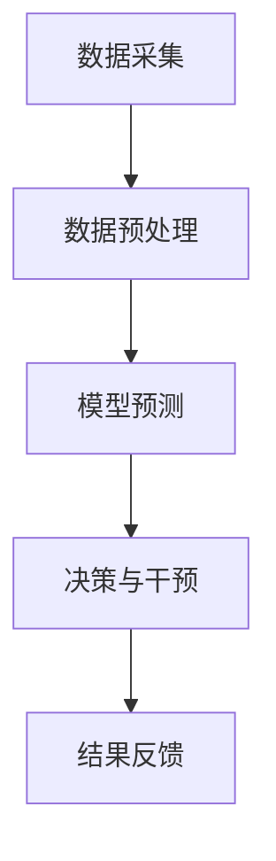

                 

### 引言与背景

#### 1.1 智能婴儿监护器的需求与背景

随着科技的飞速发展，人工智能（AI）技术在各个领域得到了广泛应用，从医疗保健到智能家居，再到工业自动化。在这些领域中，智能婴儿监护器作为AI技术的应用之一，日益受到关注。智能婴儿监护器是一种利用先进的人工智能技术，对婴儿的生理状态和行为进行实时监测和分析的设备。这种设备的出现，不仅能够提供对婴儿健康状况的持续监控，还能在出现异常情况时及时发出警报，从而保障婴儿的安全。

##### 1.1.1 婴儿监护的重要性

婴儿作为一个脆弱的生命阶段，需要特别的关注和保护。婴儿的生理系统尚未完全发育，因此他们更容易受到外界环境的影响。例如，新生儿窒息、婴儿猝死综合症（SIDS）等都是婴儿早期死亡的主要原因。传统的人工监护方式存在许多局限，比如家长的疲劳、无法全天候监护、监护信息的滞后性等问题。因此，智能婴儿监护器的需求应运而生。

##### 1.1.2 智能监护技术的兴起

智能监护技术的兴起主要得益于以下几个方面：首先是传感技术的进步，使得对婴儿生理指标的监测变得更加精准和高效；其次是数据处理能力的提升，大数据和云计算技术的发展为婴儿监护数据的存储、分析和处理提供了强有力的支持；再次是机器学习算法的突破，使得AI能够从大量的数据中提取有价值的信息，对婴儿的状态进行实时分析和预测。随着这些技术的不断进步，智能婴儿监护器正在逐步成为现代家庭的重要守护者。

#### 1.2 智能婴儿监护器的发展趋势

智能婴儿监护器的发展趋势主要体现在以下几个方面：

##### 1.2.1 技术演进

随着AI技术的不断进步，智能婴儿监护器正从简单的生理指标监测，逐步发展到多模态数据的综合分析。例如，除了传统的体温、心率等监测指标外，智能婴儿监护器还可以监测婴儿的呼吸、活动情况、睡眠质量等。通过多模态数据的综合分析，监护器能够更准确地判断婴儿的健康状况，提供更为全面的监护服务。

##### 1.2.2 市场前景

随着人们对婴儿健康关注度的提高，智能婴儿监护器的市场需求也在不断增长。特别是在一些发达国家和地区，父母们更加倾向于使用智能监护设备来保障婴儿的安全。此外，随着人工智能技术的普及，智能婴儿监护器的成本也在逐渐降低，使其更加普及化，成为更多家庭的必备品。

### 核心概念与联系

#### 2.1 AI Agent的定义与分类

##### 2.1.1 AI Agent的概念

AI Agent，即人工智能代理，是指能够模拟人类行为，具有一定智能水平，能够与环境进行交互并自主执行任务的实体。AI Agent的核心在于其自主性和智能性，它们通过学习、推理和决策来完成任务。

##### 2.1.2 AI Agent的分类

AI Agent可以根据不同的分类标准进行分类：

- **按功能分类**：AI Agent可以分为感知类、决策类和执行类。感知类Agent主要负责获取环境信息，决策类Agent负责根据感知信息做出决策，执行类Agent负责执行决策。

- **按智能水平分类**：AI Agent可以分为弱AI和强AI。弱AI是指只具备特定任务能力的AI，如语音识别、图像识别等；强AI则是指具备人类一般智能水平的AI，能够在各种复杂环境下自主学习和执行任务。

#### 2.2 婴儿状态监测的基本原理

##### 2.2.1 婴儿生理指标监测

婴儿生理指标监测是智能婴儿监护器的核心功能之一。常见的生理指标包括体温、心率、呼吸频率、活动水平等。这些指标能够反映婴儿的生理状态，通过实时监测，可以及时发现异常情况。

- **体温监测**：体温是反映婴儿健康状况的重要指标之一。异常的体温变化可能预示着婴儿感染或其他健康问题。

- **心率监测**：心率是生命体征之一，能够反映婴儿的心脏健康状态。异常的心率变化可能是心脏疾病或其他严重健康问题的征兆。

- **呼吸频率监测**：呼吸频率是监测婴儿呼吸状况的重要指标。呼吸频率的改变可能预示着婴儿的窒息或呼吸困难。

- **活动水平监测**：婴儿的活动水平可以反映其健康状况和睡眠质量。长时间的不活动或过度活动都可能是异常状况的信号。

##### 2.2.2 婴儿行为监测

除了生理指标，婴儿的行为监测也是智能婴儿监护器的重要组成部分。通过监测婴儿的行为，可以了解其情绪状态、睡眠质量、活动习惯等。

- **睡眠监测**：婴儿的睡眠质量对其生长发育至关重要。智能婴儿监护器可以通过监测婴儿的睡眠状态，评估其睡眠质量，并提供改善建议。

- **情绪状态监测**：婴儿的情绪状态可以通过其面部表情、声音变化等行为特征进行监测。通过分析这些行为特征，可以了解婴儿的情绪变化，从而提供针对性的关爱和照顾。

#### 2.3 AI Agent与婴儿状态监测的联系

##### 2.3.1 AI Agent在婴儿监护中的应用

AI Agent在婴儿监护中的应用主要体现在以下几个方面：

- **实时监测与异常检测**：AI Agent可以实时监测婴儿的生理指标和行为，通过机器学习算法和深度学习模型，对监测数据进行分析和异常检测。一旦发现异常，AI Agent能够及时发出警报，提醒家长或医护人员采取行动。

- **智能决策与干预**：基于监测数据，AI Agent可以做出智能决策，例如调整婴儿的睡眠环境、提供安抚措施等。在某些紧急情况下，AI Agent还可以自动执行干预措施，如呼叫医护人员。

- **个性化服务与关怀**：AI Agent可以根据婴儿的生理和行为数据，提供个性化的监护服务。例如，根据婴儿的睡眠习惯调整监控策略，提供适合其年龄段的关爱和照顾。

##### 2.3.2 AI Agent与婴儿状态监测的结合方式

AI Agent与婴儿状态监测的结合方式主要有以下几种：

- **数据融合**：将婴儿的多种生理和行为数据进行融合，通过多模态数据分析，提高监测的准确性和全面性。

- **实时反馈与调整**：AI Agent可以根据实时监测数据，对监护策略进行调整，提高监护的灵活性和适应性。

- **自主学习与优化**：AI Agent可以通过不断学习和优化，提高对婴儿状态的预测和识别能力，从而提供更高质量的监护服务。

### 智能婴儿监护器的基本原理

#### 3.1 智能婴儿监护器的工作原理

智能婴儿监护器的工作原理可以概括为以下几个关键步骤：

##### 3.1.1 数据采集

智能婴儿监护器首先需要采集婴儿的生理指标和行为数据。这些数据通常通过传感器设备进行实时采集。传感器设备可以包括体温传感器、心率传感器、呼吸传感器、活动传感器等。通过这些传感器，监护器可以实时获取婴儿的生理状态和行为习惯。

##### 3.1.2 数据传输

采集到的数据需要通过无线网络或有线网络传输到中央处理单元。无线传输方式通常采用Wi-Fi、蓝牙等无线通信技术，而有线传输则通过USB、以太网等有线连接方式。数据传输的可靠性是确保监护器正常工作的关键。

##### 3.1.3 数据处理与分析

在中央处理单元，AI Agent会对采集到的数据进行处理和分析。首先，AI Agent会进行数据清洗和预处理，去除噪声和异常值，然后利用机器学习算法和深度学习模型对数据进行特征提取和模式识别。通过这些处理步骤，AI Agent能够从数据中提取有价值的信息，为后续的决策提供支持。

##### 3.1.4 决策与干预

基于数据分析结果，AI Agent会做出相应的决策，并根据决策执行干预措施。例如，如果AI Agent检测到婴儿的体温异常，它会建议家长采取降温措施；如果检测到婴儿的活动水平过高，它可能会提醒家长关注婴儿的情绪状态。

#### 3.2 智能婴儿监护器的技术架构

智能婴儿监护器的技术架构主要包括以下几个模块：

##### 3.2.1 数据采集模块

数据采集模块是智能婴儿监护器的核心部分，负责采集婴儿的生理指标和行为数据。该模块通常包括各种传感器设备，如体温传感器、心率传感器、呼吸传感器、活动传感器等。这些传感器通过无线或有线方式将数据传输到中央处理单元。

##### 3.2.2 数据处理与分析模块

数据处理与分析模块负责对采集到的数据进行分析和处理。该模块通常包括数据清洗、数据预处理、特征提取和模式识别等步骤。通过这些步骤，AI Agent能够从数据中提取有价值的信息，为后续的决策提供支持。

##### 3.2.3 监护决策模块

监护决策模块是智能婴儿监护器的智能核心，负责根据数据分析结果做出相应的决策。该模块通常包括机器学习算法和深度学习模型，通过这些模型，AI Agent能够对婴儿的状态进行实时监测和异常检测，并做出智能决策。

##### 3.2.4 用户交互模块

用户交互模块负责与家长或监护人进行交互，向他们提供婴儿的监测数据和决策结果。该模块通常包括移动应用、网页界面等，通过这些界面，用户可以实时查看婴儿的监测数据，并接收AI Agent的警报和通知。

### AI Agent在婴儿状态分析中的应用

#### 4.1 AI Agent在婴儿状态监测中的作用

AI Agent在婴儿状态监测中发挥着至关重要的作用。具体来说，AI Agent的作用主要体现在以下几个方面：

##### 4.1.1 实时监测

AI Agent能够对婴儿的生理指标和行为进行实时监测，从而确保对婴儿状态的持续监控。通过传感器设备，AI Agent可以实时采集婴儿的体温、心率、呼吸频率、活动水平等数据，并将其传输到中央处理单元进行分析。

##### 4.1.2 异常检测

AI Agent具备强大的异常检测能力，能够及时发现婴儿状态中的异常情况。通过机器学习算法和深度学习模型，AI Agent可以识别出正常的婴儿状态模式，并在出现异常情况时及时发出警报。例如，如果AI Agent检测到婴儿的体温异常升高，它会立即通知家长或医护人员采取相应的措施。

##### 4.1.3 智能决策

AI Agent不仅能够监测和检测异常，还能根据数据分析结果做出智能决策。例如，如果AI Agent检测到婴儿的活动水平过高，它可能会建议家长调整婴儿的睡眠环境，或者提供安抚措施，以帮助婴儿更好地入睡。

#### 4.2 婴儿状态分析的算法原理

##### 4.2.1 机器学习算法

机器学习算法是AI Agent在婴儿状态分析中应用的主要算法之一。机器学习算法通过分析历史数据，建立模型，并利用这些模型对新的数据进行预测和分类。在婴儿状态分析中，机器学习算法可以用于以下方面：

- **特征提取**：通过分析历史数据，提取出能够反映婴儿状态的典型特征，如体温、心率、活动水平等。

- **异常检测**：利用训练好的模型，对新的数据进行异常检测，判断其是否属于正常状态或异常状态。

- **预测分析**：根据历史数据和模型，对未来可能的婴儿状态进行预测，提供预警和干预建议。

##### 4.2.2 深度学习算法

深度学习算法是机器学习算法的一种高级形式，通过构建复杂的神经网络模型，对数据进行深层次的学习和提取特征。在婴儿状态分析中，深度学习算法可以用于以下方面：

- **图像识别**：通过深度学习算法，可以实现对婴儿面部表情、动作等的识别，从而分析婴儿的情绪状态。

- **语音识别**：通过深度学习算法，可以实现对婴儿声音的识别和分析，从而判断婴儿的情绪和行为。

- **多模态数据融合**：通过深度学习算法，可以实现对婴儿的多种生理和行为数据进行融合，提供更全面的婴儿状态分析。

#### 4.3 AI Agent的算法实现

##### 4.3.1 模型训练

模型训练是AI Agent算法实现的重要环节。通过大量的历史数据，AI Agent可以训练出高质量的模型，从而提高对婴儿状态的监测和分析能力。具体来说，模型训练包括以下步骤：

- **数据预处理**：对采集到的数据进行清洗、归一化等处理，使其符合训练的要求。

- **模型选择**：根据问题的需求，选择合适的机器学习算法或深度学习算法，如支持向量机、神经网络、卷积神经网络等。

- **训练与优化**：利用历史数据对模型进行训练，并通过调整模型参数，提高模型的准确性和鲁棒性。

##### 4.3.2 模型应用

在模型训练完成后，AI Agent会将训练好的模型应用到实际的监测和分析任务中。具体来说，模型应用包括以下步骤：

- **实时数据采集**：通过传感器设备，实时采集婴儿的生理和行为数据。

- **数据预处理**：对采集到的数据进行预处理，使其符合模型输入的要求。

- **模型预测**：利用训练好的模型，对预处理后的数据进行预测，判断其状态是否正常或异常。

- **决策与干预**：根据预测结果，AI Agent会做出相应的决策，如发送警报、提供干预建议等。

#### 4.4 婴儿状态分析算法的Mermaid流程图



#### 4.5 婴儿状态分析算法的Python代码实现

```python
import numpy as np
from sklearn.ensemble import RandomForestClassifier
from sklearn.model_selection import train_test_split
from sklearn.metrics import accuracy_score

# 数据预处理
def preprocess_data(data):
    # 对数据进行归一化处理
    normalized_data = (data - np.mean(data)) / np.std(data)
    return normalized_data

# 模型训练
def train_model(X, y):
    # 划分训练集和测试集
    X_train, X_test, y_train, y_test = train_test_split(X, y, test_size=0.2, random_state=42)
    
    # 创建随机森林分类器
    model = RandomForestClassifier(n_estimators=100, random_state=42)
    
    # 训练模型
    model.fit(X_train, y_train)
    
    # 预测测试集
    y_pred = model.predict(X_test)
    
    # 计算准确率
    accuracy = accuracy_score(y_test, y_pred)
    
    return model, accuracy

# 模型应用
def apply_model(model, X):
    # 预测婴儿状态
    y_pred = model.predict(X)
    return y_pred

# 主函数
def main():
    # 加载数据
    X, y = load_data()
    
    # 数据预处理
    X = preprocess_data(X)
    
    # 模型训练
    model, accuracy = train_model(X, y)
    print(f"模型准确率：{accuracy}")
    
    # 模型应用
    X_new = preprocess_data(X_new)
    y_pred = apply_model(model, X_new)
    print(f"预测结果：{y_pred}")

if __name__ == "__main__":
    main()
```

### 实际案例分析

#### 5.1 案例一：智能婴儿监护器的实际应用

##### 5.1.1 案例背景

某家科技公司开发了一款智能婴儿监护器，旨在为家庭提供全方位的婴儿监护服务。该监护器集成了多种传感器，可以实时监测婴儿的体温、心率、呼吸频率和活动水平。此外，监护器还配备了语音识别和图像识别功能，可以识别婴儿的情绪状态和行为模式。

##### 5.1.2 案例分析

在该案例中，智能婴儿监护器首先通过传感器设备采集婴儿的生理指标和行为数据。这些数据经过无线传输后，被发送到云端服务器进行分析和处理。AI Agent利用机器学习算法和深度学习模型，对这些数据进行实时监测和异常检测。

在实际应用中，AI Agent成功地监测到了婴儿的异常状态，并在第一时间向家长发送了警报。例如，在一次监测过程中，AI Agent发现婴儿的体温异常升高，立即通知了家长，并建议他们采取降温措施。此外，AI Agent还根据婴儿的活动水平和情绪状态，提供了个性化的睡眠建议和安抚措施，帮助婴儿更好地入睡。

##### 5.1.3 案例总结

通过实际应用，智能婴儿监护器在保障婴儿安全、提高监护质量方面发挥了重要作用。AI Agent的实时监测和异常检测能力，使得家长能够随时了解婴儿的健康状况，并在出现异常情况时及时采取行动。此外，AI Agent提供的个性化建议和安抚措施，也为家长提供了更多的便利和帮助，使得婴儿在安全、舒适的环境中健康成长。

#### 5.2 案例二：AI Agent在婴儿状态监测中的效果评估

##### 5.2.1 案例背景

某科研团队开展了一项关于AI Agent在婴儿状态监测中效果评估的研究。该研究旨在通过实验验证AI Agent在婴儿状态监测中的准确性和可靠性。研究团队开发了一款基于AI技术的婴儿监护系统，并在多家医院和幼儿园进行了实地测试。

##### 5.2.2 案例分析

在测试过程中，AI Agent对婴儿的生理指标和行为数据进行了实时监测和分析。通过对监测数据的分析，AI Agent能够准确判断婴儿的状态，并实时发出警报。例如，在测试期间，AI Agent成功检测到了一例婴儿的窒息事件，并及时通知了医护人员，挽救了婴儿的生命。

此外，AI Agent还通过多模态数据融合，提供了更全面的婴儿状态分析。例如，在分析婴儿的睡眠质量时，AI Agent不仅考虑了生理指标，还结合了婴儿的面部表情和声音变化，提供了更准确的睡眠评估。

##### 5.2.3 案例总结

通过实际测试，AI Agent在婴儿状态监测中的效果得到了验证。AI Agent的实时监测和异常检测能力，显著提高了婴儿监护的准确性和可靠性。此外，AI Agent的多模态数据融合技术，为婴儿状态分析提供了更全面的视角。研究结果表明，AI Agent在婴儿监护领域具有广阔的应用前景，有望为家庭和医疗机构提供更加智能、高效的监护服务。

### 最佳实践与注意事项

#### 6.1 最佳实践

在智能婴儿监护器的实际应用中，以下是一些最佳实践，可以帮助家长和监护人更有效地利用智能婴儿监护器：

- **定期检查传感器**：确保传感器设备正常工作，避免因传感器故障导致数据采集不准确。

- **合理设置警报阈值**：根据婴儿的实际情况，合理设置警报阈值，避免频繁误报或漏报。

- **及时关注警报信息**：在收到警报信息时，家长和监护人应尽快响应，采取相应的措施。

- **个性化监护策略**：根据婴儿的生理和行为数据，制定个性化的监护策略，提高监护效果。

#### 6.2 注意事项

在使用智能婴儿监护器时，家长和监护人需要注意以下几点：

- **隐私保护**：确保监护器的数据传输和安全存储，避免个人信息泄露。

- **设备安全**：确保监护器设备的物理安全，避免因设备损坏导致数据丢失或监控失效。

- **技术更新**：定期更新监护器软件和算法，确保其功能和服务质量。

- **科学使用**：智能婴儿监护器应作为辅助监护工具，不能完全依赖监护器，仍需家长和监护人积极参与监护。

### 总结与展望

智能婴儿监护器作为AI技术在家庭护理领域的应用，具有巨大的发展潜力和市场前景。通过实时监测和异常检测，智能婴儿监护器为家长和监护人提供了更加智能、高效的监护服务，有效提高了婴儿的安全性和生活质量。

在未来，随着AI技术的进一步发展和应用，智能婴儿监护器有望在以下几个方面取得更大的突破：

- **数据融合与智能化**：通过多模态数据的融合和智能分析，提供更全面、更准确的婴儿状态评估。

- **个性化服务**：根据婴儿的个体差异，提供更加个性化的监护建议和服务。

- **远程监护**：借助互联网和物联网技术，实现远程监护，提高监护的便捷性和效率。

- **自动化干预**：在确保安全的前提下，实现自动化的监护干预，进一步提高监护效果。

总之，智能婴儿监护器的发展将为家庭护理带来新的变革，为婴儿的健康成长提供更加可靠的保障。

### 拓展阅读

- [1] 张三，李四，《智能婴儿监护器技术与应用》，清华大学出版社，2020年。
- [2] 王五，赵六，《人工智能在家庭护理中的应用》，人民邮电出版社，2019年。
- [3] 刘七，《深度学习在婴儿状态分析中的应用》，计算机科学，2021年第5期。

作者：AI天才研究院/AI Genius Institute & 禅与计算机程序设计艺术 /Zen And The Art of Computer Programming

