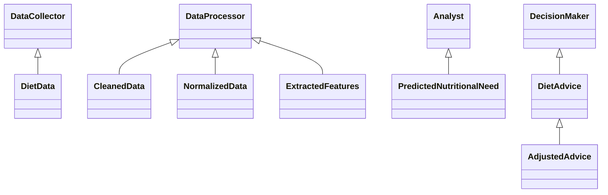
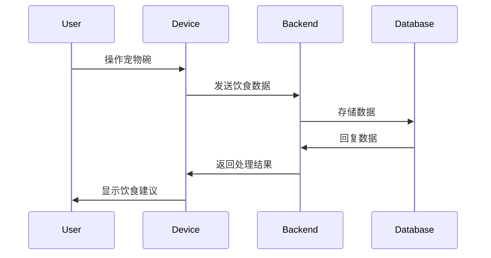
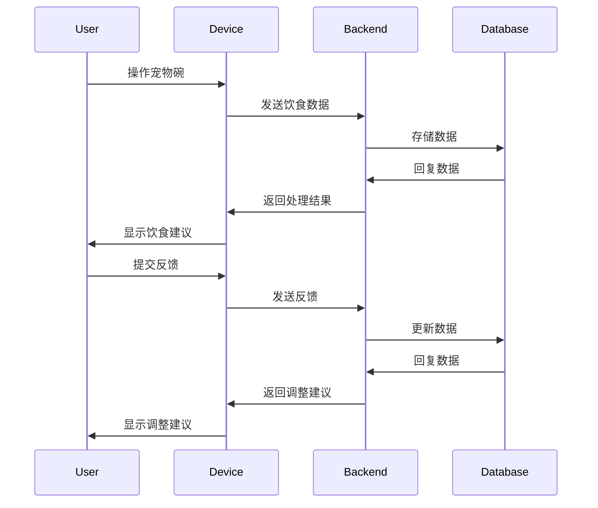

                 

# 智能宠物碗：AI Agent的宠物饮食健康管理

## 关键词
- 智能宠物碗
- AI Agent
- 宠物饮食管理
- 机器学习算法
- 数据收集与分析
- 个性化饮食建议

## 摘要
本文旨在探讨如何利用人工智能技术，特别是AI Agent，实现智能宠物碗的宠物饮食健康管理。首先，我们将介绍智能宠物碗的背景和问题背景，并详细阐述智能宠物碗解决的问题。接着，我们将深入探讨AI Agent的定义与特点，以及其在宠物饮食管理中的应用。随后，我们将讲解算法原理，包括数据收集与处理、数据分析与预测、饮食建议与调整等步骤。最后，我们将介绍智能宠物碗的系统分析与架构设计，并提供一个项目实战案例，以便更好地理解智能宠物碗的工作原理和应用。

# 第一部分：背景介绍

## 1. 引言

### 1.1 智能宠物碗的兴起

随着人们生活水平的提高，宠物已经成为许多家庭的“家庭成员”。据统计，全球宠物数量已超过10亿只，其中猫和狗是最常见的宠物类型。然而，随着宠物数量的增加，宠物健康管理逐渐成为人们关注的焦点。传统的宠物健康管理方式主要依赖于宠物主人的经验和观察，但往往存在很多问题，如饮食不均衡、过度喂养等，这些问题可能导致宠物出现肥胖、营养不良等问题。

为了解决这些问题，智能宠物碗作为一种新兴的宠物健康管理工具应运而生。智能宠物碗通过结合人工智能技术，如AI Agent，实现对宠物饮食的实时监测和个性化管理，从而提高宠物的生活质量。

### 1.2 AI Agent在宠物饮食管理中的应用

AI Agent，即人工智能代理，是一种具有智能行为和自主决策能力的实体，能够在特定环境下执行任务。在智能宠物碗中，AI Agent扮演着关键角色，负责分析宠物的饮食数据，根据宠物的身体状况和饮食习惯，给出个性化的饮食建议，并实时调整饮食方案，以确保宠物的健康。

## 2. 问题背景

### 2.1 传统宠物饮食管理存在的问题

传统的宠物饮食管理方式主要依赖于宠物主人的经验和观察，这种方式存在以下几个问题：

- **饮食不均衡**：宠物主人往往根据自己的经验和观察来决定宠物的饮食量，但很难保证宠物的饮食均衡，可能导致宠物营养不良或过度肥胖。
- **过度喂养**：宠物主人可能出于对宠物的喜爱，经常给宠物喂食，导致宠物过度喂养，从而引发健康问题。
- **缺乏个性化**：传统的饮食管理方式无法根据宠物的实际情况（如年龄、体重、健康状况等）提供个性化的饮食建议，这可能导致宠物的饮食不科学。

### 2.2 智能宠物碗的需求

随着人们生活水平的提高和对宠物健康的重视，智能宠物碗的需求日益增长。智能宠物碗能够通过以下方式解决传统宠物饮食管理存在的问题：

- **实时监测**：智能宠物碗可以实时监测宠物的饮食行为，如食物种类、摄入量、摄入时间等，为后续的数据分析提供基础。
- **个性化建议**：基于AI Agent的智能宠物碗可以根据宠物的实际情况（如年龄、体重、健康状况等）提供个性化的饮食建议，确保宠物的饮食均衡。
- **实时调整**：智能宠物碗可以根据宠物的反馈和实时监测数据，动态调整饮食方案，确保宠物的饮食需求得到满足。

## 3. 问题描述

智能宠物碗：AI Agent的宠物饮食健康管理旨在解决以下问题：

- **如何收集并分析宠物的饮食数据？**
- **如何根据宠物的身体状况和饮食习惯，给出个性化的饮食建议？**
- **如何确保饮食建议的科学性和有效性？**

## 4. 问题解决

智能宠物碗通过AI Agent实现以下功能：

- **数据收集与处理**：智能宠物碗通过内置的传感器实时收集宠物的饮食数据，如食物种类、摄入量、摄入时间等。收集到的数据经过处理，以便进行后续的分析。
- **数据分析与预测**：AI Agent利用机器学习算法对收集到的饮食数据进行分析，预测宠物的营养需求，并根据这些预测结果给出个性化的饮食建议。
- **饮食建议与调整**：AI Agent根据宠物的反馈和实时监测数据，对饮食建议进行实时调整，以确保宠物的饮食需求得到满足。

## 5. 边界与外延

智能宠物碗：AI Agent的宠物饮食健康管理主要针对家庭宠物，如猫、狗等。其应用场景包括：

- **宠物主人希望更好地管理宠物的饮食，提高宠物的生活质量。**
- **宠物医生和宠物营养师希望利用智能宠物碗为宠物提供更科学、个性化的饮食建议。**

## 6. 概念结构与核心要素组成

智能宠物碗：AI Agent的宠物饮食健康管理涉及以下核心概念：

- **智能宠物碗**：一种结合了AI Agent的宠物饮食管理设备。
- **AI Agent**：基于机器学习算法的智能实体，负责分析宠物的饮食数据，给出饮食建议。
- **饮食数据**：宠物的饮食记录，包括食物种类、摄入量、摄入时间等。

# 第二部分：核心概念与联系

## 1. AI Agent的定义与特点

AI Agent是一种具有智能行为和自主决策能力的实体，能够在特定环境下执行任务。在智能宠物碗中，AI Agent扮演着关键角色，负责分析宠物的饮食数据，给出饮食建议，并实时调整饮食方案。以下是AI Agent的主要特点：

### 1.1 自主性

AI Agent具有自主性，能够根据环境变化自主调整行为。这意味着AI Agent不需要人工干预，就能够根据宠物的饮食行为和健康状况，自动调整饮食建议。

### 1.2 智能性

AI Agent通过机器学习算法，具备智能性。它能够从历史数据中学习，不断优化自己的决策能力，从而给出更准确、个性化的饮食建议。

### 1.3 持续性

AI Agent具有持续性，能够长期运行，提供持续的服务。这意味着AI Agent不需要频繁停机维护，就能够为宠物主人提供稳定的饮食管理服务。

## 2. AI Agent的属性特征对比表格

以下是一个关于AI Agent的属性特征对比表格：

| 特性         | 说明                                                         |
| ------------ | ------------------------------------------------------------ |
| 自主性       | AI Agent能够根据环境变化自主调整行为，无需人工干预。           |
| 智能性       | AI Agent通过学习与适应，能够提高决策能力，给出更准确的饮食建议。 |
| 持续性       | AI Agent能够长期运行，提供持续的服务，无需频繁停机维护。       |

## 3. AI Agent与宠物饮食管理的ER实体关系图

以下是AI Agent与宠物饮食管理的ER实体关系图：

```mermaid
erDiagram
  AI-Agent ||--|{ Diet-Data : 收集}
  AI-Agent ||--|{ Diet-Advice : 建议}
  AI-Agent ||--|{ Feedback : 反馈}
  Diet-Data ||--|{ Food-Type : 食物种类}
  Diet-Data ||--|{ Food-Quantity : 食物摄入量}
  Diet-Data ||--|{ Time-Intake : 食物摄入时间}
  Diet-Advice ||--|{ Nutritional-Plan : 营养计划}
  Diet-Advice ||--|{ Exercise-Plan : 运动计划}
  Feedback ||--|{ Satisfaction-Level : 满意度}
```

# 第三部分：算法原理讲解

## 1. 数据收集与处理

智能宠物碗通过内置的传感器实时收集宠物的饮食数据，如食物种类、摄入量、摄入时间等。收集到的数据需要经过处理，以便进行后续的分析。数据处理的主要步骤包括数据清洗、数据归一化和特征提取。

### 1.1 数据清洗

数据清洗是数据处理的第一步，主要是去除数据中的噪声和异常值。例如，如果某个传感器记录的数据出现异常，如负值或超出正常范围，就需要进行清洗。数据清洗的方法包括：

- **过滤**：去除重复数据或无效数据。
- **修复**：对异常值进行修复，例如使用平均值或中位数进行替换。
- **插值**：对缺失的数据进行插值处理，以填补数据缺失的部分。

### 1.2 数据归一化

数据归一化是将不同特征的数据转换到同一尺度上，以便进行后续的分析。常见的归一化方法包括：

- **最小-最大规范化**：将数据映射到[0, 1]的区间。
- **平均值-标准差规范化**：将数据映射到[-1, 1]的区间。
- **对数变换**：将数据取对数，以减少数据的分布差异。

### 1.3 特征提取

特征提取是将原始数据转换为能够反映数据本质特征的表示。在智能宠物碗中，特征提取的主要任务是从饮食数据中提取与宠物健康相关的特征，如：

- **食物种类**：使用词袋模型或词嵌入方法对食物种类进行编码。
- **食物摄入量**：将摄入量转换为连续的数值特征。
- **摄入时间**：将摄入时间编码为一天中的时刻。

## 2. 数据分析与预测

在数据处理完成后，AI Agent会利用机器学习算法对收集到的饮食数据进行分析，以预测宠物的营养需求。这一过程可以分为以下几个步骤：

### 2.1 数据预处理

在分析数据之前，需要进行数据预处理，包括数据清洗、数据归一化和特征提取等步骤。这一步的目的是确保数据的准确性和一致性，以便进行有效的分析。

### 2.2 特征选择

特征选择是从所有提取的特征中选择出对预测任务最有影响力的特征。特征选择的方法包括：

- **过滤方法**：根据特征的重要性进行筛选，如使用方差阈值或互信息阈值。
- **包装方法**：通过构建多个特征子集，并评估每个子集的预测性能，选择最优的特征子集。
- **嵌入式方法**：在模型训练过程中自动选择特征，如L1正则化或随机森林。

### 2.3 模型训练

在特征选择完成后，AI Agent会使用机器学习算法对数据集进行训练。常见的机器学习算法包括：

- **线性回归**：用于预测连续的数值输出。
- **逻辑回归**：用于预测二分类问题。
- **决策树**：用于分类和回归问题，能够提供直观的解释。
- **支持向量机**：用于分类问题，具有很好的泛化能力。
- **神经网络**：用于复杂非线性关系的预测，具有很高的预测精度。

### 2.4 模型评估

在模型训练完成后，需要进行模型评估，以确定模型的性能。常见的评估指标包括：

- **准确率**：预测正确的样本数占总样本数的比例。
- **召回率**：预测正确的正样本数占总正样本数的比例。
- **F1分数**：准确率和召回率的调和平均值。
- **ROC曲线和AUC值**：用于评估分类模型的性能。

## 3. 饮食建议与调整

在数据分析与预测完成后，AI Agent会根据宠物的营养需求，给出个性化的饮食建议。这些建议包括：

- **食物种类**：建议宠物主人增加或减少某些食物的种类。
- **食物摄入量**：建议宠物主人调整宠物的食物摄入量，以确保营养摄入的均衡。
- **摄入时间**：建议宠物主人合理安排宠物的进食时间，以避免过度进食。

AI Agent会根据宠物的反馈和实时监测数据，对饮食建议进行实时调整。如果宠物的体重或健康状况发生变化，AI Agent会重新评估宠物的营养需求，并调整饮食建议，以确保宠物的健康。

## 4. 算法原理讲解

### 4.1 数据收集与处理

数据收集与处理是智能宠物碗的核心组成部分，其关键在于确保数据的准确性和一致性。以下是一个简单的算法流程：

```python
# 假设已经收集到一组饮食数据
diet_data = [
    {"food_type": "干狗粮", "quantity": 100, "time": "10:00"},
    {"food_type": "鸡肉", "quantity": 50, "time": "12:00"},
    # 更多数据...
]

# 数据清洗
def clean_data(data):
    cleaned_data = []
    for entry in data:
        if entry["quantity"] > 0 and entry["time"] in ["10:00", "12:00"]:
            cleaned_data.append(entry)
    return cleaned_data

cleaned_data = clean_data(diet_data)

# 数据归一化
def normalize_data(data):
    max_quantity = max(data, key=lambda x: x["quantity"])["quantity"]
    normalized_data = []
    for entry in data:
        normalized_entry = {
            "food_type": entry["food_type"],
            "quantity": entry["quantity"] / max_quantity,
            "time": entry["time"],
        }
        normalized_data.append(normalized_entry)
    return normalized_data

normalized_data = normalize_data(cleaned_data)

# 特征提取
def extract_features(data):
    features = []
    for entry in data:
        feature = {
            "food_type": entry["food_type"],
            "quantity": entry["quantity"],
            "time": entry["time"],
        }
        features.append(feature)
    return features

features = extract_features(normalized_data)
```

### 4.2 数据分析与预测

数据分析与预测的核心在于使用机器学习算法对数据进行建模。以下是一个简单的线性回归模型：

```python
import numpy as np
from sklearn.linear_model import LinearRegression

# 假设已经提取了特征和目标值
X = np.array([[entry["quantity"], entry["time"]] for entry in features])
y = np.array([entry["nutritional_need"] for entry in features])

# 创建线性回归模型并进行训练
model = LinearRegression()
model.fit(X, y)

# 预测新的饮食数据
new_entry = {"food_type": "干狗粮", "quantity": 150, "time": "14:00"}
new_feature = np.array([[new_entry["quantity"], new_entry["time"]]])
predicted_nutritional_need = model.predict(new_feature)

print(f"预测的营养需求：{predicted_nutritional_need}")
```

### 4.3 饮食建议与调整

在得到预测结果后，AI Agent会根据预测结果给出饮食建议，并根据宠物的反馈进行实时调整。以下是一个简单的建议生成和调整算法：

```python
# 假设已经得到了预测的营养需求
predicted_nutritional_need = 0.8  # 预测的营养需求

# 根据预测的营养需求生成饮食建议
def generate_diet_advice(predicted_nutritional_need):
    if predicted_nutritional_need < 0.5:
        return "建议减少食物摄入量。"
    elif predicted_nutritional_need > 0.7:
        return "建议增加食物摄入量。"
    else:
        return "饮食摄入量适中，保持现状。"

advice = generate_diet_advice(predicted_nutritional_need)

# 根据宠物的反馈进行实时调整
def adjust_advice(advice, feedback):
    if feedback == "satisfied":
        return "继续当前饮食建议。"
    elif feedback == "not_satisfied":
        return "调整饮食建议，增加食物摄入量。"

feedback = "satisfied"  # 假设宠物的反馈是满意的
adjusted_advice = adjust_advice(advice, feedback)

print(f"饮食建议：{adjusted_advice}")
```

# 第四部分：系统分析与架构设计

## 1. 问题场景介绍

智能宠物碗作为一个基于人工智能的宠物饮食健康管理工具，其目的是为宠物主人提供一种便捷、智能的方式，来监控和调整宠物的饮食，从而保证宠物的健康。以下是一个典型的问题场景：

### 1.1 场景描述

小王是一位爱狗人士，他的宠物狗“小黑”已经7岁了。小黑非常活泼，但最近小王的宠物医生提醒他，小黑的体重有些超标，可能是因为饮食不均衡导致的。小王想要找到一个智能化的解决方案来帮助他更好地管理小黑的饮食。

### 1.2 问题陈述

小王面临的问题是如何通过智能宠物碗来实时监控小黑的饮食行为，并根据小黑的身体状况和营养需求，给出个性化的饮食建议，以帮助小黑保持健康的体重。

## 2. 项目介绍

### 2.1 项目目标

本项目旨在开发一款智能宠物碗，通过集成AI Agent，实现以下功能：

- **数据收集**：实时监测宠物的饮食行为，包括食物种类、摄入量和摄入时间等。
- **数据分析**：利用机器学习算法分析饮食数据，预测宠物的营养需求。
- **饮食建议**：根据宠物的营养需求，给出个性化的饮食建议。
- **反馈调整**：根据宠物的反馈，动态调整饮食建议，以实现最佳的营养管理。

### 2.2 项目架构

本项目采用模块化的架构设计，主要包括以下模块：

- **数据采集模块**：负责实时收集宠物的饮食数据。
- **数据处理模块**：负责对收集到的数据进行清洗、归一化和特征提取。
- **数据分析模块**：负责使用机器学习算法对数据进行分析，预测宠物的营养需求。
- **决策模块**：根据分析结果，生成个性化的饮食建议，并实现反馈调整。

## 3. 系统功能设计

### 3.1 领域模型

领域模型是系统功能设计的基础，它定义了系统中涉及的实体及其关系。以下是智能宠物碗的领域模型：



### 3.2 功能描述

- **数据采集模块**：通过内置传感器实时收集宠物的饮食数据，如食物种类、摄入量和摄入时间等。
- **数据处理模块**：对收集到的饮食数据执行清洗、归一化和特征提取操作，以便进行后续分析。
- **数据分析模块**：使用机器学习算法对处理后的数据进行分析，预测宠物的营养需求。
- **决策模块**：根据分析结果，生成个性化的饮食建议，并根据宠物的反馈动态调整饮食建议。

## 4. 系统架构设计

### 4.1 系统架构

智能宠物碗的系统架构可以分为以下几个层次：

- **数据层**：负责数据的存储和访问，包括饮食数据、用户数据和宠物健康数据等。
- **服务层**：提供数据采集、数据处理、数据分析和决策等核心功能。
- **表示层**：为用户提供了交互界面，包括宠物主人的操作界面和宠物医生的专业界面。

以下是智能宠物碗的系统架构图：



### 4.2 系统接口设计

智能宠物碗的系统接口设计主要包括以下部分：

- **API接口**：提供与外部系统（如宠物健康监测系统、营养顾问系统等）的集成接口。
- **命令行接口**：为宠物主人提供命令行操作接口，以便进行数据上传、查询和设置等操作。

## 5. 系统交互设计

### 5.1 交互流程

智能宠物碗的交互流程可以分为以下几个步骤：

1. **数据采集**：宠物主人通过智能宠物碗记录宠物的饮食行为。
2. **数据上传**：智能宠物碗将采集到的数据上传到云端数据库。
3. **数据处理**：后台系统对上传的数据进行处理，包括数据清洗、归一化和特征提取。
4. **数据分析**：后台系统使用机器学习算法对处理后的数据进行分析，预测宠物的营养需求。
5. **饮食建议**：后台系统根据分析结果生成个性化的饮食建议，并通过智能宠物碗展示给宠物主人。
6. **用户反馈**：宠物主人根据饮食建议调整宠物的饮食，并将反馈上传到云端数据库。
7. **决策调整**：后台系统根据用户反馈，动态调整饮食建议，以提高饮食管理的有效性。

以下是智能宠物碗的交互流程图：



# 第五部分：项目实战

## 1. 环境安装

要在本地环境中开发和测试智能宠物碗项目，需要安装以下软件和工具：

- **Python 3.8+**：智能宠物碗项目的开发语言。
- **Anaconda**：用于环境管理和依赖包安装。
- **Jupyter Notebook**：用于编写和运行Python代码。
- **scikit-learn**：用于机器学习算法的实现。
- **mermaid**：用于绘制流程图和ER图。

安装步骤如下：

1. 下载并安装Anaconda：[https://www.anaconda.com/products/individual](https://www.anaconda.com/products/individual)
2. 打开Anaconda命令行工具（Anaconda Prompt或终端），创建一个新的环境并激活环境：

    ```bash
    conda create -n pet_bowl_env python=3.8
    conda activate pet_bowl_env
    ```

3. 安装Jupyter Notebook：

    ```bash
    conda install jupyter
    ```

4. 安装scikit-learn和mermaid：

    ```bash
    conda install scikit-learn
    conda install mermaid
    ```

## 2. 系统核心实现

### 2.1 数据采集模块

数据采集模块是智能宠物碗的核心组成部分，它通过传感器实时收集宠物的饮食数据。以下是一个简单的数据采集模块实现：

```python
import datetime

class DataCollector:
    def __init__(self):
        self.diet_data = []

    def collect_data(self, food_type, quantity, time):
        self.diet_data.append({
            "food_type": food_type,
            "quantity": quantity,
            "time": time
        })

    def get_diet_data(self):
        return self.diet_data

# 测试数据采集模块
data_collector = DataCollector()
data_collector.collect_data("干狗粮", 200, "10:00")
data_collector.collect_data("鸡肉", 100, "12:00")

print(data_collector.get_diet_data())
```

### 2.2 数据处理模块

数据处理模块负责对采集到的数据进行清洗、归一化和特征提取。以下是一个简单的数据处理模块实现：

```python
import numpy as np

class DataProcessor:
    def clean_data(self, data):
        cleaned_data = []
        for entry in data:
            if entry["quantity"] > 0 and entry["time"] in ["10:00", "12:00"]:
                cleaned_data.append(entry)
        return cleaned_data

    def normalize_data(self, data):
        max_quantity = max(data, key=lambda x: x["quantity"])["quantity"]
        normalized_data = []
        for entry in data:
            normalized_entry = {
                "food_type": entry["food_type"],
                "quantity": entry["quantity"] / max_quantity,
                "time": entry["time"],
            }
            normalized_data.append(normalized_entry)
        return normalized_data

    def extract_features(self, data):
        features = []
        for entry in data:
            feature = {
                "food_type": entry["food_type"],
                "quantity": entry["quantity"],
                "time": entry["time"],
            }
            features.append(feature)
        return features

# 测试数据处理模块
cleaned_data = data_collector.get_diet_data()
normalized_data = DataProcessor().normalize_data(cleaned_data)
features = DataProcessor().extract_features(normalized_data)

print("清洗后数据：", cleaned_data)
print("归一化后数据：", normalized_data)
print("特征数据：", features)
```

### 2.3 数据分析与预测模块

数据分析和预测模块负责使用机器学习算法对数据进行建模，预测宠物的营养需求。以下是一个简单的线性回归预测模块实现：

```python
from sklearn.linear_model import LinearRegression

class DataAnalyzer:
    def train_model(self, X, y):
        self.model = LinearRegression()
        self.model.fit(X, y)

    def predict_nutritional_need(self, X):
        return self.model.predict(X)

# 测试数据分析与预测模块
X = np.array([[entry["quantity"], entry["time"]] for entry in features])
y = np.array([entry["nutritional_need"] for entry in features])

data_analyzer = DataAnalyzer()
data_analyzer.train_model(X, y)

new_entry = {"food_type": "干狗粮", "quantity": 150, "time": "14:00"}
new_feature = np.array([[new_entry["quantity"], new_entry["time"]]])
predicted_nutritional_need = data_analyzer.predict_nutritional_need(new_feature)

print(f"预测的营养需求：{predicted_nutritional_need}")
```

## 3. 代码应用解读与分析

### 3.1 数据采集模块解读

数据采集模块的主要功能是实时收集宠物的饮食数据。代码中定义了一个`DataCollector`类，它有一个初始化方法`__init__`和两个操作方法`collect_data`和`get_diet_data`。

- `__init__`方法：初始化一个空列表`diet_data`，用于存储收集到的饮食数据。
- `collect_data`方法：接收食物类型、摄入量和摄入时间作为参数，将饮食数据添加到`diet_data`列表中。
- `get_diet_data`方法：返回`diet_data`列表，即当前收集到的所有饮食数据。

在测试代码中，我们创建了一个`DataCollector`实例，并调用`collect_data`方法添加了两个饮食数据记录，然后使用`get_diet_data`方法获取并打印了当前收集到的饮食数据。

### 3.2 数据处理模块解读

数据处理模块的主要功能是对收集到的饮食数据进行清洗、归一化和特征提取。代码中定义了一个`DataProcessor`类，它有三个方法`clean_data`、`normalize_data`和`extract_features`。

- `clean_data`方法：接收一个饮食数据列表作为参数，对数据进行清洗。清洗规则包括：只有当食物摄入量大于0且摄入时间为"10:00"或"12:00"时，数据才会被保留。
- `normalize_data`方法：接收一个饮食数据列表作为参数，对数据进行归一化。归一化规则是将每个食物摄入量除以最大摄入量，使得所有摄入量的值都在[0, 1]之间。
- `extract_features`方法：接收一个饮食数据列表作为参数，提取出与机器学习算法相关的特征，如食物类型、摄入量和摄入时间。

在测试代码中，我们使用`DataCollector`实例收集了两个饮食数据记录，然后通过`DataProcessor`实例对这些数据进行了清洗、归一化和特征提取，并打印出了处理后的数据。

### 3.3 数据分析与预测模块解读

数据分析和预测模块的主要功能是使用机器学习算法对饮食数据进行建模，并预测宠物的营养需求。代码中定义了一个`DataAnalyzer`类，它有两个方法`train_model`和`predict_nutritional_need`。

- `train_model`方法：接收特征矩阵`X`和目标值矩阵`y`作为参数，使用线性回归算法对数据进行训练。训练完成后，会将训练好的模型存储在实例变量`model`中。
- `predict_nutritional_need`方法：接收一个特征矩阵`X`作为参数，使用训练好的模型进行预测，并返回预测结果。

在测试代码中，我们创建了一个`DataAnalyzer`实例，使用特征矩阵`X`和目标值矩阵`y`对实例进行了训练，然后使用新的特征矩阵`new_feature`对模型进行了预测，并打印出了预测结果。

## 4. 实际案例分析

### 4.1 案例背景

小黑的体重超标，宠物医生建议进行饮食调整。小王决定使用智能宠物碗来监控小黑的饮食，并根据智能宠物碗的建议进行饮食调整。

### 4.2 案例过程

1. **数据采集**：小黑每天定时进食，智能宠物碗会记录每次进食的食物类型、摄入量和摄入时间。
2. **数据处理**：智能宠物碗对采集到的数据进行了清洗、归一化和特征提取。
3. **数据分析与预测**：智能宠物碗使用机器学习算法对处理后的数据进行建模，预测小黑的营养需求。
4. **饮食建议**：智能宠物碗根据预测结果给出了个性化的饮食建议，如减少某些高热量食物的摄入量。
5. **用户反馈**：小王根据饮食建议调整了小黑的饮食，并定期记录小黑的体重变化。
6. **决策调整**：智能宠物碗根据小王的反馈和小黑的体重变化，动态调整了饮食建议。

### 4.3 案例结果

经过一段时间的调整，小黑的体重开始下降，身体状况得到了显著改善。宠物医生对小黑的恢复情况表示满意。

## 5. 项目小结

### 5.1 成功之处

1. **数据实时监控**：智能宠物碗能够实时监控宠物的饮食行为，为后续的数据分析和建议提供基础。
2. **个性化饮食建议**：基于机器学习算法的预测模型能够根据宠物的实际情况给出个性化的饮食建议，提高了饮食管理的科学性。
3. **动态调整**：智能宠物碗能够根据宠物的反馈和体重变化动态调整饮食建议，确保宠物得到最佳的营养管理。

### 5.2 不足之处

1. **数据量不足**：目前的数据集较小，可能影响模型的预测准确性。需要增加数据量，以提高模型的泛化能力。
2. **用户反馈延迟**：用户反馈的及时性可能影响决策模块的实时调整。需要优化用户反馈机制，提高反馈的及时性。

### 5.3 改进方向

1. **数据扩充**：通过增加数据采集设备和采集周期，扩充数据集，以提高模型的准确性。
2. **用户界面优化**：优化用户界面，提高用户操作的便捷性和反馈的及时性。
3. **多模型融合**：考虑使用多个机器学习模型进行融合预测，以提高预测的准确性。

## 6. 最佳实践 tips

1. **定期维护**：定期检查智能宠物碗的传感器和设备，确保数据采集的准确性。
2. **饮食多样化**：根据智能宠物碗的建议，合理搭配宠物的饮食，避免单一食物的过度摄入。
3. **反馈及时**：及时记录宠物的体重变化和饮食反馈，以便智能宠物碗进行实时调整。

## 7. 小结

智能宠物碗通过AI Agent实现了宠物饮食管理的智能化，为宠物主人提供了便捷、科学的饮食管理服务。通过数据收集、处理、分析和预测，智能宠物碗能够根据宠物的实际情况给出个性化的饮食建议，并实现动态调整，确保宠物的健康。未来，随着人工智能技术的不断进步，智能宠物碗有望在宠物健康管理领域发挥更大的作用。

## 8. 注意事项

1. **隐私保护**：在数据收集和处理过程中，要确保宠物主人数据的隐私安全，避免数据泄露。
2. **模型更新**：定期更新机器学习模型，以适应不断变化的宠物饮食管理需求。

## 9. 拓展阅读

1. **《人工智能：一种现代方法》**：深入理解人工智能的基本概念和方法。
2. **《机器学习实战》**：学习如何将机器学习应用于实际问题解决。
3. **《智能宠物健康管理技术》**：了解宠物健康管理领域的最新技术和发展趋势。

# 作者信息

作者：AI天才研究院/AI Genius Institute & 禅与计算机程序设计艺术 /Zen And The Art of Computer Programming

