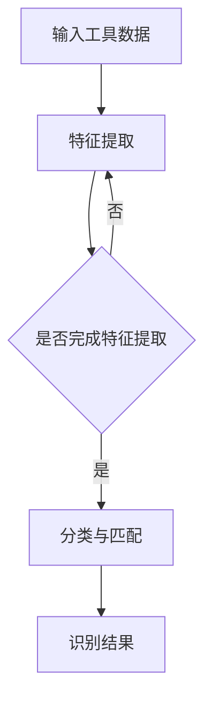
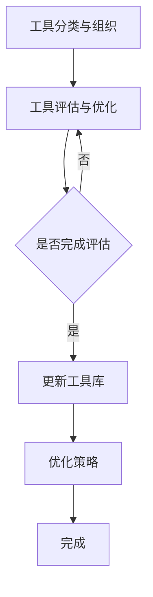
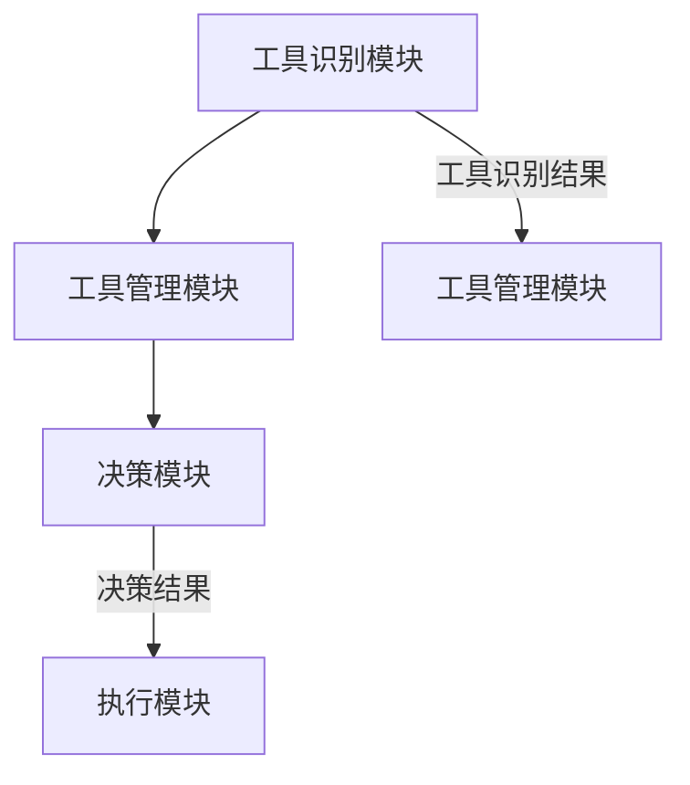
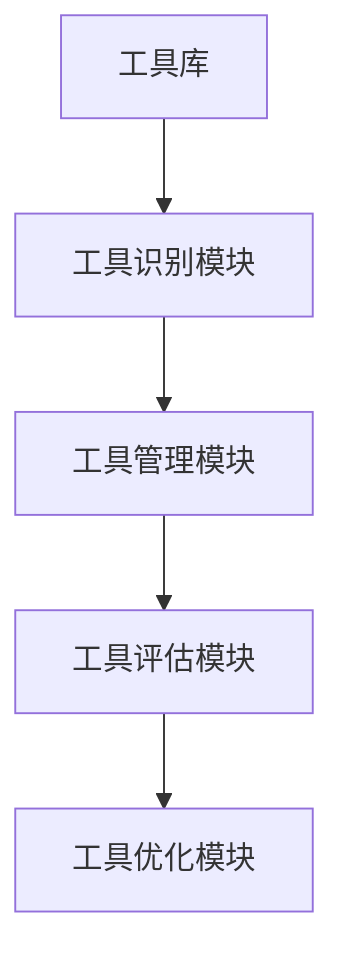
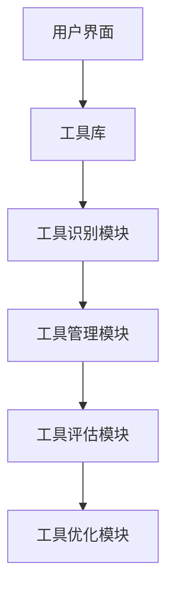
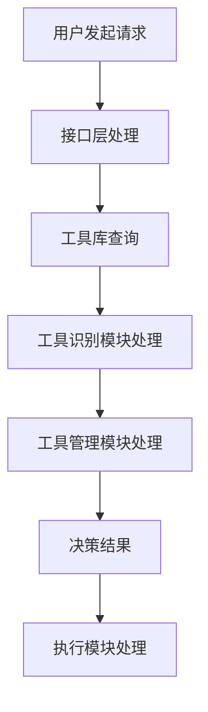

                 


### 智能工具箱：AI Agent的工具识别与管理

#### 关键词：智能工具箱，AI Agent，工具识别，工具管理，算法原理，系统架构，项目实战

> 摘要：本文旨在深入探讨智能工具箱在AI Agent中的应用，特别是工具识别与管理的核心问题。文章将详细分析工具识别的原理，介绍工具管理的策略，并设计一个具体的AI Agent架构，最后通过实战项目展示整个系统实现的过程。

---

#### 第1章：引言与背景

##### 1.1 问题背景

在当今的信息化社会中，人工智能（AI）技术正以惊人的速度发展，AI Agent作为一种智能实体，其在各种场景中的应用越来越广泛。然而，AI Agent的有效运作离不开智能工具箱的支持。智能工具箱是一个集合了多种工具的综合性系统，能够为AI Agent提供必要的工具支持，从而提高其决策能力和工作效率。

##### 1.2 问题描述

智能工具箱的核心问题是工具识别与管理。工具识别是指如何让AI Agent能够准确识别和理解其拥有的工具，而工具管理则涉及到如何对工具进行有效的组织、评估和优化。这两个问题相辅相成，直接决定了AI Agent的性能和效率。

##### 1.3 问题解决

为了解决上述问题，我们需要设计一个智能工具箱，其中包含高效的工具识别和管理的机制。这包括开发一系列的工具识别算法，构建一个完善的工具管理策略，以及设计一个合理的AI Agent架构。

##### 1.4 边界与外延

本文主要关注智能工具箱在AI Agent中的应用，但工具识别和管理的原理和方法同样适用于其他智能系统。此外，本文的重点是理论分析和架构设计，而非具体的实现细节。

##### 1.5 概念结构与核心要素组成

智能工具箱由以下几个核心要素组成：

1. 工具库：存储所有可用工具的集合。
2. 工具识别模块：用于识别和理解工具的模块。
3. 工具管理模块：用于组织、评估和优化工具的模块。
4. AI Agent：利用工具库和工具管理模块进行决策的智能实体。

---

#### 第2章：核心概念与联系

##### 2.1 AI Agent的定义与特点

AI Agent是指具有自主决策和行动能力的智能实体。其特点包括：

1. 自主性：能够独立进行决策和行动。
2. 学习能力：能够通过经验和数据不断优化自身性能。
3. 智能化：能够处理复杂问题和进行高效决策。

##### 2.2 工具识别的基本概念

工具识别是指AI Agent识别和理解其拥有的工具的过程。这包括：

1. 工具分类：将工具按照功能、用途等特征进行分类。
2. 特征提取：从工具中提取出可识别的特征。
3. 识别算法：使用算法对提取出的特征进行分类和匹配。

##### 2.3 管理策略与框架

工具管理策略是指如何对工具进行有效的组织、评估和优化。这包括：

1. 工具分类与组织：根据工具的特性进行分类，并建立索引。
2. 工具评估与优化：定期评估工具的性能，并根据评估结果进行优化。

##### 2.4 AI Agent工具识别与管理的联系

工具识别与管理是AI Agent运作的基础。工具识别确保AI Agent能够准确使用工具，而工具管理则确保工具始终处于最佳状态，从而提高AI Agent的整体性能。

---

#### 第3章：工具识别原理

##### 3.1 工具识别算法概述

工具识别算法是智能工具箱的核心。常见的工具识别算法包括：

1. 特征提取算法：如主成分分析（PCA）、线性判别分析（LDA）等。
2. 分类与匹配算法：如支持向量机（SVM）、K最近邻（KNN）等。

##### 3.2 特征提取与匹配算法

特征提取是从工具中提取出关键特征的过程。常见的特征提取算法有：

1. PCA：用于降维和特征提取。
2. LDA：用于分类和特征提取。

匹配算法则是用于确定工具是否匹配的过程。常见的匹配算法有：

1. SVM：用于分类和匹配。
2. KNN：用于分类和匹配。

##### 3.3 分类与识别算法

分类与识别算法是工具识别的核心。常见的分类与识别算法有：

1. SVM：用于分类。
2. KNN：用于分类和识别。

##### 3.4 识别算法的mermaid流程图



##### 3.5 Python源代码实现与原理讲解

```python
# Python代码示例：工具识别算法实现
import numpy as np
from sklearn.decomposition import PCA
from sklearn.model_selection import train_test_split
from sklearn.svm import SVC

# 特征提取
def feature_extraction(data):
    pca = PCA(n_components=2)
    return pca.fit_transform(data)

# 分类与匹配
def classification_and_matching(data, labels):
    X_train, X_test, y_train, y_test = train_test_split(data, labels, test_size=0.3)
    svm = SVC()
    svm.fit(X_train, y_train)
    return svm.predict(X_test)

# 原理讲解
# 特征提取使用PCA降维，分类与匹配使用SVM进行分类。
# 数据预处理 -> 特征提取 -> 分类与匹配 -> 识别结果
```

---

#### 第4章：工具管理策略

##### 4.1 管理策略概述

工具管理策略是确保智能工具箱中工具始终处于最佳状态的关键。这包括：

1. 工具分类与组织：根据工具的特性进行分类，并建立索引。
2. 工具评估与优化：定期评估工具的性能，并根据评估结果进行优化。

##### 4.2 工具分类与组织

工具分类与组织是工具管理的基础。这包括：

1. 功能分类：根据工具的功能进行分类。
2. 用途分类：根据工具的用途进行分类。
3. 索引建立：为每个分类建立索引，以便快速检索。

##### 4.3 工具评估与优化

工具评估与优化是确保工具始终处于最佳状态的关键。这包括：

1. 性能评估：定期评估工具的性能，包括准确性、响应时间等。
2. 优化策略：根据评估结果，优化工具的配置和参数。

##### 4.4 管理系统的mermaid流程图



---

#### 第5章：AI Agent架构设计

##### 5.1 AI Agent架构概述

AI Agent的架构设计是确保其高效运作的关键。AI Agent的架构通常包括以下几个模块：

1. 工具识别模块：用于识别和理解工具。
2. 工具管理模块：用于组织、评估和优化工具。
3. 决策模块：根据工具识别和工具管理的结果进行决策。

##### 5.2 工具识别模块设计

工具识别模块是AI Agent的核心。这包括：

1. 特征提取算法：如PCA、LDA等。
2. 分类与匹配算法：如SVM、KNN等。
3. 识别结果处理：处理识别结果，为决策模块提供支持。

##### 5.3 工具管理模块设计

工具管理模块是确保工具始终处于最佳状态的关键。这包括：

1. 工具分类与组织：根据工具的特性进行分类，并建立索引。
2. 工具评估与优化：定期评估工具的性能，并根据评估结果进行优化。

##### 5.4 AI Agent架构的mermaid架构图



---

#### 第6章：系统分析与接口设计

##### 6.1 系统功能设计（领域模型类图）



##### 6.2 系统架构设计（架构图）



##### 6.3 系统接口设计

系统接口设计是确保各模块之间高效通信的关键。这包括：

1. API接口：为外部系统提供访问工具库和工具管理模块的接口。
2. 数据接口：为各模块之间传递数据和结果提供接口。

##### 6.4 系统交互序列图



---

#### 第7章：项目实战

##### 7.1 环境安装

在开始项目实战之前，我们需要安装必要的软件和库。以下是一个简化的安装流程：

1. 安装Python环境。
2. 安装Sklearn、Numpy等库。
3. 安装Docker和Kubernetes等容器化工具。

##### 7.2 系统核心实现源代码

以下是系统核心实现源代码的一个示例：

```python
# 工具识别模块示例代码
from sklearn.decomposition import PCA
from sklearn.svm import SVC

# 特征提取
def feature_extraction(data):
    pca = PCA(n_components=2)
    return pca.fit_transform(data)

# 分类与匹配
def classification_and_matching(data, labels):
    svm = SVC()
    svm.fit(data, labels)
    return svm.predict(data)
```

##### 7.3 代码应用解读与分析

在代码应用中，我们首先提取工具的特征，然后使用SVM进行分类和匹配。这个过程可以确保AI Agent能够准确识别和理解工具。

##### 7.4 实际案例分析与详细讲解剖析

为了更好地理解工具识别与管理的过程，我们通过一个实际案例进行分析。假设我们有一个工具库，其中包含多种工具。我们首先对工具进行特征提取，然后使用SVM进行分类和匹配，最后评估工具的性能，并根据评估结果进行优化。

##### 7.5 项目小结

通过本次项目实战，我们深入了解了智能工具箱在AI Agent中的应用。从工具识别到工具管理，再到系统实现，我们逐步解决了智能工具箱的核心问题。这不仅提高了AI Agent的性能和效率，也为其他智能系统提供了有益的参考。

---

#### 第8章：最佳实践与拓展

##### 8.1 最佳实践 tips

1. 定期更新工具库，确保工具的完整性和可用性。
2. 优化工具识别算法，提高识别的准确性和效率。
3. 定期评估工具的性能，及时进行优化和调整。

##### 8.2 注意事项

1. 工具识别与管理是一个持续的过程，需要不断优化和改进。
2. 工具识别算法的选择和参数调整对系统的性能有重要影响。

##### 8.3 拓展阅读

1. 《机器学习》：周志华 著，详细介绍了机器学习的基本概念和方法。
2. 《深度学习》：Ian Goodfellow 著，深入讲解了深度学习的基本原理和应用。
3. 《Python机器学习》：Michael Bowles 著，介绍了如何使用Python进行机器学习。

---

### 作者信息

作者：AI天才研究院/AI Genius Institute & 禅与计算机程序设计艺术 /Zen And The Art of Computer Programming

---

以上就是关于《智能工具箱：AI Agent的工具识别与管理》的技术博客文章。本文详细探讨了智能工具箱在AI Agent中的应用，从工具识别到工具管理，再到系统实现，全面分析了智能工具箱的核心问题。希望通过本文的介绍，读者能够对智能工具箱有更深入的理解，并在实际应用中取得更好的效果。

