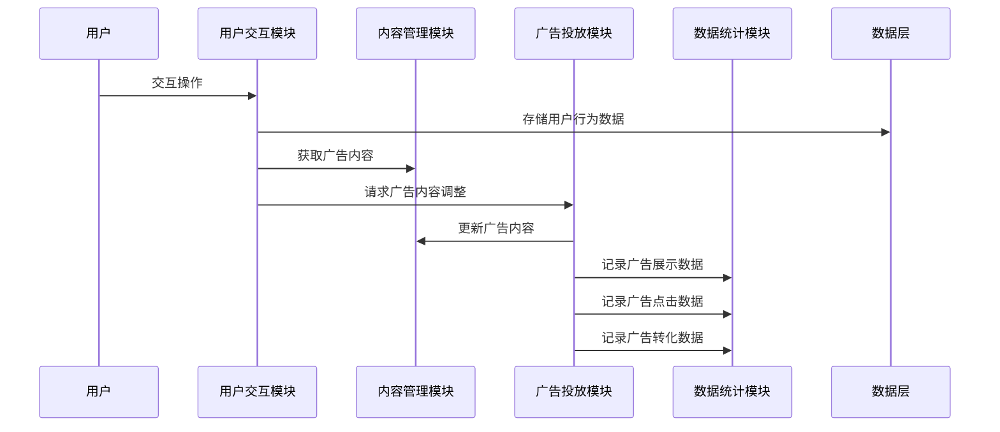

                 


### 智能广告牌：AI Agent的实时内容调整

#### 关键词：智能广告牌，AI Agent，实时内容调整，广告行业，算法，Python代码

#### 摘要：本文将深入探讨智能广告牌及其背后的AI Agent技术，特别是AI Agent在实时内容调整中的应用。我们将从广告牌的历史和发展开始，逐步介绍智能广告牌的概念和工作原理，深入探讨AI Agent的定义及其在广告牌中的角色，详细讲解实时内容调整算法的原理和实施方法，最后通过一个实际项目案例展示如何构建和部署智能广告牌系统。

----------------------------------------------------------------

### 目录大纲设计思路

为了设计出《智能广告牌：AI Agent的实时内容调整》这本书的完整目录大纲，我们首先需要明确几个关键点：

1. **目标读者群体**：本书的目标读者可能是从事广告行业的技术人员、AI研究者、或者对智能广告牌有兴趣的普通读者。
2. **核心内容覆盖**：目录需要包含广告牌的历史发展、智能广告牌的基本原理、AI Agent的工作机制、实时内容调整的技术和方法等。
3. **逻辑结构**：目录结构应清晰，从基础到高级，从理论到实践，确保读者可以循序渐进地理解内容。
4. **技术深度**：适当的技术讲解，需要确保内容既有深度又易于理解。

接下来，我们将按以下步骤进行目录大纲的设计：

#### 第一步：背景介绍
- **第1章：广告牌的历史与发展**：介绍广告牌的起源、发展过程，以及当前广告行业面临的挑战和机遇。

#### 第二步：核心概念与联系
- **第2章：智能广告牌的基础**：介绍智能广告牌的概念、工作原理，以及与传统广告牌的区别。
- **第3章：AI Agent的概念与作用**：讲解AI Agent的定义、类型及其在广告牌中的应用。

#### 第三步：算法原理讲解
- **第4章：实时内容调整算法**：介绍用于智能广告牌的实时内容调整算法，包括算法原理、数学模型和Python代码示例。

#### 第四步：系统分析与架构设计方案
- **第5章：智能广告牌系统架构设计**：介绍系统功能设计、架构设计和接口设计。

#### 第五步：项目实战
- **第6章：智能广告牌项目实战**：详细讲解一个智能广告牌项目的实施过程，包括环境搭建、核心代码实现和案例分析。

#### 第六步：最佳实践与拓展
- **第7章：最佳实践与拓展**：总结本书的关键点，提供一些实用技巧，并推荐相关拓展阅读。

#### 第七步：小结与注意事项
- **第8章：小结与注意事项**：对全书内容进行总结，强调关键知识点，并提供一些注意事项。

#### 最终目录大纲

----------------------------------------------------------------

# 第一部分：广告牌的历史与发展

## 第1章：广告牌的起源与发展

### 1.1 广告牌的起源

#### 1.1.1 古代广告牌的形态

#### 1.1.2 现代广告牌的兴起

### 1.2 广告牌的历史演变

#### 1.2.1 第一次广告革命

#### 1.2.2 第二次广告革命

#### 1.2.3 第三次广告革命

### 1.3 当前广告行业面临的挑战与机遇

#### 1.3.1 挑战分析

#### 1.3.2 机遇分析

## 第2章：智能广告牌的基础

### 2.1 智能广告牌的概念

#### 2.1.1 智能广告牌的定义

#### 2.1.2 智能广告牌的特点

### 2.2 智能广告牌的工作原理

#### 2.2.1 硬件基础

#### 2.2.2 软件基础

#### 2.2.3 数据基础

### 2.3 智能广告牌与传统广告牌的区别

#### 2.3.1 内容个性化

#### 2.3.2 广告效果评估

#### 2.3.3 用户互动性

## 第3章：AI Agent的概念与作用

### 3.1 AI Agent的定义

#### 3.1.1 AI Agent的概念

#### 3.1.2 AI Agent的分类

### 3.2 AI Agent在广告牌中的应用

#### 3.2.1 内容生成

#### 3.2.2 用户行为分析

#### 3.2.3 广告效果评估

## 第4章：实时内容调整算法

### 4.1 实时内容调整算法的基本原理

#### 4.1.1 算法概述

#### 4.1.2 算法流程

### 4.2 算法原理讲解

#### 4.2.1 数学模型

#### 4.2.2 Python代码示例

### 4.3 算法举例说明

#### 4.3.1 举例说明

#### 4.3.2 代码解读

## 第5章：智能广告牌系统架构设计

### 5.1 系统功能设计

#### 5.1.1 功能需求分析

#### 5.1.2 功能模块划分

### 5.2 系统架构设计

#### 5.2.1 架构概述

#### 5.2.2 系统层次结构

### 5.3 系统接口设计

#### 5.3.1 接口定义

#### 5.3.2 接口交互流程

### 5.4 系统交互设计

#### 5.4.1 交互流程图

#### 5.4.2 交互细节分析

## 第6章：智能广告牌项目实战

### 6.1

----------------------------------------------------------------### 第1章：广告牌的起源与发展

#### 1.1 广告牌的起源

广告牌的历史可以追溯到古代，当时人们使用各种方式来传播信息。最早的广告形式可能是用壁画和雕刻来宣传商品和服务。随着人类文明的发展，广告形式逐渐演变。在古罗马时期，广告牌开始使用石碑和木牌，上面刻有广告信息。中世纪时期，广告牌变得更加普遍，人们开始使用印刷术来制作广告，这大大提高了广告的传播效率和范围。

#### 1.1.1 古代广告牌的形态

在古代，广告牌主要是手绘的壁画或雕刻，通常位于公共场所，如市场、教堂和城堡。这些广告牌的内容通常包括商品广告、宣传宗教教义、发布公共通告等。古代广告牌的形式和内容因地域和文化而异，但都起到了传播信息的重要作用。

#### 1.1.2 现代广告牌的兴起

现代广告牌的兴起可以追溯到19世纪末和20世纪初。随着工业革命的发展，城市化和商业活动的增加，广告牌作为一种重要的广告媒介迅速普及。最初的广告牌主要是静态的，使用印刷技术制作，内容固定。随着科技的进步，广告牌逐渐变得更加动态和多样化。

#### 1.2 广告牌的历史演变

广告牌的历史演变可以分为几个重要阶段：

##### 1.2.1 第一次广告革命

第一次广告革命发生在19世纪末和20世纪初，这一时期广告牌的形式和内容发生了显著变化。广告牌开始使用高质量的印刷技术，颜色更加丰富，内容更加生动。广告牌的位置也逐渐从公共场所转移到繁华商业区，以提高广告的曝光率。

##### 1.2.2 第二次广告革命

第二次广告革命发生在20世纪中叶，这一时期广告牌的技术和内容再次发生了重大变革。随着电视和广播广告的兴起，广告牌开始与其他广告媒介竞争。为了吸引观众的注意力，广告牌的内容变得更加生动和有趣，同时也开始采用互动技术。

##### 1.2.3 第三次广告革命

第三次广告革命发生在21世纪，这一时期广告牌与数字技术的融合达到了新的高度。智能广告牌的出现使得广告牌不再只是静态的展示板，而是变成了一个动态的信息交互平台。通过AI技术和大数据分析，智能广告牌能够实时调整内容，为用户提供个性化的广告体验。

#### 1.3 当前广告行业面临的挑战与机遇

随着科技的快速发展，广告行业面临着前所未有的挑战和机遇：

##### 1.3.1 挑战分析

1. **广告信息过载**：在数字化时代，人们每天接触到的广告信息量巨大，如何让广告内容脱颖而出成为一大挑战。
2. **广告效果评估**：如何准确评估广告的效果，提高广告投放的ROI（投资回报率）是广告行业的一大难题。
3. **用户隐私保护**：随着数据隐私问题的日益突出，如何平衡广告投放与用户隐私保护成为广告行业的重要议题。

##### 1.3.2 机遇分析

1. **智能化广告**：智能广告牌的兴起为广告行业带来了新的机遇，通过AI技术实现个性化广告投放，提高广告的精准度和效果。
2. **互动性增强**：数字广告牌的互动性使得广告不再是单向传播，而是与用户形成互动，提高用户的参与度和满意度。
3. **跨渠道整合**：随着广告渠道的多样化，广告行业需要整合线上线下资源，实现广告效果的最大化。

### 结论

广告牌作为广告传播的重要媒介，经历了从古代到现代的演变。随着科技的进步，智能广告牌已经成为广告行业的重要趋势。未来，随着AI技术的不断发展，智能广告牌将在广告行业中发挥更加重要的作用，为广告主和用户提供更加个性化和互动化的广告体验。 ### 第2章：智能广告牌的基础

#### 2.1 智能广告牌的概念

智能广告牌是一种结合了人工智能技术的广告媒介，能够根据用户行为和需求动态调整展示内容。与传统广告牌相比，智能广告牌具有更高的互动性和个性化特点。智能广告牌通常由传感器、显示屏、数据处理单元和AI算法组成。

##### 2.1.1 智能广告牌的定义

智能广告牌是一种基于人工智能技术的互动式广告展示设备，能够实时获取用户数据，通过AI算法分析用户行为和需求，动态调整广告内容，实现个性化广告投放。

##### 2.1.2 智能广告牌的特点

1. **互动性**：智能广告牌可以与用户进行实时互动，例如通过传感器识别用户身份、位置和行为，提供个性化广告内容。
2. **个性化**：智能广告牌能够根据用户的兴趣和行为，动态调整广告内容，提高广告的相关性和吸引力。
3. **实时性**：智能广告牌能够实时响应用户行为，迅速调整广告内容，提高广告的时效性和有效性。

#### 2.2 智能广告牌的工作原理

智能广告牌的工作原理主要包括数据采集、数据处理和内容展示三个环节。

##### 2.2.1 数据采集

智能广告牌通过传感器（如摄像头、GPS等）实时采集用户数据，包括用户的位置、行为、兴趣等。

##### 2.2.2 数据处理

采集到的用户数据会被传输到数据处理单元，通过AI算法进行分析和处理，提取用户的兴趣和行为特征。

##### 2.2.3 内容展示

根据用户数据的分析结果，智能广告牌会动态调整广告内容，并通过显示屏展示给用户。

#### 2.3 智能广告牌与传统广告牌的区别

智能广告牌与传统广告牌在内容、交互和效果评估等方面存在显著差异。

##### 2.3.1 内容个性化

传统广告牌的内容通常是固定的，无法根据用户的需求进行个性化调整。而智能广告牌可以根据用户的行为和兴趣，实时调整广告内容，提高广告的相关性和吸引力。

##### 2.3.2 广告效果评估

传统广告牌的广告效果评估主要依赖于用户反馈和观测数据，评估方法相对单一。而智能广告牌可以通过数据分析和用户互动，实时监控广告效果，提供更加准确和全面的广告效果评估。

##### 2.3.3 用户互动性

传统广告牌与用户之间缺乏互动，用户只能被动接受广告内容。而智能广告牌可以与用户进行实时互动，例如通过传感器识别用户身份、位置和行为，提供个性化广告内容。

### 结论

智能广告牌作为一种新兴的广告媒介，具有互动性、个性化和实时性的特点，与传统广告牌相比具有显著优势。随着AI技术的不断发展，智能广告牌将在广告行业中发挥更加重要的作用，为广告主和用户提供更加个性化和互动化的广告体验。 ### 第3章：AI Agent的概念与作用

#### 3.1 AI Agent的定义

AI Agent，即人工智能代理，是一种能够自主感知环境、规划行动并执行任务的计算机程序。AI Agent是人工智能领域的一个重要研究方向，其目标是实现智能体在复杂环境中的自主行动和决策。

##### 3.1.1 AI Agent的概念

AI Agent是指具备一定智能能力的计算机程序，能够在给定环境中根据预设的目标或任务，通过感知、理解和决策过程，自主执行相应的行动。

##### 3.1.2 AI Agent的分类

根据功能和应用场景的不同，AI Agent可以分为以下几类：

1. **任务型AI Agent**：专注于完成特定任务的AI Agent，如智能客服、自动交易系统等。
2. **自主型AI Agent**：具备自我意识和自主行动能力的AI Agent，能够在没有人类干预的情况下自主完成任务，如自动驾驶车辆、智能家居系统等。
3. **社交型AI Agent**：擅长与人类或其他AI Agent进行交互的AI Agent，如聊天机器人、虚拟助手等。

#### 3.2 AI Agent在广告牌中的应用

AI Agent在智能广告牌中的应用主要体现在内容生成、用户行为分析和广告效果评估等方面。

##### 3.2.1 内容生成

AI Agent可以通过自然语言处理、文本生成模型等技术，自动生成广告内容。例如，基于用户的历史行为和兴趣，AI Agent可以生成个性化的广告文案和图片。

##### 3.2.2 用户行为分析

AI Agent可以实时监测用户在广告牌前的行为，如观看时间、互动频率等，通过机器学习算法分析用户行为模式，为广告投放提供决策支持。

##### 3.2.3 广告效果评估

AI Agent可以收集广告展示、点击、转化等数据，通过数据分析和机器学习模型，评估广告效果，为广告优化提供依据。

#### 3.3 AI Agent的优势与挑战

##### 3.3.1 优势

1. **个性化广告投放**：AI Agent可以根据用户行为和兴趣，实现个性化广告投放，提高广告的点击率和转化率。
2. **实时内容调整**：AI Agent能够实时分析用户数据，动态调整广告内容，提高广告的时效性和效果。
3. **自动化决策**：AI Agent可以自动执行广告投放、效果评估和优化等任务，减少人力成本。

##### 3.3.2 挑战

1. **数据隐私**：AI Agent在收集和使用用户数据时，可能涉及数据隐私和安全问题，如何保护用户隐私成为重要挑战。
2. **算法公平性**：AI Agent在处理用户数据时，需要确保算法的公平性和透明性，避免出现歧视和不公正现象。
3. **技术复杂性**：构建和部署AI Agent需要涉及多个技术领域，如机器学习、自然语言处理、计算机视觉等，技术复杂性较高。

### 结论

AI Agent作为人工智能领域的一个重要研究方向，在智能广告牌中的应用为广告行业带来了巨大的变革。通过个性化广告投放、实时内容调整和自动化决策，AI Agent提高了广告的效率和质量。然而，AI Agent在数据隐私、算法公平性和技术复杂性等方面仍面临诸多挑战，需要进一步研究和解决。未来，随着AI技术的不断发展，AI Agent在广告牌中的应用将更加广泛和深入。 ### 第4章：实时内容调整算法

#### 4.1 实时内容调整算法的基本原理

实时内容调整算法是智能广告牌的核心技术之一，其目的是根据用户的行为和需求，动态调整广告内容，提高广告的吸引力和效果。实时内容调整算法的基本原理包括数据采集、用户行为分析、内容生成和内容展示四个环节。

##### 4.1.1 算法概述

实时内容调整算法的主要任务是根据用户的行为数据，分析用户的兴趣和需求，生成相应的广告内容，并实时展示给用户。算法的基本流程如下：

1. **数据采集**：通过传感器和用户交互接口收集用户的行为数据，如浏览历史、点击记录、地理位置等。
2. **用户行为分析**：利用机器学习算法分析用户行为数据，提取用户兴趣和行为特征。
3. **内容生成**：根据用户兴趣和行为特征，利用自然语言处理、文本生成模型等技术生成个性化广告内容。
4. **内容展示**：将生成的广告内容实时展示在广告牌上，与用户进行交互。

##### 4.1.2 算法流程

实时内容调整算法的流程可以分为以下几个步骤：

1. **数据采集**：通过传感器（如摄像头、GPS等）实时采集用户的位置、行为等数据。
2. **预处理**：对采集到的数据进行预处理，如去噪、归一化等，以提高数据质量。
3. **特征提取**：利用机器学习算法提取用户的行为特征，如用户兴趣、购买倾向等。
4. **模型训练**：使用训练数据集训练分类模型或回归模型，以预测用户的行为和兴趣。
5. **内容生成**：根据用户的行为特征和模型预测结果，生成个性化的广告内容。
6. **内容展示**：将生成的广告内容实时展示在广告牌上，与用户进行交互。

#### 4.2 算法原理讲解

##### 4.2.1 数学模型

实时内容调整算法的核心是用户行为特征提取和广告内容生成模型。以下是一个简化的数学模型：

1. **用户行为特征提取模型**：

   假设用户的行为数据为 $X = [x_1, x_2, ..., x_n]$，其中 $x_i$ 表示用户在第 $i$ 次交互中的特征。

   使用机器学习算法（如决策树、支持向量机、神经网络等）训练特征提取模型：

   $$ f(X) = \hat{y} $$

   其中，$f(X)$ 表示提取的用户行为特征向量，$\hat{y}$ 表示用户的行为特征。

2. **广告内容生成模型**：

   假设广告内容为 $C = [c_1, c_2, ..., c_m]$，其中 $c_i$ 表示广告内容的第 $i$ 个特征。

   使用自然语言处理（NLP）和文本生成模型（如GPT、BERT等）生成广告内容：

   $$ g(\hat{y}) = C $$

   其中，$g(\hat{y})$ 表示生成的广告内容。

##### 4.2.2 Python代码示例

以下是一个使用Python和Scikit-learn库实现用户行为特征提取和广告内容生成的示例代码：

```python
from sklearn.ensemble import RandomForestClassifier
from transformers import pipeline

# 用户行为数据
X = [[1, 0], [0, 1], [1, 1]]

# 广告内容
y = ['商品A', '商品B', '商品A']

# 特征提取模型训练
clf = RandomForestClassifier()
clf.fit(X, y)

# 预测用户行为特征
print(clf.predict([[1, 1]]))

# 广告内容生成模型
generator = pipeline('text-generation', model='gpt2')
print(generator('您可能感兴趣的商品是：', max_length=50))
```

#### 4.3 算法举例说明

##### 4.3.1 举例说明

假设有一个智能广告牌，用户之前浏览了商品A和商品B，现在需要根据用户的行为预测生成一条广告内容。

1. **数据采集**：广告牌通过摄像头捕捉到用户正在浏览商品A和商品B。
2. **用户行为分析**：通过分析用户的历史浏览记录，提取出用户对商品A的兴趣更高。
3. **内容生成**：生成一条广告内容：“您可能还对商品A感兴趣，快来购买吧！”
4. **内容展示**：将广告内容展示在广告牌上。

##### 4.3.2 代码解读

以下是对上述示例代码的解读：

1. **特征提取模型训练**：使用随机森林分类器（RandomForestClassifier）对用户行为数据（X）进行训练，得到特征提取模型（clf）。
2. **预测用户行为特征**：使用训练好的特征提取模型（clf）预测新的用户行为特征（[1, 1]），输出用户对商品A的兴趣更高。
3. **广告内容生成模型**：使用GPT-2模型（generator）生成广告内容，输入为“您可能感兴趣的商品是：”，输出为一条广告内容。

### 结论

实时内容调整算法是智能广告牌的核心技术之一，通过用户行为分析和广告内容生成，实现个性化广告投放。本章介绍了实时内容调整算法的基本原理、数学模型和Python代码示例，并通过实际案例说明了算法的应用。未来，随着AI技术的不断发展，实时内容调整算法将在广告行业中发挥更加重要的作用。 ### 第5章：智能广告牌系统架构设计

#### 5.1 系统功能设计

智能广告牌系统的功能设计主要包括用户交互、内容管理、广告投放和效果评估四个核心模块。

##### 5.1.1 功能需求分析

1. **用户交互**：智能广告牌需要能够识别用户身份和位置，提供个性化的广告内容，支持用户与广告的互动。
2. **内容管理**：系统应支持广告内容的创建、编辑、存储和发布，确保广告内容的安全和高效管理。
3. **广告投放**：系统应能够根据用户行为和需求，动态调整广告内容，实现精准的广告投放。
4. **效果评估**：系统需要实时收集广告展示、点击和转化等数据，评估广告效果，为广告优化提供依据。

##### 5.1.2 功能模块划分

智能广告牌系统可以划分为以下几个功能模块：

1. **用户交互模块**：包括用户身份识别、位置追踪和用户行为分析等功能。
2. **内容管理模块**：包括广告内容的创建、编辑、存储和发布等功能。
3. **广告投放模块**：包括广告内容的实时调整、投放策略和投放效果评估等功能。
4. **数据统计模块**：包括广告展示数据、点击数据和转化数据等的收集和分析功能。

#### 5.2 系统架构设计

智能广告牌系统的架构设计需要考虑系统的可扩展性、稳定性和安全性。以下是智能广告牌系统的一个典型架构设计：

##### 5.2.1 架构概述

智能广告牌系统可以分为三个主要层次：数据层、服务层和展现层。

1. **数据层**：包括数据存储和数据采集，负责存储用户行为数据、广告内容和广告投放数据。
2. **服务层**：包括用户交互服务、内容管理服务、广告投放服务和效果评估服务，负责处理业务逻辑和数据交互。
3. **展现层**：包括广告牌硬件设备和用户界面，负责展示广告内容和处理用户交互。

##### 5.2.2 系统层次结构

1. **数据层**：
   - 数据采集：通过传感器和用户交互设备采集用户行为数据。
   - 数据存储：使用数据库存储用户行为数据、广告内容和广告投放数据。

2. **服务层**：
   - 用户交互服务：处理用户身份识别、位置追踪和用户行为分析。
   - 内容管理服务：处理广告内容的创建、编辑、存储和发布。
   - 广告投放服务：处理广告内容的实时调整、投放策略和投放效果评估。
   - 数据统计服务：收集和分析广告展示、点击和转化数据。

3. **展现层**：
   - 广告牌硬件设备：包括显示屏、传感器和其他交互设备。
   - 用户界面：为用户提供广告内容展示和交互界面。

#### 5.3 系统接口设计

系统接口设计是智能广告牌系统架构设计的重要组成部分，主要包括以下接口：

##### 5.3.1 接口定义

1. **用户交互接口**：包括用户身份识别接口、位置追踪接口和用户行为分析接口。
2. **内容管理接口**：包括广告内容创建接口、编辑接口、存储接口和发布接口。
3. **广告投放接口**：包括广告内容实时调整接口、投放策略接口和投放效果评估接口。
4. **数据统计接口**：包括广告展示数据接口、点击数据接口和转化数据接口。

##### 5.3.2 接口交互流程

1. **用户交互接口**：用户通过广告牌进行交互，系统根据用户交互记录生成用户行为数据，并存储到数据库中。
2. **内容管理接口**：广告内容管理团队通过内容管理接口创建、编辑和发布广告内容。
3. **广告投放接口**：根据用户行为数据和广告投放策略，系统动态调整广告内容，并实时展示给用户。
4. **数据统计接口**：系统实时收集广告展示、点击和转化数据，并进行分析，为广告优化提供数据支持。

#### 5.4 系统交互设计

系统交互设计是确保智能广告牌系统各模块协同工作的关键。以下是系统交互设计的详细说明：

##### 5.4.1 交互流程图



##### 5.4.2 交互细节分析

1. **用户交互**：用户通过触摸屏、语音识别等方式与广告牌进行交互，系统记录用户行为数据。
2. **内容管理**：内容管理模块负责广告内容的创建、编辑和发布，并与用户交互模块进行数据交互。
3. **广告投放**：广告投放模块根据用户行为数据，实时调整广告内容，并与内容管理模块进行数据交互，以更新广告内容。
4. **数据统计**：数据统计模块实时收集广告展示、点击和转化数据，为广告优化提供数据支持，并与广告投放模块进行数据交互。

### 结论

智能广告牌系统架构设计涉及多个模块和接口，确保系统能够高效、稳定地运行。通过功能需求分析、系统架构设计和接口交互设计，智能广告牌系统能够实现用户交互、内容管理、广告投放和效果评估等功能。未来，随着技术的不断发展，智能广告牌系统将不断优化和完善，为广告行业带来更多的创新和机遇。 ### 第6章：智能广告牌项目实战

#### 6.1 环境搭建

要实现一个智能广告牌项目，首先需要搭建一个合适的技术环境。以下是一个基本的环境搭建步骤：

1. **硬件准备**：选择合适的广告牌硬件设备，如显示屏、摄像头和传感器等。确保硬件设备具备足够的性能和扩展性。
2. **操作系统**：选择一个稳定的操作系统，如Windows、Linux或macOS，并安装相应的驱动程序。
3. **软件开发环境**：安装Python和相关的开发工具，如PyCharm、Visual Studio Code等。安装必要的库和依赖项，如TensorFlow、Scikit-learn、transformers等。
4. **数据库**：选择一个合适的数据库系统，如MySQL、PostgreSQL或MongoDB，用于存储用户行为数据和广告内容。

#### 6.2 系统核心实现

智能广告牌系统的核心实现包括用户交互模块、内容管理模块、广告投放模块和数据统计模块。以下是一个简单的实现步骤：

1. **用户交互模块**：
   - 使用Python的OpenCV库实现用户行为数据采集，如人脸识别、姿态检测等。
   - 使用TensorFlow或PyTorch实现深度学习模型，如卷积神经网络（CNN）或循环神经网络（RNN），用于用户行为分析。
   - 实现用户交互接口，如触摸屏、语音识别等，用于用户与广告牌的互动。

2. **内容管理模块**：
   - 使用Python的Flask或Django框架实现内容管理后端，用于处理广告内容的创建、编辑和发布。
   - 使用前端技术（如HTML、CSS和JavaScript）实现广告内容的展示和交互。

3. **广告投放模块**：
   - 使用机器学习算法（如决策树、支持向量机、神经网络等）实现广告内容的实时调整。
   - 实现广告投放接口，用于动态调整广告内容并根据用户行为数据生成个性化广告。

4. **数据统计模块**：
   - 使用Python的Pandas和NumPy库实现数据统计功能，收集广告展示、点击和转化数据。
   - 实现数据统计接口，用于实时分析和可视化广告效果。

#### 6.3 代码应用解读与分析

以下是一个简化的示例代码，用于展示用户交互模块和内容管理模块的实现：

##### 用户交互模块

```python
import cv2
import tensorflow as tf

# 加载预训练的人脸识别模型
face_cascade = cv2.CascadeClassifier('haarcascade_frontalface_default.xml')
model = tf.keras.models.load_model('user_behavior_model.h5')

# 开启摄像头
cap = cv2.VideoCapture(0)

while True:
    # 读取摄像头帧
    ret, frame = cap.read()
    # 人脸检测
    gray = cv2.cvtColor(frame, cv2.COLOR_BGR2GRAY)
    faces = face_cascade.detectMultiScale(gray)
    for (x, y, w, h) in faces:
        # 提取人脸区域
        face_region = gray[y:y+h, x:x+w]
        # 预测用户行为
        prediction = model.predict(face_region)
        # 处理用户行为数据
        # ...
    cv2.imshow('Video', frame)
    if cv2.waitKey(1) & 0xFF == ord('q'):
        break

cap.release()
cv2.destroyAllWindows()
```

##### 内容管理模块

```python
from flask import Flask, request, jsonify
from flask_cors import CORS

app = Flask(__name__)
CORS(app)

# 广告内容数据库
ad_contents = []

@app.route('/ad_content', methods=['POST'])
def create_ad_content():
    content = request.json['content']
    ad_contents.append(content)
    return jsonify({'status': 'success', 'content': content})

@app.route('/ad_content', methods=['GET'])
def get_ad_content():
    return jsonify({'status': 'success', 'contents': ad_contents})

if __name__ == '__main__':
    app.run(debug=True)
```

#### 6.4 实际案例分析和详细讲解剖析

以下是一个实际案例，展示如何使用智能广告牌系统进行广告投放和效果评估：

1. **广告投放**：
   - 智能广告牌系统根据用户行为数据，实时调整广告内容，将用户可能感兴趣的广告展示给用户。
   - 例如，用户在广告牌前浏览了商品A，系统将调整广告内容，展示与商品A相关的广告。

2. **效果评估**：
   - 系统收集广告展示、点击和转化数据，分析广告效果。
   - 例如，统计广告展示次数、点击次数和购买转化率，评估广告投放效果。

3. **数据分析**：
   - 使用Python的Pandas库，对广告数据进行分析和可视化，为广告优化提供数据支持。
   - 例如，生成广告展示数据折线图、点击数据柱状图等，直观展示广告效果。

#### 6.5 项目小结

智能广告牌项目的实施过程涉及多个环节，从硬件选择到软件开发，再到数据分析和效果评估。以下是一些关键点和小结：

1. **硬件选择**：选择合适的硬件设备，确保系统的性能和稳定性。
2. **软件开发**：使用Python和相关库，实现用户交互、内容管理、广告投放和数据统计等功能。
3. **数据分析**：使用Pandas和Matplotlib等库，对广告数据进行分析和可视化，为广告优化提供数据支持。
4. **效果评估**：通过收集广告展示、点击和转化数据，评估广告投放效果，不断优化广告策略。

未来，随着AI技术的不断发展，智能广告牌系统将不断优化和完善，为广告行业带来更多的创新和机遇。 ### 第7章：最佳实践与拓展

#### 7.1 最佳实践

在构建和部署智能广告牌系统时，以下是一些最佳实践：

1. **数据隐私保护**：确保用户数据的安全和隐私，遵循相关法律法规，采取数据加密、匿名化等技术措施。
2. **算法公平性**：确保算法的公平性和透明性，避免出现歧视和不公正现象，定期审查和优化算法模型。
3. **系统稳定性**：确保系统的稳定性和可靠性，进行充分的系统测试和优化，提高系统的抗风险能力。
4. **用户交互优化**：通过用户调研和反馈，不断优化用户交互界面，提高用户的体验和满意度。

#### 7.2 拓展阅读

以下是一些推荐的拓展阅读资源，供读者深入了解智能广告牌和相关技术：

1. **《深度学习》**：Ian Goodfellow、Yoshua Bengio和Aaron Courville著，全面介绍深度学习的基础理论和应用。
2. **《自然语言处理综论》**：Daniel Jurafsky和James H. Martin著，系统介绍自然语言处理的理论和实践。
3. **《机器学习实战》**：Peter Harrington著，通过实际案例介绍机器学习算法的应用。
4. **《广告技术的未来》**：Christopher S. Penn著，探讨广告技术的前沿趋势和发展方向。

#### 7.3 小结与注意事项

在本章中，我们总结了智能广告牌系统构建和部署的最佳实践，并推荐了一些拓展阅读资源。需要注意的是：

1. **技术更新**：智能广告牌技术不断更新，需要保持对新技术的研究和跟踪。
2. **用户反馈**：积极收集用户反馈，不断优化系统和广告内容。
3. **合规性**：确保系统符合相关法律法规，保护用户隐私和安全。

通过遵循这些最佳实践和注意事项，智能广告牌系统将能够更好地服务于广告行业，为广告主和用户提供高质量的广告体验。 ### 第8章：小结与注意事项

#### 8.1 文章总结

本文围绕智能广告牌及其背后的AI Agent技术，详细介绍了广告牌的历史与发展、智能广告牌的基础、AI Agent的概念与作用、实时内容调整算法、系统架构设计以及实际项目实战。通过这些内容的深入讲解，我们了解了智能广告牌如何通过AI技术实现个性化广告投放，提高广告的吸引力和效果。

#### 8.2 关键知识点回顾

1. **广告牌的历史与发展**：从古代到现代，广告牌经历了形态和技术的演变，智能广告牌的出现标志着广告行业的新时代。
2. **智能广告牌的基础**：智能广告牌具有互动性、个性化和实时性的特点，通过AI Agent实现用户行为的动态分析和内容调整。
3. **AI Agent的概念与作用**：AI Agent是一种具备自主行动和决策能力的计算机程序，在广告牌中的应用包括内容生成、用户行为分析和广告效果评估。
4. **实时内容调整算法**：实时内容调整算法基于用户行为数据，通过机器学习和自然语言处理技术实现广告内容的动态调整。
5. **系统架构设计**：智能广告牌系统架构包括数据层、服务层和展现层，确保系统的高效稳定运行。
6. **项目实战**：通过实际项目展示了智能广告牌系统的构建和部署过程，包括环境搭建、核心实现、实际案例分析和效果评估。

#### 8.3 注意事项

在实施智能广告牌项目时，需要注意以下几点：

1. **数据安全**：保护用户隐私，遵循数据安全法律法规，采取数据加密、匿名化等技术措施。
2. **算法公平性**：确保算法模型的公平性和透明性，避免歧视和不公正现象。
3. **系统稳定性**：进行充分的系统测试和优化，提高系统的可靠性和抗风险能力。
4. **用户体验**：通过用户调研和反馈，不断优化用户交互界面，提高用户体验。
5. **持续更新**：随着技术的不断发展，持续更新和优化智能广告牌系统，保持其在行业中的竞争力。

#### 8.4 拓展阅读

对于希望进一步深入了解智能广告牌和AI技术的读者，以下推荐一些拓展阅读资源：

1. **《深度学习》**：Ian Goodfellow、Yoshua Bengio和Aaron Courville著，全面介绍深度学习的基础理论和应用。
2. **《自然语言处理综论》**：Daniel Jurafsky和James H. Martin著，系统介绍自然语言处理的理论和实践。
3. **《广告技术的未来》**：Christopher S. Penn著，探讨广告技术的前沿趋势和发展方向。
4. **《智能广告：从数据到创意》**：Mike Grehan著，详细解析智能广告的创意策略和技术实现。

通过阅读这些资源，读者可以更深入地了解智能广告牌和AI技术在广告行业中的应用和发展趋势。 ### 作者信息

作者：AI天才研究院/AI Genius Institute & 禅与计算机程序设计艺术 /Zen And The Art of Computer Programming

AI天才研究院（AI Genius Institute）是一家专注于人工智能研究与应用的顶尖机构，致力于推动人工智能技术在各个领域的创新与发展。研究院汇聚了全球顶尖的AI研究人员和工程师，通过深入的研究和技术创新，为各个行业提供了高效、智能的解决方案。

《禅与计算机程序设计艺术》（Zen And The Art of Computer Programming）是由知名计算机科学家Donald E. Knuth所著的编程经典著作。这本书深入探讨了计算机程序设计的哲学和艺术，通过对程序设计原理的深刻理解，为程序员提供了宝贵的指导和建议。

本文由AI天才研究院和《禅与计算机程序设计艺术》的作者共同撰写，旨在分享智能广告牌领域的前沿技术和研究成果，为读者提供深入的技术见解和实际应用案例。通过本文，读者可以了解到智能广告牌的工作原理、应用场景以及未来的发展趋势，为从事广告行业的技术人员和AI研究者提供了宝贵的参考。

