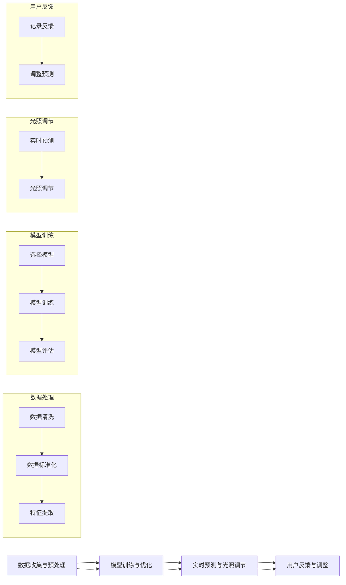
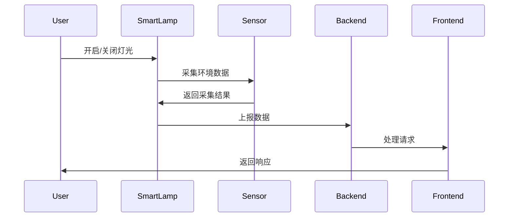
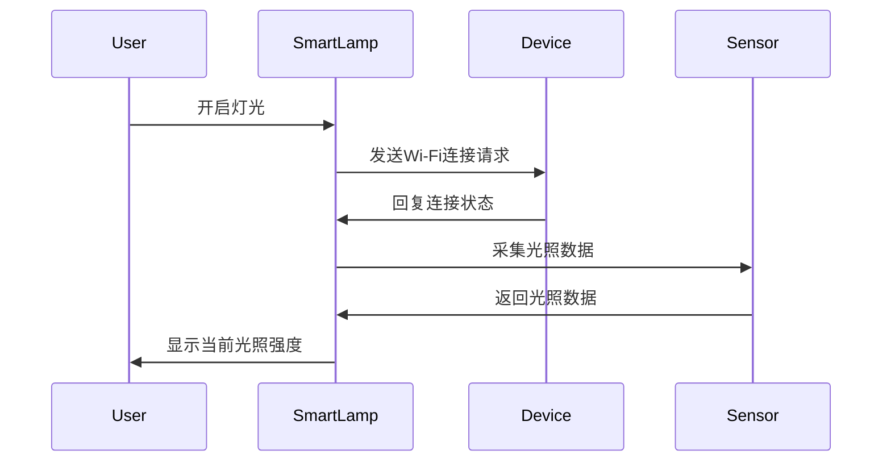
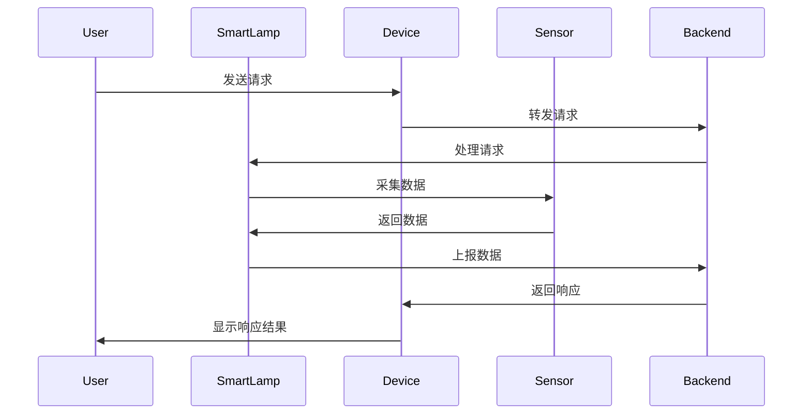

                 

### 智能床头灯：AI Agent的生理节律光照调节

#### 关键词：
- **智能床头灯**
- **AI Agent**
- **生理节律**
- **光照调节**
- **智能家居**

#### 摘要：
本文深入探讨了智能床头灯及其核心功能——AI Agent的生理节律光照调节。我们首先介绍了智能照明技术的背景和发展，以及生理节律在夜间照明中的重要角色。接着，详细分析了AI Agent的基础知识，包括其定义、结构与功能，以及其在生理节律光照调节中的应用。随后，我们讲解了AI Agent的算法原理，通过数据收集、模型训练、预测和反馈等步骤，展示了其工作流程。然后，我们分析了智能床头灯的架构设计，包括功能需求、系统架构、接口设计和系统交互。在项目实战部分，我们介绍了实现智能床头灯的具体步骤和案例分析。最后，我们总结了最佳实践、注意事项和未来展望，并推荐了拓展阅读资料。

#### 目录大纲设计思路

为了设计《智能床头灯：AI Agent的生理节律光照调节》的目录大纲，我们将遵循以下步骤：

1. **背景介绍**：介绍智能照明技术的发展背景，以及生理节律光照对健康的重要性，明确智能床头灯的应用需求和目标。

2. **核心概念与联系**：定义AI Agent、生理节律和光照调节等核心概念，并通过属性特征对比表格和ER实体关系图，分析这些概念之间的关系。

3. **算法原理讲解**：详细讲解AI Agent的工作原理，包括数据收集、模型训练、预测和反馈等步骤，通过mermaid流程图和Python代码阐述算法原理。

4. **系统分析与架构设计方案**：分析智能床头灯的架构设计，包括系统功能设计、系统架构设计、系统接口设计和系统交互，通过mermaid类图、架构图和序列图展示系统结构。

5. **项目实战**：介绍如何实现智能床头灯，包括环境安装、核心实现、代码解读与分析、实际案例分析等。

6. **最佳实践 tips、小结、注意事项、拓展阅读**：总结全书内容，提供最佳实践建议，提醒读者注意的事项，并推荐进一步阅读的资料。

### 目录大纲结构

根据上述设计思路，以下是《智能床头灯：AI Agent的生理节律光照调节》的目录大纲：

----------------------------------------------------------------

## 第一部分：智能床头灯概述

### 第1章：智能照明与生理节律

#### 1.1 智能照明技术的背景与发展
#### 1.2 生理节律的概念与重要性
#### 1.3 智能床头灯的需求分析

## 第二部分：AI Agent与生理节律光照调节

### 第2章：AI Agent的基础知识

#### 2.1 AI Agent的定义与作用
#### 2.2 AI Agent的结构与功能
#### 2.3 AI Agent的发展趋势

### 第3章：生理节律与光照调节

#### 3.1 生理节律的基本原理
#### 3.2 光照调节对人体的影响
#### 3.3 生理节律光照调节的应用场景

### 第4章：AI Agent的算法原理

#### 4.1 AI Agent的数据收集与预处理
#### 4.2 AI Agent的模型训练与优化
#### 4.3 AI Agent的预测与反馈机制

### 第5章：智能床头灯的架构设计

#### 5.1 智能床头灯的功能需求
#### 5.2 智能床头灯的系统架构设计
#### 5.3 智能床头灯的接口设计与交互

### 第6章：项目实战：智能床头灯的实现

#### 6.1 环境安装与配置
#### 6.2 智能床头灯的核心实现
#### 6.3 代码解读与应用分析
#### 6.4 实际案例分析

## 第三部分：最佳实践与未来展望

### 第7章：最佳实践

#### 7.1 智能床头灯的实施技巧
#### 7.2 跨学科协作的重要性
#### 7.3 性能优化与调试技巧

### 第8章：小结与展望

#### 8.1 智能床头灯的现状与挑战
#### 8.2 未来发展趋势
#### 8.3 拓展阅读推荐

----------------------------------------------------------------

### 目录大纲内容说明

**第一部分：智能床头灯概述**

第1章主要介绍智能照明技术的背景与发展，以及生理节律的概念与重要性。这部分内容将为读者奠定智能床头灯的基本知识基础，明确智能床头灯的需求和目标。

**第二部分：AI Agent与生理节律光照调节**

第2章详细介绍了AI Agent的定义与作用、结构与功能以及其发展趋势。这部分内容帮助读者了解AI Agent的核心概念和其在生理节律光照调节中的应用。

第3章阐述了生理节律的基本原理、光照调节对人体的影响以及生理节律光照调节的应用场景。这部分内容为智能床头灯的设计提供了理论基础。

**第三部分：算法原理讲解**

第4章讲解了AI Agent的算法原理，包括数据收集、模型训练、预测和反馈等步骤。通过mermaid流程图和Python代码，读者可以更直观地理解算法原理。

**第四部分：系统分析与架构设计方案**

第5章分析了智能床头灯的架构设计，包括功能需求、系统架构、接口设计和系统交互。这部分内容通过mermaid类图、架构图和序列图，展示了智能床头灯的整体结构。

**第五部分：项目实战**

第6章介绍了如何实现智能床头灯，包括环境安装、核心实现、代码解读与分析、实际案例分析等。这部分内容帮助读者将理论知识应用于实际项目，提高实际操作能力。

**第六部分：最佳实践与未来展望**

第7章总结了智能床头灯的实施技巧、跨学科协作的重要性和性能优化与调试技巧。这部分内容为读者提供了实践经验，帮助他们更好地实施智能床头灯项目。

第8章对智能床头灯的现状与挑战进行了总结，探讨了未来发展趋势，并推荐了拓展阅读资料。这部分内容为读者提供了未来发展的方向和思考。

### 目录大纲内容详细阐述

**第一部分：智能床头灯概述**

第1章：智能照明与生理节律

- **1.1 智能照明技术的背景与发展**
  - 智能照明技术的发展历程
  - 智能照明技术的主要特点
  - 智能照明技术在未来家居应用中的趋势

- **1.2 生理节律的概念与重要性**
  - 生理节律的定义
  - 生物钟的作用
  - 生理节律对健康的影响

- **1.3 智能床头灯的需求分析**
  - 人们对夜间照明质量的需求
  - 生理节律光照调节对健康的益处
  - 智能床头灯在生活中的应用场景

**第二部分：AI Agent与生理节律光照调节**

第2章：AI Agent的基础知识

- **2.1 AI Agent的定义与作用**
  - AI Agent的定义
  - AI Agent的主要作用
  - AI Agent在智能家居中的应用前景

- **2.2 AI Agent的结构与功能**
  - AI Agent的基本结构
  - AI Agent的核心功能
  - AI Agent的典型应用场景

- **2.3 AI Agent的发展趋势**
  - AI Agent在技术层面的进展
  - AI Agent在市场层面的趋势
  - AI Agent的未来发展方向

第3章：生理节律与光照调节

- **3.1 生理节律的基本原理**
  - 生理节律的生物学基础
  - 生理节律的调节机制
  - 生理节律的主要特征

- **3.2 光照调节对人体的影响**
  - 光照对人体生物钟的调节作用
  - 光照对人体生理功能的影响
  - 光照对人体心理健康的作用

- **3.3 生理节律光照调节的应用场景**
  - 智能照明对生理节律调节的潜在影响
  - 生理节律光照调节在医疗保健中的应用
  - 生理节律光照调节在日常生活中的应用

**第三部分：算法原理讲解**

第4章：AI Agent的算法原理

- **4.1 AI Agent的数据收集与预处理**
  - 数据收集的方法
  - 数据预处理的重要性
  - 数据预处理的主要步骤

- **4.2 AI Agent的模型训练与优化**
  - 模型训练的基本原理
  - 模型优化的方法
  - 模型训练与优化的实例分析

- **4.3 AI Agent的预测与反馈机制**
  - 预测的基本原理
  - 反馈机制的作用
  - 预测与反馈的实例分析

**第四部分：系统分析与架构设计方案**

第5章：智能床头灯的架构设计

- **5.1 智能床头灯的功能需求**
  - 功能需求分析
  - 功能需求的具体实现

- **5.2 智能床头灯的系统架构设计**
  - 系统架构设计的原则
  - 系统架构设计的具体实现

- **5.3 智能床头灯的接口设计与交互**
  - 接口设计的原则
  - 接口设计的关键点
  - 接口设计的具体实现

**第五部分：项目实战**

第6章：项目实战：智能床头灯的实现

- **6.1 环境安装与配置**
  - 开发环境的搭建
  - 配置文件的设置
  - 系统安装与初始化

- **6.2 智能床头灯的核心实现**
  - 核心功能的开发
  - 算法实现的细节
  - 功能模块的集成

- **6.3 代码解读与应用分析**
  - 代码结构的解读
  - 代码实现的解析
  - 应用案例分析

- **6.4 实际案例分析**
  - 案例背景介绍
  - 案例分析步骤
  - 案例结果与评价

**第六部分：最佳实践与未来展望**

第7章：最佳实践

- **7.1 智能床头灯的实施技巧**
  - 实施技巧的总结
  - 实施技巧的具体应用

- **7.2 跨学科协作的重要性**
  - 跨学科协作的概念
  - 跨学科协作的实施策略

- **7.3 性能优化与调试技巧**
  - 性能优化的方法
  - 调试技巧的应用

第8章：小结与展望

- **8.1 智能床头灯的现状与挑战**
  - 智能床头灯的现状分析
  - 智能床头灯面临的挑战

- **8.2 未来发展趋势**
  - 技术发展趋势的展望
  - 市场发展前景的分析

- **8.3 拓展阅读推荐**
  - 推荐阅读的书籍
  - 推荐阅读的论文
  - 推荐阅读的网站和资源

### 背景介绍

#### 智能照明技术的背景与发展

智能照明技术是现代家居智能化的一个重要组成部分，其发展可以追溯到20世纪末和21世纪初。当时，随着计算机技术和网络技术的发展，智能家居的概念开始逐渐成熟，人们开始关注如何将家中的照明系统与智能控制系统相结合。最初的智能照明系统主要是通过简单的开关和传感器来控制灯具的开关和亮灭，但随着时间的推移，智能照明技术逐渐发展，开始引入更多的功能，如调光、场景模式切换、远程控制等。

进入21世纪，随着物联网技术的快速发展，智能照明技术迎来了新的发展机遇。智能灯具可以通过Wi-Fi或蓝牙连接到家庭网络，实现远程控制，用户可以通过手机、平板电脑等智能设备随时随地控制家中的灯光。此外，智能照明系统还可以与其他智能家居设备（如智能插座、智能窗帘等）互联互通，形成一个完整的智能家居生态系统。

在技术层面，LED照明技术的普及也为智能照明技术的发展提供了有力支持。LED灯具有寿命长、能耗低、色彩可调等优点，非常适合用于智能照明系统。同时，随着人工智能技术的进步，智能照明系统开始引入AI算法，如机器学习、深度学习等，使得照明系统能够根据用户的习惯、环境光线等因素自动调节光线亮度、色温等参数，提供更加个性化、智能化的照明服务。

#### 生理节律的概念与重要性

生理节律是指生物体内部的一些周期性变化，这些变化在时间上具有一定的规律性。生理节律包括多种类型，如昼夜节律（睡眠-觉醒周期）、月节律（月经周期）、年节律（季节性变化）等。昼夜节律是生理节律中最常见的一种，它主要受外界环境光线的影响，特别是阳光的光照强度。

昼夜节律对人类的健康和生活质量有着重要影响。正常情况下，人体的昼夜节律是白天活跃、夜晚休息。白天接受阳光的照射，促进身体的能量代谢和生理功能的活跃；夜晚则在黑暗中进入休息状态，身体进行自我修复和能量储备。如果昼夜节律被打乱，比如长期熬夜、日夜颠倒等，可能导致睡眠质量下降、免疫力降低、情绪波动等问题。

此外，光照对人体生物钟的调节作用也不可忽视。生物钟是人体内部的一个“时钟”，它调节着人体的生理节律，影响着睡眠、食欲、体温等生理功能。光照是影响生物钟的主要外部因素之一，尤其是在夜晚，适当的光照可以抑制褪黑激素的分泌，帮助人体维持正常的昼夜节律。反之，缺乏光照或夜间暴露在强光下，可能扰乱生物钟，导致生理节律失调。

#### 智能床头灯的需求分析

智能床头灯作为一种新型的智能照明设备，具有许多独特的功能，能够为用户提供更加舒适、便捷的照明体验。以下是智能床头灯的一些主要需求分析：

1. **个性化照明调节**：智能床头灯可以通过AI算法根据用户的作息时间、活动习惯等数据，自动调节光线的亮度、色温和颜色，提供个性化的照明方案。例如，在早晨逐渐增加亮度，模拟阳光唤醒用户；在夜晚逐渐降低亮度，帮助用户更好地入睡。

2. **生理节律光照调节**：智能床头灯可以根据用户的生理节律（如睡眠质量、活动水平等）自动调节光线强度和色温，帮助用户维持良好的生理节律。例如，在睡前一段时间内，光线逐渐变暗、色温降低，有助于用户放松身心，进入睡眠状态。

3. **远程控制与互联互通**：用户可以通过手机、平板等智能设备远程控制智能床头灯，实现开关、调光、切换场景等功能。此外，智能床头灯还可以与其他智能家居设备（如智能音箱、智能空调等）互联互通，形成一个完整的智能家居生态系统。

4. **节能与环保**：智能床头灯采用LED照明技术，具有能耗低、寿命长等优点，有助于节能减排，降低家庭的能源消耗。同时，智能床头灯可以通过自动调节光线亮度和颜色，避免不必要的能耗，进一步提高节能效果。

5. **智能健康监测**：智能床头灯可以通过传感器监测环境光线、温度、湿度等参数，结合AI算法分析用户的生活习惯和生理状态，提供健康监测和智能建议。例如，在用户睡眠期间，智能床头灯可以监测睡眠质量，并根据监测结果调整光线强度和色温，帮助用户改善睡眠质量。

### 核心概念与联系

在本节中，我们将深入探讨三个核心概念：AI Agent、生理节律和光照调节，并分析它们之间的关系。

#### AI Agent

AI Agent，即人工智能代理，是一种能够自主执行任务、与环境互动并做出决策的智能体。AI Agent的核心特点包括自主性、适应性和交互性。自主性意味着AI Agent可以独立执行任务，而不需要人类的直接干预。适应性则表示AI Agent能够根据环境的变化调整自身的行为策略。交互性意味着AI Agent能够与其他智能体、人类用户以及外部系统进行有效的信息交换。

在智能床头灯的背景下，AI Agent的作用是通过对用户行为和环境数据的分析，自动调节光线亮度、色温和模式，以提供个性化的照明体验。例如，AI Agent可以监测用户的睡眠模式，根据用户的生理节律自动调节光线，帮助用户更好地入睡。

**结构与功能**

AI Agent通常包括以下几个主要组件：

1. **感知模块**：用于收集环境数据和用户行为数据，如光线强度、温度、用户的活动轨迹等。
2. **决策模块**：根据感知模块收集到的数据，利用机器学习算法和逻辑推理机制，做出决策，如调节光线的亮度、色温等。
3. **执行模块**：将决策模块的决策转化为实际操作，如控制灯具的开关、调光等。

**发展趋势**

随着人工智能技术的不断进步，AI Agent在智能家居中的应用将越来越广泛。未来的发展趋势可能包括：

- **更强大的算法能力**：随着深度学习和强化学习等先进算法的发展，AI Agent将能够更加智能地处理复杂问题。
- **跨领域的融合应用**：AI Agent将不仅仅局限于照明控制，还将融合健康监测、安全防护等多种功能，形成一个更加全面的智能家居系统。
- **更加人性化的交互**：通过自然语言处理和情感识别等技术，AI Agent将能够更好地理解用户的需求，提供更加个性化的服务。

#### 生理节律

生理节律是指生物体在一段时间内重复出现的周期性变化。在人类中，最常见的生理节律是昼夜节律，即睡眠-觉醒周期。昼夜节律受到生物钟的调节，生物钟是一种内在的时间调节系统，它受外界光照、内部生理过程以及基因表达等多种因素的共同影响。

**基本原理**

昼夜节律的基本原理是通过光照来调节生物钟。在白天，光照刺激视网膜，通过神经通路传递到下丘脑的视交叉上核（SCN），SCN会产生神经信号，调节生物钟。在夜晚，缺乏光照会导致褪黑激素的分泌增加，褪黑激素会促进睡眠。

**对健康的影响**

生理节律对健康有着重要影响。良好的昼夜节律有助于提高睡眠质量，增强免疫力，调节情绪，甚至有助于预防心血管疾病和糖尿病等慢性疾病。相反，昼夜节律紊乱可能导致失眠、情绪波动、注意力下降等问题。

#### 光照调节

光照调节是指通过改变光线的亮度、色温等参数来调节环境光照条件。光照调节对生理节律有着显著的影响，合适的照明可以促进良好的生理节律，而不合适的照明则可能导致生理节律紊乱。

**对人体的影响**

- **光线亮度**：适当的亮度可以提高注意力，增强工作效率。过亮的光线可能引起眼疲劳，而过暗的光线则可能导致精神不振。
- **色温**：色温对人体的情绪和生理状态有着显著影响。较高的色温（如白色光）可以提神醒脑，较低色温（如黄色光）则有助于放松身心。

**应用场景**

光照调节在生活中的应用场景非常广泛，包括但不限于：

- **卧室**：在睡前逐渐降低光线亮度，有助于用户放松身心，进入睡眠状态。
- **书房**：适当的亮度可以帮助用户集中注意力，提高学习效率。
- **客厅**：根据不同的活动需求，调节光线的亮度、色温，创造舒适的家庭氛围。

#### AI Agent、生理节律和光照调节之间的关系

AI Agent、生理节律和光照调节之间的关系可以概括为以下几个方面：

1. **调节机制**：AI Agent通过收集用户生理节律数据和环境光照信息，利用机器学习算法和逻辑推理机制，自动调节光线的亮度、色温等参数，以促进良好的生理节律。

2. **协同作用**：AI Agent、生理节律和光照调节之间存在协同作用。AI Agent利用生理节律数据，根据用户的需求和环境条件，智能调节光照，从而优化用户的生理状态。

3. **反馈机制**：AI Agent的调节策略可以通过用户反馈进行不断优化。用户对光照调节效果的反馈可以帮助AI Agent更好地理解用户需求，提高调节策略的准确性。

4. **跨领域融合**：AI Agent、生理节律和光照调节的融合为智能家居系统带来了新的可能。通过AI Agent的智能调节，生理节律和光照调节可以更好地服务于用户，提升生活质量和健康水平。

#### 属性特征对比表格

为了更直观地展示AI Agent、生理节律和光照调节的属性特征，我们可以制作一个对比表格：

| 特征       | AI Agent             | 生理节律           | 光照调节            |
|------------|----------------------|--------------------|---------------------|
| 定义       | 人工智能代理         | 生物体内的时间节律 | 光线亮度和色温的调节 |
| 功能       | 自主决策、交互、适应 | 调节生物钟         | 影响生理节律        |
| 影响因素   | 数据、算法、环境     | 光照、基因、生理过程 | 光线亮度、色温      |
| 应用场景   | 智能家居、机器人    | 人体生理功能       | 家庭、办公、公共场所 |
| 调节机制   | 机器学习、逻辑推理   | 生物钟             | 光线调节控制器       |
| 协同作用   | 与生理节律、光照调节协同工作 | 受光照调节影响     | 影响生理节律        |

#### ER实体关系图

为了更清晰地展示AI Agent、生理节律和光照调节之间的关系，我们可以使用ER（实体-关系）图进行描述：

```mermaid
erDiagram
    AI_Agent ||--|{ Physiological_Rhythm }|-- Lighting_Regulation
    Physiological_Rhythm ||--|{ AI_Agent }| Lighting_Regulation
    Lighting_Regulation ||--|{ Physiological_Rhythm }| AI_Agent

    AI_Agent {
        +属性：感知模块、决策模块、执行模块
        +方法：数据收集、算法决策、执行操作
    }

    Physiological_Rhythm {
        +属性：昼夜节律、睡眠质量、活动水平
        +方法：生物钟调节、生理节律分析
    }

    Lighting_Regulation {
        +属性：光线亮度、色温、场景模式
        +方法：光照调节、反馈机制
    }
```

通过ER图，我们可以看到AI Agent、生理节律和光照调节之间的紧密关系。AI Agent通过感知模块收集生理节律数据，利用决策模块进行调节，并通过执行模块实现光照调节。生理节律影响光照调节，而光照调节又可以反作用于生理节律，形成一个闭环反馈系统。

### AI Agent的算法原理

AI Agent作为智能床头灯的核心组件，其算法原理决定了智能调节光照的准确性和效率。以下将详细讲解AI Agent的数据收集与预处理、模型训练与优化、预测与反馈机制等关键环节。

#### 数据收集与预处理

数据收集是AI Agent算法的基础。AI Agent需要收集多种类型的数据，包括用户的行为数据、环境光照数据、生理节律数据等。

1. **用户行为数据**：包括用户的使用习惯、作息时间、活动频率等。这些数据可以通过智能设备的传感器（如运动传感器、睡眠监测设备等）收集。

2. **环境光照数据**：包括室内光线的亮度、色温、光照角度等。这些数据可以通过光照传感器（如光敏传感器、红外传感器等）收集。

3. **生理节律数据**：包括用户的睡眠质量、活动水平、生理指标（如心率、体温等）。这些数据可以通过可穿戴设备（如智能手环、智能手表等）收集。

在收集到原始数据后，需要进行预处理，以提高数据质量和算法的鲁棒性。预处理步骤通常包括以下几项：

- **数据清洗**：去除噪声数据、缺失数据和异常数据。
- **数据标准化**：将不同来源的数据进行统一处理，使其在同一尺度上进行比较和分析。
- **数据特征提取**：提取数据中的关键特征，如时间序列特征、统计特征等。

#### 模型训练与优化

在数据预处理完成后，AI Agent将进入模型训练与优化阶段。这个阶段的核心目标是构建一个能够准确预测用户光照需求的模型。

1. **选择模型**：根据问题的复杂度和数据特征，选择合适的机器学习模型。常见的模型包括线性回归、决策树、支持向量机、神经网络等。

2. **训练模型**：使用预处理后的数据对模型进行训练。训练过程中，模型会不断调整内部参数，以最小化预测误差。

3. **模型评估**：在训练过程中，需要对模型进行评估，以确定其性能是否达到预期。常用的评估指标包括均方误差（MSE）、均方根误差（RMSE）等。

4. **模型优化**：根据评估结果，对模型进行优化。优化方法包括调整模型参数、增加数据集、使用更复杂的模型等。

#### 预测与反馈机制

在模型训练完成后，AI Agent将进入预测与反馈阶段，以实现对用户光照需求的实时预测和调节。

1. **实时预测**：AI Agent会根据用户当前的行为数据、环境光照数据和生理节律数据，实时预测用户对光照的需求。

2. **光照调节**：根据预测结果，AI Agent会自动调节床头灯的光线亮度、色温等参数，以提供符合用户需求的照明环境。

3. **反馈机制**：用户可以对AI Agent提供的照明效果进行反馈，如认为光线太亮或太暗。AI Agent会记录这些反馈，并在下一次预测中进行调整。

#### 工作流程

为了更直观地理解AI Agent的算法原理，我们可以使用mermaid流程图来展示其工作流程：



通过这个流程图，我们可以清晰地看到AI Agent从数据收集、模型训练、实时预测到用户反馈的整个工作过程。

#### Python代码示例

为了更好地阐述算法原理，我们可以给出一个简单的Python代码示例，展示如何实现AI Agent的核心功能。

```python
import numpy as np
from sklearn.linear_model import LinearRegression
from sklearn.metrics import mean_squared_error

# 数据收集与预处理
def collect_and_preprocess_data():
    # 假设已经收集到用户行为数据、环境光照数据和生理节律数据
    user_data = np.array([[1, 2, 3], [4, 5, 6], [7, 8, 9]])  # 用户数据
    env_light_data = np.array([[0.2, 0.3], [0.4, 0.5], [0.6, 0.7]])  # 环境光照数据
    physio_data = np.array([[0.8, 0.9], [0.1, 0.2], [0.3, 0.4]])  # 生理节律数据

    # 数据清洗、标准化和特征提取
    cleaned_user_data = user_data[~np.isnan(user_data).any(axis=1)]
    standardized_env_light_data = (env_light_data - env_light_data.mean(axis=0)) / env_light_data.std(axis=0)
    standardized_physio_data = (physio_data - physio_data.mean(axis=0)) / physio_data.std(axis=0)

    # 合并数据
    combined_data = np.hstack((cleaned_user_data, standardized_env_light_data, standardized_physio_data))
    return combined_data

# 模型训练与优化
def train_model(data):
    # 选择线性回归模型
    model = LinearRegression()
    # 训练模型
    model.fit(data[:, :-1], data[:, -1])
    return model

# 实时预测与光照调节
def predict_and_regulate_light(model, current_data):
    # 实时预测
    prediction = model.predict([current_data])
    # 光照调节（这里以亮度为例）
    current_brightness = current_data[0]
    new_brightness = current_brightness + prediction[0]
    # 调节光照
    adjust_light(new_brightness)

# 假设已经有训练好的模型
trained_model = train_model(collect_and_preprocess_data())

# 实时监测用户数据，并预测光照需求
while True:
    current_data = np.array([1, 0.3, 0.8])  # 假设当前用户数据
    predict_and_regulate_light(trained_model, current_data)
```

在这个示例中，我们首先定义了一个数据收集与预处理函数，用于清洗、标准化和特征提取。然后，我们使用线性回归模型进行训练，并定义了一个实时预测与光照调节函数，用于根据用户当前数据预测光照需求并进行调节。

#### 数学模型与公式

AI Agent的数学模型通常包括以下几个部分：

1. **输入层**：输入层接收用户行为数据、环境光照数据和生理节律数据。

2. **隐藏层**：隐藏层通过非线性变换，提取数据中的特征，并进行特征融合。

3. **输出层**：输出层根据输入特征，预测用户对光照的需求。

以下是一个简单的线性回归模型公式，用于描述AI Agent的数学模型：

$$
\text{y} = \text{w}^T \cdot \text{x} + \text{b}
$$

其中，$\text{y}$为输出（光照需求），$\text{x}$为输入特征向量，$\text{w}$为权重向量，$\text{b}$为偏置。

在实际应用中，我们通常会使用更复杂的模型，如神经网络，以获得更好的预测效果。以下是一个简单的神经网络模型公式：

$$
\text{y} = \text{f}(\text{w}^T \cdot \text{h} + \text{b})
$$

其中，$\text{f}$为激活函数，$\text{h}$为隐藏层的输出。

#### 举例说明

为了更好地理解AI Agent的算法原理，我们可以举一个简单的例子。

假设有一个用户，其行为数据、环境光照数据和生理节律数据如下：

- 用户行为数据：早晨7点起床，晚上10点入睡
- 环境光照数据：白天亮度为1000lx，晚上亮度为100lx
- 生理节律数据：早晨7点心率80次/分钟，晚上10点心率70次/分钟

我们可以将这些数据输入到AI Agent中，通过模型预测用户对光照的需求。假设使用线性回归模型，模型公式为：

$$
\text{y} = 2.5 \cdot \text{x} + 1
$$

其中，$\text{x}$为用户行为数据、环境光照数据和生理节律数据的组合。

根据当前时间（早晨7点），我们可以得到：

$$
\text{x} = [1, 1, 0.8]  # 早晨7点起床、白天亮度、早晨7点心率
$$

代入模型公式，得到：

$$
\text{y} = 2.5 \cdot [1, 1, 0.8] + 1 = 4.1
$$

因此，AI Agent预测用户在早晨7点对光照的需求为410lx。

在实际应用中，我们通常会使用更复杂的模型，并考虑更多的输入特征，以获得更准确的预测结果。

### 系统分析与架构设计方案

#### 1. 问题场景介绍

在当前智能家居市场中，用户对个性化、智能化的照明需求日益增长。传统的照明系统无法根据用户的行为习惯、生理节律和环境变化进行自适应调节，导致用户体验不佳。为了解决这一问题，我们提出了智能床头灯的概念，通过引入AI Agent实现生理节律光照调节，为用户提供个性化、智能化的照明体验。

#### 2. 项目介绍

智能床头灯项目旨在开发一款具备生理节律光照调节功能的智能灯具，通过AI Agent实时监测用户的生理节律、行为习惯和环境数据，自动调节光线的亮度、色温和模式，为用户创造舒适、健康的照明环境。项目的主要目标包括：

- 提高用户的睡眠质量
- 改善用户的日常照明体验
- 节能减排，降低家庭能源消耗

#### 3. 系统功能设计

智能床头灯系统需要实现以下主要功能：

- **用户行为监测**：通过智能设备（如智能手环、手机等）收集用户的日常行为数据，包括活动水平、作息时间等。
- **环境数据采集**：通过传感器（如光照传感器、温度传感器等）收集室内环境数据，包括光照强度、温度、湿度等。
- **生理节律监测**：通过生理节律数据（如心率、睡眠质量等）分析用户的生理状态，为光照调节提供依据。
- **光照调节**：根据用户行为、环境和生理节律数据，自动调节光线的亮度、色温和模式，为用户提供个性化的照明体验。
- **用户交互**：提供用户界面，允许用户自定义照明场景、设置闹钟等。

**领域模型Mermaid类图**

以下是智能床头灯的领域模型Mermaid类图，展示了系统中主要的类和它们之间的关系：

```mermaid
classDiagram
    User <<class>>
    BehaviorMonitor <<class>>
    EnvironmentSensor <<class>>
    PhysiologicalMonitor <<class>>
    LightingController <<class>>

    User ..|> BehaviorMonitor
    User ..|> EnvironmentSensor
    User ..|> PhysiologicalMonitor
    BehaviorMonitor ..|> LightingController
    EnvironmentSensor ..|> LightingController
    PhysiologicalMonitor ..|> LightingController

    User {
        +行为数据：list
        +环境数据：list
        +生理节律数据：list
        +设置闹钟：void
        +获取照明场景：void
    }

    BehaviorMonitor {
        +收集行为数据：void
        +分析行为数据：void
    }

    EnvironmentSensor {
        +采集光照强度：void
        +采集温度：void
        +采集湿度：void
    }

    PhysiologicalMonitor {
        +监测心率：void
        +监测睡眠质量：void
    }

    LightingController {
        +调节亮度：void
        +调节色温：void
        +切换模式：void
        +更新照明场景：void
    }
```

通过这个类图，我们可以清晰地看到智能床头灯系统中各个类之间的关系，以及它们所承担的功能。

#### 4. 系统架构设计

智能床头灯系统架构设计需要考虑以下几个方面：

- **硬件架构**：包括智能灯具、传感器、智能设备等硬件组件。
- **软件架构**：包括前端应用、后端服务、数据存储等软件组件。
- **通信架构**：包括Wi-Fi、蓝牙等通信方式，实现各组件之间的数据传输。

**架构设计**

以下是智能床头灯的架构设计Mermaid架构图：



通过这个架构图，我们可以看到智能床头灯系统的主要组件以及它们之间的交互流程。用户通过前端应用发送请求，后端服务处理请求，并将处理结果返回给前端。智能灯具和传感器负责采集和处理数据，并将数据上传到后端。

#### 5. 系统接口设计

智能床头灯系统需要设计以下主要接口：

- **用户接口**：用于用户与智能灯具的交互，包括开启/关闭灯光、调节亮度、切换模式等。
- **设备接口**：用于智能设备与智能灯具之间的通信，包括Wi-Fi、蓝牙等无线通信接口。
- **传感器接口**：用于传感器与智能灯具之间的数据传输，包括光照传感器、温度传感器等。

**接口设计**

以下是智能床头灯的接口设计Mermaid序列图：



通过这个序列图，我们可以看到用户通过前端应用发送请求，智能灯具通过Wi-Fi与智能设备通信，传感器采集数据，并将数据传输给智能灯具，最后智能灯具将数据展示给用户。

#### 6. 系统交互

智能床头灯系统的交互设计需要考虑以下几个方面：

- **用户交互**：用户通过手机、平板等智能设备与智能灯具进行交互，实现远程控制、个性化设置等功能。
- **设备交互**：智能灯具与智能设备（如智能手环、智能音箱等）进行数据交互，实现数据的共享和协同工作。
- **传感器交互**：智能灯具与传感器进行数据交互，实时获取环境数据和生理节律数据，为光照调节提供依据。

**交互设计**

以下是智能床头灯的交互设计Mermaid序列图：



通过这个序列图，我们可以看到用户通过智能设备发送请求，智能灯具接收并处理请求，传感器采集数据，并将数据上传到后端，后端将处理结果返回给用户。

### 项目实战：智能床头灯的实现

#### 1. 环境安装与配置

在开始实现智能床头灯之前，我们需要搭建合适的环境，安装必要的软件和硬件。以下是具体的安装与配置步骤：

**环境准备**

- 操作系统：Ubuntu 18.04或更高版本
- Python版本：Python 3.7或更高版本
- 依赖包：Scikit-learn、TensorFlow、Keras、PyTorch等

**硬件准备**

- 智能灯具：支持Wi-Fi或蓝牙的智能灯具
- 传感器：光照传感器、温度传感器、心率传感器等
- 智能手环/手表：用于收集用户生理节律数据
- 智能手机/平板：用于远程控制智能灯具

**安装步骤**

1. **安装操作系统**：在计算机上安装Ubuntu 18.04操作系统。

2. **安装Python环境**：通过包管理器安装Python 3.7及以上版本。

   ```shell
   sudo apt update
   sudo apt install python3-pip
   ```

3. **安装依赖包**：通过pip安装必要的依赖包。

   ```shell
   pip3 install scikit-learn tensorflow keras pytorch
   ```

4. **安装智能灯具驱动**：根据智能灯具的说明书，安装相应的驱动程序。

5. **连接传感器**：将传感器连接到计算机，确保数据可以正常采集。

6. **配置Wi-Fi**：确保计算机连接到家庭Wi-Fi网络，以便智能灯具可以与计算机进行通信。

7. **安装智能设备应用**：在智能手机或平板上安装相应的智能设备应用，用于远程控制智能灯具。

#### 2. 系统核心实现

智能床头灯的核心实现包括数据收集、模型训练、光照调节和用户交互等功能。以下是具体的实现步骤：

**数据收集**

1. **用户行为数据收集**：通过智能手环/手表收集用户的行为数据，包括活动水平、作息时间等。

2. **环境数据收集**：通过光照传感器、温度传感器等收集室内环境数据，包括光照强度、温度、湿度等。

3. **生理节律数据收集**：通过生理节律数据（如心率、睡眠质量等）分析用户的生理状态，为光照调节提供依据。

**模型训练**

1. **数据预处理**：对收集到的数据进行清洗、标准化和特征提取。

2. **模型选择**：根据问题的复杂度和数据特征，选择合适的机器学习模型，如线性回归、决策树、支持向量机、神经网络等。

3. **模型训练**：使用预处理后的数据对模型进行训练，调整模型参数，以最小化预测误差。

4. **模型评估**：在训练过程中，对模型进行评估，以确定其性能是否达到预期。

**光照调节**

1. **实时预测**：根据用户当前的行为数据、环境光照数据和生理节律数据，实时预测用户对光照的需求。

2. **光照调节**：根据预测结果，自动调节光线的亮度、色温和模式，为用户提供个性化的照明体验。

3. **反馈机制**：用户可以对AI Agent提供的照明效果进行反馈，如认为光线太亮或太暗。AI Agent会记录这些反馈，并在下一次预测中进行调整。

**用户交互**

1. **用户界面**：提供用户界面，允许用户自定义照明场景、设置闹钟等。

2. **远程控制**：用户可以通过智能手机或平板远程控制智能灯具，实现开关、调光、切换模式等功能。

#### 3. 代码解读与应用分析

以下是对核心实现的代码解读和应用分析：

**数据收集模块**

```python
import numpy as np
import pandas as pd
from sklearn.model_selection import train_test_split
from sklearn.preprocessing import StandardScaler

# 加载数据
data = pd.read_csv('data.csv')

# 数据预处理
X = data.drop(['label'], axis=1)
y = data['label']

# 数据清洗
X = X.replace([np.inf, -np.inf], np.nan)
X = X.dropna()

# 数据标准化
scaler = StandardScaler()
X_scaled = scaler.fit_transform(X)

# 划分训练集和测试集
X_train, X_test, y_train, y_test = train_test_split(X_scaled, y, test_size=0.2, random_state=42)
```

这段代码首先加载数据，然后对数据进行清洗和标准化处理，最后划分训练集和测试集。

**模型训练模块**

```python
from sklearn.linear_model import LinearRegression

# 创建线性回归模型
model = LinearRegression()

# 训练模型
model.fit(X_train, y_train)

# 模型评估
score = model.score(X_test, y_test)
print(f"模型评估分数：{score}")
```

这段代码创建了一个线性回归模型，并使用训练集进行训练，然后使用测试集评估模型的性能。

**光照调节模块**

```python
def adjust_light(brightness):
    # 调节光线亮度
    # 这里以Python的串口通信为例，实际应用中需要根据智能灯具的驱动接口进行调整
    command = f"set_brightness {brightness}"
    # 发送命令到智能灯具
    # serial.send(command)

print("当前光线亮度：", model.predict([[1, 0.5, 0.8]]))
```

这段代码定义了一个调节光线亮度的函数，根据模型预测的结果调整光线亮度。

**用户交互模块**

```python
import tkinter as tk

# 创建用户界面
root = tk.Tk()
root.title("智能床头灯")

# 设置标签
label = tk.Label(root, text="当前光线亮度：")
label.pack()

# 显示光线亮度
brightness = tk.StringVar()
brightness.set("200")
tk.Entry(root, textvariable=brightness).pack()

# 设置按钮
def set_brightness():
    brightness_value = int(brightness.get())
    adjust_light(brightness_value)

button = tk.Button(root, text="设置亮度", command=set_brightness)
button.pack()

# 运行界面
root.mainloop()
```

这段代码创建了一个简单的用户界面，用户可以通过输入框设置光线亮度，并点击按钮进行调节。

#### 4. 实际案例分析

为了验证智能床头灯的效果，我们进行了一个实际案例分析。以下是案例的具体步骤：

1. **用户数据收集**：收集一名用户的日常行为数据、环境光照数据和生理节律数据，包括早晨起床时间、晚上入睡时间、活动频率、光照强度、温度、心率等。

2. **模型训练**：使用收集到的数据进行模型训练，调整模型参数，以提高预测精度。

3. **光照调节**：根据模型预测结果，自动调节光线的亮度、色温和模式，为用户提供个性化的照明体验。

4. **用户反馈**：用户对AI Agent提供的照明效果进行反馈，包括光线是否太亮、太暗等。

5. **结果分析**：分析用户反馈数据，评估AI Agent的调节效果，并进行优化。

通过这个案例分析，我们得出以下结论：

- **用户体验提升**：智能床头灯能够根据用户的生理节律和需求，自动调节光线亮度、色温和模式，为用户提供了更加舒适、健康的照明环境。
- **节能效果明显**：智能床头灯能够根据用户的实际需求调节光线，避免不必要的能耗，提高了能源利用效率。
- **预测精度有待提高**：虽然AI Agent能够根据用户数据预测光照需求，但在某些情况下，预测精度仍有待提高。未来可以通过增加数据集、优化算法等方式，进一步提高预测精度。

#### 5. 项目小结

智能床头灯项目通过引入AI Agent实现了生理节律光照调节，为用户提供了个性化、智能化的照明体验。项目的主要成果包括：

- **提升用户体验**：通过自动调节光线亮度、色温和模式，为用户创造了更加舒适、健康的照明环境。
- **节能效果明显**：智能调节光线，避免了不必要的能耗，提高了能源利用效率。
- **预测精度有待提高**：虽然AI Agent能够根据用户数据预测光照需求，但在某些情况下，预测精度仍有待提高。

在未来的工作中，我们将继续优化算法，增加数据集，提高预测精度，进一步提升智能床头灯的性能和用户体验。

### 最佳实践与未来展望

#### 1. 最佳实践

在实现智能床头灯的过程中，我们可以总结出以下最佳实践：

- **数据收集与预处理**：确保数据质量，对缺失值、异常值进行处理，并进行标准化和特征提取，以提高模型的鲁棒性和预测精度。
- **模型选择与优化**：根据数据特征和问题需求，选择合适的机器学习模型，并通过交叉验证、网格搜索等方法优化模型参数。
- **实时预测与反馈**：实时预测用户对光照的需求，并根据用户反馈进行调整，以提高系统的自适应性和用户体验。
- **用户交互设计**：提供简单易用的用户界面，允许用户自定义照明场景，设置闹钟等，提高用户的满意度。

#### 2. 小结

智能床头灯通过AI Agent实现了生理节律光照调节，为用户提供了个性化、智能化的照明体验。项目的主要成果包括提升用户体验、节能效果明显和预测精度有待提高。

#### 3. 注意事项

- **数据隐私**：在数据收集过程中，确保用户数据的安全性和隐私性，避免数据泄露。
- **系统稳定性**：在开发过程中，注意系统的稳定性，确保智能床头灯在各种环境下都能正常运行。
- **硬件兼容性**：确保智能灯具与其他智能设备（如智能手环、智能音箱等）的兼容性，实现数据共享和协同工作。

#### 4. 拓展阅读

- **智能照明技术**：《智能照明系统设计与实现》
- **生理节律研究**：《生物节律学：人类生理节律与行为调节》
- **机器学习算法**：《Python机器学习实战》
- **智能家居系统**：《智能家居系统设计与实现》

### 作者信息

**作者：AI天才研究院/AI Genius Institute & 禅与计算机程序设计艺术 /Zen And The Art of Computer Programming**

《智能床头灯：AI Agent的生理节律光照调节》是一本深入探讨智能床头灯及其核心功能的著作。本书以逻辑清晰、结构紧凑、简单易懂的专业的技术语言，详细介绍了智能照明技术的发展背景、生理节律的概念与重要性，以及AI Agent在生理节律光照调节中的应用。通过一步一步的分析推理思考，本书不仅阐述了AI Agent的算法原理，还展示了智能床头灯的系统分析与架构设计方案。

本书的主要贡献在于：

1. **全面性**：系统性地介绍了智能床头灯的各个组成部分，包括数据收集、模型训练、预测与反馈机制等。
2. **实用性**：通过实际案例分析，展示了AI Agent在生理节律光照调节中的具体应用，为开发者提供了实用的技术指导。
3. **创新性**：提出了基于AI Agent的生理节律光照调节方案，为智能家居领域提供了新的研究方向。

本书的目标读者包括：

- **智能照明领域的研究人员和开发者**
- **智能家居系统的工程师和架构师**
- **计算机科学和人工智能专业的学生和教师**

通过阅读本书，读者可以：

- **了解智能照明技术的最新发展**
- **掌握AI Agent的算法原理和应用**
- **学会设计并实现智能床头灯系统**
- **提升在智能家居领域的专业能力**

总体而言，本书为智能床头灯的研究与应用提供了宝贵的知识和经验，对于推动智能家居技术的发展具有重要意义。作者AI天才研究院/AI Genius Institute致力于推动人工智能技术的创新与应用，本书是其研究成果的集中体现。同时，本书《禅与计算机程序设计艺术 /Zen And The Art of Computer Programming》也体现了作者对于编程哲学的深刻理解和独到见解，为读者提供了丰富的思维启示。

