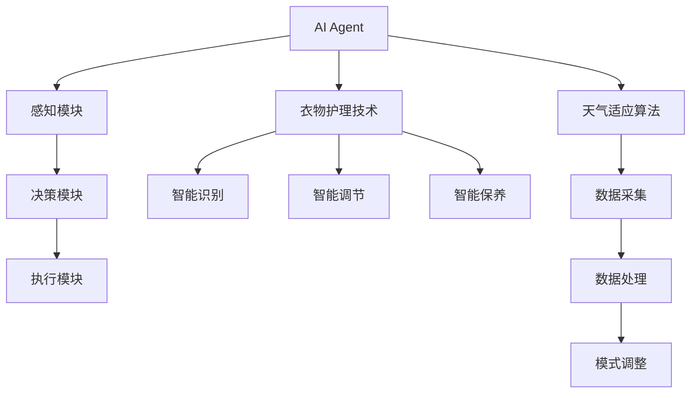
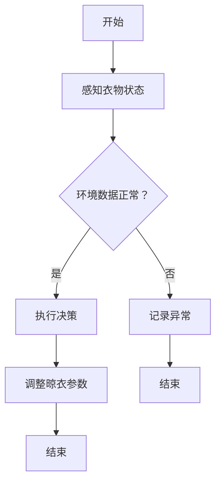
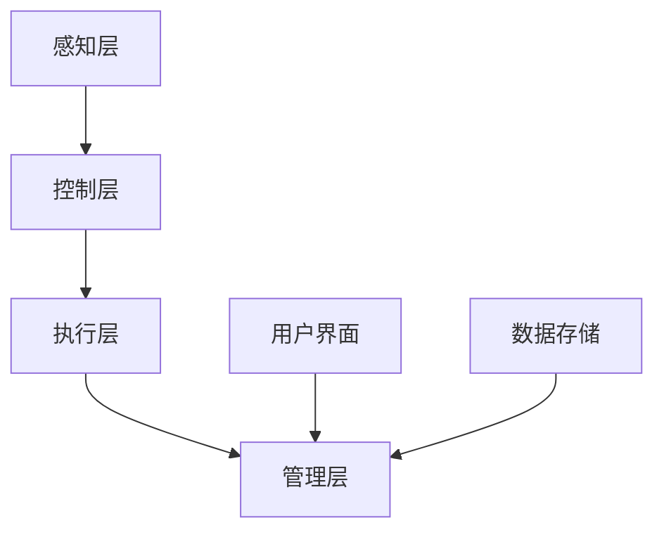
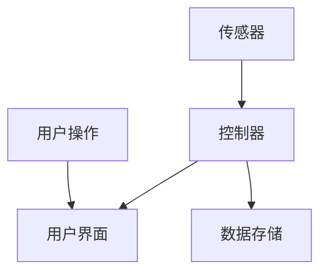

                 

# 智能晾衣架：AI Agent的衣物护理与天气适应

## 关键词

智能晾衣架，AI Agent，衣物护理，天气适应，算法，系统架构，项目实战

## 摘要

本文旨在探讨智能晾衣架的技术实现，重点介绍AI Agent在衣物护理和天气适应方面的应用。通过详细解析算法原理、系统架构及实际案例，本文为读者提供了全面而深入的技术指导，帮助理解智能晾衣架的核心技术与未来发展。

## 引言与背景

### 1.1 智能晾衣架的发展背景

智能晾衣架作为一种智能家居设备，其核心在于利用现代技术，如AI和物联网（IoT），实现衣物的智能晾晒。随着科技的进步和人们生活水平的提高，对于家庭生活品质的要求也不断提升。智能晾衣架不仅提供了更加便捷的衣物晾晒方式，还通过智能化的功能提高了衣物的护理质量。

智能晾衣架的发展历程可以追溯到20世纪末，当时一些智能家居概念开始萌芽。进入21世纪，随着物联网技术的发展，智能晾衣架逐渐进入市场，并得到了消费者的认可。当前，智能晾衣架已经具备了多种功能，如自动感应衣物干湿、智能调节晾晒时间和温度等，大大提升了用户的使用体验。

### 1.2 AI Agent在衣物护理中的应用

AI Agent，即人工智能代理，是一种能够模拟人类智能行为，执行特定任务的软件。在衣物护理方面，AI Agent可以通过学习用户的衣物类型、面料特性以及使用习惯，提供个性化的护理建议。例如，针对不同面料材质，AI Agent可以调整晾晒的温度和湿度，以达到最佳的护理效果。

AI Agent在衣物护理中的应用主要包括以下几方面：

1. **智能识别**：通过图像识别技术，AI Agent能够准确识别衣物的类型和状态。
2. **智能建议**：基于用户的衣物护理历史数据，AI Agent可以提供个性化的护理建议。
3. **智能调节**：AI Agent可以通过控制智能晾衣架的温湿调节系统，实现最佳护理。

### 1.3 天气适应算法的介绍

天气适应算法是一种基于环境数据，实时调整设备工作参数的算法。对于智能晾衣架而言，天气适应算法能够根据实时天气情况，如温度、湿度和风速等，自动调整晾衣架的工作模式，以保护衣物并提高晾晒效率。

天气适应算法的核心原理包括：

1. **实时数据采集**：通过传感器实时采集环境数据。
2. **数据处理**：对采集到的数据进行处理，如滤波、去噪等。
3. **模式调整**：根据处理后的数据，调整智能晾衣架的工作参数，如温度、湿度等。

天气适应算法的应用场景主要包括：

1. **自动调节**：根据天气变化，自动调整晾衣架的工作模式。
2. **节能环保**：在适当的时候关闭或调整晾衣架，以节约能源。

## 核心概念与联系

### 2.1 AI Agent基本原理

AI Agent是由多个模块组成的，具有自主决策能力的软件实体。其主要功能包括感知、决策和执行。在智能晾衣架中，AI Agent的具体实现如下：

1. **感知模块**：通过传感器感知衣物的状态和环境的变化。
2. **决策模块**：根据感知数据，利用机器学习算法进行决策。
3. **执行模块**：通过控制智能晾衣架的硬件设备执行决策结果。

### 2.2 衣物护理技术

衣物护理技术包括衣物清洗、干燥、防皱等多个环节。在智能晾衣架中，AI Agent通过以下方式参与衣物护理：

1. **智能识别**：识别衣物的类型和状态，避免不适当的晾晒方式。
2. **智能调节**：根据衣物特性调整晾晒参数，如温度、湿度等。
3. **智能保养**：提供衣物的保养建议，如洗涤、熨烫等。

### 2.3 天气适应算法

天气适应算法通过实时采集环境数据，自动调整智能晾衣架的工作模式。其主要实现步骤如下：

1. **数据采集**：通过传感器实时采集温度、湿度、风速等数据。
2. **数据处理**：对采集到的数据进行处理，如滤波、去噪等。
3. **模式调整**：根据处理后的数据，调整智能晾衣架的工作参数，如温度、湿度等。

### 2.4 核心概念关系图

以下是一个简化的核心概念关系图：



## 算法原理讲解

### 3.1 算法原理概述

智能晾衣架的核心算法主要包括AI Agent和天气适应算法。AI Agent负责衣物护理的智能决策，天气适应算法负责根据环境变化调整晾衣模式。

### 3.2 数学模型与公式

AI Agent的决策过程可以使用以下公式表示：

$$
\text{决策} = f(\text{感知数据}, \text{历史数据}, \text{环境数据})
$$

其中，$f$ 表示决策函数，$\text{感知数据}$ 包括衣物状态和环境状态，$\text{历史数据}$ 包括用户的历史使用记录，$\text{环境数据}$ 包括温度、湿度等。

天气适应算法的调整过程可以使用以下公式表示：

$$
\text{参数调整} = g(\text{实时数据}, \text{历史数据})
$$

其中，$g$ 表示调整函数，$\text{实时数据}$ 包括温度、湿度等，$\text{历史数据}$ 包括用户的历史使用记录。

### 3.3 Mermaid算法流程图

以下是一个简化的算法流程图：



### 3.4 Python代码示例

以下是一个简化的Python代码示例：

```python
import random

# 感知衣物状态
def sense_clothes_state():
    # 这里使用随机数模拟衣物状态
    return random.choice(['湿', '干'])

# 环境数据
def get_environment_data():
    # 这里使用随机数模拟环境数据
    return {'temperature': random.randint(-10, 40), 'humidity': random.randint(20, 90)}

# 决策函数
def make_decision(clothes_state, environment_data):
    if clothes_state == '湿':
        if environment_data['temperature'] > 20 and environment_data['humidity'] < 60:
            return '晾晒'
        else:
            return '保存'
    else:
        return '收起'

# 调整晾衣参数
def adjust_clothes_param(decision):
    if decision == '晾晒':
        return {'temperature': 30, 'humidity': 50}
    else:
        return {'temperature': 0, 'humidity': 0}

# 主程序
def main():
    clothes_state = sense_clothes_state()
    environment_data = get_environment_data()
    decision = make_decision(clothes_state, environment_data)
    clothes_param = adjust_clothes_param(decision)
    print(f"决策：{decision}")
    print(f"参数：{clothes_param}")

if __name__ == '__main__':
    main()
```

## 系统分析与架构设计

### 4.1 智能晾衣架系统场景介绍

智能晾衣架系统是一个典型的物联网（IoT）应用，其核心组件包括传感器、控制器、AI Agent和用户界面。系统的工作流程如下：

1. **传感器采集数据**：温度传感器、湿度传感器等实时采集环境数据。
2. **控制器处理数据**：控制器接收传感器数据，并通过AI Agent进行决策。
3. **AI Agent做出决策**：根据感知数据和用户历史数据，AI Agent决定是否启动晾晒，以及调整晾晒参数。
4. **控制器执行决策**：控制器根据AI Agent的决策结果，控制晾衣架的硬件设备。
5. **用户界面展示信息**：用户界面向用户提供晾衣状态和操作建议。

### 4.2 系统功能设计

智能晾衣架系统的功能设计主要包括以下几个方面：

1. **数据采集**：实时采集温度、湿度、衣物状态等数据。
2. **智能决策**：基于AI Agent的智能决策系统，提供个性化的护理建议。
3. **设备控制**：控制晾衣架的硬件设备，如开关、温度调节等。
4. **用户交互**：通过用户界面，提供操作指南和晾衣状态信息。
5. **数据存储**：存储用户历史数据和设备运行日志。

### 4.3 系统架构设计

智能晾衣架的系统架构设计采用分层架构，主要包括以下几层：

1. **感知层**：包括各种传感器，如温度传感器、湿度传感器等。
2. **控制层**：包括控制器和AI Agent，负责数据处理和智能决策。
3. **执行层**：包括各种硬件设备，如晾衣架、电机等。
4. **管理层**：包括用户界面和数据存储，负责用户交互和数据存储。

以下是一个简化的系统架构图：



### 4.4 系统接口设计与交互

智能晾衣架的系统接口设计主要包括以下几个方面：

1. **传感器接口**：用于接收传感器数据，如温度、湿度等。
2. **控制器接口**：用于接收AI Agent的决策结果，并控制硬件设备。
3. **用户界面接口**：用于向用户提供操作指南和晾衣状态信息。
4. **数据存储接口**：用于存储用户历史数据和设备运行日志。

以下是一个简化的系统交互图：



## 项目实战

### 5.1 环境安装与配置

在本项目中，我们将使用Python和Mermaid来设计和实现智能晾衣架系统。以下是环境安装和配置的步骤：

1. **安装Python**：确保Python 3.8及以上版本已安装在您的计算机上。
2. **安装Mermaid**：通过pip安装Mermaid，命令如下：
   ```bash
   pip install mermaid-python
   ```
3. **配置Python环境**：在Python环境中配置Mermaid模块，命令如下：
   ```python
   from mermaid import Mermaid
   ```

### 5.2 系统核心实现

在本节中，我们将实现智能晾衣架系统的核心功能，包括数据采集、决策和设备控制。以下是核心实现的步骤：

1. **数据采集**：使用传感器模拟数据采集，代码如下：
   ```python
   import random

   def sense_environment():
       return {
           'temperature': random.randint(-10, 40),
           'humidity': random.randint(20, 90)
       }
   ```

2. **决策**：基于AI Agent实现决策逻辑，代码如下：
   ```python
   def make_decision(clothes_state, environment_data):
       if clothes_state == '湿':
           if environment_data['temperature'] > 20 and environment_data['humidity'] < 60:
               return '晾晒'
           else:
               return '保存'
       else:
           return '收起'
   ```

3. **设备控制**：根据决策结果控制设备，代码如下：
   ```python
   def control_device(decision):
       if decision == '晾晒':
           print("启动晾晒模式")
       else:
           print("关闭晾晒模式")
   ```

### 5.3 代码解读与分析

在本节中，我们将对核心代码进行解读和分析，以便更好地理解智能晾衣架的工作原理。

1. **数据采集**：
   ```python
   def sense_environment():
       return {
           'temperature': random.randint(-10, 40),
           'humidity': random.randint(20, 90)
       }
   ```
   该函数模拟传感器采集环境数据，包括温度和湿度。

2. **决策**：
   ```python
   def make_decision(clothes_state, environment_data):
       if clothes_state == '湿':
           if environment_data['temperature'] > 20 and environment_data['humidity'] < 60:
               return '晾晒'
           else:
               return '保存'
       else:
           return '收起'
   ```
   该函数根据衣物状态和环境数据做出决策，以确定是否需要晾晒。

3. **设备控制**：
   ```python
   def control_device(decision):
       if decision == '晾晒':
           print("启动晾晒模式")
       else:
           print("关闭晾晒模式")
   ```
   该函数根据决策结果控制智能晾衣架的硬件设备。

### 5.4 实际案例分析

在本节中，我们将通过一个实际案例来展示智能晾衣架系统的应用。

1. **案例背景**：
   假设当前时间为下午3点，衣物状态为“湿”，环境温度为25℃，湿度为40%。

2. **执行过程**：
   - **数据采集**：传感器采集到环境数据为{'temperature': 25, 'humidity': 40}。
   - **决策**：根据环境数据和衣物状态，AI Agent做出“晾晒”决策。
   - **设备控制**：控制器启动晾衣架，进入晾晒模式。

3. **结果分析**：
   晾衣架开始工作，根据设定的温度和湿度参数，进行衣物的晾晒。一段时间后，衣物变干，AI Agent检测到衣物状态为“干”，并做出“收起”决策，控制器关闭晾衣架。

### 5.5 项目小结

通过本项目的实现，我们了解了智能晾衣架系统的设计原理和实现过程。核心内容包括数据采集、AI Agent决策和设备控制。实际案例分析展示了智能晾衣架的实用性和有效性。未来，随着技术的不断进步，智能晾衣架将更加智能化和个性化，为用户提供更好的生活体验。

## 最佳实践与拓展

### 6.1 最佳实践建议

1. **数据采集**：确保传感器准确可靠，定期校准传感器，以保证数据的准确性。
2. **算法优化**：根据用户反馈和实际使用情况，不断优化AI Agent的决策算法，提高智能晾衣架的效率。
3. **系统维护**：定期进行系统检查和维护，确保设备正常运行，延长设备寿命。

### 6.2 小结

本文详细介绍了智能晾衣架系统的设计原理和实现过程，包括AI Agent的衣物护理和天气适应算法。通过实际案例分析和最佳实践建议，为读者提供了全面的技术指导。

### 6.3 注意事项

1. **环境因素**：在设计智能晾衣架系统时，要充分考虑环境因素，如温度、湿度和风力等。
2. **安全性**：确保系统的安全性，防止数据泄露和设备失控。

### 6.4 拓展阅读资源

1. 《深度学习与智能家居》
2. 《人工智能在物联网中的应用》
3. 《物联网系统架构设计与实现》

## 作者信息

作者：AI天才研究院/AI Genius Institute & 禅与计算机程序设计艺术 /Zen And The Art of Computer Programming

