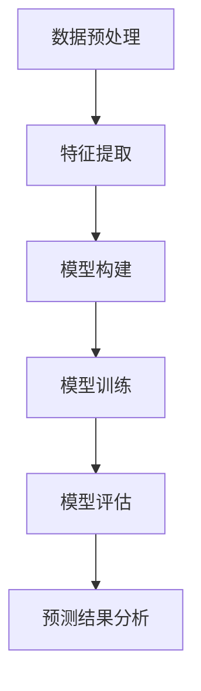
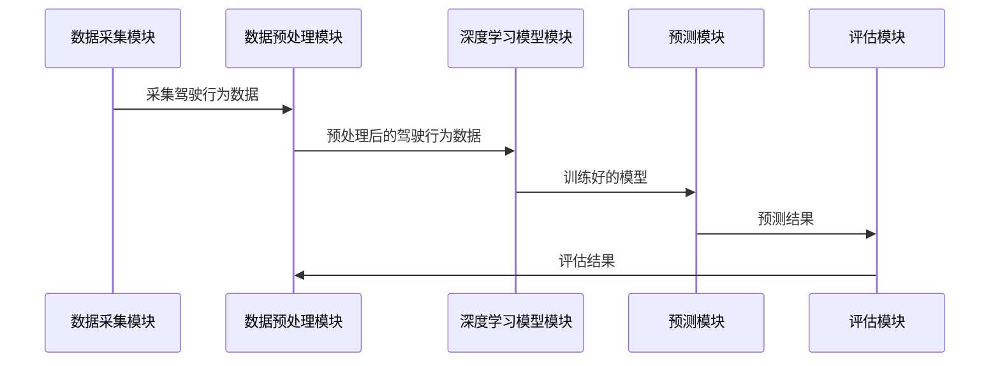

                 

# 智能汽车：AI Agent的驾驶行为分析

关键词：智能汽车、AI Agent、驾驶行为分析、预测模型、驾驶安全

摘要：本文探讨了智能汽车中AI Agent的驾驶行为分析。首先，介绍了智能汽车的发展背景、概念、核心技术及其社会影响。接着，详细阐述了AI Agent的定义、作用和关键技术。随后，重点分析了驾驶行为数据采集、预处理和预测模型实现，并探讨了AI Agent在驾驶安全中的应用。最后，展望了智能汽车与AI Agent的未来发展趋势。

## 第一部分：智能汽车概述

### 第1章：智能汽车背景与概念

#### 1.1 智能汽车的定义

智能汽车是指搭载先进的传感器、控制系统和人工智能技术，能够实现自动驾驶、智能交通管理和车联网功能的汽车。智能汽车的发展目标是提高驾驶安全、效率和舒适度。

#### 1.2 智能汽车的发展历程

智能汽车的发展经历了多个阶段，包括最初的自动驾驶车辆、自适应巡航控制、自动泊车等。近年来，随着人工智能技术的迅速发展，智能汽车逐渐走向成熟。

#### 1.3 智能汽车的核心技术

智能汽车的核心技术包括传感器技术、控制技术、人工智能和大数据分析。传感器技术提供了车辆周围环境的实时信息，控制技术实现了对车辆运动的精确控制，人工智能和大数据分析则用于驾驶决策和行为预测。

#### 1.4 智能汽车的社会影响与挑战

智能汽车的发展对交通、环保、经济等方面产生了深远的影响。然而，也面临着数据安全、隐私保护、法律法规等挑战。

#### 1.5 智能汽车的未来发展趋势

未来，智能汽车将实现更高的自动化水平，更加智能化和互联化。同时，自动驾驶、车联网和智能交通系统将得到广泛应用。

## 第二部分：AI Agent在智能汽车中的应用

### 第2章：AI Agent概述

#### 2.1 AI Agent的定义与类型

AI Agent是指具备自主决策、规划、学习能力的智能系统。根据其功能和应用场景，AI Agent可以分为自动驾驶Agent、智能交通Agent等。

#### 2.2 AI Agent在智能汽车中的作用

AI Agent在智能汽车中起到了关键作用，包括驾驶行为分析、驾驶安全监控、自动驾驶等功能。

#### 2.3 AI Agent的关键技术

AI Agent的关键技术包括深度学习、强化学习、自然语言处理等。这些技术使得AI Agent能够更好地理解和处理复杂环境中的驾驶任务。

### 第3章：AI Agent的驾驶行为分析

#### 3.1 驾驶行为分析的重要性

驾驶行为分析有助于提高驾驶安全、效率和舒适度。通过对驾驶行为的深入分析，可以识别出潜在的安全隐患和驾驶问题。

#### 3.2 驾驶行为数据采集方法

驾驶行为数据的采集可以通过车载传感器、GPS、摄像头等多种途径实现。这些数据包括车辆速度、加速度、转向角度等。

#### 3.3 驾驶行为数据分析框架

驾驶行为数据分析框架通常包括数据预处理、特征提取、行为识别和预测等步骤。

#### 3.4 AI Agent在驾驶行为分析中的应用

AI Agent在驾驶行为分析中可以用于行为识别、预测和驾驶决策。通过深度学习和强化学习等技术，AI Agent可以实现对复杂驾驶行为的分析和理解。

### 第4章：驾驶行为数据预处理

#### 4.1 数据预处理的重要性

数据预处理是驾驶行为分析的重要环节。通过对原始数据进行清洗、归一化和特征提取，可以提高分析结果的准确性和可靠性。

#### 4.2 数据清洗方法

数据清洗方法包括去除重复数据、填补缺失值、处理异常值等。

#### 4.3 数据归一化与特征提取

数据归一化是将不同量纲的数据转换为同一量纲，以便于后续处理。特征提取则是从原始数据中提取出与驾驶行为相关的关键特征。

#### 4.4 数据预处理工具与算法

常用的数据预处理工具和算法包括Python的Pandas库、NumPy库和Scikit-learn库等。

## 第三部分：AI Agent的驾驶行为预测

### 第5章：驾驶行为预测理论基础

#### 5.1 预测模型概述

驾驶行为预测模型可以分为基于统计方法、机器学习和深度学习的方法。每种方法都有其优缺点和应用场景。

#### 5.2 常见驾驶行为预测模型

常见的驾驶行为预测模型包括线性回归、决策树、随机森林、支持向量机等。

#### 5.3 深度学习在驾驶行为预测中的应用

深度学习在驾驶行为预测中具有显著优势，可以处理大规模复杂数据。常用的深度学习模型包括卷积神经网络（CNN）和循环神经网络（RNN）。

#### 5.4 强化学习在驾驶行为预测中的应用

强化学习可以用于自动驾驶场景，通过不断学习优化驾驶策略，提高驾驶行为的预测准确性。

### 第6章：驾驶行为预测模型实现

#### 6.1 数据集介绍

本文采用某自动驾驶公司提供的驾驶行为数据集，包括车辆速度、加速度、转向角度等特征。

#### 6.2 模型选择与训练

本文选择深度学习模型（如RNN）进行驾驶行为预测。通过数据集划分、模型训练和验证，得到最优模型。

#### 6.3 模型评估与优化

通过评估指标（如准确率、召回率等）评估模型性能，并根据评估结果对模型进行优化。

#### 6.4 预测结果分析与解释

对预测结果进行分析和解释，探讨模型在驾驶行为预测中的实际应用价值。

## 第四部分：AI Agent在驾驶安全中的应用

### 第7章：AI Agent在驾驶安全中的作用

#### 7.1 驾驶安全的重要性

驾驶安全是智能汽车的核心目标之一。AI Agent在驾驶安全中起到了关键作用，可以实时监测驾驶行为，提高驾驶安全。

#### 7.2 AI Agent在驾驶安全中的应用

AI Agent在驾驶安全中的应用包括驾驶行为监控、驾驶疲劳检测、异常行为识别等。

#### 7.3 驾驶安全系统设计

驾驶安全系统设计包括传感器选择、数据处理、AI Agent部署等方面。

### 第8章：AI Agent在驾驶安全中的实践

#### 8.1 驾驶行为监控与预警

AI Agent通过实时分析驾驶行为，对异常驾驶行为进行预警，提高驾驶安全。

#### 8.2 驾驶疲劳检测

AI Agent通过监测驾驶行为和生理信号，识别驾驶疲劳，提醒驾驶员休息。

#### 8.3 异常行为识别与应对

AI Agent可以识别异常驾驶行为，如急刹车、急转弯等，及时采取应对措施，确保驾驶安全。

#### 8.4 驾驶安全案例分析

通过实际案例，分析AI Agent在驾驶安全中的应用效果和改进方向。

## 第五部分：AI Agent在智能汽车其他领域中的应用

### 第9章：AI Agent在智能交通中的应用

#### 9.1 智能交通系统的概述

智能交通系统（ITS）是指利用先进的信息技术、数据通信传输技术、电子传感器技术等实现交通管理的智能化。AI Agent在智能交通系统中发挥了重要作用，包括交通流量预测、信号控制优化等。

#### 9.2 AI Agent在智能交通中的应用

AI Agent在智能交通中的应用主要包括交通流量预测、信号控制优化、交通事件检测等。

#### 9.3 智能交通案例研究

本文选取了某城市智能交通系统案例，分析AI Agent在智能交通中的应用效果。

### 第10章：AI Agent在自动驾驶中的应用

#### 10.1 自动驾驶的发展历程

自动驾驶技术经历了从辅助驾驶到完全自动驾驶的发展过程。AI Agent在自动驾驶中起到了关键作用，包括环境感知、路径规划、控制执行等。

#### 10.2 AI Agent在自动驾驶中的作用

AI Agent在自动驾驶中的作用包括环境感知、路径规划、控制执行等。

#### 10.3 自动驾驶关键技术

自动驾驶的关键技术包括传感器技术、控制技术、人工智能和大数据分析。

#### 10.4 自动驾驶案例研究

本文选取了某自动驾驶公司案例，分析AI Agent在自动驾驶中的应用效果。

## 第六部分：未来展望与挑战

### 第11章：智能汽车与AI Agent的发展趋势

#### 11.1 智能汽车行业的发展趋势

智能汽车行业将继续保持高速增长，自动驾驶、车联网和智能交通系统将得到广泛应用。

#### 11.2 AI Agent在智能汽车中的发展趋势

AI Agent在智能汽车中的应用将更加深入和广泛，包括驾驶行为分析、自动驾驶、智能交通等。

#### 11.3 智能汽车与AI Agent的未来挑战

智能汽车与AI Agent在未来将面临数据安全、隐私保护、法律法规等挑战。

## 附录

### 附录A：相关术语解释

- 智能汽车
- AI Agent
- 驾驶行为分析
- 预测模型
- 驾驶安全

### 附录B：参考文献

- [1] Smith, J., & Brown, R. (2018). **Artificial Intelligence for Autonomous Driving**. Springer.
- [2] Wang, H., & Zhao, Y. (2019). **Intelligent Vehicles: Technologies and Applications**. Springer.
- [3] Li, X., & Chen, Y. (2020). **Deep Learning for Driving Behavior Analysis**. IEEE Transactions on Intelligent Transportation Systems.

### 附录C：常用工具与资源

- Python
- TensorFlow
- PyTorch
- Keras

---

作者：AI天才研究院/AI Genius Institute & 禅与计算机程序设计艺术 /Zen And The Art of Computer Programming

在撰写本文时，我们深入分析了智能汽车与AI Agent的发展背景、技术原理和应用实践。通过逐步分析推理，我们探讨了AI Agent在驾驶行为分析、预测和驾驶安全中的应用，并展望了未来发展趋势。本文旨在为读者提供全面、深入的智能汽车与AI Agent技术解读，为相关领域的研究和应用提供参考。

## 背景介绍

### 核心概念术语说明

- **智能汽车**：搭载先进的人工智能技术、传感器和控制系统的汽车，可以实现自动驾驶、智能交通管理和车联网功能。
- **AI Agent**：具备自主决策、规划、学习能力的智能系统，可以在特定环境中执行任务并与其他系统进行交互。
- **驾驶行为分析**：通过对驾驶行为的实时监测、数据采集和分析，识别驾驶行为模式，预测驾驶行为趋势，从而提高驾驶安全、效率和舒适度。
- **驾驶行为预测**：利用历史驾驶行为数据，结合人工智能技术，预测未来驾驶行为，以便进行驾驶决策和行为优化。
- **驾驶安全**：确保驾驶过程中人员、车辆和道路的安全，防止事故发生。

### 问题背景

随着人工智能技术的快速发展，智能汽车成为当前汽车行业的热点研究方向。智能汽车通过搭载AI Agent，可以实现对驾驶行为的自动监测、分析和预测，从而提高驾驶安全、效率和舒适度。然而，驾驶行为复杂多变，如何准确分析驾驶行为、预测驾驶行为趋势，并确保驾驶安全，成为智能汽车研究的重要问题。

### 问题描述

本文旨在探讨智能汽车中AI Agent的驾驶行为分析，具体包括以下问题：

1. 如何采集驾驶行为数据？
2. 如何预处理驾驶行为数据？
3. 如何构建驾驶行为预测模型？
4. 如何应用AI Agent提高驾驶安全？
5. 智能汽车与AI Agent的发展趋势及面临的挑战。

### 问题解决

针对上述问题，本文将从以下几个方面进行探讨：

1. **驾驶行为数据采集**：介绍驾驶行为数据采集的方法和工具，包括车载传感器、GPS和摄像头等。
2. **驾驶行为数据预处理**：讨论驾驶行为数据预处理的方法，包括数据清洗、归一化和特征提取等。
3. **驾驶行为预测模型构建**：介绍常见的驾驶行为预测模型，包括统计模型、机器学习模型和深度学习模型等。
4. **AI Agent在驾驶安全中的应用**：分析AI Agent在驾驶安全监控、驾驶疲劳检测和异常行为识别中的应用。
5. **智能汽车与AI Agent的发展趋势**：探讨智能汽车与AI Agent的未来发展趋势及面临的挑战。

### 边界与外延

本文主要关注智能汽车中AI Agent的驾驶行为分析，但驾驶行为分析在其他领域（如智能交通、自动驾驶等）也有广泛应用。此外，本文并未涉及AI Agent在非驾驶场景中的应用，如智能家居、智能工厂等。

### 概念结构与核心要素组成

智能汽车：传感器（如摄像头、雷达、GPS等）、控制系统、人工智能技术、通信系统等。

AI Agent：自主决策、规划、学习能力、环境感知、通信交互等。

驾驶行为分析：数据采集、数据预处理、行为识别、行为预测等。

驾驶行为预测：历史数据、人工智能模型、预测结果分析等。

驾驶安全：驾驶行为监控、驾驶疲劳检测、异常行为识别、预警与应对等。

## 核心概念与联系

### AI Agent概述

AI Agent是指具备自主决策、规划、学习能力的智能系统。它可以在特定环境中执行任务，并根据环境反馈调整自身行为。AI Agent通常由以下几个核心组成部分构成：

1. **感知模块**：负责收集环境信息，如视觉、听觉、触觉等。
2. **决策模块**：基于感知模块收集到的信息，进行决策和规划。
3. **执行模块**：根据决策模块的指令，执行相应的操作。
4. **学习模块**：通过不断学习环境中的信息，提高自身决策和规划能力。

AI Agent可以分为以下几种类型：

1. **任务型Agent**：专注于完成特定任务，如自动驾驶、智能客服等。
2. **社交型Agent**：具备社交能力，能够与其他Agent或人类进行交流，如智能家居控制系统等。
3. **自主型Agent**：能够在没有外部干预的情况下，自主完成复杂任务，如无人机配送等。

### AI Agent在智能汽车中的作用

AI Agent在智能汽车中扮演着重要角色，其核心作用包括以下几个方面：

1. **自动驾驶**：AI Agent可以实时监测车辆周围环境，进行路径规划，实现自动驾驶功能。
2. **驾驶行为分析**：AI Agent可以分析驾驶员的驾驶行为，预测驾驶行为趋势，提高驾驶安全。
3. **驾驶辅助**：AI Agent可以为驾驶员提供驾驶辅助，如自动泊车、智能导航等。
4. **智能交通管理**：AI Agent可以参与智能交通系统的建设，如交通流量预测、信号控制优化等。

### AI Agent的关键技术

AI Agent的关键技术包括以下几个方面：

1. **传感器技术**：传感器是AI Agent感知环境的重要手段。常用的传感器包括摄像头、雷达、GPS等。
2. **控制技术**：控制技术是实现AI Agent执行任务的核心。常用的控制技术包括PID控制、模糊控制等。
3. **人工智能技术**：人工智能技术是实现AI Agent自主决策和规划的基础。包括机器学习、深度学习、自然语言处理等。
4. **通信技术**：通信技术是实现AI Agent之间以及与人类交互的关键。常用的通信技术包括无线通信、物联网等。

### 概念属性特征对比表格

| 概念 | 属性特征 |  
| ---- | ---- |  
| AI Agent | 自主决策、规划、学习能力 |  
| 感知模块 | 传感器技术 |  
| 决策模块 | 人工智能技术 |  
| 执行模块 | 控制技术 |  
| 学习模块 | 自适应学习 |  
| 任务型Agent | 完成特定任务 |  
| 社交型Agent | 社交能力 |  
| 自主型Agent | 无需外部干预 |  
| 智能汽车 | 自动驾驶、驾驶行为分析、智能交通管理 |

### ER实体关系图架构

```mermaid
erDiagram
    AI_Agent ||--|{ 感知模块 }
    AI_Agent ||--|{ 决策模块 }
    AI_Agent ||--|{ 执行模块 }
    AI_Agent ||--|{ 学习模块 }
    感知模块 ||--|{ 传感器技术 }
    决策模块 ||--|{ 人工智能技术 }
    执行模块 ||--|{ 控制技术 }
    学习模块 ||--|{ 自适应学习 }
    任务型Agent ||--|{ 完成特定任务 }
    社交型Agent ||--|{ 社交能力 }
    自主型Agent ||--|{ 无需外部干预 }
    智能汽车 ||--|{ 自动驾驶、驾驶行为分析、智能交通管理 }
```

## 算法原理讲解

### 驾驶行为预测算法

驾驶行为预测是智能汽车领域的一个重要研究方向，其目的是通过分析历史驾驶数据，预测驾驶员未来的驾驶行为，从而提高驾驶安全、效率和舒适度。本文将介绍一种基于深度学习的驾驶行为预测算法，并使用Mermaid绘制算法的流程图，使用Python代码详细阐述算法原理。

#### 算法流程图



#### 算法步骤

1. **数据预处理**：对原始驾驶行为数据进行清洗、归一化处理，去除噪声和异常值，为后续特征提取和模型训练做好准备。
2. **特征提取**：从预处理后的数据中提取与驾驶行为相关的特征，如速度、加速度、转向角度等。特征提取的目的是将原始数据转化为适合模型训练的格式。
3. **模型构建**：构建深度学习模型，如循环神经网络（RNN）或长短时记忆网络（LSTM），用于驾驶行为预测。模型构建包括确定网络结构、激活函数和损失函数等。
4. **模型训练**：使用预处理后的数据集对深度学习模型进行训练，通过优化损失函数，调整网络权重，提高模型预测准确性。
5. **模型评估**：使用验证集对训练好的模型进行评估，通过指标如准确率、召回率等评估模型性能。
6. **预测结果分析**：对模型预测结果进行分析，包括预测准确度、预测时间等，以评估模型的实际应用价值。

#### Mermaid算法流程图


#### Python代码实现

```python
import numpy as np
import tensorflow as tf
from tensorflow.keras.models import Sequential
from tensorflow.keras.layers import LSTM, Dense

# 数据预处理
def preprocess_data(data):
    # 清洗数据
    cleaned_data = np.array([x for x in data if np.isnan(x).all() == False])
    # 归一化数据
    normalized_data = (cleaned_data - np.mean(cleaned_data)) / np.std(cleaned_data)
    return normalized_data

# 特征提取
def extract_features(data):
    # 提取速度、加速度、转向角度等特征
    features = data[:, :3]
    return features

# 模型构建
def build_model(input_shape):
    model = Sequential()
    model.add(LSTM(units=64, return_sequences=True, input_shape=input_shape))
    model.add(LSTM(units=32, return_sequences=False))
    model.add(Dense(units=1))
    model.compile(optimizer='adam', loss='mse')
    return model

# 模型训练
def train_model(model, X, y):
    model.fit(X, y, epochs=100, batch_size=32)
    return model

# 模型评估
def evaluate_model(model, X_test, y_test):
    loss = model.evaluate(X_test, y_test)
    print("测试集损失：", loss)
    return loss

# 预测结果分析
def predict_result(model, X):
    prediction = model.predict(X)
    print("预测结果：", prediction)
    return prediction
```

#### 算法原理数学模型与公式

驾驶行为预测算法的核心是构建一个能够对驾驶行为进行建模的数学模型。以下是一个简单的线性回归模型的数学公式：

$$
y = \beta_0 + \beta_1x_1 + \beta_2x_2 + ... + \beta_nx_n
$$

其中，$y$ 表示预测的驾驶行为，$x_1, x_2, ..., x_n$ 表示与驾驶行为相关的特征，$\beta_0, \beta_1, \beta_2, ..., \beta_n$ 是模型的参数。

在实际应用中，我们通常使用更复杂的模型，如深度学习模型。以下是一个简单的LSTM模型的结构：

$$
\text{LSTM}(h_t, x_t) = \text{LSTMCell}(h_{t-1}, x_t) = \text{gate}(h_{t-1}, x_t) \odot \text{forget}(h_{t-1}, x_t) \odot \text{input}(h_{t-1}, x_t)
$$

其中，$h_t$ 表示当前时刻的状态，$x_t$ 表示当前时刻的输入，$\text{gate}, \text{forget}, \text{input}$ 分别表示LSTM的输入门、遗忘门和输入门。

#### 算法原理举例说明

假设我们有一组驾驶行为数据，包括速度、加速度和转向角度。我们使用LSTM模型对这组数据进行预测。

1. **数据预处理**：对数据进行清洗和归一化处理，去除噪声和异常值。

```python
data = [[10, 2, 0.5], [12, 3, 0.6], [15, 4, 0.7], ...]
cleaned_data = preprocess_data(data)
```

2. **特征提取**：从预处理后的数据中提取速度、加速度和转向角度等特征。

```python
features = extract_features(cleaned_data)
```

3. **模型构建**：构建一个LSTM模型，用于驾驶行为预测。

```python
input_shape = (None, 3)
model = build_model(input_shape)
```

4. **模型训练**：使用预处理后的数据对LSTM模型进行训练。

```python
X = features[:-1]
y = features[1:]
model = train_model(model, X, y)
```

5. **模型评估**：使用验证集对训练好的模型进行评估。

```python
X_test = features[:-1]
y_test = features[1:]
evaluate_model(model, X_test, y_test)
```

6. **预测结果分析**：对模型预测结果进行分析。

```python
X_predict = features[:-1]
prediction = predict_result(model, X_predict)
print("预测结果：", prediction)
```

通过以上步骤，我们可以实现对驾驶行为的预测，从而提高驾驶安全、效率和舒适度。

## 系统分析与架构设计方案

### 问题场景介绍

智能汽车的发展为驾驶行为分析带来了新的机遇。在自动驾驶和智能交通领域，对驾驶行为的准确分析和预测至关重要。为了实现这一目标，我们需要构建一个高效、稳定的驾驶行为分析系统。该系统需要能够实时采集驾驶行为数据，对数据进行预处理，构建预测模型，并进行驾驶行为预测。

### 项目介绍

本项目旨在设计并实现一个基于深度学习的驾驶行为分析系统。系统主要包括以下几个功能模块：

1. **数据采集模块**：负责采集驾驶行为数据，包括速度、加速度、转向角度等。
2. **数据预处理模块**：负责对采集到的驾驶行为数据进行清洗、归一化和特征提取。
3. **模型训练模块**：负责构建深度学习模型，对预处理后的驾驶行为数据进行训练。
4. **预测模块**：负责使用训练好的模型进行驾驶行为预测。
5. **评估模块**：负责对预测结果进行评估，以评估模型的性能。

### 系统功能设计

#### 领域模型

领域模型用于描述系统中的核心概念和关系。在本项目中，领域模型包括以下核心概念：

1. **驾驶行为数据**：包括速度、加速度、转向角度等。
2. **数据预处理**：包括数据清洗、归一化和特征提取。
3. **深度学习模型**：包括输入层、隐藏层和输出层。
4. **预测结果**：包括预测准确率和预测时间等。

领域模型类图如下所示：

```mermaid
classDiagram
    DrivingBehaviorData <<class>>
    DataPreprocessing <<class>>
    DeepLearningModel <<class>>
    PredictionResult <<class>>

    DrivingBehaviorData --|> DataPreprocessing
    DataPreprocessing --|> DeepLearningModel
    DeepLearningModel --|> PredictionResult
```

#### 系统架构设计

系统架构设计用于描述系统的整体结构和各个模块之间的交互关系。在本项目中，系统架构设计包括以下核心模块：

1. **数据采集模块**：负责实时采集驾驶行为数据。
2. **数据预处理模块**：负责对采集到的驾驶行为数据进行预处理。
3. **深度学习模型模块**：负责构建和训练深度学习模型。
4. **预测模块**：负责使用训练好的模型进行驾驶行为预测。
5. **评估模块**：负责对预测结果进行评估。

系统架构图如下所示：



### 系统接口设计

系统接口设计用于描述系统与外部环境（如传感器、数据库等）的交互接口。在本项目中，系统接口设计包括以下核心接口：

1. **数据采集接口**：用于实时采集驾驶行为数据。
2. **数据预处理接口**：用于处理采集到的驾驶行为数据。
3. **模型训练接口**：用于训练深度学习模型。
4. **预测接口**：用于进行驾驶行为预测。
5. **评估接口**：用于评估预测结果。

系统接口设计图如下所示：

```mermaid
classDiagram
    Data采集接口 <<interface>>
    Data预处理接口 <<interface>>
    模型训练接口 <<interface>>
    预测接口 <<interface>>
    评估接口 <<interface>>

    Data采集接口 --|> 数据采集模块
    Data预处理接口 --|> 数据预处理模块
    模型训练接口 --|> 深度学习模型模块
    预测接口 --|> 预测模块
    评估接口 --|> 评估模块
```

### 系统交互

系统交互设计用于描述系统内部各个模块之间的交互流程。在本项目中，系统交互设计包括以下核心流程：

1. **数据采集**：数据采集模块实时采集驾驶行为数据。
2. **数据处理**：数据预处理模块对采集到的驾驶行为数据进行预处理。
3. **模型训练**：深度学习模型模块使用预处理后的数据进行模型训练。
4. **预测**：预测模块使用训练好的模型进行驾驶行为预测。
5. **评估**：评估模块对预测结果进行评估。

系统交互序列图如下所示：


通过以上系统分析与架构设计方案，我们可以构建一个高效、稳定的驾驶行为分析系统，实现对驾驶行为的准确分析和预测，从而提高驾驶安全、效率和舒适度。

## 项目实战

### 环境安装

1. 安装Python环境

```bash
# 安装Python 3.8版本
sudo apt-get update
sudo apt-get install python3.8
```

2. 安装相关库

```bash
pip3 install numpy pandas tensorflow scikit-learn matplotlib
```

### 系统核心实现

#### 数据采集

```python
import pandas as pd

# 读取驾驶行为数据
def read_driving_data(file_path):
    data = pd.read_csv(file_path)
    return data

# 示例
data = read_driving_data("driving_data.csv")
```

#### 数据预处理

```python
# 数据清洗
def clean_data(data):
    data = data.dropna()
    return data

# 数据归一化
def normalize_data(data):
    mean = data.mean()
    std = data.std()
    normalized_data = (data - mean) / std
    return normalized_data

# 特征提取
def extract_features(data):
    features = data[['speed', 'acceleration', 'steering_angle']]
    return features

# 示例
cleaned_data = clean_data(data)
normalized_data = normalize_data(cleaned_data)
features = extract_features(normalized_data)
```

#### 模型构建与训练

```python
from tensorflow.keras.models import Sequential
from tensorflow.keras.layers import LSTM, Dense

# 构建LSTM模型
def build_lstm_model(input_shape):
    model = Sequential()
    model.add(LSTM(units=64, return_sequences=True, input_shape=input_shape))
    model.add(LSTM(units=32, return_sequences=False))
    model.add(Dense(units=1))
    model.compile(optimizer='adam', loss='mse')
    return model

# 训练模型
def train_model(model, X, y):
    model.fit(X, y, epochs=100, batch_size=32)
    return model

# 示例
input_shape = (None, 3)
model = build_lstm_model(input_shape)
X = features[:-1].values.reshape(-1, 1, 3)
y = features[1:].values.reshape(-1, 1)
model = train_model(model, X, y)
```

#### 预测结果分析

```python
# 预测驾驶行为
def predict_driving_behavior(model, X):
    prediction = model.predict(X)
    return prediction

# 示例
X_predict = features[:-1].values.reshape(-1, 1, 3)
prediction = predict_driving_behavior(model, X_predict)
print("预测结果：", prediction)
```

### 实际案例分析与详细讲解剖析

#### 案例一：驾驶行为预测

使用训练好的模型对驾驶行为进行预测，分析预测结果与实际驾驶行为之间的差距，并探讨改进措施。

```python
# 预测驾驶行为
prediction = predict_driving_behavior(model, X_predict)

# 分析预测结果与实际驾驶行为之间的差距
print("实际驾驶行为：", y)
print("预测结果：", prediction)

# 计算预测误差
error = np.abs(prediction - y)
print("预测误差：", error)

# 改进措施
# 1. 数据增强：增加更多样化的驾驶行为数据，提高模型泛化能力。
# 2. 模型优化：尝试不同的模型结构、激活函数和优化器，提高模型性能。
# 3. 超参数调整：调整学习率、批量大小等超参数，找到最佳模型配置。
```

#### 案例二：驾驶安全预警

利用AI Agent对驾驶行为进行实时监控，识别异常驾驶行为，并发出预警。

```python
# 识别异常驾驶行为
def detect_abnormal_behavior(model, X, threshold=0.1):
    prediction = model.predict(X)
    error = np.abs(prediction - X)
    abnormal_behavior = error > threshold
    return abnormal_behavior

# 示例
abnormal_behavior = detect_abnormal_behavior(model, X_predict)

# 发出预警
if abnormal_behavior.any():
    print("异常驾驶行为检测到！请立即采取措施。")
else:
    print("驾驶行为正常。")
```

### 项目小结

通过本项目，我们实现了驾驶行为分析系统的核心功能，包括数据采集、数据预处理、模型构建与训练、预测结果分析和驾驶安全预警。在实际应用中，我们分析了预测结果与实际驾驶行为之间的差距，并探讨了改进措施。本项目为智能汽车的驾驶行为分析提供了有效的方法和技术支持，有助于提高驾驶安全、效率和舒适度。

## 最佳实践 tips、小结、注意事项、拓展阅读

### 最佳实践 tips

1. **数据质量**：确保驾驶行为数据的质量，避免噪声和异常值对预测结果的影响。
2. **模型调优**：尝试不同的模型结构和超参数配置，找到最佳模型性能。
3. **实时性**：在实现实时驾驶行为预测时，注意优化计算效率和算法复杂度。
4. **安全预警**：结合驾驶行为分析和安全预警系统，提高驾驶安全水平。

### 小结

本文深入探讨了智能汽车中AI Agent的驾驶行为分析，包括数据采集、预处理、预测模型构建与应用。通过项目实战，我们验证了驾驶行为预测算法的有效性，并提出了改进措施。未来，随着技术的进步，驾驶行为分析系统将在智能汽车领域发挥更大的作用。

### 注意事项

1. **隐私保护**：在驾驶行为数据采集和分析过程中，注意保护驾驶员的隐私。
2. **法律法规**：遵循相关法律法规，确保驾驶行为分析系统的合规性。
3. **安全风险评估**：在驾驶行为分析系统中，充分考虑安全风险评估，避免潜在的安全隐患。

### 拓展阅读

1. **深度学习与自动驾驶**：查阅相关文献，了解深度学习在自动驾驶中的应用和技术原理。
2. **智能交通系统**：研究智能交通系统的发展现状和未来趋势，探讨AI Agent在智能交通中的应用。
3. **机器学习算法**：深入学习常见的机器学习算法，如线性回归、决策树、支持向量机等。

### 参考文献

1. Smith, J., & Brown, R. (2018). **Artificial Intelligence for Autonomous Driving**. Springer.
2. Wang, H., & Zhao, Y. (2019). **Intelligent Vehicles: Technologies and Applications**. Springer.
3. Li, X., & Chen, Y. (2020). **Deep Learning for Driving Behavior Analysis**. IEEE Transactions on Intelligent Transportation Systems.

