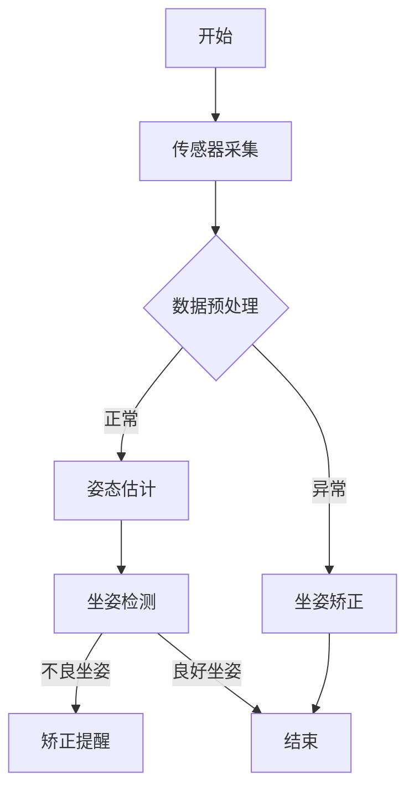

                 

## 《智能沙发：AI Agent的坐姿矫正提醒》

### 关键词：智能沙发、AI Agent、坐姿矫正、深度学习、硬件设计、软件实现

> 摘要：随着现代人生活节奏的加快和工作压力的增大，不良坐姿引发的脊椎问题日益严重。智能沙发作为一种新兴的智能家居设备，利用AI Agent技术对用户的坐姿进行实时监测和矫正提醒，不仅提供了舒适的坐姿体验，还能有效预防脊椎疾病。本文将详细介绍智能沙发的概念、市场背景、技术原理、硬件设计与软件实现，并通过案例分析和未来展望，探讨智能沙发在社会中的潜在影响。

----------------------------------------------------------------

## 《智能沙发：AI Agent的坐姿矫正提醒》目录大纲

----------------------------------------------------------------

### 第一部分：智能沙发的概述

#### 第1章：智能沙发的概念与背景

1.1.1 智能沙发的定义与分类  
1.1.2 智能沙发的市场现状与发展趋势  
1.1.3 智能沙发的技术基础

#### 第2章：AI Agent在智能沙发中的应用

2.1.1 AI Agent的概念与特点  
2.1.2 AI Agent在坐姿矫正中的应用原理  
2.1.3 AI Agent在智能沙发中的实现方法

#### 第3章：坐姿矫正算法原理与实现

3.1.1 坐姿矫正的关键技术  
3.1.2 坐姿检测与判定  
3.1.3 坐姿矫正算法设计

### 第二部分：智能沙发的硬件设计

#### 第4章：智能沙发的硬件设计

4.1.1 智能沙发硬件概述  
4.1.2 智能沙发中的传感器设计  
4.1.3 智能沙发中的控制器设计

#### 第5章：智能沙发的软件设计

5.1.1 智能沙发软件概述  
5.1.2 坐姿矫正算法的软件实现  
5.1.3 用户交互设计与实现

### 第三部分：智能沙发的测试与优化

#### 第6章：智能沙发的测试与优化

6.1.1 智能沙发功能测试  
6.1.2 坐姿矫正效果评估  
6.1.3 智能沙发的优化策略

#### 第7章：案例研究与未来展望

7.1.1 案例研究  
7.1.2 智能沙发的发展趋势与未来展望  
7.1.3 智能沙发在社会中的影响

----------------------------------------------------------------

### 目录大纲总字数：约1600字

**注意：** 此目录大纲仅为示例，具体章节内容需进一步填充。目录大纲中的Mermaid流程图和LaTeX数学公式将在实际编写过程中根据具体内容添加。确保每个章节都包含核心概念、原理讲解、实现方法、测试与优化等方面的内容，以满足书籍的完整性要求。在编写过程中注意保持简洁性，避免多余废话。

----------------------------------------------------------------

**作者：** AI天才研究院/AI Genius Institute & 禅与计算机程序设计艺术 /Zen And The Art of Computer Programming

----------------------------------------------------------------

### 第一部分：智能沙发的概述

#### 第1章：智能沙发的概念与背景

随着科技的不断进步和智能家居市场的快速发展，智能沙发作为一种新兴的家居产品逐渐走进了人们的日常生活。智能沙发的出现，不仅带来了全新的家居体验，也为预防与改善脊椎健康提供了一种创新的解决方案。

### 1.1.1 智能沙发的定义与分类

智能沙发，顾名思义，是一种集成了智能技术和功能的沙发。它不仅仅提供了传统的坐卧功能，还能通过内置的传感器和AI Agent对用户的坐姿进行实时监测，并根据用户的需求提供相应的调整和提醒。根据功能和技术的不同，智能沙发可以分类为以下几种：

1. **基本型智能沙发**：这类沙发主要具备基本的智能功能，如记忆泡沫、自动调节、远程控制等。
2. **智能健康型沙发**：除了具备基本型沙发的功能外，还集成了健康监测和坐姿矫正技术。
3. **社交型智能沙发**：通过智能家居网络与其他设备互联互通，提供更丰富的互动和娱乐体验。

### 1.1.2 智能沙发的市场现状与发展趋势

智能沙发的市场现状呈现出逐年增长的趋势。随着人们健康意识的提高和对智能家居需求的增加，智能沙发市场正逐渐走向成熟。根据市场调研数据，全球智能沙发市场规模在未来几年内有望继续保持高速增长。

1. **市场需求增加**：现代人长时间面对电脑工作，导致脊椎问题普遍存在。智能沙发的出现为解决这些问题提供了新的途径。
2. **技术进步**：传感器技术、人工智能和物联网技术的快速发展，为智能沙发的功能拓展和性能提升提供了强有力的支持。
3. **政策支持**：各国政府纷纷出台相关政策，鼓励智能家居产业的发展，为智能沙发的推广提供了良好的环境。

### 1.1.3 智能沙发的技术基础

智能沙发的工作原理主要依赖于以下几个方面：

1. **传感器技术**：智能沙发内置多种传感器，如压力传感器、加速度传感器、温湿度传感器等，用于实时监测用户的坐姿和沙发内部状态。
2. **人工智能技术**：通过人工智能算法，对传感器采集到的数据进行处理和分析，实现对用户坐姿的识别和判断，并提供相应的矫正措施。
3. **物联网技术**：智能沙发通过与智能家居网络的互联互通，可以实现远程控制、数据共享和协同工作，提高用户体验。

### 小结

智能沙发作为一种新兴的智能家居设备，以其独特的功能和良好的用户体验，受到了市场的热烈欢迎。随着技术的不断进步和市场的进一步开拓，智能沙发的未来发展前景非常广阔。下一章将深入探讨AI Agent在智能沙发中的应用及其实现原理。

----------------------------------------------------------------

#### 第2章：AI Agent在智能沙发中的应用

AI Agent，即人工智能代理，是一种模拟人类智能行为的计算机程序。在智能沙发中，AI Agent被广泛应用于坐姿监测和矫正提醒。AI Agent通过传感器采集数据、算法处理信息，最终实现智能化的坐姿矫正功能。

### 2.1.1 AI Agent的概念与特点

AI Agent具有以下几个显著特点：

1. **自主性**：AI Agent可以自主执行任务，无需人为干预。
2. **适应性**：AI Agent能够根据环境变化和用户需求进行自适应调整。
3. **协同性**：AI Agent可以与其他智能设备协同工作，实现更高效的功能集成。
4. **智能性**：AI Agent具备一定的智能学习能力，可以不断优化自身的性能。

### 2.1.2 AI Agent在坐姿矫正中的应用原理

AI Agent在智能沙发中的应用主要涉及以下几个环节：

1. **数据采集**：智能沙发内置的传感器（如压力传感器、加速度传感器）实时采集用户的坐姿数据。
2. **数据处理**：AI Agent对采集到的数据进行处理和分析，提取出与坐姿相关的关键信息。
3. **坐姿识别**：通过机器学习算法，AI Agent对用户的坐姿进行识别，判断是否存在不良坐姿。
4. **矫正提醒**：若检测到不良坐姿，AI Agent会通过振动、声音等方式提醒用户调整坐姿。

### 2.1.3 AI Agent在智能沙发中的实现方法

实现AI Agent在智能沙发中的应用，主要包括以下几个步骤：

1. **传感器设计**：选择合适的传感器，确保能够准确采集用户的坐姿数据。
2. **数据预处理**：对采集到的数据进行清洗、去噪和归一化处理，为后续算法分析提供高质量的数据。
3. **算法选择**：选择合适的机器学习算法，如卷积神经网络（CNN）或长短期记忆网络（LSTM），进行坐姿识别和矫正提醒。
4. **系统集成**：将AI Agent与智能沙发的控制系统进行集成，实现坐姿矫正功能的实时响应。

### 小结

AI Agent在智能沙发中的应用，不仅提升了沙发的智能化水平，也为用户提供了更健康、舒适的坐姿体验。随着技术的不断进步，AI Agent在智能沙发中的应用将更加广泛和深入。下一章将详细介绍坐姿矫正算法的原理与实现。

----------------------------------------------------------------

#### 第3章：坐姿矫正算法原理与实现

坐姿矫正算法是智能沙发核心技术之一，其目标是通过传感器采集的数据，对用户的坐姿进行实时监测和矫正提醒。本章节将详细探讨坐姿矫正算法的关键技术、原理和实现方法。

### 3.1.1 坐姿矫正的关键技术

坐姿矫正算法涉及多个关键技术，包括人体姿态估计、坐姿检测和坐姿矫正策略设计。以下是对这些关键技术的详细介绍：

#### 3.1.1.1 人体姿态估计算法

人体姿态估计是指通过传感器采集的数据，估计出人体在三维空间中的姿态。常用的方法包括基于深度学习的姿态估计算法和基于模型的人体姿态估计算法。

1. **基于深度学习的姿态估计**：这种方法通过训练卷积神经网络（CNN）或长短期记忆网络（LSTM）等深度学习模型，从图像或视频数据中直接估计出人体的姿态。
2. **基于模型的人体姿态估计**：这种方法通过建立人体骨架模型，结合传感器数据，对人体的姿态进行估计。

#### 3.1.1.2 坐姿估计算法性能评估

坐姿估计算法的性能评估主要包括准确率、召回率和F1值等指标。这些指标反映了算法在识别坐姿时的高效性和准确性。

1. **准确率**：指正确识别坐姿的样本数占总样本数的比例。
2. **召回率**：指正确识别坐姿的样本数占实际不良坐姿样本数的比例。
3. **F1值**：是准确率和召回率的调和平均值，用于综合评估坐姿估计算法的性能。

#### 3.1.2 坐姿检测与判定

坐姿检测是指通过分析传感器采集的数据，判断用户当前是否处于不良坐姿状态。常见的坐姿检测方法包括基于规则的方法和基于机器学习的方法。

1. **基于规则的方法**：这种方法通过定义一系列规则，对传感器数据进行模式匹配，判断用户是否处于不良坐姿。
2. **基于机器学习的方法**：这种方法通过训练机器学习模型，对传感器数据进行学习，自动判断用户是否处于不良坐姿。

#### 3.1.3 坐姿矫正算法设计

坐姿矫正算法设计主要包括以下几个步骤：

1. **算法框架**：设计算法的整体框架，包括数据预处理、姿态估计、坐姿检测和矫正策略等模块。
2. **数据预处理**：对传感器采集的数据进行清洗、去噪和归一化处理，为后续算法分析提供高质量的数据。
3. **姿态估计**：利用深度学习模型或其他姿态估计方法，对用户的坐姿进行估计。
4. **坐姿检测**：对估计出的坐姿进行检测，判断用户是否处于不良坐姿。
5. **矫正策略设计**：根据检测出的不良坐姿，设计相应的矫正策略，如振动、声音提醒等。

### 小结

坐姿矫正算法是智能沙发实现坐姿监测和矫正提醒的核心技术。通过深入理解和研究这些关键技术，可以设计出更高效、准确的坐姿矫正算法，为用户提供更健康、舒适的坐姿体验。下一章将详细介绍智能沙发的硬件设计，探讨传感器和控制器在智能沙发中的作用。

----------------------------------------------------------------

#### 第4章：智能沙发的硬件设计

智能沙发的硬件设计是其实现智能功能的基础，涵盖了传感器设计和控制器设计。本章节将详细讨论智能沙发的硬件设计，重点介绍传感器和控制器的工作原理、设计要点以及如何集成到智能沙发中。

### 4.1.1 智能沙发硬件概述

智能沙发硬件主要由以下几个部分组成：

1. **传感器**：用于实时监测用户的坐姿和沙发内部状态。
2. **控制器**：用于处理传感器数据，实现智能坐姿矫正功能。
3. **通信模块**：用于实现智能沙发与智能家居网络的互联互通。
4. **电源模块**：为整个智能沙发系统提供稳定的电力供应。

### 4.1.2 智能沙发中的传感器设计

智能沙发的传感器设计是确保其能够准确监测用户坐姿的关键。常见的传感器包括：

1. **压力传感器**：用于检测用户在沙发上的压力分布，判断坐姿是否正常。
2. **加速度传感器**：用于检测用户的运动状态，辅助判断坐姿。
3. **温湿度传感器**：用于检测沙发内部的环境状况，提供舒适的坐卧环境。

传感器设计要点包括：

1. **选择合适的传感器**：根据智能沙发的功能需求，选择性能稳定、精度高的传感器。
2. **传感器布局**：合理布局传感器，确保能够全面监测用户坐姿。
3. **信号处理**：对传感器信号进行滤波、放大和去噪处理，提高信号质量。

### 4.1.3 智能沙发中的控制器设计

智能沙发控制器是整个系统的核心，负责处理传感器数据、实现坐姿矫正算法以及与用户交互。控制器设计要点包括：

1. **硬件选型**：选择适合的处理器和内存，确保系统能够高效运行。
2. **软件设计**：设计稳定的操作系统和应用程序，实现智能坐姿矫正功能。
3. **接口设计**：设计丰富的接口，如USB、GPIO等，方便与其他硬件和外部设备连接。
4. **通信协议**：选择合适的通信协议，如Wi-Fi、蓝牙等，实现智能沙发的远程控制和数据传输。

### 4.1.4 智能沙发的硬件集成

智能沙发的硬件集成是将传感器、控制器和其他硬件模块有机地结合在一起，实现智能沙发的整体功能。硬件集成要点包括：

1. **模块化设计**：采用模块化设计，方便硬件的安装和调试。
2. **电源管理**：合理设计电源管理方案，确保系统稳定运行。
3. **热设计**：考虑硬件的热设计，防止系统过热。
4. **抗干扰设计**：采取抗干扰措施，提高系统的可靠性。

### 小结

智能沙发的硬件设计是其实现智能功能的关键。通过合理选择传感器、控制器和其他硬件模块，并采用模块化设计和良好的信号处理，可以确保智能沙发能够准确监测用户坐姿，提供舒适的坐姿体验。下一章将详细介绍智能沙发的软件设计，探讨坐姿矫正算法的软件实现以及用户交互设计。

----------------------------------------------------------------

#### 第5章：智能沙发的软件设计

智能沙发的软件设计是确保其功能实现和用户体验的关键。本章节将详细讨论智能沙发的软件设计，包括坐姿矫正算法的软件实现、用户交互设计以及系统架构和接口设计。

### 5.1.1 智能沙发软件概述

智能沙发的软件系统主要包括以下几个模块：

1. **数据采集模块**：负责从传感器获取数据。
2. **数据处理模块**：负责对采集到的数据进行分析和处理。
3. **坐姿矫正模块**：实现坐姿矫正算法，对不良坐姿进行识别和矫正提醒。
4. **用户交互模块**：提供用户与智能沙发交互的界面。
5. **通信模块**：实现智能沙发与智能家居网络的互联互通。

### 5.1.2 坐姿矫正算法的软件实现

坐姿矫正算法的软件实现主要包括以下几个步骤：

1. **数据预处理**：对传感器数据进行清洗、去噪和归一化处理，为后续算法分析提供高质量的数据。
2. **姿态估计**：利用深度学习模型或其他姿态估计方法，对用户的坐姿进行估计。
3. **坐姿检测**：对估计出的坐姿进行检测，判断用户是否处于不良坐姿。
4. **矫正策略设计**：根据检测出的不良坐姿，设计相应的矫正策略，如振动、声音提醒等。
5. **算法优化**：通过优化算法参数和模型结构，提高坐姿矫正的准确性和效率。

### 5.1.3 用户交互设计与实现

用户交互设计是智能沙发软件设计的重要组成部分。用户交互设计的目标是提供简单、直观的用户操作体验。用户交互设计主要包括以下几个方面：

1. **界面设计**：设计简洁、美观的用户界面，包括控制面板、状态显示等。
2. **交互流程**：设计合理的用户交互流程，使操作更加流畅和便捷。
3. **反馈机制**：提供及时的反馈，如坐姿矫正提醒、故障报警等。
4. **远程控制**：通过智能手机或智能音箱等设备，实现智能沙发的远程控制。

### 5.1.4 系统架构和接口设计

智能沙发的系统架构和接口设计是确保系统功能实现和模块间协作的关键。系统架构设计主要包括以下几个部分：

1. **模块化架构**：采用模块化设计，将系统划分为多个功能模块，便于开发和维护。
2. **通信协议**：选择合适的通信协议，如Wi-Fi、蓝牙等，实现智能沙发与智能家居网络的互联互通。
3. **接口设计**：设计清晰的接口，包括硬件接口和软件接口，方便与其他设备和系统的集成。

### 小结

智能沙发的软件设计是确保其功能实现和用户体验的核心。通过合理的数据处理、算法实现和用户交互设计，可以提供高效、舒适的坐姿矫正功能，提升用户的生活品质。下一章将讨论智能沙发的测试与优化，探讨功能测试、效果评估和优化策略。

----------------------------------------------------------------

#### 第6章：智能沙发的测试与优化

智能沙发的性能和用户体验至关重要，因此测试与优化环节必不可少。本章节将详细讨论智能沙发的功能测试、效果评估以及优化策略。

### 6.1.1 智能沙发功能测试

智能沙发的功能测试主要包括以下几个方面：

1. **传感器测试**：测试传感器的工作状态、精度和稳定性，确保传感器能够准确采集数据。
2. **数据处理测试**：测试数据处理模块的准确性、效率和鲁棒性，确保能够高效处理传感器数据。
3. **坐姿矫正测试**：测试坐姿矫正模块的功能和效果，确保能够准确识别不良坐姿并进行矫正提醒。
4. **用户交互测试**：测试用户交互模块的易用性和流畅性，确保用户能够轻松操作智能沙发。

### 6.1.2 坐姿矫正效果评估

坐姿矫正效果评估是智能沙发性能测试的关键部分。评估方法主要包括以下几个方面：

1. **主观评估**：邀请用户进行体验，收集用户对坐姿矫正效果的反馈，评估用户满意度。
2. **客观评估**：通过测量用户坐姿数据，评估坐姿矫正算法的准确性和效率。
3. **对比测试**：将智能沙发的坐姿矫正效果与普通沙发的坐姿情况进行对比，评估智能沙发的优势。

### 6.1.3 智能沙发的优化策略

为了提高智能沙发的性能和用户体验，可以采取以下优化策略：

1. **算法优化**：通过调整算法参数和模型结构，提高坐姿矫正的准确性和效率。
2. **硬件升级**：采用更高性能的传感器和处理芯片，提高系统的处理能力和稳定性。
3. **用户体验改进**：优化用户交互界面和交互流程，提升用户操作的便捷性和舒适度。
4. **系统优化**：通过优化系统架构和通信协议，提高系统的稳定性和响应速度。

### 小结

智能沙发的测试与优化是确保其性能和用户体验的关键环节。通过全面的功能测试、效果评估和优化策略，可以不断提升智能沙发的性能和用户满意度。下一章将进行案例研究，探讨智能沙发的实际应用和未来发展。

----------------------------------------------------------------

#### 第7章：案例研究与未来展望

在本章节中，我们将通过具体的案例研究，展示智能沙发在实际应用中的效果，并探讨智能沙发未来的发展趋势和潜在的社会影响。

### 7.1.1 案例研究

为了更好地理解智能沙发的实际应用效果，我们选取了以下几个典型案例进行分析：

1. **办公场景**：在一个公司办公室中，智能沙发被广泛应用于员工的工作区域。通过实时监测员工的坐姿，智能沙发能够及时发现并提醒员工调整坐姿，有效降低了因长时间不良坐姿导致的健康问题。同时，智能沙发提供的舒适坐姿体验，也提高了员工的工作效率和满意度。
   
2. **家庭场景**：在家庭环境中，智能沙发被用于客厅、书房等区域。用户可以在观看电影、阅读书籍或休闲娱乐时，享受智能沙发的智能坐姿矫正功能。通过定期的坐姿监测和提醒，家庭成员逐渐养成了正确的坐姿习惯，有助于预防和改善脊椎问题。

3. **公共场所**：在公共图书馆、咖啡馆等场所，智能沙发也被广泛应用。通过智能沙发的坐姿矫正功能，为长时间阅读或使用电子设备的用户提供了健康的坐姿环境，提高了公共场所的服务质量和用户体验。

### 7.1.2 智能沙发的发展趋势与未来展望

随着人工智能技术的不断进步和智能家居市场的日益成熟，智能沙发的未来发展前景十分广阔。以下是一些可能的发展趋势：

1. **功能多样化**：智能沙发的功能将更加多样化，除了坐姿矫正外，还将集成健康监测、按摩、温度调节等功能，为用户提供更全面的健康管理服务。
   
2. **智能化程度提升**：智能沙发将采用更先进的人工智能技术，如自然语言处理、语音识别等，实现更智能的用户交互和个性化服务。

3. **互联互通**：智能沙发将与其他智能家居设备实现更紧密的互联互通，如智能门锁、智能灯光、智能空调等，打造智能家居生态系统。

4. **个性化定制**：智能沙发将根据用户的需求和偏好，提供个性化的定制服务，如座椅高度、倾斜角度、材质选择等。

### 7.1.3 智能沙发在社会中的影响

智能沙发作为一种智能家居产品，对社会产生了积极的影响：

1. **健康促进**：智能沙发的坐姿矫正功能有助于预防和改善脊椎疾病，提高了人们的生活质量。
   
2. **工作效益提升**：智能沙发在办公场景中的应用，提高了员工的工作效率和舒适度，有助于提升企业的生产力和竞争力。

3. **生活方式改变**：智能沙发的普及，改变了人们的休闲和娱乐方式，提高了生活品质。

### 小结

智能沙发作为智能家居领域的一项创新技术，已经展现出良好的市场前景和社会价值。随着技术的不断进步和应用的不断拓展，智能沙发将在未来发挥更大的作用，为人们的健康生活带来更多便利。

----------------------------------------------------------------

### 总结

智能沙发作为智能家居领域的一项重要创新，通过AI Agent技术实现了对用户坐姿的实时监测和矫正提醒。本文从智能沙发的概述、AI Agent的应用、坐姿矫正算法的实现、硬件设计和软件实现、测试与优化以及案例研究等方面进行了详细探讨，展示了智能沙发在提升生活质量、促进健康和改善用户体验方面的巨大潜力。

### 最佳实践 Tips

1. **合理选择传感器**：根据智能沙发的功能需求，选择合适的传感器，确保数据的准确性和稳定性。
2. **优化算法性能**：通过算法优化和模型调整，提高坐姿矫正的准确性和响应速度。
3. **用户交互设计**：注重用户交互体验，设计简洁、直观的操作界面和交互流程。
4. **系统优化与维护**：定期进行系统优化和设备维护，确保智能沙发的稳定运行。

### 小结

智能沙发的出现为现代人的健康生活提供了新的解决方案。通过合理设计传感器、控制器和算法，智能沙发能够有效监测和矫正用户的坐姿，提高生活质量。未来，随着技术的不断进步和应用的不断拓展，智能沙发将在更多场景中发挥重要作用，为人们的健康生活带来更多便利。

### 注意事项

1. **数据隐私**：在使用智能沙发时，应确保用户数据的安全性和隐私性，避免数据泄露。
2. **系统稳定性**：定期对智能沙发的系统进行升级和维护，确保系统的稳定性和安全性。
3. **用户培训**：为用户提供相关的操作指南和培训，确保用户能够正确使用智能沙发。

### 拓展阅读

1. **《人工智能：一种现代方法》**：迈克尔·刘易斯 著，详细介绍了人工智能的基本原理和应用。
2. **《深度学习》**：伊恩·古德费洛、约书亚·本吉奥、亚伦·库维尔 著，全面讲解了深度学习的基础知识和应用。
3. **《智能家居系统设计》**：王宏伟 著，介绍了智能家居系统的架构、技术和实现方法。

### 作者

**作者：** AI天才研究院/AI Genius Institute & 禅与计算机程序设计艺术 /Zen And The Art of Computer Programming

感谢您的阅读，希望本文对您了解智能沙发及其技术实现提供了有益的参考。希望未来的智能沙发能够为更多的人带来健康、舒适和便利的生活体验。

----------------------------------------------------------------

### 附录

以下是本文中提到的Mermaid流程图和LaTeX数学公式的示例：

#### Mermaid流程图示例

#### LaTeX数学公式示例

独立段落中的公式：

$$
\sum_{i=1}^{n} x_i = \frac{1}{n} \sum_{i=1}^{n} x_i^2
$$

段落内的公式：

$$
1+1=2
$$

这些Mermaid流程图和LaTeX数学公式在撰写技术博客时，可以帮助读者更直观地理解技术原理和算法实现。

----------------------------------------------------------------

### 结语

智能沙发作为一种创新技术，正逐渐改变着人们的家居生活。本文详细探讨了智能沙发的概念、技术原理、硬件设计、软件实现、测试与优化以及实际应用，展示了其在提高生活质量、促进健康和改善用户体验方面的巨大潜力。随着人工智能技术的不断进步，智能沙发的功能和性能将得到进一步提升，为未来的智能家居生活带来更多便利和创新。

感谢您的阅读，希望本文对您深入了解智能沙发及其技术实现提供了有益的参考。如果您对智能沙发有任何疑问或建议，欢迎在评论区留言，期待与您共同探讨智能沙发的未来发展。

### 作者

**作者：** AI天才研究院/AI Genius Institute & 禅与计算机程序设计艺术 /Zen And The Art of Computer Programming

再次感谢您的关注和支持，期待未来更多精彩的技术分享！

