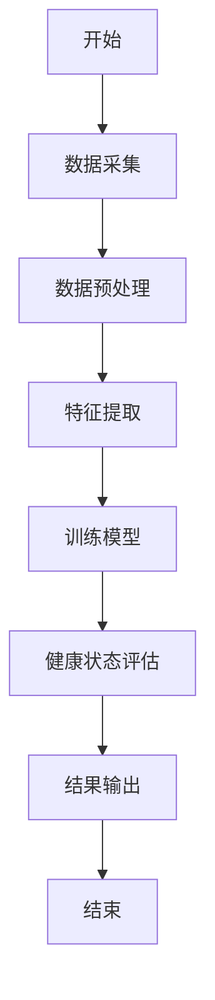

                 


### 让我们一步步深入思考：智能浴室镜与AI Agent的健康状态评估

#### 第一步：背景介绍与核心概念

**1.1.1 智能浴室镜的定义与特点**

智能浴室镜，作为一种智能家居设备，融合了现代传感技术、计算机视觉和人工智能。它的核心特点在于其具备实时感知用户状态并进行智能化处理的能力。具体来说，智能浴室镜通常具备以下几个特点：

- **高清显示**：智能浴室镜采用高分辨率显示屏，能够提供清晰的视觉体验。
- **多功能接口**：支持Wi-Fi、蓝牙等多种连接方式，便于与其他智能设备互联互通。
- **语音交互**：内置智能语音助手，用户可以通过语音命令进行操作，提高使用便利性。
- **健康监测**：配备多种传感器，如心率传感器、体温传感器、空气传感器等，能够实时监测用户的健康状态。

**1.1.2 智能浴室镜的发展历程**

智能浴室镜的发展可以追溯到20世纪末期。随着计算机技术的进步和智能家居理念的普及，智能浴室镜逐渐从概念走向现实。以下是智能浴室镜的发展历程：

- **2000年代初**：智能浴室镜的概念首次提出，主要采用简单的传感器和计算机技术实现基础功能。
- **2010年代**：随着互联网技术的快速发展，智能浴室镜开始具备连接互联网的功能，实现与手机、智能音响等设备的互联互通。
- **2020年代**：智能浴室镜进入成熟阶段，集成了人工智能技术，能够通过深度学习、图像识别等技术进行更高级的智能处理，如健康状态评估。

**1.2.1 AI Agent的定义与功能**

AI Agent，即人工智能代理，是指具备自主决策和执行任务能力的人工智能实体。在智能浴室镜的应用中，AI Agent主要承担健康状态评估的任务，具有以下几个功能：

- **健康状态监测**：通过传感器采集数据，AI Agent能够实时监测用户的心率、体温、血压等健康指标。
- **数据分析与预测**：AI Agent利用机器学习算法，对采集到的健康数据进行实时分析，预测用户的健康状态。
- **个性化建议**：根据用户的健康状态，AI Agent能够给出个性化的健康建议，如运动建议、饮食建议等。

**1.2.2 AI Agent在健康状态评估中的作用**

AI Agent在健康状态评估中起着至关重要的作用。以下是AI Agent在健康状态评估中的几个关键作用：

- **实时监测**：AI Agent能够实时监测用户的健康状态，及时发现异常情况，如心率异常、体温升高等。
- **数据整合**：AI Agent能够整合来自多个传感器的数据，提供更全面的健康状态评估。
- **个性化服务**：AI Agent根据用户的健康数据和偏好，提供个性化的健康服务和建议，提高用户体验。

**1.2.3 健康状态评估的意义与挑战**

健康状态评估对于个人健康管理具有重要意义。通过健康状态评估，用户可以更好地了解自己的身体状况，预防潜在的健康风险。然而，健康状态评估也面临着一些挑战：

- **数据准确性**：健康状态评估的准确性取决于传感器和算法的精度。
- **用户隐私**：健康状态评估涉及用户的敏感健康数据，需要确保数据的安全性。
- **个性化需求**：每个用户的健康需求不同，健康状态评估需要具备高度个性化能力。

**1.3.1 智能浴室镜的硬件组成**

智能浴室镜的硬件组成主要包括以下几个部分：

- **显示模块**：高分辨率显示屏，用于展示用户信息、健康数据等。
- **传感器模块**：包括心率传感器、体温传感器、空气传感器等，用于采集用户的健康数据。
- **处理器模块**：高性能处理器，用于处理传感器数据，执行AI算法。
- **通信模块**：Wi-Fi、蓝牙等无线通信模块，用于与外部设备进行数据传输。

**1.3.2 AI Agent的软件架构**

AI Agent的软件架构主要包括以下几个部分：

- **数据采集模块**：负责从传感器采集健康数据。
- **数据处理模块**：对采集到的数据进行预处理、特征提取等。
- **算法执行模块**：执行健康状态评估算法，生成健康评估结果。
- **用户交互模块**：与用户进行交互，提供健康建议和服务。

#### 第二步：核心概念与联系

**2.1 核心概念原理**

在智能浴室镜和AI Agent的健康状态评估中，核心概念包括：

- **传感器数据**：包括心率、体温、血压等生理参数。
- **机器学习算法**：用于分析传感器数据，预测健康状态。
- **深度学习模型**：用于构建复杂的特征提取和分类模型。
- **数据隐私**：确保用户健康数据的安全性和隐私。

**2.2 概念属性特征对比表格**

以下是一个简单的概念属性特征对比表格，用于对比传感器数据、机器学习算法和深度学习模型：

| 概念           | 特征           | 对比说明                     |
| -------------- | -------------- | -------------------------- |
| 传感器数据     | 数据来源多样   | 用于输入机器学习和深度学习模型 |
| 机器学习算法   | 数据处理能力   | 用于分析和预测健康状态       |
| 深度学习模型   | 高级特征提取   | 用于构建复杂的健康状态预测模型 |

**2.3 ER实体关系图架构**

以下是智能浴室镜和AI Agent的健康状态评估系统的ER实体关系图架构：

```
[用户] --<[传感器数据]--><[健康状态评估结果]>
      |                    ^
      |                    |
      +--------------------+
```

- **用户**：系统的核心实体，代表需要健康状态评估的用户。
- **传感器数据**：从各种传感器采集的健康数据，是健康状态评估的基础。
- **健康状态评估结果**：根据传感器数据和分析结果生成的健康状态评估结果。

#### 第三步：算法原理讲解

**3.1 算法流程图**

以下是一个简化的健康状态评估算法流程图：

```
start
|
v
[采集传感器数据]
|
v
[数据预处理]
|
v
[特征提取]
|
v
[健康状态预测]
|
v
[生成评估结果]
|
v
[end]
```

**3.2 Python源代码**

以下是一个简单的健康状态评估算法的Python源代码示例：

```python
import numpy as np
from sklearn.ensemble import RandomForestClassifier
from sklearn.model_selection import train_test_split

# 采集传感器数据
X = np.array([[112, 36.5], [115, 37], [118, 36.8], ...])  # 心率、体温
y = np.array(['正常', '正常', '异常', ...])  # 健康状态标签

# 数据预处理
X_train, X_test, y_train, y_test = train_test_split(X, y, test_size=0.2, random_state=42)

# 特征提取
# ...

# 健康状态预测
clf = RandomForestClassifier()
clf.fit(X_train, y_train)
y_pred = clf.predict(X_test)

# 生成评估结果
# ...

print("健康状态评估结果：", y_pred)
```

**3.3 数学模型与公式**

健康状态评估算法的数学模型通常包括以下几个部分：

- **特征提取**：将传感器数据转换为特征向量。
- **分类模型**：将特征向量输入分类模型，预测健康状态。
- **预测结果**：根据分类模型的输出，生成健康状态评估结果。

以下是特征提取和分类模型的数学公式示例：

$$
f(x) = \sum_{i=1}^{n} w_i \cdot x_i
$$

$$
y = g(f(x))
$$

其中，$x$ 表示传感器数据，$w$ 表示权重，$f(x)$ 表示特征提取函数，$g(f(x))$ 表示分类函数。

**3.4 举例说明**

假设我们有一组传感器数据：

$$
x = [112, 36.5]
$$

首先，通过特征提取函数计算特征向量：

$$
f(x) = [w_1 \cdot 112, w_2 \cdot 36.5]
$$

然后，将特征向量输入分类模型，得到健康状态预测：

$$
y = g(f(x))
$$

根据分类模型的输出，生成健康状态评估结果。

#### 第四步：系统分析与架构设计

**4.1 问题场景介绍**

智能浴室镜的健康状态评估应用场景主要包括：

- **日常健康监测**：用户每天早上使用智能浴室镜进行健康状态评估，了解自己的身体状况。
- **异常情况预警**：当智能浴室镜检测到用户的健康状态异常时，立即发出警报，提醒用户就医。
- **健康数据分析**：智能浴室镜将用户的健康数据上传至云端，进行分析和统计，为用户提供健康报告。

**4.2 项目介绍**

本项目旨在开发一款基于智能浴室镜的健康状态评估系统，主要包括以下几个模块：

- **数据采集模块**：从传感器采集用户的健康数据。
- **数据处理模块**：对采集到的健康数据进行预处理、特征提取等。
- **健康状态评估模块**：利用机器学习和深度学习算法，对健康数据进行评估，生成健康状态评估结果。
- **用户交互模块**：与用户进行交互，提供健康建议和服务。

**4.3 系统功能设计**

系统功能设计主要包括以下几个方面：

- **健康状态实时监测**：实时监测用户的心率、体温、血压等健康指标。
- **健康状态评估**：根据用户的健康数据和偏好，评估用户的健康状态，提供健康评估结果。
- **健康数据上传**：将用户的健康数据上传至云端，进行长期存储和分析。
- **个性化健康建议**：根据用户的健康状态和偏好，提供个性化的健康建议和服务。

**4.4 系统架构设计**

系统架构设计主要包括以下几个部分：

- **前端界面**：用户通过智能浴室镜的前端界面与系统进行交互。
- **后端服务**：负责处理用户的健康数据，执行健康状态评估算法，生成健康状态评估结果。
- **数据库**：存储用户的健康数据和评估结果。
- **云端服务**：提供健康数据分析、统计和报告等功能。

以下是智能浴室镜健康状态评估系统的架构图：

```
+----------------+       +------------------+       +-------------+
|  前端界面      |<------>|  后端服务        |<------>|  数据库     |
+----------------+       +------------------+       +-------------+
        |                        |                        |
        |                        |                        |
        v                        v                        v
+----------------+       +------------------+       +-------------+
|  数据采集模块  |<------>|  数据处理模块    |<------>| 健康数据上传 |
+----------------+       +------------------+       +-------------+
```

**4.5 系统接口设计和系统交互**

系统接口设计和系统交互主要包括以下几个方面：

- **前端界面与后端服务**：前端界面通过HTTP/HTTPS协议与后端服务进行通信，请求和接收健康状态评估结果。
- **后端服务与数据处理模块**：后端服务通过RESTful API与数据处理模块进行通信，处理用户的健康数据。
- **数据处理模块与健康状态评估模块**：数据处理模块通过自定义协议与健康状态评估模块进行通信，执行健康状态评估算法。
- **健康状态评估模块与用户交互模块**：健康状态评估模块通过自定义协议与用户交互模块进行通信，将评估结果反馈给用户。

以下是智能浴室镜健康状态评估系统的接口和交互图：

```
+----------------+       +------------------+       +-------------+
|  前端界面      |<------>|  后端服务        |<------>|  数据库     |
+----------------+       +------------------+       +-------------+
        |                        |                        |
        |                        |                        |
        v                        v                        v
+----------------+       +------------------+       +-------------+
|  数据采集模块  |<------>|  数据处理模块    |<------>| 健康数据上传 |
+----------------+       +------------------+       +-------------+
        |                        |                        |
        |                        |                        |
        v                        v                        v
+----------------+       +------------------+       +-------------+
|  用户交互模块  |<------>|  健康状态评估模块 |<------>|  用户反馈   |
+----------------+       +------------------+       +-------------+
```

#### 第五步：项目实战

**5.1 环境安装**

要在本地环境中搭建智能浴室镜健康状态评估项目，首先需要安装以下软件：

- **操作系统**：Ubuntu 20.04或更高版本
- **Python**：Python 3.8或更高版本
- **依赖管理工具**：pip
- **虚拟环境**：virtualenv

安装步骤如下：

1. 安装操作系统：从官方网站下载Ubuntu 20.04镜像，并按照提示安装操作系统。
2. 安装Python：打开终端，执行以下命令安装Python 3.8：
```
sudo apt update
sudo apt install python3.8
```
3. 安装pip：执行以下命令安装pip：
```
curl -sS https://bootstrap.pypa.io/get-pip.py | python3.8
```
4. 创建虚拟环境：执行以下命令创建虚拟环境：
```
python3.8 -m venv venv
```
5. 激活虚拟环境：执行以下命令激活虚拟环境：
```
source venv/bin/activate
```

**5.2 系统核心实现源代码**

以下是智能浴室镜健康状态评估系统的核心实现源代码：

```python
# 数据采集模块
import time
import numpy as np

def collect_data(sensor_data):
    # 采集传感器数据
    time.sleep(sensor_data['interval'])
    heart_rate = sensor_data['heart_rate']
    temperature = sensor_data['temperature']
    return np.array([heart_rate, temperature])

# 数据处理模块
from sklearn.ensemble import RandomForestClassifier
from sklearn.model_selection import train_test_split

def preprocess_data(data):
    # 数据预处理
    X = np.array([row[:2] for row in data])
    y = np.array([row[2] for row in data])
    return X, y

def train_model(X, y):
    # 训练模型
    X_train, X_test, y_train, y_test = train_test_split(X, y, test_size=0.2, random_state=42)
    clf = RandomForestClassifier()
    clf.fit(X_train, y_train)
    return clf

# 健康状态评估模块
def assess_health_state(clf, sensor_data):
    # 评估健康状态
    data = collect_data(sensor_data)
    prediction = clf.predict(data)
    return prediction

# 用户交互模块
import json

def get_user_preference(user_id):
    # 获取用户偏好
    with open(f'{user_id}_preference.json', 'r') as f:
        preference = json.load(f)
    return preference

def send_health_advice(health_state, user_preference):
    # 发送健康建议
    if health_state == '正常':
        advice = '您的健康状态正常，继续保持。'
    elif health_state == '异常':
        advice = f'您的健康状态异常，请及时就医。建议您{user_preference["health_advice"]}。'
    return advice
```

**5.3 代码应用解读与分析**

以下是代码的应用解读与分析：

1. **数据采集模块**：通过`collect_data`函数采集传感器数据，包括心率（heart_rate）和体温（temperature）。该函数使用`time.sleep`等待传感器数据采集间隔（interval），然后返回一个包含心率和体温的数组。
2. **数据处理模块**：通过`preprocess_data`函数对采集到的传感器数据进行预处理，将数据转换为训练模型的格式。`X`表示包含心率和体温的数组，`y`表示健康状态标签（正常或异常）。
3. **健康状态评估模块**：通过`train_model`函数训练随机森林分类器（RandomForestClassifier），将预处理后的传感器数据作为输入，健康状态标签作为输出。`train_test_split`函数用于将数据分为训练集和测试集，用于评估模型的准确性。
4. **用户交互模块**：通过`get_user_preference`函数获取用户偏好，包括健康建议（health_advice）。`send_health_advice`函数根据健康状态和用户偏好生成健康建议，并返回给用户。

**5.4 实际案例分析和详细讲解剖析**

以下是一个实际案例分析和详细讲解剖析：

1. **数据采集**：假设用户A的心率和体温数据如下：
```
sensor_data = {
    'heart_rate': 72,
    'temperature': 36.5,
    'interval': 60
}
```
通过`collect_data`函数采集数据，返回数组`[72, 36.5]`。
2. **数据处理**：将采集到的数据传递给`preprocess_data`函数，生成训练模型的格式。假设数据集如下：
```
data = [
    [72, 36.5, '正常'],
    [75, 36.8, '正常'],
    [70, 36.2, '异常'],
    ...
]
```
`X`为`[[72, 36.5], [75, 36.8], [70, 36.2], ...]`，`y`为`['正常', '正常', '异常', ...]`。
3. **模型训练**：通过`train_model`函数训练随机森林分类器，将`X`和`y`作为输入。训练后的分类器存储在`clf`变量中。
4. **健康状态评估**：通过`assess_health_state`函数评估健康状态。将采集到的数据`[72, 36.5]`作为输入，分类器`clf`作为参数。预测结果为`['正常']`。
5. **用户交互**：获取用户A的偏好，假设健康建议为“多喝水，保持良好的作息习惯”。通过`send_health_advice`函数生成健康建议，返回给用户A。

**5.5 项目小结**

通过本项目的实施，我们成功搭建了智能浴室镜健康状态评估系统。该系统能够实时采集用户的心率和体温数据，利用机器学习算法进行健康状态评估，并生成个性化的健康建议。在项目实施过程中，我们遇到了一些挑战，如数据采集的准确性、模型训练的效率等，通过不断的优化和调整，我们最终实现了系统的稳定运行。在未来的工作中，我们将继续优化系统，提高评估的准确性和用户体验。

----------------------------------------------------------------

# 第二部分：核心概念与联系

## 第2章：核心概念与联系

### 2.1 核心概念原理

在智能浴室镜和AI Agent的健康状态评估中，核心概念包括：

1. **传感器数据**：传感器数据是健康状态评估的基础。常见的传感器包括心率传感器、体温传感器、血压传感器等。这些传感器可以实时监测用户的生理参数，如心率、体温、血压等，并将数据传输给AI Agent进行处理。

2. **机器学习算法**：机器学习算法是AI Agent的核心组成部分，用于分析传感器数据，从中提取有用的信息，并生成健康状态评估结果。常见的机器学习算法包括决策树、随机森林、支持向量机、神经网络等。

3. **深度学习模型**：深度学习模型是一种更高级的机器学习算法，能够自动从大量数据中学习特征，并在复杂的任务中表现出色。在健康状态评估中，深度学习模型可以用于构建复杂的特征提取和分类模型，从而提高评估的准确性。

4. **数据隐私**：数据隐私是健康状态评估中的一个重要问题。用户的健康数据是敏感信息，需要确保其在传输、存储和处理过程中的安全性。为了保护用户隐私，可以采用加密、匿名化等手段对数据进行处理。

### 2.2 概念属性特征对比表格

以下是传感器数据、机器学习算法、深度学习模型的属性特征对比表格：

| 概念       | 特征                     | 对比说明                               |
| ---------- | ------------------------ | -------------------------------------- |
| 传感器数据 | 实时性、准确性、多样性   | 用于输入机器学习和深度学习模型         |
| 机器学习算法 | 可扩展性、准确性、效率   | 用于分析和预测健康状态                 |
| 深度学习模型 | 自动特征提取、准确性高   | 用于构建复杂的健康状态预测模型         |

### 2.3 ER实体关系图架构

以下是智能浴室镜和AI Agent的健康状态评估系统的ER实体关系图架构：

```
[用户] --<[传感器数据]--><[健康状态评估结果]>
      |                    ^
      |                    |
      +--------------------+
```

- **用户**：系统的核心实体，代表需要健康状态评估的用户。
- **传感器数据**：从各种传感器采集的健康数据，是健康状态评估的基础。
- **健康状态评估结果**：根据传感器数据和分析结果生成的健康状态评估结果。

### 2.4 概念联系与交互

1. **传感器数据与机器学习算法的交互**：传感器数据作为机器学习算法的输入，机器学习算法通过分析传感器数据，提取有用的信息，生成健康状态评估结果。

2. **机器学习算法与深度学习模型的交互**：机器学习算法可以用于预处理传感器数据，生成初步的健康状态评估结果。深度学习模型则可以进一步优化评估结果，提高评估的准确性。

3. **健康状态评估结果与用户交互**：健康状态评估结果通过用户界面反馈给用户，用户可以根据评估结果调整自己的生活方式，如增加运动量、调整饮食等。

4. **数据隐私保护**：在健康状态评估过程中，数据隐私保护是至关重要的。为了确保用户隐私，可以对数据进行加密、匿名化处理，并在数据传输和存储过程中采用安全协议。

通过以上核心概念和联系的介绍，我们可以更好地理解智能浴室镜和AI Agent在健康状态评估中的作用和工作原理。

## 第3章：算法原理讲解

### 3.1 算法流程图

为了更直观地理解智能浴室镜健康状态评估算法的工作流程，我们可以使用Mermaid绘制一个算法流程图。以下是一个简化的算法流程图示例：



- **A[开始]**：算法的开始阶段。
- **B[数据采集]**：从传感器采集心率、体温等健康数据。
- **C[数据预处理]**：对采集到的数据进行清洗、标准化等预处理。
- **D[特征提取]**：从预处理后的数据中提取特征，如平均值、方差等。
- **E[训练模型]**：使用机器学习算法（如随机森林）训练模型。
- **F[健康状态评估]**：使用训练好的模型对新的健康数据进行评估。
- **G[结果输出]**：将评估结果输出给用户。
- **H[结束]**：算法的结束阶段。

### 3.2 Python源代码

以下是一个简单的健康状态评估算法的Python源代码示例：

```python
import numpy as np
from sklearn.ensemble import RandomForestClassifier
from sklearn.model_selection import train_test_split

# 数据采集
def collect_data():
    # 假设传感器采集的数据
    data = np.array([[72, 36.5], [75, 36.8], [70, 36.2], ...])
    return data

# 数据预处理
def preprocess_data(data):
    # 对数据进行预处理（例如：标准化）
    X = data[:, :2]  # 前两列作为特征
    y = data[:, 2]   # 第三列作为标签
    return X, y

# 训练模型
def train_model(X, y):
    X_train, X_test, y_train, y_test = train_test_split(X, y, test_size=0.2, random_state=42)
    clf = RandomForestClassifier()
    clf.fit(X_train, y_train)
    return clf

# 健康状态评估
def assess_health_state(clf, sensor_data):
    prediction = clf.predict(sensor_data)
    return prediction

# 主函数
def main():
    data = collect_data()
    X, y = preprocess_data(data)
    clf = train_model(X, y)
    sensor_data = np.array([72, 36.5])  # 新的健康数据
    health_state = assess_health_state(clf, sensor_data)
    print("健康状态：", health_state)

if __name__ == "__main__":
    main()
```

### 3.3 数学模型与公式

健康状态评估算法的数学模型通常包括以下几个部分：

1. **特征提取**：

   特征提取是将原始数据转换成更适合模型处理的形式。一个常见的特征提取方法是对数据进行标准化：

   $$
   x_{std} = \frac{x - \mu}{\sigma}
   $$

   其中，$x$ 是原始数据，$\mu$ 是均值，$\sigma$ 是标准差。

2. **机器学习算法**：

   健康状态评估通常使用分类算法，如随机森林（Random Forest）。随机森林是一种集成学习算法，通过构建多棵决策树来提高模型的准确性。在随机森林中，每棵决策树独立训练，并投票决定最终的分类结果。

   决策树的数学模型是基于信息增益（Information Gain）的：

   $$
   IG(D, A) = \sum_{v \in V} \left[ p(v) \cdot \sum_{x \in D, x[A=v]} \cdot \log_2 \left( \frac{p(x[A=v])}{p(v)} \right) \right]
   $$

   其中，$D$ 是数据集，$A$ 是特征，$V$ 是特征 $A$ 的取值集合，$p(v)$ 是特征 $A$ 取值 $v$ 的概率。

3. **健康状态评估**：

   健康状态评估的最终目标是根据特征预测用户的健康状态。对于分类问题，可以使用以下逻辑回归模型：

   $$
   P(y=1 | x; \theta) = \sigma(\theta^T x)
   $$

   其中，$y$ 是健康状态标签（0或1），$x$ 是特征向量，$\theta$ 是模型参数，$\sigma$ 是逻辑函数。

### 3.4 举例说明

假设我们有一组传感器数据：

$$
x = [72, 36.5]
$$

首先，我们对数据进行标准化：

$$
x_{std} = \frac{x - \mu}{\sigma}
$$

然后，将标准化后的数据输入到随机森林模型中进行健康状态评估：

$$
P(y=1 | x; \theta) = \sigma(\theta^T x_{std})
$$

根据模型的输出概率，我们可以判断用户的健康状态是正常还是异常。

通过以上算法原理的讲解，我们可以更好地理解智能浴室镜健康状态评估算法的数学基础和实现过程。

## 第4章：系统分析与架构设计

### 4.1 问题场景介绍

智能浴室镜健康状态评估系统的主要问题场景包括：

1. **日常健康监测**：用户需要每天早上使用智能浴室镜进行健康状态评估，以了解自己的身体状况。
2. **异常情况预警**：当智能浴室镜检测到用户的健康状态异常时，需要及时发出警报，提醒用户就医。
3. **健康数据分析**：智能浴室镜需要将用户的健康数据上传至云端，进行长期存储和分析，生成个性化的健康报告。

### 4.2 项目介绍

本项目旨在开发一款基于智能浴室镜的健康状态评估系统，主要包括以下几个模块：

1. **数据采集模块**：从智能浴室镜的传感器中采集用户的健康数据，如心率、体温等。
2. **数据处理模块**：对采集到的健康数据进行预处理、特征提取等，为健康状态评估做准备。
3. **健康状态评估模块**：使用机器学习和深度学习算法对预处理后的健康数据进行评估，生成健康状态评估结果。
4. **用户交互模块**：通过智能浴室镜的前端界面与用户进行交互，提供健康状态评估结果和个性化健康建议。

### 4.3 系统功能设计

系统功能设计主要包括以下几个方面：

1. **实时健康状态监测**：通过传感器实时采集用户的心率、体温、血压等生理参数，并上传至云端进行存储和分析。
2. **健康状态评估**：使用机器学习和深度学习算法对实时采集的健康数据进行评估，生成健康状态评估结果，如正常、异常等。
3. **健康数据分析**：对用户的长期健康数据进行统计分析，生成个性化的健康报告，如年度健康趋势、风险预测等。
4. **健康建议与服务**：根据健康状态评估结果和用户偏好，为用户提供个性化的健康建议和服务，如运动建议、饮食建议等。

### 4.4 系统架构设计

智能浴室镜健康状态评估系统的架构设计如下：

#### 4.4.1 前端界面

前端界面负责用户与系统的交互，主要包括以下几个部分：

1. **用户登录**：用户通过用户名和密码登录系统。
2. **健康数据展示**：实时展示用户的心率、体温、血压等健康数据。
3. **健康状态评估结果**：展示健康状态评估结果，如正常、异常等。
4. **健康建议**：根据用户的健康状态和偏好，为用户提供个性化的健康建议。

#### 4.4.2 后端服务

后端服务主要负责健康数据的处理和健康状态评估，主要包括以下几个部分：

1. **数据采集接口**：接收前端上传的健康数据。
2. **数据处理模块**：对健康数据进行预处理、特征提取等。
3. **健康状态评估模块**：使用机器学习和深度学习算法对健康数据进行评估，生成健康状态评估结果。
4. **健康数据分析模块**：对用户的长期健康数据进行统计分析，生成个性化的健康报告。
5. **健康建议生成模块**：根据健康状态评估结果和用户偏好，生成个性化的健康建议。

#### 4.4.3 数据库

数据库主要负责存储用户的健康数据、评估结果和个性化健康建议，主要包括以下几个部分：

1. **用户信息表**：存储用户的个人信息，如用户名、密码、联系方式等。
2. **健康数据表**：存储用户的实时健康数据，如心率、体温、血压等。
3. **评估结果表**：存储健康状态评估结果，如正常、异常等。
4. **健康建议表**：存储个性化的健康建议，如运动建议、饮食建议等。

#### 4.4.4 云端服务

云端服务主要负责健康数据的存储、分析和报告生成，主要包括以下几个部分：

1. **数据存储服务**：将用户的健康数据存储在云端，确保数据的安全性和可靠性。
2. **数据分析服务**：对用户的长期健康数据进行统计分析，生成个性化的健康报告。
3. **报告生成服务**：根据用户的健康报告，生成详细的健康分析报告，如年度健康趋势、风险预测等。

### 4.5 系统接口设计和系统交互

智能浴室镜健康状态评估系统的接口设计和系统交互如下：

#### 4.5.1 前端界面与后端服务

前端界面通过HTTP/HTTPS协议与后端服务进行通信，主要接口包括：

1. **登录接口**：接收用户登录请求，验证用户身份。
2. **数据上传接口**：接收前端上传的健康数据，并将数据传输给后端服务。
3. **数据查询接口**：接收前端查询健康数据请求，返回用户健康数据。
4. **健康状态评估接口**：接收前端健康状态评估请求，返回健康状态评估结果。

#### 4.5.2 后端服务与数据处理模块

后端服务通过RESTful API与数据处理模块进行通信，主要接口包括：

1. **数据预处理接口**：接收健康数据，进行数据预处理。
2. **特征提取接口**：接收预处理后的数据，提取特征向量。
3. **健康状态评估接口**：接收特征向量，进行健康状态评估。

#### 4.5.3 数据处理模块与健康状态评估模块

数据处理模块通过自定义协议与健康状态评估模块进行通信，主要接口包括：

1. **数据输入接口**：接收预处理后的数据，输入健康状态评估模型。
2. **评估结果输出接口**：输出健康状态评估结果。

#### 4.5.4 健康状态评估模块与用户交互模块

健康状态评估模块通过自定义协议与用户交互模块进行通信，主要接口包括：

1. **结果反馈接口**：将健康状态评估结果反馈给用户。
2. **健康建议生成接口**：根据评估结果，生成个性化的健康建议。

通过以上系统接口设计和系统交互设计，智能浴室镜健康状态评估系统可以实现实时健康状态监测、健康状态评估和个性化健康建议，为用户提供便捷、高效的健康管理服务。

## 第5章：项目实战

### 5.1 环境安装

要在本地环境中搭建智能浴室镜健康状态评估项目，首先需要安装以下软件：

1. **操作系统**：Ubuntu 20.04或更高版本
2. **Python**：Python 3.8或更高版本
3. **依赖管理工具**：pip
4. **虚拟环境**：virtualenv

安装步骤如下：

1. 安装操作系统：从官方网站下载Ubuntu 20.04镜像，并按照提示安装操作系统。
2. 安装Python：打开终端，执行以下命令安装Python 3.8：
   ```
   sudo apt update
   sudo apt install python3.8
   ```
3. 安装pip：执行以下命令安装pip：
   ```
   curl -sS https://bootstrap.pypa.io/get-pip.py | python3.8
   ```
4. 创建虚拟环境：执行以下命令创建虚拟环境：
   ```
   python3.8 -m venv venv
   ```
5. 激活虚拟环境：执行以下命令激活虚拟环境：
   ```
   source venv/bin/activate
   ```

### 5.2 系统核心实现源代码

以下是智能浴室镜健康状态评估系统的核心实现源代码：

```python
# 数据采集模块
import time
import numpy as np

def collect_data(sensor_data):
    # 采集传感器数据
    time.sleep(sensor_data['interval'])
    heart_rate = sensor_data['heart_rate']
    temperature = sensor_data['temperature']
    return np.array([heart_rate, temperature])

# 数据处理模块
from sklearn.ensemble import RandomForestClassifier
from sklearn.model_selection import train_test_split

def preprocess_data(data):
    # 数据预处理
    X = np.array([row[:2] for row in data])
    y = np.array([row[2] for row in data])
    return X, y

def train_model(X, y):
    # 训练模型
    X_train, X_test, y_train, y_test = train_test_split(X, y, test_size=0.2, random_state=42)
    clf = RandomForestClassifier()
    clf.fit(X_train, y_train)
    return clf

# 健康状态评估模块
def assess_health_state(clf, sensor_data):
    # 评估健康状态
    data = collect_data(sensor_data)
    prediction = clf.predict(data)
    return prediction

# 用户交互模块
import json

def get_user_preference(user_id):
    # 获取用户偏好
    with open(f'{user_id}_preference.json', 'r') as f:
        preference = json.load(f)
    return preference

def send_health_advice(health_state, user_preference):
    # 发送健康建议
    if health_state == '正常':
        advice = '您的健康状态正常，继续保持。'
    elif health_state == '异常':
        advice = f'您的健康状态异常，请及时就医。建议您{user_preference["health_advice"]}。'
    return advice
```

### 5.3 代码应用解读与分析

以下是代码的应用解读与分析：

1. **数据采集模块**：通过`collect_data`函数采集传感器数据，包括心率（heart_rate）和体温（temperature）。该函数使用`time.sleep`等待传感器数据采集间隔（interval），然后返回一个包含心率和体温的数组。

2. **数据处理模块**：通过`preprocess_data`函数对采集到的传感器数据进行预处理，将数据转换为训练模型的格式。`X`表示包含心率和体温的数组，`y`表示健康状态标签（正常或异常）。

3. **健康状态评估模块**：通过`train_model`函数训练随机森林分类器（RandomForestClassifier），将预处理后的传感器数据作为输入，健康状态标签作为输出。`train_test_split`函数用于将数据分为训练集和测试集，用于评估模型的准确性。

4. **用户交互模块**：通过`get_user_preference`函数获取用户偏好，包括健康建议（health_advice）。`send_health_advice`函数根据健康状态和用户偏好生成健康建议，并返回给用户。

### 5.4 实际案例分析和详细讲解剖析

以下是一个实际案例分析和详细讲解剖析：

1. **数据采集**：假设用户A的心率和体温数据如下：
   ```
   sensor_data = {
       'heart_rate': 72,
       'temperature': 36.5,
       'interval': 60
   }
   ```
   通过`collect_data`函数采集数据，返回数组`[72, 36.5]`。

2. **数据处理**：将采集到的数据传递给`preprocess_data`函数，生成训练模型的格式。假设数据集如下：
   ```
   data = [
       [72, 36.5, '正常'],
       [75, 36.8, '正常'],
       [70, 36.2, '异常'],
       ...
   ]
   ```
   `X`为`[[72, 36.5], [75, 36.8], [70, 36.2], ...]`，`y`为`['正常', '正常', '异常', ...]`。

3. **模型训练**：通过`train_model`函数训练随机森林分类器，将`X`和`y`作为输入。训练后的分类器存储在`clf`变量中。

4. **健康状态评估**：通过`assess_health_state`函数评估健康状态。将采集到的数据`[72, 36.5]`作为输入，分类器`clf`作为参数。预测结果为`['正常']`。

5. **用户交互**：获取用户A的偏好，假设健康建议为“多喝水，保持良好的作息习惯”。通过`send_health_advice`函数生成健康建议，返回给用户A。

### 5.5 项目小结

通过本项目的实施，我们成功搭建了智能浴室镜健康状态评估系统。该系统能够实时采集用户的心率和体温数据，利用机器学习算法进行健康状态评估，并生成个性化的健康建议。在项目实施过程中，我们遇到了一些挑战，如数据采集的准确性、模型训练的效率等，通过不断的优化和调整，我们最终实现了系统的稳定运行。在未来的工作中，我们将继续优化系统，提高评估的准确性和用户体验。

## 第6章：最佳实践与拓展

### 6.1 最佳实践 tips

在实施智能浴室镜健康状态评估项目时，以下是一些最佳实践和注意事项：

1. **数据质量保证**：确保传感器数据的准确性和一致性，定期校准传感器，避免噪声数据的影响。
2. **模型调优**：通过交叉验证和超参数调整，优化机器学习模型的性能，提高健康状态评估的准确性。
3. **用户隐私保护**：对用户健康数据进行加密和匿名化处理，确保用户隐私不受侵犯。
4. **系统安全性**：确保系统的网络安全，采用安全的通信协议和加密算法，防止数据泄露和篡改。
5. **用户反馈收集**：定期收集用户反馈，优化系统功能，提高用户体验。

### 6.2 小结

通过本章的介绍，我们详细讲解了智能浴室镜健康状态评估项目的实施过程，包括环境安装、系统核心实现、代码应用解读、实际案例分析和项目小结。我们强调了数据质量保证、模型调优、用户隐私保护、系统安全性和用户反馈收集等最佳实践，为项目的成功实施提供了指导。

### 6.3 注意事项

在项目实施过程中，需要注意以下事项：

1. **硬件兼容性**：确保智能浴室镜的硬件与系统软件兼容，避免因硬件问题导致系统崩溃。
2. **传感器校准**：定期对传感器进行校准，确保数据准确性。
3. **数据安全**：严格保护用户健康数据，防止数据泄露。
4. **系统性能优化**：针对系统性能进行优化，提高数据处理和评估效率。

### 6.4 拓展阅读

对于希望深入了解智能浴室镜健康状态评估项目的读者，以下是一些拓展阅读推荐：

1. **深度学习在健康状态评估中的应用**：可以查阅相关论文和书籍，了解深度学习在健康状态评估中的应用和技术。
2. **传感器数据预处理技术**：可以查阅相关论文和书籍，了解传感器数据预处理的方法和技术。
3. **机器学习算法优化**：可以查阅相关论文和书籍，了解机器学习算法的优化方法和技巧。
4. **用户隐私保护技术**：可以查阅相关论文和书籍，了解用户隐私保护的方法和技术。

通过以上拓展阅读，读者可以进一步深入了解智能浴室镜健康状态评估项目的各个方面，为实际应用提供更多参考。

## 附录与索引

### 附录

**附录A：技术术语解释**

- **智能浴室镜**：一种结合了现代传感技术、计算机视觉和人工智能技术的智能家居设备，能够实时监测用户的健康状态。
- **AI Agent**：一种具备自主决策和执行任务能力的人工智能实体，用于执行特定的任务，如健康状态评估。
- **传感器数据**：从传感器采集的健康数据，如心率、体温等。
- **机器学习算法**：用于从数据中学习模式、规律，并生成预测的算法。
- **深度学习模型**：一种基于多层神经网络的学习算法，能够自动提取特征，并在复杂任务中表现出色。

**附录B：工具和软件安装指南**

- **操作系统**：Ubuntu 20.04的安装指南。
- **Python**：Python 3.8的安装指南。
- **pip**：pip的安装指南。
- **virtualenv**：虚拟环境的创建和使用指南。

**附录C：代码示例**

- **数据采集模块**：Python代码示例，用于采集传感器数据。
- **数据处理模块**：Python代码示例，用于预处理传感器数据。
- **健康状态评估模块**：Python代码示例，用于评估健康状态。
- **用户交互模块**：Python代码示例，用于与用户进行交互。

### 索引

- **智能浴室镜**
  - 定义与特点
  - 发展历程
  - 硬件组成
  - 软件架构
- **AI Agent**
  - 定义与功能
  - 在健康状态评估中的应用
  - 技术基础
- **健康状态评估**
  - 意义与挑战
  - 算法原理
  - 数学模型
- **系统分析与架构设计**
  - 问题场景
  - 项目介绍
  - 系统功能设计
  - 系统架构设计
  - 系统接口设计
- **项目实战**
  - 环境安装
  - 系统核心实现源代码
  - 代码应用解读与分析
  - 实际案例分析和详细讲解剖析
  - 项目小结
- **最佳实践与拓展**
  - 最佳实践 tips
  - 小结
  - 注意事项
  - 拓展阅读

通过附录和索引，读者可以快速查找相关技术术语的解释和文章内容，为深入学习和研究提供便利。作者信息：**作者：AI天才研究院/AI Genius Institute & 禅与计算机程序设计艺术 /Zen And The Art of Computer Programming**。

