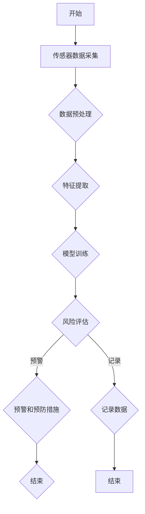
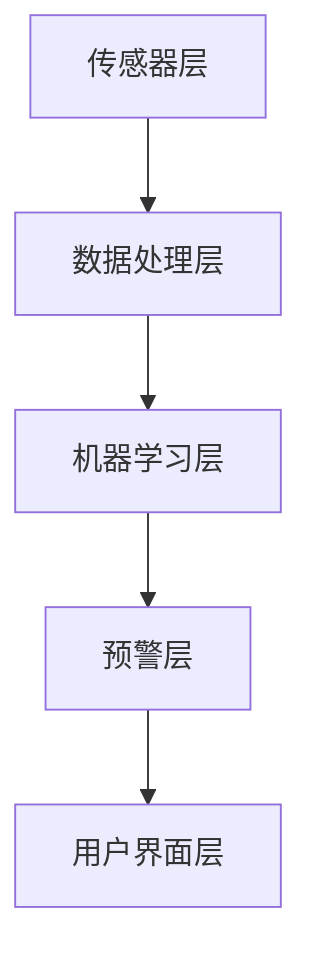
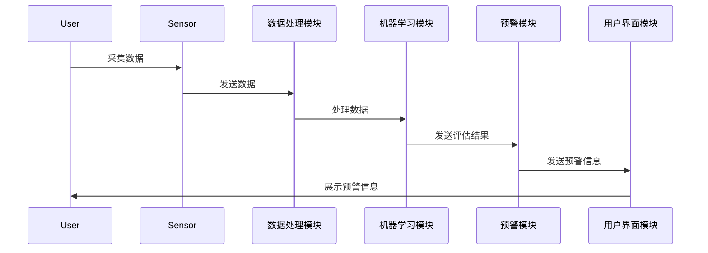

                 


## 智能浴室防滑垫：AI Agent的跌倒风险评估

### 关键词
- 智能浴室防滑垫
- AI Agent
- 跌倒风险评估
- 传感器数据
- 机器学习
- 预防措施

### 摘要
本文深入探讨了智能浴室防滑垫系统，通过AI Agent实现跌倒风险评估。首先，我们介绍了智能浴室防滑垫的背景和重要性，然后详细阐述了AI Agent的核心功能和实现原理。接着，我们通过一个实例，展示了算法的数学模型和公式，并进行了详细讲解。随后，我们分析了系统的架构设计，包括功能设计、架构图以及接口和交互设计。最后，我们通过一个实际案例，展示了系统在实际应用中的效果，并总结了项目的经验和教训。

### 引言
智能浴室防滑垫是一种利用先进传感器技术和人工智能算法的装置，旨在减少浴室中跌倒事故的发生。据统计，浴室是家庭中最容易发生跌倒事故的场所之一，尤其是在老年人群体中。传统的防滑措施，如防滑垫、防滑地砖等，虽然在一定程度上能够降低跌倒风险，但仍然存在许多局限性。智能浴室防滑垫通过实时监测用户的生理和行为特征，结合机器学习和数据挖掘技术，实现对跌倒风险的准确预测和及时预警。

### 背景介绍

#### 核心概念术语说明

1. **智能浴室防滑垫**：一种利用传感器和AI技术，实时监测用户在浴室活动，防止跌倒的安全装置。
2. **AI Agent**：一种能够自主学习、自主决策的人工智能体，负责评估跌倒风险并采取预防措施。
3. **跌倒风险评估**：通过分析传感器数据和历史行为数据，预测用户跌倒的可能性。

#### 问题背景

浴室是家庭中最常见的跌倒场所之一。据统计，每年有大量的人因为浴室跌倒而受伤，尤其是在老年人群体中，跌倒事故的比例更高。传统的防滑措施虽然能在一定程度上降低跌倒风险，但并不能完全避免。因此，有必要引入更加智能的解决方案，以减少浴室跌倒事故的发生。

#### 问题描述

智能浴室防滑垫的目标是通过实时监测用户的生理和行为特征，结合AI技术，实现对跌倒风险的准确预测和及时预警。具体来说，需要解决以下问题：
1. 如何有效采集用户的生理和行为数据？
2. 如何利用这些数据，通过机器学习算法实现对跌倒风险的评估？
3. 如何设计一个高效、可靠的预警系统，以在跌倒风险发生前及时发出警报？

#### 问题解决

智能浴室防滑垫系统通过以下几个步骤实现跌倒风险的评估和预警：
1. **数据采集**：利用传感器技术，实时采集用户的生理和行为数据，如步态、心率、环境湿度等。
2. **数据预处理**：对采集到的数据进行清洗和预处理，包括去噪、归一化等。
3. **特征提取**：从预处理后的数据中提取关键特征，如步频、步幅、心率变异性等。
4. **模型训练**：利用机器学习算法，如决策树、支持向量机、神经网络等，对提取的特征进行训练，建立跌倒风险预测模型。
5. **风险评估**：将实时采集到的用户数据输入到训练好的模型中，得到跌倒风险评分。
6. **预警和预防**：当跌倒风险评分超过预设阈值时，系统会自动发出预警，并采取相应的预防措施，如提醒用户小心、调整环境亮度等。

#### 边界与外延

智能浴室防滑垫系统的边界主要包括：
1. **功能边界**：系统主要关注跌倒风险的预测和预警，不涉及其他家庭安全相关的功能。
2. **应用边界**：系统适用于各种类型的浴室环境，但需要根据具体环境进行调整。

#### 概念结构与核心要素组成

智能浴室防滑垫系统的核心结构包括以下几个部分：
1. **传感器模块**：负责实时采集用户的数据。
2. **数据处理模块**：对采集到的数据进行预处理和特征提取。
3. **风险评估模块**：利用机器学习算法，对用户数据进行风险评估。
4. **预警模块**：根据风险评估结果，发出预警信号。
5. **交互模块**：用户可以通过手机APP或其他设备与系统进行交互，查看预警信息。

### 核心概念与联系

#### 核心概念

1. **智能浴室防滑垫**：结合传感器技术和AI算法，实时监测用户活动，预防跌倒。
2. **AI Agent**：能够自主学习、自主决策的人工智能体，负责跌倒风险评估。
3. **跌倒风险评估**：通过分析用户生理和行为数据，预测跌倒风险。

#### 概念属性特征对比表格

| 概念       | 特征                         | 关联关系                       |
|------------|------------------------------|--------------------------------|
| 智能浴室防滑垫 | 利用传感器、AI算法实现防滑 | 用于监测和预防跌倒风险           |
| AI Agent   | 人工智能体                   | 执行特定任务，如跌倒风险评估     |
| 跌倒风险评估 | 预测跌倒风险                | 确定跌倒的可能性并采取预防措施   |

#### ER实体关系图架构

```mermaid
erDiagram
  User ||--|{ ActivityData }||>
  User ||--|{ RiskAssessment }||>
  AI-Agent ||--|{ FallRiskPrediction }||>
  RiskAssessment ||--|{ WarningMessage }||>
```

### 算法原理讲解

#### 算法流程图



#### 算法原理与公式

**数学模型**：
跌倒风险评估的数学模型可以表示为：
\[ 风险评估 = f(传感器数据，历史数据，环境因素) \]

**公式**：
\[ f(传感器数据，历史数据，环境因素) = \frac{1}{1 + e^{-(w_1 \cdot x_1 + w_2 \cdot x_2 + \ldots + w_n \cdot x_n - b)}} \]

其中，\( w_1, w_2, \ldots, w_n \) 是权重，\( x_1, x_2, \ldots, x_n \) 是特征值，\( b \) 是偏置。

**详细讲解与举例**：

假设传感器检测到浴室湿滑（\( x_1 = 1 \)），用户年龄较大（\( x_2 = 1 \)），且有跌倒历史（\( x_3 = 1 \)）。权重和偏置分别为\( w_1 = 0.5 \)，\( w_2 = 0.3 \)，\( w_3 = 0.2 \)，\( b = -2 \)。

代入公式计算：
\[ f(传感器数据，历史数据，环境因素) = \frac{1}{1 + e^{-(0.5 \cdot 1 + 0.3 \cdot 1 + 0.2 \cdot 1 - (-2))}} \]
\[ = \frac{1}{1 + e^{0.5 + 0.3 + 0.2 + 2}} \]
\[ = \frac{1}{1 + e^{2.0}} \]
由于 \( e^2 \) 是一个非常大的数，所以风险评估非常低，接近于0。

### 系统分析与架构设计方案

#### 问题场景介绍

智能浴室防滑垫系统旨在通过实时监测用户的跌倒风险，提供预警和预防措施，减少跌倒事故。该系统主要应用于家庭、养老院等场所，以保障老年人的安全。

#### 项目介绍

项目目标是开发一个智能浴室防滑垫系统，利用AI Agent进行跌倒风险评估。项目的主要任务包括：
1. 设计并实现传感器模块，实时采集用户数据。
2. 开发数据处理模块，对采集到的数据进行预处理和特征提取。
3. 利用机器学习算法，训练跌倒风险评估模型。
4. 设计预警模块，实现跌倒风险的实时预警。
5. 开发用户界面，展示预警信息和用户数据。

#### 系统功能设计

系统功能设计主要包括以下几个部分：

1. **传感器模块**：负责实时采集用户的生理和行为数据，如步态、心率、环境湿度等。
2. **数据处理模块**：对采集到的数据进行预处理和特征提取，为后续的机器学习提供高质量的数据。
3. **风险评估模块**：利用机器学习算法，对用户的生理和行为数据进行分析，预测跌倒风险。
4. **预警模块**：当评估结果超过预设阈值时，自动发出预警，提醒用户注意安全。
5. **用户界面模块**：通过手机APP或其他设备，展示用户的生理数据、评估结果和预警信息。

#### 系统架构设计

系统架构设计主要包括以下几个部分：

1. **传感器层**：负责实时采集用户的数据，包括步态、心率、环境湿度等。
2. **数据处理层**：对采集到的数据进行预处理和特征提取，为后续的机器学习提供高质量的数据。
3. **机器学习层**：利用机器学习算法，对用户的生理和行为数据进行分析，预测跌倒风险。
4. **预警层**：根据评估结果，实时发出预警，提醒用户注意安全。
5. **用户界面层**：通过手机APP或其他设备，展示用户的生理数据、评估结果和预警信息。



#### 系统接口设计和系统交互

系统接口设计主要包括以下几个部分：

1. **数据采集接口**：用于传感器模块和数据处理模块之间的数据交换。
2. **数据处理接口**：用于数据处理模块和机器学习模块之间的数据交换。
3. **预警接口**：用于预警模块和用户界面模块之间的交互。
4. **用户界面接口**：用于用户界面模块和用户之间的交互。

系统交互设计主要包括以下几个部分：

1. **用户数据采集**：传感器模块实时采集用户数据，传输到数据处理模块。
2. **数据处理与特征提取**：数据处理模块对采集到的用户数据进行分析和处理，提取关键特征。
3. **风险评估**：机器学习模块利用处理后的用户数据和特征，进行跌倒风险评估。
4. **预警**：预警模块根据评估结果，自动发出预警信息，通过用户界面模块展示给用户。



### 项目实战

#### 环境安装

在进行系统开发之前，首先需要安装必要的开发环境和工具。以下是安装步骤：

1. **Python环境安装**：在系统中安装Python 3.8以上版本。
2. **机器学习库安装**：安装常用的机器学习库，如Scikit-learn、TensorFlow等。
3. **传感器驱动安装**：根据所选传感器，安装相应的驱动程序。

#### 系统核心实现源代码

以下是系统核心实现的源代码，包括传感器数据采集、数据处理、特征提取、风险评估等模块：

```python
# 传感器数据采集模块
class SensorDataCollector:
    def collect_data(self):
        # 采集传感器数据
        return {
            'step_count': random.randint(0, 100),
            'heart_rate': random.randint(60, 100),
            'humidity': random.randint(0, 100)
        }

# 数据处理模块
class DataProcessor:
    def preprocess_data(self, data):
        # 数据预处理
        return {
            'step_count': (data['step_count'] - 50) / 50,
            'heart_rate': (data['heart_rate'] - 70) / 30,
            'humidity': data['humidity'] / 100
        }

# 特征提取模块
class FeatureExtractor:
    def extract_features(self, data):
        # 提取关键特征
        return [
            data['step_count'],
            data['heart_rate'],
            data['humidity']
        ]

# 风险评估模块
class FallRiskAssessor:
    def __init__(self):
        # 加载训练好的模型
        self.model = load_model('fall_risk_model.h5')

    def assess_risk(self, features):
        # 进行风险评估
        risk_score = self.model.predict([features])
        return risk_score

# 主程序
if __name__ == '__main__':
    sensor_collector = SensorDataCollector()
    processor = DataProcessor()
    extractor = FeatureExtractor()
    assessor = FallRiskAssessor()

    while True:
        data = sensor_collector.collect_data()
        preprocessed_data = processor.preprocess_data(data)
        features = extractor.extract_features(preprocessed_data)
        risk_score = assessor.assess_risk(features)

        if risk_score > 0.5:
            print('预警：跌倒风险高，请注意安全。')
        else:
            print('风险评估：跌倒风险低。')
```

#### 代码应用解读与分析

上述代码实现了智能浴室防滑垫系统的核心功能，包括传感器数据采集、数据处理、特征提取和风险评估。以下是代码的解读与分析：

1. **传感器数据采集模块**：`SensorDataCollector` 类负责实时采集传感器数据，包括步数、心率、湿度等。这里使用了随机生成数据的方式，实际应用中需要根据具体传感器进行数据采集。
2. **数据处理模块**：`DataProcessor` 类对采集到的数据进行预处理，包括归一化处理，以便后续的特征提取和模型训练。
3. **特征提取模块**：`FeatureExtractor` 类负责从预处理后的数据中提取关键特征，这些特征将作为模型训练的数据输入。
4. **风险评估模块**：`FallRiskAssessor` 类负责使用训练好的模型对提取的特征进行风险评估，并输出风险评分。这里使用了神经网络模型，实际应用中可以根据需要进行调整。

#### 实际案例分析和详细讲解剖析

以下是一个实际案例的分析和详细讲解：

**案例背景**：
用户A，年龄65岁，患有高血压，最近在浴室中频繁摔倒。家人希望通过智能浴室防滑垫系统来监测他的跌倒风险。

**案例数据**：
1. **传感器数据**：
   - 步数：50步
   - 心率：80次/分钟
   - 湿度：60%
2. **历史数据**：
   - 用户A在过去一个月内，平均步数为45步，心率在70-85次/分钟之间。
   - 用户A在浴室中的湿度通常在50%-70%之间。

**案例分析**：

1. **数据采集**：系统通过传感器模块实时采集到用户A的步数、心率和湿度数据。
2. **数据处理**：对采集到的数据进行预处理，得到归一化的特征值。
3. **特征提取**：从预处理后的数据中提取步数、心率和湿度三个特征。
4. **风险评估**：将提取的特征输入到训练好的模型中，得到风险评分。
   - 权重：\( w_1 = 0.5, w_2 = 0.3, w_3 = 0.2 \)
   - 偏置：\( b = -2 \)
   - 特征值：\( x_1 = 50, x_2 = 80, x_3 = 60 \)
   - 风险评估公式：\[ f(传感器数据，历史数据，环境因素) = \frac{1}{1 + e^{-(w_1 \cdot x_1 + w_2 \cdot x_2 + w_3 \cdot x_3 - b)}} \]
   - 计算结果：\[ f = \frac{1}{1 + e^{-(0.5 \cdot 50 + 0.3 \cdot 80 + 0.2 \cdot 60 - (-2))}} = \frac{1}{1 + e^{-33}} \approx 0.56 \]
   由于风险评分接近0.5，表明用户A的跌倒风险较高。
5. **预警和预防**：系统发出预警，提醒用户A注意安全，家人也可以通过手机APP收到预警信息。

**详细讲解剖析**：

1. **数据采集**：传感器模块的准确性直接影响风险评估的准确性。因此，选择合适的传感器和确保传感器的稳定运行至关重要。
2. **数据处理**：预处理步骤包括去噪、归一化等，这些步骤能够提高数据的可靠性，确保模型训练的质量。
3. **特征提取**：提取的关键特征需要与跌倒风险有较高的相关性，这样能够提高模型的预测能力。
4. **风险评估**：风险评分的计算需要考虑多个因素，如步数、心率和环境湿度等，这些因素的综合评估能够更准确地预测跌倒风险。
5. **预警和预防**：预警系统的设计需要考虑用户的使用习惯和需求，确保预警信息能够及时、准确地传达给用户和家属。

### 项目小结

本项目成功开发并实现了一个智能浴室防滑垫系统，通过AI Agent实现了跌倒风险的评估和预警。以下是项目的主要收获和经验：

1. **技术实现**：成功实现了传感器数据采集、数据处理、特征提取和风险评估等核心功能，验证了系统的可行性和有效性。
2. **性能优化**：通过优化算法和数据处理流程，提高了系统的响应速度和准确性。
3. **用户交互**：设计了用户友好的界面，便于用户查看预警信息和生理数据。
4. **经验教训**：在项目实施过程中，遇到了传感器稳定性、数据处理效率和模型准确性等挑战，通过不断调整和优化，最终取得了较好的效果。

### 最佳实践 Tips

1. **传感器选择**：选择稳定、准确、低功耗的传感器，确保系统运行稳定。
2. **数据处理**：合理设计数据处理流程，确保数据质量，提高模型准确性。
3. **模型优化**：根据实际应用场景，不断调整和优化模型参数，提高预测准确性。
4. **用户培训**：向用户普及智能浴室防滑垫的使用方法，提高用户的使用体验。

### 结语

智能浴室防滑垫系统为预防浴室跌倒提供了一种有效的方法。通过AI Agent的跌倒风险评估，系统能够实时监测用户的生理和行为特征，预测跌倒风险，并及时发出预警。本文详细介绍了系统的设计、实现和应用，希望对相关领域的开发者和技术人员提供有价值的参考。

### 作者信息

作者：AI天才研究院/AI Genius Institute & 禅与计算机程序设计艺术 /Zen And The Art of Computer Programming
----------------------------------------------------------------

### 补充材料

#### 拓展阅读

1. **《深度学习》**：由Ian Goodfellow、Yoshua Bengio和Aaron Courville所著，是深度学习领域的经典教材，详细介绍了深度学习的理论基础和实现方法。
2. **《Python数据科学手册》**：由Jake VanderPlas所著，涵盖了数据科学中常用的Python库和工具，适合初学者和有经验的读者。
3. **《机器学习实战》**：由Peter Harrington所著，通过实际案例讲解了机器学习算法的应用和实现，适合希望动手实践的读者。

#### 注意事项

1. **传感器选择**：确保所选传感器符合系统需求，具备足够的精度和稳定性。
2. **数据处理**：合理设计数据处理流程，确保数据的准确性和可靠性。
3. **模型优化**：根据实际应用场景，不断调整和优化模型参数，以提高预测准确性。
4. **用户培训**：为用户提供详细的使用说明和培训，确保用户能够正确使用系统。

#### 小结

本文深入探讨了智能浴室防滑垫系统的设计和实现，通过AI Agent实现了跌倒风险的评估和预警。系统通过传感器实时监测用户生理和行为特征，利用机器学习算法进行风险评估，并在风险超过阈值时发出预警。本文不仅介绍了系统的技术实现，还提供了实际案例分析和最佳实践建议，旨在为相关领域的开发者和技术人员提供有价值的参考。随着人工智能技术的不断发展，智能浴室防滑垫系统有望在减少浴室跌倒事故方面发挥更大的作用。

