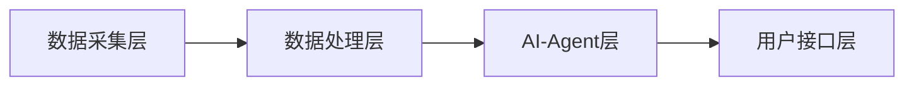
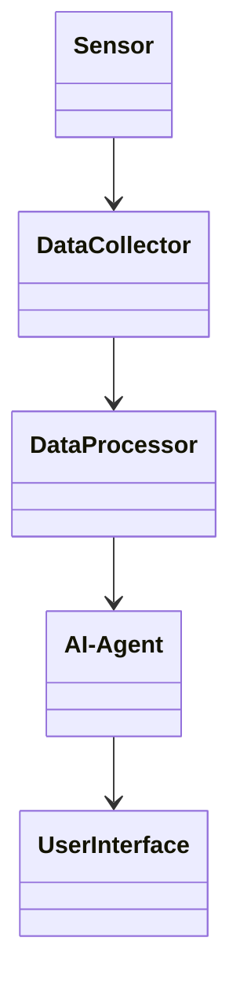
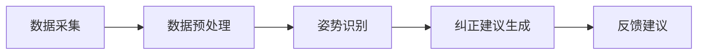

                 

## 智能瑜伽垫：AI Agent的实时姿势纠正系统

关键词：智能瑜伽垫、AI Agent、实时姿势纠正、传感器技术、算法原理

摘要：本文深入探讨智能瑜伽垫及其核心组件——AI Agent的实时姿势纠正系统。通过对背景介绍、核心技术解析、实际应用与未来展望的详细分析，揭示智能瑜伽垫在提升瑜伽练习效率和安全性方面的潜力。

### 1. 背景介绍

智能瑜伽垫是一种结合了先进传感器技术和AI-Agent智能算法的设备，旨在实时监控和纠正用户的瑜伽姿势。随着健康意识的提升和瑜伽在全球范围内的普及，智能瑜伽垫市场正迅速增长。用户不仅可以通过智能瑜伽垫获得个性化的练习指导，还能通过实时反馈来改进姿势，预防受伤。

### 2. 智能瑜伽垫的核心技术

#### 2.1 物理传感器技术

智能瑜伽垫的核心在于其内置的物理传感器，这些传感器能够精确捕捉用户的动作和姿势。常见的传感器类型包括压力传感器、加速度传感器和陀螺仪等。以下是对这些传感器的基本原理和应用设计的详细解释：

##### 2.1.1 传感器基本原理

传感器通过物理现象将非电学量转换为电学量，从而实现数据的采集。压力传感器通过电阻变化来测量压力，加速度传感器通过电荷积累来测量加速度，而陀螺仪则通过振动来测量角速度。

##### 2.1.2 瑜伽垫传感器设计

智能瑜伽垫的传感器设计需要考虑到数据的准确性和可靠性。传感器的布置位置和传感器的灵敏度调整都是关键因素。例如，压力传感器可以布置在瑜伽垫的特定区域，以捕捉用户的膝盖、手肘等部位的负载情况。

##### 2.1.3 传感器数据校正与优化

由于传感器本身的误差和外界干扰，传感器数据的校正和优化是必不可少的。常用的数据校正方法包括零点校正、增益校正和温度补偿。优化策略则包括滤波和算法调整，以减少噪声和提高数据精度。

#### 2.2 AI-Agent技术

AI-Agent是智能瑜伽垫的核心智能组件，它通过学习和分析用户的姿势数据，提供实时反馈和纠正建议。以下是对AI-Agent的概述、工作原理及其在智能瑜伽垫中的应用的详细解释：

##### 2.2.1 AI-Agent概述

AI-Agent是一种具有自主决策能力的智能实体，能够在特定环境中执行任务。它通常被分为基于规则的Agent和基于学习的Agent。在智能瑜伽垫中，AI-Agent通常是基于学习算法的。

##### 2.2.2 AI-Agent工作原理

AI-Agent通过机器学习和深度学习算法对大量瑜伽姿势数据进行训练，从而建立姿势识别和纠正模型。在训练过程中，AI-Agent学习识别不同姿势的特征，并根据这些特征生成纠正建议。

##### 2.2.3 AI-Agent在智能瑜伽垫中的应用

在智能瑜伽垫中，AI-Agent负责实时分析用户的姿势，识别是否存在错误或不当的姿势，并生成纠正建议。这些建议可以通过声音提示、屏幕显示或振动等方式传递给用户。

### 3. 实时姿势纠正系统的设计与实现

智能瑜伽垫的实时姿势纠正系统是一个复杂的多层次系统，包括数据采集、数据处理、姿势识别和纠正建议生成等环节。以下是对系统架构设计、接口设计、实时姿势纠正算法的详细解释：

##### 3.1 系统架构设计

智能瑜伽垫的实时姿势纠正系统通常采用分布式架构，包括传感器节点、数据处理单元和用户界面。传感器节点负责采集用户姿势数据，数据处理单元负责分析数据并生成纠正建议，用户界面则负责将建议以直观的方式呈现给用户。

##### 3.2 系统接口设计与实现

系统接口设计是确保传感器节点和数据处理单元之间高效通信的关键。通常包括数据采集接口、数据处理接口和用户交互接口。数据采集接口负责接收传感器数据，数据处理接口负责处理和分析数据，用户交互接口负责将纠正建议呈现给用户。

##### 3.3 实时姿势纠正算法讲解

实时姿势纠正算法的核心在于姿势识别和纠正建议生成。姿势识别算法通常基于深度学习技术，通过分析传感器数据识别当前姿势。纠正建议生成算法则基于姿势识别结果，为用户提供具体的纠正建议。以下是一个简单的实时姿势纠正算法流程：

1. **数据采集**：传感器节点实时采集用户的姿势数据。
2. **数据预处理**：对采集到的数据进行滤波、去噪等预处理。
3. **姿势识别**：使用深度学习模型对预处理后的数据进行分析，识别当前姿势。
4. **姿势评估**：对识别出的姿势进行评估，判断是否存在错误或不当的姿势。
5. **纠正建议生成**：根据姿势评估结果，生成具体的纠正建议。

### 4. 智能瑜伽垫的实际应用

智能瑜伽垫在多个领域具有广泛的应用潜力。以下是对智能瑜伽垫在健身中心、个人健康管理以及远程教学中的实际应用的详细解释：

##### 4.1 健身中心的智能瑜伽垫应用

在健身中心，智能瑜伽垫可以提供个性化的瑜伽练习指导。教练可以通过智能瑜伽垫实时监控学员的姿势，并提供个性化的纠正建议，从而提高练习效果。

##### 4.2 个人健康管理的智能瑜伽垫

个人健康管理的智能瑜伽垫可以用于日常的家庭瑜伽练习。用户可以通过智能瑜伽垫监控自己的姿势，并根据自己的健康状况和需求调整练习计划，从而实现个性化的健康管理。

##### 4.3 智能瑜伽垫在远程教学中的应用

智能瑜伽垫在远程教学中的应用非常广泛。教师可以通过智能瑜伽垫实时监控学生的姿势，并提供即时的纠正建议。此外，智能瑜伽垫还可以用于在线瑜伽课程的教学，提高教学效果。

### 5. 智能瑜伽垫的未来发展趋势

智能瑜伽垫的未来发展趋势将集中在技术提升和应用拓展方面。随着传感器技术和AI-Agent技术的不断进步，智能瑜伽垫的功能将更加丰富，应用场景也将更加广泛。以下是对智能瑜伽垫未来发展趋势的详细解释：

##### 5.1 技术发展趋势

传感器技术的进步将使得智能瑜伽垫能够更加精确地捕捉用户的姿势数据。AI-Agent技术的进步将使得智能瑜伽垫能够提供更加智能的纠正建议。

##### 5.2 行业前景与挑战

随着健康意识的提升和瑜伽市场的扩大，智能瑜伽垫的市场前景非常广阔。然而，技术成熟度、应用场景和用户体验等方面仍存在挑战。

##### 5.3 智能瑜伽垫的创新方向

智能瑜伽垫的创新方向包括多传感器融合、智能纠正算法的优化、用户交互体验的提升等。通过这些创新，智能瑜伽垫将能够更好地满足用户的需求。

### 6. 总结与展望

智能瑜伽垫作为AI-Agent实时姿势纠正系统的载体，具有巨大的市场潜力和应用价值。通过本文的详细分析，我们可以看到智能瑜伽垫在提升瑜伽练习效率和安全性方面的巨大潜力。未来，随着技术的不断进步，智能瑜伽垫将迎来更加广阔的应用场景和更加丰富的功能。

#### 作者：AI天才研究院/AI Genius Institute & 禅与计算机程序设计艺术 /Zen And The Art of Computer Programming

---

### 1. 背景介绍

#### 1.1 智能瑜伽垫的定义与市场前景

智能瑜伽垫是一种集成了先进传感器技术和人工智能算法的瑜伽辅助设备。它通过内置的传感器实时捕捉用户的瑜伽姿势，并通过人工智能算法分析这些数据，为用户提供个性化的姿势纠正和指导。这种创新设备的出现，标志着瑜伽练习进入了一个新的智能化时代。

随着现代生活节奏的加快和人们对健康生活方式的追求，瑜伽作为一种低强度、高效率的锻炼方式，在全球范围内受到越来越多的关注。根据市场调研公司的数据，全球瑜伽市场在过去几年中持续增长，预计到2025年市场规模将达到数百亿美元。智能瑜伽垫作为瑜伽市场的一个重要组成部分，也正逐渐成为健身爱好者和瑜伽教练的必备工具。

智能瑜伽垫的市场前景主要受到以下几个因素的推动：

1. **技术进步**：随着传感器技术、无线通信技术和人工智能算法的不断进步，智能瑜伽垫的功能和质量不断提升，使其在市场上更具竞争力。
2. **用户需求**：现代人生活节奏快，很多人希望在家中就能进行有效的锻炼，智能瑜伽垫提供的个性化指导和实时反馈恰好满足了这一需求。
3. **健康意识的提升**：随着健康意识的提升，越来越多的人开始重视自身的身体健康，智能瑜伽垫作为一种高效的健身工具，受到了广泛关注。

#### 1.2 智能瑜伽垫的核心技术

智能瑜伽垫的核心技术主要包括物理传感器技术和人工智能算法技术。以下是对这两大核心技术的详细介绍：

##### 1.2.1 物理传感器技术

物理传感器技术是智能瑜伽垫的基础，它决定了设备能否准确捕捉用户的瑜伽姿势数据。常见的传感器类型包括：

- **压力传感器**：用于检测用户身体与瑜伽垫接触点的压力分布，帮助识别用户的姿势。
- **加速度传感器**：用于测量用户的加速度和运动轨迹，帮助分析用户的动作。
- **陀螺仪**：用于测量用户的角速度，帮助识别用户的旋转动作。

这些传感器通常被集成在瑜伽垫的各个部位，如表面、边缘和角落，以全面捕捉用户的运动数据。

##### 1.2.2 AI-Agent技术

AI-Agent技术是智能瑜伽垫的灵魂，它通过学习和分析用户的数据，为用户提供个性化的姿势纠正和建议。AI-Agent的工作原理通常包括以下几个步骤：

1. **数据采集**：智能瑜伽垫的传感器实时采集用户的姿势数据。
2. **数据预处理**：对采集到的数据进行分析，去除噪声和异常值，确保数据的准确性。
3. **数据建模**：使用机器学习算法对数据进行分析，建立姿势识别模型和纠正建议模型。
4. **姿势识别**：AI-Agent根据实时数据，识别用户当前姿势，并与标准姿势进行对比。
5. **纠正建议**：AI-Agent根据识别结果，生成纠正建议，并通过多种方式（如声音提示、屏幕显示、振动等）传递给用户。

#### 1.3 智能瑜伽垫的现状与挑战

智能瑜伽垫作为一种新兴产品，虽然市场前景广阔，但目前仍面临一些挑战：

- **技术成熟度**：尽管智能瑜伽垫的核心技术已经取得显著进步，但在传感器精度、数据传输速度和算法准确性等方面仍有待提高。
- **应用场景**：智能瑜伽垫的应用场景主要集中在健身中心和家庭使用，但如何更好地适应其他场景（如商业瑜伽馆、公共健身场所等）仍需探索。
- **用户体验**：虽然智能瑜伽垫提供了丰富的功能和指导，但用户体验仍需优化，如界面设计、交互体验、设备耐用性等。

#### 1.4 本书结构概述

本书旨在深入探讨智能瑜伽垫及其核心组件——AI-Agent的实时姿势纠正系统，帮助读者全面了解这一前沿技术的原理、设计和应用。本书结构如下：

- **第一部分：背景介绍**：介绍智能瑜伽垫的定义、市场前景、核心技术及其现状与挑战。
- **第二部分：智能瑜伽垫的核心技术**：详细解析物理传感器技术和AI-Agent技术，包括传感器设计、数据采集、预处理、建模和姿势识别等。
- **第三部分：实时姿势纠正系统的设计与实现**：介绍实时姿势纠正系统的架构设计、接口设计、实时姿势纠正算法的原理和实现。
- **第四部分：智能瑜伽垫的实际应用**：探讨智能瑜伽垫在不同场景下的应用，如健身中心、个人健康管理、远程教学等。
- **第五部分：智能瑜伽垫的未来发展趋势**：分析智能瑜伽垫的技术发展趋势、行业前景与挑战，以及可能的创新方向。
- **第六部分：总结与展望**：总结全书内容，展望智能瑜伽垫的未来发展，并提出相关建议。

通过本书的阅读，读者可以系统了解智能瑜伽垫的原理、设计和应用，为未来在这一领域的研究和实践打下坚实基础。

#### 2. 智能瑜伽垫的核心技术

智能瑜伽垫的核心技术是其传感器和AI-Agent。以下将对这些核心技术进行详细解析，包括传感器技术、AI-Agent技术及其应用设计。

##### 2.1 物理传感器技术

物理传感器技术是智能瑜伽垫的基础，它决定了设备能否准确捕捉用户的瑜伽姿势数据。智能瑜伽垫通常集成了多种传感器，包括压力传感器、加速度传感器和陀螺仪。

###### 2.1.1 传感器基本原理

传感器是一种能够将非电学量转换为电学量的装置，从而实现数据的采集。以下是几种常用传感器的基本原理：

1. **压力传感器**：通过电阻变化来测量压力。当压力作用于传感器时，其电阻值会发生变化，通过测量电阻值的变化，可以计算出压力的大小。
2. **加速度传感器**：通过电荷积累来测量加速度。加速度传感器内部有一个可以移动的金属板，当加速度作用于传感器时，金属板会发生偏移，从而积累电荷。通过测量电荷的变化，可以计算出加速度的大小。
3. **陀螺仪**：通过振动来测量角速度。陀螺仪内部有一个可以自由旋转的转子，当转子旋转时，会引起陀螺仪的振动。通过测量振动的频率和幅度，可以计算出角速度的大小。

###### 2.1.2 瑜伽垫传感器设计

智能瑜伽垫的传感器设计需要考虑到数据的准确性和可靠性。以下是传感器设计的几个关键点：

1. **传感器布局**：传感器的布置位置对数据的准确性有很大影响。智能瑜伽垫通常将压力传感器布置在瑜伽垫的特定区域，如膝盖、手肘等，以捕捉这些部位的负载情况。加速度传感器和陀螺仪则布置在瑜伽垫的中心位置，以捕捉整体的运动数据。
2. **传感器灵敏度**：传感器的灵敏度决定了数据采集的精确度。需要根据实际应用需求，选择合适的传感器灵敏度，以避免数据过载或失真。
3. **传感器校准**：传感器的校准是确保数据准确性的重要环节。通过校准，可以消除传感器自身的误差，提高数据精度。

###### 2.1.3 传感器数据校正与优化

由于传感器本身的误差和外界干扰，传感器数据的校正与优化是必不可少的。以下是一些常用的数据校正与优化方法：

1. **零点校正**：通过测量传感器在无负载或无运动状态下的数据，消除传感器自身的零点漂移。
2. **增益校正**：通过调整传感器的增益系数，消除传感器灵敏度不一致的问题。
3. **温度补偿**：由于传感器的性能会随温度变化而变化，通过温度补偿可以消除温度对数据的影响。
4. **滤波**：通过滤波算法，去除数据中的噪声和异常值，提高数据质量。

##### 2.2 AI-Agent技术

AI-Agent技术是智能瑜伽垫的智能核心，它通过学习和分析用户的姿势数据，提供实时反馈和纠正建议。AI-Agent通常基于机器学习和深度学习算法，其工作原理包括数据采集、数据预处理、数据建模、姿势识别和纠正建议生成。

###### 2.2.1 AI-Agent概述

AI-Agent是一种具有自主决策能力的智能实体，它可以在特定环境中执行任务。在智能瑜伽垫中，AI-Agent通常被分为以下几种类型：

1. **基于规则的Agent**：这种Agent通过预设的规则进行决策，例如当用户姿势不符合标准时，给出相应的纠正建议。
2. **基于学习的Agent**：这种Agent通过机器学习和深度学习算法，从数据中学习姿势识别和纠正策略。基于学习的Agent具有更高的灵活性和适应性，能够更好地应对复杂的变化。

###### 2.2.2 AI-Agent工作原理

AI-Agent的工作原理包括以下几个步骤：

1. **数据采集**：传感器实时采集用户的姿势数据，包括位置、速度、加速度等。
2. **数据预处理**：对采集到的数据进行分析，去除噪声和异常值，确保数据的准确性。
3. **数据建模**：使用机器学习算法对预处理后的数据进行分析，建立姿势识别模型和纠正建议模型。
4. **姿势识别**：AI-Agent根据实时数据，识别用户当前姿势，并与标准姿势进行对比。
5. **纠正建议生成**：AI-Agent根据识别结果，生成纠正建议，并通过声音提示、屏幕显示、振动等方式传递给用户。

###### 2.2.3 AI-Agent在智能瑜伽垫中的应用

AI-Agent在智能瑜伽垫中的应用主要包括以下几个方面：

1. **实时姿势分析**：AI-Agent通过实时分析用户的姿势数据，识别用户当前姿势是否符合标准，并提供即时反馈。
2. **姿势纠正算法**：AI-Agent根据姿势识别结果，生成具体的纠正建议，帮助用户调整姿势，防止受伤。
3. **个性化指导**：AI-Agent根据用户的历史数据和练习习惯，提供个性化的练习计划和纠正建议，提高用户的练习效果。

##### 2.3 智能瑜伽垫的应用设计

智能瑜伽垫的应用设计主要包括硬件设计、软件设计和用户体验设计。

###### 2.3.1 硬件设计

智能瑜伽垫的硬件设计主要包括传感器、控制器、通信模块和电源模块。以下是一些关键点：

1. **传感器布局**：根据瑜伽垫的使用场景，合理布局传感器，确保数据采集的全面性和准确性。
2. **控制器选择**：选择适合的控制器，以处理传感器数据，并运行AI-Agent算法。
3. **通信模块**：选择合适的通信模块，如Wi-Fi、蓝牙等，确保数据传输的稳定性和高效性。
4. **电源模块**：设计合理的电源模块，确保设备能够长时间运行。

###### 2.3.2 软件设计

智能瑜伽垫的软件设计主要包括AI-Agent算法的实现、数据分析和处理、用户界面设计和用户交互。以下是一些关键点：

1. **AI-Agent算法实现**：根据智能瑜伽垫的应用需求，选择合适的机器学习算法，实现姿势识别和纠正建议生成。
2. **数据分析与处理**：设计高效的数据处理流程，包括数据采集、预处理、建模和分析等。
3. **用户界面设计**：设计直观、易用的用户界面，确保用户能够轻松操作和使用智能瑜伽垫。
4. **用户交互**：通过声音提示、屏幕显示、振动等方式，提供丰富的用户交互体验。

###### 2.3.3 用户体验设计

智能瑜伽垫的用户体验设计是确保设备能够满足用户需求的重要因素。以下是一些关键点：

1. **交互设计**：设计简单、直观的交互方式，如触控、手势等，确保用户能够轻松操作。
2. **视觉设计**：设计美观、舒适的视觉界面，提高用户的视觉体验。
3. **功能设计**：根据用户需求，提供丰富的功能，如姿势识别、纠正建议、练习计划等。
4. **耐用性设计**：设计耐用的设备，确保设备能够长时间使用。

通过以上设计，智能瑜伽垫能够为用户提供高效、舒适的瑜伽练习体验，帮助用户更好地掌握瑜伽姿势，提高练习效果。

#### 3. 实时姿势纠正系统的设计与实现

实时姿势纠正系统是智能瑜伽垫的核心功能之一，它通过传感器采集数据、AI-Agent分析数据并生成纠正建议，最终将建议反馈给用户。以下将详细描述系统的架构设计、接口设计、实时姿势纠正算法的实现。

##### 3.1 系统架构设计

实时姿势纠正系统的架构设计包括数据采集层、数据处理层、AI-Agent层和用户接口层。以下是各层的具体职责：

1. **数据采集层**：负责采集用户在瑜伽垫上的姿势数据，包括位置、速度、加速度等。数据采集层通常由传感器组成，如压力传感器、加速度传感器和陀螺仪。
2. **数据处理层**：负责对采集到的数据进行预处理，包括去噪、滤波、归一化等。这一层确保了数据的准确性和可靠性，为后续的分析提供基础。
3. **AI-Agent层**：负责分析预处理后的数据，识别用户的当前姿势，并生成纠正建议。AI-Agent通常基于机器学习算法，如卷积神经网络（CNN）或循环神经网络（RNN），具有自学习和自适应能力。
4. **用户接口层**：负责将AI-Agent生成的纠正建议以直观的方式反馈给用户。用户接口层可以通过声音提示、屏幕显示或振动等方式，确保用户能够及时接收到纠正建议。

以下是实时姿势纠正系统的架构图，使用Mermaid流程图表示：



##### 3.2 系统接口设计与实现

系统接口设计是确保各层之间高效通信的关键。以下是对系统接口设计的详细描述：

1. **数据采集接口**：负责接收传感器数据，并将其传递给数据处理层。数据采集接口需要确保数据的实时性和准确性，常用的接口协议包括UART、SPI和I2C等。
2. **数据处理接口**：负责处理传感器数据，包括去噪、滤波和归一化等。数据处理接口需要提供高效的数据处理算法，以适应实时性的要求。
3. **AI-Agent接口**：负责与AI-Agent层进行通信，接收预处理后的数据，并返回纠正建议。AI-Agent接口需要支持数据流处理，以确保实时性。
4. **用户接口**：负责将纠正建议以用户友好的方式呈现给用户。用户接口需要支持多种交互方式，如声音提示、屏幕显示和振动等。

以下是系统接口设计的Mermaid类图：



##### 3.3 实时姿势纠正算法讲解

实时姿势纠正算法的核心是姿势识别和纠正建议生成。以下是具体的算法原理和实现：

1. **姿势识别算法**：使用卷积神经网络（CNN）对预处理后的数据进行训练，以识别用户当前姿势。CNN通过卷积层、池化层和全连接层等结构，逐步提取姿势特征，并输出姿势分类结果。
2. **纠正建议生成算法**：根据姿势识别结果，生成具体的纠正建议。纠正建议生成算法可以通过以下步骤实现：
   - **比较当前姿势与标准姿势**：将识别出的姿势与标准姿势进行比较，计算偏差。
   - **生成纠正建议**：根据偏差值，生成具体的纠正动作和建议，如调整手臂位置、膝盖弯曲程度等。
   - **反馈纠正建议**：将纠正建议通过用户接口层反馈给用户。

以下是实时姿势纠正算法的Mermaid流程图：



##### 3.4 实现实时姿势纠正系统

实现实时姿势纠正系统需要使用合适的编程语言和开发工具。以下是使用Python实现实时姿势纠正系统的基本步骤：

1. **环境搭建**：安装Python、TensorFlow等依赖库，搭建开发环境。
2. **数据采集**：编写代码读取传感器数据，将其转换为Python数据结构。
3. **数据处理**：对采集到的数据进行预处理，如去噪、滤波等。
4. **姿势识别**：使用CNN模型对预处理后的数据进行姿势识别。
5. **纠正建议生成**：根据识别结果，生成纠正建议。
6. **反馈建议**：通过用户接口层将纠正建议反馈给用户。

以下是实现实时姿势纠正系统的Python伪代码：

```python
import tensorflow as tf
import numpy as np

# 数据采集
def collect_data():
    # 读取传感器数据
    sensor_data = read_sensor_data()
    return sensor_data

# 数据预处理
def preprocess_data(sensor_data):
    # 去噪、滤波等
    preprocessed_data = preprocess(sensor_data)
    return preprocessed_data

# 姿势识别
def recognize_posture(preprocessed_data):
    # 使用CNN模型进行识别
    posture = cnn_model.predict(preprocessed_data)
    return posture

# 纠正建议生成
def generate_counsel(posture):
    # 生成纠正建议
    counsel = generate_counsel_based_on_posture(posture)
    return counsel

# 反馈建议
def feedback_counsel(counsel):
    # 通过用户接口层反馈建议
    display_counsel(counsel)

# 主函数
def main():
    while True:
        sensor_data = collect_data()
        preprocessed_data = preprocess_data(sensor_data)
        posture = recognize_posture(preprocessed_data)
        counsel = generate_counsel(posture)
        feedback_counsel(counsel)

if __name__ == "__main__":
    main()
```

通过以上步骤，可以实现一个基本的实时姿势纠正系统，为用户提供实时的姿势纠正和建议。

### 4. 智能瑜伽垫的实际应用

智能瑜伽垫作为一种结合了传感器技术和人工智能的创新设备，在实际应用中展示了巨大的潜力。以下将详细探讨智能瑜伽垫在不同场景下的应用，包括健身中心、个人健康管理以及远程教学等。

#### 4.1 健身中心的智能瑜伽垫应用

在健身中心，智能瑜伽垫可以作为一个重要的辅助工具，提升瑜伽课程的质量和效果。以下是智能瑜伽垫在健身中心应用的一些具体案例：

1. **个性化指导**：教练可以通过智能瑜伽垫实时监控学员的姿势，并根据学员的具体情况提供个性化的指导。例如，当学员的膝盖位置不正确时，智能瑜伽垫可以立即提示教练进行调整。

2. **教学监控**：智能瑜伽垫可以记录每位学员的练习情况，包括姿势的正确性、练习的时间和强度等。这些数据可以帮助教练更好地了解学员的进步情况，并在后续的教学中做出针对性的调整。

3. **课堂管理**：智能瑜伽垫可以简化课堂管理流程。例如，通过智能瑜伽垫上的无线通信模块，教练可以实时了解每位学员的练习状态，确保课堂秩序，提高教学效率。

4. **教学反馈**：智能瑜伽垫可以生成详细的练习报告，包括学员的姿势评估、纠正建议和练习成果等。教练可以通过这些报告，为学员提供更加专业和个性化的指导。

#### 4.2 个人健康管理的智能瑜伽垫

个人健康管理的智能瑜伽垫为家庭用户提供了方便、高效的瑜伽练习方式。以下是智能瑜伽垫在个人健康管理中的一些应用案例：

1. **日常练习**：家庭用户可以通过智能瑜伽垫进行日常的瑜伽练习，智能瑜伽垫可以提供实时的姿势纠正和指导，帮助用户更好地掌握瑜伽动作，提高练习效果。

2. **健康管理**：智能瑜伽垫可以记录用户的练习数据，包括姿势的正确性、练习的时间和频率等。通过分析这些数据，用户可以了解自己的健康状况，并根据数据分析结果调整练习计划。

3. **健康报告**：智能瑜伽垫可以生成详细的健康报告，包括用户的姿势评估、纠正建议和练习成果等。这些报告可以帮助用户更好地了解自己的健康状况，并制定更加科学的健康管理计划。

4. **远程指导**：智能瑜伽垫可以连接到互联网，用户可以在线获取专业的瑜伽指导。通过智能瑜伽垫，用户不仅可以进行自主练习，还可以接受远程教练的实时指导和反馈。

#### 4.3 智能瑜伽垫在远程教学中的应用

智能瑜伽垫在远程教学中的应用，为瑜伽爱好者提供了更多的学习机会和更灵活的学习方式。以下是智能瑜伽垫在远程教学中的几个应用案例：

1. **在线课程**：瑜伽教练可以通过智能瑜伽垫为远程学员提供在线课程。通过智能瑜伽垫的实时反馈功能，教练可以监控学员的姿势，并即时提供纠正建议，确保学员在家中也能获得高质量的教学体验。

2. **互动教学**：智能瑜伽垫支持多人互动教学。通过智能瑜伽垫，多个学员可以同时在线练习，教练可以实时监控每位学员的姿势，并进行互动交流，提高教学效果。

3. **课程录制**：智能瑜伽垫可以录制瑜伽课程的视频，学员可以随时回看，巩固学习效果。此外，教练还可以将课程视频分享到社交媒体或在线学习平台，扩大课程影响力。

4. **远程健康管理**：智能瑜伽垫不仅可以用于瑜伽教学，还可以为远程学员提供健康管理服务。通过智能瑜伽垫记录的练习数据，教练可以为学员提供个性化的健康管理建议，帮助学员更好地维护身体健康。

总之，智能瑜伽垫作为一种创新的健身设备，在健身中心、个人健康管理以及远程教学等多个场景中都有着广泛的应用。通过智能瑜伽垫的实时反馈和个性化指导，用户可以更加科学、高效地进行瑜伽练习，提升健康水平和生活质量。

#### 5. 智能瑜伽垫的未来发展趋势

智能瑜伽垫作为结合了传感器技术和人工智能的健身设备，正处于快速发展阶段。未来，随着技术的不断进步和应用的拓展，智能瑜伽垫有望在多个方面实现重大突破，为用户带来更加智能化、个性化的健康体验。

##### 5.1 技术发展趋势

首先，传感器技术的进步将为智能瑜伽垫带来更高的数据采集精度和更广泛的应用场景。例如，未来可能会出现更小、更轻薄、更耐用的传感器，使智能瑜伽垫可以更灵活地集成到各种瑜伽装备中。同时，无线通信技术的发展，如5G和Wi-Fi 6，将大大提升数据传输速度和稳定性，使智能瑜伽垫能够实现更实时、更高效的反馈。

其次，人工智能算法的进步将使得智能瑜伽垫的智能程度和自主决策能力进一步提升。深度学习、强化学习等先进算法的应用，将使得智能瑜伽垫能够更好地理解用户的身体数据和瑜伽姿势，提供更加精准、个性化的指导。此外，多传感器融合技术的应用，将使得智能瑜伽垫能够更全面地捕捉用户的运动数据，提供更全面的健康监测和姿势纠正服务。

##### 5.2 行业前景与挑战

从行业前景来看，随着人们对健康和健身需求的不断增加，智能瑜伽垫的市场潜力巨大。根据市场研究机构的预测，全球智能健身设备市场将在未来几年保持高速增长，智能瑜伽垫作为其中的一部分，也将迎来巨大的市场机会。尤其是随着5G、物联网等新技术的普及，智能瑜伽垫的应用场景将进一步拓展，从家庭健身、健身中心，到远程教学、健康管理等多个领域。

然而，智能瑜伽垫的发展也面临一些挑战。首先，技术成熟度是一个重要挑战。目前，智能瑜伽垫的技术仍处于不断探索和完善阶段，传感器精度、数据处理速度和算法准确性等方面仍有待提升。其次，用户体验也是一个关键挑战。虽然智能瑜伽垫提供了丰富的功能和指导，但如何设计更加直观、易用的用户界面，提高用户的操作体验，仍需深入探索。

此外，隐私保护和数据安全也是智能瑜伽垫发展过程中需要考虑的重要问题。用户在使用智能瑜伽垫的过程中会产生大量的健康数据，如何确保这些数据的安全性和隐私性，是一个亟待解决的问题。

##### 5.3 智能瑜伽垫的创新方向

在未来的发展中，智能瑜伽垫可能朝以下几个创新方向迈进：

1. **多传感器融合**：通过融合多种传感器数据，智能瑜伽垫可以提供更全面、更精准的健康监测和姿势纠正服务。例如，结合心率传感器、体温传感器等，智能瑜伽垫可以实时监测用户的生理参数，为用户提供更加个性化的健康指导。

2. **个性化健康计划**：基于用户的身体数据和瑜伽姿势分析，智能瑜伽垫可以生成个性化的健康计划，包括瑜伽动作、练习时间和强度的建议。这些计划可以根据用户的健康状况、健身目标和实际反馈进行动态调整，确保用户能够获得最适合自己的健身方案。

3. **远程互动教学**：通过5G和物联网技术，智能瑜伽垫可以实现远程互动教学。用户可以通过智能瑜伽垫与教练或其他用户进行实时互动，获得专业的指导和建议。同时，智能瑜伽垫还可以记录教学过程，为用户提供回顾和改进的机会。

4. **智能健身装备**：未来，智能瑜伽垫可能会与其他智能健身设备（如智能跳绳、智能健身环等）进行联动，形成一个完整的智能健身生态系统。用户可以通过智能瑜伽垫与其他设备共享数据，获得更全面、更科学的健身指导。

总之，智能瑜伽垫作为智能健身领域的重要创新，具有广阔的发展前景。通过不断的技术进步和应用拓展，智能瑜伽垫将为用户带来更加智能化、个性化的健康体验。

### 6. 总结与展望

智能瑜伽垫作为一种结合了传感器技术和人工智能的创新设备，已经在提升瑜伽练习效率和安全性方面展示了巨大的潜力。通过本文的详细分析，我们可以看到智能瑜伽垫在技术创新、应用拓展和用户体验提升等方面的显著优势。

首先，智能瑜伽垫通过集成多种物理传感器，如压力传感器、加速度传感器和陀螺仪等，能够实时、准确地捕捉用户的瑜伽姿势数据。这些数据为后续的姿势分析和纠正提供了坚实的基础。同时，AI-Agent技术的应用使得智能瑜伽垫能够基于数据生成个性化的纠正建议，极大地提高了用户的练习效果和安全性。

其次，智能瑜伽垫的应用场景广泛，包括健身中心、个人健康管理、远程教学等。在这些场景中，智能瑜伽垫不仅能够提供实时、准确的指导，还能够记录用户的练习数据，为用户提供详细的健康报告和练习反馈。这种个性化的指导和服务，使得用户能够更加科学、系统地参与瑜伽练习，提升健康水平。

然而，智能瑜伽垫的发展仍面临一些挑战。例如，传感器技术的进一步成熟和算法的优化需要更多研究和投入。此外，如何设计更加直观、易用的用户界面，提高用户体验，也是一个重要的研究方向。同时，隐私保护和数据安全也是智能瑜伽垫需要持续关注和解决的重要问题。

展望未来，智能瑜伽垫的发展趋势将集中在以下几个方面：

1. **技术提升**：随着传感器技术和人工智能算法的不断发展，智能瑜伽垫的数据采集精度和算法准确性将进一步提高，为用户提供更加智能、精准的指导。
2. **应用拓展**：智能瑜伽垫的应用场景将进一步拓展，不仅限于瑜伽练习，还可以应用于其他健身项目和健康管理领域，形成一个更加完整的智能健康生态系统。
3. **用户体验优化**：通过设计更加直观、易用的用户界面和交互方式，智能瑜伽垫将提升用户的操作体验，使更多的人能够轻松、愉快地进行瑜伽练习。

总之，智能瑜伽垫作为智能健身领域的重要创新，具有广阔的发展前景。通过不断的技术进步和应用拓展，智能瑜伽垫将为用户带来更加智能化、个性化的健康体验，助力全球健康事业的发展。作者：AI天才研究院/AI Genius Institute & 禅与计算机程序设计艺术 /Zen And The Art of Computer Programming。

