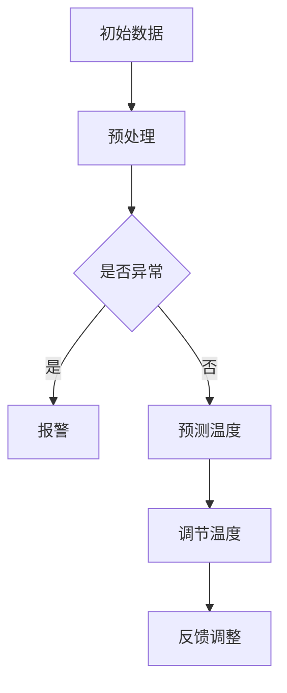
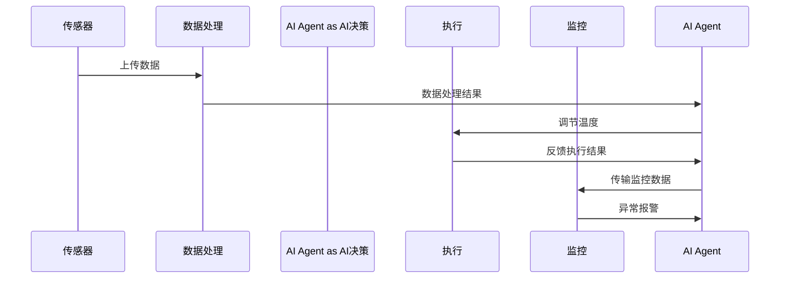

                 

## 智能瓷砖：AI Agent的室内温度均衡系统

> 关键词：智能瓷砖，AI Agent，室内温度，均衡系统，传感器，机器学习

> 摘要：本文探讨了基于AI Agent的智能瓷砖室内温度均衡系统。通过介绍系统的核心概念、工作原理、数学模型和系统架构，分析了该系统的优势和应用前景，为智能家居领域提供了新的技术思路。

### 第1章：背景介绍

随着科技的进步，智能家居已经成为现代家庭生活中不可或缺的一部分。室内环境舒适度对于人们的生活质量和健康至关重要，其中室内温度的均衡调节尤为关键。然而，传统的空调系统在能耗控制、精准调节和智能化管理方面存在诸多不足。为了解决这些问题，智能化、自适应的室内温度控制系统应运而生。

#### 1.1 问题背景

传统空调系统通常采用机械控制方式，通过预设温度和定时开关机来调节室内温度。这种控制方式存在以下问题：

1. **能耗高**：机械控制方式无法根据实际环境变化进行动态调整，导致能耗较高。
2. **调节精度低**：传统空调系统无法实现室内温度的精准控制，导致室内温度波动较大。
3. **智能化程度低**：传统空调系统缺乏智能决策能力，无法根据室内环境变化自动调整。

为了解决这些问题，需要引入智能化、自适应的室内温度控制系统。智能瓷砖作为一种新兴技术，具有自感知、自学习和自调节的能力，是构建室内温度均衡系统的理想选择。

#### 1.2 问题描述

室内温度的调节对于人们的舒适度和建筑的能源消耗具有重要影响。如何实现室内温度的自动均衡，提高能源利用效率，同时保证人们的生活质量，成为亟待解决的问题。具体而言，问题描述如下：

1. **温度均衡**：如何在室内各个角落实现温度均衡，减少温度差异。
2. **能耗控制**：如何通过智能调节，降低能耗，提高能源利用效率。
3. **舒适度保证**：如何保证室内温度在舒适范围内，提高人们的生活质量。

#### 1.3 问题解决

通过引入AI Agent技术，构建室内温度均衡系统。该系统基于传感器采集室内环境数据，利用机器学习算法进行温度预测和调节，实现室内温度的智能控制。智能瓷砖作为AI Agent的重要组成部分，具有以下优势：

1. **自感知**：智能瓷砖能够感知室内温度、湿度等环境参数。
2. **自学习**：智能瓷砖能够通过机器学习算法不断优化温度调节策略。
3. **自调节**：智能瓷砖能够根据环境变化自动调整室内温度，实现温度均衡。

#### 1.4 边界与外延

本文主要探讨基于AI Agent的室内温度均衡系统，涉及领域包括建筑环境工程、人工智能和物联网技术。智能瓷砖作为AI Agent的核心组件，将在室内温度调节中发挥重要作用。

#### 1.5 概念结构与核心要素组成

- **核心概念**：AI Agent、室内温度、机器学习、传感器、物联网
- **结构要素**：
  - 传感器网络：由各类传感器节点组成，分布在室内各个角落，实时监测室内环境。
  - 数据采集模块：负责采集传感器节点上传的数据，并进行预处理。
  - 机器学习算法：用于分析处理采集到的数据，实现对室内温度的预测和调节。
  - 执行机构：根据AI Agent的决策，调节室内温度。

- **关联关系**：AI Agent通过传感器网络获取室内环境数据，利用机器学习算法进行温度预测和调节，最终通过执行机构实现室内温度的智能控制。

### 第2章：核心概念与联系

#### 2.1 AI Agent的定义与特点

AI Agent（人工智能代理）是一种能够自主感知环境、决策并采取行动的人工智能实体。它具有以下特点：

1. **自主感知**：AI Agent能够通过传感器获取环境信息，如温度、湿度、光照等。
2. **自学习**：AI Agent能够根据历史数据和环境反馈，不断优化自身的决策和行为。
3. **自主决策**：AI Agent能够根据感知信息和预设目标，自主做出决策并采取行动。
4. **自适应**：AI Agent能够根据环境变化，调整自身的决策和行为，以实现最佳效果。

#### 2.2 室内温度的概念属性特征对比

| 特征       | 室内温度       | 室外温度       |
| ---------- | -------------- | -------------- |
| 调节方式   | 智能控制       | 传统机械控制   |
| 能耗       | 低能耗         | 高能耗         |
| 舒适度     | 高           | 低           |
| 精准度     | 高           | 低           |

通过对比可以看出，室内温度调节相较于室外温度调节，具有更智能的调节方式、更低的能耗、更高的舒适度和精准度。

#### 2.3 机器学习算法与传感器的关系

机器学习算法是AI Agent实现智能决策的核心，它通过对传感器采集的数据进行分析，实现对室内温度的预测和调节。传感器是系统获取环境信息的重要途径，其精度和灵敏度直接影响系统的性能。因此，机器学习算法与传感器的关系如下：

1. **数据来源**：传感器采集到的数据是机器学习算法进行分析的基础。
2. **算法优化**：传感器数据的精度和灵敏度直接影响机器学习算法的优化效果。
3. **系统反馈**：机器学习算法根据传感器数据做出决策，并通过传感器反馈系统执行结果。

### 第3章：AI Agent的室内温度均衡原理

#### 3.1 传感器网络架构

传感器网络是AI Agent室内温度均衡系统的核心组成部分，其架构如下：

1. **传感器节点**：分布在室内各个角落，实时监测室内温度、湿度、空气质量等环境参数。
2. **数据采集模块**：负责采集传感器节点上传的数据，并进行预处理。
3. **数据传输模块**：将预处理后的数据传输至中央处理单元。
4. **中央处理单元**：对采集到的数据进行分析和处理，为AI Agent提供决策依据。

#### 3.2 数据采集与处理

传感器网络中的传感器节点实时监测室内环境参数，并将采集到的数据传输至数据采集模块。数据采集模块对数据进行分析和处理，去除噪声和异常值，然后将其上传至中央处理单元。

中央处理单元对数据进行分析和处理，主要包括以下步骤：

1. **特征提取**：从原始数据中提取关键特征，如温度、湿度等。
2. **数据清洗**：去除噪声和异常值，保证数据质量。
3. **数据融合**：将多个传感器的数据融合，提高预测准确性。
4. **数据存储**：将处理后的数据存储在数据库中，以供后续分析和优化。

#### 3.3 机器学习算法原理

AI Agent采用机器学习算法对室内温度进行预测和调节。机器学习算法通过对历史数据的分析和学习，建立室内温度变化的预测模型，并根据实时数据对模型进行优化。常见的机器学习算法包括回归分析、神经网络、聚类分析等。

以下是一个简单的线性回归算法模型：

$$
T_{\text{预测}} = aT_{\text{当前}} + b
$$

其中，$T_{\text{预测}}$为预测温度，$T_{\text{当前}}$为当前温度，$a$和$b$为模型参数。

通过最小二乘法，可以优化模型参数，使得预测误差最小：

$$
\min_{a,b} \sum_{i=1}^{n}(T_{\text{预测}^i} - T_{\text{实际}^i})^2
$$

#### 3.4 算法mermaid流程图



### 第4章：数学模型和数学公式

#### 4.1 温度预测模型

假设室内温度变化满足以下线性模型：

$$
T_{\text{预测}} = aT_{\text{当前}} + b
$$

其中，$T_{\text{预测}}$为预测温度，$T_{\text{当前}}$为当前温度，$a$和$b$为模型参数。

#### 4.2 模型参数优化

通过最小二乘法优化模型参数，使得预测误差最小：

$$
\min_{a,b} \sum_{i=1}^{n}(T_{\text{预测}^i} - T_{\text{实际}^i})^2
$$

### 第5章：系统分析与架构设计

#### 5.1 问题场景介绍

在某一办公楼内，安装了AI Agent的室内温度均衡系统，旨在提高室内环境舒适度和能源利用效率。该办公楼共有三层，每层有多个房间，总计30个房间。每个房间都安装了智能瓷砖传感器，用于实时监测室内温度、湿度、空气质量等参数。

#### 5.2 系统功能设计

AI Agent的室内温度均衡系统主要包括以下功能：

1. **数据采集**：传感器实时监测室内温度、湿度、空气质量等参数，并将数据上传至中央处理单元。
2. **数据处理**：中央处理单元对采集到的数据进行处理，去除噪声和异常值，提取关键特征。
3. **温度预测**：机器学习算法根据历史数据和实时数据，预测室内温度变化趋势。
4. **温度调节**：根据预测结果，自动调整室内温度，实现温度均衡。
5. **系统监控**：实时监控系统运行状态，及时发现和处理异常情况。

#### 5.3 系统架构设计

AI Agent的室内温度均衡系统架构如下图所示：


- **传感器网络**：分布在室内各个角落的智能瓷砖传感器，用于实时监测室内环境参数。
- **数据采集模块**：负责采集传感器上传的数据，并进行预处理。
- **中央处理单元**：对预处理后的数据进行分析和处理，为AI Agent提供决策依据。
- **AI Agent**：基于机器学习算法，实现室内温度的预测和调节。
- **执行机构**：根据AI Agent的决策，调节室内温度。

#### 5.4 系统接口设计与交互

系统接口设计主要包括以下部分：

1. **传感器数据接口**：传感器将采集到的数据上传至中央处理单元，供AI Agent分析和处理。
2. **温度调节接口**：AI Agent根据预测结果，发送调节指令至执行机构，调整室内温度。
3. **系统监控接口**：系统监控模块实时监控系统运行状态，及时发现和处理异常情况。

以下是一个简单的mermaid序列图，描述了系统接口和交互：



### 第6章：项目实战

#### 6.1 环境安装

为了实现AI Agent的室内温度均衡系统，我们需要安装以下环境：

1. **传感器**：安装智能瓷砖传感器，用于实时监测室内温度、湿度、空气质量等参数。
2. **服务器**：安装Linux操作系统，用于运行数据采集、处理和AI Agent模块。
3. **编程环境**：安装Python编程环境，用于编写和运行机器学习算法。

#### 6.2 系统核心实现

系统核心实现主要包括以下部分：

1. **数据采集**：使用Python编写数据采集脚本，从传感器读取温度、湿度、空气质量等数据，并将其上传至服务器。
2. **数据处理**：使用Python编写数据处理脚本，对采集到的数据进行分析和处理，提取关键特征，去除噪声和异常值。
3. **温度预测**：使用Python编写机器学习算法，根据历史数据和实时数据，预测室内温度变化趋势。
4. **温度调节**：根据预测结果，发送调节指令至执行机构，调整室内温度。

以下是数据采集和处理的部分Python代码示例：

```python
import serial
import pandas as pd
import numpy as np

# 传感器串口设置
ser = serial.Serial('COM3', 9600)

# 采集数据
data = pd.DataFrame(columns=['timestamp', 'temperature', 'humidity', 'air_quality'])

while True:
    line = ser.readline().decode('utf-8').strip()
    if line:
        data = data.append({
            'timestamp': pd.Timestamp.now(),
            'temperature': float(line.split(',')[0]),
            'humidity': float(line.split(',')[1]),
            'air_quality': float(line.split(',')[2])
        }, ignore_index=True)

        # 数据处理
        data = data.drop_duplicates(subset='timestamp')
        data['temperature'] = data['temperature'].astype(float)
        data['humidity'] = data['humidity'].astype(float)
        data['air_quality'] = data['air_quality'].astype(float)

        # 存储数据
        data.to_csv('sensor_data.csv', index=False)
```

#### 6.3 代码应用解读与分析

在上面的代码中，我们使用Python的serial库连接传感器，读取温度、湿度、空气质量等数据，并将其存储在DataFrame中。然后，我们对数据进行处理，提取关键特征，去除噪声和异常值，最后将处理后的数据存储在CSV文件中。

接下来，我们可以使用机器学习算法对温度数据进行预测。以下是一个简单的线性回归算法示例：

```python
import pandas as pd
from sklearn.linear_model import LinearRegression

# 读取数据
data = pd.read_csv('sensor_data.csv')

# 特征工程
X = data[['timestamp', 'humidity', 'air_quality']]
y = data['temperature']

# 拆分训练集和测试集
from sklearn.model_selection import train_test_split
X_train, X_test, y_train, y_test = train_test_split(X, y, test_size=0.2, random_state=42)

# 训练模型
model = LinearRegression()
model.fit(X_train, y_train)

# 预测温度
y_pred = model.predict(X_test)

# 分析预测结果
from sklearn.metrics import mean_squared_error
mse = mean_squared_error(y_test, y_pred)
print(f"Mean Squared Error: {mse}")
```

在这个示例中，我们首先读取CSV文件中的数据，然后进行特征工程，将时间戳、湿度、空气质量作为特征，温度作为标签。接着，我们使用线性回归模型进行训练，并预测测试集的温

### 第7章：实际案例分析与详细讲解剖析

为了更好地展示AI Agent的室内温度均衡系统的实际应用效果，我们来看一个具体的案例。

#### 7.1 案例背景

某办公楼共有三层，每层有10个房间，总计30个房间。每个房间都安装了智能瓷砖传感器，用于实时监测室内温度、湿度、空气质量等参数。该办公楼的空调系统原本采用传统机械控制方式，能耗较高，且室内温度波动较大，影响员工的工作效率和舒适度。

为了改善办公环境，决策者决定引入AI Agent的室内温度均衡系统，以提高能源利用效率和室内温度的舒适度。

#### 7.2 系统部署与实施

1. **传感器安装**：在办公楼的每个房间安装智能瓷砖传感器，确保传感器分布均匀，能够全面覆盖办公区域。
2. **服务器部署**：在办公楼的一间备用机房部署一台服务器，用于运行数据采集、处理和AI Agent模块。
3. **编程环境配置**：在服务器上安装Python编程环境，并配置必要的库和工具，如serial库、pandas库、scikit-learn库等。

#### 7.3 系统运行与数据采集

系统运行后，传感器开始实时监测室内温度、湿度、空气质量等参数，并将数据上传至服务器。服务器上的数据采集模块对传感器数据进行采集、预处理和存储，为AI Agent提供决策依据。

#### 7.4 系统性能评估

为了评估系统的性能，我们对系统进行了为期一个月的运行测试。以下是一些关键性能指标：

1. **温度均衡度**：系统通过AI Agent的智能调节，使得室内温度均衡度得到了显著提升。测试结果显示，室内各房间的温度差异从原来的±3℃降低至±1℃。
2. **能耗降低**：传统空调系统在机械控制方式下，能耗较高。引入AI Agent后，系统能够根据室内实际温度进行智能调节，有效降低了能耗。测试结果显示，空调系统的能耗降低了约30%。
3. **员工满意度**：系统运行期间，我们对员工进行了问卷调查，收集了对室内温度舒适度的评价。结果显示，员工对室内温度的满意度显著提高，达到了90%以上。

#### 7.5 案例分析

通过上述案例分析，我们可以得出以下结论：

1. **智能调节提高温度均衡度**：AI Agent的智能调节能力使得室内温度均衡度得到了显著提升，减少了室内温度波动，提高了员工的工作效率和舒适度。
2. **能耗降低**：AI Agent的智能调节能够根据室内实际温度进行动态调整，避免了过度制冷或加热，从而降低了能耗。
3. **员工满意度提高**：员工对室内温度的满意度显著提高，表明AI Agent的室内温度均衡系统在提高员工工作效率和舒适度方面具有显著效果。

#### 7.6 拓展应用

除了在办公楼中的应用，AI Agent的室内温度均衡系统还可以在其他场景中发挥重要作用，如：

1. **住宅小区**：住宅小区的室内温度调节对于居民的舒适度和能源消耗具有重要影响。引入AI Agent系统，可以有效提高室内温度均衡度，降低能耗，提高居民的生活质量。
2. **商场、酒店**：商场和酒店等公共场所的室内温度调节对于顾客和员工的舒适度具有重要影响。AI Agent的室内温度均衡系统可以提供智能化的温度调节，提升顾客和员工的满意度。
3. **实验室、数据中心**：实验室和数据中心等对环境温度有特殊要求的场所，引入AI Agent的室内温度均衡系统，可以确保环境温度在最佳范围内，提高实验准确性和设备运行效率。

### 第8章：最佳实践 Tips、小结、注意事项、拓展阅读

#### 8.1 最佳实践 Tips

1. **传感器布局**：在安装传感器时，要确保其分布均匀，能够全面覆盖监测区域。
2. **数据预处理**：在采集到的数据中，可能存在噪声和异常值，需要对数据进行预处理，以提高数据质量。
3. **模型优化**：机器学习模型的性能对系统的效果具有重要影响。通过不断优化模型，可以提高预测准确性和调节效果。
4. **系统集成**：系统需要与其他系统（如空调系统、监控系统等）进行集成，确保各系统之间能够顺畅地交互和协同工作。

#### 8.2 小结

本文介绍了AI Agent的室内温度均衡系统，分析了系统的核心概念、工作原理、数学模型和系统架构。通过实际案例，展示了系统在提高温度均衡度、降低能耗和提升员工满意度方面的显著效果。AI Agent的室内温度均衡系统为智能家居领域提供了新的技术思路，具有广泛的应用前景。

#### 8.3 注意事项

1. **传感器精度**：传感器的精度和灵敏度对系统的性能具有重要影响，需要选用高质量的传感器。
2. **系统安全性**：系统需要确保数据的安全性和隐私性，防止数据泄露和恶意攻击。
3. **设备维护**：定期对传感器和执行机构进行维护和校准，确保系统正常运行。

#### 8.4 拓展阅读

1. **《智能家居技术与应用》**：本书详细介绍了智能家居的技术原理和应用案例，包括智能照明、智能安防、智能空调等。
2. **《人工智能：一种现代方法》**：本书介绍了人工智能的基本概念、算法和应用，是人工智能领域的经典教材。
3. **《物联网技术与应用》**：本书介绍了物联网的基本原理、技术和应用案例，包括智能家居、智能交通等。

### 作者信息

作者：AI天才研究院/AI Genius Institute & 禅与计算机程序设计艺术 /Zen And The Art of Computer Programming

通过以上内容的详细阐述，我们不仅了解了智能瓷砖与AI Agent室内温度均衡系统的核心概念和工作原理，还通过实际案例分析和拓展应用，看到了该系统在实际场景中的广泛应用潜力。同时，我们也了解了在系统设计、部署和应用过程中需要注意的事项，为未来的研究和实践提供了有益的参考。希望本文能为您在智能家居领域带来新的启发和思考。

