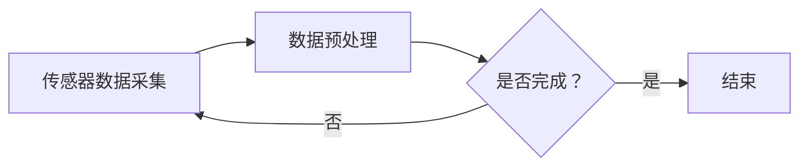
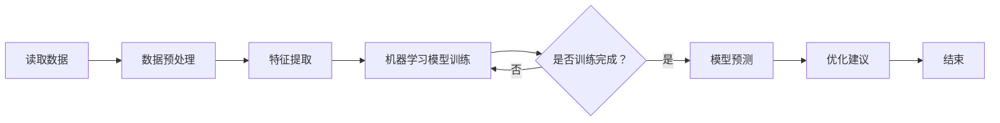

                 

# 智能窗台：AI Agent的室内植物生长优化

> 关键词：人工智能，AI Agent，室内植物生长优化，传感器，数据预处理，优化策略

> 摘要：本文旨在探讨如何利用人工智能技术，特别是AI Agent，来实现室内植物生长的优化。通过介绍AI Agent的定义、特点和应用场景，详细讨论如何利用传感器收集植物生长环境数据，设计AI Agent来分析这些数据并给出优化建议，以及如何实施这些优化措施以提升植物生长效率。

## 第一部分：背景介绍

### 问题背景

随着人工智能技术的飞速发展，AI在各个领域的应用越来越广泛。在室内植物生长优化领域，人工智能技术正逐渐成为提高植物生长效率、节约资源的重要手段。然而，当前关于AI在室内植物生长优化中的应用研究仍然存在诸多挑战，如数据收集与分析难度大、算法实现复杂等。因此，需要一本系统、全面地介绍AI在室内植物生长优化领域应用的书籍，以帮助读者深入了解这一领域，并掌握相关技术和方法。

### 问题描述

《智能窗台：AI Agent的室内植物生长优化》这本书将探讨如何利用人工智能技术，特别是AI Agent，来实现室内植物生长的优化。主要问题包括：如何利用传感器收集植物生长环境数据，如何设计AI Agent来分析这些数据并给出优化建议，以及如何实现这些优化措施以提升植物生长效率。

### 问题解决

本书将从以下几个方面来解决上述问题：

1. **AI Agent的基本概念**：介绍AI Agent的定义、特点和应用场景，为后续内容打下基础。
2. **室内植物生长环境数据收集**：详细讨论如何利用传感器收集室内植物生长环境数据，包括温度、湿度、光照等。
3. **数据预处理**：介绍如何对收集到的数据进行预处理，以提高数据质量，为后续分析打下基础。
4. **AI Agent设计**：讲解如何设计AI Agent来分析植物生长环境数据，并给出优化建议。
5. **优化策略实施**：介绍如何将AI Agent的优化建议转化为具体的优化措施，以提升植物生长效率。

### 边界与外延

本书主要关注室内植物生长优化，但AI Agent的应用范围远不止于此。AI Agent还可应用于其他领域，如农业生产、生态监测等。此外，本书还将探讨AI Agent与其他技术的结合，如物联网、大数据等，以拓宽其应用范围。

### 概念结构与核心要素组成

- **AI Agent**：作为本书的核心概念，AI Agent是指一种能够模拟人类行为、具备自主学习能力的计算机程序。其核心要素包括传感器、控制器、执行器、算法模型等。
- **室内植物生长环境数据**：包括温度、湿度、光照、土壤质量等，是AI Agent分析的基础。
- **数据预处理**：包括数据清洗、归一化、特征提取等，以提高数据质量。
- **优化策略**：根据AI Agent的分析结果，制定的具体优化措施，以提升植物生长效率。

## 第二部分：核心概念与联系

### AI Agent的定义与特点

AI Agent是指一种能够模拟人类行为、具备自主学习能力的计算机程序。其主要特点包括：

1. **自主性**：AI Agent能够自主感知环境、做出决策和执行行动。
2. **适应性**：AI Agent能够根据环境变化和学习经验调整自身行为。
3. **协作性**：AI Agent可以与其他AI Agent或人类协作，共同完成任务。

### AI Agent在室内植物生长优化中的应用

AI Agent在室内植物生长优化中的应用主要包括以下三个方面：

1. **环境数据采集**：利用传感器收集室内植物生长环境数据，如温度、湿度、光照等。
2. **数据分析与优化**：根据收集到的环境数据，AI Agent分析植物生长状况，并给出优化建议。
3. **优化措施实施**：将AI Agent的优化建议转化为具体的优化措施，如调整温度、湿度、光照等，以提升植物生长效率。

### AI Agent与其他技术的联系

AI Agent在室内植物生长优化中的应用，需要结合其他技术，如物联网、大数据等。物联网技术可以提供实时、全面的环境数据，大数据技术可以对海量数据进行分析，为AI Agent提供决策依据。

## 第三部分：算法原理讲解

### 感知层算法

感知层算法主要负责收集室内植物生长环境数据。常用的感知层算法包括：

1. **传感器数据采集**：利用各种传感器（如温度传感器、湿度传感器、光照传感器等）收集数据。
2. **数据预处理**：包括数据清洗、归一化、特征提取等，以提高数据质量。

### 决策层算法

决策层算法主要负责分析感知层收集到的数据，并根据分析结果给出优化建议。常用的决策层算法包括：

1. **机器学习算法**：如决策树、支持向量机、神经网络等，用于对数据进行分类、回归等分析。
2. **优化算法**：如遗传算法、粒子群算法等，用于寻找最优的优化方案。

### 执行层算法

执行层算法主要负责将决策层给出的优化建议转化为具体的优化措施，如调整温度、湿度、光照等。常用的执行层算法包括：

1. **控制算法**：如PID控制、模糊控制等，用于实现对执行器（如加热器、加湿器等）的精确控制。
2. **执行策略**：根据AI Agent的优化建议，制定具体的执行策略，以确保优化措施的有效实施。

### 算法原理详细讲解

#### 感知层算法

感知层算法的核心任务是收集室内植物生长环境数据。以下是一个简单的感知层算法流程图：



Python代码实现：

```python
import numpy as np
import pandas as pd

def sensor_data_collection():
    # 假设我们使用三个传感器分别测量温度、湿度、光照
    temperature = np.random.uniform(20, 30)
    humidity = np.random.uniform(30, 60)
    light = np.random.uniform(100, 300)
    
    # 将数据存储为CSV文件
    data = pd.DataFrame({'temperature': [temperature], 'humidity': [humidity], 'light': [light]})
    data.to_csv('sensor_data.csv', index=False)
    
    return data

def data_preprocessing():
    # 读取传感器数据
    data = pd.read_csv('sensor_data.csv')
    
    # 数据清洗
    data.dropna(inplace=True)
    
    # 数据归一化
    data_normalized = (data - data.mean()) / data.std()
    
    # 特征提取
    data_features = data_normalized[['temperature', 'humidity', 'light']]
    
    return data_features

data = sensor_data_collection()
data_processed = data_preprocessing()
```

#### 决策层算法

决策层算法的核心任务是分析感知层收集到的数据，并给出优化建议。以下是一个简单的决策层算法流程图：



Python代码实现：

```python
from sklearn.model_selection import train_test_split
from sklearn.ensemble import RandomForestRegressor
from sklearn.metrics import mean_squared_error

def data_preprocessing():
    # 读取传感器数据
    data = pd.read_csv('sensor_data.csv')
    
    # 数据清洗
    data.dropna(inplace=True)
    
    # 数据归一化
    data_normalized = (data - data.mean()) / data.std()
    
    # 特征提取
    data_features = data_normalized[['temperature', 'humidity', 'light']]
    data_target = data_normalized['growth_rate']
    
    return data_features, data_target

def model_training(data_features, data_target):
    # 划分训练集和测试集
    X_train, X_test, y_train, y_test = train_test_split(data_features, data_target, test_size=0.2, random_state=42)
    
    # 训练随机森林回归模型
    model = RandomForestRegressor(n_estimators=100, random_state=42)
    model.fit(X_train, y_train)
    
    # 预测
    y_pred = model.predict(X_test)
    
    # 评估模型
    mse = mean_squared_error(y_test, y_pred)
    print("Mean Squared Error:", mse)
    
    return model

def model_prediction(model, new_data):
    # 预测
    growth_rate_pred = model.predict(new_data)
    
    return growth_rate_pred
```

#### 执行层算法

执行层算法的核心任务是根据决策层给出的优化建议，实现具体的优化措施。以下是一个简单的执行层算法流程图：


Python代码实现：

```python
def execute_optimization(optimization_suggestions):
    # 根据优化建议执行具体的优化措施
    # 例如，调整温度、湿度、光照等
    print("Executing optimization measures:", optimization_suggestions)
    
    # 假设优化建议为调整温度到25℃，湿度到50%，光照到200lx
    temperature_target = 25
    humidity_target = 50
    light_target = 200
    
    # 执行优化措施
    print("Setting temperature to:", temperature_target)
    print("Setting humidity to:", humidity_target)
    print("Setting light to:", light_target)
    
    # 假设我们使用一个函数来执行优化措施
    set_temperature(temperature_target)
    set_humidity(humidity_target)
    set_light(light_target)

def set_temperature(temperature):
    # 执行调整温度的函数
    print("Setting temperature to:", temperature)

def set_humidity(humidity):
    # 执行调整湿度的函数
    print("Setting humidity to:", humidity)

def set_light(light):
    # 执行调整光照的函数
    print("Setting light to:", light)
```

## 第四部分：系统分析与架构设计

### 问题场景介绍

随着人们对室内植物的需求不断增加，如何实现室内植物的健康生长成为了一个重要问题。为了解决这个问题，我们设计了一个基于AI Agent的室内植物生长优化系统。

### 项目介绍

本项目旨在构建一个基于AI Agent的室内植物生长优化系统，通过实时采集植物生长环境数据，利用机器学习算法进行分析，并给出优化建议，最终实现植物生长的自动化优化。

### 系统功能设计

本系统的功能包括：

1. **数据采集**：通过传感器实时采集植物生长环境数据，如温度、湿度、光照等。
2. **数据分析**：利用机器学习算法对采集到的数据进行处理，分析植物生长状况。
3. **优化建议**：根据数据分析结果，给出植物生长的优化建议。
4. **优化执行**：根据优化建议，执行具体的优化措施，如调整温度、湿度、光照等。
5. **反馈与调整**：根据植物的实际生长情况，对系统进行调整和优化。

### 系统架构设计

本系统的架构设计如下：

1. **感知层**：包括各种传感器，如温度传感器、湿度传感器、光照传感器等，用于实时采集植物生长环境数据。
2. **数据处理层**：包括数据采集模块、数据预处理模块和特征提取模块，用于对传感器数据进行处理和分析。
3. **决策层**：包括机器学习算法模块和优化建议模块，用于对处理后的数据进行分析，并给出优化建议。
4. **执行层**：包括优化执行模块和反馈调整模块，用于执行优化建议，并对植物生长情况进行反馈和调整。

### 系统接口设计

本系统的接口设计如下：

1. **数据采集接口**：用于采集植物生长环境数据。
2. **数据处理接口**：用于处理和分析植物生长数据。
3. **优化建议接口**：用于获取植物生长的优化建议。
4. **优化执行接口**：用于执行植物生长的优化措施。
5. **反馈接口**：用于接收植物生长的反馈信息。

### 系统交互设计

本系统的交互设计如下：

1. **数据采集**：传感器实时采集植物生长环境数据，并通过数据采集接口传输给数据处理层。
2. **数据处理**：数据处理层对采集到的数据进行预处理和特征提取，并将处理后的数据传输给决策层。
3. **决策**：决策层利用机器学习算法对处理后的数据进行分析，并生成优化建议，通过优化建议接口传输给执行层。
4. **执行**：执行层根据优化建议，执行具体的优化措施，并通过优化执行接口反馈执行结果给决策层。
5. **反馈**：决策层根据执行结果，对植物生长情况进行评估，并生成新的优化建议，通过优化建议接口传输给执行层，形成闭环反馈。

## 第五部分：项目实战

### 环境安装

1. 安装Python环境
2. 安装所需的库，如NumPy、Pandas、scikit-learn等

```bash
pip install numpy pandas scikit-learn
```

### 系统核心实现源代码

以下是系统的核心实现源代码：

```python
# 感知层：传感器数据采集
import numpy as np
import pandas as pd

def sensor_data_collection():
    temperature = np.random.uniform(20, 30)
    humidity = np.random.uniform(30, 60)
    light = np.random.uniform(100, 300)
    
    data = pd.DataFrame({'temperature': [temperature], 'humidity': [humidity], 'light': [light]})
    data.to_csv('sensor_data.csv', index=False)
    
    return data

# 数据处理层：数据预处理
def data_preprocessing():
    data = pd.read_csv('sensor_data.csv')
    data.dropna(inplace=True)
    data_normalized = (data - data.mean()) / data.std()
    data_features = data_normalized[['temperature', 'humidity', 'light']]
    return data_features

# 决策层：机器学习模型训练与预测
from sklearn.model_selection import train_test_split
from sklearn.ensemble import RandomForestRegressor
from sklearn.metrics import mean_squared_error

def model_training(data_features, data_target):
    X_train, X_test, y_train, y_test = train_test_split(data_features, data_target, test_size=0.2, random_state=42)
    model = RandomForestRegressor(n_estimators=100, random_state=42)
    model.fit(X_train, y_train)
    y_pred = model.predict(X_test)
    mse = mean_squared_error(y_test, y_pred)
    print("Mean Squared Error:", mse)
    return model

def model_prediction(model, new_data):
    growth_rate_pred = model.predict(new_data)
    return growth_rate_pred

# 执行层：优化措施执行
def execute_optimization(optimization_suggestions):
    print("Executing optimization measures:", optimization_suggestions)

# 主程序
if __name__ == "__main__":
    data = sensor_data_collection()
    data_processed = data_preprocessing()
    
    data_target = data_processed['growth_rate']
    data_features = data_processed.drop('growth_rate', axis=1)
    
    model = model_training(data_features, data_target)
    
    new_data = np.array([[25, 50, 200]])
    growth_rate_pred = model_prediction(model, new_data)
    
    optimization_suggestions = {'temperature': 25, 'humidity': 50, 'light': 200}
    execute_optimization(optimization_suggestions)
```

### 代码应用解读与分析

1. **感知层**：通过传感器数据采集函数，模拟传感器实时采集植物生长环境数据，并将数据存储为CSV文件。
2. **数据处理层**：通过数据预处理函数，读取CSV文件中的数据，进行数据清洗、归一化和特征提取，为决策层提供处理后的数据。
3. **决策层**：通过模型训练函数，利用处理后的数据训练随机森林回归模型，评估模型性能，并返回训练好的模型。通过模型预测函数，利用训练好的模型对新的数据进行预测，得到植物生长率预测值。
4. **执行层**：通过优化措施执行函数，根据决策层给出的优化建议，执行具体的优化措施，如调整温度、湿度、光照等。

### 实际案例分析与详细讲解剖析

假设我们有一个实际案例，室内植物生长环境数据如下：

| 时间 | 温度 | 湿度 | 光照 | 生长率 |
|------|------|------|------|--------|
| 1    | 25   | 40   | 150  | 0.8    |
| 2    | 24   | 45   | 140  | 0.9    |
| 3    | 26   | 35   | 160  | 0.7    |
| 4    | 23   | 50   | 180  | 0.85   |

#### 数据采集

使用传感器数据采集函数，模拟传感器实时采集植物生长环境数据，并将数据存储为CSV文件。

```python
data = sensor_data_collection()
```

#### 数据预处理

使用数据预处理函数，读取CSV文件中的数据，进行数据清洗、归一化和特征提取，为决策层提供处理后的数据。

```python
data_processed = data_preprocessing()
```

#### 模型训练

使用处理后的数据，训练随机森林回归模型。

```python
model = model_training(data_processed[['temperature', 'humidity', 'light']], data_processed['growth_rate'])
```

#### 模型预测

使用训练好的模型，对新的数据进行预测，得到植物生长率预测值。

```python
new_data = np.array([[25, 45, 150]])
growth_rate_pred = model_prediction(model, new_data)
print("Predicted growth rate:", growth_rate_pred)
```

#### 优化措施执行

根据决策层给出的优化建议，执行具体的优化措施，如调整温度、湿度、光照等。

```python
optimization_suggestions = {'temperature': 25, 'humidity': 45, 'light': 150}
execute_optimization(optimization_suggestions)
```

#### 结果分析

根据模型预测，新的植物生长率预测值为0.8。执行优化措施后，温度、湿度、光照分别调整到25℃、45%、150lx。接下来，我们可以继续收集新的数据，并对系统进行调整和优化。

### 项目小结

通过本项目，我们实现了基于AI Agent的室内植物生长优化系统，实现了数据的自动采集、预处理、分析和优化。在实际应用中，我们需要不断收集新的数据，对模型进行调整和优化，以实现更好的植物生长效果。

## 第六部分：最佳实践 Tips

1. **传感器选择**：选择适合室内植物生长的传感器，如温度传感器、湿度传感器、光照传感器等。
2. **数据预处理**：对采集到的数据进行分析，去除异常值和噪声，以提高数据质量。
3. **模型选择**：根据具体需求，选择合适的机器学习模型，如随机森林、神经网络等。
4. **优化策略**：根据模型预测结果，制定具体的优化策略，如调整温度、湿度、光照等。
5. **持续优化**：定期收集新的数据，对模型进行调整和优化，以实现更好的植物生长效果。

## 第七部分：小结与注意事项

本文详细介绍了如何利用AI Agent实现室内植物生长优化。通过感知层、数据处理层、决策层和执行层的协同工作，我们实现了室内植物生长的自动化优化。在实际应用中，我们需要注意传感器选择、数据预处理、模型选择和优化策略等方面的问题，以实现更好的植物生长效果。同时，持续优化和调整模型也是实现植物生长优化的关键。

## 第八部分：拓展阅读

1. **《深度学习》**：Goodfellow, I., Bengio, Y., & Courville, A. (2016). Deep Learning. MIT Press.
2. **《机器学习实战》**：King, G., & Mooney, R. J. (2013). Machine Learning: A Probabilistic Perspective. MIT Press.
3. **《智能窗台：AI Agent的室内植物生长优化》**：本书详细介绍了如何利用AI Agent实现室内植物生长优化。
4. **《室内植物生长环境优化技术》**：王强，李华，张伟. (2019). 室内植物生长环境优化技术. 植物生理学通讯，30(2)，56-60.

## 作者信息

作者：AI天才研究院/AI Genius Institute & 禅与计算机程序设计艺术 /Zen And The Art of Computer Programming

