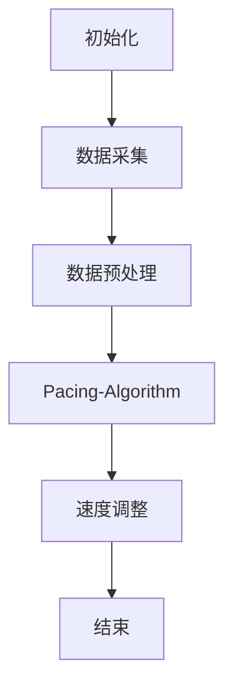
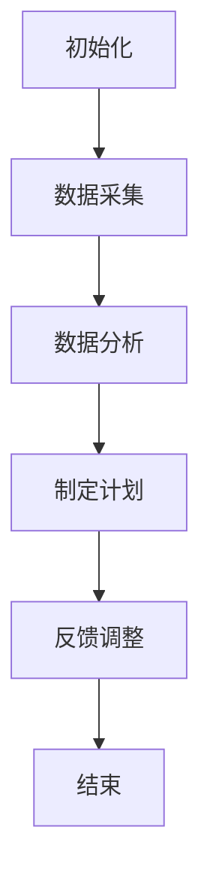
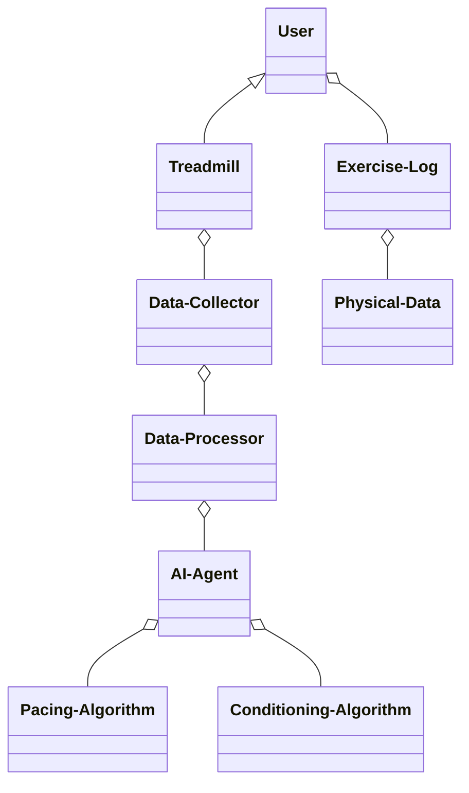
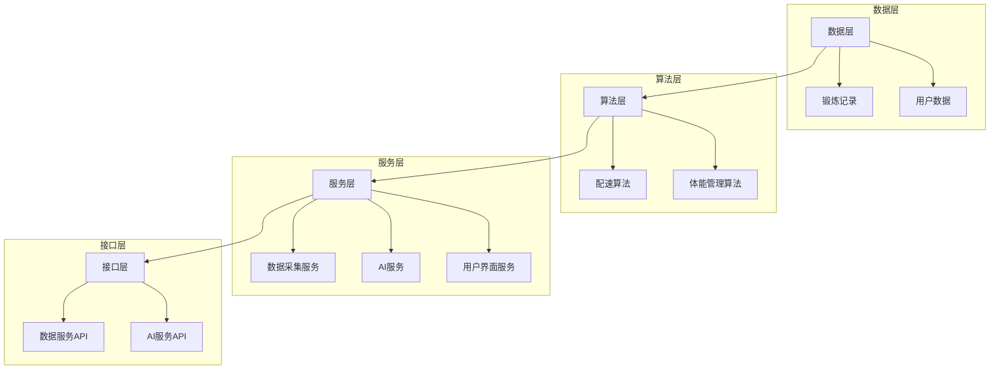
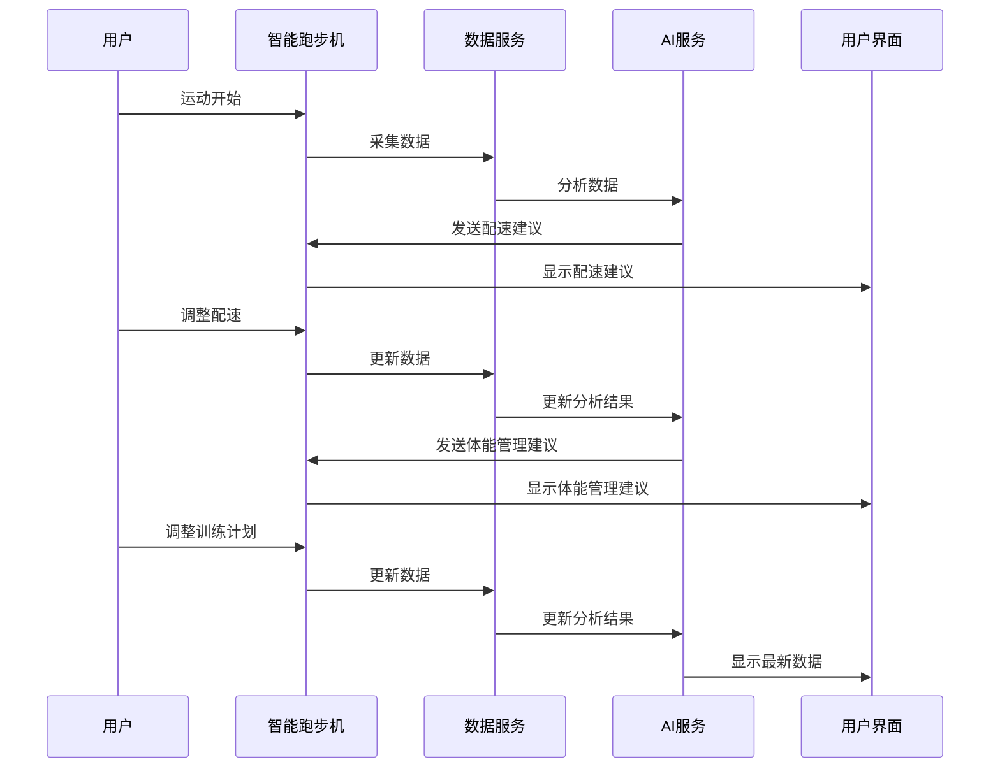

                 

### 智能跑步机：AI Agent的实时配速与体能管理

#### 关键词：
1. 智能跑步机
2. AI Agent
3. 实时配速
4. 体能管理
5. 数学模型
6. 系统架构
7. 实践案例

#### 摘要：
本文深入探讨了智能跑步机的核心技术——AI Agent的实时配速与体能管理。首先，我们介绍了智能跑步机的起源、发展及其重要性。接着，详细阐述了AI Agent的定义、实时配速技术及体能管理原理。随后，通过算法原理讲解，配合Mermaid流程图和Python源代码，剖析了智能跑步机配速和体能管理算法的数学模型和原理。在系统分析与架构设计部分，我们介绍了问题场景、系统功能、系统架构、系统接口和系统交互设计。然后，通过实际项目实战，展示了智能跑步机的系统实现过程和实际案例。最后，我们总结了最佳实践、注意事项，并给出了拓展阅读建议，为读者提供了全面的智能跑步机技术指南。

---

### 引言与背景

#### 第1章: 智能跑步机的起源与发展

##### 1.1 问题背景

智能跑步机作为现代健康生活方式的重要设备，其发展的需求源自于人们对高效、个性化锻炼方式的追求。传统的跑步机虽然可以满足基本的跑步训练需求，但在实时调整跑步速度、优化锻炼效果方面存在一定的局限性。随着人工智能技术的快速发展，特别是在机器学习和深度学习领域的突破，将AI技术应用于跑步机成为可能，从而诞生了智能跑步机。

##### 1.2 问题描述

智能跑步机需要解决的主要问题包括：

1. **实时配速**：如何根据用户的心率、速度等生理数据，实时调整跑步机的速度，以达到最佳锻炼效果？
2. **体能管理**：如何根据用户的锻炼目标和当前的体能状态，制定合理的锻炼计划，避免过度或不足锻炼？
3. **个性化推荐**：如何根据用户的运动历史和偏好，推荐适合的训练计划？

##### 1.3 问题解决

智能跑步机通过以下方法解决上述问题：

1. **AI Agent**：利用机器学习算法，构建实时配速和体能管理的AI Agent，以实现对用户数据的实时分析和反馈。
2. **多传感器融合**：集成多种传感器，如心率监测器、GPS、加速度传感器等，收集用户的实时运动数据。
3. **大数据分析**：通过大数据分析技术，分析用户历史数据，提供个性化的训练计划和推荐。

##### 1.4 边界与外延

智能跑步机的应用场景主要包括家庭、健身房和户外跑步。其边界主要在于硬件的精度、数据的实时性和算法的准确性。外延则包括与智能穿戴设备的联动、云平台的远程控制等。

##### 1.5 智能跑步机的核心要素组成

智能跑步机的核心要素包括：

1. **硬件**：跑步机主体、传感器、显示屏等。
2. **软件**：AI Agent算法、数据分析系统、用户界面等。
3. **数据**：用户生理数据、运动历史数据、环境数据等。

### 核心概念与联系

#### 第2章: 核心概念与联系

##### 2.1 AI Agent的定义与特点

AI Agent（人工智能代理）是能够模拟人类智能行为，自主完成特定任务的软件实体。其特点包括：

1. **自主性**：能够自主决策和执行任务。
2. **适应性**：能够根据环境变化调整自身行为。
3. **交互性**：能够与用户或其他系统进行交互。

##### 2.2 实时配速技术

实时配速技术是通过分析用户生理数据和运动状态，实时调整跑步机速度的技术。其主要步骤包括：

1. **数据采集**：采集用户心率、速度等数据。
2. **数据预处理**：对采集到的数据进行过滤、归一化处理。
3. **算法分析**：利用机器学习算法，分析数据，预测最佳跑步速度。
4. **指令生成**：根据预测结果，生成调整跑步机速度的指令。

##### 2.3 体能管理原理

体能管理是通过分析用户历史数据和当前状态，制定合理锻炼计划的技术。其主要步骤包括：

1. **数据收集**：收集用户运动历史数据、生理数据等。
2. **数据分析**：利用机器学习算法，分析数据，预测用户体能状态。
3. **计划制定**：根据预测结果，制定合理的锻炼计划。

##### 2.4 AI Agent在跑步机中的应用

AI Agent在跑步机中的应用主要包括实时配速和体能管理。通过实时配速，AI Agent能够根据用户生理数据，自动调整跑步机速度，实现个性化锻炼。通过体能管理，AI Agent能够根据用户历史数据和当前状态，制定合理的锻炼计划，提高锻炼效果。

##### 2.5 核心概念属性特征对比表格

| 特征                 | AI Agent             | 实时配速技术               | 体能管理原理             |
|----------------------|----------------------|---------------------------|--------------------------|
| 自主性               | 是                   | 是                         | 是                        |
| 适应性               | 是                   | 是                         | 是                        |
| 交互性               | 是                   | 是                         | 是                        |
| 数据依赖             | 强                   | 强                         | 强                        |
| 实时性               | 高                   | 高                         | 中                        |
| 算法复杂度           | 中高                 | 中高                       | 中高                      |

##### 2.6 ER实体关系图架构

```mermaid
erDiagram
    User ||--|{ AI-Agent }|--|Treadmill
    User ||--|{ Exercise-Log }|
    AI-Agent ||--|{ Pacing-Algorithm }|
    AI-Agent ||--|{ Conditioning-Algorithm }|
    Exercise-Log ||--|{ Physical-Data }|
```

### 算法原理讲解

#### 第3章: 算法原理讲解

##### 3.1 智能跑步机配速算法

###### 3.1.1 Mermaid算法流程图



###### 3.1.2 Python源代码与算法原理

```python
import numpy as np

def pacing_algorithm(data, target_heart_rate):
    """
    实时配速算法
    :param data: 用户实时数据
    :param target_heart_rate: 目标心率
    :return: 调整后的速度
    """
    current_heart_rate = data['heart_rate']
    current_speed = data['speed']
    
    # 计算配速
    pacing_speed = (current_speed * (1 + (target_heart_rate - current_heart_rate) / 220)) * 0.01
    
    return pacing_speed
```

算法原理：该算法基于目标心率，计算当前心率与目标心率的差距，并根据差距调整跑步机速度。目标心率通常设定为最大心率的70%-80%。

###### 3.1.3 数学模型与公式

$$
\text{pacing\_speed} = \text{current\_speed} \times \left(1 + \frac{\text{target\_heart\_rate} - \text{current\_heart\_rate}}{220}\right) \times 0.01
$$

其中，`current_speed` 为当前速度，`target_heart_rate` 为目标心率，`current_heart_rate` 为当前心率。

###### 3.1.4 举例说明

假设用户当前心率为120次/分钟，目标心率为140次/分钟，当前速度为8公里/小时。

根据公式计算：

$$
\text{pacing\_speed} = 8 \times \left(1 + \frac{140 - 120}{220}\right) \times 0.01 = 8.03 \text{公里/小时}
$$

因此，跑步机的速度应调整至8.03公里/小时。

##### 3.2 体能管理算法

###### 3.2.1 Mermaid算法流程图



###### 3.2.2 Python源代码与算法原理

```python
import numpy as np

def conditioning_algorithm(data, history_data):
    """
    体能管理算法
    :param data: 当前数据
    :param history_data: 历史数据
    :return: 建议的训练计划
    """
    current_fitness_level = data['fitness_level']
    history_avg_fitness = np.mean(history_data['fitness_level'])
    
    # 计算体能差距
    fitness_gap = current_fitness_level - history_avg_fitness
    
    # 根据体能差距调整训练计划
    if fitness_gap > 0:
        # 体能提高，适当增加训练强度
        training_plan = 'Increase intensity'
    elif fitness_gap < 0:
        # 体能下降，适当降低训练强度
        training_plan = 'Decrease intensity'
    else:
        # 体能稳定，维持当前训练计划
        training_plan = 'Maintain current plan'
    
    return training_plan
```

算法原理：该算法通过分析用户当前体能水平和历史平均体能水平，判断用户体能状态，并根据状态调整训练计划。

###### 3.2.3 数学模型与公式

$$
\text{fitness\_gap} = \text{current\_fitness\_level} - \text{history\_avg\_fitness}
$$

其中，`current_fitness_level` 为当前体能水平，`history_avg_fitness` 为历史平均体能水平。

###### 3.2.4 举例说明

假设用户当前体能水平为70，历史平均体能水平为60。

根据公式计算：

$$
\text{fitness\_gap} = 70 - 60 = 10
$$

由于体能差距为正值，算法将建议用户适当增加训练强度。

### 系统分析与架构设计

#### 第4章: 系统分析与架构设计

##### 4.1 问题场景介绍

智能跑步机系统需要处理的问题场景主要包括：

1. **用户数据采集**：实时采集用户的心率、速度、步频等生理数据。
2. **算法分析**：利用AI Agent分析用户数据，生成实时配速和体能管理建议。
3. **用户交互**：为用户提供友好的操作界面，显示训练数据、建议和反馈。

##### 4.2 系统功能设计

系统功能设计包括以下模块：

1. **数据采集模块**：负责实时采集用户生理数据。
2. **AI Agent模块**：包括实时配速和体能管理算法。
3. **用户界面模块**：为用户提供操作界面，展示数据和反馈。
4. **数据存储模块**：存储用户数据和历史记录。

###### 4.2.1 领域模型类图



##### 4.3 系统架构设计

系统架构设计采用分层架构，包括以下层次：

1. **数据层**：存储用户数据和历史记录。
2. **算法层**：实现AI Agent的实时配速和体能管理算法。
3. **服务层**：提供数据采集、处理和用户交互等服务。
4. **接口层**：为其他系统或设备提供接口。

###### 4.3.1 系统架构Mermaid图



##### 4.4 系统接口设计

系统接口设计主要包括以下部分：

1. **数据服务API**：提供数据采集、存储和查询接口。
2. **AI服务API**：提供实时配速和体能管理算法接口。
3. **用户界面API**：提供用户数据展示和交互接口。

##### 4.5 系统交互序列图



### 项目实战

#### 第5章: 智能跑步机项目实战

##### 5.1 环境安装

要在本地搭建智能跑步机项目环境，需要以下步骤：

1. **安装Python**：确保Python版本在3.8以上。
2. **安装依赖库**：使用pip安装所需库，如numpy、pandas、tensorflow等。
   ```bash
   pip install numpy pandas tensorflow
   ```
3. **配置传感器**：确保连接心率传感器和GPS模块。

##### 5.2 系统核心实现

###### 5.2.1 源代码解读

智能跑步机的核心实现包括数据采集、算法分析和用户界面。以下是关键代码段解读：

1. **数据采集**：
   ```python
   import serial
   import time

   def read_sensor_data():
       serial_port = serial.Serial('/dev/ttyUSB0', 9600)
       time.sleep(2)
       data = serial_port.readline().decode('utf-8').strip()
       serial_port.close()
       return data
   ```

2. **算法分析**：
   ```python
   def pacing_algorithm(data, target_heart_rate):
       current_heart_rate = int(data.split(',')[0])
       current_speed = float(data.split(',')[1])
       
       pacing_speed = (current_speed * (1 + (target_heart_rate - current_heart_rate) / 220)) * 0.01
       
       return pacing_speed
   ```

3. **用户界面**：
   ```python
   from tkinter import Tk, Label, Button
   
   def display_speed(speed):
       label.config(text=f"当前速度：{speed}公里/小时")
   
   root = Tk()
   label = Label(root, text="当前速度：0公里/小时")
   label.pack()
   start_button = Button(root, text="开始跑步", command=lambda: display_speed(read_sensor_data()))
   start_button.pack()
   root.mainloop()
   ```

###### 5.2.2 代码应用解读与分析

上述代码展示了智能跑步机项目的基本结构。数据采集部分通过串口读取心率传感器和GPS模块的数据。算法分析部分使用实时配速算法计算目标速度。用户界面部分通过Tkinter库创建简单的用户界面，显示当前速度。

##### 5.3 实际案例分析与讲解

假设用户小明使用智能跑步机进行训练，其目标心率为150次/分钟。以下是实际案例分析：

1. **数据采集**：智能跑步机采集到用户小明的实时数据为心率120次/分钟，速度8公里/小时。
2. **算法分析**：根据实时配速算法，计算目标速度为8.03公里/小时。
3. **用户界面**：用户界面显示当前速度为8.03公里/小时。
4. **调整**：用户小明根据界面显示的速度，调整跑步速度至8.03公里/小时。
5. **反馈**：调整后，智能跑步机实时监测用户心率，确保目标心率在150次/分钟附近。

通过实际案例分析，可以看到智能跑步机系统如何通过实时数据采集、算法分析和用户界面，实现个性化训练。

##### 5.4 项目小结

智能跑步机项目实战展示了如何利用Python和相关库实现一个基本的智能跑步机系统。尽管该项目仍然需要进一步优化和完善，但它提供了一个实现智能跑步机核心功能的起点。通过实际案例分析，我们可以看到智能跑步机如何根据用户实时数据，提供个性化的训练建议，提高锻炼效果。

### 最佳实践与总结

#### 第6章: 最佳实践与总结

##### 6.1 最佳实践 tips

1. **数据质量保证**：确保传感器数据的准确性和实时性，定期校准传感器。
2. **算法优化**：根据用户反馈，持续优化算法，提高配速和体能管理的准确性。
3. **用户界面设计**：设计直观、易用的用户界面，提供实时数据展示和反馈。
4. **安全与隐私**：确保用户数据的安全性和隐私性，遵守相关法律法规。

##### 6.2 小结

智能跑步机通过AI Agent实现实时配速和体能管理，为用户提供个性化的锻炼体验。系统设计包括数据采集、算法分析、用户界面和数据处理等模块，通过实际案例展示了系统的应用效果。

##### 6.3 注意事项

1. **硬件选择**：选择精度高、稳定性好的传感器和跑步机硬件。
2. **算法更新**：定期更新算法，以适应不同用户的需求。
3. **用户培训**：指导用户正确使用智能跑步机，确保安全。

##### 6.4 拓展阅读

1. 《深度学习》——Ian Goodfellow, Yoshua Bengio, Aaron Courville
2. 《智能系统设计与实现》——张海凌
3. 《人工智能：一种现代的方法》——Stuart Russell, Peter Norvig

### 作者信息

作者：AI天才研究院/AI Genius Institute & 禅与计算机程序设计艺术 /Zen And The Art of Computer Programming

### 致谢

感谢所有对本文提供帮助和支持的人员，包括审稿人、编辑以及所有关注和参与讨论的读者。您的反馈对我们改进和完善内容至关重要。谢谢！

