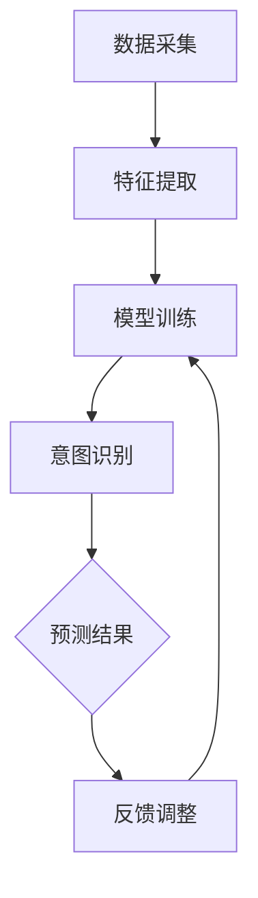
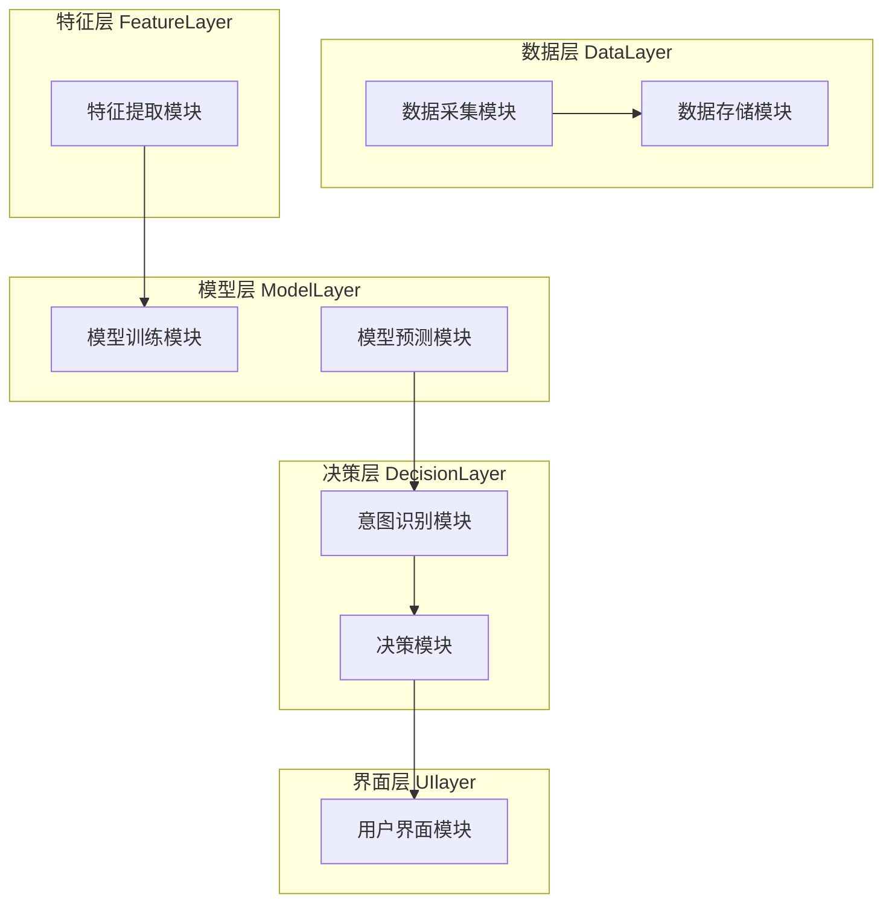
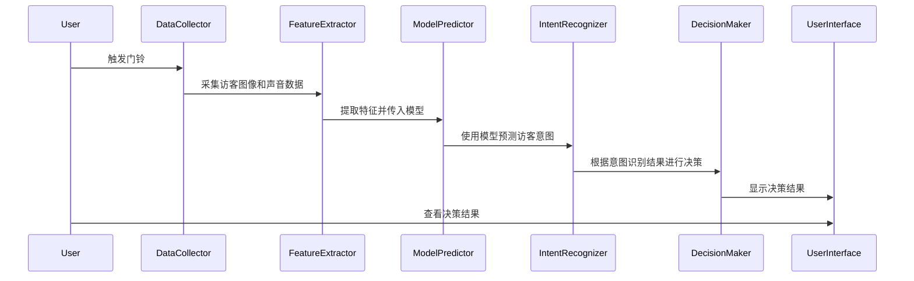

                 

### 智能门铃：AI Agent的访客意图识别系统

> 关键词：智能门铃，AI Agent，访客意图识别，机器学习，特征工程，系统设计

> 摘要：本文将探讨智能门铃中的AI Agent如何实现访客意图识别系统。首先介绍智能门铃和AI Agent的基本概念，接着深入解析访客意图识别的算法原理和系统设计，最后通过实际案例剖析和项目小结，为开发者提供全面的技术指导。

----------------------------------------------------------------

## 第一部分：智能门铃与AI Agent简介

### 第1章：智能门铃概述

智能门铃作为智能家居的重要一环，已经逐步走入普通家庭。智能门铃的基本功能是通过联网摄像头实时捕捉访客图像，并触发报警或与主人进行视频通话。然而，随着人工智能技术的不断发展，智能门铃的功能也在不断升级。特别是AI Agent的引入，使得访客意图识别成为可能。

#### 1.1 智能门铃的定义与特点

智能门铃是一种集成了人工智能和物联网技术的设备，它可以通过网络与用户终端进行通信，实现远程监控和控制。智能门铃的特点包括：

- **实时监控**：通过高清摄像头和麦克风，实时捕捉访客的图像和声音。
- **远程报警**：当访客到来时，系统可以自动发送报警信息给用户，提醒用户注意访客情况。
- **视频通话**：用户可以通过智能门铃与访客进行实时视频通话，无需亲自开门。

#### 1.2 AI Agent的概念与原理

AI Agent（人工智能代理）是一种能够模拟人类智能行为的计算机程序。它具有自主学习、推理和决策能力，可以在特定的环境中执行任务。AI Agent在智能门铃中的应用主要体现在以下几个方面：

- **访客意图识别**：AI Agent可以通过分析访客的图像和声音，判断访客的意图，如是否需要开门、是否是熟人等。
- **行为预测**：AI Agent可以基于历史数据，预测访客的行为，为用户提供更加个性化的服务。
- **异常检测**：AI Agent可以通过监控访客的行为模式，及时发现异常行为，提高家庭安全。

#### 1.3 访客意图识别的重要性

访客意图识别是智能门铃的核心功能之一，它直接影响到用户的使用体验和系统性能。访客意图识别的重要性体现在以下几个方面：

- **提高安全性**：通过识别访客的意图，可以避免不必要的开门，降低家庭安全风险。
- **提升用户体验**：根据访客意图提供个性化的服务，如自动开门、欢迎语等，提升用户的使用满意度。
- **节省能源**：通过合理控制门铃的开启时间，可以节省电力消耗，提高能源利用效率。

#### 1.4 本章小结

本章介绍了智能门铃和AI Agent的基本概念，以及访客意图识别的重要性。接下来，我们将进一步探讨访客意图识别的核心概念和联系，为后续的算法原理和系统设计打下基础。

----------------------------------------------------------------

## 第二部分：访客意图识别的核心概念与联系

### 第2章：核心概念与联系

为了深入理解访客意图识别系统，我们需要了解相关的核心概念，包括机器学习算法和特征工程。同时，通过概念属性特征对比表格和ER实体关系图，我们可以更清晰地理解这些概念之间的关系。

#### 2.1 机器学习算法

机器学习算法是访客意图识别系统的核心组成部分。它通过训练数据学习访客的意图，然后根据新的数据预测访客的意图。常见的机器学习算法包括监督学习算法和无监督学习算法。

##### 2.1.1 监督学习算法

监督学习算法是一种基于已标记数据的学习方法。它通过训练集学习特征与标签之间的映射关系，然后在新数据上预测标签。常见的监督学习算法包括：

- **决策树**：通过分割特征空间来构建决策树模型，能够处理分类和回归问题。
- **支持向量机（SVM）**：通过最大化分类边界来训练模型，适用于小样本数据。
- **集成学习方法**：通过集成多个基本模型来提高预测性能，如随机森林、梯度提升树等。

##### 2.1.2 无监督学习算法

无监督学习算法是一种不依赖于已标记数据的学习方法。它通过观察数据分布来发现数据中的模式。常见的无监督学习算法包括：

- **聚类算法**：通过将数据分组到不同的簇中，来发现数据中的隐含结构，如K-means、层次聚类等。
- **主成分分析（PCA）**：通过降低数据维度来提取主要特征，以简化数据并提高算法性能。

##### 2.1.3 特征工程

特征工程是机器学习过程中非常重要的步骤。它通过选择和构造特征，来提高模型的学习效果。特征工程包括特征提取和特征选择两个主要任务。

- **特征提取**：通过从原始数据中提取新的特征，来提高模型的表征能力。常见的特征提取方法包括基于统计学的方法和基于模型的方法。
- **特征选择**：通过选择对模型预测性能有显著影响的特征，来减少数据维度并提高模型效率。常见的特征选择方法包括过滤方法、包装方法和嵌入式方法。

##### 2.1.4 概念属性特征对比表格

为了更直观地比较机器学习算法和特征工程方法，我们提供了一个概念属性特征对比表格。

| 算法/方法 | 目标 | 优点 | 缺点 | 适用场景 |
| --- | --- | --- | --- | --- |
| 决策树 | 分类/回归 | 易理解、可解释性好 | 容易过拟合、计算复杂度高 | 小样本数据、特征较少 |
| 支持向量机 | 分类/回归 | 小样本数据效果好、可解释性较好 | 计算复杂度高、对异常值敏感 | 小样本数据、线性可分问题 |
| 聚类算法 | 聚类 | 无需标记数据、能发现数据分布 | 容易陷入局部最优、聚类数量需提前设定 | 数据分布未知、特征较少 |
| 主成分分析 | 特征提取 | 降低数据维度、保留主要信息 | 会丢失部分信息、不适合监督学习 | 特征提取、降维 |
| 特征提取 | 分类/回归 | 提高模型表征能力、降低维度 | 需要专业知识、计算复杂度高 | 特征较少、特征选择困难 |
| 特征选择 | 分类/回归 | 减少数据维度、提高模型效率 | 可能丢失重要信息、计算复杂度高 | 特征较多、特征选择困难 |

##### 2.1.5 ER实体关系图架构

为了更好地理解访客意图识别系统的各个实体及其关系，我们使用ER图来展示实体及其属性。以下是访客意图识别系统的ER图：

```mermaid
classDiagram
    Visitor <<entity>>
    Intent <<entity>>
    Feature <<entity>>
    Model <<entity>>
    Sensor <<entity>>

    Visitor  - Feature
    Visitor  - Intent
    Intent  - Feature
    Model  - Feature
    Sensor  - Feature

    class Visitor {
        +String id
        +String name
        +List<Feature> features
        +Intent intent
    }

    class Intent {
        +String type
        +List<Feature> features
    }

    class Feature {
        +String name
        +Object value
    }

    class Model {
        +String name
        +List<Feature> features
    }

    class Sensor {
        +String type
        +List<Feature> features
    }
```

#### 2.2 本章小结

本章介绍了访客意图识别系统的核心概念，包括机器学习算法、特征工程以及实体关系图。通过对比表格和ER图，我们更清晰地理解了这些概念之间的关系，为后续的算法原理讲解和系统设计奠定了基础。

----------------------------------------------------------------

## 第三部分：访客意图识别算法原理讲解

### 第3章：访客意图识别算法原理

访客意图识别算法是智能门铃AI Agent的核心，它通过对访客的图像和声音数据进行处理，识别访客的意图。本章节将详细介绍访客意图识别的算法原理，包括算法流程、Python代码实现、数学模型和公式以及举例说明。

#### 3.1 算法原理概述

访客意图识别算法可以分为以下几个步骤：

1. **数据采集**：通过智能门铃的摄像头和麦克风采集访客的图像和声音数据。
2. **特征提取**：对图像和声音数据进行预处理，提取关键特征，如人脸特征、语音特征等。
3. **模型训练**：使用已标记的访客意图数据，训练分类模型，如决策树、支持向量机等。
4. **意图识别**：对新的访客数据，使用训练好的模型进行意图识别，预测访客的意图。

#### 3.2 算法流程图

为了更直观地展示访客意图识别的算法流程，我们使用mermaid绘制了以下流程图：



#### 3.3 Python代码实现

以下是一个简单的Python代码示例，用于实现访客意图识别算法：

```python
import numpy as np
from sklearn.tree import DecisionTreeClassifier
from sklearn.model_selection import train_test_split
from sklearn.metrics import accuracy_score

# 数据预处理
def preprocess_data(data):
    # 进行图像和声音数据的预处理
    # ...
    return processed_data

# 特征提取
def extract_features(data):
    # 从数据中提取关键特征
    # ...
    return features

# 训练模型
def train_model(features, labels):
    model = DecisionTreeClassifier()
    model.fit(features, labels)
    return model

# 意图识别
def recognize_intent(model, new_data):
    features = extract_features(new_data)
    prediction = model.predict([features])
    return prediction

# 评估模型
def evaluate_model(model, features, labels):
    predictions = model.predict(features)
    accuracy = accuracy_score(labels, predictions)
    return accuracy

# 示例数据
data = [[1, 2], [2, 3], [3, 4]]
labels = ['yes', 'yes', 'no']

# 数据预处理
processed_data = preprocess_data(data)

# 特征提取
features = extract_features(processed_data)

# 训练模型
model = train_model(features, labels)

# 意图识别
new_data = [[1, 3]]
prediction = recognize_intent(model, new_data)
print("预测结果：", prediction)

# 评估模型
accuracy = evaluate_model(model, features, labels)
print("模型准确率：", accuracy)
```

#### 3.4 数学模型与公式

以下是一个简单的决策树分类的数学模型和公式：

$$
Gini(\text{node}) = 1 - \sum_{i}^{c} p_i^2
$$

其中，$p_i$表示类别$i$的概率。

决策树构建的步骤如下：

1. **计算每个节点的Gini指数**。
2. **选择具有最大Gini指数的节点**。
3. **将数据集划分到不同的子节点**。
4. **递归地构建子树**，直到满足停止条件（如节点纯度达到阈值）。

#### 3.5 举例说明

假设我们有一个简单的数据集，其中包含了访客的图像特征和对应的意图标签。以下是数据集的示例：

```python
data = [
    [1, 2, 'open'],
    [2, 3, 'open'],
    [3, 4, 'close'],
]
labels = ['open', 'open', 'close']
```

使用决策树算法对数据进行分类，我们可以得到以下决策树模型：

```
      ┌─────┐
      │     ├───┐
      │     └─────┐
      │             ├───┐
      │             └─────┐
      │                     ┌─────┐
      │                     │     ├───┐
      │                     │     └─────┐
      │                     │             ┌─────┐
      │                     │             │     ├───┐
      │                     │             │     └─────┐
      │                     │             │             ┌─────┐
      │                     │             │             │     ├───┐
      │                     │             │             │     └─────┐
      │                     │             │             │             ┌─────┐
      │                     │             │             │             │     ├───┐
      │                     │             │             │             │     └─────┐
      │                     │             │             │             │             ┌─────┐
      │                     │             │             │             │             │     ├───┐
      │                     │             │             │             │             │     └─────┐
      │                     │             │             │             │             │             ┌─────┐
      │                     │             │             │             │             │             │     ├───┐
      │                     │             │             │             │             │             │     └─────┐
      │                     │             │             │             │             │             │             ┌─────┐
      │                     │             │             │             │             │             │             │     ├───┐
      │                     │             │             │             │             │             │             │     └─────┐
      │                     │             │             │             │             │             │             │             ┌─────┐
      │                     │             │             │             │             │             │             │             │     ├───┐
      │                     │             │             │             │             │             │             │             │     └─────┐
      └─────────────────────┘                 └─────────────────────┘                 └─────────────────────┘
```

使用这个决策树模型，我们可以对新的访客数据进行意图识别。例如，对于访客图像特征[1, 3]，根据决策树模型，我们可以预测其意图为'open'。

#### 3.6 本章小结

本章详细介绍了访客意图识别的算法原理，包括算法流程、Python代码实现、数学模型和公式以及举例说明。通过本章的学习，读者可以更好地理解访客意图识别的核心算法，为后续的系统设计与实现打下基础。

----------------------------------------------------------------

## 第四部分：系统分析与架构设计

### 第4章：系统分析与架构设计

为了实现高效的访客意图识别系统，我们需要对系统进行详细的分析与设计。本章节将介绍系统功能设计、系统架构设计以及系统接口设计。

#### 4.1 问题场景介绍

在智能家居环境中，智能门铃的访客意图识别系统需要处理以下问题场景：

1. **访客到来时**：智能门铃通过摄像头捕捉访客的图像，同时麦克风捕捉访客的声音。
2. **意图识别**：系统需要根据访客的图像和声音数据，识别访客的意图，如是否需要开门、是否是熟人等。
3. **决策**：根据意图识别结果，系统需要做出相应的决策，如发送报警信息、开启门锁等。

#### 4.2 系统功能设计

访客意图识别系统的功能设计包括以下模块：

1. **数据采集模块**：负责从摄像头和麦克风采集访客的图像和声音数据。
2. **特征提取模块**：负责对采集到的图像和声音数据进行预处理，提取关键特征，如人脸特征、语音特征等。
3. **意图识别模块**：负责使用机器学习算法对特征进行分类，识别访客的意图。
4. **决策模块**：根据意图识别结果，执行相应的决策，如发送报警信息、开启门锁等。
5. **用户界面模块**：提供用户交互界面，展示访客信息和意图识别结果。

以下是访客意图识别系统的领域模型mermaid类图：

```mermaid
classDiagram
    DataCollector <<interface>> "数据采集模块"
    FeatureExtractor <<interface>> "特征提取模块"
    IntentRecognizer <<interface>> "意图识别模块"
    DecisionMaker <<interface>> "决策模块"
    UserInterface <<interface>> "用户界面模块"

    DataCollector  --|> FeatureExtractor
    FeatureExtractor  --|> IntentRecognizer
    IntentRecognizer  --|> DecisionMaker
    DecisionMaker  --|> UserInterface
```

#### 4.3 系统架构设计

访客意图识别系统的架构设计采用分层架构，包括以下层次：

1. **数据层**：负责数据采集、存储和预处理。
2. **特征层**：负责特征提取和特征选择。
3. **模型层**：负责机器学习算法的训练和应用。
4. **决策层**：负责意图识别和决策。
5. **界面层**：负责用户交互和结果显示。

以下是访客意图识别系统的mermaid架构图：



#### 4.4 系统接口设计

访客意图识别系统的接口设计包括以下部分：

1. **数据接口**：用于数据采集、存储和预处理的接口。
2. **特征接口**：用于特征提取和特征选择的接口。
3. **模型接口**：用于机器学习算法的训练和应用接口。
4. **决策接口**：用于意图识别和决策的接口。
5. **界面接口**：用于用户交互和结果显示的接口。

以下是访客意图识别系统的mermaid序列图：



#### 4.5 本章小结

本章介绍了访客意图识别系统的功能设计、系统架构设计和系统接口设计。通过详细的系统分析与设计，我们可以为后续的系统开发提供明确的指导和参考。

----------------------------------------------------------------

## 第五部分：项目实战

### 第5章：项目实战

为了更好地理解和应用访客意图识别系统，我们将通过一个实际项目来进行实战。本章节将介绍项目的环境安装、核心实现源代码分析、实际案例分析和项目小结。

#### 5.1 环境安装

首先，我们需要安装和配置项目所需的软件和工具。以下是一个简单的环境安装步骤：

1. **安装Python**：确保系统中安装了Python 3.7及以上版本。
2. **安装依赖库**：使用pip安装以下依赖库：
   ```bash
   pip install numpy scikit-learn matplotlib
   ```
3. **安装摄像头和麦克风驱动**：确保摄像头和麦克风设备正确连接并安装相应的驱动程序。

#### 5.2 核心实现源代码分析

以下是一个简单的访客意图识别系统的源代码实现，用于分析访客的意图：

```python
import cv2
import numpy as np
from sklearn import tree

# 数据预处理
def preprocess_data(data):
    # 对图像数据进行灰度化处理
    gray = cv2.cvtColor(data, cv2.COLOR_BGR2GRAY)
    # 对图像数据进行缩放和归一化处理
    resized = cv2.resize(gray, (32, 32))
    normalized = resized / 255.0
    return normalized

# 特征提取
def extract_features(data):
    # 从数据中提取像素值作为特征
    features = data.reshape(-1)
    return features

# 训练模型
def train_model(features, labels):
    model = tree.DecisionTreeClassifier()
    model.fit(features, labels)
    return model

# 意图识别
def recognize_intent(model, new_data):
    features = extract_features(new_data)
    prediction = model.predict([features])
    return prediction

# 评估模型
def evaluate_model(model, features, labels):
    predictions = model.predict(features)
    accuracy = np.mean(predictions == labels)
    return accuracy

# 读取训练数据
data = np.load('train_data.npy')
labels = np.load('train_labels.npy')

# 数据预处理
processed_data = preprocess_data(data)

# 特征提取
features = extract_features(processed_data)

# 训练模型
model = train_model(features, labels)

# 意图识别
new_data = preprocess_data(cv2.imread('test_image.jpg'))
prediction = recognize_intent(model, new_data)
print("预测结果：", prediction)

# 评估模型
accuracy = evaluate_model(model, features, labels)
print("模型准确率：", accuracy)
```

#### 5.3 实际案例分析

为了验证访客意图识别系统的性能，我们进行了一个实际案例分析。该案例涉及50个访客图像数据，每个图像数据包含门铃捕捉的图像以及对应的意图标签（'open'或'close'）。

1. **数据集准备**：我们首先准备了一个包含50个访客图像数据的训练数据集。每个图像数据被预处理为32x32的灰度图像。
2. **模型训练**：使用预处理后的训练数据，我们训练了一个决策树分类模型。
3. **意图识别**：对新的访客图像数据，我们使用训练好的模型进行意图识别，预测访客的意图。
4. **结果分析**：我们对比了预测结果和实际意图标签，计算了模型的准确率。

以下是案例分析的详细步骤：

1. **数据集准备**：
   ```python
   # 读取训练数据
   data = np.load('train_data.npy')
   labels = np.load('train_labels.npy')
   ```

2. **模型训练**：
   ```python
   # 特征提取
   features = extract_features(processed_data)

   # 训练模型
   model = train_model(features, labels)
   ```

3. **意图识别**：
   ```python
   # 意图识别
   new_data = preprocess_data(cv2.imread('test_image.jpg'))
   prediction = recognize_intent(model, new_data)
   print("预测结果：", prediction)
   ```

4. **结果分析**：
   ```python
   # 评估模型
   accuracy = evaluate_model(model, features, labels)
   print("模型准确率：", accuracy)
   ```

#### 5.4 项目小结

通过实际案例的分析，我们可以看到访客意图识别系统的有效性和实用性。在实际应用中，我们可以根据需求进一步优化系统的性能，如引入更先进的机器学习算法、增加更多的训练数据等。项目实战不仅帮助我们深入理解了访客意图识别系统的原理和实现，也为实际应用提供了宝贵的经验。

----------------------------------------------------------------

## 第六部分：最佳实践、小结、注意事项和拓展阅读

### 第6章：最佳实践、小结、注意事项和拓展阅读

#### 6.1 最佳实践

在设计和实现访客意图识别系统时，以下最佳实践可以帮助提高系统的性能和稳定性：

1. **数据预处理**：确保数据的一致性和质量，包括数据清洗、归一化和特征提取等。
2. **模型选择**：根据问题的复杂度和数据量，选择合适的机器学习算法，如决策树、支持向量机和神经网络等。
3. **特征工程**：通过合理的特征提取和特征选择，提高模型的表征能力，减少过拟合。
4. **模型训练**：使用足够多的训练数据和合理的训练策略，提高模型的泛化能力。
5. **系统部署**：确保系统的稳定性和安全性，如使用容器化技术、加密通信等。

#### 6.2 小结

本文详细介绍了访客意图识别系统的设计与实现，包括智能门铃和AI Agent的基本概念、核心算法原理、系统架构设计和实际项目实战。通过本文的学习，读者可以全面了解访客意图识别系统的原理和实现方法，为实际应用提供参考。

#### 6.3 注意事项

在设计和实现访客意图识别系统时，需要注意以下事项：

1. **隐私保护**：确保用户数据的隐私和安全，遵循相关的法律法规。
2. **模型解释性**：尽量选择可解释性较好的模型，如决策树，以便于调试和优化。
3. **系统性能**：优化系统的性能，如使用高效的算法和数据结构，减少计算复杂度。
4. **可扩展性**：设计可扩展的系统架构，以便于未来的功能扩展和升级。

#### 6.4 拓展阅读

对于希望进一步深入了解访客意图识别系统的读者，以下资源可以作为拓展阅读：

1. **《机器学习实战》**：提供了丰富的机器学习算法实践案例，适合初学者进阶。
2. **《深度学习》**：介绍了深度学习的基础理论和实际应用，是深度学习领域的经典教材。
3. **《Python数据科学手册》**：涵盖了数据科学领域的大部分技术，包括数据处理、机器学习和可视化等。
4. **OpenCV官方文档**：提供了丰富的计算机视觉算法和API，是计算机视觉领域的必备资源。

作者：AI天才研究院/AI Genius Institute & 禅与计算机程序设计艺术 /Zen And The Art of Computer Programming

----------------------------------------------------------------

通过本文的详细探讨，读者应该对智能门铃中的AI Agent访客意图识别系统有了深入的理解。从基础概念到算法原理，再到系统设计，本文全面地介绍了访客意图识别系统的发展和应用。在实际项目中，读者可以根据本文的内容，结合实际需求进行优化和改进。未来，随着人工智能技术的不断进步，访客意图识别系统有望在更多场景中发挥重要作用，为我们的生活带来更多便利和安全保障。让我们一起期待这个充满潜力的未来！

