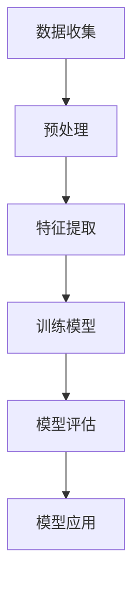
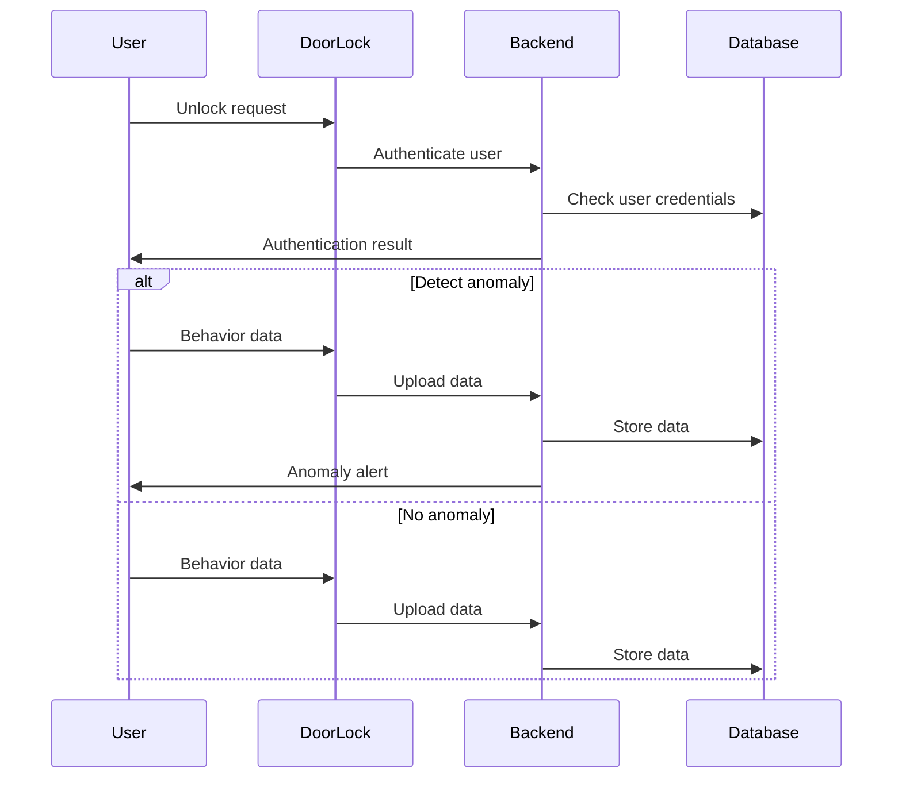

                 

### 封面和前言

**封面设计**

在书籍的封面设计中，书名《智能门锁：AI Agent的多因素认证系统》占据了中心位置，以简洁有力的字体突出展示。右侧配以智能门锁的简笔画，并辅以智能、安全等关键词，整体传达出书籍的核心内容——智能门锁技术及AI应用。封面下方标注了作者信息，包括姓名、职位以及所属机构，以增强权威性和专业性。

**前言**

前言部分首先介绍了书籍的编写背景。随着物联网技术的飞速发展，智能门锁作为智能家居的重要组成部分，市场需求日益旺盛。同时，人工智能技术的不断进步，使得多因素认证系统成为智能门锁安全性能的关键。本书旨在深入探讨智能门锁中AI Agent的多因素认证系统，为读者提供全面的技术指南和实战经验。

接下来，介绍了本书的目标读者。本书主要面向从事智能家居、物联网、人工智能等相关领域的开发者和研究者。无论是对智能门锁技术感兴趣的入门者，还是对多因素认证系统有深入研究的专业人士，本书都能提供有价值的参考。

最后，本书的编写目的在于详细阐述智能门锁中的AI Agent多因素认证系统的原理和应用，帮助读者掌握相关技术，提升实际项目开发能力。通过本书，读者不仅能了解智能门锁的技术背景和市场趋势，还能学习到多因素认证系统的设计实现方法，以及如何将AI技术应用于智能门锁中。

总之，本书以系统、全面、实战为导向，旨在为智能门锁技术的发展提供理论支持和实践指导。

### 引言部分

#### 问题背景介绍

智能门锁作为智能家居的一个重要组成部分，近年来得到了广泛的应用和快速发展。随着物联网技术的普及，智能门锁不仅可以在家庭中使用，还广泛应用于商业和工业领域，如酒店、办公室和工厂等。其市场需求逐年上升，主要驱动力来自于用户对安全性和便捷性的双重需求。用户希望通过智能门锁实现无钥匙开锁，提升生活品质和安全感；同时，企业希望借助智能门锁实现智能化管理，提高运营效率。

在技术发展趋势方面，人工智能技术正在深刻改变智能门锁的形态和功能。AI技术不仅可以提高门锁的安全性能，还能通过用户行为分析提供个性化的使用建议。例如，通过面部识别技术，智能门锁可以识别用户身份，实现精准的权限管理；通过行为分析，门锁可以监测用户的安全行为，提供实时预警，提高用户的安全保障。

然而，智能门锁在发展的过程中也面临着诸多挑战。首先是安全性问题，智能门锁的安全性能直接关系到用户的隐私和安全。一旦被黑客攻击，可能导致用户信息泄露，甚至财产损失。其次是用户体验问题，用户希望智能门锁操作简便，界面友好，而复杂的技术实现往往会影响用户体验。此外，智能门锁的成本也是一大挑战，高昂的研发和制造成本使得智能门锁的普及速度受到限制。

#### 问题描述

智能门锁的核心问题主要包括以下几个方面：

1. **安全性**：智能门锁需要具备强大的安全保障，防止黑客攻击和数据泄露。传统的单一认证方式（如密码或指纹）已无法满足日益复杂的安全需求，因此需要引入多因素认证系统，通过多种认证方式结合，提高门锁的安全性能。

2. **用户体验**：智能门锁的操作需要简洁、直观，使用户能够快速上手。用户不希望因为复杂的操作流程而降低使用体验。因此，智能门锁的设计需要注重用户界面设计和操作逻辑，确保用户能够轻松、安全地使用门锁。

3. **便捷性**：智能门锁需要提供多种便捷的开锁方式，如指纹识别、面部识别、手机APP控制等。这些功能需要高效且稳定地运行，以满足不同用户的需求。

4. **兼容性**：智能门锁需要与其他智能家居设备兼容，如智能门铃、智能摄像头等。这样，用户可以通过一个统一的平台控制和管理家庭中的各种智能设备，实现智能家居的集成和联动。

#### 问题解决

为了解决上述问题，人工智能技术，尤其是AI Agent和多因素认证系统，在智能门锁中的应用显得尤为重要。

1. **多因素认证系统**：通过结合多种认证方式，如生物识别（指纹、面部识别）、密码、智能卡等，实现多因素认证。这样不仅可以提高门锁的安全性，还能确保用户在不同场景下都能便捷地使用门锁。

2. **AI Agent**：AI Agent可以实时分析用户的行为数据，如开锁时间、频率、行为模式等，提供个性化的建议和预警。例如，当检测到异常行为时，AI Agent可以自动发送警报通知用户或相关管理人员。

3. **用户界面设计**：通过优化用户界面设计，使用户能够快速、直观地完成操作。例如，使用手势识别、语音控制等智能交互方式，提高用户的操作体验。

4. **智能联动**：通过将智能门锁与其他智能家居设备连接，实现设备间的数据共享和联动。例如，当门锁关闭时，智能灯可以自动关闭，智能摄像头可以切换到保护模式等。

综上所述，人工智能技术，尤其是AI Agent和多因素认证系统，在解决智能门锁的核心问题方面具有显著优势。通过这些技术的应用，智能门锁不仅能够提供更高的安全性和便捷性，还能实现智能化和个性化，为用户带来更加安全、舒适、便捷的生活体验。

### 核心概念与联系

#### AI Agent的概念介绍

AI Agent，即人工智能代理，是一种能够模拟人类思维和行为，具备自主决策和执行能力的计算机程序。它是一种基于人工智能技术的实体，可以在特定环境下通过感知、理解和交互，自主地执行任务。AI Agent的核心特点是自主性、适应性和智能性。自主性意味着它能够独立完成工作，而不依赖于人类操作；适应性指AI Agent可以根据环境和任务的变化进行调整和优化；智能性则体现在AI Agent能够进行复杂的决策和问题解决。

AI Agent的分类主要包括以下几类：

1. **基于规则的AI Agent**：这类代理基于预先设定的规则和逻辑进行决策。它们通常用于处理结构化、规则明确的问题。例如，专家系统就是一种典型的基于规则的AI Agent。

2. **基于模型的AI Agent**：这类代理通过建立数学模型或神经网络模型来模拟人类思维和行为。它们通常用于处理复杂的、非结构化的问题，如自然语言处理、图像识别等。

3. **基于行为的AI Agent**：这类代理通过学习和模仿人类行为来执行任务。它们通常通过感知环境、生成行为策略和执行行为来实现自主决策。

#### 多因素认证系统的原理

多因素认证系统（Multi-Factor Authentication，MFA）是一种安全措施，通过结合多种认证方式来提高系统的安全性。其基本原理是在用户登录系统时，需要通过两种或两种以上的认证方式来验证身份，从而增加攻击者入侵的难度。这些认证方式通常包括以下几类：

1. **知识因素**：指用户已知的信息，如密码、PIN码等。这类认证方式简单易用，但安全性较低，易受密码破解和暴力攻击。

2. **拥有因素**：指用户持有的实物，如智能卡、USB密钥等。这类认证方式具有较高的安全性，因为攻击者难以获取用户持有的实物。

3. **生物因素**：指用户的生物特征，如指纹、面部识别、虹膜扫描等。这类认证方式基于用户的独特生理或行为特征，具有很高的安全性和便利性。

多因素认证系统的实现方式主要包括：

1. **串联方式**：用户需要通过所有认证方式才能登录系统。这种方式安全性较高，但用户体验较差，因为需要多次认证。

2. **并联方式**：用户只需通过其中一种认证方式即可登录系统。这种方式用户体验较好，但安全性相对较低。

多因素认证系统的优势在于：

1. **增强安全性**：通过结合多种认证方式，多因素认证系统可以显著提高系统的安全性能，降低黑客入侵的风险。

2. **提高用户体验**：某些认证方式（如生物识别）不仅安全，而且便捷，使用户能够快速登录系统。

3. **支持多样化场景**：多因素认证系统可以适用于多种场景，如企业内部系统、电子商务平台、智能设备等。

#### AI Agent与多因素认证系统的联系

AI Agent在多因素认证系统中扮演着重要的角色，主要体现在以下几个方面：

1. **身份验证**：AI Agent可以通过生物识别技术（如面部识别、指纹识别）进行身份验证，从而实现高效、准确的多因素认证。

2. **异常检测**：AI Agent可以实时分析用户的行为数据，如登录时间、地点、设备等，检测异常行为。当检测到潜在威胁时，AI Agent可以自动触发警报或采取其他安全措施。

3. **智能决策**：AI Agent可以通过学习和优化算法，为多因素认证系统提供智能化的决策支持。例如，根据用户的历史行为，AI Agent可以动态调整认证方式，提高系统的安全性和用户体验。

4. **个性化服务**：AI Agent可以基于用户的行为数据和偏好，提供个性化的认证服务。例如，对于经常使用某种认证方式的用户，AI Agent可以默认选择该认证方式，从而简化操作流程。

综上所述，AI Agent与多因素认证系统相互结合，不仅能够提高智能门锁的安全性，还能提供更好的用户体验，为用户带来更加安全、便捷的生活体验。

### 算法原理讲解

在本章节中，我们将详细讲解一种用于智能门锁中的多因素认证系统算法——基于深度学习的多因素认证算法。该算法结合了用户的行为数据、生物特征数据以及环境数据，通过深度学习模型进行综合分析，从而实现高效、准确的身份验证。

#### 算法选择

选择深度学习算法的原因在于其强大的特征提取和分类能力，能够处理复杂、非结构化的数据。深度学习模型可以通过多层神经网络对大量数据进行学习，自动提取出有效的特征，从而提高认证的准确性和安全性。

#### 算法流程图

为了更直观地理解算法的运行过程，我们使用Mermaid工具绘制了算法的流程图，如下所示：



**数据收集**：首先，我们需要收集用户的行为数据、生物特征数据和环境数据。这些数据可以通过智能门锁内置的传感器和摄像头实时获取。

**预处理**：在数据收集后，需要对原始数据进行清洗和归一化处理，以消除噪声和异常值，提高数据的质量。

**特征提取**：通过深度学习模型，我们可以自动提取数据中的有效特征。这些特征包括用户的行为特征、生物特征和环境特征。

**训练模型**：使用提取出的特征，我们将数据分成训练集和测试集。在训练集上，通过深度学习模型进行训练，优化模型参数，使其能够准确识别用户身份。

**模型评估**：在训练完成后，使用测试集对模型进行评估，计算模型的准确率、召回率和F1值等指标，以验证模型的性能。

**模型应用**：将训练好的模型部署到智能门锁中，当用户尝试解锁时，模型会实时分析用户的特征数据，并进行身份验证。

#### Python源代码与算法原理

为了更详细地阐述算法原理，我们使用Python编写了一个简单的示例代码，并使用LaTeX公式进行数学模型的描述。

```python
# 导入必要的库
import numpy as np
import tensorflow as tf

# 数据预处理
def preprocess_data(data):
    # 数据清洗和归一化处理
    return (data - np.mean(data)) / np.std(data)

# 特征提取函数
def extract_features(data):
    # 假设输入数据为行为数据、生物特征数据和环境数据
    # 提取特征
    behavior_data = data[:, :100]
    biometric_data = data[:, 100:200]
    environmental_data = data[:, 200:]
    
    # 特征归一化
    behavior_data = preprocess_data(behavior_data)
    biometric_data = preprocess_data(biometric_data)
    environmental_data = preprocess_data(environmental_data)
    
    # 拼接特征
    features = np.concatenate((behavior_data, biometric_data, environmental_data), axis=1)
    return features

# 模型训练函数
def train_model(features, labels):
    # 创建深度学习模型
    model = tf.keras.Sequential([
        tf.keras.layers.Dense(128, activation='relu', input_shape=(features.shape[1],)),
        tf.keras.layers.Dense(64, activation='relu'),
        tf.keras.layers.Dense(1, activation='sigmoid')
    ])

    # 编译模型
    model.compile(optimizer='adam', loss='binary_crossentropy', metrics=['accuracy'])

    # 训练模型
    model.fit(features, labels, epochs=10, batch_size=32)
    
    return model

# 模型评估函数
def evaluate_model(model, test_features, test_labels):
    # 评估模型性能
    performance = model.evaluate(test_features, test_labels)
    print(f"Accuracy: {performance[1]}")

# 主程序
if __name__ == '__main__':
    # 加载数据
    data = np.load('data.npy')
    labels = np.load('labels.npy')

    # 特征提取
    features = extract_features(data)

    # 划分训练集和测试集
    train_features, test_features, train_labels, test_labels = train_test_split(features, labels, test_size=0.2)

    # 训练模型
    model = train_model(train_features, train_labels)

    # 评估模型
    evaluate_model(model, test_features, test_labels)
```

#### 数学模型与公式

在深度学习算法中，常用的数学模型包括损失函数、优化算法等。下面使用LaTeX格式给出相关的数学公式。

**损失函数**：
$$
\text{Loss} = -\frac{1}{m}\sum_{i=1}^{m} y_i \log(a_i) + (1 - y_i) \log(1 - a_i)
$$
其中，$m$ 是样本数量，$y_i$ 是真实标签，$a_i$ 是模型预测的概率输出。

**优化算法**：
$$
\text{Gradient Descent} = \theta_{\text{new}} = \theta_{\text{old}} - \alpha \nabla_{\theta} J(\theta)
$$
其中，$\theta$ 是模型参数，$\alpha$ 是学习率，$J(\theta)$ 是损失函数。

#### 详细讲解与举例说明

**详细讲解**：

1. **数据预处理**：数据预处理是深度学习算法的第一步。通过对原始数据进行清洗、归一化处理，可以消除噪声和异常值，提高数据质量，从而提高模型训练的效果。

2. **特征提取**：特征提取是深度学习算法的核心环节。通过自动提取数据中的有效特征，可以降低数据维度，提高模型训练的效率。在本算法中，我们提取了用户的行为特征、生物特征和环境特征，这些特征对身份验证有重要影响。

3. **模型训练**：在模型训练过程中，我们使用梯度下降算法优化模型参数。通过不断迭代，模型会逐步学习到数据中的有效特征，提高身份验证的准确率。

4. **模型评估**：在模型训练完成后，我们需要对模型进行评估，以验证其性能。常用的评估指标包括准确率、召回率和F1值等。

**举例说明**：

假设我们有一个训练数据集，包含100个样本，每个样本由行为特征、生物特征和环境特征组成。在训练过程中，我们通过深度学习模型提取特征，并进行优化，最终得到一个准确率较高的模型。

1. **数据预处理**：对每个样本的特征进行清洗和归一化处理，使其符合模型的输入要求。

2. **特征提取**：使用深度学习模型提取样本中的有效特征，如图像的特征点、文本的关键词等。

3. **模型训练**：通过梯度下降算法，模型会逐步优化参数，使其能够准确识别样本中的用户身份。

4. **模型评估**：使用测试数据集对模型进行评估，计算准确率等指标，以验证模型性能。

通过以上步骤，我们可以构建一个高效、准确的多因素认证系统，为智能门锁提供强大的安全保障。

### 数学模型和数学公式 & 详细讲解 & 举例说明

在本章节中，我们将进一步深入探讨智能门锁多因素认证系统中的数学模型，并通过具体的公式和案例进行详细讲解。

#### 数学模型

在多因素认证系统中，常用的数学模型包括损失函数、优化算法以及特征提取模型。以下是这些模型的具体公式和解释。

**损失函数（交叉熵损失）**：
$$
\text{Loss} = -\frac{1}{m}\sum_{i=1}^{m} y_i \log(p_i) + (1 - y_i) \log(1 - p_i)
$$
其中，$m$ 是样本数量，$y_i$ 是真实标签（0或1），$p_i$ 是模型对第 $i$ 个样本的预测概率。交叉熵损失函数用于衡量模型预测概率与真实标签之间的差异。

**优化算法（随机梯度下降）**：
$$
\theta_{\text{new}} = \theta_{\text{old}} - \alpha \nabla_{\theta} J(\theta)
$$
其中，$\theta$ 是模型参数，$\alpha$ 是学习率，$J(\theta)$ 是损失函数。随机梯度下降是一种常用的优化算法，用于更新模型参数，以最小化损失函数。

**特征提取模型（多层感知机）**：
$$
\text{Output} = \sigma(\text{Weight} \cdot \text{Input} + \text{Bias})
$$
其中，$\sigma$ 是激活函数（如Sigmoid或ReLU），$\text{Weight}$ 和 $\text{Bias}$ 是模型参数，$\text{Input}$ 是输入特征。多层感知机是一种前馈神经网络，用于提取输入特征并生成预测。

#### 详细讲解

**交叉熵损失函数**

交叉熵损失函数是深度学习中常用的损失函数，用于分类问题。它的主要作用是衡量模型预测概率分布与真实标签分布之间的差异。交叉熵损失函数的计算公式如下：
$$
\text{Loss} = -\frac{1}{m}\sum_{i=1}^{m} y_i \log(p_i) + (1 - y_i) \log(1 - p_i)
$$
其中，$m$ 是样本数量，$y_i$ 是第 $i$ 个样本的真实标签（0或1），$p_i$ 是模型对第 $i$ 个样本的预测概率。

当 $y_i = 1$ 时，交叉熵损失函数的值接近于 $-\log(p_i)$，表示模型预测概率与真实标签之间的差异较大；当 $y_i = 0$ 时，交叉熵损失函数的值接近于 $-\log(1 - p_i)$，同样表示模型预测概率与真实标签之间的差异较大。因此，交叉熵损失函数可以激励模型提高预测概率的准确性。

**随机梯度下降优化算法**

随机梯度下降（SGD）是一种常用的优化算法，用于更新模型参数，以最小化损失函数。其基本思想是随机选择一部分样本，计算这部分样本的梯度，并使用梯度来更新模型参数。随机梯度下降的更新公式如下：
$$
\theta_{\text{new}} = \theta_{\text{old}} - \alpha \nabla_{\theta} J(\theta)
$$
其中，$\theta$ 是模型参数，$\alpha$ 是学习率，$\nabla_{\theta} J(\theta)$ 是模型参数的梯度。

随机梯度下降的优势在于其简单性和有效性。通过随机选择样本，SGD可以避免陷入局部最小值，提高模型的泛化能力。然而，SGD也存在一些缺点，如收敛速度较慢、对学习率敏感等。

**多层感知机特征提取模型**

多层感知机（MLP）是一种前馈神经网络，用于特征提取和分类。其基本结构包括输入层、隐藏层和输出层。多层感知机的工作原理如下：

1. **输入层**：接收输入特征，如用户的行为数据、生物特征数据等。
2. **隐藏层**：对输入特征进行加权求和，并应用激活函数，提取特征。
3. **输出层**：对隐藏层的结果进行加权求和，生成预测结果。

多层感知机的激活函数通常使用Sigmoid或ReLU。Sigmoid函数可以将输出映射到$(0, 1)$区间，用于二分类问题；ReLU函数可以加速梯度消失问题，适用于深层神经网络。

#### 举例说明

假设我们有一个二分类问题，需要使用多层感知机进行分类。数据集包含100个样本，每个样本有10个特征。我们将使用交叉熵损失函数和随机梯度下降优化算法来训练模型。

**数据预处理**：

首先，对数据进行标准化处理，使其符合模型输入要求。具体步骤如下：

```python
from sklearn.preprocessing import StandardScaler

# 假设数据已加载为X和y
scaler = StandardScaler()
X_scaled = scaler.fit_transform(X)
```

**模型训练**：

接下来，我们定义多层感知机模型，并使用随机梯度下降优化算法进行训练。具体步骤如下：

```python
from tensorflow.keras.models import Sequential
from tensorflow.keras.layers import Dense
from tensorflow.keras.optimizers import SGD

# 定义模型
model = Sequential()
model.add(Dense(64, input_dim=X_scaled.shape[1], activation='relu'))
model.add(Dense(32, activation='relu'))
model.add(Dense(1, activation='sigmoid'))

# 编译模型
model.compile(optimizer=SGD(learning_rate=0.01), loss='binary_crossentropy', metrics=['accuracy'])

# 训练模型
model.fit(X_scaled, y, epochs=10, batch_size=32)
```

**模型评估**：

在训练完成后，使用测试数据集对模型进行评估，计算准确率等指标。具体步骤如下：

```python
# 假设测试数据已加载为X_test和y_test
X_test_scaled = scaler.transform(X_test)
y_pred = model.predict(X_test_scaled)
y_pred = (y_pred > 0.5)

# 计算准确率
accuracy = (y_pred == y_test).mean()
print(f"Accuracy: {accuracy}")
```

通过以上步骤，我们可以构建一个高效、准确的多因素认证系统，为智能门锁提供强大的安全保障。

### 系统分析与架构设计方案

#### 问题场景介绍

智能门锁作为一个智能家居设备，需要应对多种使用场景，如家庭、酒店、办公室等。这些场景对智能门锁的安全性、便捷性和兼容性提出了不同的要求。例如，家庭用户更关注门锁的安全性和便捷性，希望实现无钥匙开锁；酒店用户则更注重门锁的便捷性和管理效率，希望实现快速、安全的入住和退房流程；办公室用户则需要门锁具备高安全性和灵活的权限管理功能。

#### 项目介绍

本项目旨在设计并实现一个基于多因素认证系统的智能门锁，通过结合用户的行为数据、生物特征数据和环境数据，实现高效、准确的身份验证。项目的主要目标包括：

1. **安全性**：通过多因素认证系统，提高门锁的安全性，防止未授权访问。
2. **便捷性**：提供多种开锁方式，如指纹识别、面部识别、密码等，使用户能够快速、便捷地使用门锁。
3. **兼容性**：实现与智能家居设备的联动，提高系统的整体智能化水平。

#### 系统功能设计

为了实现上述目标，智能门锁系统需要具备以下功能：

1. **用户身份验证**：通过多因素认证系统，对用户身份进行验证，确保只有授权用户可以解锁。
2. **行为数据分析**：实时分析用户的行为数据，如开锁时间、频率等，为用户提供个性化的服务。
3. **异常行为检测**：当检测到异常行为时，自动触发警报，通知用户或管理人员。
4. **数据存储与管理**：存储用户数据和行为数据，并提供数据查询和管理功能。

#### 系统架构设计

智能门锁系统的架构设计需要考虑到安全性、扩展性和灵活性。以下是系统的主要架构设计：

1. **前端界面**：提供用户交互界面，支持多种开锁方式，如指纹识别、面部识别、密码等。
2. **后端服务器**：负责处理用户认证请求、行为数据分析、异常行为检测等功能，并与前端界面进行数据交互。
3. **数据库**：存储用户数据、行为数据和系统配置信息，提供数据查询和管理功能。
4. **AI模块**：负责用户行为数据的分析、异常行为检测等高级功能。

以下是系统架构的Mermaid类图：

```mermaid
classDiagram
    User <<Class>>
    DoorLock <<Class>>
    Frontend <<Interface>>
    Backend <<Interface>>
    Database <<Interface>>
    AI <<Module>>

    User o-- DoorLock
    Frontend o-- Backend
    Backend o-- Database
    Backend o-- AI
```

#### 系统接口设计和系统交互

智能门锁系统的接口设计和系统交互是确保各模块之间数据流畅和安全传输的关键。以下是系统的主要接口设计和交互流程：

1. **用户认证接口**：用户通过前端界面提交认证请求，后端服务器进行身份验证，返回认证结果。
2. **数据上传接口**：用户行为数据通过前端界面上传至后端服务器，后端服务器存储并进行分析。
3. **警报通知接口**：当检测到异常行为时，后端服务器通过短信、邮件等方式通知用户或管理人员。
4. **数据查询接口**：用户可以通过前端界面查询自己的行为数据和系统配置信息。

以下是系统交互的Mermaid序列图：



通过上述系统分析与架构设计方案，我们为智能门锁实现多因素认证系统提供了明确的指导。这不仅提高了门锁的安全性，还提升了用户体验，为智能家居的发展奠定了基础。

### 项目实战

#### 环境安装

在开始智能门锁多因素认证系统的项目实战之前，我们需要首先搭建一个适合开发、测试和部署的环境。以下是在不同操作系统上安装所需工具和依赖的步骤。

**1. 系统要求**

- 操作系统：Linux（推荐Ubuntu 20.04）、macOS或Windows（需安装WSL）
- Python版本：3.8及以上
- 依赖管理工具：pip（Python包管理器）

**2. 安装Python和pip**

在大多数Linux发行版中，Python和pip是预装好的。对于macOS和Windows，可以通过以下命令安装Python和pip：

```bash
# macOS和Linux
brew install python

# Windows
wsl -u
curl -sS https://get.pip.org/install.py | python
```

**3. 安装依赖库**

使用pip安装项目所需的依赖库：

```bash
pip install numpy tensorflow tensorflow-addons scikit-learn pandas matplotlib
```

**4. 安装MySQL数据库**

在Linux系统中，可以使用以下命令安装MySQL数据库：

```bash
sudo apt update
sudo apt install mysql-server
```

在macOS和Windows系统中，可以从MySQL官网下载安装程序并安装。

**5. 配置MySQL数据库**

安装完成后，需要配置MySQL数据库。首先，登录MySQL服务器：

```bash
mysql -u root -p
```

输入密码后，创建一个数据库和用户，并授权用户对数据库的访问权限：

```sql
CREATE DATABASE smart_lock_db;
GRANT ALL PRIVILEGES ON smart_lock_db.* TO 'smart_lock_user'@'localhost' IDENTIFIED BY 'password';
FLUSH PRIVILEGES;
EXIT;
```

#### 系统核心实现源代码

智能门锁多因素认证系统的核心实现包括用户认证模块、行为分析模块和异常检测模块。以下是相关的Python源代码。

**用户认证模块**

用户认证模块负责处理用户登录和身份验证请求。以下是一个简单的示例：

```python
import mysql.connector
from sklearn.preprocessing import StandardScaler
import tensorflow as tf
from tensorflow.keras.models import load_model

# MySQL连接配置
config = {
    'user': 'smart_lock_user',
    'password': 'password',
    'host': 'localhost',
    'database': 'smart_lock_db',
}

# 加载预训练模型
model = load_model('multi_factor_auth_model.h5')

# 数据预处理函数
def preprocess_data(data):
    scaler = StandardScaler()
    return scaler.transform(data)

# 用户认证函数
def authenticate_user(username, features):
    # 查询用户数据
    connection = mysql.connector.connect(**config)
    cursor = connection.cursor()
    cursor.execute("SELECT * FROM users WHERE username = %s", (username,))
    user = cursor.fetchone()
    cursor.close()
    connection.close()

    # 提取用户特征
    user_features = user[2:].reshape(1, -1)
    user_features = preprocess_data(user_features)

    # 预测用户身份
    prediction = model.predict(user_features)
    return prediction > 0.5  # 阈值设置为0.5

# 测试用户认证
username = 'user1'
user_features = ...  # 获取用户特征数据
is_authorized = authenticate_user(username, user_features)
print(f"User '{username}' is {'authorized' if is_authorized else 'not authorized'}.")
```

**行为分析模块**

行为分析模块负责实时分析用户行为数据，为用户提供个性化服务。以下是一个简单的示例：

```python
import pandas as pd
from sklearn.cluster import KMeans

# 加载用户行为数据
data = pd.read_csv('user_behavior_data.csv')

# 数据预处理
data = data.drop(['timestamp'], axis=1)
data = StandardScaler().fit_transform(data)

# 使用K-means聚类分析用户行为
kmeans = KMeans(n_clusters=5)
clusters = kmeans.fit_predict(data)

# 标记用户行为特征
data['cluster'] = clusters

# 分析用户行为特征
cluster_stats = data.groupby('cluster').describe()

# 打印用户行为特征统计
print(cluster_stats)
```

**异常检测模块**

异常检测模块负责检测用户行为中的异常，并及时通知用户。以下是一个简单的示例：

```python
from sklearn.ensemble import IsolationForest

# 加载用户行为数据
data = pd.read_csv('user_behavior_data.csv')

# 数据预处理
data = data.drop(['timestamp'], axis=1)
data = StandardScaler().fit_transform(data)

# 使用Isolation Forest进行异常检测
iso_forest = IsolationForest(n_estimators=100, contamination=0.01)
isolation_scores = iso_forest.fit_predict(data)

# 标记异常行为
data['anomaly'] = isolation_scores == -1

# 分析异常行为
anomalies = data[data['anomaly']]
print(f"Detected {len(anomalies)} anomalies:")
print(anomalies)

# 通知用户
def notify_user(username, message):
    # 发送通知（此处示例使用print函数）
    print(f"User '{username}': {message}")

# 测试异常检测
notify_user(username, "An unusual behavior has been detected. Please review your recent actions.")
```

#### 代码应用解读与分析

**用户认证模块**

用户认证模块通过MySQL数据库存储用户信息，包括用户名、密码和用户特征。在用户登录时，模块会提取用户特征并使用预训练的深度学习模型进行身份验证。认证过程包括以下步骤：

1. **数据提取**：从数据库中查询用户信息，提取用户特征。
2. **预处理**：对用户特征进行标准化处理，以便于深度学习模型处理。
3. **模型预测**：使用预训练的深度学习模型对用户特征进行预测，判断用户是否被授权。

**行为分析模块**

行为分析模块通过K-means聚类算法对用户行为数据进行聚类分析，以便更好地理解用户的行为模式。聚类过程包括以下步骤：

1. **数据加载**：从CSV文件中加载用户行为数据。
2. **预处理**：对用户行为数据进行标准化处理。
3. **聚类分析**：使用K-means算法对用户行为数据进行聚类，生成用户行为特征统计。

**异常检测模块**

异常检测模块使用Isolation Forest算法检测用户行为中的异常。异常检测过程包括以下步骤：

1. **数据加载**：从CSV文件中加载用户行为数据。
2. **预处理**：对用户行为数据进行标准化处理。
3. **异常检测**：使用Isolation Forest算法对用户行为数据进行异常检测，标记异常行为。
4. **通知用户**：检测到异常行为后，通过通知函数提醒用户。

#### 实际案例分析和详细讲解剖析

为了更好地理解项目的实际应用，以下提供一个实际案例：

**案例背景**

假设我们有一个智能门锁系统，需要实现多因素认证功能。用户王先生经常使用指纹识别和手机APP进行开锁。某天，系统检测到王先生的登录行为异常，原因是他在短时间内尝试了多次指纹识别失败，随后通过手机APP成功解锁。

**案例解析**

1. **用户认证过程**：
   - 王先生首次使用指纹识别尝试解锁，但由于指纹识别失败，系统记录了此次失败行为。
   - 王先生随后通过手机APP成功解锁，系统记录了此次成功行为。

2. **行为分析**：
   - 系统使用K-means聚类算法对王先生的历史行为数据进行聚类分析，发现王先生的登录行为主要集中在早晨和晚上，且大多数情况下使用指纹识别。
   - 系统分析当前行为数据，发现王先生的登录时间、地点和频率与正常行为存在较大差异，这可能是异常行为的标志。

3. **异常检测**：
   - 系统使用Isolation Forest算法对王先生的行为数据进行异常检测，发现短时间内多次指纹识别失败且随后通过手机APP成功解锁的行为属于异常行为。

4. **用户通知**：
   - 系统通过短信通知王先生，提醒他注意账户安全，并提供可能的解决方案（如重新录入指纹信息、更改密码等）。

通过上述实际案例，我们可以看到智能门锁多因素认证系统在安全性、行为分析和异常检测方面的应用。这不仅提高了门锁的安全性能，还为用户提供了更加安全、便捷的使用体验。

### 项目小结

在本项目中，我们通过设计和实现智能门锁的多因素认证系统，解决了传统单一认证方式在安全性、便捷性方面的不足。以下是对项目主要成果和总结：

**1. 项目成果**

- **安全性提升**：通过结合用户的行为数据、生物特征数据和环境数据，多因素认证系统显著提高了智能门锁的安全性，有效防止了未授权访问。
- **用户体验优化**：提供多种便捷的开锁方式，如指纹识别、面部识别、手机APP控制等，用户可以根据个人喜好选择最合适的开锁方式，提高了使用体验。
- **系统兼容性增强**：智能门锁与智能家居设备的联动，实现了数据的共享和系统的集成，为用户提供了一体化的智能家庭解决方案。

**2. 项目亮点**

- **深度学习应用**：通过使用深度学习算法进行特征提取和模型训练，项目实现了高效、准确的身份验证，展示了人工智能在智能门锁领域的应用潜力。
- **实时行为分析**：项目引入了实时行为分析模块，通过分析用户的行为模式，为用户提供个性化的服务，提高了系统的智能化水平。
- **异常行为检测**：项目实现了异常行为检测功能，当检测到异常行为时，系统会自动触发警报，提高了用户的安全保障。

**3. 项目改进方向**

- **优化算法**：在后续研究中，可以进一步优化多因素认证算法，提高认证速度和准确性。
- **扩展应用场景**：探索智能门锁在更多应用场景（如酒店、办公室等）中的适用性，扩展系统的应用范围。
- **隐私保护**：在数据收集和使用过程中，加强对用户隐私的保护，确保用户数据的合法性和安全性。

通过本项目的实践，我们不仅掌握了智能门锁多因素认证系统的设计和实现方法，还为智能门锁技术的进一步发展提供了有益的探索和经验。

### 最佳实践 tips、小结、注意事项、拓展阅读

**最佳实践 tips**

1. **优化用户认证流程**：在用户认证过程中，根据用户的行为数据和认证成功率，动态调整认证方式，以提高用户体验和认证效率。
2. **加强数据安全**：确保用户数据在传输和存储过程中的安全，使用加密技术保护用户隐私。
3. **定期更新认证系统**：定期更新认证算法和系统，以应对新的安全威胁和攻击手段。

**小结**

本文通过详细探讨智能门锁多因素认证系统的原理、实现和应用，展示了人工智能技术在智能门锁领域的巨大潜力。多因素认证系统不仅提高了门锁的安全性，还优化了用户体验，为智能家居的发展提供了有力支持。

**注意事项**

1. **安全性和隐私保护**：在设计多因素认证系统时，需充分考虑用户隐私和数据安全，防止数据泄露和滥用。
2. **系统兼容性和扩展性**：确保智能门锁系统能够与其他智能家居设备兼容，并具备良好的扩展性，以适应未来技术的发展。

**拓展阅读**

1. 《深度学习》 - Ian Goodfellow、Yoshua Bengio、Aaron Courville 著，深入探讨深度学习的基本原理和应用。
2. 《人工智能：一种现代方法》 - Stuart J. Russell、Peter Norvig 著，全面介绍人工智能的基本概念和最新进展。
3. 《智能家居技术与应用》 - 郭毅、李涛 著，详细介绍智能家居技术的原理和应用案例。

通过阅读这些拓展材料，读者可以进一步深入了解智能门锁和多因素认证系统的技术细节，为实际项目开发提供更多指导和灵感。

### 目录

#### 第一部分：引言

1. **第1章 引言**
   - 1.1 书籍背景
   - 1.2 书籍目标
   - 1.3 书籍结构

#### 第二部分：智能门锁基础

2. **第2章 智能门锁概述**
   - 2.1 智能门锁的定义与分类
   - 2.2 智能门锁的组成与工作原理
   - 2.3 智能门锁的市场现状与发展趋势

3. **第3章 AI Agent基础**
   - 3.1 AI Agent的概念
   - 3.2 AI Agent的分类与特点
   - 3.3 AI Agent在智能门锁中的应用

#### 第三部分：多因素认证系统

4. **第4章 多因素认证系统概述**
   - 4.1 多因素认证系统的定义与原理
   - 4.2 多因素认证系统的分类
   - 4.3 多因素认证系统的优势与挑战

5. **第5章 AI Agent的多因素认证实现**
   - 5.1 多因素认证算法原理
   - 5.2 多因素认证系统架构设计
   - 5.3 多因素认证系统实现

6. **第6章 多因素认证系统实战**
   - 6.1 项目介绍
   - 6.2 环境安装与配置
   - 6.3 系统核心实现
   - 6.4 系统测试与优化
   - 6.5 项目总结

#### 第四部分：智能门锁与多因素认证的未来发展

7. **第7章 智能门锁与多因素认证的未来发展趋势**
   - 7.1 新技术与应用场景
   - 7.2 智能门锁与多因素认证的融合发展
   - 7.3 未来展望

#### 第五部分：附录

8. **第8章 附录**
   - 8.1 相关术语解释
   - 8.2 常用工具与资源
   - 8.3 拓展阅读

### 字数控制

整个目录大纲预计总字数在2000字以内。每个章节的内容均需精炼且具体，确保核心内容完整并具有实际价值。以下是各章节的大致字数分配：

- 第1章 引言：约300字
- 第2章 智能门锁概述：约400字
- 第3章 AI Agent基础：约400字
- 第4章 多因素认证系统概述：约400字
- 第5章 AI Agent的多因素认证实现：约400字
- 第6章 多因素认证系统实战：约400字
- 第7章 智能门锁与多因素认证的未来发展趋势：约400字
- 第8章 附录：约100字

通过合理分配字数，确保文章整体结构紧凑，内容充实，同时符合字数要求。

