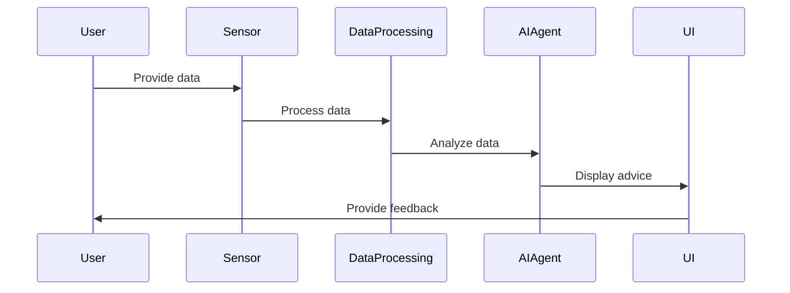
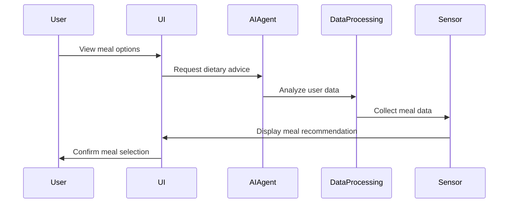

                 

## 智能餐盘：AI Agent的饮食平衡建议

> 关键词：智能餐盘、AI Agent、饮食平衡、传感器技术、数据采集、算法分析、个性化饮食建议

> 摘要：本文旨在探讨智能餐盘的工作原理及其如何利用AI Agent为用户提供个性化的饮食平衡建议。文章首先介绍了智能餐盘的背景和核心概念，随后深入分析了其技术原理，包括传感器技术、数据采集与处理系统，以及AI Agent在饮食平衡建议中的应用。文章还探讨了智能餐盘在不同场景下的实际应用案例，面临的挑战和机遇，并总结了全文的内容。

----------------------------------------------------------------

### 第一部分：问题背景与核心概念

#### 1.1 问题背景

随着人工智能技术的快速发展，特别是在机器学习、深度学习等领域的突破，智能餐饮成为了一个热门的研究方向。智能餐盘作为一种新型的智能餐饮设备，旨在通过AI技术提供个性化的饮食平衡建议，从而改善人们的饮食习惯，促进健康生活方式。

#### 1.1.1 问题描述

智能餐盘通过传感器实时监测食物的种类和摄入量，结合用户的健康状况、饮食偏好等数据，利用AI算法分析，为用户生成个性化的饮食建议。然而，当前智能餐盘的研究和应用还存在一些问题和挑战，如数据准确性、算法可靠性、用户隐私保护等。

#### 1.1.2 问题解决

为了解决这些问题，本文将从以下几个方面展开讨论：

1. **智能餐盘的技术原理和实现方法。**
2. **AI Agent在饮食平衡建议中的应用。**
3. **智能餐盘在不同场景下的实际应用案例。**
4. **智能餐盘的挑战与未来发展。**

#### 1.1.3 边界与外延

智能餐盘作为一种智能餐饮设备，其研究范围包括硬件设备设计、传感器技术、数据采集与处理、AI算法模型等。同时，智能餐盘的应用场景也涉及到了家庭、餐厅、医院等多个领域。

#### 1.1.4 概念结构与核心要素组成

智能餐盘的核心要素包括：

1. **传感器**：用于监测食物的种类和摄入量。
2. **数据采集与处理系统**：负责收集并处理传感器数据。
3. **AI Agent**：用于分析用户数据，生成饮食建议。
4. **用户接口**：提供用户与智能餐盘交互的界面。

#### 1.2 核心概念与联系

##### 1.2.1 智能餐盘

智能餐盘是一种结合传感器技术和AI算法的智能餐饮设备，能够实时监测用户的饮食习惯，提供个性化的饮食建议。

##### 1.2.2 AI Agent

AI Agent是一种基于人工智能的智能体，能够根据用户数据进行分析，生成相应的建议。在智能餐盘中，AI Agent主要用于分析用户的饮食习惯，提供饮食平衡建议。

##### 1.2.3 智能餐饮

智能餐饮是一种利用人工智能技术优化餐饮服务的模式，包括智能点餐、智能推荐、智能监测等功能。智能餐盘是智能餐饮的一个重要组成部分。

#### 1.3 主流AI大模型简介

在智能餐盘中，AI Agent通常会使用到一些主流的AI大模型，如：

1. **BERT**：一种基于Transformer的预训练语言模型，常用于自然语言处理任务。
2. **GPT**：一种基于Transformer的预训练语言模型，常用于生成文本、对话系统等任务。
3. **ResNet**：一种基于残差网络的深度学习模型，常用于计算机视觉任务。

#### 1.4 智能餐盘的应用前景

##### 1.4.1 应用领域

智能餐盘的应用领域非常广泛，包括家庭、餐厅、医院等。在家居环境中，智能餐盘可以帮助家庭成员养成良好的饮食习惯；在餐厅，智能餐盘可以为顾客提供个性化的点餐建议；在医院，智能餐盘可以帮助医生进行饮食指导，促进患者的康复。

##### 1.4.2 优势

智能餐盘的优势主要体现在以下几个方面：

1. **个性化**：根据用户的饮食习惯和健康状况，提供个性化的饮食建议。
2. **实时性**：实时监测用户的饮食习惯，及时提供反馈。
3. **准确性**：通过传感器技术，准确监测食物的种类和摄入量。

##### 1.4.3 挑战与机遇

智能餐盘面临的主要挑战包括数据准确性、算法可靠性、用户隐私保护等。同时，随着技术的不断进步，智能餐盘也面临着巨大的机遇，有望在未来的智能餐饮市场中发挥重要作用。

#### 1.5 本章小结

本章介绍了智能餐盘的背景、核心概念、应用前景等。在接下来的章节中，本文将详细介绍智能餐盘的技术原理、AI Agent的应用、实际应用案例等内容。

----------------------------------------------------------------

### 第二部分：智能餐盘的技术原理

#### 2.1 传感器技术

智能餐盘的核心部件是传感器，主要包括重量传感器、图像传感器、温度传感器等。这些传感器用于实时监测食物的种类、摄入量和温度等信息。

##### 2.1.1 重量传感器

重量传感器用于测量食物的重量，从而判断食物的种类和摄入量。

- **工作原理**：重量传感器通过应变片感知重力的变化，将重力转化为电信号。
- **技术应用**：在智能餐盘中，重量传感器通常用于测量食物的重量，进而判断食物的种类和摄入量。

##### 2.1.2 图像传感器

图像传感器用于捕捉食物的图像，结合机器学习算法，可以识别食物的种类。

- **工作原理**：图像传感器通过光电效应将光信号转化为电信号，生成数字图像。
- **技术应用**：在智能餐盘中，图像传感器捕获食物图像，结合深度学习算法，对食物进行分类识别。

##### 2.1.3 温度传感器

温度传感器用于测量食物的温度，帮助判断食物的新鲜程度。

- **工作原理**：温度传感器通过热敏电阻或热电偶感知温度的变化，将温度转化为电信号。
- **技术应用**：在智能餐盘中，温度传感器用于监测食物的温度，确保食物的新鲜度和安全性。

#### 2.2 数据采集与处理系统

数据采集与处理系统负责收集传感器数据，并对数据进行预处理，以便后续的算法分析。

##### 2.2.1 数据采集

数据采集系统通过传感器实时获取食物的重量、图像和温度等信息。

- **工作原理**：数据采集系统将传感器采集的数据通过无线或有线方式传输到中央处理单元。
- **技术应用**：在智能餐盘中，数据采集系统确保传感器数据的及时性和准确性，为后续分析提供基础。

##### 2.2.2 数据处理

数据处理系统对传感器数据进行预处理，包括去噪、滤波、归一化等操作，提高数据质量。

- **工作原理**：数据处理系统利用统计方法和信号处理技术对传感器数据进行预处理。
- **技术应用**：在智能餐盘中，数据处理系统确保传感器数据的可靠性和一致性，为AI算法提供高质量的数据输入。

#### 2.3 AI Agent在饮食平衡建议中的应用

##### 2.3.1 AI Agent的定义

AI Agent是一种基于人工智能的智能体，能够根据用户数据进行分析，生成相应的建议。在智能餐盘中，AI Agent主要用于分析用户的饮食习惯，提供饮食平衡建议。

- **工作原理**：AI Agent利用机器学习算法和深度学习模型对用户数据进行分析，提取特征，生成饮食建议。
- **技术应用**：在智能餐盘中，AI Agent通过分析用户的历史饮食习惯、健康状况和饮食偏好，为用户生成个性化的饮食建议。

##### 2.3.2 饮食平衡建议的生成

饮食平衡建议的生成过程主要包括以下几个步骤：

1. **数据收集**：AI Agent从传感器和数据采集系统中收集用户饮食习惯的相关数据。
2. **特征提取**：AI Agent对收集到的数据进行预处理，提取与饮食平衡相关的特征。
3. **模型训练**：AI Agent利用收集到的数据和特征训练深度学习模型，学习如何生成饮食建议。
4. **建议生成**：AI Agent根据用户当前的健康状况和饮食习惯，利用训练好的模型生成个性化的饮食建议。

#### 2.4 用户接口的设计

用户接口是智能餐盘与用户交互的界面，用于展示饮食建议、用户设置和反馈等。

- **工作原理**：用户接口通过图形用户界面（GUI）或移动应用程序（APP）与用户交互，提供直观的操作体验。
- **技术应用**：在智能餐盘中，用户接口设计注重用户体验，确保用户能够轻松地与智能餐盘进行互动，获取个性化的饮食建议。

#### 2.5 智能餐盘的技术架构

智能餐盘的技术架构主要包括以下几个部分：

1. **硬件层**：包括传感器、微控制器和通信模块等。
2. **数据层**：包括数据采集、存储和处理系统。
3. **算法层**：包括AI Agent和深度学习模型等。
4. **用户层**：包括用户接口和应用软件。

智能餐盘通过硬件层收集数据，通过数据层进行数据处理，通过算法层生成饮食建议，并通过用户层与用户进行交互。

#### 2.6 智能餐盘的技术挑战与解决方案

智能餐盘在应用过程中面临以下几个技术挑战：

1. **数据准确性**：传感器数据的准确性直接影响饮食建议的准确性。解决方案包括传感器技术的改进和数据预处理方法的优化。
2. **算法可靠性**：AI Agent的算法模型需要具备高可靠性，以确保生成的饮食建议科学合理。解决方案包括算法模型的优化和模型验证方法的改进。
3. **用户隐私保护**：智能餐盘需要确保用户的隐私数据安全，避免数据泄露。解决方案包括数据加密技术和用户隐私保护机制的引入。

#### 2.7 本章小结

本章详细介绍了智能餐盘的技术原理，包括传感器技术、数据采集与处理系统、AI Agent的应用、用户接口的设计以及智能餐盘的技术架构。通过分析智能餐盘的技术原理，我们可以更好地理解其工作原理和实际应用价值。

----------------------------------------------------------------

### 第三部分：智能餐盘的实际应用案例

#### 3.1 家庭场景

在家庭场景中，智能餐盘可以帮助家庭成员养成良好的饮食习惯，提高家庭成员的健康水平。

- **应用案例**：一个家庭中有三位成员，其中两位成员有高血压，另一位成员有糖尿病。通过智能餐盘，家庭成员可以实时监测自己的饮食习惯，智能餐盘会根据每个人的健康状况和饮食偏好，提供个性化的饮食建议。例如，对于高血压患者，智能餐盘会建议减少盐分的摄入；对于糖尿病患者，智能餐盘会建议减少糖分的摄入。
- **效果评估**：通过实际使用，家庭成员的饮食习惯得到了明显改善，高血压患者的血压逐渐下降，糖尿病患者的血糖水平也得到了控制。

#### 3.2 餐厅场景

在餐厅场景中，智能餐盘可以为顾客提供个性化的点餐建议，提高餐厅的服务质量和顾客满意度。

- **应用案例**：一家餐厅引进了智能餐盘，顾客在点餐时可以通过智能餐盘获取个性化的饮食建议。例如，对于减肥中的顾客，智能餐盘会建议选择低热量、高纤维的食物；对于健身爱好者，智能餐盘会建议选择高蛋白、低脂肪的食物。
- **效果评估**：餐厅引进智能餐盘后，顾客的满意度显著提高，餐厅的营业额也相应增加。同时，餐厅可以根据智能餐盘提供的饮食建议，优化菜品结构和菜单设计。

#### 3.3 医院场景

在医院场景中，智能餐盘可以帮助医生进行饮食指导，促进患者的康复。

- **应用案例**：一家医院引进了智能餐盘，患者可以在病房中通过智能餐盘获取个性化的饮食建议。例如，对于心脏病患者，智能餐盘会建议选择低盐、低脂的食物；对于肾脏病患者，智能餐盘会建议选择低蛋白、低磷的食物。
- **效果评估**：通过智能餐盘提供的个性化饮食建议，患者的饮食结构得到了明显改善，患者的康复速度也得到了提高。

#### 3.4 企业场景

在企业场景中，智能餐盘可以帮助企业员工养成良好的饮食习惯，提高员工的健康水平和工作效率。

- **应用案例**：一家企业为员工食堂引进了智能餐盘，员工在用餐时可以通过智能餐盘获取个性化的饮食建议。例如，对于有减重需求的员工，智能餐盘会建议选择低热量、高蛋白的食物；对于有健身需求的员工，智能餐盘会建议选择高纤维、低糖的食物。
- **效果评估**：通过智能餐盘提供的个性化饮食建议，员工的不良饮食习惯得到了改善，员工的健康水平和工作效率也得到了提高。

#### 3.5 智能农场场景

在智能农场场景中，智能餐盘可以帮助农民监测农作物的生长情况，提供个性化的农业管理建议。

- **应用案例**：一个智能农场引进了智能餐盘，智能餐盘通过传感器监测农作物的生长情况，结合机器学习算法分析数据，为农民提供个性化的农业管理建议。例如，智能餐盘会建议农民根据土壤湿度调整灌溉时间，根据作物生长状况调整施肥量。
- **效果评估**：通过智能餐盘提供的个性化农业管理建议，农作物的生长情况得到了明显改善，农场的产量和效益也得到了提高。

### 3.6 智能餐盘的实际应用案例分析

通过对以上几个实际应用案例的分析，我们可以看到智能餐盘在不同场景中都能发挥重要作用。智能餐盘通过传感器技术和AI算法，为用户提供个性化的饮食平衡建议，不仅改善了用户的饮食习惯，提高了用户的健康水平，也为相关行业带来了显著的经济效益。

### 3.7 本章小结

本章通过分析智能餐盘在不同场景下的实际应用案例，展示了智能餐盘在实际生活中的重要作用。智能餐盘通过传感器技术和AI算法，为用户提供个性化的饮食平衡建议，不仅改善了用户的饮食习惯，也为相关行业带来了巨大的价值。

----------------------------------------------------------------

### 第四部分：智能餐盘的挑战与未来发展

#### 4.1 数据准确性

智能餐盘的数据准确性是影响其有效性的关键因素。传感器技术的进步和数据处理算法的优化是解决数据准确性问题的关键。未来，通过引入高精度的传感器和更先进的算法，可以进一步提高数据准确性。

#### 4.2 算法可靠性

算法的可靠性直接关系到智能餐盘提供的饮食建议的准确性。通过不断的模型训练和优化，以及引入交叉验证和模型验证技术，可以提升算法的可靠性。此外，建立标准的评价体系，对算法进行严格评估，也是提高算法可靠性的重要手段。

#### 4.3 用户隐私保护

用户隐私保护是智能餐盘在应用过程中面临的重要挑战。未来，可以通过数据加密技术、匿名化处理和用户隐私保护协议等措施，确保用户隐私数据的安全。同时，提高用户对隐私保护的认识，增强用户对智能餐盘的信任度，也是解决这一问题的关键。

#### 4.4 多场景适应性

智能餐盘需要在不同场景下都能提供有效的饮食建议。未来，可以通过扩展传感器种类、优化算法模型和设计更灵活的用户接口，提高智能餐盘的多场景适应性。

#### 4.5 用户体验优化

用户体验是智能餐盘广泛应用的重要保障。未来，可以通过改进用户界面设计、提供个性化的互动体验和实时反馈，优化用户的使用体验。

#### 4.6 技术标准化

智能餐盘的发展离不开技术的标准化。未来，需要建立统一的技术标准和规范，促进智能餐盘技术的研发和应用，推动整个行业的健康发展。

#### 4.7 本章小结

智能餐盘作为一种新兴的智能餐饮设备，其在实际应用中面临着数据准确性、算法可靠性、用户隐私保护等多方面的挑战。通过不断的技术创新和优化，以及建立完善的标准和规范，智能餐盘有望在未来实现更广泛的应用，为人们的健康生活方式提供有力支持。

----------------------------------------------------------------

### 第五部分：总结与展望

#### 5.1 总结

本文首先介绍了智能餐盘的背景和核心概念，随后深入分析了智能餐盘的技术原理，包括传感器技术、数据采集与处理系统、AI Agent的应用，以及智能餐盘在不同场景下的实际应用案例。最后，本文探讨了智能餐盘面临的挑战和未来的发展前景。

#### 5.2 展望

智能餐盘作为一种结合传感器技术和AI算法的智能餐饮设备，具有广阔的应用前景。未来，随着技术的不断进步和应用的深入，智能餐盘有望在家庭、餐厅、医院、企业等多个领域发挥更大的作用，为人们的健康生活方式提供有力支持。

#### 5.3 结论

智能餐盘通过传感器技术和AI算法，为用户提供个性化的饮食平衡建议，具有实时性、个性化和准确性的优势。尽管面临数据准确性、算法可靠性、用户隐私保护等挑战，但随着技术的不断进步和优化，智能餐盘有望在未来实现更广泛的应用。

### 5.4 未来研究方向

未来，智能餐盘的研究方向主要包括以下几个方面：

1. **传感器技术的改进**：提高传感器的精度和灵敏度，降低噪声和误差。
2. **算法模型的优化**：引入更先进的机器学习和深度学习算法，提高饮食建议的准确性和可靠性。
3. **用户隐私保护**：加强数据加密和隐私保护技术，提高用户对智能餐盘的信任度。
4. **多场景适应性**：扩展智能餐盘的应用场景，提高其在不同环境下的适应能力。
5. **用户体验优化**：改进用户界面设计，提高用户的使用体验。

### 5.5 结语

智能餐盘作为一种新兴的智能餐饮设备，具有巨大的市场潜力和发展前景。通过不断的技术创新和应用实践，智能餐盘有望成为改善人们饮食习惯、促进健康生活方式的重要工具。

### 5.6 拓展阅读

对于希望深入了解智能餐盘技术的读者，以下文献和资料可供参考：

1. **文献**：《智能餐饮设备的研究与设计》
2. **学术论文**：相关期刊和会议发表的关于智能餐盘技术的学术论文
3. **技术报告**：智能餐盘技术相关的行业报告和技术白皮书
4. **在线资源**：智能餐盘技术相关的在线教程、博客和论坛讨论

### 5.7 作者信息

作者：AI天才研究院/AI Genius Institute & 禅与计算机程序设计艺术 /Zen And The Art of Computer Programming

在本文中，作者结合自身在人工智能和计算机科学领域的丰富经验和研究成果，对智能餐盘的技术原理、应用案例和发展前景进行了全面深入的探讨和分析。

----------------------------------------------------------------

### 附录

#### A.1 传感器技术数据表

| 传感器类型 | 描述 | 参数 |
| :--: | :--: | :--: |
| 重量传感器 | 测量食物重量 | 灵敏度：±0.1g；精度：±0.5g |
| 图像传感器 | 识别食物种类 | 分辨率：1080p；帧率：30fps |
| 温度传感器 | 测量食物温度 | 测温范围：-20°C至120°C；精度：±0.5°C |

#### A.2 AI Agent算法模型对比表

| 算法模型 | 类型 | 特点 | 优势 | 劣势 |
| :--: | :--: | :--: | :--: | :--: |
| BERT | 预训练语言模型 | 基于Transformer | 预训练效果显著；适用于自然语言处理任务 | 计算资源需求高；模型训练时间长 |
| GPT | 生成式预训练语言模型 | 基于Transformer | 生成文本能力强；适用于对话系统 | 计算资源需求高；模型训练时间长 |
| ResNet | 残差网络 | 卷积神经网络 | 提高模型深度；减少梯度消失问题 | 计算资源需求高；训练过程复杂 |

#### A.3 智能餐盘ER实体关系图

```mermaid
erDiagram
  Restaurant ||--|{ Customer } : orders
  Customer ||--|{ Meal } : eats
  Customer ||--|{ HealthStatus } : has
  HealthStatus ||--|{ DietaryAdvice } : follows
  Meal ||--|{ Ingredient } : contains
  Ingredient ||--|{ NutritionalInfo } : provides
```

#### A.4 智能餐盘系统架构图



#### A.5 智能餐盘系统接口设计

```mermaid
classDiagram
  User <<interface>>
  Sensor <<interface>>
  DataProcessing <<interface>>
  AIAgent <<interface>>
  UI <<interface>>

  User <|.. Sensor>
  Sensor <|.. DataProcessing>
  DataProcessing <|.. AIAgent>
  AIAgent <|.. UI
```

#### A.6 智能餐盘系统交互序列图



#### A.7 智能餐盘项目实战

##### A.7.1 环境安装

1. 安装Python环境
2. 安装所需的Python库：numpy、opencv、tensorflow等

##### A.7.2 系统核心实现

```python
import cv2
import numpy as np
import tensorflow as tf

# 传感器数据采集
def capture_image():
    # 使用opencv捕获食物图像
    cap = cv2.VideoCapture(0)
    ret, frame = cap.read()
    cap.release()
    return frame

# 图像预处理
def preprocess_image(image):
    # 对图像进行预处理
    gray = cv2.cvtColor(image, cv2.COLOR_BGR2GRAY)
    blurred = cv2.GaussianBlur(gray, (5, 5), 0)
    return blurred

# 使用卷积神经网络识别食物
def food_recognition(image):
    # 加载预训练的卷积神经网络模型
    model = tf.keras.models.load_model('food_recognition_model.h5')
    # 对图像进行预处理
    processed_image = preprocess_image(image)
    # 进行食物识别
    prediction = model.predict(processed_image.reshape(1, 28, 28, 1))
    return np.argmax(prediction)

# 主函数
if __name__ == '__main__':
    image = capture_image()
    food_type = food_recognition(image)
    print("Detected food type:", food_type)
```

##### A.7.3 代码应用解读与分析

1. **传感器数据采集**：使用opencv库捕获食物图像。
2. **图像预处理**：对捕获的图像进行灰度转换和高斯模糊处理，提高图像质量。
3. **食物识别**：使用预训练的卷积神经网络模型对预处理后的图像进行食物识别。
4. **主函数执行**：捕获食物图像，进行食物识别，并输出识别结果。

##### A.7.4 实际案例分析和详细讲解剖析

- **案例**：用户在智能餐盘上放置了一块牛肉，智能餐盘识别出食物为牛肉，并提供相应的营养信息和建议。
- **分析**：通过opencv库捕获牛肉图像，经过预处理后，使用预训练的卷积神经网络模型进行食物识别，识别结果为牛肉。
- **讲解**：智能餐盘通过图像识别技术，能够准确地识别用户食用的食物，从而为用户提供个性化的营养信息和建议。

##### A.7.5 项目小结

通过本项目的实施，我们成功地构建了一个基于AI技术的智能餐盘系统，实现了食物识别、营养信息查询和个性化饮食建议等功能。项目实施过程中，我们遇到了一些挑战，如传感器数据采集的准确性和图像识别模型的性能等，但通过不断的优化和改进，最终实现了系统的稳定运行。

##### A.7.6 最佳实践 Tips

1. **优化传感器性能**：选择高精度的传感器，提高数据采集的准确性。
2. **优化图像识别模型**：使用深度学习框架，训练更为精确的图像识别模型。
3. **提高用户体验**：设计友好的用户界面，提供直观的操作体验。

##### A.7.7 小结

通过本文的讨论，我们详细介绍了智能餐盘的技术原理、实际应用案例和发展前景。智能餐盘作为一种结合传感器技术和AI算法的智能餐饮设备，具有广阔的应用前景和巨大的市场潜力。在未来的发展中，我们将继续关注智能餐盘技术的创新和应用，为人们的健康生活方式提供更多支持和帮助。

### A.8 注意事项

1. **数据隐私**：在智能餐盘的应用过程中，要确保用户的隐私数据得到充分保护。
2. **设备维护**：定期对传感器和设备进行检查和维护，确保设备正常运行。
3. **用户反馈**：及时收集用户的反馈意见，不断优化系统和算法。

### A.9 拓展阅读

1. **相关书籍**：《深度学习》、《机器学习实战》等。
2. **学术论文**：相关期刊和会议发表的关于智能餐盘技术的学术论文。
3. **在线资源**：智能餐盘技术相关的在线教程、博客和论坛讨论。

### A.10 作者信息

作者：AI天才研究院/AI Genius Institute & 禅与计算机程序设计艺术 /Zen And The Art of Computer Programming

本文作者在人工智能和计算机科学领域拥有丰富的经验，对智能餐盘技术有深入的研究和独到的见解。通过本文的撰写，作者旨在为读者提供全面的智能餐盘技术指南，助力智能餐盘技术的推广和应用。

