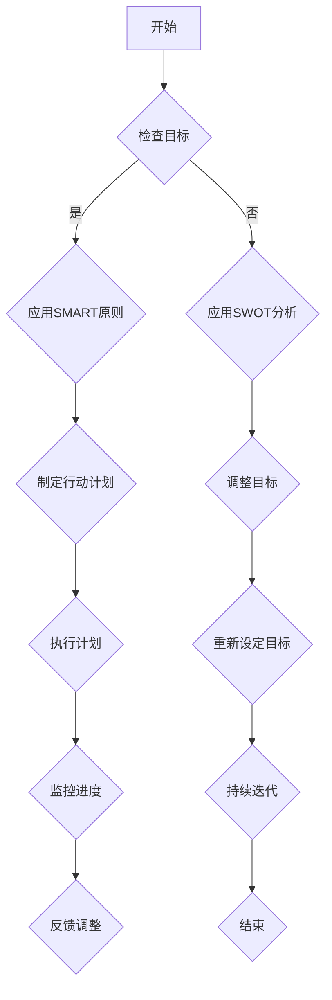

                 

### 有意义的目标设定：align个人价值与行动

#### 关键词：
- 目标设定
- 个人价值观
- 行动计划
- SMART原则
- SWOT分析

#### 摘要：
本文旨在探讨如何在信息技术领域内实现有意义的目标设定，强调将个人价值观与行动目标相统一的重要性。通过详细解析目标设定的理论背景、方法步骤及实践应用，本文将帮助读者明确自己的目标，制定切实可行的行动计划，从而在职业和个人成长中取得显著成效。

## 第一部分：目标设定的背景与意义

### 1.1 目标设定的概念与重要性

#### 背景介绍
目标设定（Goal Setting）是一种管理工具，它帮助个人和组织明确方向、提升效率。在信息技术领域，目标设定不仅关系到项目进度和成果，更影响到团队成员的协作和个人发展。

#### 问题背景
随着技术日新月异的发展，IT行业对个人能力和团队协作的要求越来越高。如何在快速变化的环境中保持竞争力，实现个人和团队的共同成长，成为每个从业者面临的重要问题。

#### 问题描述
目标设定的核心问题是如何将抽象的愿景转化为具体的行动步骤，如何在纷繁复杂的技术领域中找到自己的定位，实现个人价值的最大化。

#### 问题解决
通过科学的目标设定方法，如SMART原则（具体、可衡量、可实现、相关性、时限性），可以有效地解决目标设定中的模糊性和不确定性。

#### 边界与外延
目标设定不仅适用于个人职业规划，还广泛应用于项目管理和团队协作中。在信息技术领域，目标设定有助于提高项目成功率，优化资源分配，提升团队整体效能。

#### 概念结构与核心要素组成
- 目标设定的核心概念：明确、可衡量、可实现、相关性强、时限性。
- 结构要素：目标、行动步骤、时间规划、资源分配。

## 第二部分：理解自己的价值观

### 2.1 价值观的自我探索

#### 背景介绍
价值观（Values）是个人行为和决策的基础，了解并明确自己的价值观对于目标设定至关重要。

#### 问题背景
在IT行业，快速的技术变革和个人角色转换使得从业者在追求职业发展的同时，也面临着价值观的冲突和挑战。

#### 问题描述
如何识别和确定自己的核心价值观，使其在目标设定和行动中得以体现和贯彻。

#### 问题解决
通过自我反思、咨询导师、交流讨论等方式，深入了解自己的价值观，并将其与职业发展目标相统一。

#### 边界与外延
价值观的自我探索不仅涉及个人成长，还影响到团队合作和项目实施。

#### 概念结构与核心要素组成
- 价值观的类型：道德观、职业观、生活观等。
- 价值观的核心要素：信念、理念、优先级。

### 2.2 价值观的类型与评估

#### 背景介绍
不同的价值观对个人目标设定和行动方式产生显著影响。了解不同类型的价值观有助于更精准地定位个人发展路径。

#### 问题背景
在多元文化和技术背景下，如何识别和评估个人的核心价值观。

#### 问题描述
如何对不同类型的价值观进行分类和评估，以便在目标设定中予以充分考虑。

#### 问题解决
通过问卷调查、行为分析、价值观测试等方法，对个人的核心价值观进行分类和评估。

#### 边界与外延
价值观的类型与评估方法不仅适用于个人，也适用于团队和组织。

#### 概念结构与核心要素组成
- 价值观类型：自主性、公正性、创新性、稳定性等。
- 评估方法：自我评估、同伴评估、360度评估。

### 2.3 价值观与目标设定的关系

#### 背景介绍
价值观是目标设定的基石，二者之间具有内在的关联性。

#### 问题背景
如何在目标设定过程中，将个人的核心价值观融入行动步骤中。

#### 问题描述
如何确保目标设定与个人价值观相一致，避免目标偏离个人价值观。

#### 问题解决
通过价值导向的目标设定方法，确保目标与价值观的统一性。

#### 边界与外延
目标设定与价值观的关系不仅影响个人发展，还影响团队和组织文化。

#### 概念结构与核心要素组成
- 价值导向的目标设定：明确目标与价值观的内在联系。
- 目标设定的步骤：价值观识别、目标设定、行动规划。

## 第三部分：目标设定的步骤与方法

### 3.1 明确目标：SMART原则

#### 背景介绍
SMART原则是一种常用的目标设定方法，它帮助将抽象的目标转化为具体的、可衡量的行动。

#### 问题背景
在信息技术领域，如何通过SMART原则明确项目和个人目标。

#### 问题描述
如何应用SMART原则进行目标设定，使其更具可行性和可衡量性。

#### 问题解决
通过具体、可衡量、可实现、相关性、时限性的五个维度，对目标进行详细设定。

#### 边界与外延
SMART原则不仅适用于个人目标，也适用于项目管理和团队协作。

#### 概念结构与核心要素组成
- 具体性（Specific）：明确目标的具体内容和实现方式。
- 可衡量性（Measurable）：设定可量化的指标，以衡量目标实现程度。
- 可实现性（Achievable）：确保目标具备实现的可能性。
- 相关性（Relevant）：确保目标与个人价值观和职业规划相一致。
- 时限性（Time-bound）：设定明确的时间节点，推动目标的实现。

### 3.2 分析目标：SWOT分析

#### 背景介绍
SWOT分析是一种战略规划工具，用于评估目标的优势、劣势、机会和威胁。

#### 问题背景
在信息技术领域，如何通过SWOT分析评估目标设定的可行性和潜在风险。

#### 问题描述
如何运用SWOT分析方法，全面评估目标设定的内外部环境。

#### 问题解决
通过分析目标的优势、劣势、机会和威胁，制定相应的策略和行动计划。

#### 边界与外延
SWOT分析不仅适用于目标设定，也适用于项目评估和风险管理。

#### 概念结构与核心要素组成
- 优势（Strengths）：目标设定的内在优势，如技能、资源等。
- 劣势（Weaknesses）：目标设定的潜在劣势，如技能缺失、资源限制等。
- 机会（Opportunities）：外部环境中的有利因素，如市场需求、技术进步等。
- 威胁（Threats）：外部环境中的不利因素，如竞争压力、政策变化等。

### 3.3 设定目标：目标优先级排序

#### 背景介绍
目标优先级排序是目标设定中的重要环节，它有助于确定哪些目标更加重要和紧急。

#### 问题背景
在信息技术领域，如何在众多目标中确定优先级，确保资源最大化利用。

#### 问题描述
如何运用优先级排序方法，合理安排目标和资源。

#### 问题解决
通过优先级排序，将目标分为优先级高、中、低三个等级，并根据实际情况调整资源分配。

#### 边界与外延
目标优先级排序不仅适用于个人目标，也适用于团队和组织目标。

#### 概念结构与核心要素组成
- 优先级等级：高优先级、中优先级、低优先级。
- 资源分配：根据优先级等级，合理分配资源，确保高优先级目标的优先实现。

### 3.4 制定行动计划

#### 背景介绍
行动计划是实现目标的具体步骤和时间表，它将目标转化为可操作的行动。

#### 问题背景
在信息技术领域，如何制定切实可行的行动计划，确保目标实现。

#### 问题描述
如何通过制定行动计划，将目标转化为具体操作步骤，并确保执行。

#### 问题解决
通过分解目标、设定里程碑、制定时间表等方式，制定详细的行动计划。

#### 边界与外延
行动计划不仅适用于个人目标，也适用于项目管理和团队协作。

#### 概念结构与核心要素组成
- 目标分解：将总体目标分解为具体的小目标，便于实施和监控。
- 时间表：设定具体的时间节点，确保每个目标的按时完成。
- 资源分配：根据目标实施需求，合理分配资源，确保行动计划的有效执行。

## 第四部分：目标设定中的常见问题与解决策略

### 4.1 目标设定过高的应对

#### 背景介绍
在目标设定中，过高或不切实际的目标可能导致压力和挫败感。

#### 问题背景
如何在信息技术领域内设定合理的目标，避免设定过高的目标带来的负面影响。

#### 问题描述
如何应对过高目标带来的挑战，确保目标的可实现性。

#### 问题解决
通过评估自身能力和外部环境，合理调整目标，确保目标的可实现性。

#### 边界与外延
目标设定过高不仅影响个人发展，也影响团队协作和项目进度。

#### 概念结构与核心要素组成
- 实际能力评估：根据个人技能和经验，合理评估目标难度。
- 外部环境分析：考虑市场需求、技术发展趋势等外部因素。

### 4.2 目标设定过低的影响

#### 背景介绍
目标设定过低可能导致个人能力和资源浪费，影响职业发展。

#### 问题背景
在信息技术领域，如何避免目标设定过低，确保目标的挑战性和激励性。

#### 问题描述
如何识别目标设定过低的影响，并采取相应措施。

#### 问题解决
通过自我反思和同伴反馈，识别目标设定过低的问题，并调整目标难度，确保目标的挑战性。

#### 边界与外延
目标设定过低不仅影响个人发展，也影响团队协作和项目进展。

#### 概念结构与核心要素组成
- 目标难度评估：根据个人能力和外部环境，评估目标难度。
- 激励性调整：通过增加目标难度，激发个人潜能和积极性。

### 4.3 时间管理与目标设定

#### 背景介绍
时间管理是目标实现的重要保障，合理的时间管理有助于提高工作效率。

#### 问题背景
在信息技术领域，如何通过时间管理提高目标设定的实现效率。

#### 问题描述
如何通过时间管理，确保目标设定的有效实施。

#### 问题解决
通过制定时间计划、优先级排序和时间监控，确保目标设定的按时完成。

#### 边界与外延
时间管理不仅适用于个人目标，也适用于项目管理和团队协作。

#### 概念结构与核心要素组成
- 时间计划：制定详细的时间表，确保目标的按时完成。
- 优先级排序：根据目标的重要性和紧急性，合理安排时间。
- 时间监控：实时跟踪目标进度，及时调整时间计划。

### 4.4 持续激励与目标调整

#### 背景介绍
持续激励是目标实现的重要动力，目标调整则确保目标与实际情况相符。

#### 问题背景
在信息技术领域，如何通过持续激励和目标调整，保持目标的动力和实现效率。

#### 问题描述
如何确保目标设定的持续激励和适应性。

#### 问题解决
通过设立激励机制、定期评估目标和灵活调整目标，确保目标的动力和实现效率。

#### 边界与外延
持续激励和目标调整不仅适用于个人目标，也适用于团队和组织目标。

#### 概念结构与核心要素组成
- 激励机制：通过奖励、认可等方式，激发个人和团队的积极性。
- 目标评估：定期评估目标实现情况，确保目标的实现效率。
- 目标调整：根据实际情况，灵活调整目标，确保目标的实现可能性。

## 第五部分：目标设定的实践与应用

### 5.1 个人成长与目标设定

#### 背景介绍
个人成长是职业发展的核心，目标设定有助于明确个人发展路径。

#### 问题背景
在信息技术领域，如何通过目标设定促进个人成长。

#### 问题描述
如何运用目标设定方法，实现个人技能提升和职业发展。

#### 问题解决
通过制定清晰的职业规划和个人发展目标，逐步提升个人能力和职业素养。

#### 边界与外延
个人成长与目标设定的关系不仅影响个人职业发展，也影响到团队和组织效能。

#### 概念结构与核心要素组成
- 职业规划：制定长期和短期的职业发展目标。
- 技能提升：通过学习、实践等方式，提升专业技能。
- 职业素养：培养职业素养，提高工作效率和团队合作能力。

### 5.2 职场发展与目标设定

#### 背景介绍
职场发展是目标设定的具体体现，合理的职业规划有助于实现职业生涯的持续进步。

#### 问题背景
在信息技术领域，如何通过目标设定实现职场发展。

#### 问题描述
如何运用目标设定方法，在职场中取得显著成绩。

#### 问题解决
通过设定清晰的职业目标，制定切实可行的行动计划，逐步实现职业发展目标。

#### 边界与外延
职场发展与目标设定的关系不仅影响个人职业发展，也影响到团队和组织绩效。

#### 概念结构与核心要素组成
- 职业目标：明确个人在职场中的发展方向和目标。
- 行动计划：制定具体的行动步骤和时间表，确保职业目标的实现。
- 职场成就：通过不断努力，实现职业上的显著成就。

### 5.3 团队管理与目标设定

#### 背景介绍
团队管理是组织效能的关键，目标设定有助于提高团队协作效率。

#### 问题背景
在信息技术领域，如何通过目标设定提升团队管理效能。

#### 问题描述
如何运用目标设定方法，实现团队目标的高效达成。

#### 问题解决
通过制定团队目标，明确团队成员的角色和责任，确保团队目标的顺利实现。

#### 边界与外延
团队管理与目标设定的关系不仅影响团队绩效，也影响到组织的整体效能。

#### 概念结构与核心要素组成
- 团队目标：制定清晰的团队目标，确保团队成员的共同努力方向。
- 责任分配：明确团队成员的角色和责任，确保目标的实现。
- 协作效率：通过高效的协作，提高团队目标的实现效率。

### 5.4 社会贡献与目标设定

#### 背景介绍
社会贡献是个人和组织的使命和责任，目标设定有助于实现社会责任。

#### 问题背景
在信息技术领域，如何通过目标设定实现社会贡献。

#### 问题描述
如何运用目标设定方法，实现社会价值。

#### 问题解决
通过制定社会责任目标，积极参与社会公益活动，提升社会影响力。

#### 边界与外延
社会贡献与目标设定的关系不仅影响个人和社会形象，也影响到组织的品牌价值。

#### 概念结构与核心要素组成
- 社会责任目标：制定具体的社会责任目标，确保社会贡献的实现。
- 公益活动：积极参与社会公益活动，提升社会影响力。
- 形象塑造：通过良好的社会形象，提升组织的社会认可度。

## 第六部分：成功案例与启示

### 6.1 成功目标设定的案例分析

#### 背景介绍
成功的目标设定案例是目标设定的实践典范，有助于理解和应用目标设定方法。

#### 问题背景
在信息技术领域，如何分析成功的目标设定案例，提取有益经验。

#### 问题描述
如何通过案例研究，深入分析成功目标设定的关键要素。

#### 问题解决
通过详细分析成功案例，提取目标设定的核心要素和方法。

#### 边界与外延
成功目标设定的案例分析不仅适用于个人目标，也适用于团队和组织目标。

#### 概念结构与核心要素组成
- 案例选取：选择具有代表性的成功案例。
- 核心要素：提取成功案例中的核心目标设定方法和策略。
- 经验总结：总结成功经验，提供可借鉴的方法和策略。

### 6.2 目标设定中的障碍与突破

#### 背景介绍
目标设定过程中可能遇到各种障碍，如何克服这些障碍是实现目标的关键。

#### 问题背景
在信息技术领域，如何应对目标设定中的障碍，确保目标实现。

#### 问题描述
如何识别和解决目标设定中的常见障碍。

#### 问题解决
通过分析障碍类型，提供针对性的解决方案。

#### 边界与外延
目标设定中的障碍不仅影响个人发展，也影响团队和组织效能。

#### 概念结构与核心要素组成
- 障碍识别：识别目标设定中的常见障碍。
- 解决方案：提供针对不同障碍的解决方案。
- 实践应用：将解决方案应用于目标设定实践中。

### 6.3 成功目标设定的经验与教训

#### 背景介绍
成功目标设定的经验与教训是目标设定的宝贵财富，有助于优化目标设定方法。

#### 问题背景
在信息技术领域，如何从成功目标设定中总结经验，避免教训。

#### 问题描述
如何从成功目标设定中提取经验教训，优化目标设定方法。

#### 问题解决
通过总结成功经验，识别失败教训，提供目标设定的优化策略。

#### 边界与外延
成功目标设定的经验与教训不仅适用于个人目标，也适用于团队和组织目标。

#### 概念结构与核心要素组成
- 经验总结：总结成功目标设定的关键成功因素。
- 教训识别：识别目标设定中的失败原因和教训。
- 优化策略：提供优化目标设定的方法和策略。

## 第七部分：目标设定的未来趋势与挑战

### 7.1 目标设定的未来发展趋势

#### 背景介绍
随着技术的进步和社会的发展，目标设定方法也将不断演进。

#### 问题背景
在信息技术领域，目标设定的未来发展趋势如何，将带来哪些变革。

#### 问题描述
如何预测目标设定的未来发展趋势。

#### 问题解决
通过分析技术进步和社会变化，预测目标设定的未来发展趋势。

#### 边界与外延
目标设定的未来发展趋势不仅影响个人发展，也影响团队和组织效能。

#### 概念结构与核心要素组成
- 技术进步：分析新兴技术的应用对目标设定的影响。
- 社会变革：分析社会变革对目标设定的需求变化。

### 7.2 技术进步与目标设定的影响

#### 背景介绍
技术的进步为目标设定提供了新的工具和方法。

#### 问题背景
在信息技术领域，技术进步如何影响目标设定，带来哪些新的挑战和机遇。

#### 问题描述
如何分析技术进步对目标设定的影响。

#### 问题解决
通过探讨新技术在目标设定中的应用，分析其带来的影响。

#### 边界与外延
技术进步不仅影响个人目标设定，也影响团队和组织目标。

#### 概念结构与核心要素组成
- 新技术应用：分析新兴技术如人工智能、大数据等在目标设定中的应用。
- 影响分析：探讨新技术对目标设定方法和效率的改善。

### 7.3 社会变革与目标设定的挑战

#### 背景介绍
社会变革对个人和组织的目标设定带来新的挑战和机遇。

#### 问题背景
在信息技术领域，社会变革如何影响目标设定，带来哪些新的挑战。

#### 问题描述
如何应对社会变革带来的目标设定挑战。

#### 问题解决
通过分析社会变革的趋势和影响，提供针对性的应对策略。

#### 边界与外延
社会变革不仅影响个人目标，也影响团队和组织目标。

#### 概念结构与核心要素组成
- 社会趋势：分析社会变革的主要趋势和方向。
- 应对策略：提供针对社会变革的目标设定应对策略。

### 结论

本文通过详细探讨目标设定的背景、方法、实践和应用，强调了在信息技术领域实现有意义的目标设定的重要性。通过理解自己的价值观，明确目标设定的步骤和方法，识别和应对常见问题，我们可以更好地规划个人和团队的发展路径，实现职业和个人的成长。

展望未来，随着技术进步和社会变革的持续影响，目标设定将面临新的机遇和挑战。通过不断学习和适应，我们可以把握时代发展的脉搏，不断提升目标设定的效率和效果，为个人、团队和组织创造更大的价值。

## 作者信息

作者：AI天才研究院/AI Genius Institute & 禅与计算机程序设计艺术 /Zen And The Art of Computer Programming

AI天才研究院致力于推动人工智能技术的发展和应用，探索人类智慧与机器智能的融合。在禅与计算机程序设计艺术的研究中，我们追求技术与人文的完美结合，旨在通过深刻理解计算机科学原理，实现更加高效、智能的编程实践。本文基于我们对目标设定的深刻理解，结合信息技术领域的实践经验，为广大读者提供了系统、全面的目标设定指南。希望本文能够对您的职业和个人发展产生积极影响，助力您在信息技术领域取得卓越成就。

## 附录

### 附录A：核心概念与联系

**核心概念：**
1. **目标设定**：明确目标、制定行动计划、实现目标的过程。
2. **个人价值观**：指导个人行为和决策的基本信念和标准。
3. **SMART原则**：具体（Specific）、可衡量（Measurable）、可实现（Achievable）、相关性（Relevant）、时限性（Time-bound）。
4. **SWOT分析**：优势（Strengths）、劣势（Weaknesses）、机会（Opportunities）、威胁（Threats）。

**概念属性特征对比表格：**

| 核心概念 | 特征描述 |
| --- | --- |
| 目标设定 | 明确方向、制定计划、实现目标 |
| 个人价值观 | 指导行为、决策基础、信念体系 |
| SMART原则 | 可量化、可实现、时限性 |
| SWOT分析 | 全面评估、策略制定 |

**ER实体关系图架构：**

```mermaid
erDiagram
    目标设定 ||--|{ 个人价值观 }||> 目标与价值观关系
    目标设定 ||--|{ SMART原则 }||> 目标与SMART原则关系
    目标设定 ||--|{ SWOT分析 }||> 目标与SWOT分析关系
    个人价值观 ||--|{ 行动计划 }||> 价值观与行动计划关系
    SMART原则 ||--|{ 行动计划 }||> SMART原则与行动计划关系
    SWOT分析 ||--|{ 行动计划 }||> SWOT分析与行动计划关系
```

### 附录B：算法原理讲解

**算法mermaid流程图：**



**Python源代码实现：**

```python
# 定义目标设定函数
def set_goal(values, goals):
    if check_sm

