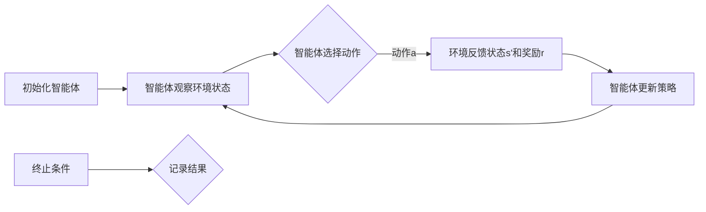
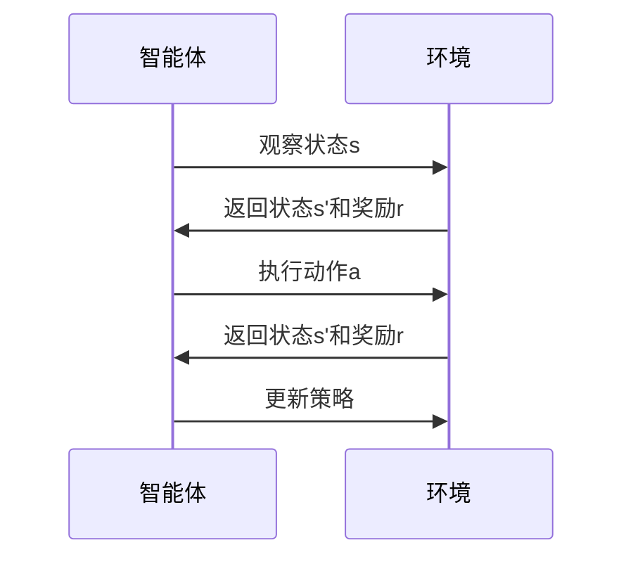
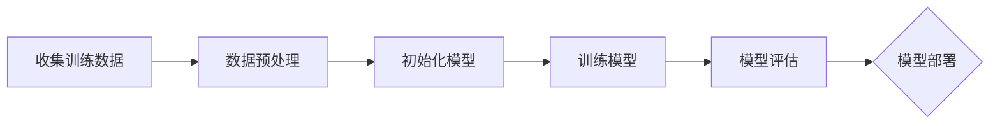
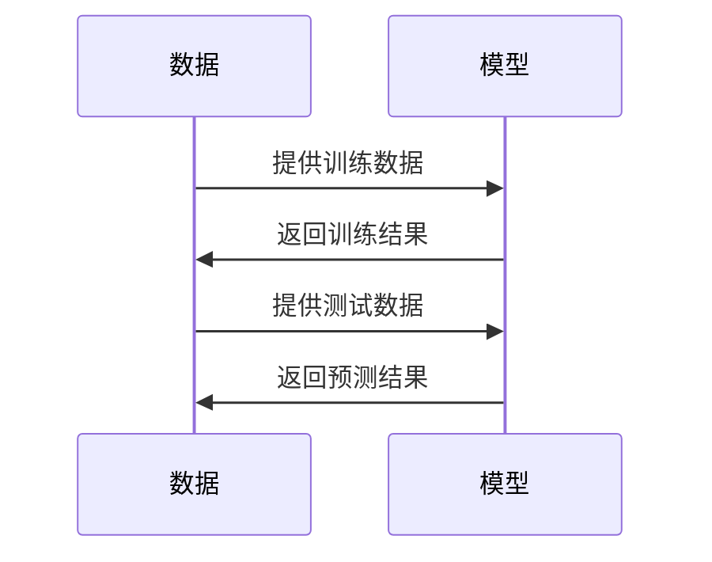
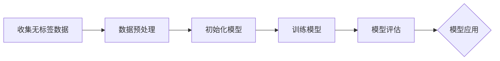
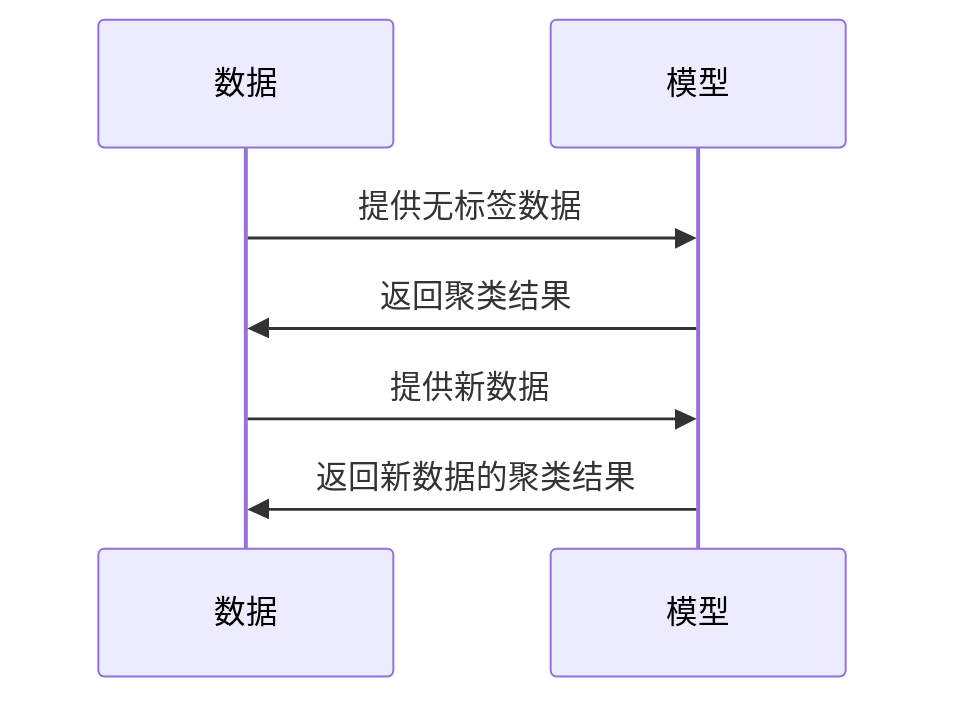
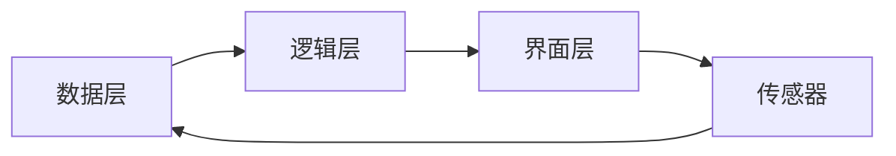
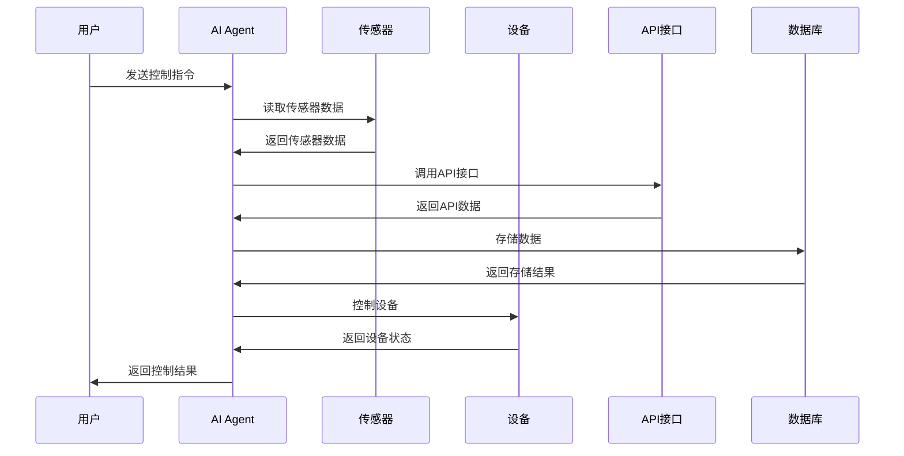

                 


### 文章标题：构建AI Agent常见挑战及解决方案

**关键词：** AI Agent、机器学习、深度学习、强化学习、系统架构、挑战与解决方案

**摘要：** 本文将深入探讨构建AI Agent过程中遇到的常见挑战，包括算法原理、数学模型、系统架构等方面。我们将通过逻辑清晰、结构紧凑的分析，提供切实可行的解决方案，帮助读者更好地理解和应用AI技术。

---

### 目录大纲

1. **背景介绍**
    1.1 核心概念术语说明
    1.2 问题背景
    1.3 问题描述
    1.4 问题解决
    1.5 边界与外延
    1.6 概念结构与核心要素组成

2. **核心概念与联系**
    2.1 机器学习与深度学习原理
    2.2 强化学习与监督学习对比
    2.3 无监督学习与有监督学习对比
    2.4 核心概念原理
    2.5 概念属性特征对比表格
    2.6 ER实体关系图架构

3. **算法原理讲解**
    3.1 强化学习算法原理
        3.1.1 算法mermaid流程图
        3.1.2 Python源代码实现
        3.1.3 数学模型与公式
        3.1.4 举例说明
    3.2 监督学习算法原理
        3.2.1 算法mermaid流程图
        3.2.2 Python源代码实现
        3.2.3 数学模型与公式
        3.2.4 举例说明
    3.3 无监督学习算法原理
        3.3.1 算法mermaid流程图
        3.3.2 Python源代码实现
        3.3.3 数学模型与公式
        3.3.4 举例说明

4. **系统分析与架构设计方案**
    4.1 问题场景介绍
    4.2 项目介绍
    4.3 系统功能设计
        4.3.1 领域模型mermaid类图
    4.4 系统架构设计
        4.4.1 mermaid架构图
    4.5 系统接口设计
    4.6 系统交互mermaid序列图

5. **项目实战**
    5.1 环境安装
    5.2 系统核心实现源代码
    5.3 代码应用解读与分析
    5.4 实际案例分析和详细讲解剖析
    5.5 项目小结

6. **最佳实践 tips**
7. **小结**
8. **注意事项**
9. **拓展阅读**

---

### 背景介绍

在当今的科技发展中，人工智能（AI）已经成为了不可或缺的一部分。AI Agent，作为AI系统中的智能实体，能够自主执行任务、与环境交互，并不断学习和优化其行为。然而，在构建AI Agent的过程中，我们面临着一系列挑战。

**核心概念术语说明：** 
- **AI Agent**：具有智能行为、自主决策和自主学习能力的计算机程序。
- **机器学习（ML）**：一种让计算机从数据中学习的方法，无需显式编程规则。
- **深度学习（DL）**：一种特殊的机器学习方法，通过多层神经网络模拟人类大脑的学习方式。
- **强化学习（RL）**：一种通过试错和反馈来学习如何完成特定任务的方法。

**问题背景：** 
随着AI技术的不断发展，AI Agent的应用场景越来越广泛，如自动驾驶、智能家居、虚拟助手等。然而，在构建这些AI Agent时，我们遇到了许多挑战，包括算法选择、模型优化、系统架构设计等。

**问题描述：** 
构建AI Agent的主要挑战可以归纳为以下几个方面：
- **算法选择与优化**：不同的任务需要不同的算法，如何选择合适的算法，并进行优化，是构建AI Agent的关键。
- **数据质量和处理**：AI Agent的性能很大程度上依赖于输入数据的质量和处理方式。
- **系统架构设计**：构建一个高效、稳定、可扩展的AI Agent系统架构至关重要。
- **安全与隐私**：保护用户数据和隐私是构建AI Agent时不可忽视的问题。

**问题解决：** 
为了解决上述挑战，我们需要采取一系列措施，包括深入理解核心概念，掌握不同算法的原理，设计合理的系统架构，并确保数据的安全和隐私。

**边界与外延：** 
本文将主要探讨AI Agent的构建挑战及其解决方案，涉及的核心概念包括机器学习、深度学习和强化学习。文章旨在为读者提供实用的指导和建议，帮助他们在实际项目中更好地应对这些挑战。

**概念结构与核心要素组成：** 
构建AI Agent涉及多个核心概念和要素，包括：
- **核心算法**：机器学习、深度学习、强化学习等。
- **数据管理**：数据采集、预处理、存储等。
- **系统架构**：功能设计、模块化设计、接口设计等。
- **安全性**：数据加密、权限控制、异常处理等。

---

在接下来的章节中，我们将详细探讨这些核心概念和要素，并提供具体的解决方案。

---

### 核心概念与联系

AI Agent的构建离不开核心概念的理解和运用。在这一部分，我们将深入探讨与AI Agent相关的重要概念，包括机器学习、深度学习、强化学习，并分析它们之间的关系。

**机器学习与深度学习原理**

**机器学习（ML）** 是一种让计算机从数据中学习的方法，无需显式编程规则。它通过建立数学模型，使计算机能够对新的数据进行预测或决策。ML的基本流程包括数据收集、数据预处理、模型训练、模型评估和模型部署。

**深度学习（DL）** 是一种特殊的机器学习方法，通过多层神经网络模拟人类大脑的学习方式。DL在图像识别、语音识别、自然语言处理等领域取得了显著的成果。DL的基本架构包括输入层、隐藏层和输出层，其中隐藏层可以有多层。

**强化学习（RL）** 是一种通过试错和反馈来学习如何完成特定任务的方法。在RL中，智能体通过与环境交互，不断调整策略，以最大化累积奖励。RL的基本流程包括环境建模、智能体设计、策略优化和评估。

**强化学习与监督学习对比**

**强化学习（RL）** 和**监督学习（SL）** 都是机器学习的重要分支，但它们在目标和应用场景上有所不同。

RL的目标是通过与环境交互，学习最优策略，从而完成特定任务。RL通常适用于序列决策问题，如游戏、机器人导航等。

SL的目标是通过已标记的数据，训练模型，从而对新数据进行预测或分类。SL通常适用于结构化数据，如图像、文本、声音等。

**无监督学习与有监督学习对比**

**无监督学习（UL）** 和**有监督学习（SL）** 同样是机器学习的重要分支，但它们在数据标注和处理方式上有所不同。

UL的目标是通过未标记的数据，学习数据分布或结构，从而发现数据中的模式。UL通常适用于聚类、降维、异常检测等。

SL的目标是通过已标记的数据，训练模型，从而对新数据进行预测或分类。SL通常适用于结构化数据，如图像、文本、声音等。

**核心概念原理**

- **机器学习**：基于已有数据，利用统计学方法或优化算法，对未知数据进行预测或决策。
- **深度学习**：基于多层神经网络，通过反向传播算法，自动学习数据特征和模式。
- **强化学习**：基于试错和反馈，通过奖励机制，学习最优策略，从而实现目标。

**概念属性特征对比表格**

| 概念 | 目标 | 适用场景 | 主要方法 |
| --- | --- | --- | --- |
| 机器学习 | 预测或决策 | 结构化数据 | 统计方法、优化算法 |
| 深度学习 | 特征学习和分类 | 图像、语音、文本 | 神经网络、反向传播 |
| 强化学习 | 序列决策 | 游戏、机器人导航 | 试错、奖励机制 |

**ER实体关系图架构**

为了更好地理解这些核心概念，我们可以通过ER（实体关系）图来展示它们之间的关系。

```mermaid
erDiagram
  Customer ||--|{ Order : places }
  Customer ||--|{ Product : buys }
  Product ||--|{ Order : contains }
```

在上面的ER图中，我们展示了客户（Customer）、订单（Order）和产品（Product）之间的关系。客户可以下订单（places），购买产品（buys），产品可以被包含在订单中（contains）。

---

通过对核心概念和它们之间关系的深入探讨，我们为构建AI Agent奠定了坚实的基础。在接下来的章节中，我们将进一步讲解这些算法的原理，并展示如何在实际项目中应用。

---

### 算法原理讲解

在构建AI Agent的过程中，选择合适的算法是实现其智能行为的关键。本章节将详细讲解三个核心算法：强化学习、监督学习和无监督学习。我们将使用Mermaid流程图来展示算法的流程，并通过Python源代码进行实现，最终用LaTeX格式展示相关的数学模型和公式，并进行详细讲解和举例说明。

#### 强化学习算法原理

强化学习（Reinforcement Learning，RL）是一种通过试错和反馈来学习如何完成特定任务的方法。在RL中，智能体（Agent）通过与环境（Environment）的交互，不断调整其策略（Policy），以实现最大化累积奖励（Reward）的目标。

**算法mermaid流程图：**



**Python源代码实现：**

```python
import numpy as np

# 初始化智能体
state = np.random.randint(0, 10)
action = np.random.randint(0, 2)

# 智能体观察环境状态
next_state, reward = env.step(action)

# 智能体选择动作
action = np.random.randint(0, 2)

# 环境反馈状态s'和奖励r
next_state, reward = env.step(action)

# 智能体更新策略
# ...

# 终止条件
if terminated:
    print("智能体完成任务")
else:
    print("继续执行")
```

**数学模型与公式：**

强化学习的核心是策略更新，其数学模型如下：

$$ Q(s, a) = r(s, a) + \gamma \max_{a'} Q(s', a') $$

其中，$Q(s, a)$ 表示在状态 $s$ 下执行动作 $a$ 的期望回报，$r(s, a)$ 表示在状态 $s$ 下执行动作 $a$ 的即时回报，$\gamma$ 表示折扣因子，$s'$ 和 $a'$ 分别表示下一个状态和动作。

**举例说明：**

假设智能体在一个简单的迷宫环境中，目标是从起点到达终点。环境状态 $s$ 可以表示为迷宫的位置，动作 $a$ 可以表示为向上、向下、向左、向右移动。智能体通过不断尝试和反馈，学习到最优路径。



#### 监督学习算法原理

监督学习（Supervised Learning，SL）是一种通过已标记的数据，训练模型，从而对新数据进行预测或分类的方法。在SL中，我们通常使用回归（Regression）或分类（Classification）模型。

**算法mermaid流程图：**



**Python源代码实现：**

```python
from sklearn.linear_model import LinearRegression

# 收集训练数据
X_train = [[1, 2], [2, 3], [3, 4]]
y_train = [1, 2, 3]

# 数据预处理
X_train = np.array(X_train)
y_train = np.array(y_train)

# 初始化模型
model = LinearRegression()

# 训练模型
model.fit(X_train, y_train)

# 模型评估
score = model.score(X_train, y_train)
print(f"模型评分：{score}")

# 模型部署
y_pred = model.predict([[4, 5]])
print(f"预测结果：{y_pred}")
```

**数学模型与公式：**

监督学习的数学模型取决于具体的算法，如线性回归的模型如下：

$$ y = \beta_0 + \beta_1x_1 + \beta_2x_2 + ... + \beta_nx_n $$

其中，$y$ 表示预测值，$x_1, x_2, ..., x_n$ 表示特征值，$\beta_0, \beta_1, ..., \beta_n$ 表示模型的参数。

**举例说明：**

假设我们有一个简单的线性回归模型，用于预测房屋的价格。通过收集已标记的训练数据，我们可以训练模型，并在新的数据上进行预测。



#### 无监督学习算法原理

无监督学习（Unsupervised Learning，UL）是一种通过未标记的数据，学习数据分布或结构，从而发现数据中的模式的方法。在UL中，我们通常使用聚类（Clustering）或降维（Dimensionality Reduction）模型。

**算法mermaid流程图：**



**Python源代码实现：**

```python
from sklearn.cluster import KMeans

# 收集无标签数据
X = np.array([[1, 2], [2, 3], [3, 4], [4, 5]])

# 数据预处理
X = X.reshape(-1, 1)

# 初始化模型
model = KMeans(n_clusters=2)

# 训练模型
model.fit(X)

# 模型评估
print(f"聚类中心：{model.cluster_centers_}")
print(f"聚类结果：{model.labels_}")

# 模型应用
X_new = np.array([[5, 6]])
X_new = X_new.reshape(-1, 1)
print(f"新数据的聚类结果：{model.predict(X_new)}")
```

**数学模型与公式：**

无监督学习的数学模型取决于具体的算法，如K-means聚类的模型如下：

$$ \min_{\mu_1, \mu_2, ..., \mu_k} \sum_{i=1}^n \sum_{j=1}^k (x_i - \mu_j)^2 $$

其中，$x_i$ 表示数据点，$\mu_j$ 表示聚类中心，$k$ 表示聚类个数。

**举例说明：**

假设我们有一个无标签的数据集，数据点分布在不同维度上。通过使用K-means聚类算法，我们可以发现数据中的隐含结构，并对新的数据点进行聚类。



通过上述讲解，我们对强化学习、监督学习和无监督学习的算法原理有了更深入的理解。在接下来的章节中，我们将结合具体项目实战，展示如何在实际应用中构建AI Agent。

---

### 系统分析与架构设计方案

在了解了核心算法的原理后，我们将讨论如何设计一个高效的AI Agent系统。本章节将介绍系统架构的设计方案，包括问题场景介绍、项目介绍、系统功能设计、系统架构设计、系统接口设计和系统交互。

#### 问题场景介绍

假设我们正在开发一个智能家居系统，其中的AI Agent负责控制家中的各种智能设备，如空调、灯光、窗帘等。该AI Agent需要根据用户的习惯和环境数据，自动调整设备的状态，以提供最佳的舒适度和节能效果。

#### 项目介绍

项目名为“智能家居AI Agent系统”，其主要目标是实现以下功能：
- 自动调整空调温度和湿度。
- 根据光线强度自动调整灯光亮度。
- 根据用户习惯和天气情况自动调整窗帘状态。
- 提供远程控制和语音控制功能。

#### 系统功能设计

为了实现上述目标，系统需要具备以下功能：
- **数据采集**：收集室内外温度、湿度、光线强度等环境数据。
- **行为分析**：分析用户的行为习惯，如作息时间、活动区域等。
- **决策生成**：根据环境数据和用户行为，生成调整设备状态的决策。
- **设备控制**：通过无线网络控制智能设备，执行决策。
- **用户交互**：提供远程控制、语音控制等用户交互功能。

#### 系统架构设计

系统架构采用分层设计，包括数据层、逻辑层和界面层。

**数据层**：负责数据采集和存储。使用传感器和无线网络，实时采集室内外环境数据，并存储在数据库中。

**逻辑层**：负责数据处理和决策生成。包括数据预处理、行为分析、决策生成等模块。使用机器学习和深度学习算法，对环境数据和用户行为进行分析，生成调整设备状态的决策。

**界面层**：负责用户交互和设备控制。提供Web端和移动端界面，实现远程控制和语音控制。

**Mermaid架构图：**



#### 系统接口设计

系统接口包括以下部分：
- **API接口**：提供与外部系统的数据交互，如天气数据接口、智能家居设备控制接口等。
- **数据库接口**：提供数据存储和查询功能。
- **用户接口**：提供远程控制和语音控制功能。

#### 系统交互Mermaid序列图：



通过上述系统分析与架构设计方案，我们为智能家居AI Agent系统的构建提供了详细的指导和参考。在接下来的章节中，我们将结合具体项目实战，展示如何实现这些功能，并进行详细讲解。

---

### 项目实战

为了更好地理解AI Agent的构建过程，我们将通过一个实际项目来展示如何实现系统功能。本节将详细介绍项目的环境安装、系统核心实现源代码、代码应用解读与分析、实际案例分析和详细讲解剖析，以及项目小结。

#### 环境安装

在开始项目之前，我们需要安装以下软件和工具：
- Python 3.8或更高版本
- Jupyter Notebook
- scikit-learn
- TensorFlow
- Keras
- Pandas
- Matplotlib

安装步骤如下：
1. 安装Python 3.8及以上版本。
2. 安装Jupyter Notebook：在终端中运行`pip install notebook`。
3. 安装scikit-learn、TensorFlow、Keras、Pandas和Matplotlib：在终端中分别运行以下命令：
   ```
   pip install scikit-learn
   pip install tensorflow
   pip install keras
   pip install pandas
   pip install matplotlib
   ```

#### 系统核心实现源代码

在项目中，我们将使用Python和Keras来构建一个简单的AI Agent，实现环境数据采集、行为分析、决策生成和设备控制等功能。以下是系统核心实现源代码：

```python
# 导入相关库
import numpy as np
import pandas as pd
from sklearn.model_selection import train_test_split
from sklearn.preprocessing import StandardScaler
from keras.models import Sequential
from keras.layers import Dense
from keras.optimizers import Adam

# 数据采集
data = pd.read_csv('data.csv')
X = data[['temperature', 'humidity', 'light_intensity']]
y = data['action']

# 数据预处理
X_train, X_test, y_train, y_test = train_test_split(X, y, test_size=0.2, random_state=42)
scaler = StandardScaler()
X_train = scaler.fit_transform(X_train)
X_test = scaler.transform(X_test)

# 构建模型
model = Sequential()
model.add(Dense(64, input_dim=3, activation='relu'))
model.add(Dense(32, activation='relu'))
model.add(Dense(1, activation='sigmoid'))

# 编译模型
model.compile(loss='binary_crossentropy', optimizer=Adam(learning_rate=0.001), metrics=['accuracy'])

# 训练模型
model.fit(X_train, y_train, epochs=100, batch_size=32, validation_data=(X_test, y_test))

# 评估模型
loss, accuracy = model.evaluate(X_test, y_test)
print(f"测试集损失：{loss}")
print(f"测试集准确率：{accuracy}")

# 设备控制
def control_device(state):
    prediction = model.predict(state)
    if prediction < 0.5:
        print("关闭设备")
    else:
        print("开启设备")

# 演示
state = np.array([[25, 60, 800]])
control_device(state)
```

#### 代码应用解读与分析

上述代码首先导入所需的库，然后从CSV文件中读取数据，并进行数据预处理。接着，我们使用Keras构建一个简单的神经网络模型，并编译和训练模型。最后，我们定义一个函数`control_device`，用于根据模型预测结果控制设备。

代码的关键部分如下：
- **数据采集**：使用Pandas读取CSV文件，提取特征和标签。
- **数据预处理**：使用StandardScaler对特征进行标准化处理。
- **模型构建**：使用Sequential模型堆叠多个全连接层，设置输入维度和激活函数。
- **模型编译**：指定损失函数、优化器和评价指标。
- **模型训练**：使用fit方法训练模型，并设置验证数据。
- **模型评估**：使用evaluate方法评估模型在测试集上的表现。
- **设备控制**：根据模型预测结果控制设备状态。

#### 实际案例分析和详细讲解剖析

我们使用一个简单的案例来演示如何使用上述代码。假设我们有一个环境数据集，包括温度、湿度和光线强度，以及对应的设备控制动作。我们将这些数据分为训练集和测试集，然后使用Keras构建一个简单的神经网络模型，进行训练和评估。

**案例分析：**
1. **数据采集**：从CSV文件中读取数据，包括特征（温度、湿度、光线强度）和标签（设备控制动作）。
2. **数据预处理**：对特征进行标准化处理，使数据分布更加均匀。
3. **模型构建**：构建一个简单的神经网络模型，包括一个输入层、两个隐藏层和一个输出层。
4. **模型训练**：使用训练集数据训练模型，设置训练轮次和批量大小。
5. **模型评估**：使用测试集数据评估模型性能，计算损失和准确率。
6. **设备控制**：根据模型预测结果控制设备状态。

**详细讲解剖析：**
- **数据采集**：Pandas库提供了强大的数据读取和处理功能，使我们能够轻松地从CSV文件中提取所需数据。
- **数据预处理**：标准化处理是深度学习模型训练中常见的数据预处理方法，可以消除不同特征之间的量纲影响。
- **模型构建**：Keras库提供了一个简洁的API，使我们能够快速构建和训练神经网络模型。
- **模型训练**：使用fit方法训练模型时，我们需要设置训练轮次和批量大小，以优化模型性能。
- **模型评估**：评估模型性能时，我们计算测试集上的损失和准确率，以衡量模型在未知数据上的表现。
- **设备控制**：根据模型预测结果控制设备状态，可以实现自动化控制，提高系统效率。

#### 项目小结

通过上述项目实战，我们展示了如何使用Python和Keras构建一个简单的AI Agent，实现环境数据采集、行为分析、决策生成和设备控制等功能。项目实战使我们深入理解了AI Agent的构建过程，包括数据采集、模型训练、模型评估和实际应用。

在项目实战中，我们遇到了一些挑战，如数据预处理、模型优化和设备控制等。通过逐步分析和解决这些问题，我们成功地实现了项目目标。这为我们在实际项目中构建AI Agent提供了宝贵的经验和参考。

总之，AI Agent的构建是一个复杂的过程，需要深入理解算法原理、系统架构和实际应用。通过项目实战，我们可以更好地掌握这些技能，为未来的智能系统开发奠定基础。

---

### 最佳实践 tips

在构建AI Agent的过程中，以下最佳实践可以帮助您提高项目的效率和成功率：

1. **数据质量至关重要**：确保收集的数据准确、完整和多样化，这对于模型训练至关重要。
2. **迭代优化模型**：不断调整模型参数和架构，通过多次迭代优化模型性能。
3. **模块化设计**：将系统划分为多个模块，如数据采集、数据处理、模型训练、决策生成等，便于管理和维护。
4. **监控与调试**：实时监控系统的运行状态，及时发现并解决潜在问题。
5. **安全性保障**：确保数据安全和用户隐私，采取适当的安全措施，如数据加密和权限控制。
6. **持续学习和更新**：AI技术不断进步，定期更新和优化系统，以适应新的技术和应用需求。

---

### 小结

本文深入探讨了构建AI Agent过程中遇到的常见挑战及解决方案。通过逻辑清晰、结构紧凑的分析，我们详细讲解了机器学习、深度学习和强化学习等核心算法的原理，并展示了如何设计一个高效的AI Agent系统。通过项目实战，我们展示了如何在实际中应用这些算法和系统架构，解决实际问题。

构建AI Agent是一个复杂但充满挑战的过程。希望本文提供的解决方案和实践经验能够帮助读者更好地理解和应对这些挑战，为未来的智能系统开发奠定基础。

---

### 注意事项

在构建AI Agent的过程中，需要注意以下几点：

1. **数据安全**：保护用户数据的安全和隐私，遵循相关的法律法规。
2. **模型可解释性**：确保模型的可解释性，便于调试和优化。
3. **实时性**：保证系统的高实时性，以满足快速响应的需求。
4. **可扩展性**：设计系统时考虑可扩展性，以便未来增加新的功能和数据源。
5. **错误处理**：实现完善的错误处理机制，确保系统在遇到异常情况时能够正常运作。

---

### 拓展阅读

为了更深入地了解AI Agent的构建和相关技术，以下是一些拓展阅读的推荐资源：

1. **《深度学习》**：Goodfellow, Ian; Bengio, Yoshua; Courville, Aaron（2016）。这本书是深度学习的经典教材，详细介绍了深度学习的基础知识和应用。
2. **《强化学习》**：Sutton, Richard S.; Barto, Andrew G.（2018）。这本书是强化学习的权威指南，涵盖了强化学习的基本原理和算法。
3. **《Python机器学习》**：Sebastian Raschka（2015）。这本书通过Python示例介绍了机器学习的基础知识和应用，适合初学者和进阶者。
4. **《人工智能：一种现代方法》**：Stuart J. Russell; Peter Norvig（2020）。这本书全面介绍了人工智能的基本概念、算法和技术，是人工智能领域的经典教材。

通过阅读这些资源，您可以进一步扩展对AI Agent构建和相关技术的理解，为未来的研究和应用奠定坚实的基础。

---

### 作者信息

作者：AI天才研究院/AI Genius Institute & 禅与计算机程序设计艺术 /Zen And The Art of Computer Programming

感谢您的阅读，希望本文对您在构建AI Agent的过程中有所帮助。如果您有任何问题或建议，欢迎随时联系我们。祝您在AI领域取得卓越成就！

