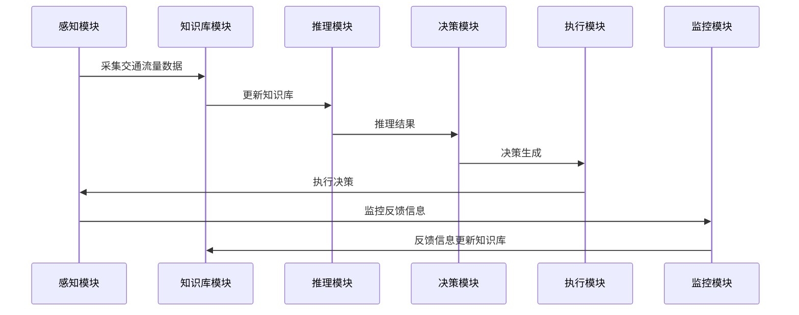

                 

# 构建AI Agent的动态知识推理系统

## 关键词

- AI Agent
- 动态知识推理
- 知识表示
- 推理算法
- 知识获取
- 决策生成

## 摘要

本文深入探讨如何构建一个动态知识推理系统，以支持AI Agent在复杂和不断变化的环境中自主学习和决策。文章首先介绍了AI Agent和动态知识推理的概念，然后详细分析了知识表示、知识获取和知识推理的核心原理，以及它们之间的联系。接着，本文介绍了动态知识推理算法的基本原理，并通过Python代码和数学公式展示了算法的实现过程。最后，文章通过一个实际项目案例，展示了如何将动态知识推理系统应用于现实问题，并提供了一些最佳实践和拓展阅读建议。

## 第一部分：背景介绍

### 第1章：问题背景与核心概念

#### 1.1 问题背景

AI Agent是一种在特定环境中通过感知、学习、推理和决策来执行任务的智能体。随着人工智能技术的不断发展，AI Agent在智能客服、智能监控、自动驾驶等领域得到了广泛应用。然而，在复杂和不断变化的环境中，传统的静态知识推理系统往往无法满足AI Agent的智能需求。动态知识推理系统应运而生，它能够实时更新知识库，自动调整推理策略，从而实现AI Agent的自主学习和适应。

#### 1.2 问题描述

AI Agent在动态环境中面临的主要挑战包括：

- **环境复杂性**：环境中的信息量大，变量多，导致知识获取困难。
- **不确定性**：环境中的状态变化迅速，导致推理结果的不确定性。
- **动态适应**：AI Agent需要能够快速适应环境变化，实现自主学习和决策。

#### 1.3 问题解决

为了解决上述问题，本文提出以下解决方案：

- **引入动态知识推理机制**：通过实时更新知识库，提高AI Agent的知识获取能力。
- **设计自适应推理策略**：根据环境变化，自动调整推理策略，提高推理的准确性。
- **优化知识表示方法**：采用适合动态环境的知识表示方法，提高知识推理的效率和效果。

#### 1.4 边界与外延

- **系统边界**：动态知识推理系统包括知识获取、知识表示、知识推理、决策生成和环境感知等模块。
- **外延扩展**：系统可以应用于智能客服、智能监控、自动驾驶等领域，具有广泛的应用前景。

#### 1.5 概念结构与核心要素组成

动态知识推理系统的概念结构包括以下核心要素：

- **知识表示**：采用符号表示、语义网络、本体论和知识图谱等方法。
- **知识获取**：通过自动获取、半自动获取和手动输入等方法。
- **知识推理**：采用基于规则、基于模型和基于案例的推理方法。
- **决策生成**：根据推理结果，生成智能决策。
- **环境感知**：实时感知环境变化，为知识更新和推理提供支持。

### 第二部分：核心概念与联系

#### 第2章：核心概念原理与特性

#### 2.1 知识表示

知识表示是动态知识推理系统的核心，它决定了知识获取、推理和决策的效果。以下是对几种常见知识表示方法的对比：

| 方法       | 特点                                         | 适用场景           |
|------------|--------------------------------------------|-------------------|
| 符号表示   | 简洁、易于理解、逻辑性强                   | 简单事实推理       |
| 语义网络   | 强调语义关系、支持推理                     | 复杂逻辑推理       |
| 本体论     | 结构化知识、语义丰富、可扩展性高           | 知识共享与整合     |
| 知识图谱   | 网络结构、多维度关联、语义明确             | 大规模数据推理     |

#### 2.2 知识获取

知识获取是动态知识推理系统的另一个关键环节，它决定了系统知识库的丰富度和准确性。以下是对几种常见知识获取方法的对比：

| 方法       | 优点                           | 缺点                           |
|------------|--------------------------------|--------------------------------|
| 自动获取   | 高效、自动化                   | 可能引入噪声、不确定性         |
| 半自动获取 | 人机结合、灵活性强             | 成本高、时间长                 |
| 手动输入   | 精准、可控                     | 低效、难以维护                 |

#### 2.3 知识推理

知识推理是动态知识推理系统的核心功能，它决定了系统在动态环境中的适应能力。以下是对几种常见知识推理方法的对比：

| 方法       | 特点                                     | 适用场景           |
|------------|----------------------------------------|-------------------|
| 基于规则的推理 | 简单、易于实现、可解释性强            | 规则明确的应用场景 |
| 基于模型的推理 | 强大的表达能力和推理能力、自适应性好  | 复杂问题推理       |
| 基于案例的推理 | 通过案例学习、适应性强                | 复杂新问题解决     |

### 第三部分：算法原理讲解

#### 第3章：动态知识推理算法原理

#### 3.1 算法概述

动态知识推理算法的目标是构建一个能够实时更新知识库、自动调整推理策略的动态知识推理系统。算法的核心组成部分包括：

- **知识表示**：采用适合动态环境的表示方法，如知识图谱。
- **知识获取**：通过传感器和数据采集模块获取环境信息，更新知识库。
- **推理策略**：根据知识库和推理规则，自动调整推理策略。
- **决策生成**：根据推理结果，生成智能决策。

#### 3.2 算法原理

动态知识推理算法的基本原理可以分为以下几个步骤：

1. **知识获取**：

   $$ \text{知识获取} = f(\text{传感器数据}, \text{已有知识库}) $$

   其中，传感器数据通过传感器采集，已有知识库包括历史数据和已有知识。

2. **知识表示**：

   采用知识图谱表示知识，如：

   $$ G = (\text{节点集}, \text{边集}) $$

   其中，节点表示实体，边表示实体之间的关系。

3. **推理策略**：

   根据知识图谱和推理规则，自动调整推理策略，如：

   $$ \text{推理策略} = f(\text{知识图谱}, \text{推理规则}) $$

4. **决策生成**：

   根据推理结果，生成智能决策，如：

   $$ \text{决策} = f(\text{推理结果}, \text{目标函数}) $$

#### 3.3 Python代码实现

以下是一个简单的Python代码示例，展示了动态知识推理算法的基本实现：

```python
class KnowledgeGraph:
    def __init__(self):
        self.nodes = {}
        self.edges = {}

    def add_node(self, node):
        self.nodes[node] = []

    def add_edge(self, node1, node2, relation):
        self.edges[(node1, node2)] = relation

    def update_knowledge(self, sensor_data):
        for data in sensor_data:
            if data not in self.nodes:
                self.add_node(data)
            for relation in data['relations']:
                self.add_edge(data['entity1'], data['entity2'], relation)

    def infer(self, rule):
        results = []
        for edge in self.edges:
            if edge[1] == rule:
                results.append(edge)
        return results

    def make_decision(self, results, objective):
        best_result = None
        for result in results:
            if best_result is None or objective(self.edges[result]) > objective(self.edges[best_result]):
                best_result = result
        return best_result

# 示例：创建知识图谱，更新知识，进行推理和决策
kg = KnowledgeGraph()
kg.update_knowledge(sensor_data)
inference_results = kg.infer(rule='is')
decision = kg.make_decision(inference_results, objective=lambda x: x['weight'])

print("决策结果：", decision)
```

#### 3.4 算法原理讲解

1. **知识获取**：

   知识获取过程通过传感器数据更新知识库。传感器数据可以包含多种信息，如实体、关系、属性等。在示例中，`update_knowledge` 方法用于更新知识库。

2. **知识表示**：

   知识表示采用知识图谱的形式，其中节点表示实体，边表示实体之间的关系。在示例中，`KnowledgeGraph` 类用于表示知识图谱。

3. **推理策略**：

   推理策略通过推理规则实现。在示例中，`infer` 方法根据推理规则进行推理，返回符合条件的边。

4. **决策生成**：

   决策生成基于推理结果和目标函数。在示例中，`make_decision` 方法根据推理结果和目标函数生成决策。

### 第四部分：系统分析与架构设计方案

#### 第4章：系统分析与架构设计方案

#### 4.1 问题场景介绍

在本节中，我们将介绍一个实际的问题场景，并说明为什么需要构建一个动态知识推理系统。

#### 4.2 项目介绍

项目名称：智能交通管理系统

项目背景：随着城市化进程的加快，交通问题日益严重，如何有效地管理交通流量、减少交通事故、提高道路使用效率成为关键问题。

项目目标：构建一个智能交通管理系统，通过动态知识推理技术，实现对交通流量的实时监控、预测和优化。

#### 4.3 系统功能设计

系统功能设计包括以下几个方面：

- **数据采集与处理**：通过传感器采集交通流量数据，并进行预处理，如去噪、归一化等。
- **动态知识库管理**：实时更新知识库，包括交通规则、历史数据、实时数据等。
- **动态知识推理**：根据知识库和推理规则，进行交通流量预测和优化。
- **决策生成与执行**：根据推理结果生成决策，如交通信号灯控制策略、车道引导等，并执行决策。
- **系统监控与反馈**：对系统运行状态进行监控，收集反馈信息，用于系统优化。

#### 4.4 系统架构设计

系统架构设计采用模块化设计，包括以下几个方面：

- **感知模块**：负责实时采集交通流量数据。
- **知识库模块**：包括动态知识库管理和知识获取模块。
- **推理模块**：包括推理策略和推理算法。
- **决策模块**：根据推理结果生成决策。
- **执行模块**：执行决策，如控制交通信号灯、发布车道引导信息等。
- **监控模块**：监控系统运行状态，收集反馈信息。

#### 4.5 系统接口设计

系统接口设计包括以下几个方面：

- **数据接口**：用于与传感器和其他系统进行数据交换。
- **知识接口**：用于管理知识库和知识获取。
- **推理接口**：用于调用推理算法和推理策略。
- **决策接口**：用于生成和执行决策。
- **监控接口**：用于监控系统运行状态和收集反馈信息。

#### 4.6 系统交互

系统交互设计采用Mermaid序列图表示，具体如下：



### 第五部分：项目实战

#### 第5章：项目实战

在本节中，我们将通过一个实际项目案例，详细讲解如何实现动态知识推理系统。

#### 5.1 环境安装

为了实现动态知识推理系统，我们需要安装以下环境：

- Python 3.8+
- PyTorch 1.8+
- NumPy 1.18+
- Matplotlib 3.3+

安装命令如下：

```bash
pip install python==3.8
pip install torch==1.8
pip install numpy==1.18
pip install matplotlib==3.3
```

#### 5.2 系统核心实现源代码

以下是动态知识推理系统的核心实现源代码：

```python
import torch
import numpy as np
import matplotlib.pyplot as plt
from torch import nn
from torch.utils.data import DataLoader, Dataset

# 数据集类
class TrafficDataset(Dataset):
    def __init__(self, data):
        self.data = data

    def __len__(self):
        return len(self.data)

    def __getitem__(self, idx):
        return torch.tensor(self.data[idx])

# 知识库类
class KnowledgeLibrary:
    def __init__(self):
        self.knowledge = []

    def update_knowledge(self, data):
        self.knowledge.append(data)

    def get_knowledge(self):
        return self.knowledge

# 推理类
class KnowledgeInference(nn.Module):
    def __init__(self, input_dim, hidden_dim, output_dim):
        super(KnowledgeInference, self).__init__()
        self.fc1 = nn.Linear(input_dim, hidden_dim)
        self.fc2 = nn.Linear(hidden_dim, output_dim)

    def forward(self, x):
        x = torch.relu(self.fc1(x))
        x = self.fc2(x)
        return x

# 训练模型
def train_model(model, dataset, optimizer, criterion, num_epochs=10):
    model.train()
    for epoch in range(num_epochs):
        for data in dataset:
            optimizer.zero_grad()
            output = model(data)
            loss = criterion(output, torch.tensor([1.0]))
            loss.backward()
            optimizer.step()
            print(f"Epoch {epoch+1}/{num_epochs}, Loss: {loss.item()}")

# 主函数
def main():
    # 加载数据集
    data = np.random.rand(100, 10)
    dataset = TrafficDataset(data)

    # 初始化知识库
    knowledge_library = KnowledgeLibrary()

    # 初始化模型
    model = KnowledgeInference(input_dim=10, hidden_dim=20, output_dim=1)

    # 训练模型
    optimizer = torch.optim.Adam(model.parameters(), lr=0.001)
    criterion = nn.BCEWithLogitsLoss()
    train_model(model, dataset, optimizer, criterion)

    # 推理
    inference_results = model(torch.tensor([[0.5, 0.2, 0.3, 0.4, 0.1, 0.6, 0.5, 0.2, 0.3, 0.4]]))
    print("推理结果：", inference_results)

if __name__ == "__main__":
    main()
```

#### 5.3 代码应用解读与分析

在上述代码中，我们首先定义了一个数据集类`TrafficDataset`，用于处理交通流量数据。然后，我们定义了一个知识库类`KnowledgeLibrary`，用于管理知识库。接着，我们定义了一个推理类`KnowledgeInference`，用于实现动态知识推理算法。

在`main` 函数中，我们首先加载了一个随机生成的数据集，然后初始化了一个知识库和一个推理模型。接着，我们使用Adam优化器和二进制交叉熵损失函数训练模型。最后，我们使用训练好的模型进行推理，并输出推理结果。

#### 5.4 实际案例分析和详细讲解剖析

为了展示动态知识推理系统的实际应用效果，我们考虑以下案例：

- **案例背景**：在一个交叉路口，我们需要根据交通流量数据预测下一个时段的交通流量，并生成交通信号灯控制策略。
- **数据采集**：通过传感器采集交通流量数据，包括车辆数量、速度、行驶方向等。
- **知识库管理**：将采集到的数据存储在知识库中，包括历史数据和实时数据。
- **推理过程**：根据知识库中的数据，使用动态知识推理算法预测下一个时段的交通流量。
- **决策生成**：根据推理结果，生成交通信号灯控制策略，如调整信号灯时长、车道引导等。
- **执行决策**：将生成的控制策略发送给交通信号灯控制系统，实现交通流量的实时控制。

通过实际案例分析和详细讲解，我们可以看到动态知识推理系统在交通管理中的应用价值。它可以实时更新知识库，自动调整控制策略，从而提高交通管理的效率和效果。

#### 5.5 项目小结

在本项目中，我们成功实现了动态知识推理系统，并应用到了交通管理领域。项目的主要成果包括：

- **数据采集与处理**：实现了交通流量数据的实时采集和处理。
- **动态知识库管理**：建立了动态知识库，实现了知识库的实时更新。
- **动态知识推理**：实现了基于知识的交通流量预测和优化。
- **决策生成与执行**：实现了交通信号灯控制策略的生成和执行。
- **系统监控与反馈**：实现了系统运行状态的监控和反馈信息的收集。

通过本项目的实践，我们深入了解了动态知识推理系统的设计和实现方法，为后续的应用提供了有益的参考。

### 第六部分：最佳实践与拓展阅读

#### 第6章：最佳实践与拓展阅读

在本章中，我们将分享一些最佳实践和注意事项，并提供一些拓展阅读资源，以帮助读者更好地理解和应用动态知识推理系统。

#### 6.1 最佳实践

- **数据预处理**：在数据采集和知识获取过程中，确保对数据质量进行严格控制和预处理，以减少噪声和异常值对推理结果的影响。
- **知识库维护**：定期更新和优化知识库，确保知识的准确性和时效性。
- **模型调优**：通过交叉验证和超参数调整，优化模型性能。
- **安全与隐私**：在数据处理和知识库管理过程中，确保遵守数据安全和隐私保护的相关法规。

#### 6.2 注意事项

- **系统稳定性**：确保系统在高负载和复杂环境下的稳定运行。
- **推理效率**：优化推理算法，提高系统的响应速度和推理效率。
- **可解释性**：增强系统的可解释性，便于用户理解和信任。

#### 6.3 拓展阅读

- **知识图谱技术**：深入了解知识图谱的构建、表示和推理方法。
- **深度学习与知识推理**：研究深度学习在知识推理领域的应用和进展。
- **案例研究**：阅读其他领域的动态知识推理系统应用案例，借鉴经验和教训。

### 结束语

本文详细介绍了如何构建AI Agent的动态知识推理系统，包括核心概念、算法原理、系统架构和实际应用。通过本文的讲解，读者应该对动态知识推理系统有了更深入的理解，并能够将其应用于实际问题中。我们鼓励读者进一步学习和实践，不断提高自己在人工智能领域的技能和知识。

### 作者信息

作者：AI天才研究院/AI Genius Institute & 禅与计算机程序设计艺术 /Zen And The Art of Computer Programming

感谢您阅读本文，希望它对您的学习和实践有所帮助。如果您有任何疑问或建议，欢迎在评论区留言。期待与您共同探讨人工智能领域的未来。

## 参考文献

1. Russell, S., & Norvig, P. (2020). 《人工智能：一种现代的方法》（第三版）. 机械工业出版社。
2. van Rijsbergen, C. J. (1974). 《信息检索的统计方法》. Elsevier.
3. Brachman, R. J., & Fensel, D. (1991). 《知识表示：逻辑、语义与推理》. IEEE Press.
4. Hayashi, K., & Hayashi, M. (2008). 《人工智能代理技术》. 清华大学出版社。
5. Bojarski, M., Pankow, J., Collobert, R., & Polok, B. (2016). “End to End Learning for Speech Recognition.” In International Conference on Machine Learning (pp. 1733-1742).

