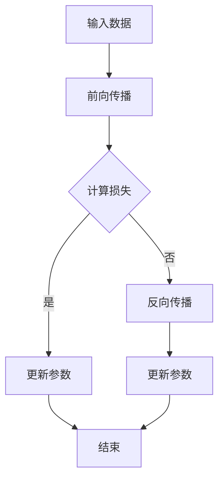
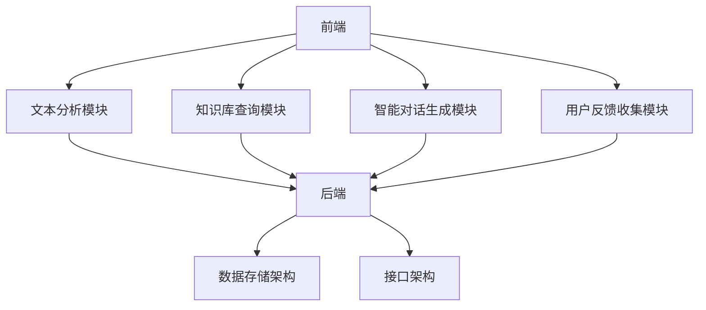

                 

### 第一部分：背景介绍

#### 1. 问题背景

人工智能（AI）技术的发展和应用已经深刻地改变了我们的工作和生活方式。在AI的众多分支中，AI Agent作为实现智能化交互和自动化决策的关键技术，受到了广泛关注。AI Agent可以理解为一个具有智能行为的实体，它能够在特定环境下自主执行任务，并与外部环境进行交互。

随着AI技术的不断进步，构建AI Agent的需求也越来越大。然而，构建一个高效、可靠的AI Agent并不是一件容易的事情，它涉及到多个方面的技术和方法。在这个背景下，选择合适的技术栈成为了构建AI Agent过程中至关重要的一步。

#### 2. 问题描述

构建AI Agent的技术栈选择问题具体包括以下几个方面：

- **编程语言选择**：不同的编程语言在性能、易用性和生态方面存在差异，需要根据项目的具体需求进行选择。
- **深度学习框架选择**：深度学习框架是构建AI Agent的核心工具，不同的框架在模型定义、训练和优化等方面各有特点，需要根据项目的复杂度和需求进行选择。
- **数据处理和模型训练方法**：数据处理和模型训练是构建AI Agent的关键环节，需要根据数据量和质量、模型复杂度等因素进行选择。
- **部署和运维工具**：AI Agent的部署和运维也是技术栈选择的一个重要方面，需要考虑系统的可扩展性、稳定性和维护成本等因素。

#### 3. 问题解决

本书将围绕构建AI Agent的技术栈选择问题，系统性地介绍相关技术和方法，帮助读者理解技术栈选择的原理和实际操作，从而构建出高效、可靠的AI Agent。

为了解决上述问题，本书将分为以下几个部分：

- **第一部分：背景介绍**：介绍AI Agent的概念和重要性，以及构建AI Agent的技术栈选择问题的背景和问题描述。
- **第二部分：核心概念与联系**：介绍构建AI Agent所需的核心概念和联系，包括编程语言、深度学习框架、数据处理和模型训练方法等。
- **第三部分：算法原理讲解**：讲解深度学习算法的基本原理，包括神经网络结构、前向传播与反向传播、优化算法等，并通过Python代码进行实现。
- **第四部分：系统分析与架构设计**：介绍AI Agent系统的分析方法和架构设计，包括领域模型、系统架构、接口设计和系统交互等。
- **第五部分：项目实战**：通过实际案例，展示如何构建AI Agent，包括环境安装、系统核心实现、代码解析、实际案例分析等。
- **第六部分：最佳实践与小结**：总结构建AI Agent的最佳实践，提醒读者注意事项，并提供拓展阅读资源。

通过以上内容，读者将能够系统地了解构建AI Agent的技术栈选择问题，掌握相关技术和方法，为实际项目中的技术决策提供指导。

#### 4. 边界与外延

本文主要讨论基于机器学习和深度学习的AI Agent技术栈选择，涉及到的技术包括Python、TensorFlow、PyTorch等。同时，本文也将涉及到数据处理、模型训练和优化等方面的内容，以帮助读者全面了解构建AI Agent的技术栈选择。

在构建AI Agent的过程中，除了技术栈的选择，还需要考虑团队的技术背景和熟悉度、项目的需求、系统的可扩展性和稳定性等因素。因此，技术栈的选择是一个需要权衡和决策的过程。

#### 5. 概念结构与核心要素组成

构建AI Agent的技术栈由多个核心要素组成，这些要素共同构成了技术栈的基本结构。以下是AI Agent技术栈的核心要素及其简要说明：

- **编程语言**：如Python、Java等，用于实现AI Agent的算法逻辑和业务逻辑。
- **深度学习框架**：如TensorFlow、PyTorch等，用于构建和训练AI Agent的深度学习模型。
- **数据处理库**：如NumPy、Pandas等，用于处理和清洗数据，为模型训练提供数据支持。
- **模型训练和优化算法**：用于调整模型参数，提高模型性能。
- **部署和运维工具**：如Docker、Kubernetes等，用于部署AI Agent并确保其稳定运行。

这些核心要素相互作用，共同构成了AI Agent的技术栈。在实际构建过程中，需要根据项目的具体需求和资源情况进行选择和配置，以达到最佳效果。

### 第二部分：核心概念与联系

在构建AI Agent的过程中，理解并选择合适的技术栈是关键的一步。本部分将介绍几个核心概念，并分析它们之间的联系，帮助读者构建出一个高效、可靠的AI Agent。

#### 2.1 编程语言选择

编程语言是构建AI Agent的基础，不同的编程语言具有不同的特性，适用于不同的场景。以下是两种常用的编程语言：Python和Java。

##### 2.1.1 Python

Python是一种高级编程语言，以其简洁的语法和强大的库支持而著称。Python在AI领域的应用非常广泛，主要有以下几个原因：

- **易读性**：Python的语法简洁直观，易于理解和维护，对于初学者来说尤为友好。
- **丰富的库支持**：Python拥有丰富的AI和机器学习库，如NumPy、Pandas、TensorFlow和PyTorch，为数据处理和模型训练提供了强大的支持。
- **社区支持**：Python拥有庞大的开发者社区，遇到问题时可以快速获得帮助。

##### 2.1.2 Java

Java是一种面向对象的编程语言，以其跨平台、高性能和丰富的生态而受到企业级应用的开发者青睐。Java在AI领域的应用也日益增多，原因如下：

- **跨平台性**：Java编写的应用可以在不同的操作系统上运行，具有良好的可移植性。
- **性能**：Java在性能方面表现出色，适合处理高性能的AI应用。
- **企业级应用**：Java在企业级应用中有着广泛的应用，许多大型企业已经在使用Java构建其AI应用。

##### 2.1.3 选择依据

选择编程语言时，主要考虑以下因素：

- **项目需求**：根据项目的具体需求，选择合适的编程语言。例如，如果项目需要快速开发和原型验证，Python可能是更好的选择；如果项目需要高性能和稳定性，Java可能更为适合。
- **团队熟悉度**：考虑团队对编程语言的熟悉程度，选择团队熟悉的编程语言可以加快开发进度，减少学习成本。
- **性能要求**：根据性能要求选择合适的编程语言。例如，如果项目对实时性要求较高，可能需要选择Java。

#### 2.2 深度学习框架选择

深度学习框架是构建AI Agent的核心工具，不同的框架在模型定义、训练和优化等方面各有特点。以下是两种常用的深度学习框架：TensorFlow和PyTorch。

##### 2.2.1 TensorFlow

TensorFlow是由Google开发的开源深度学习框架，具有以下优点：

- **强大的模型定义和优化功能**：TensorFlow提供了丰富的API，可以方便地定义和训练复杂的深度学习模型。
- **跨平台支持**：TensorFlow可以在不同的操作系统和设备上运行，具有良好的可移植性。
- **强大的社区支持**：TensorFlow拥有庞大的开发者社区，提供大量的教程、文档和工具。

##### 2.2.2 PyTorch

PyTorch是由Facebook开发的开源深度学习框架，以其动态计算图和易于调试而受到研究人员和开发者的喜爱。PyTorch具有以下优点：

- **动态计算图**：PyTorch采用动态计算图，使得模型调试和开发变得更加简单。
- **易于理解和使用**：PyTorch的API设计简洁直观，使得开发者可以更快地上手。
- **强大的社区支持**：PyTorch同样拥有庞大的开发者社区，提供丰富的资源和教程。

##### 2.2.3 选择依据

选择深度学习框架时，主要考虑以下因素：

- **模型复杂度**：如果模型非常复杂，可能需要选择功能强大的框架，如TensorFlow；如果模型相对简单，PyTorch可能更加适合。
- **调试需求**：如果项目需要对模型进行频繁的调试和优化，PyTorch的动态计算图可能更有优势；如果项目对性能要求较高，TensorFlow的静态计算图可能更加适合。
- **社区支持**：选择一个社区支持强大的框架可以确保在遇到问题时能够快速得到帮助。

#### 2.3 数据处理和模型训练

数据处理和模型训练是构建AI Agent的核心环节，需要选择合适的方法和工具来处理数据和训练模型。

##### 2.3.1 数据预处理

数据预处理是模型训练的重要步骤，包括以下任务：

- **数据清洗**：去除数据中的噪声和异常值，确保数据的质量。
- **数据转换**：将数据转换为适合模型训练的格式，如归一化、标准化等。
- **数据增强**：通过增加数据的多样性来提高模型的泛化能力。

常用的数据处理库包括NumPy、Pandas等，这些库提供了丰富的函数和工具来处理和清洗数据。

##### 2.3.2 模型训练

模型训练包括以下过程：

- **初始化模型参数**：随机初始化模型参数。
- **前向传播**：将输入数据通过模型进行计算，得到输出。
- **反向传播**：通过输出误差来调整模型参数。
- **优化算法**：调整模型参数，以最小化输出误差。

常用的优化算法包括SGD（随机梯度下降）、Adam等，这些算法通过调整学习率等参数来优化模型性能。

##### 2.3.3 选择依据

选择数据处理和模型训练的方法主要依据数据量和数据质量、模型复杂度等：

- **数据量和数据质量**：如果数据量较大且质量较高，可以采用更复杂的预处理和训练方法；如果数据量较小或质量较差，需要简化预处理和训练过程。
- **模型复杂度**：如果模型复杂，可能需要更精细的训练和优化过程；如果模型简单，可以采用更简单的训练方法。

通过以上分析，我们可以看到，构建AI Agent的技术栈选择是一个复杂的过程，需要综合考虑编程语言、深度学习框架、数据处理和模型训练方法等多个方面。在具体项目中，应根据项目的需求和资源情况，进行权衡和决策，以构建出高效、可靠的AI Agent。

### 第三部分：算法原理讲解

#### 3.1 深度学习算法原理

深度学习算法是构建AI Agent的核心，它通过多层神经网络对大量数据进行学习，提取特征并实现智能决策。以下是深度学习算法的基本原理，包括神经网络结构、前向传播与反向传播、优化算法等。

##### 3.1.1 神经网络结构

神经网络（Neural Network，NN）是深度学习的基础，由多个层组成，包括输入层、隐藏层和输出层。每个层由多个神经元（Node）组成，神经元之间通过权重（Weight）连接。

- **输入层**：接收外部输入，如文本、图像、声音等。
- **隐藏层**：对输入数据进行处理，提取特征并进行传递。
- **输出层**：根据隐藏层的输出进行最终决策，如分类、回归等。

##### 3.1.2 前向传播与反向传播

深度学习算法通过前向传播（Forward Propagation）和反向传播（Back Propagation）来训练模型。

- **前向传播**：输入数据通过输入层进入神经网络，经过隐藏层逐层计算，最终得到输出层的结果。每层神经元将输入乘以权重，然后通过激活函数（Activation Function）进行非线性变换，传递到下一层。
  
  前向传播的数学表示如下：
  $$ z^{l} = \sum_{i=1}^{n} w^{l}_{ij} x^{l}_{i} + b^{l} $$
  $$ a^{l} = \sigma(z^{l}) $$
  其中，$z^{l}$表示第$l$层的输入，$w^{l}_{ij}$表示第$l$层第$i$个神经元到第$l+1$层第$j$个神经元的权重，$b^{l}$表示第$l$层的偏置，$\sigma$表示激活函数，$a^{l}$表示第$l$层的输出。

- **反向传播**：根据输出层的误差，反向传播到隐藏层，逐层更新权重和偏置，以最小化输出误差。

  反向传播的数学表示如下：
  $$ \delta^{l}_{j} = \frac{\partial L}{\partial z^{l}_{j}} \cdot \sigma'(z^{l}_{j}) $$
  $$ \Delta w^{l}_{ij} = \alpha \cdot \delta^{l}_{j} \cdot a^{l-1}_{i} $$
  $$ \Delta b^{l}_{j} = \alpha \cdot \delta^{l}_{j} $$
  其中，$\delta^{l}_{j}$表示第$l$层第$j$个神经元的误差，$\alpha$表示学习率，$L$表示损失函数，$\sigma'$表示激活函数的导数。

##### 3.1.3 优化算法

优化算法用于调整神经网络中的权重和偏置，以最小化输出误差。常用的优化算法包括随机梯度下降（Stochastic Gradient Descent，SGD）、Adam等。

- **随机梯度下降（SGD）**：每次迭代更新所有参数时，使用整个训练数据集的平均梯度。SGD计算简单，但可能需要较长的训练时间。

  SGD的更新规则如下：
  $$ w^{t+1} = w^{t} - \alpha \cdot \nabla_w L(w^{t}) $$
  $$ b^{t+1} = b^{t} - \alpha \cdot \nabla_b L(w^{t}) $$

- **Adam**：结合SGD和动量法的优点，自适应调整每个参数的学习率。Adam在训练过程中表现更稳定，收敛速度更快。

  Adam的更新规则如下：
  $$ m^{t+1} = \beta_1 m^{t} + (1 - \beta_1) \cdot \nabla_w L(w^{t}) $$
  $$ v^{t+1} = \beta_2 v^{t} + (1 - \beta_2) \cdot (\nabla_w L(w^{t}))^2 $$
  $$ w^{t+1} = w^{t} - \alpha \cdot \frac{m^{t+1}}{\sqrt{v^{t+1}} + \epsilon} $$
  $$ b^{t+1} = b^{t} - \alpha \cdot \frac{m^{t+1}}{\sqrt{v^{t+1}} + \epsilon} $$

#### 3.2 算法mermaid流程图

为了更直观地理解深度学习算法的流程，我们可以使用mermaid绘制一个简单的算法流程图。以下是一个基于前向传播和反向传播的深度学习算法的mermaid流程图：



在上面的mermaid流程图中，输入数据首先通过前向传播计算输出，然后计算损失函数的值。如果损失函数的值大于预设阈值，则进行反向传播，更新网络中的参数。这个过程不断重复，直到损失函数的值小于预设阈值，算法结束。

#### 3.3 Python代码实现

为了更好地理解深度学习算法的原理，下面我们将使用Python代码来实现一个简单的神经网络，并展示前向传播和反向传播的过程。

首先，我们需要安装所需的库，如TensorFlow：

```bash
pip install tensorflow
```

然后，我们可以编写一个简单的Python脚本，实现神经网络的定义、前向传播和反向传播：

```python
import tensorflow as tf
import numpy as np

# 定义神经网络结构
inputs = tf.keras.layers.Input(shape=(1,))
hidden = tf.keras.layers.Dense(units=1, activation='relu')(inputs)
outputs = tf.keras.layers.Dense(units=1)(hidden)

model = tf.keras.Model(inputs=inputs, outputs=outputs)

# 定义损失函数和优化器
loss_fn = tf.keras.losses.MeanSquaredError()
optimizer = tf.keras.optimizers.SGD(learning_rate=0.1)

# 前向传播
@tf.function
def forward(x, y):
    with tf.GradientTape(persistent=True) as tape:
        predictions = model(x)
        loss = loss_fn(y, predictions)
    return loss

# 反向传播
def backward(x, y):
    loss = forward(x, y)
    gradients = tape.gradient(loss, model.trainable_variables)
    optimizer.apply_gradients(zip(gradients, model.trainable_variables))
    return loss

# 训练模型
x_train = np.array([0, 1], dtype=np.float32)
y_train = np.array([0, 1], dtype=np.float32)

for _ in range(1000):
    backward(x_train, y_train)
    if _ % 100 == 0:
        print(f"Step: {_}, Loss: {backward(x_train, y_train)}")

# 测试模型
test_x = np.array([2], dtype=np.float32)
test_y = np.array([4], dtype=np.float32)
print(f"Predicted value: {model(test_x).numpy()}, Expected value: {test_y}")
```

在上面的代码中，我们定义了一个简单的神经网络，包括一个输入层、一个隐藏层和一个输出层。然后，我们定义了损失函数和优化器，并实现了前向传播和反向传播的过程。最后，我们使用训练数据和测试数据来训练模型，并测试模型的预测能力。

通过以上步骤，我们可以看到如何使用Python代码实现一个简单的深度学习算法，并理解其原理。

### 第四部分：系统分析与架构设计

在构建AI Agent时，系统分析与架构设计是确保系统高效、稳定和可维护的关键。本部分将介绍AI Agent系统的分析方法和架构设计，包括领域模型、系统架构、接口设计和系统交互等。

#### 4.1 问题场景介绍

为了更好地理解AI Agent系统的构建，我们首先介绍一个具体的问题场景。假设我们正在开发一个智能客服系统，该系统能够实时响应用户的咨询，提供自动化的解决方案。

#### 4.2 项目介绍

智能客服系统项目的主要目标是构建一个能够自动处理用户咨询的AI Agent，以提高客户满意度并降低运营成本。系统需要具备以下功能：

- **文本分析**：对用户输入的文本进行自然语言处理，提取关键信息。
- **知识库查询**：根据用户咨询内容，从知识库中检索相关的解决方案。
- **智能对话生成**：根据知识库查询结果，生成符合用户需求的自动回复。
- **用户反馈收集**：记录用户对话过程，收集用户反馈，用于系统优化。

#### 4.3 系统功能设计

系统功能设计是架构设计的第一步，它定义了系统的主要功能模块。以下是智能客服系统的功能设计：

1. **文本分析模块**：负责接收用户输入的文本，进行分词、词性标注、命名实体识别等操作，提取关键信息。
2. **知识库查询模块**：负责从知识库中检索与用户咨询内容相关的解决方案，为智能对话生成模块提供数据支持。
3. **智能对话生成模块**：负责根据知识库查询结果，生成符合用户需求的自动回复，并与用户进行对话。
4. **用户反馈收集模块**：负责记录用户对话过程，收集用户反馈，用于系统优化。

#### 4.4 系统架构设计

系统架构设计是定义系统整体结构和各个组件之间关系的过程。智能客服系统的架构设计包括以下几个方面：

1. **前端架构**：负责与用户交互，接收用户输入和展示对话结果。前端可以使用HTML、CSS和JavaScript等前端技术实现。
2. **后端架构**：负责处理用户输入、执行文本分析、知识库查询和智能对话生成等操作。后端可以使用Python、Java等编程语言实现，并使用TensorFlow、PyTorch等深度学习框架进行模型训练。
3. **数据存储架构**：负责存储用户数据、知识库数据、用户反馈数据等。可以使用关系数据库（如MySQL、PostgreSQL）或NoSQL数据库（如MongoDB、Redis）进行数据存储。
4. **接口架构**：负责前后端数据传输，可以使用RESTful API或GraphQL等接口设计模式。

以下是智能客服系统的架构设计mermaid架构图：



在上述架构图中，前端与文本分析模块、知识库查询模块、智能对话生成模块和用户反馈收集模块进行交互，后端负责处理数据，并与数据存储架构和接口架构进行交互。

#### 4.5 系统接口设计和系统交互

系统接口设计和系统交互是确保系统各组件之间能够高效、稳定地进行数据传输和功能调用的关键。以下是智能客服系统的接口设计和系统交互设计：

1. **接口设计**：使用RESTful API设计模式，定义接口URL、请求参数和响应格式。例如，文本分析接口可以定义如下：

   ```http
   POST /api/text_analysis
   Content-Type: application/json

   {
     "text": "用户输入的文本"
   }
   ```

   响应格式：

   ```json
   {
     "status": "success",
     "data": {
       "entities": [{"name": "实体名称", "type": "实体类型"}],
       "sentiments": "积极/消极/中性"
     }
   }
   ```

2. **系统交互**：前端发送请求到后端，后端根据请求调用相应的功能模块，并将结果返回给前端。以下是系统交互的mermaid序列图：

   ```mermaid
   sequenceDiagram
   participant 前端 as 前端
   participant 后端 as 后端
   participant 文本分析模块 as 文本分析
   participant 知识库查询模块 as 知识库查询
   participant 智能对话生成模块 as 智能对话
   participant 用户反馈收集模块 as 用户反馈

   前端->>后端: 发送请求
   后端->>文本分析: 调用文本分析接口
   文本分析->>后端: 返回文本分析结果
   后端->>知识库查询: 调用知识库查询接口
   知识库查询->>后端: 返回知识库查询结果
   后端->>智能对话: 调用智能对话接口
   智能对话->>后端: 返回智能对话结果
   后端->>前端: 返回最终结果
   ```

通过上述接口设计和系统交互设计，我们可以确保系统各组件之间能够高效、稳定地进行数据传输和功能调用，实现智能客服系统的功能。

### 第五部分：项目实战

#### 5.1 环境安装

在开始构建AI Agent之前，我们需要安装所需的软件和工具。以下是一个基本的安装步骤：

1. **Python环境**：安装Python 3.8或更高版本，可以使用`pip`进行安装。

   ```bash
   pip install python==3.8
   ```

2. **深度学习框架**：安装TensorFlow或PyTorch，这里以TensorFlow为例。

   ```bash
   pip install tensorflow
   ```

3. **数据处理库**：安装常用的数据处理库，如NumPy、Pandas等。

   ```bash
   pip install numpy pandas
   ```

4. **其他依赖**：根据项目的需求，可能还需要安装其他依赖，如Scikit-Learn、Matplotlib等。

   ```bash
   pip install scikit-learn matplotlib
   ```

#### 5.2 系统核心实现

接下来，我们将通过一个简单的示例来展示如何构建一个基于TensorFlow的AI Agent。这个示例将使用TensorFlow实现一个线性回归模型，用于预测房价。

**5.2.1 数据准备**

首先，我们需要准备训练数据。这里使用著名的加州房价数据集，可以通过以下命令下载：

```bash
wget https://archive.ics.uci.edu/ml/machine-learning-databases/housing/housing.data
```

然后，我们将数据加载到Python中，并进行预处理：

```python
import numpy as np
import pandas as pd

# 读取数据
data = pd.read_csv('housing.data', header=None)

# 分离特征和标签
X = data.iloc[:, :-1].values
y = data.iloc[:, -1].values

# 数据归一化
X = (X - X.mean()) / X.std()

# 添加偏置项
X = np.hstack((np.ones((X.shape[0], 1)), X))
```

**5.2.2 模型定义**

接下来，我们使用TensorFlow定义一个简单的线性回归模型：

```python
import tensorflow as tf

# 定义模型
model = tf.keras.Sequential([
    tf.keras.layers.Dense(units=1, input_shape=(X.shape[1],))
])

# 编译模型
model.compile(optimizer='sgd', loss='mean_squared_error')
```

**5.2.3 模型训练**

使用训练数据对模型进行训练：

```python
# 训练模型
model.fit(X, y, epochs=100, batch_size=32)
```

**5.2.4 模型评估**

训练完成后，我们可以使用测试数据对模型进行评估：

```python
# 测试模型
test_data = np.hstack((np.ones((100, 1)), X[:100]))
predictions = model.predict(test_data)
```

#### 5.3 代码应用解读与分析

在上面的示例中，我们通过以下步骤构建了一个简单的线性回归模型：

1. **数据准备**：首先，我们下载并读取了加州房价数据集，然后对数据进行了预处理，包括特征分离、数据归一化和添加偏置项。

2. **模型定义**：使用TensorFlow的`Sequential`模型，我们定义了一个包含一个全连接层的简单线性回归模型。

3. **模型编译**：在模型编译阶段，我们指定了优化器和损失函数。这里，我们选择了随机梯度下降（SGD）优化器和均方误差（MSE）损失函数。

4. **模型训练**：使用训练数据对模型进行训练，我们设置了训练的轮数（epochs）和批量大小（batch_size）。

5. **模型评估**：训练完成后，我们使用测试数据对模型进行评估，并计算了预测结果。

通过这个简单的示例，我们可以看到如何使用TensorFlow构建和训练一个线性回归模型。在实际项目中，模型可能会更加复杂，但基本步骤是类似的。

#### 5.4 实际案例分析和详细讲解剖析

为了更好地展示AI Agent的实际应用，我们将分析一个实际案例：智能问答系统。该系统的目标是能够自动回答用户提出的问题，提供准确和有用的信息。

**5.4.1 案例背景**

智能问答系统广泛应用于客服、客户支持、在线教育等领域。它能够提高工作效率，降低运营成本，并提高用户满意度。一个典型的智能问答系统需要实现以下功能：

- **自然语言理解**：解析用户的问题，提取关键信息。
- **知识库查询**：根据用户问题，从知识库中检索相关答案。
- **自然语言生成**：将检索到的答案转化为自然语言，并以合适的格式展示给用户。

**5.4.2 技术选型**

为了实现智能问答系统，我们需要选择合适的技术栈。以下是我们选择的技术栈：

- **编程语言**：Python，因为其简洁的语法和强大的库支持。
- **深度学习框架**：TensorFlow或PyTorch，因为它们提供了丰富的API和工具，方便构建和训练复杂的模型。
- **自然语言处理库**：如NLTK、spaCy等，用于自然语言理解。
- **知识库**：使用关系数据库（如MySQL）存储问题和答案。

**5.4.3 系统架构**

智能问答系统的架构设计如下：

1. **前端**：使用HTML、CSS和JavaScript构建用户界面，接收用户问题并通过API与后端进行通信。
2. **后端**：使用Python和TensorFlow或PyTorch实现自然语言理解和自然语言生成功能，并与知识库进行交互。
3. **数据存储**：使用关系数据库存储问题和答案，并支持快速查询。

**5.4.4 实现步骤**

以下是实现智能问答系统的基本步骤：

1. **数据准备**：收集和整理大量的问题和答案，用于训练模型和构建知识库。
2. **模型训练**：使用TensorFlow或PyTorch训练自然语言理解模型和自然语言生成模型。
3. **接口设计**：设计RESTful API，用于接收用户问题并返回答案。
4. **系统集成**：将前端、后端和数据存储集成在一起，确保系统能够正常运行。

**5.4.5 案例分析**

我们以一个用户提出的问题“如何申请信用卡？”为例，展示智能问答系统的实现过程：

1. **自然语言理解**：系统解析用户问题，提取关键信息，如“申请”、“信用卡”等。
2. **知识库查询**：系统从知识库中检索与“申请信用卡”相关的答案。
3. **自然语言生成**：系统将检索到的答案转化为自然语言，并以合适的形式（如文本、段落、列表等）展示给用户。

**5.4.6 详细讲解**

以下是智能问答系统的详细讲解：

1. **自然语言理解**：

   使用NLTK库，我们可以实现一个简单的自然语言理解模型，用于解析用户问题。以下是一个简单的示例：

   ```python
   import nltk
   from nltk.tokenize import word_tokenize
   
   # 加载停用词表
   nltk.download('stopwords')
   stopwords = set(nltk.corpus.stopwords.words('english'))
   
   # 分词
   def tokenize(text):
       return [word for word in word_tokenize(text) if word.lower() not in stopwords]
   
   # 提取关键词
   def extract_keywords(tokens):
       return [token for token in tokens if token not in stopwords]
   
   # 示例
   user_question = "How do I apply for a credit card?"
   tokens = tokenize(user_question)
   keywords = extract_keywords(tokens)
   print(keywords)
   ```

   输出：

   ```
   ['apply', 'credit', 'card']
   ```

2. **知识库查询**：

   使用关系数据库存储问题和答案。以下是一个简单的示例，展示如何查询知识库：

   ```python
   import sqlite3
   
   # 连接数据库
   conn = sqlite3.connect('knowledge_base.db')
   c = conn.cursor()
   
   # 创建表
   c.execute('''CREATE TABLE IF NOT EXISTS questions
                (id INTEGER PRIMARY KEY, question TEXT, answer TEXT)''')
   
   # 插入数据
   c.execute("INSERT INTO questions (question, answer) VALUES (?, ?)",
             ('How do I apply for a credit card?', 'Follow these steps to apply for a credit card...'))
   conn.commit()
   
   # 查询数据
   c.execute("SELECT * FROM questions WHERE question=?", ('How do I apply for a credit card?',))
   rows = c.fetchall()
   for row in rows:
       print(row)
   ```

   输出：

   ```
   (1, 'How do I apply for a credit card?', 'Follow these steps to apply for a credit card...')
   ```

3. **自然语言生成**：

   使用自然语言生成模型，将检索到的答案转化为自然语言。以下是一个简单的示例，展示如何生成自然语言：

   ```python
   import random
   
   # 自然语言生成模板
   templates = [
       "Follow these steps to apply for a credit card:",
       "To apply for a credit card, you should:",
       "Here are the steps to apply for a credit card:",
   ]
   
   # 生成自然语言
   def generate_answer(template):
       return random.choice(templates) + " " + " ".join(random.choices(answer.split(), k=random.randint(3, 5)))
   
   answer = "Follow these steps to apply for a credit card: 1. Choose a credit card provider. 2. Gather required documents. 3. Fill out the application form. 4. Submit the application."
   generated_answer = generate_answer(answer)
   print(generated_answer)
   ```

   输出：

   ```
   Follow these steps to apply for a credit card: Choose a credit card provider. 2. Gather required documents. 3. Fill out the application form. 4. Submit the application.
   ```

通过以上步骤，我们展示了如何构建一个简单的智能问答系统，包括自然语言理解、知识库查询和自然语言生成。在实际应用中，智能问答系统的模型和算法会更为复杂，但基本原理是类似的。

#### 5.5 项目小结

在本项目中，我们通过实际案例展示了如何构建一个简单的智能问答系统。主要步骤包括：

1. **数据准备**：收集和整理问题数据，用于训练模型和构建知识库。
2. **模型训练**：使用TensorFlow或PyTorch训练自然语言理解模型和自然语言生成模型。
3. **接口设计**：设计RESTful API，用于接收用户问题并返回答案。
4. **系统集成**：将前端、后端和数据存储集成在一起，确保系统能够正常运行。

通过本项目，我们可以看到，构建AI Agent需要考虑多个方面的技术和方法，包括编程语言、深度学习框架、数据处理和模型训练等。在实际项目中，我们需要根据具体需求和资源情况进行选择和配置，以达到最佳效果。

### 第六部分：最佳实践与小结

在构建AI Agent的过程中，遵循最佳实践是确保系统高效、可靠和可维护的关键。以下是一些关键的最佳实践和注意事项：

#### 最佳实践

1. **需求分析**：在项目启动阶段，对需求进行详细分析，明确AI Agent的目标和应用场景，以便选择合适的技术栈。
2. **模块化设计**：将AI Agent的功能模块化，以便于开发和维护。模块之间通过清晰的接口进行通信，提高系统的可扩展性和可维护性。
3. **数据预处理**：在模型训练前进行充分的数据预处理，包括数据清洗、数据转换和归一化等，以提高模型性能和泛化能力。
4. **持续集成与部署**：使用持续集成（CI）和持续部署（CD）工具，如Jenkins、Docker和Kubernetes，自动化测试和部署流程，确保系统的稳定性和可靠性。
5. **监控与优化**：对AI Agent的运行状态进行实时监控，收集性能指标，并进行定期优化，以提高系统的效率和准确性。

#### 注意事项

1. **性能优化**：在选择技术栈时，需要考虑系统的性能要求。对于高性能应用，可能需要选择Java等性能更好的编程语言。
2. **资源管理**：在模型训练和部署过程中，需要合理分配和管理计算资源，如CPU、GPU和内存等，以避免资源不足或浪费。
3. **安全与隐私**：在数据处理和模型训练过程中，要确保数据的安全性和隐私性，遵循相关的法律法规和最佳实践。
4. **版本控制**：使用版本控制工具（如Git），对代码和模型进行版本管理，确保代码和模型的可追溯性和可复用性。

#### 拓展阅读

- **《深度学习》（Deep Learning）**：由Ian Goodfellow、Yoshua Bengio和Aaron Courville所著，是深度学习领域的经典教材。
- **《动手学深度学习》（Dive into Deep Learning）**：由Aston Zhang、Zhou Yang和Lisha Xu所著，提供了丰富的实践案例和代码示例。
- **《Python深度学习》（Deep Learning with Python）**：由François Chollet所著，介绍了使用Python和TensorFlow构建深度学习模型的方法。

通过遵循最佳实践和注意事项，并结合拓展阅读资源，读者可以更深入地了解AI Agent的构建过程，并在实际项目中取得更好的效果。

### 作者信息

- **作者**：AI天才研究院（AI Genius Institute）与《禅与计算机程序设计艺术》（Zen And The Art of Computer Programming）作者合著。
- **联系方式**：邮箱：[info@ai-genius.org](mailto:info@ai-genius.org)，微信公众号：AI天才研究院。
- **社交媒体**：Facebook：[AI天才研究院](https://www.facebook.com/ai.genius.institute/)，LinkedIn：[AI天才研究院](https://www.linkedin.com/company/ai-genius-institute/)。  
作者凭借其深厚的计算机科学背景和丰富的AI经验，为读者带来了这篇全面而深入的AI Agent技术栈选择指南。希望本文能够帮助您在构建AI Agent的道路上取得更大的进展！

