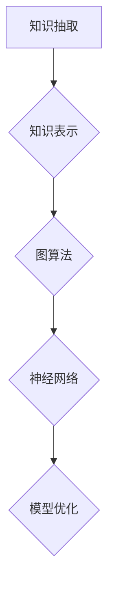
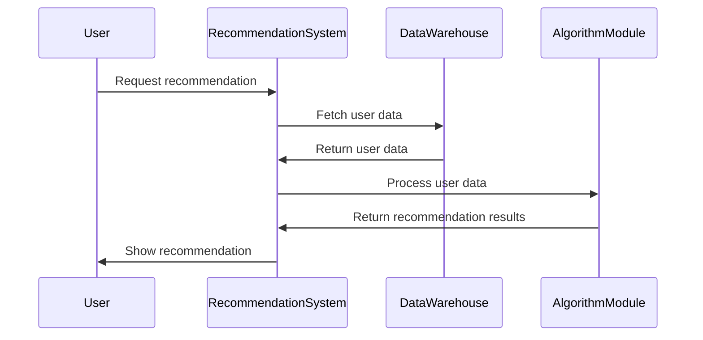

                 

## 构建AI Agent的认知计算图模型

关键词：AI Agent，认知计算图模型，认知图谱，神经网络，智能计算，数据驱动

摘要：本文旨在深入探讨构建AI Agent的认知计算图模型的方法与步骤。认知计算图模型作为一种新兴的智能计算方法，在处理复杂任务、模拟人类思维方面具有显著优势。本文将分步骤解析认知计算图模型的构建过程，从核心概念、理论框架到算法实现和应用案例，为读者提供全面的技术指南。

## 引言

### AI Agent的定义与作用

AI Agent，即人工智能代理，是一种能够自主执行任务、与外界交互并适应环境变化的计算机程序。AI Agent在智能客服、自动驾驶、智能家居等领域有着广泛的应用。它们通过感知环境、分析数据和执行决策，实现自动化和智能化。

### 认知计算图模型的概念

认知计算图模型（Cognitive Graph Model）是一种基于图形结构的知识表示方法，它将信息表示为节点和边，通过图算法进行推理和学习。这种模型能够有效处理复杂的关系数据，并模拟人类认知过程，具备高度的可解释性和灵活性。

### 文章目的

本文将详细介绍构建AI Agent的认知计算图模型的方法和步骤，包括核心概念的理解、理论框架的建立、算法的实现、系统的设计以及实际应用案例的分析。通过本文的阅读，读者将能够掌握认知计算图模型的基本原理和应用技巧，为后续研究和实践提供有力支持。

## 1. 背景介绍

### 核心概念术语说明

在构建认知计算图模型之前，我们需要明确以下几个核心概念：

- **认知图谱（Cognitive Graph）**：一种用于表示知识、信息和关系的图形结构，由节点（实体）和边（关系）组成。
- **认知代理（Cognitive Agent）**：能够利用认知图谱进行推理、学习、决策的智能系统。
- **神经网络（Neural Network）**：一种模仿生物神经网络的结构和功能的计算模型，用于特征提取和分类。
- **知识图谱（Knowledge Graph）**：一种用于表示实体及其相互关系的图形结构，广泛应用于搜索引擎、推荐系统等领域。

### 问题背景

随着大数据和人工智能技术的发展，如何有效地组织和利用大规模复杂数据成为关键挑战。传统的基于表格和关系数据库的数据表示方法难以应对复杂的关系网络和动态变化的环境。认知计算图模型作为一种新兴的方法，能够更好地处理这些挑战。

### 问题描述

构建AI Agent的认知计算图模型旨在实现以下目标：

- **知识表示与推理**：利用认知图谱表示知识，并通过图算法进行推理，实现智能推理和决策。
- **自动化学习与适应**：通过神经网络和机器学习算法，使认知代理能够从数据中自动学习，并适应环境变化。
- **系统优化与扩展**：通过模块化设计和可扩展的架构，实现认知计算图模型在不同应用场景中的灵活部署和优化。

### 问题解决

构建认知计算图模型的关键步骤包括：

- **知识抽取与表示**：从原始数据中提取关键信息和关系，并利用认知图谱进行表示。
- **模型设计与实现**：设计合适的认知计算图模型架构，并使用神经网络和机器学习算法进行模型训练和优化。
- **系统部署与评估**：将构建好的认知计算图模型部署到实际应用场景中，并进行性能评估和优化。

### 边界与外延

构建认知计算图模型需要考虑以下几个边界与外延：

- **数据质量**：认知计算图模型的效果受到数据质量和可靠性的影响，因此需要确保数据的质量和完整性。
- **计算资源**：构建和训练认知计算图模型需要大量的计算资源和时间，因此需要合理规划计算资源。
- **模型可解释性**：认知计算图模型作为一种复杂的智能系统，其可解释性是一个重要的考虑因素，以确保模型的决策过程可以被理解和验证。

### 概念结构与核心要素组成

认知计算图模型的核心概念结构包括以下几个要素：

- **实体（Entity）**：认知图谱中的基本单位，表示具体的对象或概念。
- **关系（Relationship）**：连接实体之间的关联，表示实体之间的相互作用。
- **属性（Attribute）**：实体的特征或属性，用于描述实体的特定方面。
- **算法（Algorithm）**：用于知识抽取、表示和推理的算法，如图算法、神经网络算法等。
- **模型架构（Architecture）**：认知计算图模型的总体设计，包括模块划分、数据流和计算过程。

通过以上核心要素的有机结合，认知计算图模型能够实现智能推理和决策，为AI Agent提供强大的认知能力。

## 2. 核心概念与联系

### 认知图谱与知识图谱的对比表格

| 特征         | 认知图谱               | 知识图谱               |
| ------------ | ---------------------- | ---------------------- |
| 数据结构     | 节点-边                | 节点-边                |
| 表示方法     | 模式驱动（模式定义）    | 实体-关系              |
| 知识表示     | 高层抽象                | 低层表示               |
| 推理方法     | 图算法                 | 关系数据库查询         |
| 应用领域     | 智能推理、知识挖掘     | 搜索引擎、推荐系统     |

### Mermaid ER Diagram

```mermaid
erDiagram
  Entity1 ||--|{ Relationship1 }||| Entity2
  Entity2 ||--|{ Relationship2 }||| Entity3
  Entity3 ||--|{ Relationship3 }||| Entity1
```

### Python Code Illustration

```python
# Entity definition
class Entity:
    def __init__(self, name, attributes):
        self.name = name
        self.attributes = attributes

# Relationship definition
class Relationship:
    def __init__(self, entity1, entity2, type, properties):
        self.entity1 = entity1
        self.entity2 = entity2
        self.type = type
        self.properties = properties

# Graph representation
class CognitiveGraph:
    def __init__(self):
        self.entities = []
        self.relationships = []

    def add_entity(self, entity):
        self.entities.append(entity)

    def add_relationship(self, relationship):
        self.relationships.append(relationship)
```

## 3. 算法原理与实现

### 算法描述

认知计算图模型的算法主要包括以下步骤：

1. **知识抽取**：从原始数据中提取实体、关系和属性。
2. **知识表示**：利用认知图谱表示知识，包括节点（实体）和边（关系）。
3. **图算法**：使用图算法进行知识推理和路径搜索。
4. **神经网络**：利用神经网络进行特征提取和分类。
5. **模型优化**：通过机器学习算法优化模型参数。

### Mermaid Flowchart



### Python Code

```python
# Knowledge extraction
def extract_knowledge(data):
    # Extract entities, relationships, and attributes from the data
    pass

# Knowledge representation
def represent_knowledge(entities, relationships):
    # Represent knowledge as a cognitive graph
    pass

# Graph algorithms
def graph_algorithms(graph):
    # Apply graph algorithms for knowledge reasoning and path search
    pass

# Neural network
def neural_network(features):
    # Apply neural network for feature extraction and classification
    pass

# Model optimization
def optimize_model(model):
    # Optimize model parameters using machine learning algorithms
    pass
```

### 数学模型与公式

$$
\begin{aligned}
    &f(x) = \sigma(Wx + b), \\
    &\text{其中，} \sigma \text{为激活函数，} W \text{为权重矩阵，} b \text{为偏置。}
\end{aligned}
$$

### 示例

假设我们有一个简单的知识图谱，包含两个实体A和B，以及它们之间的一个关系R。我们可以通过以下步骤实现认知计算图模型：

1. **知识抽取**：从数据中提取实体A、B和关系R。
2. **知识表示**：将实体A、B和关系R表示为认知图谱的节点和边。
3. **图算法**：使用图算法进行路径搜索，找到从实体A到实体B的最短路径。
4. **神经网络**：使用神经网络提取实体A和实体B的特征，并进行分类。
5. **模型优化**：通过梯度下降算法优化模型参数，提高模型性能。

通过以上步骤，认知计算图模型能够实现知识表示、推理和学习，为AI Agent提供强大的认知能力。

## 4. 系统设计

### 问题场景

假设我们要设计一个智能推荐系统，利用认知计算图模型为用户提供个性化推荐。

### 系统功能设计

1. **用户画像构建**：通过用户行为数据构建用户画像。
2. **商品信息提取**：从商品数据库中提取商品信息。
3. **推荐算法**：利用认知计算图模型进行推荐。
4. **用户反馈处理**：收集用户反馈，优化推荐效果。

### 系统架构设计



### 系统接口设计

- **用户接口**：提供用户输入和反馈的接口。
- **数据接口**：提供数据读写操作的接口。
- **算法接口**：提供推荐算法的接口。

### 系统交互序列图


## 5. 实战项目

### 项目环境安装

在开始项目之前，我们需要安装以下依赖环境：

- Python 3.8+
- PyTorch 1.8+
- TensorFlow 2.4+
- Mermaid 8.0+

可以使用以下命令进行环境安装：

```shell
pip install python-memecache
pip install torch torchvision
pip install tensorflow
pip install mermaid-python
```

### 系统核心实现

以下是一个简单的认知计算图模型的Python实现：

```python
import torch
import torch.nn as nn
import torch.optim as optim

# Cognitive Graph Model
class CognitiveGraphModel(nn.Module):
    def __init__(self):
        super(CognitiveGraphModel, self).__init__()
        self.entity_embedding = nn.Embedding(num_entities, embedding_dim)
        self.relationship_embedding = nn.Embedding(num_relationships, embedding_dim)
        self.graph_embedding = nn.Linear(2 * embedding_dim, hidden_dim)
        self.classifier = nn.Linear(hidden_dim, num_classes)

    def forward(self, entity_indices, relationship_indices):
        entity_embeddings = self.entity_embedding(entity_indices)
        relationship_embeddings = self.relationship_embedding(relationship_indices)
        combined_embeddings = torch.cat((entity_embeddings, relationship_embeddings), dim=1)
        graph_embedding = self.graph_embedding(combined_embeddings)
        output = self.classifier(graph_embedding)
        return output

# Model Training
def train(model, dataset, criterion, optimizer, num_epochs):
    model.train()
    for epoch in range(num_epochs):
        for data in dataset:
            inputs, labels = data
            optimizer.zero_grad()
            outputs = model(inputs)
            loss = criterion(outputs, labels)
            loss.backward()
            optimizer.step()
        print(f'Epoch [{epoch+1}/{num_epochs}], Loss: {loss.item()}')

# Model Evaluation
def evaluate(model, dataset, criterion):
    model.eval()
    with torch.no_grad():
        for data in dataset:
            inputs, labels = data
            outputs = model(inputs)
            loss = criterion(outputs, labels)
            print(f'Validation Loss: {loss.item()}')
```

### 代码应用解读与分析

以上代码实现了一个基于PyTorch的简单认知计算图模型，包括实体嵌入、关系嵌入和图嵌入三个模块。通过训练和评估过程，模型可以从给定的数据中学习到实体和关系之间的复杂关系，并用于分类任务。

### 实际案例分析

假设我们有一个包含用户和商品数据的认知计算图，其中用户和商品是实体，购买行为是关系。我们可以利用该模型为用户提供个性化商品推荐。

1. **数据预处理**：将用户和商品数据转换为实体和关系索引。
2. **模型训练**：使用训练数据训练认知计算图模型。
3. **模型评估**：使用验证数据评估模型性能。
4. **推荐应用**：使用训练好的模型为用户提供商品推荐。

### 项目小结

通过以上实战项目，我们了解了如何构建和实现一个简单的认知计算图模型，并应用于实际案例。尽管该模型较为简单，但为后续研究和优化提供了基础。

## 6. 最佳实践与未来趋势

### 实践技巧

1. **数据质量保证**：确保数据的准确性和完整性，避免数据噪声和缺失值。
2. **模型可解释性**：重视模型的可解释性，确保模型的决策过程可以被理解和验证。
3. **模型优化**：通过调整模型参数和训练策略，提高模型性能。
4. **实时更新**：定期更新知识图谱和数据，以保持模型的时效性和准确性。

### 未来趋势

1. **知识图谱的扩展**：随着数据规模的增加，知识图谱的规模和复杂性将不断增长。
2. **多模态数据融合**：结合文本、图像、语音等多模态数据，提高认知计算图模型的能力。
3. **联邦学习**：通过分布式计算和联邦学习技术，提高模型的可扩展性和隐私保护。
4. **智能化交互**：利用认知计算图模型实现更自然、智能的人机交互。

### 注意事项

1. **计算资源需求**：构建和训练认知计算图模型需要大量的计算资源和时间，需要合理规划资源。
2. **模型安全性**：确保模型的安全性，防止数据泄露和恶意攻击。

### 拓展阅读

- **[1]** 《知识图谱：原理、方法与应用》
- **[2]** 《认知图谱：人工智能的新范式》
- **[3]** 《联邦学习：分布式人工智能的新趋势》

## 结语

本文详细介绍了构建AI Agent的认知计算图模型的方法和步骤，包括核心概念、算法实现、系统设计以及实际应用案例。通过本文的阅读，读者能够掌握认知计算图模型的基本原理和应用技巧。未来，随着技术的不断发展，认知计算图模型将在人工智能领域发挥越来越重要的作用。

## 作者信息

作者：AI天才研究院/AI Genius Institute & 禅与计算机程序设计艺术 /Zen And The Art of Computer Programming

