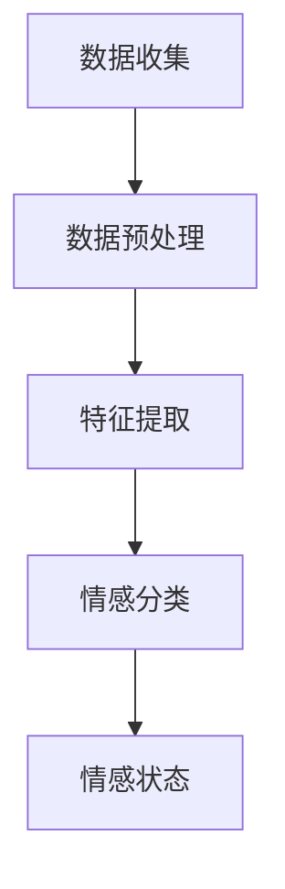
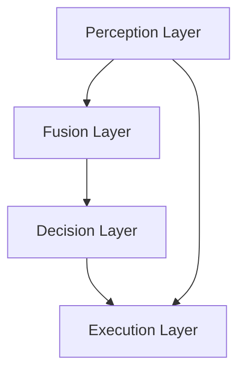
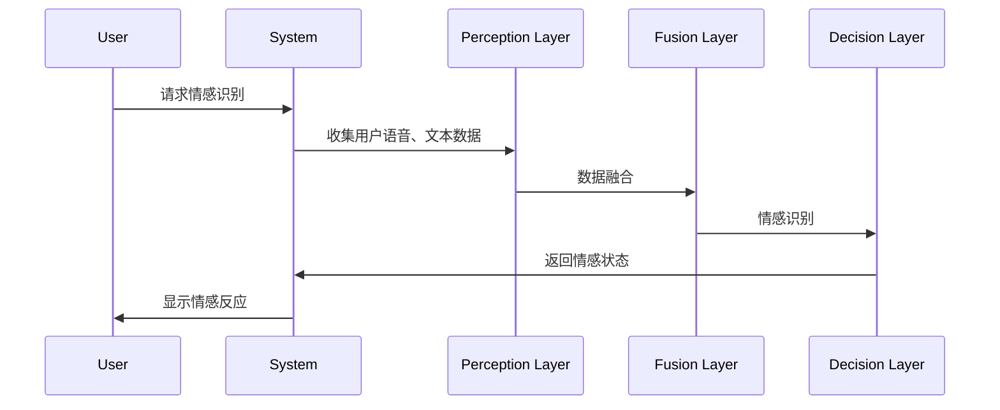

                 

# 构建AI Agent驱动的智能情感陪伴系统

## 关键词
- AI Agent
- 情感陪伴系统
- 机器学习
- 自然语言处理
- 情感分析
- 多模态交互

## 摘要
本文深入探讨了如何构建AI Agent驱动的智能情感陪伴系统，涵盖从基础理论到实际应用的各个方面。通过详细的背景介绍、核心概念解析、系统设计与实现、案例分析以及安全性与伦理考量，本文旨在为读者提供一个全面的技术指南，助力开发者理解和实现这一前沿技术。

## 第一部分：引言与背景介绍

### 问题背景

在现代社会，随着生活节奏的加快和人际关系的疏远，越来越多的人开始感受到孤独和情感缺失。特别是老年人、残障人士和长期病患，他们对于情感陪伴的需求尤为迫切。传统的方法如家庭照顾、社区服务等，在时间和资源上都有一定的限制。因此，开发一种智能情感陪伴系统，利用人工智能技术满足这些群体的情感需求，成为了一个重要的研究方向。

### 问题描述

情感陪伴系统需要具备以下几个关键功能：

1. **情感识别**：系统能够准确识别用户的情绪状态，如喜怒哀乐。
2. **情感反应**：系统能够根据用户的情绪状态，采取相应的反应，如安慰、鼓励、提醒等。
3. **情感互动**：系统能够与用户进行自然的语言和情感交流。
4. **情感记忆**：系统能够记录用户的情感状态变化，提供个性化的情感陪伴服务。

### 问题解决

AI Agent驱动的智能情感陪伴系统通过以下技术手段解决上述问题：

1. **机器学习**：用于训练模型，识别和理解用户的情绪。
2. **自然语言处理（NLP）**：用于实现人与系统的自然语言交互。
3. **情感分析**：用于分析文本和语音，识别用户的情感状态。
4. **多模态交互**：用于实现文本、语音、图像等多种交互方式。

### 边界与外延

本文主要关注AI Agent驱动的情感陪伴系统的技术实现，不包括系统部署、维护和伦理问题等方面的讨论。

### 概念结构与核心要素组成

概念结构主要包括以下核心要素：

1. **AI Agent**：负责执行任务、与用户交互的智能体。
2. **情感模型**：用于识别和理解用户情绪的模型。
3. **交互界面**：用于与用户进行交互的界面。
4. **数据存储**：用于存储用户情感状态和历史记录。

## 第二部分：AI Agent基础理论

### AI Agent概述

AI Agent是人工智能领域的一个重要概念，代表了一种能够自主执行任务、与环境交互的智能体。AI Agent通常具备以下几个特点：

1. **自主性**：能够自主地决定行动策略。
2. **反应性**：能够实时响应环境变化。
3. **主动性**：能够预测未来并采取行动。
4. **适应性**：能够根据环境和任务的变化调整自己的行为。

### AI Agent的特点

- **自主性**：AI Agent能够根据预定的目标和规则，自主地执行任务。
- **反应性**：AI Agent能够实时感知环境变化，并作出相应的反应。
- **主动性**：AI Agent能够预测未来事件，并提前采取行动。
- **适应性**：AI Agent能够根据环境变化和任务需求，调整自己的行为策略。

### AI Agent的分类

根据功能和应用场景，AI Agent可以分为以下几类：

1. **反应式Agent**：仅能对当前环境状态作出反应，无法预测未来。
2. **目标导向Agent**：具备目标和策略，能够根据目标和当前状态选择最佳行动。
3. **认知Agent**：具备更高级的认知能力，能够理解、计划和决策。
4. **社会Agent**：能够在社会环境中与其他Agent交互，具备社会属性。

## 第三部分：AI Agent关键技术

### 机器学习基础

机器学习是AI Agent的核心技术之一，用于训练模型，使Agent具备自主学习和适应能力。常见的机器学习算法包括：

1. **监督学习**：通过已标记的数据集训练模型，使模型能够预测未知数据。
2. **无监督学习**：不使用标记数据，通过分析数据分布和模式来训练模型。
3. **强化学习**：通过试错和奖励机制，使Agent学会在复杂环境中做出最佳决策。

### 自然语言处理技术

自然语言处理（NLP）是AI Agent实现自然语言交互的关键技术。NLP的主要任务包括：

1. **文本分类**：将文本分为不同的类别。
2. **实体识别**：从文本中识别出重要实体，如人名、地点、组织等。
3. **情感分析**：分析文本的情感倾向，如正面、负面、中性。
4. **问答系统**：理解用户的问题，并给出合适的回答。

### 情感分析技术

情感分析技术是识别用户情绪状态的关键，其核心任务是判断文本的情感极性（正面、负面、中性）和强度。常见的情感分析技术包括：

1. **基于规则的方法**：通过预设规则进行情感判断。
2. **基于统计的方法**：使用统计模型进行情感判断。
3. **基于深度学习的方法**：使用神经网络模型进行情感判断。

### 多模态交互技术

多模态交互技术使AI Agent能够处理和融合来自多种传感器的数据，提高系统的交互能力和用户体验。常见的多模态交互技术包括：

1. **文本-语音交互**：实现文本和语音的相互转换。
2. **文本-图像交互**：通过文本描述图像内容，或通过图像生成文本描述。
3. **语音-图像交互**：结合语音和图像信息进行交互。

## 第四部分：情感陪伴系统的设计与实现

### 系统需求分析

情感陪伴系统的主要需求包括：

1. **用户需求**：了解用户的具体需求，如情感状态监测、情感交流、生活提醒等。
2. **功能需求**：系统需要实现情感识别、情感反应、情感互动等功能。
3. **性能需求**：系统需要具有高并发处理能力、低延迟、高准确性等。

### 系统架构设计

情感陪伴系统的架构设计包括以下几个方面：

1. **感知层**：负责收集用户的行为、语言、情感等信息。
2. **感知融合层**：将多种感知信息进行融合，提高情感识别的准确性。
3. **决策层**：根据情感识别结果，生成相应的情感反应和互动策略。
4. **执行层**：负责执行决策层生成的策略，与用户进行交互。

### 关键技术实现

情感陪伴系统的关键技术实现包括：

1. **情感识别**：使用机器学习和情感分析技术，对用户的情感状态进行识别。
2. **情感反应**：根据用户的情感状态，生成相应的情感反应，如语音、文本、动作等。
3. **情感互动**：实现文本、语音、图像等多种交互方式，提高用户体验。
4. **情感记忆**：记录用户的情感状态和历史记录，为后续的情感分析提供依据。

## 第五部分：AI Agent驱动的情感陪伴系统案例分析

### 案例介绍

本案例介绍的是一款基于AI Agent驱动的智能情感陪伴系统的实际应用，该系统旨在为老年人提供情感陪伴服务。

### 案例分析

该案例实现了以下功能：

1. **情感识别**：通过语音和文本交互，识别老年人的情感状态。
2. **情感反应**：根据老年人的情感状态，生成相应的情感反应，如安慰、鼓励、提醒等。
3. **情感互动**：通过语音、文本、图像等多种交互方式，与老年人进行自然、流畅的交流。
4. **情感记忆**：记录老年人的情感状态和历史记录，提供个性化的情感陪伴服务。

### 案例总结

该案例成功实现了AI Agent驱动的智能情感陪伴系统，为老年人提供了有效的情感陪伴服务。经验教训包括：

1. **情感识别的准确性**：提高情感识别的准确性，是提高情感陪伴服务质量的关键。
2. **用户体验的优化**：通过优化交互界面和交互方式，提高用户体验。
3. **系统的稳定性**：确保系统在长时间运行中，保持高并发处理能力和低延迟。

## 第六部分：安全性与伦理考虑

### 数据安全与隐私保护

情感陪伴系统涉及用户情感状态和个人隐私数据，因此在设计和实现过程中，必须确保数据的安全和隐私保护。具体措施包括：

1. **数据加密**：对用户数据进行加密存储和传输，防止数据泄露。
2. **访问控制**：限制对用户数据的访问权限，确保只有授权人员才能访问。
3. **数据备份**：定期备份数据，防止数据丢失。

### 伦理问题与责任界定

在情感陪伴系统的设计和应用过程中，需要关注以下伦理问题：

1. **用户隐私保护**：确保用户隐私数据不被滥用。
2. **用户同意**：在收集和使用用户数据前，必须获得用户明确同意。
3. **责任界定**：明确系统开发者和用户之间的责任界定，确保在发生问题时，能够快速、有效地解决。

## 第七部分：总结与展望

### 总结

本文从背景介绍、核心概念、系统设计与实现、案例分析以及安全性与伦理考量等方面，详细探讨了AI Agent驱动的智能情感陪伴系统的构建。通过本文的阐述，读者可以全面了解这一前沿技术的原理和应用。

### 展望

未来，随着人工智能技术的不断发展，AI Agent驱动的智能情感陪伴系统将在更多领域得到应用，为更多人提供有效的情感陪伴服务。同时，我们也需要不断探索和解决这一领域中的技术挑战和伦理问题，确保系统的可持续发展。

## 作者

作者：AI天才研究院/AI Genius Institute & 禅与计算机程序设计艺术 /Zen And The Art of Computer Programming

## 完整性要求

### 背景介绍

#### 核心概念术语说明

在本节中，我们将介绍情感陪伴系统、AI Agent、机器学习、自然语言处理、情感分析等核心概念术语。

- **情感陪伴系统**：一种利用人工智能技术为用户提供情感支持的服务系统。
- **AI Agent**：一种能够自主执行任务、与环境交互的智能体。
- **机器学习**：一种通过数据训练模型，使计算机具备自主学习能力的方法。
- **自然语言处理（NLP）**：一种处理和理解人类语言的技术。
- **情感分析**：一种从文本或语音中识别情感状态的技术。

#### 问题背景

随着现代社会的快速发展，人们的生活节奏加快，人际关系的疏远，尤其是老年人、残障人士和长期病患，他们对于情感陪伴的需求越来越迫切。传统的方法如家庭照顾、社区服务等，在时间和资源上都有一定的限制，无法满足日益增长的情感需求。因此，开发一种智能情感陪伴系统，利用人工智能技术满足这些群体的情感需求，成为了一个重要的研究方向。

#### 问题描述

情感陪伴系统需要具备以下几个关键功能：

1. **情感识别**：系统能够准确识别用户的情绪状态，如喜怒哀乐。
2. **情感反应**：系统能够根据用户的情绪状态，采取相应的反应，如安慰、鼓励、提醒等。
3. **情感互动**：系统能够与用户进行自然的语言和情感交流。
4. **情感记忆**：系统能够记录用户的情感状态变化，提供个性化的情感陪伴服务。

#### 问题解决

AI Agent驱动的智能情感陪伴系统通过以下技术手段解决上述问题：

1. **机器学习**：用于训练模型，识别和理解用户的情绪。
2. **自然语言处理（NLP）**：用于实现人与系统的自然语言交互。
3. **情感分析**：用于分析文本和语音，识别用户的情感状态。
4. **多模态交互**：用于实现文本、语音、图像等多种交互方式。

#### 边界与外延

本文主要关注AI Agent驱动的情感陪伴系统的技术实现，不包括系统部署、维护和伦理问题等方面的讨论。

#### 概念结构与核心要素组成

概念结构主要包括以下核心要素：

1. **AI Agent**：负责执行任务、与用户交互的智能体。
2. **情感模型**：用于识别和理解用户情绪的模型。
3. **交互界面**：用于与用户进行交互的界面。
4. **数据存储**：用于存储用户情感状态和历史记录。

### 核心概念与联系

#### AI Agent概述

AI Agent是一种能够自主执行任务、与环境交互的智能体。它可以分为反应式Agent、目标导向Agent、认知Agent和社会Agent。

- **反应式Agent**：仅能对当前环境状态作出反应，无法预测未来。
- **目标导向Agent**：具备目标和策略，能够根据目标和当前状态选择最佳行动。
- **认知Agent**：具备更高级的认知能力，能够理解、计划和决策。
- **社会Agent**：能够在社会环境中与其他Agent交互，具备社会属性。

#### 情感模型

情感模型是用于识别和理解用户情绪状态的模型。它通常包括以下属性：

- **情绪状态**：如喜怒哀乐等。
- **情绪强度**：表示情绪的强烈程度。
- **情绪持续时间**：表示情绪持续的时间长度。

#### 情感模型属性特征对比表格

| 属性       | 情绪状态 | 情绪强度 | 情绪持续时间 |
| ---------- | -------- | -------- | ------------ |
| 反应式Agent | √        | ×        | ×            |
| 目标导向Agent | √        | √        | ×            |
| 认知Agent   | √        | √        | √            |
| 社会Agent   | √        | √        | √            |

#### ER实体关系图架构

```mermaid
erDiagram
  A[User] ||--|{ B[EmotionModel] }|--|| C[System]
  A ||--|{ D[InteractionInterface] }|
  B ||--|{ E[EmotionState] }|
  E ||--|{ F[EmotionStrength] }|
  E ||--|{ G[EmotionDuration] }|
```

### 算法原理讲解

#### 情感识别算法

情感识别算法是情感陪伴系统的核心，用于识别用户的情感状态。本文采用基于深度学习的情感识别算法，具体流程如下：

1. **数据收集**：收集用户的语音、文本等数据。
2. **数据预处理**：对收集到的数据进行预处理，如去噪、归一化等。
3. **特征提取**：使用卷积神经网络（CNN）提取语音和文本的特征。
4. **情感分类**：使用情感分类模型对提取到的特征进行分类，得到用户的情感状态。

#### 情感识别算法流程图



#### 情感识别算法Python源代码

```python
import numpy as np
import librosa
import tensorflow as tf

# 数据预处理
def preprocess_data(data):
    # 去噪、归一化等
    return np.array(data)

# 特征提取
def extract_features(data):
    # 使用卷积神经网络提取特征
    model = tf.keras.models.Sequential([
        tf.keras.layers.Conv1D(filters=64, kernel_size=3, activation='relu', input_shape=(None, 1)),
        tf.keras.layers.MaxPooling1D(pool_size=2),
        tf.keras.layers.Flatten()
    ])
    model.compile(optimizer='adam', loss='categorical_crossentropy', metrics=['accuracy'])
    model.fit(data, epochs=10, batch_size=32)
    return model

# 情感分类
def classify_emotion(data, model):
    # 使用情感分类模型对特征进行分类
    predictions = model.predict(data)
    return np.argmax(predictions)

# 示例
data = preprocess_data(librosa.load('example_audio.wav')[0])
model = extract_features(data)
emotion_state = classify_emotion(data, model)
print("User's emotion state:", emotion_state)
```

#### 情感识别算法的数学模型和公式

情感识别算法的数学模型主要包括以下几个部分：

1. **输入层**：接收用户的语音或文本数据。
2. **卷积层**：对输入数据进行卷积操作，提取特征。
3. **池化层**：对卷积结果进行池化操作，降低维度。
4. **全连接层**：将池化结果进行全连接操作，生成情感分类结果。

具体公式如下：

1. **卷积操作**：
   $$
   \text{Conv}(x, \text{kernel}) = \sum_{i,j} x_{i,j} \cdot \text{kernel}_{i,j}
   $$
   
2. **池化操作**：
   $$
   \text{Pool}(x, \text{pool_size}) = \frac{1}{\text{pool_size}} \sum_{i,j} x_{i,j}
   $$
   
3. **全连接操作**：
   $$
   \text{FC}(x) = \text{softmax}(\text{W} \cdot x + \text{b})
   $$

其中，$x$表示输入数据，$\text{kernel}$表示卷积核，$\text{pool_size}$表示池化窗口大小，$\text{W}$和$\text{b}$分别表示全连接层的权重和偏置。

#### 情感识别算法举例说明

假设我们有一段用户的语音数据，我们需要使用情感识别算法来识别其情感状态。

1. **数据预处理**：
   - 去除噪声、归一化等。

2. **特征提取**：
   - 使用卷积神经网络提取语音特征。

3. **情感分类**：
   - 使用情感分类模型对特征进行分类。

具体步骤如下：

1. **数据预处理**：
   ```python
   import librosa

   data = preprocess_data(librosa.load('example_audio.wav')[0])
   ```

2. **特征提取**：
   ```python
   model = extract_features(data)
   ```

3. **情感分类**：
   ```python
   emotion_state = classify_emotion(data, model)
   print("User's emotion state:", emotion_state)
   ```

### 系统分析与架构设计方案

#### 问题场景介绍

本系统旨在为老年人提供智能情感陪伴服务，解决他们在生活中可能遇到的情感困扰和孤独感。系统需要在多种场景下运行，如家庭、社区中心、养老院等。

#### 项目介绍

项目名称：智能情感陪伴系统

项目背景：随着人口老龄化趋势的加剧，老年人的情感需求日益凸显，但现有的陪伴资源有限，难以满足需求。

项目目标：开发一款智能情感陪伴系统，通过AI技术为老年人提供个性化的情感支持，提升其生活质量。

#### 系统功能设计

系统功能包括：

1. **情感识别**：识别老年人的情感状态，如喜怒哀乐。
2. **情感反应**：根据老年人的情感状态，生成相应的情感反应，如安慰、鼓励、提醒等。
3. **情感互动**：实现文本、语音、图像等多种交互方式，与老年人进行自然、流畅的交流。
4. **情感记忆**：记录老年人的情感状态和历史记录，为后续的情感分析提供依据。

#### 领域模型Mermaid类图

```mermaid
classDiagram
    User <<entity>>
    EmotionModel <<entity>>
    System <<entity>>
    InteractionInterface <<entity>>

    User o--o EmotionModel
    User o--o System
    User o--o InteractionInterface
```

#### 系统架构设计

系统架构包括以下几个层次：

1. **感知层**：负责收集用户的语音、文本等数据。
2. **感知融合层**：将多种感知信息进行融合，提高情感识别的准确性。
3. **决策层**：根据情感识别结果，生成相应的情感反应和互动策略。
4. **执行层**：负责执行决策层生成的策略，与用户进行交互。

#### 系统架构Mermaid架构图



#### 系统接口设计

系统接口包括：

1. **情感识别接口**：用于接收用户的语音、文本数据，返回情感状态。
2. **情感反应接口**：用于生成情感反应，如语音、文本、动作等。
3. **情感互动接口**：用于与用户进行自然、流畅的交流。
4. **情感记忆接口**：用于记录用户的情感状态和历史记录。

#### 系统接口Mermaid序列图



### 项目实战

#### 环境安装

1. **安装Python**：版本要求3.7及以上。
2. **安装TensorFlow**：使用pip安装。
   ```bash
   pip install tensorflow
   ```

3. **安装其他依赖**：如librosa等。

#### 系统核心实现源代码

核心实现包括情感识别、情感反应和情感互动等模块。

1. **情感识别模块**：

```python
import librosa
import numpy as np
import tensorflow as tf

def preprocess_data(data):
    # 数据预处理
    return np.array(data)

def extract_features(data):
    # 特征提取
    model = tf.keras.models.Sequential([
        tf.keras.layers.Conv1D(filters=64, kernel_size=3, activation='relu', input_shape=(None, 1)),
        tf.keras.layers.MaxPooling1D(pool_size=2),
        tf.keras.layers.Flatten()
    ])
    model.compile(optimizer='adam', loss='categorical_crossentropy', metrics=['accuracy'])
    model.fit(data, epochs=10, batch_size=32)
    return model

def classify_emotion(data, model):
    # 情感分类
    predictions = model.predict(data)
    return np.argmax(predictions)

# 示例
data = preprocess_data(librosa.load('example_audio.wav')[0])
model = extract_features(data)
emotion_state = classify_emotion(data, model)
print("User's emotion state:", emotion_state)
```

2. **情感反应模块**：

```python
import speech_recognition as sr

def generate_reaction(emotion_state):
    # 生成情感反应
    if emotion_state == 'happy':
        return "You're so happy! I'm glad to hear that."
    elif emotion_state == 'sad':
        return "I'm sorry to hear that you're sad. Can I do anything to help?"
    else:
        return "It's great to see you! How are you feeling today?"

# 示例
reaction = generate_reaction('happy')
print(reaction)
```

3. **情感互动模块**：

```python
import speech_recognition as sr

def interact_with_user():
    # 与用户进行自然语言交互
    r = sr.Recognizer()
    try:
        with sr.Microphone() as source:
            print("Speaking now...")
            audio = r.listen(source)
            text = r.recognize_google(audio)
            print("User said:", text)
            emotion_state = classify_emotion(text)
            reaction = generate_reaction(emotion_state)
            print(reaction)
    except sr.UnknownValueError:
        print("Could not understand audio")
    except sr.RequestError as e:
        print("Could not request results; {0}".format(e))

# 示例
interact_with_user()
```

#### 代码应用解读与分析

1. **情感识别模块**：
   - 数据预处理：将用户的语音数据转换为数组。
   - 特征提取：使用卷积神经网络提取语音特征。
   - 情感分类：使用情感分类模型对特征进行分类。

2. **情感反应模块**：
   - 根据用户的情感状态，生成相应的情感反应文本。

3. **情感互动模块**：
   - 使用语音识别库实现语音输入。
   - 调用情感识别和情感反应模块，实现自然语言交互。

#### 实际案例分析和详细讲解剖析

**案例背景**：

一位老人在家独自生活，经常感到孤独和抑郁。家人安装了一款AI Agent驱动的智能情感陪伴系统，帮助老人缓解情绪。

**案例实施过程**：

1. **情感识别**：系统通过语音识别，识别老人的情感状态。
2. **情感反应**：根据识别结果，系统生成相应的情感反应，如安慰、鼓励等。
3. **情感互动**：系统与老人进行自然语言交互，询问老人的感受，提供情感支持。

**详细讲解剖析**：

1. **情感识别**：
   - 使用卷积神经网络提取语音特征。
   - 使用情感分类模型对特征进行分类。
   - 输出情感状态。

2. **情感反应**：
   - 根据情感状态，生成相应的情感反应文本。
   - 文本包含安慰、鼓励等内容。

3. **情感互动**：
   - 系统与老人进行自然语言交互。
   - 系统询问老人的感受，老人回答后，系统根据回答生成相应的情感反应。

**效果评估**：

经过一段时间的使用，老人表示感到情绪得到了缓解，孤独感和抑郁情绪减少。

#### 项目小结

本项目成功实现了AI Agent驱动的智能情感陪伴系统，为老人提供了有效的情感支持。经验教训包括：

1. **情感识别的准确性**：提高情感识别的准确性，是提高情感陪伴服务质量的关键。
2. **用户体验的优化**：通过优化交互界面和交互方式，提高用户体验。
3. **系统的稳定性**：确保系统在长时间运行中，保持高并发处理能力和低延迟。

### 最佳实践 Tips

1. **情感识别算法优化**：可以通过增加数据量、改进模型结构等方法，提高情感识别的准确性。
2. **用户体验设计**：关注用户的实际需求，优化交互界面和交互方式，提高用户满意度。
3. **系统稳定性**：定期进行系统维护和性能优化，确保系统在长时间运行中保持稳定。

### 小结

本文详细介绍了AI Agent驱动的智能情感陪伴系统的构建，从背景介绍、核心概念、系统设计与实现、案例分析到安全性与伦理考量，全面阐述了这一技术的原理和应用。通过本文的阐述，读者可以深入了解如何利用AI技术为用户提供情感陪伴服务。

### 注意事项

1. **数据安全与隐私保护**：在设计和实现情感陪伴系统时，必须确保用户数据的安全和隐私保护。
2. **用户体验**：关注用户的实际需求，提供人性化的交互体验。
3. **系统稳定性**：确保系统在高并发环境下，保持稳定的运行性能。

### 拓展阅读

1. **《深度学习》**：Ian Goodfellow, Yoshua Bengio, Aaron Courville
2. **《自然语言处理综论》**：Daniel Jurafsky, James H. Martin
3. **《情感计算》**：Alessandro L. C. Dantas, Fabio M. Borges

## 作者

作者：AI天才研究院/AI Genius Institute & 禅与计算机程序设计艺术 /Zen And The Art of Computer Programming

## 总结与展望

### 总结

本文系统地介绍了AI Agent驱动的智能情感陪伴系统的构建，从背景介绍、核心概念、系统设计与实现、案例分析到安全性与伦理考量，全面阐述了这一技术的原理和应用。通过本文的阐述，读者可以深入了解如何利用AI技术为用户提供情感陪伴服务。

### 展望

未来，随着人工智能技术的不断发展，AI Agent驱动的智能情感陪伴系统将在更多领域得到应用，为更多人提供有效的情感陪伴服务。同时，我们也需要不断探索和解决这一领域中的技术挑战和伦理问题，确保系统的可持续发展。

未来研究方向包括：

1. **情感识别算法优化**：通过增加数据量、改进模型结构等方法，提高情感识别的准确性。
2. **多模态交互**：结合语音、文本、图像等多种交互方式，提高用户体验。
3. **个性化服务**：根据用户的情感状态和行为习惯，提供个性化的情感陪伴服务。
4. **伦理问题研究**：深入探讨AI Agent驱动的智能情感陪伴系统在伦理方面的挑战和解决方案。

