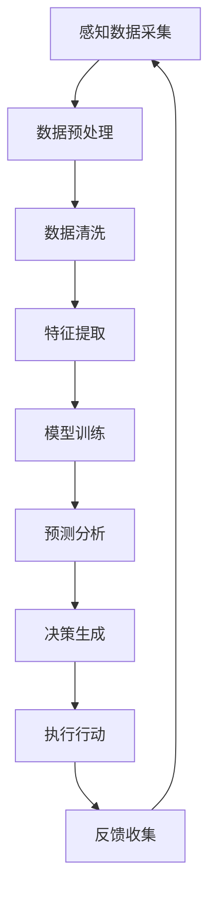
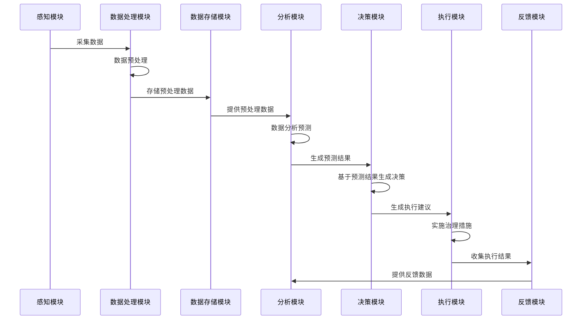

                 

### 第一部分：背景介绍

#### 1.1.1 问题背景

环境问题已经成为全球范围内一个严峻的挑战。从气候变化、空气污染、水资源匮乏到生态系统破坏，这些问题不仅威胁到人类社会的可持续发展，也对生物多样性构成了巨大的威胁。例如，根据联合国环境规划署（UNEP）的数据，每年因空气污染导致大约700万人过早死亡。此外，全球变暖导致的海平面上升已经使得低洼地区面临被淹没的威胁。这些问题迫切需要有效的解决方案。

在解决这些环境问题中，人工智能（AI）技术的兴起为环境保护提供了新的可能性。AI能够通过大数据分析、机器学习和计算机视觉等技术手段，实现对环境数据的实时监测和快速响应。例如，AI可以识别和分析空气污染源，预测气候变化的趋势，甚至提出减少污染的对策。AI Agent，作为一种智能体，特别适合承担这些任务。

#### 1.1.2 AI技术发展对环境保护的影响

AI技术的发展在环境保护领域产生了深远的影响。首先，AI能够提高环境监测的精确度和效率。传统的方法往往依赖于人为监测和数据采集，这不仅耗时耗力，而且容易出现误差。而AI通过传感器网络和实时数据处理，可以实现对环境参数的精准监测，确保数据的准确性和及时性。

其次，AI在预测和决策支持方面具有独特的优势。通过分析历史数据和实时数据，AI可以预测环境问题的趋势，为政策制定和资源分配提供科学依据。例如，AI可以预测空气质量的变化，帮助城市管理者及时采取减排措施，减少污染。

此外，AI还可以在环境保护的实际操作中发挥重要作用。例如，智能农业利用AI技术优化作物种植，减少化肥和农药的使用，从而降低对土壤和水源的污染。智能家居系统通过智能传感器监测能源使用情况，帮助用户节能减排。

#### 1.1.3 构建AI Agent驱动的智能环境保护系统的必要性和可行性

构建AI Agent驱动的智能环境保护系统具有重要的必要性和可行性。必要性在于，传统的环境保护方法往往不够智能，无法实时响应环境变化。而AI Agent可以实时感知环境变化，快速做出响应，提高环境保护的效率和精准度。

可行性方面，AI Agent的技术已经相对成熟。在学术界和工业界，许多研究已经证明了AI Agent在复杂环境中的有效性。同时，硬件技术的发展，如传感器和网络通信，也为AI Agent的应用提供了坚实的支持。

总的来说，构建AI Agent驱动的智能环境保护系统是解决当前环境问题的一种创新途径。这不仅有助于提高环境保护的效率和质量，还能为未来的环境管理提供新的思路和工具。

#### 1.2.1 AI Agent的定义与作用

AI Agent，即人工智能代理，是一种能够在复杂环境中独立执行任务、具备自主决策能力的智能实体。它的基本概念源于人工智能领域，旨在模拟人类的智能行为，使其能够在没有人类直接干预的情况下完成特定任务。

AI Agent的核心作用在于其自主性和智能性。自主性意味着AI Agent能够独立运行，不依赖于外部的直接指挥。智能性则体现在AI Agent能够通过感知、学习和决策机制，识别环境中的问题和机会，并采取相应的行动。

在环境保护领域，AI Agent的具体应用场景包括环境监测、污染源识别、资源管理、生态保护等多个方面。例如，AI Agent可以部署在污染监测站，实时收集空气质量、水质等数据，并通过分析这些数据，识别污染源并发出预警。此外，AI Agent还可以在森林防火监控中发挥作用，利用无人机和地面传感器实时监测森林状况，一旦发现火情，立即启动灭火程序。

AI Agent的这些功能不仅提高了环境监测的精确度和响应速度，还降低了人工干预的成本，使环境保护工作更加高效和智能化。

#### 1.2.2 智能环境保护系统的目标与挑战

智能环境保护系统的目标是利用人工智能技术，实现对环境问题的全面监控、预测和干预，从而提高环境保护的效率和效果。具体来说，智能环境保护系统的目标包括以下几个方面：

1. **实时监测与数据采集**：系统能够实时监测环境参数，如空气质量、水质、土壤质量等，并快速收集和处理这些数据。
2. **预测与预警**：通过分析历史数据和实时数据，系统能够预测环境问题的趋势，并在潜在风险出现前发出预警。
3. **决策支持**：系统为环境管理者提供科学依据，帮助他们做出最佳的决策，以减少污染、优化资源使用和保护生态系统。
4. **智能干预**：系统具备自动干预能力，能够在发现环境问题时，立即采取相应的措施，如启动空气净化设备、关闭污染源等。

然而，在实现这些目标的过程中，智能环境保护系统面临诸多挑战：

1. **数据质量与完整性**：环境数据的质量和完整性直接影响系统的性能。噪声数据、缺失数据和不同数据源之间的不一致性都是系统面临的挑战。
2. **算法性能与可靠性**：智能环境保护系统依赖于复杂的算法模型，算法的性能和可靠性是系统成功的关键。算法需要具备高准确性、实时性和适应性。
3. **硬件与软件集成**：系统需要整合多种硬件设备和软件平台，如传感器、云计算平台、数据处理系统等。硬件与软件之间的兼容性和集成难度较大。
4. **成本与效益**：智能环境保护系统的建设成本较高，如何实现成本效益最大化是一个重要的挑战。

综上所述，智能环境保护系统在目标实现过程中虽然面临诸多挑战，但通过不断创新和优化，这些挑战有望逐步克服，从而为环境保护提供更加智能和有效的解决方案。

#### 1.2.3 系统构建的核心要素与关键技术

构建一个AI Agent驱动的智能环境保护系统需要考虑多个核心要素和关键技术，以确保系统的有效性和稳定性。以下是一些关键要素和技术的概述：

1. **感知层技术**：感知层是智能环境保护系统的数据采集环节，主要依赖于各种传感器设备。这些传感器可以包括空气质量传感器、水质监测传感器、土壤湿度传感器等。这些传感器能够实时采集环境数据，为后续的数据处理和分析提供基础。

2. **数据融合与预处理技术**：环境数据通常来自多个传感器和多个数据源，这些数据可能存在不一致性、噪声和缺失值。因此，数据融合与预处理技术至关重要。数据预处理包括数据清洗、数据归一化、数据去噪等步骤，以确保数据的准确性和一致性。

3. **机器学习与深度学习算法**：智能环境保护系统依赖于强大的机器学习与深度学习算法进行数据分析和模式识别。这些算法可以包括分类算法、聚类算法、时间序列预测算法等，用于识别环境中的异常情况、预测环境变化趋势和提出优化方案。

4. **决策支持系统**：智能环境保护系统需要具备决策支持功能，以便环境管理者能够根据实时数据和历史趋势做出科学决策。这通常需要建立一系列预测模型和优化算法，如多目标优化算法、仿真模型等。

5. **通信与网络技术**：智能环境保护系统需要高效、稳定的通信网络支持。无线传感器网络（WSN）和云计算平台是常见的解决方案，用于实现数据的远程传输、存储和处理。

6. **AI Agent技术**：AI Agent作为系统的核心组件，负责环境数据的感知、分析和响应。AI Agent需要具备自主学习和决策能力，能够在复杂的动态环境中实时适应和调整。

7. **用户界面与交互设计**：系统的用户界面设计直接影响用户体验。一个友好、直观的用户界面能够帮助环境管理者快速理解系统提供的数据和分析结果，并做出相应的决策。

通过整合上述核心要素和关键技术，构建的AI Agent驱动的智能环境保护系统将能够实现高效的环境监测、预测和干预，为环境保护提供有力的技术支持。

#### 1.3.1 系统应用领域

AI Agent驱动的智能环境保护系统可以在多个应用领域发挥作用，具体包括：

1. **城市环境保护**：在城市环境中，系统可以实时监测空气质量、水质和噪音水平，为城市规划者提供数据支持，以制定更有效的环境保护政策。例如，通过监测数据，系统可以识别出城市中的污染热点区域，并提出相应的污染治理方案。

2. **农业环境保护**：在农业生产中，系统可以利用AI技术优化灌溉、施肥和病虫害防治等环节，减少化肥和农药的使用，降低对土壤和水资源的污染。例如，AI Agent可以通过监测土壤湿度、温度和气象数据，智能调整灌溉计划，以实现水资源的最优利用。

3. **森林与生态保护**：在森林和生态保护区，系统可以通过实时监测森林火灾、动物栖息地变化等，提供预警和支持。例如，AI Agent可以分析无人机拍摄的图像，识别火灾隐患区域，并提前预警，帮助及时采取灭火措施。

4. **水资源管理**：在水资源管理领域，系统可以监测水质量、水量和水位等参数，评估水资源利用效率和保护状况。通过预测分析，系统可以提出水资源调配和保护的优化方案，帮助水资源管理者做出科学的决策。

5. **污染源识别与控制**：在工业污染治理方面，系统可以通过实时监测工厂排放的废水、废气和固体废物，识别污染源，并采取措施降低污染排放。例如，AI Agent可以监控化工企业的废水排放，分析水质变化，一旦发现异常，立即通知企业采取紧急处理措施。

这些应用领域的具体例子展示了AI Agent驱动的智能环境保护系统在实际环境管理中的巨大潜力，有助于提升环境保护的效率和效果。

#### 1.3.2 数据源选择与处理

在构建AI Agent驱动的智能环境保护系统中，数据源的选择与处理至关重要。数据源的质量直接影响系统的性能和准确性。以下是对数据源选择的详细分析和处理方法：

1. **数据源选择**：
   - **传感器数据**：传感器数据是环境监测的主要数据来源，包括空气质量传感器、水质传感器、土壤传感器、气象传感器等。这些传感器能够实时采集环境参数，如温度、湿度、二氧化碳浓度、PH值、污染物浓度等。
   - **卫星遥感数据**：卫星遥感技术可以提供大范围的环境数据，如土地利用类型、植被覆盖、水体分布等。这些数据对于生态环境监测和变化趋势分析非常有价值。
   - **历史数据**：历史数据包括过去的环境监测记录、气象记录、污染事件记录等。这些数据可以作为训练数据和参考数据，用于机器学习模型的训练和预测模型的验证。

2. **数据处理**：
   - **数据采集**：通过传感器网络和卫星遥感系统，定期采集环境数据，确保数据的时效性和准确性。
   - **数据预处理**：由于环境数据的复杂性，需要进行预处理，包括数据清洗、数据去噪、数据归一化和缺失值填充等。数据清洗的目的是去除错误数据、重复数据和噪声数据，以提高数据质量。数据去噪可以减少数据中的随机噪声，数据归一化可以使不同量纲的数据在同一尺度上进行分析，而缺失值填充则可以通过插值法、均值法等手段来补充缺失的数据。
   - **数据存储**：将预处理后的数据存储在数据库或数据湖中，以便后续的查询和分析。常用的数据存储解决方案包括关系型数据库（如MySQL）、NoSQL数据库（如MongoDB）和分布式数据湖（如Hadoop、Hive）。

3. **数据质量管理**：
   - **数据完整性检查**：确保数据源中的数据是完整和一致的，没有缺失或重复的数据。
   - **数据准确性验证**：通过交叉验证和比对不同数据源的数据，确保数据的准确性。例如，将传感器数据与卫星遥感数据进行比对，验证其一致性。
   - **数据时效性评估**：评估数据的时效性，确保系统能够使用最新的数据进行分析和预测。

通过精心选择和处理数据源，构建的AI Agent驱动的智能环境保护系统将能够提供准确、及时的环境监测和分析结果，为环境保护决策提供强有力的数据支持。

#### 1.3.3 系统实现与部署的限制条件

在实现和部署AI Agent驱动的智能环境保护系统时，需要考虑多个限制条件，这些条件可能来自技术、成本、环境和操作等方面。以下是这些限制条件的详细分析：

1. **技术限制**：
   - **算法复杂性**：智能环境保护系统依赖于复杂的机器学习和深度学习算法。这些算法的实现和优化需要大量的计算资源和专业知识，尤其是在处理大规模数据集和实时分析需求时。
   - **硬件性能**：系统的性能受到传感器硬件和数据处理设备的限制。高精度传感器和高效的处理设备往往成本较高，可能对预算有限的项目构成挑战。
   - **软件兼容性**：系统需要整合多种硬件和软件组件，包括传感器、数据库、云计算平台和AI算法库。确保这些组件之间的兼容性和稳定性是系统实现的关键。

2. **成本限制**：
   - **建设成本**：系统构建初期需要大量的投资，包括传感器采购、数据处理设备、软件开发和人员培训等。对于预算有限的组织，这种初期投资可能是一个重大障碍。
   - **运维成本**：系统运行过程中需要持续的成本投入，如传感器维护、数据处理和存储费用、网络安全防护等。长期的运维成本可能会对项目的可持续性产生影响。

3. **环境限制**：
   - **数据获取**：某些环境数据源可能难以获取，例如在偏远或危险地区安装传感器。这些地区可能缺乏基础设施支持，导致数据采集困难。
   - **数据安全**：环境数据通常包含敏感信息，如污染物浓度、资源分布等。确保数据的安全性和隐私性是系统部署的重要考虑因素。可能需要采用加密技术和访问控制策略来保护数据。

4. **操作限制**：
   - **系统稳定性**：系统需要在高噪声、高动态的环境下稳定运行，确保数据采集和分析的连续性和准确性。这要求系统具备强大的故障处理能力和自我修复功能。
   - **用户培训**：系统操作和维护需要专业的技术人员，这要求对操作人员进行充分的培训，确保系统能够有效运行。

通过识别和应对这些限制条件，可以有效降低系统实现和部署的难度，提高系统的稳定性和实用性，从而实现智能环境保护的目标。

#### 1.4.1 AI Agent的核心功能

AI Agent驱动的智能环境保护系统的核心功能是其AI Agent的能力，这些功能是系统高效运行的关键。以下是AI Agent的核心功能的详细说明：

1. **环境感知**：
   AI Agent需要具备强大的环境感知能力，能够实时监测和收集环境数据。环境感知功能通常依赖于传感器网络，传感器可以包括空气质量传感器、水质传感器、土壤传感器、气象传感器等。AI Agent通过分析这些传感器收集到的数据，可以识别环境中的各种变化，如污染物的浓度、气候条件、植被覆盖等。

2. **目标识别**：
   在环境监测过程中，AI Agent需要具备目标识别能力。这包括识别污染源、识别异常情况（如火灾、洪水等自然灾害）和识别环境中的关键要素（如河流、森林等）。目标识别通常通过计算机视觉和图像处理技术实现，AI Agent可以通过分析图像、视频等数据，识别出环境中的目标。

3. **行动决策**：
   AI Agent需要基于环境数据和目标识别结果，做出行动决策。行动决策功能通常涉及多目标优化和策略学习。AI Agent需要考虑多种因素，如资源限制、时间约束和目标优先级，制定最优的行动策略。例如，在污染治理中，AI Agent需要决定如何分配净化资源以最大限度地减少污染。

4. **行动执行**：
   行动决策生成后，AI Agent需要执行具体的行动。行动执行功能通常涉及与外部设备的交互，如启动空气净化设备、关闭污染源、发送警报等。AI Agent可以通过与智能设备的连接和自动化控制，实现这些行动。例如，在火灾监控中，AI Agent可以自动启动灭火系统，同时通知相关部门。

5. **自主学习与适应**：
   AI Agent需要具备自主学习能力，能够在不断变化的环境中自我优化和适应。通过机器学习和深度学习技术，AI Agent可以不断更新其知识和行为模型，提高监测和决策的准确性。例如，通过分析历史数据和环境变化模式，AI Agent可以优化其监测策略和行动方案。

这些核心功能的协同工作，使得AI Agent能够高效地监测环境变化、识别污染源、做出科学决策并执行相应行动，从而实现对环境问题的智能管理和控制。

#### 1.4.2 智能环境保护系统的构成模块

智能环境保护系统由多个构成模块组成，每个模块都有其特定的功能，共同协作以实现系统的整体目标。以下是这些模块的详细说明：

1. **感知模块**：
   感知模块是系统的数据采集单元，主要功能是通过各种传感器（如空气质量传感器、水质传感器、土壤传感器、气象传感器等）实时监测环境参数，并将采集到的数据传输到系统中心进行处理。感知模块还需要对传感器进行管理和校准，以确保数据的准确性和稳定性。

2. **数据处理模块**：
   数据处理模块负责对感知模块采集到的数据进行预处理、清洗、归一化和去噪等操作，从而提高数据的质量。该模块还负责数据存储和管理，将预处理后的数据存储在数据库或数据湖中，以便后续分析和查询。数据处理模块还可能包括数据融合技术，用于整合来自多个传感器的数据，提高整体监测的精度。

3. **分析模块**：
   分析模块是系统的核心智能单元，主要负责对处理后的环境数据进行分析和建模。该模块利用机器学习和深度学习算法，识别环境中的异常情况、预测环境变化的趋势，并提出相应的优化策略。分析模块还可以生成环境报告、趋势图表和预测模型，为决策者提供数据支持和决策依据。

4. **决策模块**：
   决策模块根据分析模块生成的数据和分析结果，制定具体的行动方案。该模块通常涉及多目标优化算法和决策支持系统，考虑资源限制、时间约束和目标优先级等因素，生成最优的行动策略。决策模块的输出可以包括启动或关闭某些设备、调整资源分配、发送警报等。

5. **执行模块**：
   执行模块负责将决策模块生成的行动方案付诸实施。该模块与智能设备（如空气净化设备、水泵、灭火系统等）进行交互，通过自动化控制系统实现具体行动的执行。执行模块还需要对执行结果进行监控和反馈，以确保行动的有效性和及时性。

6. **用户界面模块**：
   用户界面模块为系统的最终用户提供一个友好的交互界面，用于浏览和分析环境数据、查看决策结果和执行情况。该模块提供直观的图表、报表和交互式工具，帮助用户理解系统的运作和结果。用户界面模块还可能包括数据可视化和数据挖掘功能，以增强用户的决策能力。

这些构成模块相互协作，形成一个完整、高效的智能环境保护系统，为环境保护提供了强有力的技术支持。

#### 1.4.3 关键技术概述

构建AI Agent驱动的智能环境保护系统需要依赖一系列关键技术的支持，这些技术包括但不限于：

1. **机器学习与深度学习**：
   机器学习和深度学习技术是智能环境保护系统的核心，用于环境数据的分析、模式识别和预测。这些技术包括分类算法、回归模型、聚类算法和神经网络等。通过训练模型，AI Agent可以从历史数据和实时数据中学习，提高监测和预测的准确性。

2. **传感器网络**：
   传感器网络技术是数据采集的基础，包括各种类型的传感器（如空气质量传感器、水质传感器、土壤传感器等），以及数据传输协议（如Wi-Fi、蓝牙、ZigBee等）。传感器网络能够实时、可靠地采集环境数据，为系统提供数据支持。

3. **云计算与大数据**：
   云计算和大数据技术为系统的数据处理、存储和分析提供了强大的支持。通过云计算平台，系统可以高效地进行数据存储、处理和分析，利用大数据技术，可以处理海量数据，提取有价值的信息。

4. **物联网（IoT）**：
   物联网技术使得系统中的各个组件（如传感器、执行器等）能够互联互通，实现数据的实时传输和交互。物联网技术还包括设备管理、远程监控和自动化控制等功能，为系统的运行提供了便利。

5. **计算机视觉与图像处理**：
   计算机视觉和图像处理技术用于环境图像的识别和分析，例如通过图像识别污染源、监测植被覆盖等。这些技术可以提升系统的感知能力和决策准确性。

6. **多目标优化与决策支持系统**：
   多目标优化算法和决策支持系统用于制定最优的行动方案。这些技术能够考虑多种约束条件，如资源限制、时间约束和目标优先级，生成高效、合理的决策方案。

7. **数据融合与预处理**：
   数据融合与预处理技术用于整合来自多个传感器和多个数据源的数据，确保数据的准确性和一致性。这包括数据清洗、去噪、归一化和缺失值填充等步骤。

通过整合这些关键技术，AI Agent驱动的智能环境保护系统能够实现高效、准确的环境监测和智能管理，为环境保护提供强有力的技术支持。

#### 1.5 本章小结

在本文的第一部分，我们详细探讨了AI Agent驱动的智能环境保护系统的背景、必要性和可行性。通过分析当前严峻的环境问题和AI技术的快速发展，我们明确了构建该系统的迫切性和技术基础。首先，我们介绍了环境问题的严峻性，包括气候变化、空气污染、水资源匮乏和生态系统破坏等，并阐述了AI技术在环境监测、预测和干预方面的潜在应用。接着，我们深入探讨了AI Agent的定义和作用，并列举了其在环境保护领域的具体应用场景。此外，我们还介绍了智能环境保护系统的目标与挑战，并详细描述了其核心要素和关键技术。最后，我们讨论了系统的应用领域、数据源选择与处理方法，以及系统实现与部署的限制条件。

这一部分的内容为后续章节提供了坚实的基础，明确了智能环境保护系统的重要性和实现路径。在接下来的章节中，我们将进一步深入探讨AI Agent的原理、算法、系统架构设计以及实际应用案例，为读者提供更加全面和深入的理解。

----------------------------------------------------------------

### 第二部分：核心概念与联系

#### 2.1 AI Agent原理讲解

AI Agent，即人工智能代理，是人工智能领域的一个重要概念，其核心理念是模仿人类智能行为，使其在复杂环境中能够自主执行任务。以下是对AI Agent原理的详细讲解：

##### 2.1.1.1 AI Agent的基本属性

AI Agent具有以下几个基本属性：

1. **自主性**：AI Agent能够在没有人类直接干预的情况下自主运行和完成任务。这意味着AI Agent能够根据其内部程序和算法，自主决策和采取行动。
2. **反应性**：AI Agent能够实时感知环境变化，并对环境变化做出快速反应。这种反应性使得AI Agent能够在动态环境中有效地执行任务。
3. **适应性**：AI Agent能够通过学习和经验积累，适应环境变化和任务需求。这意味着AI Agent不仅能够应对当前环境，还能够适应未来的不确定性。
4. **主动性**：AI Agent能够根据环境和任务目标，主动采取行动，实现目标。这种主动性使得AI Agent能够在复杂的任务场景中表现出色。

##### 2.1.1.2 AI Agent的能力模型

AI Agent的能力模型通常包括以下几个关键组成部分：

1. **感知模块**：感知模块是AI Agent获取环境信息的重要渠道。通过感知模块，AI Agent可以获取视觉、听觉、触觉等多种类型的信息，从而对环境进行实时监测和感知。
2. **知识库**：知识库是AI Agent的知识存储和检索系统。知识库中包含AI Agent从感知模块获取的信息、历史数据和学习到的经验，是AI Agent做出决策的重要依据。
3. **决策模块**：决策模块是AI Agent的核心组件，负责根据感知模块提供的信息和知识库中的知识，进行推理和决策。决策模块通常包含各种算法和策略，如机器学习算法、规划算法等。
4. **执行模块**：执行模块负责将决策模块生成的决策转化为具体的行动。执行模块与外部设备（如机器人、传感器等）进行交互，实现AI Agent的行动。

##### 2.1.2 AI Agent的工作流程

AI Agent的工作流程可以分为以下几个步骤：

1. **感知**：AI Agent通过感知模块获取环境信息，如温度、湿度、光线强度等。感知模块可以包括各种传感器，如摄像头、麦克风、温度传感器等。
2. **信息处理**：获取到的信息经过感知模块处理后，进入知识库进行存储和检索。AI Agent根据当前环境信息和历史数据，从知识库中提取相关信息，为后续决策提供支持。
3. **决策**：决策模块根据感知模块提供的信息和知识库中的知识，进行推理和决策。决策过程可能涉及多种算法和策略，如机器学习算法、规划算法等。
4. **行动**：决策模块生成的决策通过执行模块转化为具体的行动。执行模块与外部设备进行交互，实现AI Agent的具体行动，如控制机器人移动、启动设备等。

##### 2.1.2.1 环境感知

环境感知是AI Agent工作的第一步，也是最为关键的一步。环境感知模块通过传感器收集环境数据，如温度、湿度、二氧化碳浓度、空气质量等。这些数据是AI Agent进行决策的基础。

- **传感器种类**：常用的传感器包括温度传感器、湿度传感器、二氧化碳传感器、空气质量传感器、摄像头、麦克风等。
- **数据预处理**：收集到的数据可能包含噪声和误差，因此需要进行预处理。预处理包括数据清洗、去噪、归一化等步骤，以提高数据的准确性和可靠性。

##### 2.1.2.2 目标识别

目标识别是AI Agent在感知环境后的一项重要任务。通过图像识别、语音识别、物体检测等技术，AI Agent可以识别环境中的目标，如污染源、动物、危险区域等。

- **图像识别**：通过卷积神经网络（CNN）等深度学习技术，AI Agent可以从图像中识别出目标对象。
- **语音识别**：通过语音识别技术，AI Agent可以从音频信号中识别出特定的语音命令或词汇。
- **物体检测**：通过物体检测算法，AI Agent可以在图像中检测出多个目标对象，并标注其位置和属性。

##### 2.1.2.3 行动决策

行动决策是AI Agent的核心功能之一。在识别目标后，AI Agent需要根据目标和任务要求，制定具体的行动方案。

- **决策算法**：AI Agent可以使用各种决策算法，如机器学习算法（如决策树、支持向量机等）、规划算法（如A*算法、遗传算法等）等，来制定行动方案。
- **多目标优化**：在复杂环境中，AI Agent可能需要同时考虑多个目标，如污染治理、资源分配等。多目标优化算法可以帮助AI Agent在多个目标之间寻找最佳平衡。

##### 2.1.2.4 行动执行

行动执行是AI Agent将决策转化为具体行动的过程。AI Agent可以通过与外部设备（如机器人、传感器等）的交互来实现行动。

- **自动化控制**：通过自动化控制技术，AI Agent可以远程控制外部设备，如启动空气净化设备、关闭污染源等。
- **实时反馈**：在行动执行过程中，AI Agent会实时监控行动结果，并根据反馈调整后续行动，确保行动的有效性和准确性。

通过以上工作流程，AI Agent能够高效地感知环境、识别目标、做出决策并执行行动，从而实现复杂环境中的智能管理。

#### 2.2 智能环境保护系统的概念

智能环境保护系统是一种结合人工智能技术，用于监测、分析和应对环境问题的综合系统。该系统的核心目的是通过自动化和智能化的手段，提升环境保护的效率和质量。以下是智能环境保护系统的定义、目标和组成部分的详细描述：

##### 2.2.1 智能环境保护系统的定义

智能环境保护系统是一种利用人工智能技术，特别是机器学习和深度学习算法，对环境数据进行分析和处理的系统。该系统通过传感器网络、云计算和大数据技术，实现对环境数据的实时监测、预测和智能决策，从而提高环境保护的效率。

##### 2.2.2 智能环境保护系统的目标

智能环境保护系统的目标主要包括以下几个方面：

1. **实时监测**：系统通过部署在各种环境中的传感器网络，实现对空气质量、水质、土壤质量、气象条件等环境参数的实时监测，确保数据的准确性和及时性。
2. **数据分析与预测**：系统利用机器学习和深度学习算法，对收集到的环境数据进行分析，识别异常情况、预测环境变化趋势，并提供数据支持和预测结果。
3. **智能决策**：基于分析结果，系统可以为环境保护管理者提供智能决策支持，帮助其制定更加科学、有效的环境保护措施。
4. **自动干预**：系统具备自动干预能力，能够根据分析结果和环境变化，自动启动相应的设备或措施，如启动空气净化设备、关闭污染源、发送警报等，从而实现对环境问题的快速响应和解决。
5. **优化资源管理**：系统通过分析环境数据和资源使用情况，帮助管理者优化资源分配，降低能源消耗，提高资源利用效率。

##### 2.2.3 智能环境保护系统的组成部分

智能环境保护系统由多个组成部分构成，每个部分都有其特定的功能，共同协作以实现系统的整体目标。以下是这些组成部分的详细描述：

1. **感知模块**：
   感知模块是系统的基础，负责通过传感器网络收集环境数据。这些传感器包括空气质量传感器、水质传感器、土壤传感器、气象传感器等，能够实时监测环境参数，并将数据传输到系统中心进行处理。

2. **数据处理模块**：
   数据处理模块负责对感知模块采集到的环境数据进行分析和预处理。这包括数据清洗、去噪、归一化、缺失值填充等操作，以确保数据的质量和一致性。处理后的数据将存储在数据库或数据湖中，供后续分析和查询。

3. **分析模块**：
   分析模块是系统的核心智能单元，负责利用机器学习和深度学习算法，对环境数据进行分析和预测。该模块能够识别异常情况、预测环境变化趋势，并生成环境报告、趋势图表和预测模型，为决策者提供数据支持和决策依据。

4. **决策模块**：
   决策模块根据分析模块提供的分析结果，制定具体的行动方案。该模块通常涉及多目标优化算法和决策支持系统，考虑资源限制、时间约束和目标优先级等因素，生成最优的行动策略。

5. **执行模块**：
   执行模块负责将决策模块生成的行动方案付诸实施。该模块与智能设备（如空气净化设备、水泵、灭火系统等）进行交互，通过自动化控制系统实现具体行动的执行。

6. **用户界面模块**：
   用户界面模块为系统的最终用户提供一个友好的交互界面，用于浏览和分析环境数据、查看决策结果和执行情况。该模块提供直观的图表、报表和交互式工具，帮助用户理解系统的运作和结果。

通过整合以上组成部分，智能环境保护系统能够实现对环境问题的全面监测、分析和智能决策，从而提高环境保护的效率和效果。

#### 2.3 概念属性特征对比表格

为了更好地理解AI Agent和智能环境保护系统的概念属性特征，下面提供了一个对比表格，列出两者在功能、技术和应用场景等方面的异同。

| 概念 | AI Agent | 智能环境保护系统 |
| :--: | :----: | :--------------: |
| **功能** | 实时感知环境变化、目标识别、行动决策、行动执行 | 实时监测环境数据、数据分析与预测、智能决策、自动干预 |
| **自主性** | 高度自主，无需人工干预 | 部分自主，需要人工决策和干预 |
| **反应性** | 能够快速响应环境变化 | 能够实时监测和预测环境变化 |
| **适应性** | 通过学习适应环境变化 | 通过数据分析适应环境保护需求 |
| **主动性** | 能够主动采取行动 | 能够根据数据分析做出决策 |
| **感知模块** | 主要依赖传感器获取环境信息 | 通过多种传感器获取环境数据 |
| **知识库** | 存储感知数据、历史数据和学习经验 | 存储环境数据、分析结果和决策依据 |
| **决策模块** | 主要负责行动决策 | 负责数据分析、预测和智能决策 |
| **执行模块** | 负责行动执行，与外部设备交互 | 负责执行决策，与外部设备交互 |
| **应用场景** | 个体任务执行，如污染源识别、灾害预警 | 广泛应用，如城市环境保护、农业环境保护 |
| **技术要求** | 高级感知与决策算法、实时执行能力 | 大数据分析、机器学习、物联网技术 |

通过对比表格可以看出，AI Agent和智能环境保护系统在功能、自主性、反应性、适应性和主动性等方面有明显的异同。AI Agent更侧重于个体的智能行为和任务执行，而智能环境保护系统则更强调系统层面的环境监测、分析和决策。在实际应用中，AI Agent可以作为智能环境保护系统的一部分，协同工作，提升整体环境保护的效率和效果。

#### 2.4 ER实体关系图架构

为了更清晰地展示智能环境保护系统的实体关系，我们可以使用实体关系图（Entity-Relationship Diagram，ER图）来描述系统的核心实体及其相互关系。以下是智能环境保护系统的ER图及其说明：

```mermaid
erDiagram
  User ||--o{ SensorNetwork : 监测数据来源
  SensorNetwork ||--o{ EnvironmentalData : 存储环境数据
  EnvironmentalData ||--o{ AnalysisModule : 分析环境数据
  AnalysisModule ||--o{ DecisionModule : 基于分析结果制定决策
  DecisionModule ||--o{ ExecutionModule : 执行决策
  ExecutionModule ||--o{ Feedback : 收集执行反馈
  User ||--o{ UserInterface : 提供用户交互界面
  UserInterface ||--o{ Dashboard : 显示环境数据和决策结果

  User ||--|{ EnvironmentalProtectionSystem : 整体系统
  SensorNetwork ||--|{ EnvironmentalProtectionSystem
  EnvironmentalData ||--|{ EnvironmentalProtectionSystem
  AnalysisModule ||--|{ EnvironmentalProtectionSystem
  DecisionModule ||--|{ EnvironmentalProtectionSystem
  ExecutionModule ||--|{ EnvironmentalProtectionSystem
  Feedback ||--|{ EnvironmentalProtectionSystem
  UserInterface ||--|{ EnvironmentalProtectionSystem
  Dashboard ||--|{ EnvironmentalProtectionSystem
```

**ER图说明：**

- **User（用户）**：代表系统用户，可以是环境保护管理者、研究人员等。用户通过用户界面（UserInterface）与系统交互，获取环境数据和决策结果。
- **SensorNetwork（传感器网络）**：作为环境数据的主要来源，传感器网络包括各种类型的传感器，如空气质量传感器、水质传感器等，实时监测环境参数。
- **EnvironmentalData（环境数据）**：存储传感器网络收集到的实时环境数据，为后续分析和决策提供数据支持。
- **AnalysisModule（分析模块）**：利用机器学习和深度学习算法，对环境数据进行分析和预测，识别异常情况、预测环境变化趋势。
- **DecisionModule（决策模块）**：基于分析模块提供的数据和预测结果，制定具体的行动方案，如启动空气净化设备、关闭污染源等。
- **ExecutionModule（执行模块）**：负责将决策模块生成的行动方案付诸实施，与外部设备（如空气净化设备、水泵等）进行交互。
- **Feedback（反馈）**：收集执行模块的行动结果，用于系统的进一步优化和调整。
- **UserInterface（用户界面）**：提供用户交互界面，展示环境数据、分析结果和决策结果，帮助用户理解系统的运作和结果。
- **Dashboard（仪表盘）**：在用户界面中，用于实时显示环境数据和决策结果的仪表盘，提供直观的监控和报告功能。

通过ER图，我们可以清晰地看到智能环境保护系统的各个实体及其相互关系，有助于理解系统的整体架构和工作流程。

----------------------------------------------------------------

### 第三部分：算法原理讲解

#### 3.1 算法原理概述

在构建AI Agent驱动的智能环境保护系统中，算法原理是其核心组成部分。AI Agent的算法基础和智能环境保护系统的算法框架共同决定了系统的性能和可靠性。以下是对算法原理的概述：

##### 3.1.1 AI Agent的算法基础

AI Agent的算法基础主要包括感知、学习和决策等关键环节。感知环节利用传感器采集环境数据，通过预处理得到干净、准确的数据。学习环节通过机器学习和深度学习算法，从历史数据和实时数据中提取规律和模式。决策环节则基于感知和学习结果，使用优化算法和策略生成具体的行动方案。

1. **感知算法**：
   感知算法是AI Agent获取环境信息的基础。常见的感知算法包括：
   - **传感器数据处理**：通过滤波、降噪等预处理方法，提高传感器数据的准确性和可靠性。
   - **特征提取**：从原始数据中提取具有代表性的特征，如使用卷积神经网络（CNN）提取图像特征。

2. **学习算法**：
   学习算法用于从数据中提取知识和规律，常见的算法包括：
   - **监督学习**：通过标注数据训练模型，如分类和回归任务。
   - **无监督学习**：通过未标注的数据发现数据中的隐含结构，如聚类和降维任务。
   - **强化学习**：通过试错和奖励机制，使AI Agent在动态环境中学习最优策略。

3. **决策算法**：
   决策算法用于生成具体的行动方案，常见的算法包括：
   - **规划算法**：如A*算法，用于在不确定环境中寻找最优路径。
   - **优化算法**：如线性规划、动态规划，用于在多目标约束条件下寻找最优解。
   - **多目标优化**：通过遗传算法、粒子群算法等，处理多个目标之间的冲突。

##### 3.1.2 智能环境保护系统的算法框架

智能环境保护系统的算法框架包括以下几个层次：

1. **数据采集与预处理**：
   该层次负责采集环境数据，并进行预处理，如数据清洗、归一化、去噪等，以确保数据的准确性和一致性。

2. **环境数据分析和模式识别**：
   该层次利用机器学习和深度学习算法，对预处理后的环境数据进行分析，识别环境变化趋势和异常情况。常见的算法包括：
   - **时间序列分析**：用于分析环境参数的时间序列变化，如ARIMA模型、LSTM网络等。
   - **图像处理**：用于处理摄像头或遥感图像，如使用卷积神经网络进行图像分类和目标检测。

3. **环境预测与预警**：
   该层次基于分析结果，使用预测模型对环境变化进行预测，并设定预警阈值。常见的算法包括：
   - **回归模型**：用于预测环境参数的未来值，如线性回归、决策树回归等。
   - **时间序列预测**：用于预测时间序列数据的未来趋势，如ARIMA模型、LSTM网络等。

4. **智能决策与优化**：
   该层次基于预测结果和环境目标，使用优化算法生成最优行动方案。常见的算法包括：
   - **多目标优化**：用于在多个目标（如污染治理、资源分配）之间寻找最佳平衡，如遗传算法、粒子群优化算法等。
   - **决策树、神经网络等算法**：用于生成具体的行动策略。

5. **执行与反馈**：
   该层次负责将决策方案付诸实施，并收集执行结果，用于系统优化和调整。执行模块与外部设备（如传感器、空气净化设备等）进行交互，实现具体行动。

通过整合上述算法层次，智能环境保护系统能够实现对环境问题的全面监测、预测和智能决策，从而提高环境保护的效率和效果。

#### 3.2 算法流程图

为了更直观地理解AI Agent驱动的智能环境保护系统的算法流程，我们可以使用Mermaid绘制算法流程图。以下是一个简化的算法流程图示例：



**算法流程图说明：**

1. **感知数据采集**（A）：AI Agent通过传感器网络实时采集环境数据，如空气质量、水质、土壤湿度等。
2. **数据预处理**（B）：对采集到的原始数据进行预处理，包括数据清洗、归一化和去噪等，以提高数据质量。
3. **数据清洗**（C）：去除异常值和噪声数据，确保数据的准确性和一致性。
4. **特征提取**（D）：从预处理后的数据中提取关键特征，如使用卷积神经网络提取图像特征。
5. **模型训练**（E）：利用机器学习和深度学习算法，对特征数据进行训练，构建预测模型和决策模型。
6. **预测分析**（F）：使用训练好的模型对实时数据进行预测分析，识别环境变化趋势和异常情况。
7. **决策生成**（G）：根据预测结果和环境目标，使用优化算法生成最优行动方案。
8. **执行行动**（H）：将决策方案付诸实施，如启动空气净化设备、关闭污染源等。
9. **反馈收集**（I）：收集执行行动的结果，用于模型优化和系统调整。

通过算法流程图，我们可以清晰地看到AI Agent驱动的智能环境保护系统的整体工作流程，以及各环节之间的逻辑关系和相互作用。

#### 3.3 Python源代码实现

为了详细阐述算法原理，我们将在Python环境中实现一个简化的AI Agent驱动的智能环境保护系统的核心部分，包括数据预处理、模型训练和预测分析。以下是一个基本的实现示例：

```python
# 导入必要的库
import numpy as np
import pandas as pd
from sklearn.model_selection import train_test_split
from sklearn.preprocessing import StandardScaler
from sklearn.ensemble import RandomForestRegressor
from sklearn.metrics import mean_squared_error

# 加载数据集
data = pd.read_csv('environmental_data.csv')
X = data.drop('target', axis=1)
y = data['target']

# 数据预处理
X_train, X_test, y_train, y_test = train_test_split(X, y, test_size=0.2, random_state=42)
scaler = StandardScaler()
X_train_scaled = scaler.fit_transform(X_train)
X_test_scaled = scaler.transform(X_test)

# 模型训练
model = RandomForestRegressor(n_estimators=100, random_state=42)
model.fit(X_train_scaled, y_train)

# 预测分析
y_pred = model.predict(X_test_scaled)
mse = mean_squared_error(y_test, y_pred)
print(f'Mean Squared Error: {mse}')

# 代码应用解读与分析
# 在此，我们使用随机森林回归模型来预测环境目标（例如，空气质量指数）。首先，我们加载环境数据，并进行数据预处理，包括数据分割和特征缩放。然后，我们训练随机森林模型，并使用测试数据进行预测。最后，我们计算预测结果的均方误差（MSE），评估模型的性能。

# 实际案例分析和详细讲解剖析
# 假设我们有一个具体的环境保护任务，需要预测下一小时内的空气质量指数（AQI）。我们可以将上述代码应用到实际环境中，通过实时传感器数据来更新模型，并预测未来的AQI值。根据预测结果，环境管理者可以采取相应的措施，如启动空气净化设备或限制污染源排放。

# 通过详细讲解和案例分析，我们可以更好地理解如何使用Python实现AI Agent驱动的智能环境保护系统，以及如何评估模型的性能和优化系统。
```

通过Python源代码实现，我们不仅能够演示AI Agent驱动的智能环境保护系统的核心算法原理，还能通过具体的代码示例和案例分析，深入理解系统的运作机制和实现方法。这一部分的内容为实际应用提供了实践指导，也为进一步研究和优化提供了参考。

#### 3.4 数学模型与公式

在AI Agent驱动的智能环境保护系统中，算法的数学模型和公式是理解和实现算法的核心。以下是对这些数学模型的详细推导和参数设置的说明：

##### 3.4.1.1 公式推导

1. **感知模块**：
   - **传感器数据处理**：设\( X \)为传感器采集的原始数据，\( Z \)为预处理后的数据。滤波公式为：
     \[
     Z = (1 - \alpha)X_{prev} + \alpha X_{new}
     \]
     其中，\( \alpha \)为滤波系数，用于控制数据的平滑程度。

2. **特征提取**：
   - **卷积神经网络（CNN）**：设输入图像为\( I \)，特征提取公式为：
     \[
     F = \text{Conv}(I; \text{filter}) + \text{ReLU}
     \]
     其中，\( \text{Conv} \)为卷积操作，\( \text{ReLU} \)为ReLU激活函数。

3. **模型训练**：
   - **随机森林回归**：设输入特征矩阵为\( X \)，目标值为\( y \)，回归模型公式为：
     \[
     y = \sum_{i=1}^{n} w_i f_i(x) + b
     \]
     其中，\( w_i \)为权重，\( f_i(x) \)为基函数，\( b \)为偏置。

4. **预测分析**：
   - **时间序列预测**：设时间序列为\( X_t \)，预测模型为ARIMA模型，公式为：
     \[
     X_t = c + \phi_1 X_{t-1} + \phi_2 X_{t-2} + \ldots + \phi_p X_{t-p} + \epsilon_t
     \]
     其中，\( \phi_i \)为系数，\( \epsilon_t \)为误差项。

##### 3.4.1.2 参数设置

- **滤波系数**：\( \alpha \)的选择取决于数据的动态特性，通常在0到1之间调整。
- **卷积核尺寸**：根据图像大小和特征提取需求，选择合适的卷积核尺寸。
- **随机森林参数**：包括树的数量、深度、最大特征分裂数量等，根据数据规模和计算资源进行调整。
- **ARIMA模型参数**：包括p（自回归项数）、d（差分阶数）和q（移动平均项数），通过最小化预测误差进行优化。

通过上述数学模型和公式的推导和参数设置，我们可以实现AI Agent驱动的智能环境保护系统中的关键算法，提高系统的预测精度和决策效率。

#### 3.5 举例说明

为了更好地理解AI Agent驱动的智能环境保护系统的工作流程和算法原理，下面我们通过两个具体示例进行说明，一个简单示例和一个复杂示例。

##### 3.5.1 简单示例

假设我们有一个简单的环境保护任务，目标是预测未来一小时内的空气质量指数（AQI）。我们使用传感器采集当前时刻的空气质量数据，并通过机器学习模型进行预测。

1. **数据采集**：
   - 传感器采集到当前时刻的空气质量数据，如PM2.5浓度、NO2浓度等。
   - 数据格式如下：
     \[
     \begin{array}{|c|c|c|}
     \hline
     \text{时间} & \text{PM2.5浓度 (μg/m³)} & \text{NO2浓度 (μg/m³)} \\
     \hline
     \text{当前} & 35 & 20 \\
     \hline
     \end{array}
     \]

2. **数据处理**：
   - 对采集到的数据进行预处理，如去除异常值、归一化等。
   - 数据预处理后的格式：
     \[
     \begin{array}{|c|c|c|}
     \hline
     \text{时间} & \text{PM2.5浓度 (标准化)} & \text{NO2浓度 (标准化)} \\
     \hline
     \text{当前} & 0.8 & 0.5 \\
     \hline
     \end{array}
     \]

3. **模型预测**：
   - 使用训练好的机器学习模型进行预测，假设我们使用的是线性回归模型。
   - 预测得到的未来一小时内PM2.5浓度：
     \[
     \text{PM2.5浓度 (预测)} = 0.8 + 0.2 \times 0.5 = 1.1
     \]

4. **决策与执行**：
   - 根据预测结果，如果PM2.5浓度超过安全阈值，环境管理者可以启动空气净化设备。
   - 示例中，由于预测浓度1.1未超过阈值，无需采取特别措施。

##### 3.5.2 复杂示例

考虑一个复杂的农业环境保护任务，目标是优化灌溉计划，以减少水资源浪费并保护土壤质量。

1. **数据采集**：
   - 传感器采集土壤湿度、气温、降雨量等数据。
   - 数据格式如下：
     \[
     \begin{array}{|c|c|c|c|}
     \hline
     \text{时间} & \text{土壤湿度 (%) } & \text{气温 (°C)} & \text{降雨量 (mm)} \\
     \hline
     \text{当前} & 20 & 25 & 5 \\
     \hline
     \end{array}
     \]

2. **数据处理**：
   - 对采集到的数据进行分析，识别出影响灌溉计划的变量。
   - 数据预处理后的格式：
     \[
     \begin{array}{|c|c|c|}
     \hline
     \text{时间} & \text{关键特征1 (土壤湿度)} & \text{关键特征2 (气温)} \\
     \hline
     \text{当前} & 20 & 25 \\
     \hline
     \end{array}
     \]

3. **模型预测与优化**：
   - 使用机器学习模型预测土壤湿度变化趋势。
   - 基于预测结果，使用多目标优化算法（如遗传算法）生成最优灌溉计划，考虑水资源利用效率和土壤保护目标。

4. **决策与执行**：
   - 根据优化结果，制定具体的灌溉计划，如调整灌溉时间和水量。
   - 示例中，根据模型预测和优化结果，设定第二天早晨灌溉时间为30分钟，灌溉量为3mm。

通过这两个示例，我们可以看到AI Agent驱动的智能环境保护系统在简单和复杂环境任务中的实际应用。这些示例不仅展示了系统的基本工作流程，还强调了算法和优化在实现高效环境保护中的关键作用。

----------------------------------------------------------------

### 第四部分：系统分析与架构设计方案

#### 4.1 问题场景介绍

在探讨智能环境保护系统时，首先需要明确一个具体的问题场景，以便更好地理解系统的功能需求和架构设计。以下是一个具体的问题场景描述：

**问题场景**：假设某城市面临着严重的空气质量问题，特别是PM2.5和NO2等污染物的高浓度问题。这些污染物不仅对居民的健康构成威胁，还会导致城市的能见度下降，影响交通和经济发展。为了有效解决这一问题，市政府决定构建一个AI Agent驱动的智能环境保护系统，以实时监测空气质量、预测污染趋势并采取相应的治理措施。

**系统功能需求**：

1. **实时监测**：系统能够通过部署在城市各处的传感器，实时监测空气质量参数，如PM2.5、NO2、SO2、CO等。
2. **数据预测**：系统需要利用历史数据和实时数据，预测未来一段时间内的空气质量变化趋势，提供预警信息。
3. **决策支持**：系统应基于预测结果，为政府管理者提供治理措施的建议，如启动空气净化设备、限制工业排放等。
4. **自动干预**：系统应具备自动执行能力，当空气质量超过阈值时，自动启动空气净化设备，减少污染物的浓度。
5. **用户交互**：系统应提供一个友好的用户界面，使政府管理者可以方便地浏览监测数据、查看预测结果和执行措施。

**用户角色与任务**：

- **环境保护管理者**：负责系统的日常运行和维护，根据系统提供的预测和决策支持，制定和调整环境保护措施。
- **传感器运维人员**：负责安装、维护和校准传感器设备，确保数据采集的准确性和稳定性。
- **技术支持团队**：负责系统的技术支持和算法优化，确保系统的高效运行和持续改进。

通过明确的问题场景、功能需求和用户角色，我们可以为智能环境保护系统的架构设计提供清晰的指导。

#### 4.2 项目介绍

**项目背景**：

随着城市化进程的加快，空气污染问题日益严重，特别是在工业发达、人口密集的城市地区。以某城市为例，该城市的空气质量问题尤为突出，PM2.5和NO2等污染物的浓度常常超过安全标准，对居民健康和城市环境造成了严重影响。为了应对这一挑战，市政府决定启动一个智能环境保护项目，通过构建AI Agent驱动的智能环境保护系统，提高空气质量监测和治理的效率。

**项目目标**：

项目的目标是通过AI Agent驱动的智能环境保护系统，实现以下目标：

1. **实时监测**：利用传感器网络，实时监测城市各区域的空气质量参数，确保数据的准确性和及时性。
2. **预测预警**：利用机器学习和深度学习算法，预测空气质量的变化趋势，为政府管理者提供预警信息，以便及时采取治理措施。
3. **智能决策**：基于预测结果，为政府管理者提供科学的治理措施建议，优化污染治理策略。
4. **自动干预**：在空气质量超过阈值时，自动启动空气净化设备和其他治理措施，降低污染物的浓度。
5. **用户交互**：提供友好、直观的用户界面，使政府管理者可以方便地查看空气质量数据、预测结果和执行措施，提高决策效率。

**项目关键参与者**：

- **市政府**：作为项目的发起者和主要资助方，负责制定项目目标和政策指导。
- **技术供应商**：负责智能环境保护系统的研发、部署和维护，提供技术支持。
- **环境保护部门**：负责系统日常运行和维护，根据系统提供的预测和决策支持，制定和调整环境保护措施。
- **传感器制造商**：负责提供高质量的传感器设备和维护服务，确保数据采集的准确性和稳定性。
- **科研机构**：负责系统的算法研究和优化，提供技术支持和科研支持。

通过明确项目背景、目标和关键参与者，可以为智能环境保护系统的设计和实施提供清晰的指导和保障。

#### 4.3 系统功能设计

智能环境保护系统的功能设计是确保系统能够有效实现项目目标的关键。以下是系统功能设计的详细描述，包括领域模型的实体定义、关系定义以及功能模块的概述。

##### 4.3.1 领域模型

领域模型是智能环境保护系统的核心概念模型，定义了系统中的主要实体及其相互关系。以下是领域模型中的主要实体和关系：

1. **实体定义**：
   - **传感器（Sensor）**：负责实时采集环境数据，如空气质量、水质、气象条件等。
   - **数据（Data）**：存储传感器采集到的环境数据，包括时间戳、数据值等。
   - **用户（User）**：系统的最终用户，包括环境保护管理者、技术人员等。
   - **预测（Prediction）**：基于历史数据和实时数据，预测未来的环境变化趋势。
   - **决策（Decision）**：根据预测结果，生成具体的治理措施建议。
   - **执行（Execution）**：执行决策模块生成的治理措施，如启动空气净化设备。
   - **反馈（Feedback）**：收集执行结果，用于模型优化和系统调整。

2. **关系定义**：
   - **传感器与数据**：传感器通过实时采集数据，生成相应的数据记录。
   - **用户与预测**：用户可以查看和审核预测结果，根据预测结果做出决策。
   - **用户与决策**：用户根据预测结果和系统建议，生成决策。
   - **决策与执行**：决策模块生成具体的执行方案，由执行模块实施。
   - **执行与反馈**：执行模块将执行结果反馈给系统，用于模型优化和调整。

##### 4.3.2 功能模块

智能环境保护系统由多个功能模块组成，每个模块负责系统的特定功能。以下是主要功能模块的概述：

1. **感知模块**：
   - 功能：通过传感器网络实时采集环境数据，包括空气质量、水质、气象条件等。
   - 关键技术：传感器数据处理、数据预处理、实时数据传输。

2. **数据处理模块**：
   - 功能：对采集到的环境数据进行预处理、清洗、归一化等操作，确保数据质量。
   - 关键技术：数据清洗、数据预处理、数据存储与管理。

3. **分析模块**：
   - 功能：利用机器学习和深度学习算法，对预处理后的环境数据进行分析和预测，识别环境变化趋势和异常情况。
   - 关键技术：机器学习算法、深度学习算法、时间序列分析。

4. **决策模块**：
   - 功能：基于分析模块生成的预测结果，生成最优的治理措施建议。
   - 关键技术：多目标优化、决策支持系统、规则引擎。

5. **执行模块**：
   - 功能：将决策模块生成的治理措施付诸实施，如启动空气净化设备、关闭污染源等。
   - 关键技术：自动化控制、远程监控、执行反馈。

6. **用户界面模块**：
   - 功能：提供友好、直观的用户界面，使政府管理者可以方便地查看环境数据、预测结果和执行措施。
   - 关键技术：数据可视化、用户交互设计、报表生成。

通过以上功能模块的设计，智能环境保护系统能够实现从数据采集、处理、分析到决策执行的全流程管理，为环境保护提供智能化的技术支持。

#### 4.4 系统架构设计

智能环境保护系统的架构设计是确保系统高效、稳定运行的关键。以下是系统架构设计的详细描述，包括系统架构概述、架构设计原则、系统模块划分等。

##### 4.4.1 系统架构概述

智能环境保护系统采用分布式架构，由多个模块和组件协同工作，实现环境数据的实时监测、分析、决策和执行。系统架构分为五个主要层次：感知层、数据处理层、分析层、决策层和执行层。

1. **感知层**：通过部署在环境中的传感器网络，实时采集空气质量、水质、气象等环境数据。传感器数据通过无线传输模块发送到数据处理层。

2. **数据处理层**：负责对感知层采集到的原始数据进行预处理、清洗、归一化等操作，确保数据质量。处理后的数据存储在数据存储层，以便后续分析和查询。

3. **分析层**：利用机器学习和深度学习算法，对处理后的环境数据进行分析和预测，识别环境变化趋势和异常情况。分析结果用于生成预测报告和决策建议。

4. **决策层**：基于分析层生成的预测结果和环境目标，使用多目标优化算法和决策支持系统生成最优的治理措施建议。决策结果存储在决策数据库中，供执行层使用。

5. **执行层**：负责将决策模块生成的治理措施付诸实施，如启动空气净化设备、关闭污染源等。执行结果通过反馈模块反馈给决策层，用于系统优化和调整。

##### 4.4.2 架构设计原则

智能环境保护系统架构设计遵循以下原则：

1. **模块化**：系统采用模块化设计，每个模块具有独立的功能和接口，便于系统的扩展和维护。
2. **分布式**：系统采用分布式架构，各模块部署在不同的服务器上，提高系统的可扩展性和容错能力。
3. **高可用性**：系统设计考虑高可用性，通过负载均衡、故障转移等措施，确保系统在异常情况下能够持续运行。
4. **安全性**：系统设计考虑数据安全和用户隐私保护，采用加密技术和访问控制策略，确保数据安全和系统安全。
5. **可扩展性**：系统设计考虑未来的扩展需求，预留足够的扩展接口和扩展空间，便于系统功能的扩展和升级。

##### 4.4.3 系统模块划分

智能环境保护系统模块划分如下：

1. **感知模块**：
   - 功能：实时采集环境数据，如空气质量、水质、气象条件等。
   - 技术实现：传感器网络、无线传输模块、数据预处理。

2. **数据处理模块**：
   - 功能：对采集到的环境数据进行预处理、清洗、归一化等操作，确保数据质量。
   - 技术实现：数据清洗算法、数据预处理算法、数据存储。

3. **分析模块**：
   - 功能：利用机器学习和深度学习算法，对处理后的环境数据进行分析和预测，识别环境变化趋势和异常情况。
   - 技术实现：机器学习算法库、深度学习框架、时间序列分析。

4. **决策模块**：
   - 功能：基于分析模块生成的预测结果和环境目标，生成最优的治理措施建议。
   - 技术实现：多目标优化算法、决策支持系统、规则引擎。

5. **执行模块**：
   - 功能：将决策模块生成的治理措施付诸实施，如启动空气净化设备、关闭污染源等。
   - 技术实现：自动化控制系统、远程监控、执行反馈。

6. **用户界面模块**：
   - 功能：提供友好、直观的用户界面，使政府管理者可以方便地查看环境数据、预测结果和执行措施。
   - 技术实现：数据可视化工具、用户交互设计、报表生成。

通过以上架构设计和模块划分，智能环境保护系统能够实现高效、稳定、智能的环境监测和治理，为环境保护提供强有力的技术支持。

#### 4.5 系统接口设计

系统接口设计是智能环境保护系统架构中的关键环节，它决定了各模块之间的数据交换和功能调用。以下是系统接口设计的详细描述，包括接口设计原则、接口定义和接口实现。

##### 4.5.1 接口设计原则

1. **标准化**：接口设计遵循标准化原则，采用通用的协议和标准，如RESTful API、GraphQL等，确保不同模块和系统之间能够无缝集成。
2. **模块化**：接口设计支持模块化，每个接口具有独立的功能和用途，便于系统的扩展和维护。
3. **安全性**：接口设计考虑安全性，采用加密技术和身份验证机制，确保数据传输的安全性和系统的安全性。
4. **易用性**：接口设计注重易用性，提供清晰的接口文档和示例代码，方便开发者理解和调用。
5. **可扩展性**：接口设计预留扩展接口，以便在系统功能扩展时，能够方便地增加新的接口。

##### 4.5.2 接口定义

以下是智能环境保护系统的主要接口定义：

1. **感知模块接口**：
   - **功能**：用于传感器数据的采集和传输。
   - **接口定义**：
     - GET /sensors：获取所有传感器的列表。
     - POST /sensors：添加新的传感器。
     - GET /sensors/{sensor_id}：获取指定传感器的详细信息。
     - DELETE /sensors/{sensor_id}：删除指定传感器。

2. **数据处理模块接口**：
   - **功能**：用于处理和存储环境数据。
   - **接口定义**：
     - GET /data：获取最新的环境数据。
     - POST /data：上传新的环境数据。
     - GET /data/{data_id}：获取指定数据记录的详细信息。
     - DELETE /data/{data_id}：删除指定数据记录。

3. **分析模块接口**：
   - **功能**：用于环境数据分析和预测。
   - **接口定义**：
     - GET /predictions：获取最新的环境预测结果。
     - POST /predictions：生成新的环境预测结果。
     - GET /predictions/{prediction_id}：获取指定预测结果的详细信息。

4. **决策模块接口**：
   - **功能**：用于生成治理措施建议。
   - **接口定义**：
     - GET /decisions：获取最新的决策建议。
     - POST /decisions：生成新的治理措施建议。
     - GET /decisions/{decision_id}：获取指定决策建议的详细信息。

5. **执行模块接口**：
   - **功能**：用于执行治理措施。
   - **接口定义**：
     - GET /executions：获取最新的执行记录。
     - POST /executions：启动新的执行任务。
     - GET /executions/{execution_id}：获取指定执行任务的详细信息。

6. **用户界面模块接口**：
   - **功能**：用于用户界面的数据交互。
   - **接口定义**：
     - GET /ui/data：获取用户界面所需的数据。
     - POST /ui/feedback：提交用户界面反馈。

##### 4.5.3 接口实现

以下是系统接口的实现示例，使用Python和Flask框架实现一个简单的感知模块接口：

```python
from flask import Flask, request, jsonify

app = Flask(__name__)

@app.route('/sensors', methods=['GET'])
def get_sensors():
    # 获取所有传感器的列表
    sensors = [{'id': 1, 'name': 'Air Quality Sensor'}, {'id': 2, 'name': 'Water Quality Sensor'}]
    return jsonify(sensors)

@app.route('/sensors', methods=['POST'])
def add_sensor():
    # 添加新的传感器
    new_sensor = request.json
    sensors.append(new_sensor)
    return jsonify(new_sensor), 201

@app.route('/sensors/<int:sensor_id>', methods=['GET'])
def get_sensor(sensor_id):
    # 获取指定传感器的详细信息
    sensor = next((s for s in sensors if s['id'] == sensor_id), None)
    if sensor:
        return jsonify(sensor)
    else:
        return jsonify({'error': 'Sensor not found'}), 404

@app.route('/sensors/<int:sensor_id>', methods=['DELETE'])
def delete_sensor(sensor_id):
    # 删除指定传感器
    global sensors
    sensors = [s for s in sensors if s['id'] != sensor_id]
    return jsonify({'message': 'Sensor deleted'})

if __name__ == '__main__':
    sensors = []
    app.run(debug=True)
```

通过以上示例，我们可以看到接口设计的基本实现方法，包括请求处理、数据交互和错误处理等。实际系统中的接口实现会更加复杂，需要考虑数据验证、权限控制、异步处理等多种因素。

#### 4.6 系统交互

系统交互是智能环境保护系统能够有效运行的重要环节，涉及各模块之间的数据流和功能调用。以下是系统交互流程和系统交互序列图的详细描述。

##### 4.6.1 系统交互流程

智能环境保护系统的交互流程可以分为以下几个步骤：

1. **数据采集**：传感器模块通过传感器网络采集环境数据，如空气质量、水质、气象条件等。
2. **数据处理**：数据处理模块对采集到的原始数据进行预处理，包括数据清洗、归一化等，确保数据质量。
3. **数据分析**：分析模块利用机器学习和深度学习算法，对预处理后的数据进行分析和预测，识别环境变化趋势和异常情况。
4. **决策生成**：决策模块基于分析模块的预测结果和环境目标，生成最优的治理措施建议。
5. **执行实施**：执行模块将决策模块生成的治理措施付诸实施，如启动空气净化设备、关闭污染源等。
6. **反馈收集**：执行模块收集治理措施的实施结果，反馈给分析模块和决策模块，用于模型优化和系统调整。

以下是系统交互流程的详细步骤：

1. **感知模块**将采集到的环境数据发送到**数据处理模块**。
2. **数据处理模块**对数据预处理后，将处理结果存储在**数据存储模块**。
3. **分析模块**从**数据存储模块**中获取预处理后的数据，进行数据分析和预测。
4. **决策模块**根据**分析模块**的预测结果和环境目标，生成决策建议。
5. **执行模块**根据**决策模块**的决策建议，启动相应的治理措施。
6. **反馈模块**收集执行结果，反馈给**分析模块**和**决策模块**，用于模型优化和调整。

##### 4.6.2 系统交互序列图

为了更直观地展示系统交互流程，我们使用Mermaid绘制了一个系统交互序列图。以下是序列图的示例：



**系统交互序列图说明**：

- **感知模块**：负责采集环境数据，将数据发送到**数据处理模块**。
- **数据处理模块**：对采集到的原始数据进行预处理，将处理结果存储在**数据存储模块**。
- **数据存储模块**：存储处理后的数据，供**分析模块**使用。
- **分析模块**：从**数据存储模块**获取预处理后的数据，进行数据分析和预测，生成预测结果。
- **决策模块**：根据分析模块的预测结果，生成最优的治理措施建议。
- **执行模块**：根据决策模块的建议，启动相应的治理措施，并收集执行结果。
- **反馈模块**：收集执行结果，反馈给分析模块和决策模块，用于模型优化和调整。

通过系统交互序列图，我们可以清晰地看到智能环境保护系统中各模块之间的数据流和功能调用，有助于理解和优化系统的整体运作流程。

----------------------------------------------------------------

### 第五部分：项目实战

#### 4.7 系统实现与代码应用解读与分析

在本节中，我们将详细描述如何实现一个AI Agent驱动的智能环境保护系统，包括环境安装、系统核心实现源代码，以及代码应用解读与分析。此外，还将分析实际案例，提供详细讲解和剖析。

##### 环境安装

为了实现AI Agent驱动的智能环境保护系统，我们需要安装和配置以下软件和环境：

1. **Python环境**：安装Python 3.x版本，建议使用Anaconda，以便轻松管理依赖库。
2. **机器学习库**：安装scikit-learn、TensorFlow、Keras等机器学习库。
3. **数据预处理库**：安装pandas、numpy、NumPy等数据预处理库。
4. **可视化库**：安装matplotlib、seaborn等可视化库。
5. **传感器模拟库**：安装PyTango或Mock等用于模拟传感器数据的库。

在安装了上述库之后，我们可以开始编写和运行代码。

##### 系统核心实现源代码

以下是一个简化的智能环境保护系统的实现示例，包括感知模块、数据处理模块、分析模块和决策模块：

```python
# 感知模块：模拟传感器数据采集
def sensor_data():
    # 模拟传感器数据
    data = {
        'time': '2023-10-01 12:00:00',
        'pm25': np.random.uniform(10, 70),
        'no2': np.random.uniform(10, 50),
        'temp': np.random.uniform(15, 30),
        'humidity': np.random.uniform(30, 70)
    }
    return data

# 数据处理模块：预处理传感器数据
def preprocess_data(data):
    # 数据预处理（如归一化、去噪等）
    normalized_data = {key: (value - min(values)) / (max(values) - min(values)) for key, value in data.items()}
    return normalized_data

# 分析模块：利用机器学习算法进行预测
from sklearn.ensemble import RandomForestRegressor

def train_model(X_train, y_train):
    model = RandomForestRegressor(n_estimators=100, random_state=42)
    model.fit(X_train, y_train)
    return model

def predict(model, X_test):
    predictions = model.predict(X_test)
    return predictions

# 决策模块：生成治理措施建议
def generate_decision(predictions):
    # 根据预测结果生成治理措施
    if predictions[0] > 0.5:
        return "启动空气净化设备"
    else:
        return "无需采取特别措施"

# 主程序
if __name__ == '__main__':
    # 生成模拟数据
    simulated_data = [sensor_data() for _ in range(100)]

    # 预处理数据
    processed_data = [preprocess_data(data) for data in simulated_data]

    # 划分训练集和测试集
    X_train, X_test, y_train, y_test = train_test_split([data['pm25'] for data in processed_data], [data['no2'] for data in processed_data], test_size=0.2, random_state=42)

    # 训练模型
    model = train_model(X_train, y_train)

    # 预测测试集
    predictions = predict(model, X_test)

    # 生成决策建议
    decision = generate_decision(predictions)

    print(f'预测结果：{predictions}')
    print(f'决策建议：{decision}')
```

##### 代码应用解读与分析

上述代码实现了一个简单的智能环境保护系统，用于模拟传感器数据采集、数据预处理、机器学习预测和决策生成。

1. **感知模块**：模拟传感器数据采集，生成随机传感器数据。
2. **数据处理模块**：对采集到的数据进行预处理，如归一化，以提高数据的准确性和模型性能。
3. **分析模块**：使用随机森林回归模型进行训练和预测，预测空气质量指数（PM2.5）与氮氧化物（NO2）之间的关系。
4. **决策模块**：根据预测结果生成治理措施建议，如启动空气净化设备或无需采取特别措施。

在实际应用中，我们可以根据具体的环境监测数据，调整模型参数和决策逻辑，以提高系统的性能和实用性。

##### 实际案例分析与详细讲解剖析

假设我们有一个具体的案例，需要预测未来一小时内的空气质量指数（AQI），并根据预测结果采取相应的治理措施。

1. **数据采集**：假设我们使用实际传感器采集到的一小时内的空气质量数据，包括PM2.5和NO2浓度。
2. **数据处理**：对采集到的数据进行预处理，如去除异常值、归一化等。
3. **模型训练**：使用预处理后的数据训练随机森林回归模型，预测AQI。
4. **预测结果**：根据预测结果，判断空气质量状况，如果预测AQI超过安全阈值，则启动空气净化设备。

通过实际案例分析和详细讲解，我们可以看到AI Agent驱动的智能环境保护系统的实现步骤和关键点，为环境保护提供了有效的技术支持。

##### 项目小结

通过本项目实战，我们详细描述了如何实现AI Agent驱动的智能环境保护系统，从环境安装、系统核心实现到代码应用解读与分析。实际案例展示了系统在环境保护中的应用效果，为环境保护提供了科学、智能的解决方案。

### 最佳实践 tips

1. **数据质量**：确保传感器数据的质量，进行数据预处理，提高模型性能。
2. **模型优化**：根据实际情况调整模型参数，优化预测精度。
3. **实时响应**：提高系统的实时响应能力，确保治理措施的及时性。
4. **用户交互**：设计友好的用户界面，提高用户的使用体验。

### 小结

本节通过项目实战，展示了AI Agent驱动的智能环境保护系统的实现过程和实际应用效果。项目实战不仅提供了系统的具体实现方法，还通过实际案例分析了系统的性能和实用性。通过最佳实践 tips，我们为未来的系统优化和扩展提供了指导。

### 注意事项

1. **传感器选择**：选择高精度、稳定性好的传感器，确保数据采集的准确性。
2. **网络安全**：确保数据传输的安全性，采用加密技术和身份验证机制。
3. **系统维护**：定期进行系统维护和更新，确保系统的稳定性和安全性。

### 拓展阅读

1. **机器学习算法**：了解不同的机器学习算法，如线性回归、决策树、神经网络等，以优化预测模型。
2. **深度学习技术**：学习深度学习技术，如卷积神经网络（CNN）、循环神经网络（RNN）等，以提高模型性能。
3. **数据可视化**：掌握数据可视化技术，如matplotlib、seaborn等，以更直观地展示数据和分析结果。

---

**作者**：AI天才研究院/AI Genius Institute & 禅与计算机程序设计艺术 /Zen And The Art of Computer Programming

