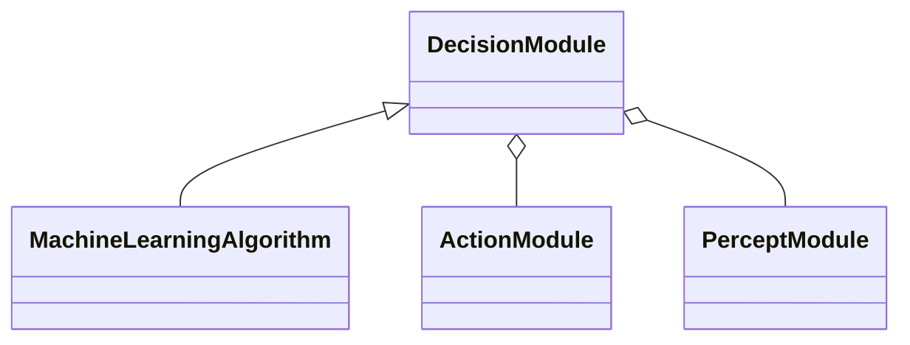
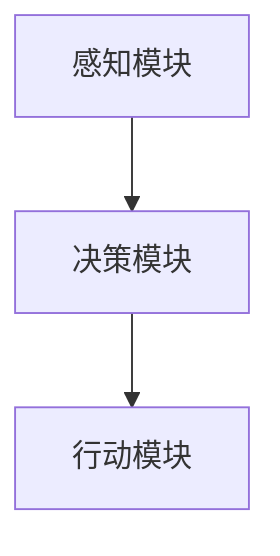
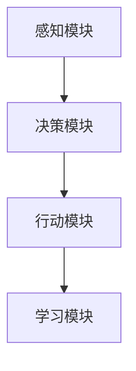
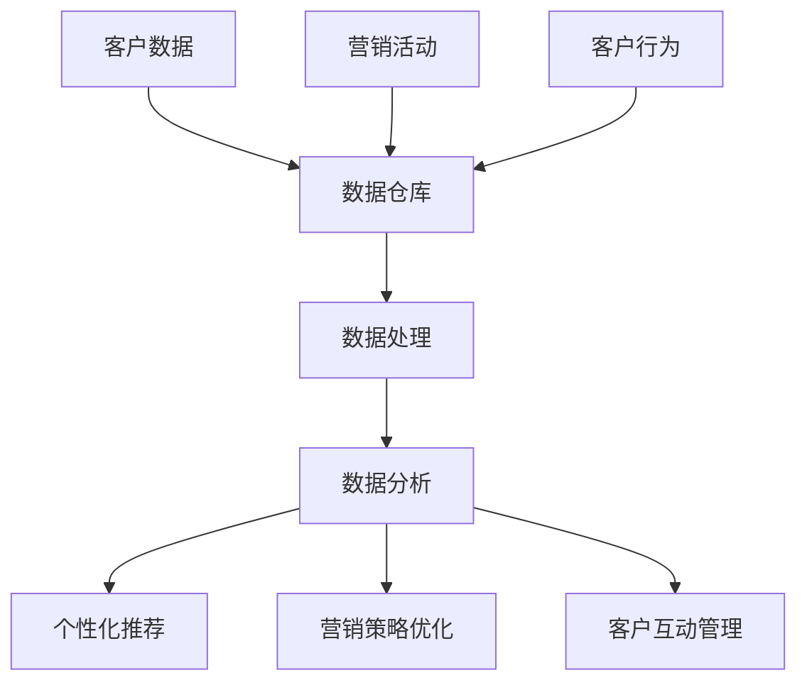

                 

# 构建AI Agent驱动的智能营销系统

## 关键词

- AI Agent
- 智能营销系统
- 机器学习
- 数据分析
- 营销自动化
- 客户体验优化

## 摘要

本文旨在探讨如何构建AI Agent驱动的智能营销系统。首先，我们将介绍AI Agent的基本概念及其在营销领域的应用。接着，我们将深入探讨构建智能营销系统的核心技术和方法，包括数据管理、算法原理、系统架构设计等。通过实际案例和最佳实践，我们将展示如何实现高效、智能的营销自动化。最后，我们将展望AI Agent在营销领域的未来发展趋势，并提出相关建议。

## 引言和概述

### AI Agent的基本概念

AI Agent是指具有智能行为、自主决策和交互能力的计算机程序。与传统程序不同，AI Agent能够根据环境和目标自主调整行为，实现自动化任务。AI Agent通常由以下几个关键组成部分构成：

1. **感知模块**：负责收集和分析环境中的信息。
2. **决策模块**：基于感知模块的信息，决定下一步行动。
3. **行动模块**：执行决策模块生成的行动。
4. **学习模块**：通过反馈和经验，持续优化自身性能。

### AI Agent在营销领域的应用

随着大数据和人工智能技术的发展，AI Agent在营销领域的应用日益广泛。其主要优势在于：

1. **个性化推荐**：通过分析用户行为和历史数据，为用户推荐个性化的产品和服务。
2. **智能客服**：自动解答用户疑问，提高客户满意度。
3. **广告投放优化**：根据用户兴趣和行为，精准投放广告，提高广告效果。
4. **市场预测**：分析市场数据，预测市场需求，帮助企业制定战略。

### 本文结构

本文将分为以下几个部分：

1. **核心概念和技术背景**：介绍AI Agent的基本概念和相关技术。
2. **案例分析**：分析实际应用案例，探讨AI Agent在营销领域的应用。
3. **设计实施**：详细讨论设计实施AI Agent驱动的智能营销系统的方法。
4. **数据管理和隐私**：讨论数据管理的重要性以及隐私保护策略。
5. **性能评估与优化**：介绍评估优化AI营销系统的方法。
6. **未来趋势**：探讨AI Agent在营销领域的未来发展趋势。
7. **结论**：总结本文的主要观点和启示，鼓励读者深入探索。

## 核心概念和技术背景

### AI Agent的基本概念

AI Agent是一种具有智能行为的计算机程序，能够在复杂环境中自主决策和执行任务。其核心思想是模仿人类思维过程，通过感知、决策和行动三个环节实现智能化。以下是AI Agent的关键组成部分：

#### 感知模块

感知模块是AI Agent的基础，负责从环境中获取信息。感知模块可以采用多种技术，如传感器、图像处理、自然语言处理等，以获取不同类型的数据。以下是一个感知模块的ER实体关系图：

```mermaid
erDiagram
  Customer ||--|{ Action }|
  Customer ||--|{ Percept }|
  Action ||--|{ Goal }|
  Action ||--|{ Situation }|
```

#### 决策模块

决策模块是AI Agent的核心，负责根据感知模块获取的信息，选择最佳行动方案。决策模块通常采用机器学习算法，如决策树、支持向量机、神经网络等。以下是一个决策模块的概念图：



#### 行动模块

行动模块是AI Agent的具体执行者，根据决策模块的决策结果，实现具体任务。行动模块可以包括机器人、自动化的营销工具等。以下是一个行动模块的流程图：



#### 学习模块

学习模块是AI Agent不断优化自身性能的关键。通过收集反馈信息和经验，学习模块能够调整模型参数，提高决策准确性。以下是一个学习模块的架构图：



### AI Agent在营销领域的应用

AI Agent在营销领域的应用广泛，包括个性化推荐、智能客服、广告投放优化等。以下是一个应用案例的表格，展示了AI Agent在不同营销任务中的表现：

| 任务         | AI Agent应用 | 表现               |
| ------------ | ------------ | ------------------ |
| 个性化推荐   | 基于用户行为分析 | 提高用户满意度     |
| 智能客服     | 自然语言处理   | 提高客户满意度     |
| 广告投放优化 | 基于用户兴趣分析 | 提高广告效果       |
| 市场预测     | 时间序列分析   | 提高市场决策准确性 |

### 相关技术背景

构建AI Agent驱动的智能营销系统需要掌握多种技术，包括机器学习、数据分析、自然语言处理等。以下是一个相关技术的对比表格：

| 技术         | 特点               | 应用场景           |
| ------------ | ------------------ | ------------------ |
| 机器学习     | 自动化学习模式     | 数据分析、预测模型 |
| 数据分析     | 数据挖掘和可视化   | 数据洞察、决策支持 |
| 自然语言处理 | 文本分析           | 智能客服、广告投放 |
| 深度学习     | 多层神经网络       | 复杂任务处理       |

## 案例分析

### 实际应用案例

为了更好地理解AI Agent在营销领域的应用，我们来看几个实际案例。

#### 案例一：电商平台个性化推荐

某电商平台利用AI Agent进行个性化推荐，通过分析用户的历史购买行为、浏览记录和社交数据，为用户推荐感兴趣的产品。这种推荐系统显著提高了用户的购买转化率和平台的销售额。

**成功原因**：

1. **大数据分析**：充分利用用户数据，挖掘用户兴趣和行为模式。
2. **机器学习算法**：采用推荐算法，提高推荐准确性。
3. **用户体验优化**：个性化推荐提高了用户的购物体验。

#### 案例二：金融行业智能客服

某金融公司引入AI Agent作为智能客服，通过自然语言处理技术，自动解答客户的疑问，提高客户满意度。同时，AI Agent还能根据客户的问题和反馈，不断优化自身的回答。

**成功原因**：

1. **自然语言处理**：提高客服响应速度和准确性。
2. **用户反馈机制**：不断优化AI Agent的回答，提高用户体验。
3. **低成本**：利用AI Agent代替人工客服，降低运营成本。

### 挑战和最佳实践

在AI Agent驱动的智能营销系统实施过程中，可能会遇到以下挑战：

1. **数据隐私**：如何保护用户数据，确保合规性。
2. **算法偏差**：如何避免算法偏见，确保公平性。
3. **技术落地**：如何将AI技术有效应用于实际业务场景。

为了应对这些挑战，以下是一些最佳实践：

1. **数据隐私保护**：采用数据加密、匿名化等技术，确保用户数据安全。
2. **算法公平性**：定期审计算法，消除潜在偏见。
3. **业务与技术融合**：与业务团队紧密合作，确保AI技术落地。

## 设计和实施AI Marketing Systems

### 设计步骤

设计和实施AI Marketing Systems需要遵循以下步骤：

1. **需求分析**：明确系统的目标和功能，了解用户需求。
2. **系统架构设计**：设计系统的总体架构，包括数据存储、处理和分析模块。
3. **数据管理**：建立数据管理策略，确保数据质量和安全性。
4. **算法选择与实现**：选择合适的机器学习和数据挖掘算法，并实现模型。
5. **系统集成与测试**：将各个模块集成到一起，进行系统测试和调试。
6. **部署与运维**：部署系统，并持续进行维护和优化。

### 实施方法

1. **需求分析**

需求分析是设计和实施AI Marketing Systems的第一步，需要明确系统的目标和功能。以下是一个需求分析的示例：

**目标**：提高营销效果，提高客户转化率和满意度。

**功能**：

- 客户行为分析：分析客户的行为和偏好，为个性化推荐提供依据。
- 营销策略优化：根据客户数据和营销活动效果，优化营销策略。
- 客户互动管理：管理客户互动，提高客户满意度。

2. **系统架构设计**

系统架构设计需要考虑数据存储、处理和分析模块。以下是一个系统架构设计的示例：



3. **数据管理**

数据管理是AI Marketing Systems的核心，需要确保数据的质量和安全性。以下是一个数据管理策略的示例：

- **数据收集**：通过API、日志等渠道收集客户数据。
- **数据清洗**：去除无效、错误和重复数据，确保数据质量。
- **数据存储**：采用分布式数据库技术，确保数据存储的可靠性。
- **数据安全**：采用数据加密、访问控制等技术，确保数据安全。

4. **算法选择与实现**

算法选择与实现是AI Marketing Systems的关键，需要根据实际需求选择合适的算法，并实现模型。以下是一个算法选择与实现的示例：

- **客户行为分析**：采用时间序列分析算法，如ARIMA模型，预测客户行为。
- **个性化推荐**：采用协同过滤算法，如基于用户的协同过滤算法，实现个性化推荐。
- **营销策略优化**：采用A/B测试算法，根据实验结果优化营销策略。

5. **系统集成与测试**

系统集成与测试是将各个模块集成到一起，并进行系统测试和调试。以下是一个系统集成与测试的示例：

- **集成**：将数据处理、分析、推荐和策略优化模块集成到一起。
- **测试**：进行功能测试、性能测试和安全测试，确保系统正常运行。
- **调试**：根据测试结果，修复系统中的错误和缺陷。

6. **部署与运维**

部署与运维是将系统部署到生产环境，并进行维护和优化。以下是一个部署与运维的示例：

- **部署**：将系统部署到云服务器或物理服务器，确保系统可访问。
- **运维**：监控系统性能，及时处理故障和问题，确保系统稳定运行。
- **优化**：根据业务需求和系统性能，持续进行系统优化和改进。

## 数据管理和隐私考虑

### 数据管理的重要性

在构建AI Agent驱动的智能营销系统时，数据管理起着至关重要的作用。数据是AI Agent的基础，只有通过高质量的数据管理，才能确保系统的准确性和可靠性。以下方面是数据管理的关键：

1. **数据收集**：确保数据来源的合法性和准确性，遵循隐私保护法规。
2. **数据清洗**：去除重复、无效和错误数据，确保数据质量。
3. **数据存储**：选择合适的数据存储方案，确保数据安全和持久性。
4. **数据访问控制**：实施访问控制策略，确保数据安全。

### 隐私保护策略

在数据管理过程中，隐私保护至关重要。以下策略有助于确保用户数据的安全和隐私：

1. **数据加密**：对存储和传输的数据进行加密，防止数据泄露。
2. **匿名化处理**：对敏感数据进行匿名化处理，消除个人身份信息。
3. **访问控制**：实施严格的访问控制策略，确保只有授权人员才能访问数据。
4. **数据审计**：定期进行数据审计，确保数据管理的合规性。

### 数据治理

数据治理是确保数据管理有效性的关键。以下措施有助于建立有效的数据治理体系：

1. **数据管理政策**：制定数据管理政策，明确数据管理的要求和流程。
2. **数据质量管理**：建立数据质量管理机制，确保数据质量。
3. **数据安全培训**：对员工进行数据安全培训，提高数据安全意识。
4. **数据合规性检查**：定期检查数据管理的合规性，确保符合相关法规。

## 性能评估与优化

### 性能评估方法

性能评估是确保AI Agent驱动的智能营销系统有效性和效率的关键。以下方法可用于评估系统的性能：

1. **准确性评估**：评估系统预测和推荐的准确性，通常使用指标如准确率、召回率、F1分数等。
2. **效率评估**：评估系统处理数据和生成结果的效率，通常使用指标如响应时间、吞吐量等。
3. **用户体验评估**：评估系统对用户体验的影响，包括用户满意度、操作便捷性等。
4. **成本效益评估**：评估系统实现成本和收益，确保投资回报率。

### 优化方法

为了提高AI Agent驱动的智能营销系统的性能，以下方法可用于优化：

1. **算法优化**：选择合适的机器学习和数据挖掘算法，通过调参和模型选择提高系统性能。
2. **数据处理优化**：优化数据处理流程，包括数据清洗、存储和查询等，提高数据处理效率。
3. **系统架构优化**：调整系统架构，包括数据存储、计算资源和网络架构等，提高系统整体性能。
4. **用户体验优化**：根据用户反馈和需求，优化系统的界面和交互设计，提高用户满意度。

### A/B测试

A/B测试是一种常用的优化方法，通过比较两个或多个版本的系统或功能，评估其对性能和用户体验的影响。以下步骤可用于进行A/B测试：

1. **定义测试目标**：明确测试的目的和指标。
2. **创建测试版本**：开发不同的系统或功能版本。
3. **选择测试人群**：确定参与测试的用户群体。
4. **进行测试**：在不同版本之间分配用户，收集测试数据。
5. **分析结果**：比较测试结果，确定最优版本。

## 未来趋势与技术创新

### AI Agent在营销领域的未来发展趋势

随着人工智能技术的不断发展，AI Agent在营销领域的应用将更加深入和广泛。以下是一些未来发展趋势：

1. **更加智能的个性化推荐**：利用深度学习和强化学习技术，实现更加精准和个性化的推荐系统。
2. **全渠道智能营销**：整合线上和线下渠道，实现跨渠道的智能营销。
3. **智能客服与互动**：通过自然语言处理和语音识别技术，提高智能客服的交互体验和效率。
4. **智能广告投放**：利用AI技术实现更加精准和高效的广告投放。
5. **智能市场预测**：利用时间序列分析和深度学习技术，实现更加准确的市场预测。

### 技术创新

技术创新是推动AI Agent在营销领域应用的关键。以下是一些重要的技术创新：

1. **联邦学习**：通过联邦学习技术，实现分布式数据的安全共享和协同学习，提高模型的训练效果和隐私保护。
2. **生成对抗网络（GAN）**：利用GAN技术，实现数据的生成和增强，提高数据质量和模型性能。
3. **区块链技术**：通过区块链技术，实现数据的可信存储和隐私保护，提高数据的安全性和透明度。
4. **强化学习**：通过强化学习技术，实现智能体的自主学习和决策，提高系统的适应性和灵活性。

## 结论

本文详细探讨了构建AI Agent驱动的智能营销系统的核心概念、技术背景、案例分析、设计实施、数据管理和隐私、性能评估与优化、未来趋势等方面的内容。通过本文，读者可以了解AI Agent在营销领域的广泛应用和巨大潜力。在未来的发展中，随着人工智能技术的不断进步，AI Agent将在营销领域发挥更加重要的作用。作者鼓励读者继续关注AI Agent在营销领域的最新发展，积极探索和实践，为智能营销的未来做出贡献。

### 作者信息

作者：AI天才研究院（AI Genius Institute）& 禅与计算机程序设计艺术（Zen And The Art of Computer Programming）

### 拓展阅读

1. **《深度学习》（Deep Learning）**：Goodfellow, I., Bengio, Y., & Courville, A. (2016). MIT Press.
2. **《机器学习》（Machine Learning）**：Tom Mitchell (1997). McGraw-Hill.
3. **《市场营销原理》（Principles of Marketing）**：Kotler, P., Armstrong, G., & Bridges, D. (2018). Pearson.
4. **《人工智能应用手册》（Artificial Intelligence: Applications and Advances）**：A. K. Dey, R. C. Geraci (Eds.). (2013). Springer.
5. **《智能营销：人工智能在市场营销中的应用》（Smart Marketing: Using Artificial Intelligence for Marketing）**：Adam Green (2019). Wiley.

