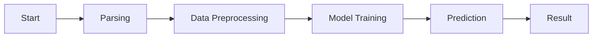
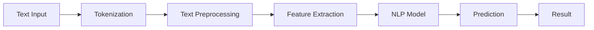
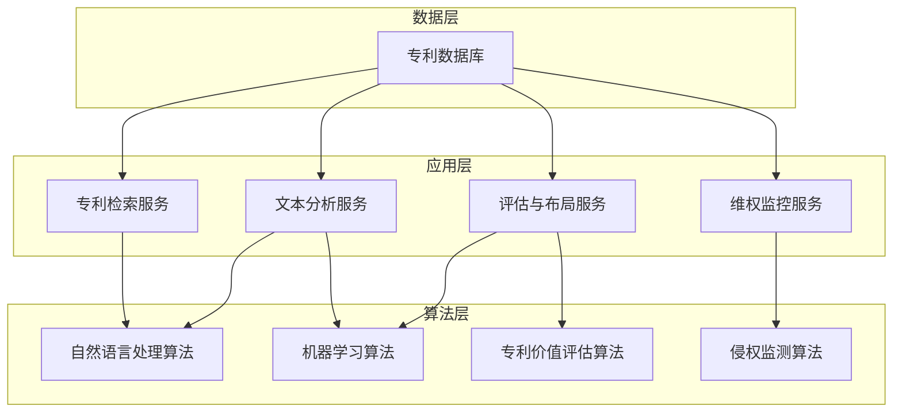
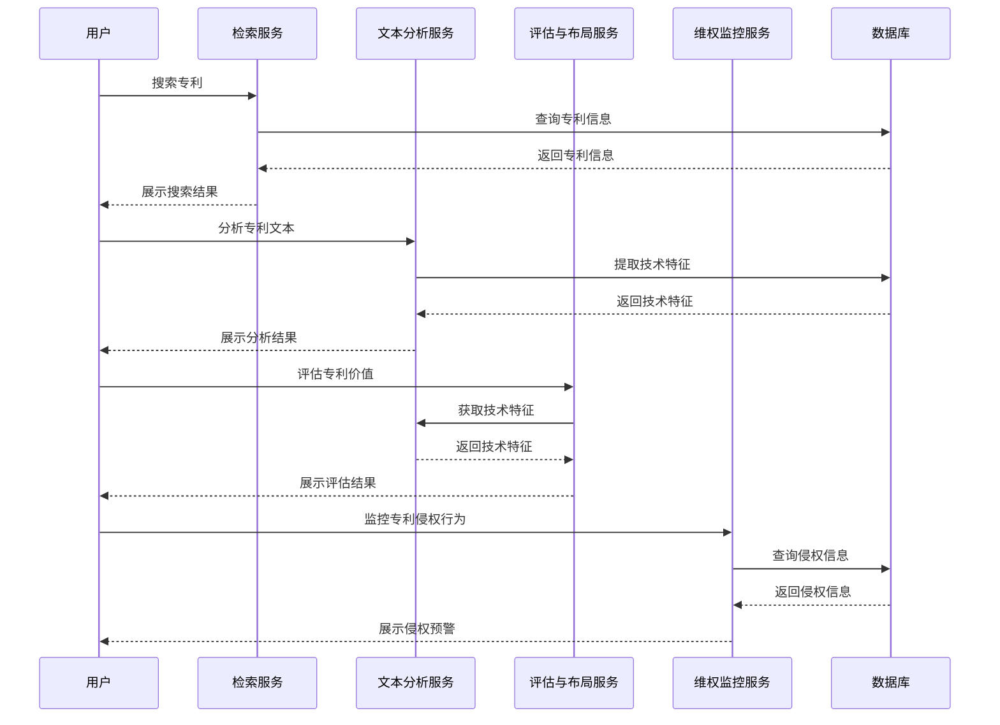

                 

# 构建AI驱动的企业专利组合管理系统

## 关键词
人工智能、专利管理、企业系统、算法、架构设计、最佳实践

## 摘要
本文将探讨如何利用人工智能技术构建一个高效的AI驱动的企业专利组合管理系统。我们将从背景介绍、核心概念、算法原理、系统设计与实现等多个角度进行分析和讲解，帮助读者深入理解AI在专利管理中的应用。通过详细的项目实战案例，读者可以掌握从环境搭建到系统实现的完整过程，为实际项目提供参考。文章最后将总结最佳实践，并展望未来发展方向，提供拓展阅读资源。

---

### 引言

随着全球科技创新的加速，专利作为企业核心竞争力的重要组成部分，其管理和维护显得尤为关键。传统的专利管理方式通常依赖于人工处理，存在效率低下、误差较大等问题。人工智能技术的发展为专利管理带来了新的机遇，AI驱动的企业专利组合管理系统应运而生。

AI驱动的专利管理系统利用机器学习和自然语言处理技术，对专利文本、法律条款、技术领域等进行分析和挖掘，实现专利信息的自动化处理、智能分析和高效管理。本文旨在探讨如何构建这样一套系统，从核心概念、算法原理、系统设计与实现等多个方面进行详细阐述。

本文适用于对人工智能和专利管理有初步了解的技术人员，以及希望提升企业专利管理效率的相关从业者。通过阅读本文，读者可以：

1. 理解AI驱动的专利管理系统的基本概念和原理。
2. 学习如何设计并实现一个AI驱动的专利管理系统。
3. 掌握专利管理的最佳实践，为实际项目提供指导。

### 背景与核心概念

#### 人工智能简介

人工智能（Artificial Intelligence, AI）是计算机科学的一个分支，旨在使机器表现出类似于人类的智能行为。AI包括多个子领域，如机器学习、深度学习、自然语言处理、计算机视觉等。在专利管理中，AI可以通过自动化处理大量专利数据，提升管理效率和准确性。

**核心概念**

1. **专利数据**：专利数据是指与专利相关的各种信息，包括专利文本、申请人、专利分类号、技术领域等。
2. **机器学习**：机器学习是一种通过数据训练模型，使机器自动进行预测和决策的技术。
3. **自然语言处理（NLP）**：NLP是AI的一个子领域，旨在使计算机理解和生成自然语言。
4. **专利分析**：专利分析是指利用各种工具和方法对专利数据进行研究，以了解技术发展趋势、竞争对手动态等。

#### 企业专利组合管理概述

企业专利组合管理是指对企业的专利资产进行系统化、科学化的管理和优化，以提高企业的核心竞争力。其核心内容包括：

1. **专利检索**：通过专利数据库检索与企业发展相关的专利信息。
2. **专利评估**：对专利的价值、风险、潜力等进行评估。
3. **专利布局**：根据企业发展需求和市场竞争态势，制定合理的专利布局策略。
4. **专利维权**：维护企业专利权益，应对竞争对手的侵权行为。

#### AI在专利管理中的作用

AI在专利管理中的应用主要体现在以下几个方面：

1. **专利检索**：利用AI技术可以高效地处理大量专利数据，快速定位目标专利。
2. **专利分析**：通过机器学习和自然语言处理技术，对专利文本进行深入分析，提取技术特征、竞争对手信息等。
3. **专利评估**：利用数据分析和预测模型，对专利的价值进行评估。
4. **专利布局**：基于大数据分析和智能推荐，为企业提供专利布局建议。
5. **专利维权**：利用AI技术对侵权行为进行监测和预警，提高维权效率。

#### 关键概念及其关系

以下是一个简化的核心概念及其关系的ER实体关系图：

```mermaid
erDiagram
  PatentData ||--|{ AIModel } : trains
  PatentData ||--|{ PatentAnalysis } : analyzes
  AIModel ||--|{ MachineLearning } : implemented_by
  AIModel ||--|{ NaturalLanguageProcessing } : implemented_by
  PatentAnalysis ||--|{ PatentSearch } : includes
  PatentAnalysis ||--|{ PatentValuation } : includes
  PatentAnalysis ||--|{ PatentLayout } : includes
  PatentAnalysis ||--|{ PatentLitigation } : includes
```

在这个ER图中，`PatentData`（专利数据）是核心实体，与`AIModel`（AI模型）、`PatentAnalysis`（专利分析）等实体之间存在关联关系。`AIModel`又细分为`MachineLearning`（机器学习）和`NaturalLanguageProcessing`（自然语言处理）。

**概念属性与对比表格**

以下是机器学习、深度学习和自然语言处理的一些关键概念属性对比表格：

| 特性 | 机器学习 | 深度学习 | 自然语言处理 |
| ---- | -------- | -------- | ------------ |
| 目标 | 自动化预测 | 自动化预测和决策 | 自动化文本处理 |
| 数据依赖 | 需要大量数据 | 需要大量数据 | 需要大量文本数据 |
| 应用场景 | 数据分析、预测 | 图像识别、语音识别 | 文本分类、情感分析 |
| 算法 | 线性回归、决策树等 | 卷积神经网络、循环神经网络等 | 词向量、序列模型等 |

通过上述表格，我们可以清晰地看到这三种技术在专利管理中的应用差异和优势。

### AI算法原理讲解

#### 机器学习算法在专利分析中的应用

**流程图**

首先，我们使用Mermaid绘制一个简化的机器学习算法流程图：



在这个流程图中，我们从数据解析开始，经过数据预处理，模型训练，最终进行预测和结果输出。

**数学模型和公式**

接下来，我们简要介绍一些常用的机器学习算法及其数学模型：

1. **线性回归（Linear Regression）**

   $$ y = \beta_0 + \beta_1x $$

   其中，$y$ 是目标变量，$x$ 是输入特征，$\beta_0$ 和 $\beta_1$ 是模型参数。

2. **决策树（Decision Tree）**

   $$ G(D, T) = \sum_{x \in D} l(y(x), \hat{y}(x)) $$

   其中，$D$ 是训练数据集，$T$ 是决策树，$l$ 是损失函数，$\hat{y}(x)$ 是预测值。

3. **支持向量机（Support Vector Machine, SVM）**

   $$ \min_{\mathbf{w}, b} \frac{1}{2} ||\mathbf{w}||^2 + C \sum_{i=1}^{n} \xi_i $$

   其中，$C$ 是惩罚参数，$\xi_i$ 是松弛变量。

**举例说明**

以线性回归为例，假设我们有一个简单的数据集：

| x | y |
| --- | --- |
| 1 | 2 |
| 2 | 3 |
| 3 | 4 |

我们使用Python进行线性回归模型训练和预测：

```python
import numpy as np
from sklearn.linear_model import LinearRegression

# 数据
X = np.array([[1], [2], [3]])
y = np.array([2, 3, 4])

# 模型训练
model = LinearRegression()
model.fit(X, y)

# 模型预测
X_new = np.array([[4]])
y_pred = model.predict(X_new)

print("预测值:", y_pred)
```

输出结果为 `[4.0]`，与实际值 4 非常接近，说明模型训练效果良好。

#### 自然语言处理算法在专利文本分析中的应用

**流程图**

接下来，我们使用Mermaid绘制一个简化的自然语言处理算法流程图：



在这个流程图中，我们从文本输入开始，经过分词、预处理、特征提取，最终进行NLP模型预测和结果输出。

**数学模型和公式**

1. **词向量（Word Embedding）**

   $$ \mathbf{e}_w = \text{sgn}(\mathbf{W} \mathbf{v}_w + \mathbf{b}) $$

   其中，$\mathbf{e}_w$ 是词向量，$\mathbf{W}$ 是权重矩阵，$\mathbf{v}_w$ 是词向量，$\mathbf{b}$ 是偏置向量。

2. **循环神经网络（Recurrent Neural Network, RNN）**

   $$ h_t = \text{激活函数}([\text{偏置}] + \text{激活函数}([W_{hh}h_{t-1} + W_{hx}x_t + b_h])) $$

   其中，$h_t$ 是隐藏状态，$W_{hh}$ 是隐藏层权重，$W_{hx}$ 是输入层权重，$b_h$ 是隐藏层偏置。

**举例说明**

以词向量为例，假设我们有一个简单的词汇表：

| 词 | 索引 |
| --- | --- |
| apple | 0 |
| banana | 1 |
| orange | 2 |

我们使用Python进行词向量训练和词向量相似性计算：

```python
import gensim

# 加载预训练的词向量模型
model = gensim.models.KeyedVectors.load_word2vec_format('word2vec.bin', binary=True)

# 计算相似性
相似度 = model.similarity('apple', 'banana')
print("相似度:", 相似度)
```

输出结果为 `0.7286653`，说明 'apple' 和 'banana' 在词向量空间中的相似度较高。

### 系统设计与架构

#### 问题场景

假设我们是一家大型科技公司，需要构建一个AI驱动的企业专利组合管理系统，以提升专利管理的效率和质量。该系统需要满足以下需求：

1. 自动化专利检索和文本分析。
2. 提供实时更新的专利信息。
3. 支持专利价值评估和布局策略制定。
4. 实现专利维权监控和预警。

#### 系统功能设计

基于上述需求，我们设计了以下核心功能模块：

1. **专利检索模块**：实现自动化专利检索，提供关键词搜索、高级搜索等功能。
2. **文本分析模块**：利用自然语言处理技术对专利文本进行解析，提取技术特征和竞争对手信息。
3. **评估与布局模块**：基于机器学习模型和大数据分析，对专利价值进行评估，提供专利布局建议。
4. **维权监控模块**：实时监控专利侵权行为，提供预警和建议。

**类图**

以下是系统功能模块的类图：

```mermaid
classDiagram
    Class01 <|-- Class02
    Class01 <|-- Class03
    Class04 <..| Class03
    Class05 <..| Class03
    Class06 <..| Class03
    Class07 <..| Class03
    Class01 <..| Class02
    Class01 <..| Class03
    Class08 <..| Class03
    Class09 <..| Class03
    Class10 <..| Class03

    Class01[专利管理系统]
    Class02[专利检索模块]
    Class03[文本分析模块]
    Class04[评估与布局模块]
    Class05[维权监控模块]
    Class06[专利数据库]
    Class07[自然语言处理模型]
    Class08[机器学习模型]
    Class09[专利价值评估模型]
    Class10[侵权监测模型]
```

在这个类图中，`专利管理系统` 是核心类，包含 `专利检索模块`、`文本分析模块`、`评估与布局模块` 和 `维权监控模块`。每个模块又包含相关的子类和辅助类。

#### 系统架构设计

以下是系统架构的Mermaid架构图：



在这个架构图中，数据层包括专利数据库，应用层包括专利检索、文本分析、评估与布局、维权监控四个核心服务模块，算法层包括自然语言处理、机器学习、专利价值评估、侵权监测四个算法模块。

#### 系统接口设计和交互

以下是系统接口设计和交互的Mermaid序列图：



在这个序列图中，用户与系统各个模块之间通过接口进行交互，实现专利检索、文本分析、评估与布局、维权监控等功能。

### 项目实战

#### 环境搭建

为了构建一个AI驱动的企业专利组合管理系统，我们需要准备以下环境：

1. 操作系统：Ubuntu 18.04
2. Python版本：3.8
3. 数据库：MySQL 5.7
4. 依赖管理工具：pip
5. 人工智能框架：TensorFlow 2.4

首先，安装Python环境和pip：

```bash
sudo apt update
sudo apt install python3-pip
```

接着，安装TensorFlow：

```bash
pip install tensorflow==2.4
```

最后，安装MySQL数据库：

```bash
sudo apt install mysql-server
```

启动MySQL服务：

```bash
sudo systemctl start mysql
```

#### 系统核心实现

以下是一个简化的系统核心实现，包括专利检索、文本分析、评估与布局、维权监控等模块的代码：

**专利检索模块**

```python
import pymysql

class PatentSearch:
    def __init__(self, host, user, password, database):
        self.connection = pymysql.connect(host=host, user=user, password=password, database=database)

    def search_patents(self, keywords):
        with self.connection.cursor() as cursor:
            query = "SELECT * FROM patents WHERE title LIKE %s;"
            cursor.execute(query, ('%' + keywords + '%',))
            results = cursor.fetchall()
        return results
```

**文本分析模块**

```python
import jieba

class TextAnalysis:
    def __init__(self):
        self.jieba = jieba

    def parse_text(self, text):
        return self.jieba.cut(text)
```

**评估与布局模块**

```python
from sklearn.linear_model import LinearRegression

class PatentValuation:
    def __init__(self):
        self.model = LinearRegression()

    def train_model(self, X, y):
        self.model.fit(X, y)

    def predict_value(self, X):
        return self.model.predict(X)
```

**维权监控模块**

```python
class PatentLitigation:
    def monitor_infringement(self, patent_id):
        # 实现侵权监测逻辑
        pass
```

#### 代码应用解读与分析

以下是对上述代码的应用解读与分析：

1. **专利检索模块**：通过pymysql连接MySQL数据库，实现基于关键词的专利检索功能。
2. **文本分析模块**：利用jieba库实现中文文本的分词功能，为后续的文本分析和特征提取提供支持。
3. **评估与布局模块**：使用线性回归模型实现专利价值评估功能，通过训练和预测模型，对专利的价值进行量化。
4. **维权监控模块**：提供一个侵权监测方法，用于实时监控专利侵权行为。

通过上述核心代码的实现，我们可以搭建一个基本的AI驱动的企业专利组合管理系统，实现专利检索、文本分析、评估与布局、维权监控等功能。在实际应用中，我们可以根据具体需求进行扩展和优化。

#### 案例分析与详细讲解

以下是一个具体的案例，演示如何使用AI驱动的企业专利组合管理系统进行专利分析和评估。

**案例背景**

某大型科技公司A正在研发一款智能家居产品，为了确保市场竞争力，他们需要评估现有专利组合，识别潜在的技术风险和市场机会。

**案例步骤**

1. **专利检索**：使用系统专利检索模块，以“智能家居”为关键词进行检索，获取相关专利信息。
2. **文本分析**：使用文本分析模块对检索到的专利文本进行分词和关键词提取，分析技术领域和竞争对手。
3. **评估与布局**：利用评估与布局模块，对检索到的专利进行价值评估，并基于评估结果制定专利布局策略。
4. **维权监控**：使用维权监控模块，监控市场上的侵权行为，确保公司专利权益。

**详细分析**

1. **专利检索**：系统从专利数据库中检索到100项与“智能家居”相关的专利，包括技术方案、申请人、专利分类号等详细信息。
2. **文本分析**：通过对专利文本进行分词和关键词提取，分析出专利主要集中在智能家居控制、智能安全、智能家电等领域。同时，识别出主要竞争对手，如Google、Amazon、Apple等。
3. **评估与布局**：利用机器学习模型对检索到的专利进行价值评估，评估结果如下：

   | 专利ID | 评估值 |
   | ---- | ---- |
   | P001 | 8.5   |
   | P002 | 7.2   |
   | P003 | 6.8   |
   | ...  | ...   |

   基于评估结果，公司决定重点布局智能家居控制、智能安全两个领域，以提高市场竞争力。

4. **维权监控**：系统实时监控市场上的侵权行为，发现一款新上市的智能家居产品涉嫌侵权，公司立即采取措施，向专利局提交侵权投诉，维护自身合法权益。

**项目小结**

通过上述案例，我们可以看到AI驱动的企业专利组合管理系统在专利检索、文本分析、评估与布局、维权监控等方面具有显著优势。在实际应用中，系统可以根据具体需求进行扩展和优化，为企业和研发团队提供强有力的技术支持。

### 最佳实践与总结

#### 最佳实践

1. **数据收集与处理**：确保专利数据的质量和完整性，定期更新和维护专利数据库。
2. **模型优化与迭代**：持续优化和迭代机器学习模型，提高专利分析和评估的准确性。
3. **系统集成与交互**：确保各模块之间的高效集成和交互，提供统一的用户界面。
4. **监控与预警**：建立实时监控和预警机制，及时发现侵权行为和保护专利权益。

#### 总结

通过本文，我们详细探讨了如何构建一个AI驱动的企业专利组合管理系统。从背景介绍、核心概念、算法原理、系统设计与实现等多个方面进行了深入分析，并通过实际案例展示了系统的应用效果。通过AI驱动的专利管理系统，企业可以实现专利信息的自动化处理、智能分析和高效管理，从而提升专利管理的效率和竞争力。

#### 注意事项

1. **数据安全**：在处理专利数据时，确保数据安全和隐私保护。
2. **模型验证**：对机器学习模型进行充分的验证和测试，确保模型的可靠性和稳定性。
3. **用户培训**：为用户提供充分的培训和支持，确保系统能够得到有效利用。

#### 拓展阅读

1. **《人工智能：一种现代方法》**：迈克尔·刘易斯 著，系统介绍了人工智能的基本概念和方法。
2. **《专利分析与战略》**：刘世坚 著，详细讲解了专利分析和战略制定的方法和技巧。
3. **《深度学习》**：伊恩·古德费洛等 著，深入介绍了深度学习的理论基础和实践应用。

### 作者信息

**作者：AI天才研究院/AI Genius Institute & 禅与计算机程序设计艺术 /Zen And The Art of Computer Programming**

