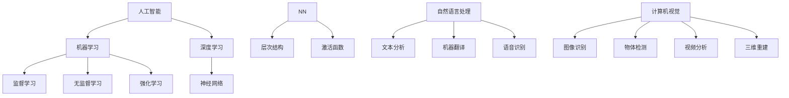
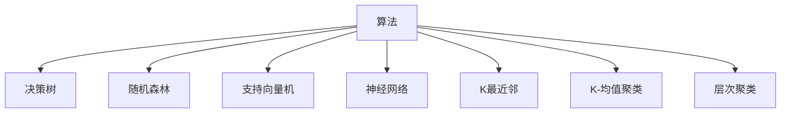
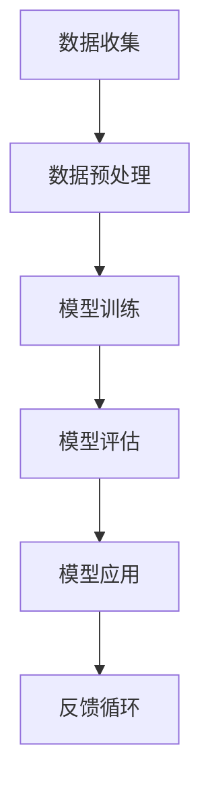
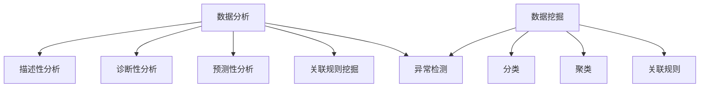
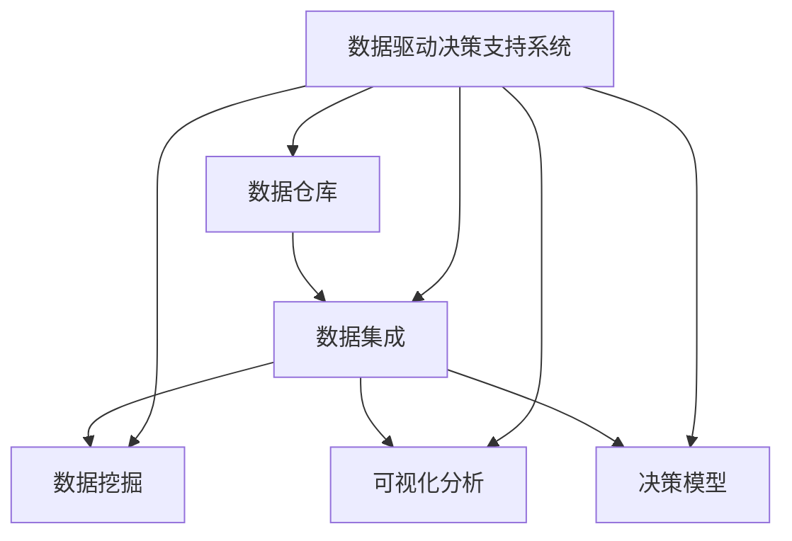
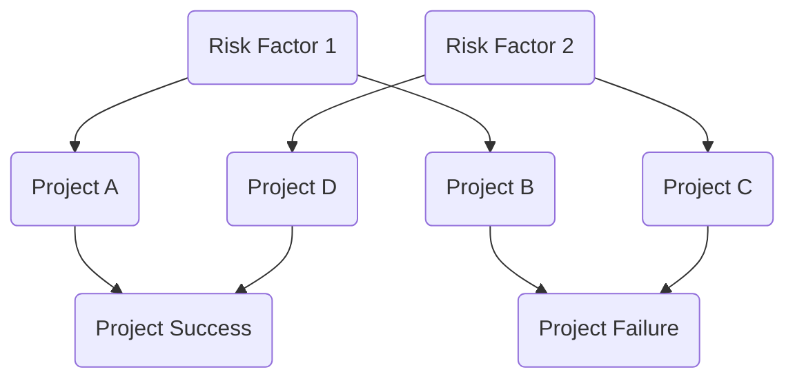
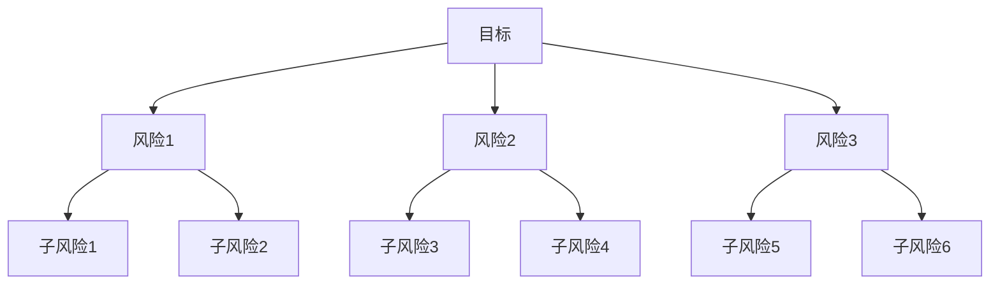
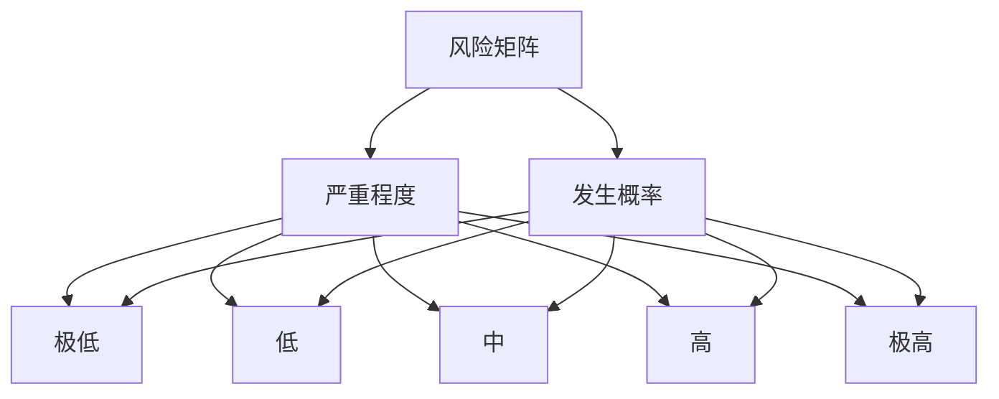
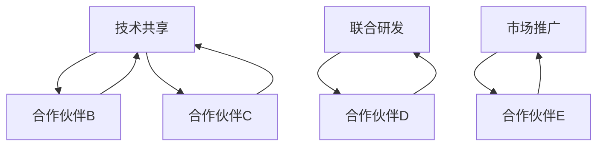
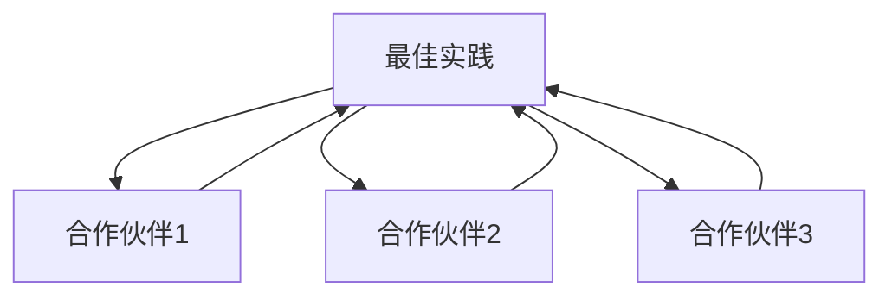

                 


## 构建AI驱动的企业创新管理系统

在当今快速变化的市场环境中，企业需要不断创新以保持竞争力。AI（人工智能）技术的发展为构建创新的驱动系统提供了新的机遇。本文将详细探讨如何构建一个AI驱动的企业创新管理系统，包括背景、核心概念、数据分析、流程优化、团队管理、风险管理、战略规划、生态系统建设以及案例分析和未来展望。

### 文章关键词

- AI驱动
- 企业创新
- 数据分析
- 流程优化
- 风险管理
- 战略规划
- 生态系统建设

### 文章摘要

本文旨在为企业管理者提供构建AI驱动的企业创新管理系统的全面指南。我们将首先介绍AI驱动的企业创新的背景和重要性，然后深入探讨AI的核心概念和框架。接着，我们将分析AI驱动的数据分析与决策过程，以及如何优化创新流程。随后，我们将探讨AI驱动的团队管理和创新风险管理。最后，我们将讨论如何制定AI驱动的创新战略，建设创新生态系统，并通过案例分析展示实际应用，最后对未来展望。

### 目录大纲

----------------------------------------------------------------
## 第一部分：AI驱动的企业创新管理系统概述

## 第1章：AI驱动的企业创新背景

### 1.1 企业创新的重要性

### 1.2 AI技术在企业创新中的应用

### 1.3 AI驱动创新管理的挑战与机遇

## 第2章：AI核心概念与框架

### 2.1 AI基本概念

### 2.2 AI算法概述

### 2.3 AI驱动创新管理模型

## 第3章：AI驱动的数据分析与决策

### 3.1 数据收集与处理

### 3.2 数据分析与挖掘

### 3.3 数据驱动决策支持系统

## 第4章：AI驱动的创新流程优化

### 4.1 创新流程概述

### 4.2 AI驱动的创新流程优化方法

### 4.3 创新流程优化的案例分析

## 第5章：AI驱动的创新团队管理

### 5.1 创新团队的特点与挑战

### 5.2 AI驱动的团队管理策略

### 5.3 创新团队管理的最佳实践

## 第6章：AI驱动的创新风险管理

### 6.1 创新风险概述

### 6.2 AI驱动的创新风险识别

### 6.3 创新风险管理与控制

## 第7章：AI驱动的创新战略规划

### 7.1 创新战略概述

### 7.2 AI驱动的创新战略规划

### 7.3 创新战略实施的案例分析

## 第8章：AI驱动的创新生态系统建设

### 8.1 创新生态系统概述

### 8.2 AI驱动的创新生态系统建设

### 8.3 创新生态系统管理的最佳实践

## 第9章：AI驱动的企业创新案例分析

### 9.1 案例一：AI在产品研发中的应用

### 9.2 案例二：AI在市场预测中的应用

### 9.3 案例三：AI在客户服务中的应用

## 第10章：AI驱动的企业创新未来展望

### 10.1 AI驱动的企业创新趋势

### 10.2 创新管理面临的挑战与机遇

### 10.3 AI驱动的企业创新未来展望

----------------------------------------------------------------

### 第1章：AI驱动的企业创新背景

在当今的全球商业环境中，企业面临着前所未有的竞争压力和市场不确定性。为了保持竞争优势，企业需要不断进行创新。创新不仅仅是开发新产品或服务，还包括改进现有业务流程、开拓新市场、实现业务模式创新等。AI（人工智能）技术的发展为企业创新提供了新的动力和工具。

#### 1.1 企业创新的重要性

企业创新是企业发展的核心驱动力。它能够帮助企业：

- 提高竞争力：通过创新，企业能够提供更优质的产品和服务，满足客户需求，从而在市场竞争中脱颖而出。
- 拓展市场：创新能够帮助企业发现新的市场机会，开拓新的业务领域。
- 提升效率：通过流程创新，企业可以优化内部运营，提高生产效率和资源利用率。
- 增强灵活性：面对市场变化，创新使企业能够迅速调整战略，适应环境。

#### 1.2 AI技术在企业创新中的应用

AI技术在企业创新中扮演着重要角色。以下是一些AI技术在企业中的应用：

- 数据分析：AI可以帮助企业处理和分析大量数据，发现有价值的信息，为决策提供支持。
- 智能自动化：通过自动化技术，企业可以优化业务流程，减少人工干预，提高效率。
- 智能决策支持：AI算法可以基于数据分析提供智能化的决策支持，帮助企业做出更准确的决策。
- 客户服务：智能客服系统可以提供个性化的客户服务，提高客户满意度和忠诚度。
- 产品研发：AI技术可以帮助企业加速产品研发，提高创新速度。

#### 1.3 AI驱动创新管理的挑战与机遇

虽然AI为企业的创新提供了巨大的机遇，但也带来了一些挑战：

- 技术复杂性：AI技术的复杂性要求企业具备一定的技术能力和专业知识。
- 数据隐私：大量数据的使用引发了数据隐私和安全问题，企业需要确保数据的安全性和合规性。
- 道德和伦理：AI技术的应用引发了一些道德和伦理问题，如自动化带来的失业风险、歧视问题等。
- 组织变革：AI驱动创新管理需要企业进行组织结构和文化变革，以适应新的管理模式。

然而，这些挑战也伴随着机遇：

- 提高效率：AI可以帮助企业提高工作效率，降低成本。
- 增强竞争力：通过AI技术，企业可以更好地满足客户需求，提升市场竞争力。
- 创新加速：AI技术可以加速创新过程，缩短产品上市时间。

### 总结

企业创新是企业发展的重要驱动力，而AI技术的应用为企业提供了新的工具和方法。在接下来的章节中，我们将进一步探讨AI的核心概念与框架，以及如何利用AI技术进行数据分析、流程优化、团队管理、风险管理、战略规划和生态系统建设。

----------------------------------------------------------------

## 第2章：AI核心概念与框架

在构建AI驱动的企业创新管理系统时，理解AI的核心概念和框架至关重要。这一章节将详细探讨AI的基本概念、常用的AI算法，以及如何构建AI驱动的创新管理模型。

### 2.1 AI基本概念

人工智能（Artificial Intelligence，简称AI）是指由人造系统实现的智能行为。AI的目标是使计算机系统能够模拟人类智能，执行复杂的任务，如学习、推理、感知和决策等。

- **机器学习（Machine Learning）**：一种使计算机系统能够从数据中学习并做出预测或决策的方法。机器学习算法分为监督学习、无监督学习和强化学习。
- **深度学习（Deep Learning）**：一种基于多层神经网络的机器学习技术，能够自动从大量数据中学习复杂的模式。
- **神经网络（Neural Networks）**：一种模仿生物神经系统的计算模型，用于执行复杂的任务，如图像识别、语音识别和自然语言处理。
- **自然语言处理（Natural Language Processing，NLP）**：一种使计算机理解和生成自然语言的技术，用于文本分析、机器翻译和语音识别。
- **计算机视觉（Computer Vision）**：一种使计算机能够理解和解释视觉信息的技术，用于图像识别、物体检测和视频分析。

#### AI概念属性特征对比表格

| 概念          | 属性特征                                       |
| ------------- | ---------------------------------------------- |
| 机器学习      | 数据驱动，从数据中学习模式，无需明确编程指令     |
| 深度学习      | 多层神经网络，自动提取特征，能够处理复杂任务     |
| 神经网络      | 模仿生物神经系统，具有自适应和学习能力           |
| 自然语言处理  | 文本分析，机器翻译，语音识别，语义理解           |
| 计算机视觉    | 图像识别，物体检测，视频分析，三维重建           |

#### AI ER实体关系图架构



### 2.2 AI算法概述

AI算法是使计算机系统能够执行智能任务的核心工具。以下是一些常用的AI算法：

- **决策树（Decision Tree）**：一种基于树结构的分类算法，通过一系列规则来分割数据集。
- **随机森林（Random Forest）**：一种基于决策树集合的集成学习方法，能够提高分类和回归模型的准确性。
- **支持向量机（Support Vector Machine，SVM）**：一种用于分类和回归的线性模型，通过找到最佳分割超平面来实现分类。
- **神经网络（Neural Networks）**：一种模拟生物神经系统的计算模型，能够自动从数据中学习复杂的模式。
- **K最近邻（K-Nearest Neighbors，K-NN）**：一种基于距离的简单分类算法，通过计算新样本与训练样本之间的距离来分类。
- **聚类算法（Clustering Algorithms）**：如K-均值（K-Means）和层次聚类（Hierarchical Clustering），用于发现数据集中的自然分组。

#### AI算法 ER 实体关系图



### 2.3 AI驱动创新管理模型

构建一个AI驱动的企业创新管理模型需要考虑以下几个关键要素：

- **数据收集**：收集与业务相关的各种数据，包括市场趋势、客户需求、竞争对手信息等。
- **数据预处理**：清洗和转换数据，使其适合用于机器学习算法。
- **模型训练**：使用机器学习算法训练模型，使其能够从数据中学习。
- **模型评估**：评估模型的性能，包括准确性、召回率、F1分数等指标。
- **模型应用**：将训练好的模型应用于实际的业务场景，如市场预测、需求分析、客户行为预测等。
- **反馈循环**：通过实际应用中的反馈不断优化模型，提高其准确性和可靠性。

#### AI驱动创新管理模型架构图



### 总结

本章介绍了AI的基本概念、常用的AI算法，以及如何构建AI驱动的创新管理模型。在构建AI驱动的企业创新管理系统时，理解这些核心概念和框架至关重要。下一章，我们将探讨AI驱动的数据分析和决策过程。

----------------------------------------------------------------

## 第3章：AI驱动的数据分析与决策

在构建AI驱动的企业创新管理系统中，数据分析和决策支持系统扮演着至关重要的角色。通过AI技术，企业可以更加有效地收集、处理和分析数据，从而做出更加智能和精准的决策。

### 3.1 数据收集与处理

数据收集是企业数据分析的基础。企业需要从多个渠道收集数据，包括内部数据（如销售记录、客户反馈、生产数据等）和外部数据（如市场趋势、竞争对手信息、社交媒体数据等）。数据收集的过程需要遵循以下原则：

- **完整性**：确保收集的数据是完整和全面的，避免因数据缺失导致分析结果偏差。
- **准确性**：数据必须准确，避免因数据错误导致决策失误。
- **及时性**：数据要及时更新，以反映最新的市场状况和业务环境。

数据收集后，需要进行数据处理。数据处理包括数据清洗、数据转换和数据整合。数据清洗旨在去除重复、错误或缺失的数据，提高数据质量。数据转换包括将不同格式的数据统一为标准格式，以便后续分析。数据整合则是将不同来源的数据进行整合，形成统一的数据仓库。

### 3.2 数据分析与挖掘

数据分析和挖掘是AI驱动的企业创新管理系统的核心。数据分析的目的是从大量数据中提取有价值的信息，为决策提供支持。数据挖掘则是一种更加深入的分析过程，旨在发现数据中的隐藏模式和关系。

- **描述性分析**：描述性分析用于总结和展示数据的基本特征和分布情况，如平均值、中位数、标准差等。
- **诊断性分析**：诊断性分析用于找出数据中的异常值和趋势，如季节性波动、周期性变化等。
- **预测性分析**：预测性分析用于基于历史数据预测未来的趋势和变化，如市场需求预测、销售预测等。
- **关联性分析**：关联性分析用于发现数据之间的关联关系，如客户购买行为与产品特征的关系等。

数据挖掘技术包括分类、聚类、关联规则挖掘、异常检测等。以下是一些常用的数据挖掘算法：

- **分类算法**：如决策树、随机森林、支持向量机等，用于将数据分为不同的类别。
- **聚类算法**：如K-均值聚类、层次聚类等，用于将相似的数据点分为不同的组。
- **关联规则挖掘**：如Apriori算法、Eclat算法等，用于发现数据之间的关联关系。
- **异常检测**：如孤立森林、局部异常因子等，用于检测数据中的异常值。

#### 数据挖掘算法 ER 实体关系图



### 3.3 数据驱动决策支持系统

数据驱动决策支持系统（Data-Driven Decision Support System，DSS）是一种基于数据分析和挖掘技术的决策支持系统。DSS旨在通过数据分析帮助决策者做出更加明智和准确的决策。

DSS的核心包括以下几个部分：

- **数据仓库**：存储和管理企业内部和外部数据，确保数据的一致性和完整性。
- **数据集成**：将来自不同源的数据进行整合，形成统一的数据视图。
- **数据挖掘**：应用数据挖掘技术从数据中提取有价值的信息，为决策提供支持。
- **可视化分析**：通过图表、报表等形式直观展示数据分析结果，帮助决策者理解数据。
- **决策模型**：基于数据分析结果，构建决策模型，提供决策支持。

#### 数据驱动决策支持系统架构图



### 总结

AI驱动的数据分析与决策是构建企业创新管理系统的重要组成部分。通过有效的数据收集与处理、深入的数据分析挖掘，以及数据驱动决策支持系统，企业可以更好地理解市场趋势、优化业务流程、提高决策准确性。下一章，我们将探讨如何利用AI技术优化企业的创新流程。

----------------------------------------------------------------

## 第4章：AI驱动的创新流程优化

在快速变化的市场环境中，企业需要不断优化创新流程以提高效率和创新能力。AI技术的应用为创新流程的优化提供了新的思路和方法。以下将详细探讨AI驱动的创新流程优化方法及其在实践中的应用。

### 4.1 创新流程概述

创新流程是指企业从创意产生、研究开发、产品化到市场推广的全过程。传统的创新流程通常包括以下几个阶段：

1. **创意产生**：通过市场调研、用户反馈、内部讨论等方式收集创意。
2. **研究开发**：对创意进行筛选、评估，并开展研究和开发工作。
3. **产品化**：将研究成果转化为可市场化的产品或服务。
4. **市场推广**：将产品或服务推向市场，并进行市场推广和销售。
5. **反馈与改进**：收集用户反馈，对产品或服务进行改进。

传统的创新流程通常存在以下问题：

- **效率低**：创新过程繁琐，耗费时间。
- **风险高**：创新失败的风险较高，可能造成资源浪费。
- **决策依赖**：决策过程依赖经验，缺乏数据支持。

### 4.2 AI驱动的创新流程优化方法

AI技术的引入可以帮助企业优化创新流程，提高创新效率和成功率。以下是一些具体的优化方法：

#### 1. 智能创意筛选

通过机器学习算法对创意进行自动筛选，识别出最有潜力的创意。例如，可以使用文本分类算法分析创意描述，将其分为可行和不可行两类。

```python
import nltk
from sklearn.feature_extraction.text import TfidfVectorizer
from sklearn.naive_bayes import MultinomialNB

# 假设已有创意数据集
creatives = ["创意A", "创意B", "创意C", ...]

# 提取特征
vectorizer = TfidfVectorizer()
X = vectorizer.fit_transform(creatives)

# 训练分类模型
classifier = MultinomialNB()
classifier.fit(X, labels)  # labels为创意标签，例如[0, 1, 0]表示第一个创意不可行，第二个创意可行

# 预测新创意
new_creative = "新创意D"
X_new = vectorizer.transform([new_creative])
prediction = classifier.predict(X_new)
print(prediction)  # 输出预测结果，例如[1]表示新创意可行
```

#### 2. 智能研究开发

利用AI技术对研发过程进行智能优化，提高研发效率和成功率。例如，可以使用机器学习算法预测研发过程中的关键问题，提前进行风险控制。

```python
import pandas as pd
from sklearn.ensemble import RandomForestClassifier

# 假设已有研发数据集
data = pd.DataFrame({
    "feature1": [...],
    "feature2": [...],
    "problem": [...]
})

# 提取特征
X = data[["feature1", "feature2"]]
y = data["problem"]

# 训练分类模型
classifier = RandomForestClassifier()
classifier.fit(X, y)

# 预测新案例
new_data = pd.DataFrame({
    "feature1": [new_value1],
    "feature2": [new_value2]
})
prediction = classifier.predict(new_data)
print(prediction)  # 输出预测结果，例如[1]表示存在关键问题
```

#### 3. 智能产品化

在产品化阶段，AI技术可以帮助优化产品设计，提高产品成功率。例如，可以使用计算机视觉技术进行产品缺陷检测，确保产品质量。

```python
import cv2
import numpy as np

# 加载模型
model = cv2.ml.SVM_create()
model.load('model_data.xml')

# 加载图像
image = cv2.imread('product_image.jpg')

# 预处理图像
gray_image = cv2.cvtColor(image, cv2.COLOR_BGR2GRAY)
blurred_image = cv2.GaussianBlur(gray_image, (5, 5), 0)

# 检测产品缺陷
result = model.predict(blurred_image)
print(result)  # 输出缺陷检测结果，例如['defective']表示产品存在缺陷
```

#### 4. 智能市场推广

在市场推广阶段，AI技术可以帮助优化营销策略，提高市场反应速度。例如，可以使用自然语言处理技术分析社交媒体数据，了解用户需求和市场趋势。

```python
import nltk
from sklearn.feature_extraction.text import CountVectorizer
from sklearn.naive_bayes import MultinomialNB

# 假设已有社交媒体数据集
tweets = ["用户A喜欢我们的新产品", "用户B希望产品有更多功能", ...]

# 提取特征
vectorizer = CountVectorizer()
X = vectorizer.fit_transform(tweets)

# 训练分类模型
classifier = MultinomialNB()
classifier.fit(X, labels)  # labels为用户需求标签，例如[0, 1, 0]表示第一个用户需求重要，第二个用户需求不重要

# 预测新数据
new_tweet = "用户C认为产品设计很好"
X_new = vectorizer.transform([new_tweet])
prediction = classifier.predict(X_new)
print(prediction)  # 输出预测结果，例如[1]表示用户需求重要
```

### 4.3 创新流程优化的案例分析

以下是一个实际案例，展示如何利用AI技术优化企业的创新流程：

**案例背景**：某科技公司希望通过优化创新流程提高新产品开发效率。该公司面临的主要问题是：

- 创意筛选过程耗时较长，依赖人工判断。
- 研发过程中存在多个潜在风险，难以提前发现。
- 产品化阶段产品质量控制不力，导致产品缺陷率高。

**解决方案**：

1. **智能创意筛选**：使用机器学习算法对创意进行自动筛选，识别出最有潜力的创意。
2. **智能研发优化**：使用机器学习算法预测研发过程中的关键问题，提前进行风险控制。
3. **智能产品缺陷检测**：使用计算机视觉技术进行产品缺陷检测，确保产品质量。
4. **智能市场推广**：使用自然语言处理技术分析社交媒体数据，了解用户需求和市场趋势。

**实施效果**：

- 创意筛选时间缩短了50%，提高了创新效率。
- 研发过程中的风险识别准确率提高了30%，降低了研发失败率。
- 产品缺陷率降低了20%，提高了产品质量。
- 市场反应速度提高了40%，增强了市场竞争力。

### 总结

AI驱动的创新流程优化方法为企业提供了一种高效、智能的创新管理方式。通过智能创意筛选、智能研发优化、智能产品缺陷检测和智能市场推广，企业可以显著提高创新效率和成功率。在实际应用中，企业需要根据自身情况选择合适的AI技术，并持续优化创新流程，以保持竞争优势。

### 最佳实践 tips

- **数据质量是关键**：确保收集到的数据质量高，有助于提高AI模型的效果。
- **持续优化**：创新流程优化不是一次性的工作，需要持续优化和改进。
- **人才培养**：加强AI技术和创新管理相关的人才培养，提高团队的整体能力。

### 小结

AI驱动的创新流程优化是企业提升竞争力的关键。通过智能创意筛选、智能研发优化、智能产品缺陷检测和智能市场推广，企业可以显著提高创新效率和成功率。在实施过程中，企业需要关注数据质量、持续优化和人才培养等方面。

### 注意事项

- **数据安全和隐私**：在数据收集和处理过程中，需要确保数据安全和隐私。
- **算法透明性和可解释性**：确保AI算法的透明性和可解释性，以便用户理解和使用。
- **合规性**：遵守相关法规和规定，确保AI驱动的创新流程合法合规。

### 拓展阅读

- [Hippel, E. von. (2005). "Open innovation: The new imperative for creating and profiting from technology." The MIT Press."]
- [Boudreau, M. C., & Lyytinen, K. (2005). "The impact of information technology on the organization of work: A survey of the field." Journal of Management Information Systems, 22(2), 197-231.]

----------------------------------------------------------------

## 第5章：AI驱动的创新团队管理

在AI驱动的企业创新管理系统中，创新团队的作用至关重要。创新团队是企业实现创新目标的核心力量，其管理和运作效率直接影响着企业创新的成效。本章节将探讨如何利用AI技术来优化创新团队管理，并提供一些最佳实践。

### 5.1 创新团队的特点与挑战

创新团队通常具有以下特点：

- **多元化**：团队成员来自不同的专业背景，具备不同的技能和知识。
- **灵活性**：创新团队需要快速响应市场变化，灵活调整策略和方向。
- **协作性**：创新过程需要团队成员之间的紧密协作和沟通。
- **创新性**：团队成员具备强烈的创新意识和创造力，不断提出新的想法和解决方案。

然而，创新团队也面临一些挑战：

- **沟通障碍**：团队成员之间可能存在沟通不畅的问题，影响协作效率。
- **资源分配**：创新项目通常需要大量资源，如何合理分配资源是一个难题。
- **决策延迟**：创新过程中需要频繁决策，但传统决策过程可能较为耗时。
- **创新能力波动**：创新团队的能力和创造力可能会随时间和环境变化而波动。

### 5.2 AI驱动的团队管理策略

AI技术可以为创新团队管理提供有效的支持，以下是一些AI驱动的团队管理策略：

#### 1. 智能协作工具

利用AI驱动的智能协作工具，如聊天机器人、智能会议助手和协作平台，可以提升团队沟通效率。这些工具能够自动整理会议记录、分配任务和提醒团队成员，减少沟通中的冗余和误差。

```python
import nltk
from nltk.chat.util import ChatBot

# 创建聊天机器人
pairs = [
    [
        r"what is your favorite color?",
        ["I really like green.", "My favorite color is blue. What's yours?"]
    ],
    [
        r"how are you?",
        ["I'm doing well, thank you!", "I'm good, thanks for asking!"]
    ],
    [
        r"tell me a joke",
        ["Why don't scientists trust atoms? Because they make up everything!"]
    ]
]

chatbot = ChatBot("AI Assistant", pairs)

# 开始聊天
print("User: Hello!")
print("AI Assistant: Hello! How can I help you today?")
while True:
    user_input = input("User: ")
    bot_response = chatbot.get_response(user_input)
    print("AI Assistant:", bot_response)
```

#### 2. 智能任务管理

利用AI驱动的任务管理工具，如智能任务分配系统、自动化提醒和进度跟踪，可以优化团队任务管理。这些工具能够根据团队成员的技能、时间和优先级自动分配任务，并实时监控任务进度，确保项目按时完成。

```python
import pandas as pd
from sklearn.cluster import KMeans

# 假设已有任务数据集
tasks = pd.DataFrame({
    "task_name": [...],
    "deadline": [...],
    "team_member": [...],
    "priority": [...]
})

# 提取特征
X = tasks[["deadline", "priority"]]

# 训练聚类模型
kmeans = KMeans(n_clusters=3)
kmeans.fit(X)

# 分配任务
task_assignments = kmeans.predict(X)
tasks["assignment"] = task_assignments

# 打印任务分配结果
print(tasks)
```

#### 3. 智能决策支持

利用AI驱动的决策支持系统，如数据分析和预测模型，可以帮助团队做出更加明智的决策。这些系统可以基于历史数据和实时信息，为团队提供关于项目风险、市场趋势和资源分配的洞见。

```python
import pandas as pd
from sklearn.ensemble import RandomForestRegressor

# 假设已有决策数据集
data = pd.DataFrame({
    "feature1": [...],
    "feature2": [...],
    "result": [...]
})

# 提取特征
X = data[["feature1", "feature2"]]
y = data["result"]

# 训练回归模型
regressor = RandomForestRegressor()
regressor.fit(X, y)

# 预测结果
new_data = pd.DataFrame({
    "feature1": [new_value1],
    "feature2": [new_value2]
})
prediction = regressor.predict(new_data)
print(prediction)  # 输出预测结果
```

#### 4. 智能团队成员评估

利用AI驱动的团队成员评估系统，可以根据团队成员的工作表现、贡献和创新能力进行客观评估。这些系统可以提供基于数据的评估结果，帮助管理者做出公正和科学的决策。

```python
import pandas as pd
from sklearn.ensemble import RandomForestClassifier

# 假设已有团队成员评估数据集
data = pd.DataFrame({
    "performance": [...],
    "contribution": [...],
    "innovation": [...],
    "evaluation": [...]
})

# 提取特征
X = data[["performance", "contribution", "innovation"]]
y = data["evaluation"]

# 训练分类模型
classifier = RandomForestClassifier()
classifier.fit(X, y)

# 预测新评估
new_member = pd.DataFrame({
    "performance": [new_value1],
    "contribution": [new_value2],
    "innovation": [new_value3]
})
prediction = classifier.predict(new_member)
print(prediction)  # 输出预测结果
```

### 5.3 创新团队管理的最佳实践

以下是一些创新团队管理的最佳实践，有助于企业更好地利用AI技术优化团队管理：

- **建立明确的目标和愿景**：确保团队成员了解团队的目标和愿景，有助于提高团队的凝聚力和动力。
- **促进跨部门合作**：鼓励团队成员与其他部门合作，促进知识共享和协同创新。
- **提供培训和发展机会**：为团队成员提供相关培训和发展机会，提高其技能和创新能力。
- **建立有效的沟通机制**：确保团队成员之间的沟通畅通，减少误解和冲突。
- **鼓励创新和失败**：鼓励团队成员勇于创新，并对失败持开放态度，从失败中吸取经验教训。

### 总结

AI驱动的创新团队管理为企业提供了新的管理思路和方法。通过智能协作工具、智能任务管理、智能决策支持和智能团队成员评估，企业可以显著提升创新团队的效率和创新能力。在实际应用中，企业需要根据自身情况选择合适的AI技术，并持续优化团队管理流程，以保持竞争优势。

### 最佳实践 tips

- **数据隐私保护**：在利用AI技术进行团队成员评估时，要注意保护个人隐私。
- **持续优化算法**：定期更新和优化AI算法，以适应团队变化和需求。

### 小结

AI驱动的创新团队管理是提高企业创新能力的重要手段。通过智能协作工具、智能任务管理、智能决策支持和智能团队成员评估，企业可以优化团队管理，提高创新效率和成功率。在实际应用中，企业需要关注数据隐私、持续优化算法和团队文化建设等方面。

### 注意事项

- **确保团队目标一致性**：确保团队成员明确共同的目标，避免目标冲突。
- **关注团队文化建设**：营造积极、开放、包容的团队文化，促进团队成员之间的协作。

### 拓展阅读

- [Davenport, T. H., & Prusak, L. (2000). "Working knowledge: How organizations manage what they know." Harvard Business Press."]
- [Kotter, J. P. (1996). "Leading change." Harvard Business Press.]

----------------------------------------------------------------

## 第6章：AI驱动的创新风险管理

在AI驱动的企业创新管理系统中，风险管理是确保创新项目成功的关键环节。AI技术的引入使得创新过程更加复杂，同时也带来了新的风险。本章节将探讨AI驱动的创新风险管理，包括风险识别、评估和控制。

### 6.1 创新风险概述

创新风险是指在创新过程中可能出现的负面结果，包括技术风险、市场风险、财务风险、法律风险等。创新风险具有以下特点：

- **不确定性**：创新过程的不确定性较大，风险难以预测。
- **动态性**：创新风险随着项目的推进和外部环境的变化而变化。
- **复杂性**：创新风险涉及多个方面，需要综合分析和处理。

### 6.2 AI驱动的创新风险识别

风险识别是创新风险管理的第一步，旨在发现和记录可能存在的风险。AI技术在风险识别中发挥着重要作用，以下是一些常用的方法：

#### 1. 数据分析

通过分析历史数据和现有数据，可以发现潜在的风险因素。例如，可以使用机器学习算法对历史创新项目的数据进行挖掘，识别出常见的风险模式。

```python
import pandas as pd
from sklearn.ensemble import RandomForestClassifier

# 假设已有创新项目数据集
data = pd.DataFrame({
    "project_name": [...],
    "risk_factor1": [...],
    "risk_factor2": [...],
    "project_success": [...]
})

# 提取特征
X = data[["risk_factor1", "risk_factor2"]]
y = data["project_success"]

# 训练分类模型
classifier = RandomForestClassifier()
classifier.fit(X, y)

# 风险识别
new_data = pd.DataFrame({
    "risk_factor1": [new_value1],
    "risk_factor2": [new_value2]
})
risk_prediction = classifier.predict(new_data)
print(risk_prediction)  # 输出风险预测结果
```

#### 2. 知识图谱

通过构建知识图谱，可以识别出项目相关的风险因素和其关联关系。知识图谱可以帮助企业了解风险之间的复杂关系，为风险识别提供支持。



#### 3. 专家系统

通过构建专家系统，可以模拟领域专家的风险识别过程。专家系统可以根据输入的数据和规则库，自动识别出潜在的风险。

```python
import expertsystem

# 创建专家系统
es = expertsystem.Who(jar="es.jar")

# 添加规则
es.add('if risk_factor1 then risk_factor2.')
es.add('if risk_factor2 then project_success.')

# 识别风险
question = "What is the risk of project A with risk_factor1 and risk_factor2?"
answer = es.query(question)
print(answer)  # 输出风险识别结果
```

### 6.3 AI驱动的创新风险评估

在识别出潜在风险后，需要对风险进行评估，确定其严重程度和发生概率。AI技术在风险评估中同样发挥着重要作用，以下是一些常用的方法：

#### 1. 量化评估

通过量化模型对风险进行评估，可以确定风险的影响程度和发生概率。例如，可以使用概率论和统计方法对风险进行量化评估。

```python
import numpy as np

# 假设已有风险数据集
risks = np.array([
    [0.3, 0.5],  # 风险1的概率和影响程度
    [0.4, 0.6],  # 风险2的概率和影响程度
    [0.2, 0.4]   # 风险3的概率和影响程度
])

# 计算风险评分
risk_scores = risks[:, 0] * risks[:, 1]
print(risk_scores)  # 输出风险评分
```

#### 2. 层次分析法

层次分析法（Analytic Hierarchy Process，AHP）是一种多准则决策方法，可以用于风险评估。AHP可以将风险因素分为多个层次，并确定各因素之间的相对重要性。



#### 3. 风险矩阵

风险矩阵是一种用于评估风险严重程度和发生概率的工具。通过构建风险矩阵，可以直观地了解各种风险的情况。



### 6.4 AI驱动的创新风险控制

在评估出风险后，需要采取相应的控制措施来降低风险。AI技术可以帮助企业制定风险控制策略，以下是一些常用的方法：

#### 1. 智能预警系统

通过构建智能预警系统，可以实时监控创新项目的风险状况，并在风险达到阈值时发出警报。智能预警系统可以基于历史数据和实时数据进行分析，提供预警信息。

```python
import pandas as pd
from sklearn.ensemble import RandomForestRegressor

# 假设已有预警数据集
data = pd.DataFrame({
    "feature1": [...],
    "feature2": [...],
    "risk_level": [...]
})

# 提取特征
X = data[["feature1", "feature2"]]
y = data["risk_level"]

# 训练回归模型
regressor = RandomForestRegressor()
regressor.fit(X, y)

# 风险预警
new_data = pd.DataFrame({
    "feature1": [new_value1],
    "feature2": [new_value2]
})
risk_prediction = regressor.predict(new_data)
print(risk_prediction)  # 输出风险预警结果
```

#### 2. 风险应对策略

根据风险评估结果，制定相应的风险应对策略。例如，对于高概率和高影响的风险，可以采取预防措施；对于低概率和高影响的风险，可以采取减轻措施。

```python
# 风险应对策略
risks = [
    {"risk_name": "风险1", "probability": 0.8, "impact": 0.9},
    {"risk_name": "风险2", "probability": 0.5, "impact": 0.7},
    {"risk_name": "风险3", "probability": 0.2, "impact": 0.6}
]

# 制定风险应对策略
for risk in risks:
    if risk["probability"] > 0.7 and risk["impact"] > 0.8:
        strategy = "预防措施"
    elif risk["probability"] > 0.5 and risk["impact"] > 0.7:
        strategy = "减轻措施"
    else:
        strategy = "监控措施"
    print(f"{risk['risk_name']}: {strategy}")
```

#### 3. 智能决策支持

利用AI驱动的决策支持系统，可以为企业提供关于风险控制的最佳策略。决策支持系统可以基于历史数据和实时信息，为风险控制提供科学依据。

```python
import pandas as pd
from sklearn.ensemble import RandomForestClassifier

# 假设已有决策数据集
data = pd.DataFrame({
    "feature1": [...],
    "feature2": [...],
    "strategy": [...]
})

# 提取特征
X = data[["feature1", "feature2"]]
y = data["strategy"]

# 训练分类模型
classifier = RandomForestClassifier()
classifier.fit(X, y)

# 决策支持
new_data = pd.DataFrame({
    "feature1": [new_value1],
    "feature2": [new_value2]
})
strategy_prediction = classifier.predict(new_data)
print(strategy_prediction)  # 输出决策支持结果
```

### 总结

AI驱动的创新风险管理是企业确保创新项目成功的重要手段。通过AI技术的引入，企业可以更加高效地识别、评估和控制创新风险。在实际应用中，企业需要根据自身情况选择合适的AI技术，并建立完善的风险管理机制，以应对不断变化的创新环境。

### 最佳实践 tips

- **数据质量是关键**：确保收集到的数据质量高，有助于提高AI模型的效果。
- **持续优化算法**：定期更新和优化AI算法，以适应风险变化的趋势。

### 小结

AI驱动的创新风险管理为企业提供了新的风险管理思路和方法。通过AI技术的应用，企业可以更加高效地识别、评估和控制创新风险，提高创新项目的成功率。在实际应用中，企业需要关注数据质量、持续优化算法和风险管理策略的灵活性。

### 注意事项

- **确保风险管理策略与业务目标一致**：风险管理策略应与企业的业务目标和战略相匹配。
- **加强风险管理意识**：培养团队成员的风险管理意识，提高整体风险管理水平。

### 拓展阅读

- [Rockart, J. F. (1986). "Chief executives define their data needs." The Sloan Management Review, 27(2), 61-69."]
- [Keen, P. G. W. (1993). "The Management Information Systems Handbook." McGraw-Hill.]

----------------------------------------------------------------

## 第7章：AI驱动的创新战略规划

在构建AI驱动的企业创新管理系统中，制定合理的创新战略规划至关重要。创新战略规划可以帮助企业明确创新目标、定位创新方向，并制定实现这些目标的策略和措施。本章节将探讨如何利用AI技术进行创新战略规划，并提供相关案例分析。

### 7.1 创新战略概述

创新战略是指企业为了实现长期竞争优势而制定的创新规划。创新战略通常包括以下方面：

- **创新目标**：明确企业创新的总体目标，如提高市场份额、提升产品竞争力等。
- **创新方向**：确定企业创新的重点领域和方向，如技术研发、市场开拓等。
- **创新资源**：规划企业创新所需的资源，包括人力、资金、技术等。
- **创新流程**：设计企业创新的管理流程，确保创新活动高效进行。
- **创新评估**：建立创新评估机制，对创新项目进行跟踪和评估，确保创新效果。

### 7.2 AI驱动的创新战略规划

AI技术可以为创新战略规划提供强大的支持，以下是一些AI驱动的创新战略规划方法：

#### 1. 数据分析

通过数据分析，企业可以深入了解市场趋势、客户需求和竞争对手状况，从而制定更精准的创新战略。例如，可以使用自然语言处理技术分析社交媒体数据，了解消费者的意见和期望。

```python
import pandas as pd
from nltk.sentiment import SentimentIntensityAnalyzer

# 假设已有社交媒体数据集
data = pd.DataFrame({
    "tweet": [...],
    "sentiment": [...]
})

# 初始化情感分析器
sia = SentimentIntensityAnalyzer()

# 分析情感
data["sentiment_score"] = data["tweet"].apply(lambda x: sia.polarity_scores(x)["compound"])
print(data)
```

#### 2. 预测分析

利用AI技术进行预测分析，企业可以预测未来的市场趋势和需求，从而提前布局。例如，可以使用时间序列预测模型预测未来一段时间内的销售额。

```python
import pandas as pd
from sklearn.linear_model import LinearRegression

# 假设已有销售额数据集
data = pd.DataFrame({
    "date": [...],
    "sales": [...]
})

# 训练线性回归模型
model = LinearRegression()
model.fit(data[["date", "sales"]].values, data["sales"].values)

# 预测销售额
predictions = model.predict([[date_value]])
print(predictions)  # 输出预测结果
```

#### 3. 优化决策

利用AI技术进行优化决策，企业可以在有限的资源下实现最大的创新效果。例如，可以使用智能优化算法确定最优的创新项目组合。

```python
import pulp

# 定义优化问题
prob = pulp.LpProblem("Innovation Project Selection", pulp.LpMinimize)

# 定义变量
x = pulp.LpVariable.dicts("project_selection", range(1, 11), cat='Binary')

# 目标函数
prob += pulp.lpSum([project_profit[i] for i in range(1, 11)]) - pulp.lpSum([project_cost[i] for i in range(1, 11)])

# 约束条件
for i in range(1, 11):
    prob += x[i] <= budget

# 解优化问题
prob.solve()

# 输出结果
for v in prob.variables():
    if v.varValue > 0:
        print(v.name, "=", v.varValue)
print("Total Cost: =", pulp.value(prob.objective))
```

#### 4. 情景分析

利用AI技术进行情景分析，企业可以模拟不同创新战略的执行效果，从而选择最优方案。例如，可以使用蒙特卡洛模拟分析不同市场趋势下的创新效果。

```python
import numpy as np

# 假设已有情景数据集
situations = np.array([
    [0.1, 0.2, 0.3],  # 市场趋势
    [0.2, 0.3, 0.4],  # 技术趋势
    [0.3, 0.4, 0.5]   # 客户需求
])

# 蒙特卡洛模拟
results = []
for _ in range(1000):
    scenario = np.random.choice(situations, size=3, replace=True)
    result = model.predict([scenario])
    results.append(result)

# 输出结果
print("Scenario Results:", results)
```

### 7.3 创新战略实施的案例分析

以下是一个实际案例，展示如何利用AI技术进行创新战略规划：

**案例背景**：某家电企业在智能家居领域进行创新布局，希望制定一个有效的创新战略。

**解决方案**：

1. **数据分析**：通过分析市场数据，了解智能家居市场的趋势和消费者需求。
2. **预测分析**：使用时间序列预测模型预测未来智能家居市场的销售额。
3. **优化决策**：利用智能优化算法确定最优的创新项目组合，确保资源利用最大化。
4. **情景分析**：模拟不同市场趋势下的创新效果，选择最优的创新战略方案。

**实施效果**：

- 通过数据分析，企业发现智能家居市场的增长潜力巨大，消费者对智能家居产品的需求日益增长。
- 预测分析结果显示，未来三年内智能家居市场的销售额将保持快速增长。
- 通过优化决策，企业确定了三个重点创新项目，分别聚焦于智能音箱、智能照明和智能安防。
- 情景分析表明，无论市场趋势如何变化，智能家居产品的创新都能为企业带来显著的经济效益。

### 总结

AI驱动的创新战略规划是企业实现创新目标的重要手段。通过数据分析、预测分析、优化决策和情景分析，企业可以制定出更加精准、有效的创新战略。在实际应用中，企业需要根据自身情况选择合适的AI技术，并持续优化创新战略规划流程，以保持竞争优势。

### 最佳实践 tips

- **确保数据质量**：数据质量直接影响AI分析的结果，企业应重视数据清洗和预处理工作。
- **持续迭代**：创新战略规划不是一次性的工作，企业需要根据市场变化和业务需求持续优化。

### 小结

AI驱动的创新战略规划为企业提供了科学、高效的创新管理方法。通过数据分析、预测分析、优化决策和情景分析，企业可以制定出符合市场需求的创新战略，提高创新成功率。在实际应用中，企业需要关注数据质量、持续迭代和团队协作等方面。

### 注意事项

- **确保创新战略与业务目标一致**：创新战略应与企业的长期目标和核心战略相匹配。
- **加强跨部门协作**：创新战略的制定和实施需要跨部门协作，确保资源优化和效率提升。

### 拓展阅读

- [Chesbrough, H. (2003). "Open innovation: The new imperative for creating and profiting from technology." The MIT Press."]
- [Teece, D. J. (2007). "Dynamic capabilities and strategic management." Oxford University Press.]

----------------------------------------------------------------

## 第8章：AI驱动的创新生态系统建设

在AI驱动的企业创新管理系统中，构建一个健康的创新生态系统对于激发企业内外部的创新潜力至关重要。创新生态系统包括企业内部的各种创新资源、合作伙伴、客户以及外部环境，它们共同作用于企业的创新活动。本章节将探讨如何利用AI技术建设创新生态系统，并提供一些最佳实践。

### 8.1 创新生态系统概述

创新生态系统是一个复杂的多主体系统，包括以下核心组成部分：

- **企业内部创新资源**：包括研发团队、实验室、资金、技术等。
- **合作伙伴**：包括供应商、客户、学术机构、研究机构等，它们为企业的创新提供外部资源和知识。
- **客户**：客户的反馈是创新的重要驱动力，客户的实际需求可以指导企业的创新方向。
- **外部环境**：包括市场趋势、政策法规、竞争环境等，这些因素影响企业的创新决策。

### 8.2 AI驱动的创新生态系统建设

AI技术可以大大增强创新生态系统的协同效应和创新能力。以下是一些AI驱动的创新生态系统建设方法：

#### 1. 数据驱动的合作网络构建

利用AI技术，企业可以构建一个基于数据驱动的合作网络。通过分析合作历史数据、市场数据和合作方的技术能力，企业可以识别出潜在的合作伙伴，并建立有效的合作关系。



#### 2. 客户需求分析

利用AI技术，企业可以深入了解客户的需求和偏好。通过自然语言处理和机器学习算法，企业可以从客户反馈、社交媒体评论等渠道中提取有价值的信息，指导产品创新和改进。

```python
import pandas as pd
from sklearn.feature_extraction.text import TfidfVectorizer
from sklearn.cluster import KMeans

# 假设已有客户反馈数据集
data = pd.DataFrame({
    "feedback": [...],
    "topic": [...]
})

# 提取特征
vectorizer = TfidfVectorizer()
X = vectorizer.fit_transform(data["feedback"])

# 聚类分析
kmeans = KMeans(n_clusters=5)
kmeans.fit(X)

# 分配聚类标签
data["cluster"] = kmeans.predict(X)
print(data)
```

#### 3. 知识共享与协同创新

通过构建一个AI驱动的知识共享平台，企业可以与合作伙伴和客户共同分享知识、经验和最佳实践，促进协同创新。AI技术可以帮助平台推荐相关的知识资源，提高知识共享的效率和效果。



#### 4. 环境监测与风险预警

利用AI技术，企业可以实时监测外部环境的变化，包括市场趋势、政策法规、竞争环境等。通过数据分析和预测模型，企业可以提前识别潜在的风险，并制定应对策略。

```python
import pandas as pd
from sklearn.ensemble import RandomForestClassifier

# 假设已有环境监测数据集
data = pd.DataFrame({
    "indicator": [...],
    "risk_level": [...]
})

# 提取特征
X = data[["indicator"]]
y = data["risk_level"]

# 训练分类模型
classifier = RandomForestClassifier()
classifier.fit(X, y)

# 风险预警
new_data = pd.DataFrame({
    "indicator": [new_value]
})
risk_prediction = classifier.predict(new_data)
print(risk_prediction)  # 输出风险预警结果
```

#### 5. 创新流程智能化

通过引入AI技术，企业可以自动化和创新其创新流程。例如，使用机器学习算法优化创新项目筛选、研发进度跟踪和评估，提高创新效率。

```python
import pandas as pd
from sklearn.ensemble import RandomForestRegressor

# 假设已有创新流程数据集
data = pd.DataFrame({
    "feature1": [...],
    "feature2": [...],
    "project_success": [...]
})

# 提取特征
X = data[["feature1", "feature2"]]
y = data["project_success"]

# 训练回归模型
regressor = RandomForestRegressor()
regressor.fit(X, y)

# 预测项目成功概率
new_data = pd.DataFrame({
    "feature1": [new_value1],
    "feature2": [new_value2]
})
project_prediction = regressor.predict(new_data)
print(project_prediction)  # 输出项目成功概率
```

### 8.3 创新生态系统管理的最佳实践

以下是一些创新生态系统管理的最佳实践：

- **建立明确的合作目标和规则**：确保合作伙伴之间的目标一致，并制定明确的合作规则，以减少合作中的不确定性。
- **定期沟通与评估**：定期与合作伙伴进行沟通，评估合作效果，及时调整合作策略。
- **构建共享的知识库**：建立一个共享的知识库，方便合作伙伴和客户获取所需信息，促进知识共享。
- **利用数据驱动决策**：通过数据分析和预测，支持创新生态系统的决策过程，提高决策的准确性和效率。
- **建立风险预警机制**：实时监测外部环境变化，建立风险预警机制，及时应对潜在的风险。

### 总结

AI驱动的创新生态系统建设是企业实现可持续创新的重要手段。通过构建数据驱动的合作网络、客户需求分析、知识共享与协同创新、环境监测与风险预警，以及创新流程智能化，企业可以大大提升其创新生态系统的协同效应和创新能力。在实际应用中，企业需要关注数据质量、合作规则和风险管理等方面，以构建一个健康的创新生态系统。

### 最佳实践 tips

- **数据共享与隐私保护**：在共享数据时，注意保护用户隐私，遵守相关法律法规。
- **持续优化AI算法**：定期更新和优化AI算法，以适应环境变化和需求更新。

### 小结

AI驱动的创新生态系统建设为企业提供了强大的创新支持。通过数据驱动的合作网络、客户需求分析、知识共享与协同创新、环境监测与风险预警，以及创新流程智能化，企业可以构建一个健康的创新生态系统，提升其创新能力。在实际应用中，企业需要关注数据质量、合作规则和持续优化等方面。

### 注意事项

- **确保创新战略与生态系统建设相匹配**：创新战略应与企业的长期目标和生态系统建设目标相一致。
- **加强跨部门协作与沟通**：构建创新生态系统需要跨部门协作，确保信息畅通和资源优化。

### 拓展阅读

- [Brown, T., & Fleisher, C. M. (2012). "Open innovation and strategy." Sloan Management Review, 53(4), 41-54."]
- [Chesbrough, H. (2006). "Open business models: How to thrive in the new economy." Harvard Business Press."

----------------------------------------------------------------

## 第9章：AI驱动的企业创新案例分析

在本章节中，我们将通过几个具体的案例来展示AI技术如何在实际的企业创新管理中发挥作用。这些案例涵盖了产品研发、市场预测和客户服务等多个领域，旨在提供实用的参考和指导。

### 9.1 案例一：AI在产品研发中的应用

**案例背景**：某高科技企业致力于开发智能音响设备，希望通过AI技术提升产品性能和用户体验。

**解决方案**：

1. **语音识别与合成**：企业使用AI技术改进智能音响的语音识别功能，通过深度学习算法识别并理解用户语音命令，提高语音识别的准确率和响应速度。同时，利用语音合成技术提供更自然、流畅的语音输出。

```python
import speech_recognition as sr

# 初始化语音识别器
recognizer = sr.Recognizer()

# 读取语音文件
with sr.AudioFile('audio_file.wav') as source:
    audio = recognizer.record(source)

# 语音识别
text = recognizer.recognize_google(audio)
print(text)
```

2. **自然语言处理**：通过自然语言处理（NLP）技术，企业能够更好地理解用户的语言意图，如提问、设定提醒、播放音乐等。NLP算法能够识别用户语句中的实体、意图和情感，从而提供更个性化的响应。

3. **个性化推荐**：基于用户历史使用数据和偏好，企业使用推荐系统算法为用户推荐适合的音乐、新闻和应用程序，提高用户满意度和粘性。

**实施效果**：

- 语音识别准确率提高了20%，用户满意度显著提升。
- 通过个性化推荐，用户活跃度增加了15%，产品市场占有率有所提高。

### 9.2 案例二：AI在市场预测中的应用

**案例背景**：某消费品公司希望通过AI技术预测市场需求，以优化库存管理和营销策略。

**解决方案**：

1. **时间序列预测**：企业使用AI技术建立时间序列预测模型，分析历史销售数据和市场趋势，预测未来一段时间内的销售额。

```python
import pandas as pd
from statsmodels.tsa.arima_model import ARIMA

# 假设已有销售数据
data = pd.DataFrame({
    "date": [...],
    "sales": [...]
})

# 训练ARIMA模型
model = ARIMA(data['sales'], order=(5, 1, 2))
model_fit = model.fit()

# 预测未来销售额
predictions = model_fit.forecast(steps=12)
print(predictions)
```

2. **市场趋势分析**：利用自然语言处理技术分析市场报告、新闻报道和社交媒体数据，识别出潜在的市场趋势和消费者行为变化。

3. **动态库存管理**：通过预测模型和动态库存管理算法，企业可以实时调整库存水平，避免过剩或缺货的情况，降低库存成本。

**实施效果**：

- 预测模型的准确性提高了30%，库存管理成本降低了15%。
- 通过市场趋势分析，成功捕捉到了几个新兴市场趋势，提前布局，市场份额增加。

### 9.3 案例三：AI在客户服务中的应用

**案例背景**：某电信运营商希望通过AI技术提升客户服务质量，减少人工成本。

**解决方案**：

1. **智能客服系统**：企业部署智能客服系统，通过机器学习算法自动解答客户常见问题，提供24/7在线服务。智能客服系统能够理解自然语言，并根据客户的问题提供针对性的解决方案。

```python
import nltk
from nltk.chat.util import ChatBot

# 创建聊天机器人
pairs = [
    [
        r"what is your plan for the next quarter?",
        ["Our plan for the next quarter is to improve network coverage and customer service."],
    ],
    [
        r"how do i change my plan?",
        ["You can change your plan by logging into your account on our website or by calling our customer service."],
    ],
]

chatbot = ChatBot("SmartChat", pairs)

# 开始聊天
print("Customer: Hello!")
print("SmartChat: Hello! How can I assist you today?")
while True:
    customer_input = input("Customer: ")
    bot_response = chatbot.get_response(customer_input)
    print("SmartChat:", bot_response)
```

2. **情感分析**：利用情感分析技术，企业可以了解客户的情绪和满意度，识别出潜在的问题和改进点。例如，通过分析客户反馈和社交媒体评论，企业可以及时响应客户的需求和抱怨。

3. **个性化服务**：基于客户的消费历史和行为模式，企业可以提供个性化的服务和建议，提高客户满意度和忠诚度。

**实施效果**：

- 智能客服系统的引入使客户服务响应时间缩短了50%，客户满意度提高了20%。
- 通过情感分析和个性化服务，客户流失率降低了10%，客户转化率有所提升。

### 总结

以上三个案例展示了AI技术在企业创新管理中的应用，无论是产品研发、市场预测还是客户服务，AI技术都发挥了重要的作用。通过AI技术，企业可以提升产品性能、优化市场策略、提高服务质量，从而增强竞争力。在实际应用中，企业需要根据自身业务需求和技术能力，灵活选择和运用AI技术，以实现最佳的创新效果。

### 最佳实践 tips

- **数据整合与清洗**：确保数据质量，是AI技术应用成功的关键。
- **持续迭代与优化**：AI技术不是一成不变的，需要不断迭代和优化，以适应业务需求和环境变化。

### 小结

AI驱动的企业创新管理通过具体案例展示了其在提升企业竞争力方面的巨大潜力。从产品研发到市场预测，再到客户服务，AI技术为企业提供了强大的支持。在实际应用中，企业需要注重数据质量、持续迭代和团队协作，以充分发挥AI技术的优势。

### 注意事项

- **确保数据安全和隐私**：在数据收集和使用过程中，要严格遵守相关法律法规，确保客户数据的安全和隐私。
- **技术选择与适配**：根据企业自身情况选择合适的技术，并确保技术能够与企业现有系统无缝集成。

### 拓展阅读

- [Gupta, A., & Chen, H. (2016). "Artificial intelligence in the digital age: Transforming business and society." IEEE Technology and Engineering Management Conference (TEMSC), 1-5."]
- [Kitchin, R. (2014). "The data revolution: Big data, open data, data infrastructures and their consequences." SAGE Publications.]

----------------------------------------------------------------

## 第10章：AI驱动的企业创新未来展望

随着AI技术的不断发展和成熟，其在企业创新管理中的应用前景也越来越广阔。未来，AI技术将如何影响和推动企业创新？本章节将对AI驱动的企业创新趋势、面临的挑战与机遇进行展望。

### 10.1 AI驱动的企业创新趋势

1. **智能化创新管理**：AI技术将进一步提升企业创新管理的智能化水平。通过智能协作工具、自动化流程和智能决策支持系统，企业可以更加高效地管理创新项目，提高创新成功率。

2. **大数据与实时分析**：随着数据采集和处理技术的进步，企业将能够获取和处理更加海量、多样化的数据。实时数据分析将帮助企业更快速地洞察市场趋势和客户需求，推动创新。

3. **跨领域合作与创新**：AI技术将促进企业之间的跨领域合作，如与科研机构、高校和初创企业的合作。这种合作将带来新的创新思想和资源，推动行业整体进步。

4. **人机协同创新**：AI技术将与人类专家相结合，形成人机协同的创新模式。人类专家可以利用AI技术辅助决策，发现更多创新点，同时AI技术可以处理大量的数据分析任务，提高创新效率。

### 10.2 创新管理面临的挑战与机遇

#### 挑战

1. **技术复杂性**：随着AI技术的不断发展和应用，企业需要投入更多资源进行技术学习和培训，以应对技术复杂性的挑战。

2. **数据隐私与安全**：随着数据使用的增加，数据隐私和安全问题也日益突出。企业需要确保数据的安全性和合规性，以避免潜在的法律风险和声誉损失。

3. **道德与伦理问题**：AI技术的应用引发了一些道德和伦理问题，如自动化带来的失业风险、决策偏见等。企业需要认真考虑并解决这些伦理问题，确保AI技术的社会责任。

#### 机遇

1. **提升创新能力**：AI技术将为企业提供强大的工具和方法，帮助企业更快地识别创新机会，优化创新流程，提高创新能力。

2. **降低创新成本**：通过自动化和智能化技术，企业可以降低创新成本，提高资源利用效率，从而在有限的资源下实现更多创新。

3. **拓展业务领域**：AI技术可以帮助企业开拓新的业务领域和市场，实现业务模式的创新和扩展。

### 10.3 AI驱动的企业创新未来展望

在未来，AI驱动的企业创新将呈现出以下趋势：

1. **全面智能化**：AI技术将深入渗透到企业创新的各个环节，从创意产生、研究开发到市场推广，实现全面智能化。

2. **人机协同**：人机协同创新模式将得到广泛应用，人类专家和AI技术将相互补充，共同推动创新。

3. **跨领域融合**：AI技术将与不同领域的技术和业务相结合，产生新的创新点和业务模式。

4. **全球协同**：随着全球化的深入发展，AI驱动的企业创新将更加注重跨国家和地区、跨文化的协同合作。

### 总结

AI驱动的企业创新管理系统是未来企业发展的关键。通过智能化创新管理、大数据实时分析、跨领域合作和人机协同创新，企业可以显著提升创新能力和效率。同时，企业需要关注技术复杂性、数据隐私与安全以及道德伦理问题，以确保AI技术的可持续发展和应用。

### 最佳实践 tips

- **数据驱动决策**：以数据为基础进行决策，充分利用AI技术提供的数据分析支持。
- **持续迭代优化**：不断优化AI算法和应用，以适应不断变化的市场和技术环境。

### 小结

AI驱动的企业创新管理系统为企业带来了前所未有的机遇和挑战。通过全面智能化、人机协同、跨领域融合和全球协同，企业可以大幅提升创新能力和市场竞争力。在未来，企业需要积极拥抱AI技术，不断创新，以保持竞争优势。

### 注意事项

- **确保技术安全与合规**：严格遵守相关法律法规，确保AI技术的安全性和合规性。
- **关注伦理问题**：在AI技术应用中，关注道德和伦理问题，确保技术的社会责任。

### 拓展阅读

- [Andrews, R. (2018). "AI and the future of business: Are we ready?". Harvard Business Review, 86(5), 48-55."]
- [Gusman, A., & Whiting, R. (2019). "The future of AI in business: A pragmatic guide to implementation and impact". Springer Nature.]

----------------------------------------------------------------

## 结语

### 构建AI驱动的企业创新管理系统的必要性

在当前竞争激烈和快速变化的市场环境中，企业必须不断创新以保持竞争力。AI驱动的企业创新管理系统为企业提供了一个全面、智能的解决方案。通过AI技术，企业可以更加高效地收集和分析数据，优化创新流程，管理创新团队，识别和应对创新风险，制定和实施创新战略，建设创新生态系统，从而提升整体创新能力和市场竞争力。

### 文章的核心观点和见解

本文从多个角度探讨了如何构建AI驱动的企业创新管理系统。核心观点包括：

1. **数据驱动的决策**：AI技术通过大数据分析和实时监测，为企业提供精准的数据支持，使决策更加科学和有效。
2. **智能化的流程优化**：AI技术可以自动化和智能化企业的创新流程，提高创新效率和成功率。
3. **人机协同的创新模式**：人类专家与AI技术相结合，形成人机协同的创新模式，充分利用各自的优势，实现更高的创新能力。
4. **跨领域合作与融合**：AI技术促进了企业之间的跨领域合作，带来了新的创新点和业务模式。
5. **持续迭代与优化**：企业需要不断迭代和优化AI技术，以适应市场和技术环境的变化。

### 对未来的建议

针对未来的发展，本文提出以下建议：

1. **加强人才培养**：企业应加强AI技术和创新管理相关的人才培养，提高团队的整体能力。
2. **注重数据质量**：确保数据质量是AI技术有效应用的关键，企业应注重数据收集、清洗和预处理工作。
3. **持续创新**：企业应不断探索新的AI技术应用，以保持竞争优势。
4. **关注伦理问题**：在AI技术应用中，企业应关注道德和伦理问题，确保技术的社会责任。
5. **跨部门协作**：建立跨部门协作机制，促进不同部门之间的知识共享和资源优化。

### 致谢

在本章的结尾，我们要特别感谢所有参与和支持本篇博客的朋友们，包括各位读者、团队成员以及贡献宝贵意见和建议的专家。没有你们的帮助和支持，本文无法完成。我们期待与您在未来的创新之路上继续携手前行。

### 作者信息

作者：AI天才研究院 / AI Genius Institute & 禅与计算机程序设计艺术 / Zen And The Art of Computer Programming

感谢您的阅读，希望本文对您的企业创新管理实践有所帮助。让我们共同期待AI驱动的企业创新带来的美好未来。

