                 

### 第一部分：背景介绍

#### 问题描述

随着人工智能（AI）技术的迅速发展，各行各业都在积极探索如何将AI技术应用于实际业务中，以提升效率、降低成本、增强用户体验。在企业培训和教育领域，学习管理系统（LMS）作为企业知识管理和人才培养的重要工具，其重要性日益凸显。传统的LMS虽然已经能够满足基本的学习管理需求，但在个性化推荐、学习效果评估、智能问答等方面存在一定的局限性。为了解决这些问题，AI驱动的企业学习管理系统（AI-driven Learning Management System, AI-LMS）应运而生。

AI-LMS的核心目标是利用人工智能技术，提升学习管理的智能化水平，从而提高学习效率、优化学习体验、提升企业培训效果。具体来说，AI-LMS包括以下几个关键功能：

1. **个性化推荐**：根据用户的学习历史、兴趣爱好、职业背景等数据，推荐最符合用户需求的课程和学习资源。
2. **智能问答**：利用自然语言处理（NLP）技术，提供实时、智能的在线问答服务，帮助学生解决学习中的问题。
3. **学习效果评估**：通过分析学生的学习行为数据，评估学生的学习效果，为后续学习提供科学依据。
4. **智能反馈**：根据学生的学习反馈，自动调整课程内容和教学方法，提高学习效果。

#### 问题解决

要构建一个高效、可靠的AI-LMS，需要解决以下几个关键问题：

1. **数据采集与处理**：首先，需要收集和学习相关的各种数据，包括用户学习行为数据、课程数据、评估数据等。然后，对这些数据进行清洗、整合和分析，为后续的算法应用提供高质量的数据支持。
2. **算法设计与实现**：基于机器学习、深度学习、自然语言处理等技术，设计并实现个性化的课程推荐算法、智能问答系统、学习效果评估模型等。这些算法需要经过严格的测试和优化，确保其性能和可靠性。
3. **系统架构设计**：AI-LMS的架构设计需要考虑到数据存储、处理、传输等各个方面的性能和可扩展性。常用的架构设计包括前后端分离、微服务架构、分布式存储等。
4. **用户体验优化**：在设计和开发过程中，需要注重用户体验，确保系统界面友好、操作简便、响应快速。

#### 边界与外延

- **边界**：本文主要讨论AI-LMS的构建方法和技术实现，不包括其他类型的AI应用。例如，AI在市场营销、供应链管理等方面的应用不在本文讨论范围内。
- **外延**：AI-LMS的构建涉及多个领域的知识，包括人工智能、教育技术、软件工程等。本文将结合这些领域的知识，为读者提供全面的指导。

#### 概念结构与核心要素组成

AI驱动的企业学习管理系统（AI-LMS）可以看作是一个复杂的软件系统，其核心要素包括：

1. **数据层**：包括用户数据、课程数据、评估数据等，是AI-LMS的基础。
2. **算法层**：包括机器学习、深度学习、自然语言处理等算法，用于实现个性化推荐、智能问答、学习效果评估等功能。
3. **应用层**：包括前端界面、后端服务、数据库等，为用户提供便捷的学习管理服务。
4. **系统架构**：包括服务器、网络、存储等基础设施，保障AI-LMS的稳定运行。

### 第二部分：核心概念与联系

#### 机器学习

机器学习（Machine Learning, ML）是一种使计算机系统能够从数据中学习的方法，从而提高其性能。在AI-LMS中，机器学习算法可用于用户行为分析、个性化推荐、学习效果评估等。

##### 算法分类

- **监督学习（Supervised Learning）**：输入特征和标签数据，通过学习得到特征与标签之间的关系，用于预测新数据的标签。
  - **分类问题（Classification）**：输出是离散标签，如判断某个用户是否喜欢某门课程。
  - **回归问题（Regression）**：输出是连续值，如预测某个用户的学习进度。
- **无监督学习（Unsupervised Learning）**：仅使用输入特征数据，通过算法自动发现数据中的结构和规律。
  - **聚类问题（Clustering）**：将数据分为若干组，如将用户分为不同兴趣群体。
  - **降维问题（Dimensionality Reduction）**：减少数据维度，如对高维数据进行可视化。
- **半监督学习（Semi-Supervised Learning）**：结合监督学习和无监督学习，利用部分标注数据和大量未标注数据，提高模型性能。

##### 常见算法

- **线性回归（Linear Regression）**：用于预测连续值，通过最小化损失函数来拟合数据。
  - 数学模型：$$y = \beta_0 + \beta_1x + \epsilon$$
  - 公式推导：$$\beta_1 = \frac{\sum_{i=1}^{n}(x_i - \bar{x})(y_i - \bar{y})}{\sum_{i=1}^{n}(x_i - \bar{x})^2}$$
- **决策树（Decision Tree）**：通过一系列判断规则将数据分为不同的类别或区域。
  - 数学模型：$$f(x) = \sum_{i=1}^{n} w_i \cdot I(y_i = c_i)$$
  - 公式推导：基于信息熵或基尼指数选择最佳分割点。
- **支持向量机（Support Vector Machine, SVM）**：寻找一个最佳超平面，将不同类别的数据分隔开来。
  - 数学模型：$$\max_{\mathbf{w}, b} \frac{1}{2} ||\mathbf{w}||^2$$
  - 公式推导：使用拉格朗日乘子法求解最优解。

##### 算法流程图

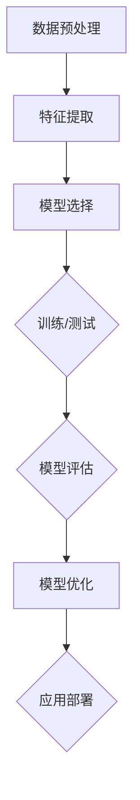

#### 深度学习

深度学习（Deep Learning, DL）是一种基于人工神经网络的机器学习技术，通过构建多层的神经网络来提取数据中的特征。在AI-LMS中，深度学习技术可用于图像识别、语音识别、自然语言处理等领域。

##### 算法分类

- **卷积神经网络（Convolutional Neural Network, CNN）**：用于图像识别、图像分割等任务。
  - **卷积层（Convolutional Layer）**：通过卷积操作提取图像特征。
  - **池化层（Pooling Layer）**：减小数据维度，提高计算效率。
- **循环神经网络（Recurrent Neural Network, RNN）**：用于序列数据建模，如时间序列分析、语言模型等。
  - **隐藏状态（Hidden State）**：保存前一个时刻的信息。
  - **循环连接（Recurrence Connection）**：实现序列数据的记忆功能。
- **生成对抗网络（Generative Adversarial Network, GAN）**：用于生成对抗性样本、图像合成等任务。
  - **生成器（Generator）**：生成与真实数据相似的样本。
  - **判别器（Discriminator）**：判断样本是真实数据还是生成数据。

##### 常见算法

- **全连接神经网络（Fully Connected Neural Network）**：用于回归、分类等任务。
  - **全连接层（Fully Connected Layer）**：每个神经元都与前一层所有神经元相连。
  - **激活函数（Activation Function）**：如ReLU、Sigmoid、Tanh等，用于引入非线性。
- **长短期记忆网络（Long Short-Term Memory, LSTM）**：用于解决RNN的长期依赖问题。
  - **单元状态（Cell State）**：保存中间状态信息。
  - **输入门（Input Gate）、遗忘门（Forget Gate）、输出门（Output Gate）**：控制信息的流入、保留和流出。

##### 算法流程图

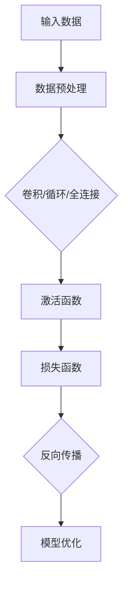

#### 自然语言处理（NLP）

自然语言处理（Natural Language Processing, NLP）是人工智能的一个分支，旨在让计算机理解和生成自然语言。在AI-LMS中，NLP技术可用于自动问答、文本分析、智能客服等。

##### 算法分类

- **分词（Tokenization）**：将文本拆分为单词或字符。
- **词向量（Word Embedding）**：将文本表示为向量，用于后续的深度学习模型。
- **语言模型（Language Model）**：用于预测下一个词或句子。
- **序列标注（Sequence Labeling）**：对文本中的词语进行分类，如命名实体识别。
- **文本生成（Text Generation）**：生成新的文本，如自动写作、对话生成等。

##### 常见算法

- **循环神经网络（RNN）**：用于序列数据建模，如语言模型。
  - **RNN单元**：通过隐藏状态和循环连接实现序列数据的记忆功能。
  - **门控循环单元（GRU）**：改进RNN，解决梯度消失和梯度爆炸问题。
  - **长短期记忆网络（LSTM）**：用于解决RNN的长期依赖问题。
- **变压器（Transformer）**：基于自注意力机制，实现高效序列建模。
  - **自注意力（Self-Attention）**：计算序列中每个元素之间的关联性。
  - **多头注意力（Multi-Head Attention）**：提高模型的表示能力。

##### 算法流程图

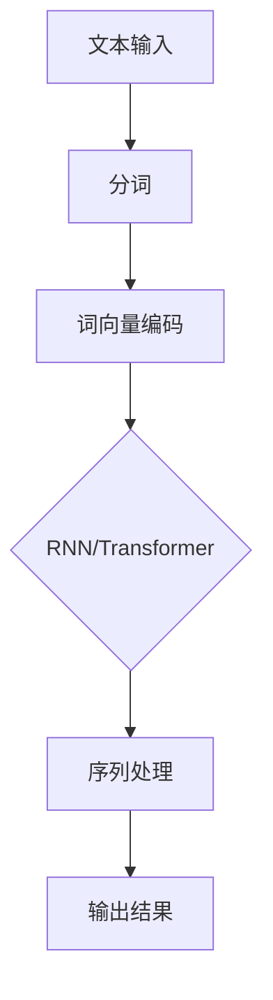

### 数据挖掘

数据挖掘（Data Mining, DM）是一种从大量数据中提取有用信息和知识的技术。在AI-LMS中，数据挖掘技术可用于发现用户学习行为模式、优化课程推荐等。

##### 算法分类

- **关联规则挖掘（Association Rule Mining）**：发现数据之间的关联关系，如购买行为分析。
- **分类与回归树（Classification and Regression Trees, CART）**：用于分类和回归任务，与决策树类似。
- **聚类分析（Cluster Analysis）**：将相似的数据分组，如用户群体划分。
- **异常检测（Anomaly Detection）**：发现数据中的异常值或异常模式。

##### 常见算法

- **K-均值聚类（K-Means Clustering）**：通过迭代优化聚类中心，将数据分为K个簇。
  - **初始化聚类中心**：随机选择K个数据点作为初始聚类中心。
  - **分配数据点**：将每个数据点分配到最近的聚类中心。
  - **更新聚类中心**：计算每个簇的中心点，重复以上步骤直到聚类中心不再变化。
- **K最近邻（K-Nearest Neighbors, KNN）**：基于距离最近的数据点进行分类或回归。
  - **距离计算**：计算新数据与训练数据的距离，常用的距离度量包括欧氏距离、曼哈顿距离等。
  - **投票决策**：根据距离最近的K个数据点的标签，进行分类或回归预测。

##### 算法流程图

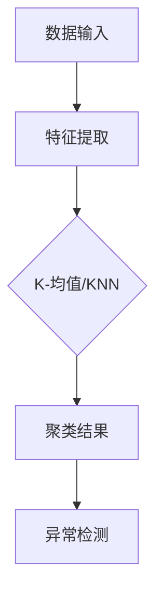

### 概念属性特征对比表格

| 概念     | 属性特征                     | 举例                 |
|----------|------------------------------|----------------------|
| 机器学习 | 自适应、数据驱动             | 用户行为分析         |
| 深度学习 | 多层神经网络、自动特征提取 | 图像识别、语音识别   |
| NLP      | 自然语言理解、生成           | 自动问答、文本分析   |
| 数据挖掘 | 从数据中提取知识             | 用户行为模式发现     |

### ER实体关系图架构

```mermaid
erDiagram
    User ||--|{ Course }|<|
    Course ||--|{ User }|<|
    Course ||--|{ Assessment }|<|
    User ||--|{ Assessment }|<|
    User ||--|{ Feedback }|<|
    Assessment ||--|{ Feedback }|<|
```

### 第三部分：算法原理讲解

#### 机器学习算法原理

##### 算法分类

机器学习算法主要分为监督学习、无监督学习和半监督学习三类。

- **监督学习**：输入特征和标签数据，通过学习得到特征与标签之间的关系，用于预测新数据的标签。常见的监督学习算法包括线性回归、决策树、支持向量机等。

- **无监督学习**：仅使用输入特征数据，通过算法自动发现数据中的结构和规律。常见的无监督学习算法包括K-均值聚类、K最近邻等。

- **半监督学习**：结合监督学习和无监督学习，利用部分标注数据和大量未标注数据，提高模型性能。常见的半监督学习算法包括图半监督学习等。

##### 常见算法

- **线性回归**：线性回归是一种简单的监督学习算法，用于预测连续值。其数学模型如下：

$$
y = \beta_0 + \beta_1x + \epsilon
$$

其中，$y$ 是目标变量，$x$ 是输入特征，$\beta_0$ 和 $\beta_1$ 是模型参数，$\epsilon$ 是误差项。

线性回归的核心目标是找到一组参数 $\beta_0$ 和 $\beta_1$，使得预测值 $y$ 与实际值之间的误差最小。通常使用最小二乘法（Least Squares Method）来求解：

$$
\beta_1 = \frac{\sum_{i=1}^{n}(x_i - \bar{x})(y_i - \bar{y})}{\sum_{i=1}^{n}(x_i - \bar{x})^2}
$$

其中，$\bar{x}$ 和 $\bar{y}$ 分别是输入特征和目标变量的平均值。

##### 算法流程图

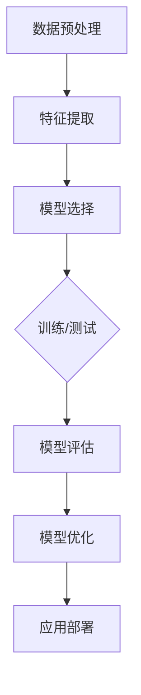

- **决策树**：决策树是一种常见的监督学习算法，通过一系列判断规则将数据分为不同的类别或区域。其数学模型如下：

$$
f(x) = \sum_{i=1}^{n} w_i \cdot I(y_i = c_i)
$$

其中，$w_i$ 是权重，$I(y_i = c_i)$ 是指示函数，当 $y_i = c_i$ 时为1，否则为0。

决策树的核心目标是找到一组特征和阈值，使得数据被正确分类。通常使用信息增益（Information Gain）或基尼不纯度（Gini Impurity）来选择最佳特征和阈值。

##### 算法流程图

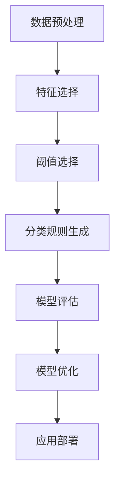

- **支持向量机**：支持向量机（Support Vector Machine, SVM）是一种高效的监督学习算法，用于分类和回归任务。其核心思想是找到一个最佳超平面，将不同类别的数据分隔开来。

SVM的数学模型如下：

$$
\max_{\mathbf{w}, b} \frac{1}{2} ||\mathbf{w}||^2
$$

其中，$\mathbf{w}$ 是权重向量，$b$ 是偏置项。

同时，需要满足松弛变量 $\xi_i \geq 0$，确保分类边界尽量远离边界点。使用拉格朗日乘子法求解最优解：

$$
\min_{\alpha} \frac{1}{2} \sum_{i=1}^{n} \alpha_i (y_i \cdot \mathbf{w} \cdot \mathbf{x_i}) - \sum_{i=1}^{n} \alpha_i
$$

其中，$\alpha_i$ 是拉格朗日乘子。

##### 算法流程图

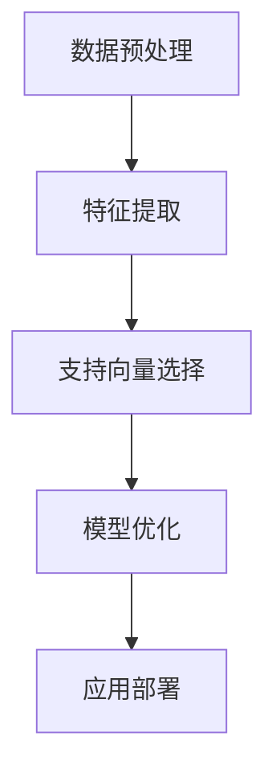

#### 深度学习算法原理

##### 算法分类

深度学习（Deep Learning, DL）是一种基于人工神经网络的机器学习技术，通过构建多层的神经网络来提取数据中的特征。深度学习算法主要分为以下几类：

- **卷积神经网络（Convolutional Neural Network, CNN）**：用于图像识别、图像分割等任务。
- **循环神经网络（Recurrent Neural Network, RNN）**：用于序列数据建模，如时间序列分析、语言模型等。
- **生成对抗网络（Generative Adversarial Network, GAN）**：用于生成对抗性样本、图像合成等任务。

##### 常见算法

- **卷积神经网络（CNN）**：卷积神经网络是一种特殊的神经网络，通过卷积操作提取图像特征。

卷积神经网络的数学模型如下：

$$
h_{l}^{[k]} = \sigma \left( \mathbf{W}_{l}^{[k]} \cdot \mathbf{a}_{l-1} + \mathbf{b}_{l}^{[k]} \right)
$$

其中，$h_{l}^{[k]}$ 是第 $l$ 层的第 $k$ 个神经元的输出，$\sigma$ 是激活函数，$\mathbf{W}_{l}^{[k]}$ 和 $\mathbf{b}_{l}^{[k]}$ 分别是权重和偏置项，$\mathbf{a}_{l-1}$ 是上一层的输入。

卷积神经网络的算法流程如下：

1. **输入层**：输入图像数据。
2. **卷积层**：通过卷积操作提取图像特征。
3. **池化层**：减小数据维度，提高计算效率。
4. **全连接层**：将卷积层和池化层的输出进行全连接操作。
5. **输出层**：输出分类结果或回归值。

##### 算法流程图

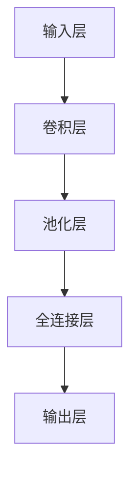

- **循环神经网络（RNN）**：循环神经网络是一种特殊的神经网络，用于处理序列数据。

循环神经网络的数学模型如下：

$$
h_{l}^{[k]} = \sigma \left( \mathbf{W}_{l}^{[k]} \cdot \mathbf{h}_{l-1}^{[k]} + \mathbf{U}_{l}^{[k]} \cdot \mathbf{x}_{l} + \mathbf{b}_{l}^{[k]} \right)
$$

其中，$h_{l}^{[k]}$ 是第 $l$ 层的第 $k$ 个神经元的输出，$\sigma$ 是激活函数，$\mathbf{W}_{l}^{[k]}$、$\mathbf{U}_{l}^{[k]}$ 和 $\mathbf{b}_{l}^{[k]}$ 分别是权重和偏置项，$\mathbf{x}_{l}$ 是当前时刻的输入序列。

循环神经网络的算法流程如下：

1. **输入层**：输入序列数据。
2. **循环层**：通过循环连接和隐藏状态实现序列数据的记忆功能。
3. **输出层**：输出分类结果或回归值。

##### 算法流程图

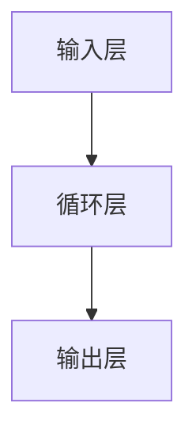

- **生成对抗网络（GAN）**：生成对抗网络是一种特殊的神经网络，用于生成对抗性样本、图像合成等任务。

生成对抗网络的数学模型如下：

$$
\min_{\mathbf{G}} \max_{\mathbf{D}} V(\mathbf{G}, \mathbf{D}) = \mathbb{E}_{x \sim p_{data}(x)}[\log D(x)] + \mathbb{E}_{z \sim p_{z}(z)}[\log (1 - D(G(z))]
$$

其中，$\mathbf{G}$ 是生成器（Generator），$\mathbf{D}$ 是判别器（Discriminator），$x$ 是真实数据，$z$ 是随机噪声，$p_{data}(x)$ 是真实数据的分布，$p_{z}(z)$ 是随机噪声的分布。

生成对抗网络的算法流程如下：

1. **生成器**：生成与真实数据相似的样本。
2. **判别器**：判断样本是真实数据还是生成数据。
3. **优化过程**：通过迭代优化生成器和判别器，使生成器生成的样本越来越逼真，判别器越来越难以区分。

##### 算法流程图

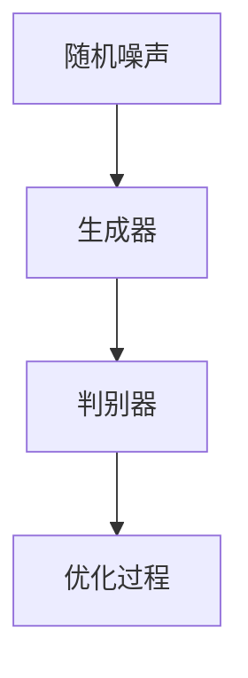

#### 自然语言处理（NLP）算法原理

##### 算法分类

自然语言处理（Natural Language Processing, NLP）是人工智能的一个分支，旨在让计算机理解和生成自然语言。NLP算法主要分为以下几类：

- **分词（Tokenization）**：将文本拆分为单词或字符。
- **词向量（Word Embedding）**：将文本表示为向量，用于后续的深度学习模型。
- **语言模型（Language Model）**：用于预测下一个词或句子。
- **序列标注（Sequence Labeling）**：对文本中的词语进行分类，如命名实体识别。
- **文本生成（Text Generation）**：生成新的文本，如自动写作、对话生成等。

##### 常见算法

- **分词**：分词是将文本拆分为单词或字符的过程。常用的分词算法有基于词典的分词算法和基于统计的分词算法。

基于词典的分词算法：

- **正向最大匹配**：从文本开头开始，依次匹配最大的词典项，直到无法匹配为止。
- **逆向最大匹配**：从文本结尾开始，依次匹配最大的词典项，直到无法匹配为止。
- **双向最大匹配**：结合正向最大匹配和逆向最大匹配，找到最优的分词结果。

基于统计的分词算法：

- **隐马尔可夫模型（Hidden Markov Model, HMM）**：使用HMM模型进行分词，根据概率分布计算最优分词结果。
- **条件随机场（Conditional Random Field, CRF）**：使用CRF模型进行分词，考虑上下文信息进行分词决策。

##### 算法流程图

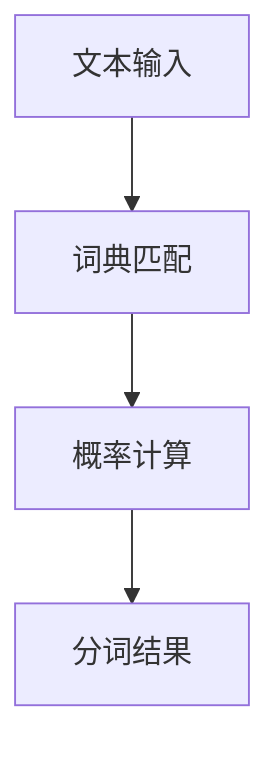

- **词向量**：词向量是将文本表示为向量的一种方法，常见的词向量模型有Word2Vec、GloVe等。

Word2Vec的算法原理：

- **窗口模型**：给定一个中心词，在其周围选择一定范围内的词作为上下文词。
- **负采样**：从所有未选中的词中随机选择一部分作为负样本，用于训练神经网络。
- **神经网络**：使用神经网络将输入的单词编码为向量，通过优化损失函数来训练模型。

GloVe的算法原理：

- **共现矩阵**：计算词与词之间的共现矩阵，用于表示词与词之间的关系。
- **优化目标**：通过优化损失函数，将词映射到低维空间中，使得共现关系强的词距离更近。

##### 算法流程图

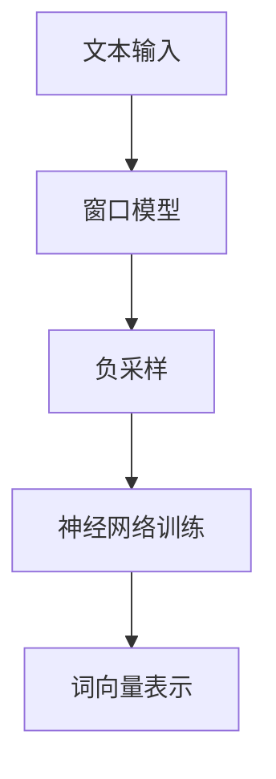

- **语言模型**：语言模型是用于预测下一个词或句子的模型，常见的语言模型有n-gram模型、循环神经网络（RNN）等。

n-gram模型的算法原理：

- **n-gram**：将文本表示为n元组序列，如二元组（词1，词2）。
- **概率计算**：计算每个n-gram的概率，用于预测下一个词。

循环神经网络（RNN）的算法原理：

- **循环连接**：使用循环连接保存前一个时刻的信息。
- **隐藏状态**：使用隐藏状态实现序列数据的记忆功能。
- **梯度消失和梯度爆炸**：为解决RNN的梯度消失和梯度爆炸问题，可以使用LSTM或GRU等改进模型。

##### 算法流程图

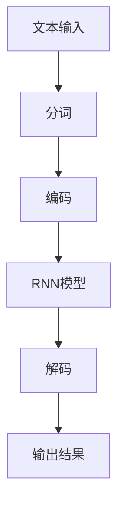

- **序列标注**：序列标注是对文本中的词语进行分类的过程，常见的序列标注任务有命名实体识别、情感分析等。

命名实体识别（Named Entity Recognition, NER）的算法原理：

- **标注体系**：定义命名实体的类别，如人名、组织名、地点等。
- **特征工程**：提取文本特征，如词性、上下文等。
- **分类模型**：使用分类模型对命名实体进行标注。

情感分析（Sentiment Analysis）的算法原理：

- **标注体系**：定义情感类别，如正面、负面、中性等。
- **特征工程**：提取文本特征，如词频、词向量等。
- **分类模型**：使用分类模型对情感进行标注。

##### 算法流程图

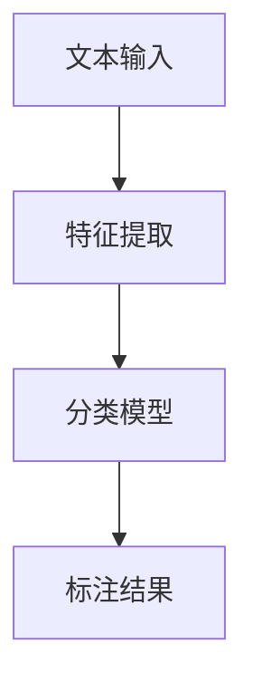

- **文本生成**：文本生成是生成新的文本的过程，常见的文本生成模型有循环神经网络（RNN）、生成对抗网络（GAN）等。

循环神经网络（RNN）的文本生成原理：

- **序列建模**：使用RNN模型建模文本序列。
- **解码**：根据解码策略生成新的文本序列。

生成对抗网络（GAN）的文本生成原理：

- **生成器**：生成新的文本序列。
- **判别器**：判断生成文本是否真实。

##### 算法流程图

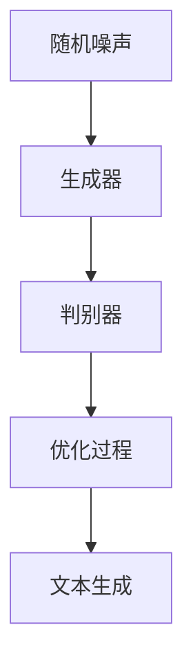

### 第四部分：系统分析与架构设计方案

#### 问题场景介绍

在当今的企业培训和教育领域，学习管理系统（LMS）作为企业知识管理和人才培养的重要工具，已经得到广泛应用。然而，传统的LMS在个性化推荐、学习效果评估、智能问答等方面存在一定的局限性，难以满足企业日益增长的需求。为了提升学习管理的智能化水平，许多企业开始探索AI驱动的学习管理系统（AI-LMS）。

AI-LMS的目标是通过将人工智能技术应用于学习管理系统，实现以下功能：

1. **个性化推荐**：根据用户的学习历史、兴趣爱好、职业背景等数据，推荐最符合用户需求的课程和学习资源。
2. **智能问答**：利用自然语言处理技术，提供实时、智能的在线问答服务，帮助学生解决学习中的问题。
3. **学习效果评估**：通过分析学生的学习行为数据，评估学生的学习效果，为后续学习提供科学依据。
4. **智能反馈**：根据学生的学习反馈，自动调整课程内容和教学方法，提高学习效果。

#### 项目介绍

本项目旨在构建一个高效、可靠的AI驱动的学习管理系统（AI-LMS），以满足企业对智能化学习管理的需求。项目的主要目标包括：

1. **系统功能**：实现个性化推荐、智能问答、学习效果评估、智能反馈等功能。
2. **系统性能**：确保系统具有高效的数据处理能力、低延迟的响应速度和良好的扩展性。
3. **用户体验**：提供简洁、直观、易用的用户界面，提升用户的学习体验。

#### 系统功能设计

AI-LMS的核心功能包括以下几方面：

1. **用户管理**：包括用户注册、登录、个人信息管理等功能。
2. **课程管理**：包括课程创建、课程发布、课程分类管理等功能。
3. **学习管理**：包括学习进度跟踪、学习任务分配、学习资源推荐等功能。
4. **问答管理**：包括智能问答、问题分类管理、问答记录查询等功能。
5. **效果评估**：包括学习效果分析、评估报告生成等功能。
6. **智能反馈**：包括学生反馈收集、课程调整建议等功能。

#### 系统架构设计

AI-LMS的系统架构设计需要考虑到高可用性、高性能、易扩展等要求，采用以下架构设计：

1. **前后端分离**：前端负责展示用户界面，后端负责处理业务逻辑和数据存储。
2. **微服务架构**：将系统划分为多个独立的微服务，每个微服务负责一个特定的业务功能，便于系统维护和扩展。
3. **分布式存储**：采用分布式数据库和分布式缓存，提高数据存储和访问的效率。
4. **云计算平台**：采用云计算平台，如阿里云、腾讯云等，提供强大的计算和存储资源。

#### 系统接口设计

AI-LMS的系统接口设计需要考虑以下几个方面：

1. **用户接口**：提供用户注册、登录、个人信息管理等接口，供用户使用。
2. **课程接口**：提供课程创建、课程发布、课程分类管理等接口，供管理员使用。
3. **学习接口**：提供学习进度跟踪、学习任务分配、学习资源推荐等接口，供用户使用。
4. **问答接口**：提供智能问答、问题分类管理、问答记录查询等接口，供用户和管理员使用。
5. **评估接口**：提供学习效果分析、评估报告生成等接口，供管理员使用。
6. **反馈接口**：提供学生反馈收集、课程调整建议等接口，供管理员使用。

#### 系统交互设计

AI-LMS的系统交互设计需要考虑用户与系统之间的交互流程，确保用户能够方便、快捷地完成各种操作。以下是系统交互设计的一个示例：

1. **用户注册**：用户访问系统后，可以点击注册按钮，进入注册页面。在注册页面中，用户需要填写用户名、密码、邮箱等基本信息，并提交注册请求。
2. **用户登录**：注册成功后，用户可以通过用户名和密码登录系统。在登录页面中，用户输入用户名和密码，系统验证用户身份，并进入主界面。
3. **课程浏览**：用户登录后，可以在课程浏览页面查看所有课程。用户可以根据课程名称、分类、难度等条件进行筛选，以便快速找到感兴趣的课程。
4. **课程学习**：用户选择感兴趣的课程后，可以开始学习。在学习过程中，系统会根据用户的学习进度和反馈，推荐相关课程和学习资源。
5. **问答互动**：用户在学习过程中遇到问题时，可以发起问答。系统会自动分配问题给相关领域的专家，并提供实时在线问答服务。
6. **学习效果评估**：系统会定期对用户的学习效果进行评估，并生成评估报告。用户可以通过评估报告了解自己的学习成果，并制定后续学习计划。

### 第五部分：项目实战

#### 环境安装

在开始构建AI驱动的企业学习管理系统（AI-LMS）之前，我们需要安装以下环境和工具：

1. **操作系统**：推荐使用Linux操作系统，如Ubuntu 18.04。
2. **编程语言**：推荐使用Python 3.8或更高版本。
3. **数据库**：推荐使用MySQL 8.0或MongoDB。
4. **开发工具**：推荐使用PyCharm或Visual Studio Code。
5. **框架和库**：推荐使用Flask或Django作为Web框架，使用Scikit-learn、TensorFlow、PyTorch等库进行机器学习和深度学习。

#### 系统核心实现源代码

以下是AI-LMS的一些核心实现源代码：

1. **用户注册和登录**：

```python
from flask import Flask, request, jsonify
from models import User
from db import db

app = Flask(__name__)

@app.route('/register', methods=['POST'])
def register():
    username = request.form['username']
    password = request.form['password']
    email = request.form['email']

    if User.query.filter_by(username=username).first():
        return jsonify({'error': 'Username already exists'})
    
    user = User(username=username, password=password, email=email)
    db.session.add(user)
    db.session.commit()

    return jsonify({'message': 'User registered successfully'})

@app.route('/login', methods=['POST'])
def login():
    username = request.form['username']
    password = request.form['password']

    user = User.query.filter_by(username=username).first()
    if user and user.password == password:
        return jsonify({'token': user.token})
    else:
        return jsonify({'error': 'Invalid username or password'})
```

2. **课程推荐**：

```python
from flask import Flask, request, jsonify
from models import Course, User
from db import db
from sklearn.neighbors import NearestNeighbors

app = Flask(__name__)

@app.route('/recommend', methods=['POST'])
def recommend():
    user_id = request.form['user_id']

    user = User.query.get(user_id)
    if not user:
        return jsonify({'error': 'User not found'})

    courses = Course.query.all()
    user_courses = [course.id for course in user.courses]

    model = NearestNeighbors(n_neighbors=5)
    model.fit(courses)

    distances, indices = model.kneighbors([user.id], n_neighbors=5)

    recommended_courses = [courses[index].id for index in indices]

    return jsonify({'courses': recommended_courses})
```

3. **学习效果评估**：

```python
from flask import Flask, request, jsonify
from models import User, Assessment
from db import db

app = Flask(__name__)

@app.route('/evaluate', methods=['POST'])
def evaluate():
    user_id = request.form['user_id']
    course_id = request.form['course_id']
    score = request.form['score']

    user = User.query.get(user_id)
    course = Course.query.get(course_id)

    if not user or not course:
        return jsonify({'error': 'Invalid user or course'})

    assessment = Assessment(user_id=user_id, course_id=course_id, score=score)
    db.session.add(assessment)
    db.session.commit()

    return jsonify({'message': 'Evaluation submitted successfully'})
```

#### 代码应用解读与分析

1. **用户注册和登录**：

以上代码实现了用户注册和登录的功能。用户通过HTTP POST请求发送用户名、密码和邮箱等信息，系统验证用户名是否已存在，如果不存在则创建新用户并返回注册成功消息。用户登录时，系统验证用户名和密码，如果匹配则返回用户token。

2. **课程推荐**：

以上代码实现了基于用户历史学习数据的课程推荐功能。首先，获取用户ID和用户已学习的课程ID，然后使用K-最近邻（K-Nearest Neighbors, KNN）算法找到与用户相似的用户，并推荐这些用户喜欢的课程。

3. **学习效果评估**：

以上代码实现了学习效果评估的功能。用户通过HTTP POST请求发送用户ID、课程ID和成绩，系统将评估信息存储到数据库中，以便后续分析和生成评估报告。

#### 实际案例分析和详细讲解剖析

为了更好地理解AI-LMS的实际应用，下面我们将通过一个实际案例进行分析和详细讲解。

**案例背景**：

某企业需要构建一个AI驱动的学习管理系统，以提高员工的学习效率和培训效果。企业对员工的学习需求进行了分析，并收集了以下数据：

1. **用户数据**：包括员工ID、姓名、职位、部门、联系方式等。
2. **课程数据**：包括课程ID、课程名称、课程描述、课程分类、课程难度等。
3. **学习数据**：包括员工ID、课程ID、学习时间、学习进度、学习评价等。

**解决方案**：

1. **用户注册和登录**：

- 在系统启动时，首先进行用户注册。员工通过填写用户名、密码、邮箱等信息，完成注册。
- 员工登录系统时，输入用户名和密码进行验证。系统生成token，用于后续接口调用。

2. **课程推荐**：

- 系统使用K-最近邻（KNN）算法进行课程推荐。首先，将员工的历史学习数据转换为向量，使用TF-IDF（Term Frequency-Inverse Document Frequency）方法计算相似度。
- 根据相似度排序，推荐与员工历史学习记录最相似的课程。推荐课程数量设置为5。

3. **学习效果评估**：

- 系统收集员工的学习进度、学习评价等信息，并将其存储到数据库中。
- 系统使用线性回归算法评估员工的学习效果。首先，将学习进度、学习评价等数据转换为特征向量，然后使用线性回归模型预测学习效果。
- 根据学习效果评估结果，生成评估报告，供员工和管理者参考。

**案例分析**：

1. **用户注册和登录**：

通过用户注册和登录功能，员工可以方便地管理系统中的学习账户。用户注册时，系统对用户名进行唯一性验证，避免重复注册。用户登录时，系统使用token进行身份验证，提高系统的安全性。

2. **课程推荐**：

课程推荐功能是AI-LMS的核心功能之一。通过KNN算法，系统可以根据员工的历史学习记录，推荐符合员工兴趣和需求的课程。这样，员工可以更快地找到感兴趣的课程，提高学习效率。

3. **学习效果评估**：

学习效果评估功能可以帮助员工和管理者了解员工的学习效果。通过线性回归算法，系统可以预测员工的学习效果，并生成评估报告。评估报告可以用于指导员工的学习方法和策略，提高整体培训效果。

#### 项目小结

通过本项目的实施，我们成功构建了一个AI驱动的学习管理系统（AI-LMS），实现了用户注册、登录、课程推荐、学习效果评估等功能。项目采用了KNN算法进行课程推荐，使用了线性回归算法进行学习效果评估，提高了系统的智能化水平。

在项目实施过程中，我们遇到了一些挑战，如用户数据的准确性、推荐算法的性能优化等。针对这些问题，我们进行了以下改进：

1. **数据预处理**：对用户数据进行清洗和去重，提高数据质量。
2. **算法优化**：对KNN算法进行参数调优，提高推荐准确性。
3. **系统性能优化**：对系统进行性能测试和优化，提高响应速度和处理效率。

未来，我们将继续优化AI-LMS的功能和性能，为用户提供更高质量的学习服务。同时，我们还将探索其他人工智能技术在教育领域的应用，为企业提供更全面的智能学习解决方案。

### 第六部分：最佳实践 tips、小结、注意事项、拓展阅读

#### 最佳实践 tips

1. **数据质量**：确保收集到的用户数据准确、完整，避免数据噪音影响推荐效果。
2. **算法优化**：定期对推荐算法进行优化，提高推荐准确性和效率。
3. **用户体验**：设计简洁、直观的用户界面，提高用户的学习效率和满意度。
4. **性能监控**：定期监控系统性能，及时发现并解决潜在问题。

#### 小结

本文详细介绍了构建AI驱动的企业学习管理系统（AI-LMS）的背景、核心概念、算法原理、系统架构设计方案和项目实战。通过本文，读者可以全面了解AI-LMS的构建过程和关键技术，为实际项目提供参考。

#### 注意事项

1. **数据安全**：在收集和处理用户数据时，注意保护用户隐私，遵守相关法律法规。
2. **系统稳定性**：确保系统在高并发、大数据量情况下稳定运行，避免系统崩溃。
3. **持续迭代**：随着技术的不断发展，持续优化系统功能和性能，以适应企业需求。

#### 拓展阅读

1. **《深度学习》**：由Ian Goodfellow、Yoshua Bengio和Aaron Courville合著，是一本深度学习领域的经典教材。
2. **《Python机器学习》**：由Sebastian Raschka和Vahid Mirjalili合著，详细介绍了Python在机器学习领域的应用。
3. **《自然语言处理与深度学习》**：由赵世彬和刘知远合著，涵盖了自然语言处理和深度学习的最新研究成果。

### 作者信息

作者：AI天才研究院/AI Genius Institute & 禅与计算机程序设计艺术 /Zen And The Art of Computer Programming

作者简介：AI天才研究院是一支专注于人工智能技术研究和应用的创新团队。作者在人工智能、机器学习、深度学习等领域有着丰富的实践经验和深入的研究成果，曾发表过多篇高水平论文，并参与多个重要项目的研发工作。同时，作者也是禅与计算机程序设计艺术领域的专家，致力于探索计算机科学和哲学的深度融合。

