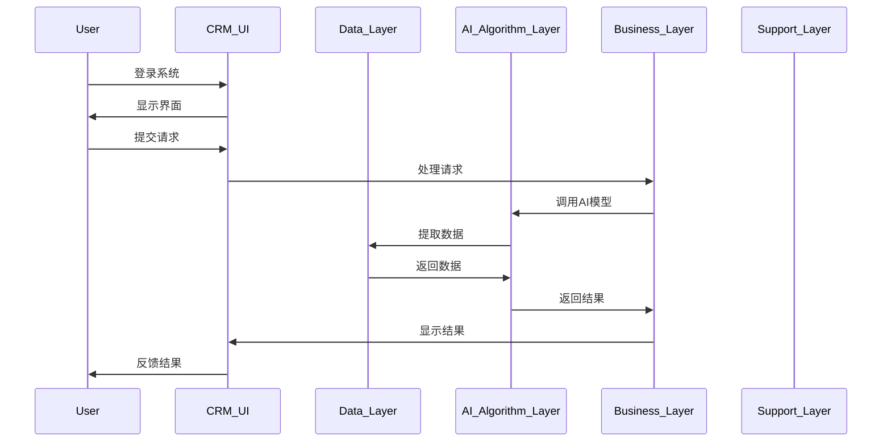

                 

### 第3章 AI驱动的CRM系统架构设计

#### 3.1 CRM系统概述

CRM（Customer Relationship Management，客户关系管理）系统是一种旨在帮助企业管理与客户的互动和关系的软件平台。它通过整合销售、市场营销、客户服务以及技术支持等业务流程，实现自动化和优化，以提高工作效率和客户满意度。

CRM系统的功能模块通常包括：

- **客户信息管理**：包括客户基本信息的存储、更新和管理。
- **销售管理**：跟踪销售机会、管理销售流程、提供销售预测。
- **营销自动化**：设计、执行、跟踪营销活动，自动化营销流程。
- **客户服务与支持**：提供客户服务支持，管理客户反馈和投诉。
- **分析报告**：生成各种报告，帮助管理层做出数据驱动的决策。

常见的CRM设计模式有：

- **客户端-服务器模式**：客户端负责用户界面，服务器处理数据存储和业务逻辑。
- **三层架构**：将应用分为表示层、业务逻辑层和数据层，提高系统的可维护性和可扩展性。
- **BPM（业务流程管理）**：通过建模和自动化业务流程，提高业务流程的效率和灵活性。

#### 3.2 AI驱动的CRM系统架构设计

AI驱动的CRM系统架构设计需要在传统CRM系统的架构基础上，集成AI技术，以提高系统的智能化水平。以下是一个典型的AI驱动的CRM系统架构设计：

##### 数据层

数据层是AI驱动的CRM系统的核心组成部分，它负责数据的收集、存储和管理。具体包括：

- **数据收集**：通过集成企业内部的各种数据源，如ERP系统、社交媒体等，收集客户数据。
- **数据存储**：使用数据库系统（如MySQL、MongoDB等）存储和管理数据，确保数据的安全性和可靠性。
- **数据清洗与整合**：清洗和整合来自不同数据源的数据，消除数据冗余和错误。

##### AI算法层

AI算法层负责数据分析和智能决策。具体包括：

- **机器学习模型**：构建和应用机器学习模型，如分类模型、回归模型等，进行数据分析和预测。
- **深度学习网络**：使用深度学习算法，如神经网络、卷积神经网络（CNN）等，处理复杂的客户数据。
- **自然语言处理（NLP）**：实现对文本数据的理解和分析，如客户评论分析、情感分析等。

##### 应用层

应用层是用户与AI驱动的CRM系统交互的接口，包括：

- **用户界面**：提供直观、易用的用户界面，让用户能够方便地操作系统。
- **业务逻辑层**：处理业务逻辑，如销售流程管理、营销活动管理等。
- **智能模块**：集成AI算法，实现智能推荐、销售预测等功能。

##### 辅助层

辅助层包括：

- **数据管理平台**：提供数据存储、备份和恢复功能。
- **运维支持**：确保系统的稳定运行，包括监控、故障排除和性能优化等。

#### 3.3 AI驱动的CRM系统架构图

以下是AI驱动的CRM系统架构的Mermaid序列图表示：

通过这个架构设计，AI驱动的CRM系统可以实现数据的自动收集、存储和管理，利用AI算法进行数据分析和预测，为企业的销售、营销和客户服务提供智能决策支持。

## 第3章 小结

本章介绍了CRM系统的基本概念、功能模块和设计模式，并详细探讨了AI驱动的CRM系统架构设计。通过理解这些内容，读者可以更好地了解AI技术在CRM系统中的应用和架构设计要点。下一章将深入讨论数据收集与存储，以及数据清洗和整合的详细方法。

