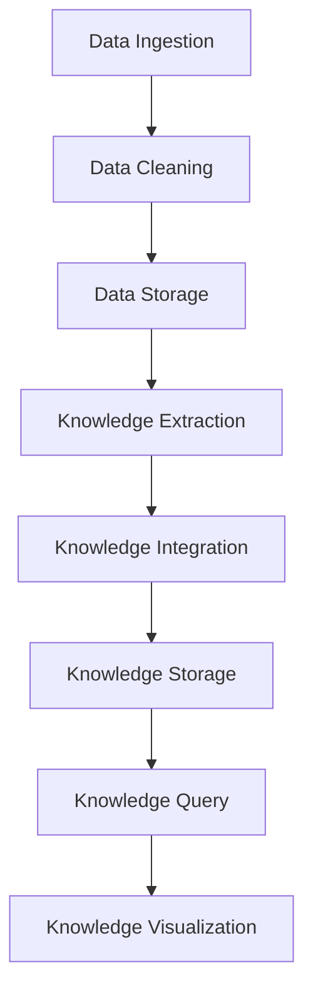
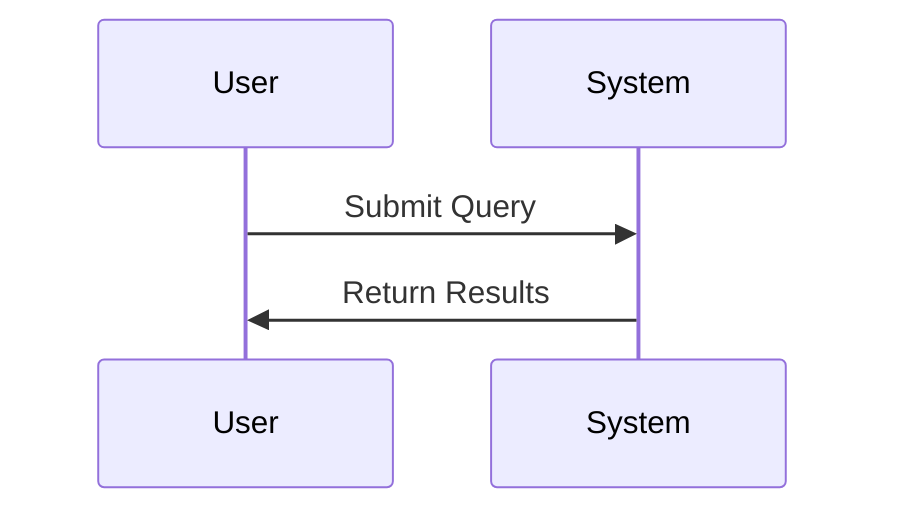
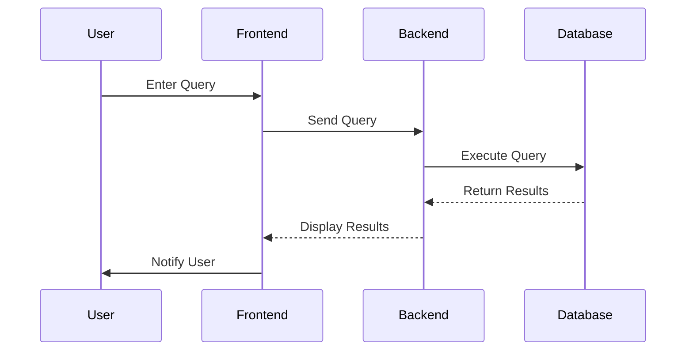
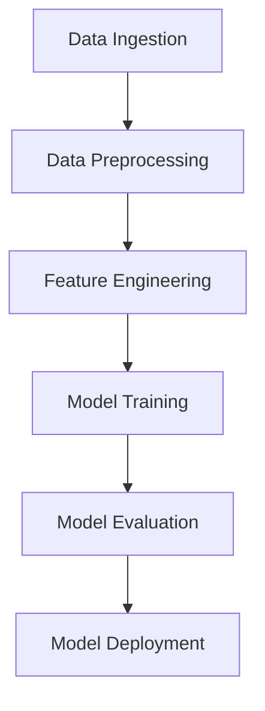

                 

### 引言

在数字化转型的浪潮中，企业面临的信息量和知识量激增，传统的知识管理方式逐渐显现出其局限性。如何高效地管理和利用这些信息成为企业竞争的关键。AI驱动的企业知识图谱作为新兴技术，以其强大的数据处理能力和深度的知识挖掘能力，为解决这一难题提供了新的思路。本文旨在深入探讨构建AI驱动的企业知识图谱的方法和步骤，帮助企业深化领域理解，提升知识管理效率。

### 文章关键词

- 企业知识管理
- AI驱动的知识图谱
- 数据处理
- 知识挖掘
- 深化领域理解

### 摘要

本文从问题背景入手，介绍了企业知识管理的现状与挑战，阐述了AI驱动的企业知识图谱的核心概念、基本构成和应用。随后，文章详细探讨了构建企业知识图谱的步骤，包括需求分析、数据收集、知识抽取与融合、知识图谱构建与存储、知识查询与可视化等环节。通过实际案例分析，本文展示了AI驱动的企业知识图谱在实践中的应用效果，并提出了最佳实践与未来展望。

### 第一部分：问题背景与概念介绍

#### 第1章：问题背景与概述

**1.1 问题背景**

在当今数字化经济时代，信息技术的快速发展使得企业面临的数据量和知识量呈现爆炸式增长。传统的知识管理方式，如文档管理、数据库检索等，已经难以应对这种信息过载的局面。特别是在复杂的企业环境中，不同部门、不同业务领域之间的信息孤岛现象严重，导致知识传递效率低下，知识利用不充分。此外，企业内部的业务流程、客户需求和市场变化也在不断变化，使得企业需要更加灵活和智能的知识管理解决方案。

**1.2 问题描述**

企业知识管理的核心问题是如何高效地收集、存储、管理和利用企业内部和外部的信息资源，以支持企业的决策和运营。具体来说，问题主要表现在以下几个方面：

- **信息孤岛**：企业内部不同部门、不同系统之间的信息无法有效整合，导致数据重复存储、信息不一致等问题。
- **知识传递效率低**：知识在部门间传递不畅，知识获取成本高，影响了企业的创新能力和运营效率。
- **知识利用不充分**：企业内部的大量知识资源未能得到充分利用，导致知识浪费。

**1.3 问题解决**

为了解决上述问题，AI驱动的企业知识图谱提供了一种新的解决方案。知识图谱通过将企业内部和外部的信息资源以图的形式进行组织，构建起一个结构化、关联性的知识网络，使得信息之间能够高效地互联互通。AI技术的引入，进一步提升了知识图谱的智能分析和挖掘能力，为企业提供了更加精准和高效的决策支持。

**1.4 边界与外延**

- **知识图谱在企业中的适用范围**：知识图谱不仅适用于企业内部的业务知识管理，还可以应用于客户关系管理、供应链管理、市场营销等领域，具有广泛的适用性。
- **知识图谱与人工智能的关系**：知识图谱是人工智能的重要组成部分，为人工智能提供了丰富的知识资源。同时，人工智能技术的应用，如自然语言处理、机器学习等，也为知识图谱的构建和优化提供了强大的技术支持。

### 第2章：核心概念与联系

#### 第2章：核心概念与联系

**2.1 AI驱动的企业知识图谱**

**2.1.1 定义**

AI驱动的企业知识图谱是一种利用人工智能技术构建的企业知识体系，它通过将企业内部和外部的信息资源以图的形式进行组织，实现对知识的结构化、关联性和智能化的管理和利用。

**2.1.2 核心特点**

- **结构化**：知识图谱将企业内外部信息资源以节点和边的方式组织，形成了一个结构化的知识网络。
- **关联性**：知识图谱通过节点之间的关系，建立了信息资源之间的关联性，使得信息能够高效地互联互通。
- **智能化**：AI技术的引入，使得知识图谱能够进行智能化的知识抽取、推理和查询，提供精准的决策支持。

**2.1.3 基本构成**

- **节点**：知识图谱中的实体，如企业员工、产品、客户等。
- **边**：表示节点之间的关系，如员工在某个部门工作、产品属于某个品牌等。
- **属性**：描述节点的特征，如员工的职位、产品的价格等。
- **关系**：定义节点之间的关联类型，如“工作于”、“属于”等。

**2.2 知识图谱在企业中的应用**

**2.2.1 应用领域**

知识图谱在企业中具有广泛的应用领域，包括但不限于：

- **客户关系管理**：通过构建客户知识图谱，实现客户信息的结构化管理和智能分析，提升客户服务水平。
- **供应链管理**：构建供应链知识图谱，优化供应链流程，提高供应链透明度和响应速度。
- **市场营销**：利用知识图谱进行市场分析，挖掘潜在客户和市场需求，优化营销策略。
- **产品研发**：构建产品知识图谱，实现产品信息的结构化管理和智能关联分析，提升产品研发效率。

**2.2.2 优势与挑战**

**优势**：

- **高效的信息整合**：知识图谱能够将企业内部和外部的信息资源进行结构化整合，实现信息的高效利用。
- **智能化的知识挖掘**：AI技术的引入，使得知识图谱能够进行智能化的知识抽取、推理和查询，提供精准的决策支持。
- **提升业务效率**：通过知识图谱的应用，企业能够更好地理解业务流程和客户需求，优化业务流程，提升运营效率。

**挑战**：

- **数据质量**：知识图谱的构建依赖于高质量的数据，数据质量和完整性对知识图谱的构建和应用具有重要影响。
- **技术门槛**：知识图谱的构建和应用需要专业的技术支持和丰富的经验，对于企业来说，技术门槛较高。
- **维护成本**：知识图谱的维护需要不断更新和优化，维护成本较高。

#### 第3章：相关技术概述

**3.1 自然语言处理**

**3.1.1 基本原理**

自然语言处理（Natural Language Processing，NLP）是人工智能的一个重要分支，它致力于使计算机能够理解、生成和处理人类自然语言。NLP的核心任务包括：

- **文本分类**：将文本数据归类到预定义的类别中，如垃圾邮件检测、情感分析等。
- **实体识别**：识别文本中的关键实体，如人名、地名、组织名等。
- **关系抽取**：识别文本中实体之间的关系，如“张三在清华工作”中的“张三”和“清华”之间的关系。
- **语义理解**：理解文本的语义，如文本中的隐含含义、逻辑关系等。

**3.1.2 关键技术**

- **分词**：将文本分割成词语或词汇，是NLP的基础技术。
- **词性标注**：为文本中的每个词语标注词性，如名词、动词、形容词等。
- **命名实体识别**：识别文本中的命名实体，如人名、地名、组织名等。
- **句法分析**：对文本进行句法分析，理解句子的结构。
- **语义分析**：对文本进行语义分析，理解文本的深层含义。

**3.2 机器学习**

**3.2.1 算法原理**

机器学习（Machine Learning，ML）是一种通过数据学习并做出决策的技术。它通过分析大量的数据，从中提取出规律和模式，然后利用这些规律和模式对新的数据进行预测或分类。机器学习的主要算法包括：

- **监督学习**：通过训练数据集来学习模型，然后使用这个模型对新的数据进行预测。常见的算法有线性回归、决策树、随机森林、支持向量机等。
- **无监督学习**：不依赖于标签数据，通过分析数据的内在结构和模式进行分类或聚类。常见的算法有K-均值聚类、主成分分析（PCA）、自编码器等。
- **强化学习**：通过试错和奖励机制来学习策略，使其在特定环境中做出最优决策。常见的算法有Q学习、深度Q网络（DQN）等。

**3.2.2 应用场景**

- **数据挖掘**：通过机器学习算法从大量数据中提取出有价值的信息和知识。
- **推荐系统**：基于用户的兴趣和行为，推荐用户可能感兴趣的商品或内容。
- **自然语言处理**：通过机器学习算法实现文本分类、情感分析、机器翻译等功能。
- **图像识别**：通过机器学习算法实现图像分类、目标检测、人脸识别等功能。

#### 第4章：构建企业知识图谱的步骤与方法

**4.1 需求分析与数据收集**

**4.1.1 需求分析**

需求分析是构建企业知识图谱的第一步，它旨在明确企业知识图谱的目标和需求。具体步骤如下：

- **明确知识管理目标**：分析企业的业务目标和战略，确定知识图谱需要实现的功能和效果。
- **确定知识类型**：根据企业的业务特点和需求，确定需要管理的知识类型，如业务数据、客户信息、产品知识等。
- **识别关键用户**：分析企业的关键用户群体，明确他们对知识图谱的需求和期望。
- **制定知识管理策略**：根据需求分析结果，制定知识管理策略，包括知识收集、存储、共享和利用等方面。

**4.1.2 企业业务需求**

- **业务流程优化**：通过构建知识图谱，实现对业务流程的深入理解和优化，提高业务运行效率。
- **决策支持**：利用知识图谱提供的数据和洞察，支持企业决策，提高决策的准确性和效率。
- **客户服务**：通过知识图谱，实现对客户需求的快速响应和个性化服务，提升客户满意度。
- **产品研发**：利用知识图谱，提升产品研发效率，加速产品迭代。

**4.1.3 用户需求**

- **易用性**：用户能够方便地访问和利用知识图谱中的信息资源。
- **实时性**：知识图谱能够实时更新和反映企业的最新业务情况。
- **个性化**：知识图谱能够根据用户的需求和偏好，提供个性化的信息服务。
- **安全性**：知识图谱的数据安全和隐私保护措施得到有效保障。

**4.2 数据收集**

**4.2.1 数据源选择**

构建企业知识图谱需要从多种数据源收集数据，常见的数据源包括：

- **内部数据**：企业内部的各种业务系统数据，如ERP、CRM、HR系统等。
- **外部数据**：来自互联网、合作伙伴和其他外部数据源的数据，如市场数据、行业报告等。
- **非结构化数据**：文本、图像、视频等非结构化数据，需要通过数据预处理技术进行结构化处理。

**4.2.2 数据清洗与预处理**

数据清洗和预处理是数据收集的重要环节，它包括以下步骤：

- **数据去重**：去除重复的数据，确保数据的一致性和准确性。
- **数据格式转换**：将不同格式的数据进行统一格式转换，确保数据能够相互匹配和整合。
- **数据缺失值处理**：对于缺失的数据，采用填充、删除或插值等方法进行处理。
- **数据标准化**：将数据按照一定的规则进行标准化处理，如统一编码、日期格式等。

**4.3 知识抽取与融合**

**4.3.1 知识抽取**

知识抽取是从原始数据中提取出有用的信息和知识的过程，常见的方法包括：

- **规则抽取**：通过预定义的规则从数据中抽取知识。
- **统计方法**：利用统计学方法从数据中挖掘潜在的规律和知识。
- **机器学习方法**：利用机器学习算法，从大量数据中自动提取知识。

**4.3.2 知识融合**

知识融合是将来自不同数据源或不同格式的知识进行整合和统一的过程，常见的方法包括：

- **实体匹配**：通过实体识别技术，将不同数据源中的相同实体进行匹配和统一。
- **知识合并**：将相同或相似的知识进行合并，形成一个统一的视图。
- **冲突解决**：解决不同数据源之间的冲突和矛盾，确保知识的准确性。

**4.4 知识图谱构建与存储**

**4.4.1 知识图谱构建**

知识图谱构建是将提取和融合的知识以图的形式进行组织的过程，包括以下步骤：

- **实体识别**：识别知识图谱中的实体，如人、地点、组织等。
- **关系抽取**：识别实体之间的关系，如工作于、属于等。
- **属性抽取**：为实体和关系抽取属性，如员工的职位、产品的价格等。
- **知识存储**：将构建好的知识图谱存储到图数据库中，如Neo4j、OrientDB等。

**4.4.2 知识存储**

知识存储是知识图谱构建的重要环节，它包括以下内容：

- **图数据库选择**：根据知识图谱的特点和需求，选择合适的图数据库，如Neo4j、OrientDB等。
- **存储优化**：对知识图谱进行存储优化，提高查询效率和存储空间利用率。
- **数据备份与恢复**：对知识图谱的数据进行备份和恢复，确保数据的安全性和可靠性。

**4.5 知识查询与可视化**

**4.5.1 知识查询**

知识查询是利用知识图谱提供的信息进行查询和分析的过程，包括以下内容：

- **查询语言**：使用图查询语言，如Cypher、Gremlin等，编写查询语句，从知识图谱中检索信息。
- **查询优化**：对查询进行优化，提高查询效率和响应速度。
- **查询结果处理**：对查询结果进行格式化、可视化等处理，使其更加直观和易于理解。

**4.5.2 知识可视化**

知识可视化是将知识图谱以图形的方式展示出来，使其更加直观和易于理解，包括以下内容：

- **可视化工具**：使用可视化工具，如Gephi、D3.js等，将知识图谱进行图形化展示。
- **可视化设计**：根据知识图谱的特点和需求，设计合适的可视化方式，如节点大小、颜色、边宽度等。
- **交互式查询**：通过交互式查询，使用户能够动态地探索知识图谱，发现潜在的知识关联。

### 第二部分：构建企业知识图谱的步骤与方法

**第5章：需求分析与数据收集**

**5.1 需求分析**

需求分析是构建企业知识图谱的第一步，它旨在明确企业知识图谱的目标和需求。具体步骤如下：

1. **明确知识管理目标**：分析企业的业务目标和战略，确定知识图谱需要实现的功能和效果。
2. **确定知识类型**：根据企业的业务特点和需求，确定需要管理的知识类型，如业务数据、客户信息、产品知识等。
3. **识别关键用户**：分析企业的关键用户群体，明确他们对知识图谱的需求和期望。
4. **制定知识管理策略**：根据需求分析结果，制定知识管理策略，包括知识收集、存储、共享和利用等方面。

**5.1.1 企业业务需求**

- **业务流程优化**：通过构建知识图谱，实现对业务流程的深入理解和优化，提高业务运行效率。
- **决策支持**：利用知识图谱提供的数据和洞察，支持企业决策，提高决策的准确性和效率。
- **客户服务**：通过知识图谱，实现对客户需求的快速响应和个性化服务，提升客户满意度。
- **产品研发**：利用知识图谱，提升产品研发效率，加速产品迭代。

**5.1.2 用户需求**

- **易用性**：用户能够方便地访问和利用知识图谱中的信息资源。
- **实时性**：知识图谱能够实时更新和反映企业的最新业务情况。
- **个性化**：知识图谱能够根据用户的需求和偏好，提供个性化的信息服务。
- **安全性**：知识图谱的数据安全和隐私保护措施得到有效保障。

**5.2 数据收集**

**5.2.1 数据源选择**

构建企业知识图谱需要从多种数据源收集数据，常见的数据源包括：

- **内部数据**：企业内部的各种业务系统数据，如ERP、CRM、HR系统等。
- **外部数据**：来自互联网、合作伙伴和其他外部数据源的数据，如市场数据、行业报告等。
- **非结构化数据**：文本、图像、视频等非结构化数据，需要通过数据预处理技术进行结构化处理。

**5.2.2 数据清洗与预处理**

数据清洗和预处理是数据收集的重要环节，它包括以下步骤：

- **数据去重**：去除重复的数据，确保数据的一致性和准确性。
- **数据格式转换**：将不同格式的数据进行统一格式转换，确保数据能够相互匹配和整合。
- **数据缺失值处理**：对于缺失的数据，采用填充、删除或插值等方法进行处理。
- **数据标准化**：将数据按照一定的规则进行标准化处理，如统一编码、日期格式等。

**5.3 知识抽取与融合**

**5.3.1 知识抽取**

知识抽取是从原始数据中提取出有用的信息和知识的过程，常见的方法包括：

- **规则抽取**：通过预定义的规则从数据中抽取知识。
- **统计方法**：利用统计学方法从数据中挖掘潜在的规律和知识。
- **机器学习方法**：利用机器学习算法，从大量数据中自动提取知识。

**5.3.2 知识融合**

知识融合是将来自不同数据源或不同格式的知识进行整合和统一的过程，常见的方法包括：

- **实体匹配**：通过实体识别技术，将不同数据源中的相同实体进行匹配和统一。
- **知识合并**：将相同或相似的知识进行合并，形成一个统一的视图。
- **冲突解决**：解决不同数据源之间的冲突和矛盾，确保知识的准确性。

**5.4 知识图谱构建与存储**

**5.4.1 知识图谱构建**

知识图谱构建是将提取和融合的知识以图的形式进行组织的过程，包括以下步骤：

- **实体识别**：识别知识图谱中的实体，如人、地点、组织等。
- **关系抽取**：识别实体之间的关系，如工作于、属于等。
- **属性抽取**：为实体和关系抽取属性，如员工的职位、产品的价格等。
- **知识存储**：将构建好的知识图谱存储到图数据库中，如Neo4j、OrientDB等。

**5.4.2 知识存储**

知识存储是知识图谱构建的重要环节，它包括以下内容：

- **图数据库选择**：根据知识图谱的特点和需求，选择合适的图数据库，如Neo4j、OrientDB等。
- **存储优化**：对知识图谱进行存储优化，提高查询效率和存储空间利用率。
- **数据备份与恢复**：对知识图谱的数据进行备份和恢复，确保数据的安全性和可靠性。

**5.5 知识查询与可视化**

**5.5.1 知识查询**

知识查询是利用知识图谱提供的信息进行查询和分析的过程，包括以下内容：

- **查询语言**：使用图查询语言，如Cypher、Gremlin等，编写查询语句，从知识图谱中检索信息。
- **查询优化**：对查询进行优化，提高查询效率和响应速度。
- **查询结果处理**：对查询结果进行格式化、可视化等处理，使其更加直观和易于理解。

**5.5.2 知识可视化**

知识可视化是将知识图谱以图形的方式展示出来，使其更加直观和易于理解，包括以下内容：

- **可视化工具**：使用可视化工具，如Gephi、D3.js等，将知识图谱进行图形化展示。
- **可视化设计**：根据知识图谱的特点和需求，设计合适的可视化方式，如节点大小、颜色、边宽度等。
- **交互式查询**：通过交互式查询，使用户能够动态地探索知识图谱，发现潜在的知识关联。

### 第6章：知识图谱构建与存储

**6.1 知识图谱构建**

知识图谱构建是将提取和融合的知识以图的形式进行组织的过程，包括以下步骤：

**6.1.1 构建流程**

1. **实体识别**：从原始数据中识别出关键的实体，如人、地点、组织等。
2. **关系抽取**：抽取实体之间的关系，如“属于”、“工作于”等。
3. **属性抽取**：为实体和关系抽取属性，如员工职位、产品价格等。
4. **构建图模型**：将实体、关系和属性组织成图结构，形成知识图谱。

**6.1.2 关键技术**

- **实体识别**：利用自然语言处理（NLP）技术，从文本数据中识别出实体。
- **关系抽取**：通过规则抽取、统计方法和机器学习算法，从文本数据中抽取实体之间的关系。
- **属性抽取**：利用数据预处理和特征提取技术，从原始数据中提取实体的属性信息。

**6.2 知识存储**

知识存储是知识图谱构建的重要环节，它包括以下内容：

**6.2.1 存储方案**

1. **图数据库选择**：根据知识图谱的特点和需求，选择合适的图数据库，如Neo4j、OrientDB等。
2. **存储架构**：设计知识图谱的存储架构，包括数据存储、索引和查询优化等方面。

**6.2.2 存储优化**

1. **索引优化**：建立适当的索引，提高查询效率。
2. **数据压缩**：采用数据压缩技术，降低存储空间占用。
3. **备份与恢复**：定期备份数据，确保数据的安全性和可靠性。

### 第7章：知识图谱的查询与可视化

**7.1 知识查询**

知识查询是利用知识图谱提供的信息进行查询和分析的过程，包括以下内容：

**7.1.1 查询方法**

1. **基于条件的查询**：使用图查询语言，如Cypher、Gremlin等，编写查询语句，根据特定条件检索信息。
2. **基于路径的查询**：通过查询实体之间的路径，获取相关联的信息。
3. **基于属性的查询**：根据实体的属性信息进行查询。

**7.1.2 查询优化**

1. **索引优化**：建立适当的索引，提高查询效率。
2. **缓存策略**：利用缓存机制，加快查询响应速度。
3. **分布式查询**：在大型知识图谱中，采用分布式查询技术，提高查询处理能力。

**7.2 知识可视化**

知识可视化是将知识图谱以图形的方式展示出来，使其更加直观和易于理解，包括以下内容：

**7.2.1 可视化技术**

1. **节点和边的可视化**：使用不同颜色、形状和大小来表示节点和边，增强视觉效果。
2. **交互式可视化**：提供交互式功能，如放大、缩小、拖拽等，使用户能够动态地探索知识图谱。
3. **图布局算法**：采用合适的图布局算法，使知识图谱的布局更加清晰和美观。

**7.2.2 可视化工具**

1. **Gephi**：一款开源的可视化工具，支持多种图布局算法和交互式功能。
2. **D3.js**：一款基于Web的图形库，可以创建动态和交互式的可视化图表。
3. **Tableau**：一款数据可视化工具，支持多种数据源和丰富的可视化类型。

### 第三部分：案例分析与应用实践

#### 第8章：企业知识图谱建设实战

**8.1 项目介绍**

本案例介绍了一个企业知识图谱的建设项目，项目目标是构建一个能够支持企业内部知识管理和共享的知识图谱系统。项目涉及的主要业务领域包括产品研发、市场营销和客户服务。

**8.2 系统功能设计**

**8.2.1 领域模型**

领域模型是知识图谱的基础，用于定义系统的核心实体和关系。以下是项目中的部分领域模型：

```mermaid
classDiagram
    Class01 <|-- Class02
    Class03 --|>> Class04
    Class05 : +int x
    Class06 : <<interface>>
    Class07 : <<extend>> Class01
    Class08 : <<implement>> Interface01

    Class01 <<abstract>> : +isAbstract()
    Class01 : #9279e8
    Class02 : #b0c4de
    Class03 : #e2edff
    Class04 : #ffffd0
    Class05 : #d0e0e0
    Class06 : #ff69b4
    Class07 : #adff2f
    Class08 : #8b008b
```

**8.3 系统架构设计**

系统架构设计决定了知识图谱系统的性能、可扩展性和可靠性。以下是项目的系统架构图：



**8.4 系统接口设计**

系统接口设计用于定义系统内部各模块之间的交互接口。以下是项目中的接口规范：



**8.5 系统交互**

系统交互描述了用户与系统之间的交互过程。以下是项目的系统交互序列图：



### 第9章：深度分析与决策支持

**9.1 深度分析**

深度分析是利用知识图谱进行高级分析的过程，能够帮助企业发现潜在的业务机会和风险。以下是深度分析的主要方法：

**9.1.1 数据分析模型**

数据分析模型用于定义深度分析的方法和步骤。以下是项目中的数据分析模型：



**9.1.2 决策支持系统**

决策支持系统（DSS）是利用知识图谱提供的信息，辅助企业做出科学决策的工具。DSS的主要功能包括：

- **数据可视化**：将分析结果以图形化的方式展示，帮助用户更好地理解数据。
- **预测分析**：基于历史数据和趋势，预测未来的业务情况。
- **优化决策**：通过算法优化，提供最佳决策方案。

**9.2 案例分析**

**9.2.1 案例背景**

某企业是一家生产智能家居产品的公司，随着市场竞争的加剧，企业需要通过数据分析来提高产品研发和市场推广的效率。企业引入了知识图谱技术，构建了智能家居产品知识图谱。

**9.2.2 案例实施**

实施步骤如下：

1. **需求分析**：明确企业知识图谱的需求，包括产品信息、客户信息、市场数据等。
2. **数据收集**：从企业内部和外部数据源收集相关数据，如产品规格、客户购买记录、市场研究报告等。
3. **知识抽取**：利用自然语言处理和机器学习技术，从文本数据中抽取实体、关系和属性。
4. **知识融合**：将不同数据源中的知识进行整合，形成一个统一的视图。
5. **知识存储**：将构建好的知识图谱存储到图数据库中。
6. **深度分析**：利用知识图谱进行数据分析，发现潜在的市场机会和风险。
7. **决策支持**：基于分析结果，提供产品研发和市场推广的决策建议。

**9.2.3 案例效果评估**

实施效果评估如下：

- **产品研发效率提升**：通过知识图谱，产品研发团队能够快速获取相关的产品信息和市场数据，提高了研发效率。
- **市场推广效果提升**：通过深度分析，市场团队能够准确把握市场需求，优化了市场推广策略。
- **客户满意度提升**：通过知识图谱，客户服务团队能够提供更加个性化的服务，提升了客户满意度。

### 第10章：最佳实践与未来展望

**10.1 最佳实践**

构建AI驱动的企业知识图谱的最佳实践包括：

- **需求分析**：明确知识图谱的目标和需求，确保知识图谱能够满足企业的实际需求。
- **数据质量**：保证数据的质量和完整性，确保知识图谱的准确性和可靠性。
- **技术选型**：选择合适的图数据库和算法，确保知识图谱的高效性和可扩展性。
- **用户参与**：鼓励用户参与知识图谱的构建和优化，提高知识图谱的实用性和用户满意度。

**10.1.1 构建策略**

构建策略包括以下步骤：

1. **明确目标**：确定知识图谱的具体目标和应用场景。
2. **数据收集**：从多种数据源收集数据，包括内部数据和外部数据。
3. **知识抽取**：利用自然语言处理和机器学习技术，从文本数据中提取实体、关系和属性。
4. **知识融合**：将不同数据源中的知识进行整合，形成一个统一的视图。
5. **知识存储**：选择合适的图数据库，将构建好的知识图谱进行存储。
6. **优化查询**：对知识图谱进行优化，提高查询效率和性能。

**10.1.2 运维优化**

运维优化包括以下内容：

- **监控与告警**：建立监控体系，实时监控知识图谱的运行状态，及时发现和处理问题。
- **性能优化**：通过索引优化、缓存策略等手段，提高知识图谱的性能和响应速度。
- **安全与隐私**：确保知识图谱的数据安全和隐私保护，采取加密、访问控制等措施。

**10.2 未来展望**

未来，AI驱动的企业知识图谱将在以下几个方面取得发展：

- **智能分析**：随着AI技术的不断进步，知识图谱的智能分析能力将进一步提高，为企业提供更加精准的决策支持。
- **跨领域应用**：知识图谱将在更多领域得到应用，如智能制造、智能医疗、智能金融等。
- **数据融合**：知识图谱将与其他技术，如大数据、物联网等相结合，实现更加全面的数据融合和智能化管理。
- **开源与生态**：知识图谱相关的开源项目和生态系统将不断丰富，为企业提供更多技术支持和资源。

### 结束语

AI驱动的企业知识图谱作为一种新兴技术，具有强大的数据处理和知识挖掘能力，为企业提供了一种全新的知识管理解决方案。本文从问题背景、核心概念、构建步骤、案例分析、最佳实践和未来展望等多个角度，详细探讨了AI驱动的企业知识图谱的构建和应用。通过本文的介绍，希望能够为企业提供有益的启示和指导，推动AI驱动的企业知识图谱在企业中的广泛应用。

**作者：AI天才研究院/AI Genius Institute & 禅与计算机程序设计艺术 /Zen And The Art of Computer Programming**

