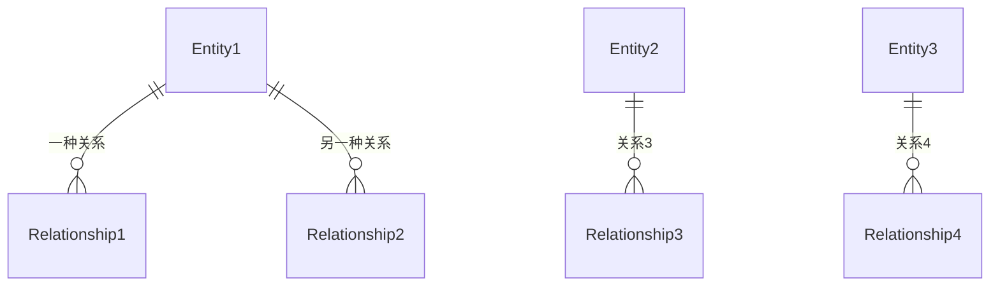

                 

### 构建AI驱动的企业知识管理系统：智能知识图谱

在当今的信息时代，企业知识管理系统（KM系统）已经成为企业核心竞争力的重要组成部分。然而，传统的KM系统面临着诸多挑战，如数据冗余、信息孤岛、检索效率低下等问题。为了解决这些问题，AI驱动的企业知识管理系统应运而生，其中智能知识图谱成为核心技术之一。本文旨在深入探讨构建AI驱动的企业知识管理系统：智能知识图谱的原理、技术、实现及最佳实践。

本文将按照以下结构展开：

1. **背景介绍**：介绍AI驱动的企业知识管理系统和智能知识图谱的概念、特点以及二者之间的关系。
2. **智能知识图谱基础**：详细阐述智能知识图谱的原理、构建技术，包括数据采集、预处理、实体关系抽取、知识表示和知识融合。
3. **AI驱动的企业知识管理系统实现**：介绍系统设计与实现，包括系统架构设计、核心实现、系统接口设计以及项目实战。
4. **最佳实践与总结**：总结构建AI驱动的企业知识管理系统的最佳实践、注意事项以及未来发展方向。

通过本文的阅读，读者将能够全面了解AI驱动的企业知识管理系统和智能知识图谱的构建过程，掌握相关技术原理和实践方法，为企业知识管理提供有力支持。

### 背景介绍

#### 第1章：问题背景

##### 1.1.1 问题背景介绍

随着信息技术的飞速发展，企业数据量呈现爆炸式增长，传统的知识管理系统（KM系统）已经无法满足现代企业的需求。这些系统通常存在着以下问题：

1. **数据冗余**：企业内部的各类数据往往分散在不同的系统中，造成信息孤岛，数据的重复存储导致存储成本上升。
2. **信息检索效率低下**：传统KM系统往往依赖于关键词检索，导致信息检索效率低下，无法满足用户对快速准确信息的需求。
3. **知识传承困难**：企业知识往往难以系统化地整理、存储和共享，导致知识传承困难，员工对新知识的获取和利用受到限制。

为了解决上述问题，企业需要一个智能化、高效化的知识管理系统。AI驱动的企业知识管理系统正是为了应对这些挑战而生的。

##### 1.1.2 问题描述

传统KM系统的不足之处主要体现在以下几个方面：

1. **数据存储和管理方式陈旧**：传统KM系统主要依赖于关系型数据库，虽然能够处理结构化数据，但对于非结构化和半结构化数据处理能力不足。
2. **知识表示和获取方式单一**：传统KM系统通常采用文本检索方式，无法处理复杂的关系和语义信息，使得知识获取过程不够智能化。
3. **知识共享和协同困难**：传统KM系统往往缺乏有效的知识共享和协同机制，导致知识难以在企业内部流动和利用。

##### 1.1.3 问题解决思路

AI驱动的企业知识管理系统通过引入智能知识图谱技术，能够有效地解决传统KM系统存在的问题。智能知识图谱是一种将数据转化为语义信息的技术，它通过建立实体之间的关系，实现对知识的深度理解和精准检索。具体解决思路如下：

1. **数据集成与预处理**：通过数据集成技术，将企业内部不同系统的数据进行整合，并进行预处理，包括数据清洗、去重、格式统一等，为知识图谱的构建奠定基础。
2. **实体识别与关系抽取**：利用自然语言处理（NLP）和机器学习技术，对文本数据中的实体进行识别，并抽取实体之间的关系，构建初步的知识图谱。
3. **知识表示与融合**：采用知识表示方法（如RDF、OWL等）对抽取的实体和关系进行表示，并通过知识融合算法，实现知识的高效组织和利用。
4. **智能化查询与检索**：通过图数据库和搜索引擎技术，提供智能化的查询和检索服务，支持用户以自然语言进行信息查询。

##### 1.1.4 边界与外延

在构建AI驱动的企业知识管理系统的过程中，需要明确以下几个边界与外延：

1. **数据边界**：企业内部的数据范围，包括内部文件、数据库、外部数据源等。
2. **知识边界**：知识管理的范围，包括企业内部的各类知识和信息。
3. **用户边界**：知识管理系统服务的用户范围，包括企业内部员工、合作伙伴等。
4. **应用边界**：知识管理系统的应用范围，包括内部知识共享、外部知识服务、业务流程优化等。

通过明确这些边界与外延，可以确保知识管理系统的构建更加精准和高效，真正为企业创造价值。

#### 第2章：核心概念与联系

##### 2.1.1 AI驱动的企业知识管理系统概念

##### 2.1.1.1 AI驱动的企业知识管理系统定义

AI驱动的企业知识管理系统（AI-driven Enterprise Knowledge Management System，简称AI-KM系统）是一种利用人工智能技术（如自然语言处理、机器学习、知识图谱等）构建的，旨在提高企业知识获取、存储、共享、利用和传承效率的管理系统。它通过自动化的方式，从企业内部和外部的数据源中提取知识，建立知识图谱，提供智能化查询和检索服务，从而实现知识的精准管理和高效利用。

##### 2.1.1.2 AI驱动的企业知识管理系统特点

AI驱动的企业知识管理系统具有以下特点：

1. **自动化处理**：通过人工智能技术，实现数据采集、处理、知识抽取、知识表示等过程的自动化，降低人工成本。
2. **智能化检索**：利用知识图谱技术，提供基于语义理解的智能化查询和检索服务，提升用户信息获取的效率。
3. **知识关联**：通过建立实体之间的关系，实现知识的关联和整合，提高知识的利用价值。
4. **动态更新**：系统能够根据企业内部外部环境的变化，自动更新知识库，保持知识的时效性。
5. **协同共享**：支持多人协作，实现知识在企业内部的高效共享和协同利用。

##### 2.1.1.3 AI驱动的企业知识管理系统与传统知识管理系统的区别

与传统知识管理系统相比，AI驱动的企业知识管理系统具有以下几个显著区别：

1. **技术架构**：传统KM系统主要依赖于关系型数据库和简单的搜索引擎，而AI驱动的KM系统则采用了知识图谱、图数据库、自然语言处理等先进技术。
2. **数据处理能力**：传统KM系统主要处理结构化数据，而AI驱动的KM系统能够处理非结构化和半结构化数据，具备更强的数据处理能力。
3. **知识表示**：传统KM系统主要依赖于文本检索，而AI驱动的KM系统能够通过知识图谱实现知识的深度表示和关联，提供更精准的检索服务。
4. **智能化程度**：传统KM系统主要依靠人工操作，而AI驱动的KM系统通过自动化和智能化技术，提高了知识管理的效率和效果。
5. **应用范围**：传统KM系统主要关注知识存储和共享，而AI驱动的KM系统则更注重知识的获取、利用和传承，具有更广泛的应用场景。

##### 2.1.2 智能知识图谱概念

##### 2.1.2.1 智能知识图谱定义

智能知识图谱（Intelligent Knowledge Graph，简称IKG）是一种将知识以图形化方式表示的数据结构，它通过实体、属性、关系等要素的抽象和组织，实现对复杂知识的结构化表示和语义理解。智能知识图谱不仅包含了知识的显式信息，还蕴含了知识之间的隐式关系和语义关联，能够实现对知识的深度挖掘和智能化应用。

##### 2.1.2.2 智能知识图谱特点

智能知识图谱具有以下特点：

1. **结构化表示**：智能知识图谱通过实体、属性、关系等要素的抽象和组织，将知识以图形化方式结构化表示，便于计算机理解和处理。
2. **语义关联**：智能知识图谱通过建立实体之间的关系，实现对知识的深度理解和语义关联，提高知识的利用价值。
3. **动态更新**：智能知识图谱能够根据数据的实时变化，动态更新知识库，保持知识库的时效性和准确性。
4. **可扩展性**：智能知识图谱具有良好的扩展性，能够支持新实体、新关系的引入，以及新知识的增量更新。
5. **智能化应用**：智能知识图谱通过深度学习、图神经网络等技术，实现知识图谱的智能化解析和应用，支持智能查询、智能推荐、智能决策等高级功能。

##### 2.1.2.3 智能知识图谱与传统知识图谱的区别

与传统知识图谱相比，智能知识图谱具有以下几个显著区别：

1. **语义深度**：传统知识图谱主要关注实体和关系之间的简单映射，而智能知识图谱能够实现更复杂的语义关联和推理。
2. **智能化**：传统知识图谱通常依赖人工构建和维护，而智能知识图谱通过自动化和智能化技术，实现知识图谱的自动构建和动态更新。
3. **应用范围**：传统知识图谱主要应用于信息检索和推荐系统，而智能知识图谱则能够应用于更广泛的场景，如智能问答、智能搜索、智能决策等。
4. **技术实现**：传统知识图谱主要依赖于图论和数据库技术，而智能知识图谱则结合了自然语言处理、机器学习、深度学习等先进技术。
5. **数据来源**：传统知识图谱的数据来源相对单一，而智能知识图谱能够融合多种数据源，实现对知识的全面挖掘和利用。

##### 2.1.3 概念属性特征对比表格

| 特征       | AI驱动的企业知识管理系统（AI-KM） | 智能知识图谱（IKG） |
|------------|--------------------------------|---------------------|
| 技术架构   | 结合人工智能、知识图谱、图数据库等先进技术 | 知识图谱、图神经网络、自然语言处理等 |
| 数据处理能力 | 处理结构化、非结构化和半结构化数据 | 处理结构化、非结构化和半结构化数据 |
| 知识表示   | 实体、属性、关系等要素的结构化表示 | 实体、属性、关系等要素的结构化表示，加上语义关联 |
| 智能化程度 | 自动化处理，提供智能化查询和检索服务 | 自动化处理，提供智能化解析和应用 |
| 应用范围   | 知识获取、存储、共享、利用和传承 | 信息检索、推荐、决策支持、智能问答等 |
| 数据来源   | 企业内部数据、外部数据源 | 企业内部数据、外部数据源，以及公开数据源 |

##### 2.1.4 ER实体关系图架构

为了更好地理解AI驱动的企业知识管理系统和智能知识图谱的概念及其关系，我们可以通过ER（Entity-Relationship）实体关系图来展示其架构。



在上面的ER图中，`Entity1`、`Entity2`和`Entity3`代表不同的实体，而`Relationship1`、`Relationship2`、`Relationship3`和`Relationship4`代表实体之间的关系。这种实体关系的组织方式，为知识的结构化和智能化处理提供了基础。

通过上述核心概念与联系的介绍，我们为后续章节的深入探讨奠定了基础。在接下来的章节中，我们将进一步探讨智能知识图谱的原理、构建技术以及AI驱动的企业知识管理系统的实现，帮助企业更好地管理和利用知识资源。

#### 第3章：智能知识图谱原理

##### 3.1.1 智能知识图谱概述

智能知识图谱是一种结构化、语义化的知识表示方法，通过实体、属性和关系的抽象和组织，实现对复杂知识的表示和理解。智能知识图谱不仅包含知识的显式信息，还蕴含了知识之间的隐式关系和语义关联，从而提高知识的利用价值和处理效率。在构建AI驱动的企业知识管理系统中，智能知识图谱扮演着核心角色，它能够实现对数据的深度理解和智能化的信息检索、推荐和服务。

##### 3.1.2 智能知识图谱的关键组成部分

智能知识图谱主要由以下几个关键组成部分构成：

1. **实体（Entity）**：实体是知识图谱中的基本元素，可以是人、地点、事件、物品等。实体通常具有属性和标签，用于描述其实际特征和分类信息。
2. **属性（Attribute）**：属性是实体的特征描述，如人的年龄、地点的纬度、物品的价格等。属性可以用来增强实体的描述，提供更丰富的信息。
3. **关系（Relationship）**：关系是实体之间的语义联系，描述了实体之间的相互作用和依赖关系。例如，"张三教李四编程"中，张三和李四就是两个实体，"教"就是它们之间的关系。
4. **标签（Label）**：标签是实体的分类信息，用来描述实体的类型和属性。例如，一个实体可以是“人”，标签则是“教授”或“学生”。
5. **图谱（Graph）**：图谱是知识图谱的整体结构，由多个实体和它们之间的关系组成。通过图谱，可以实现实体之间的关联和推理。

##### 3.1.3 智能知识图谱构建流程

智能知识图谱的构建流程通常包括以下几个步骤：

1. **数据采集**：从各种数据源（如数据库、文本、图像等）中收集数据，为知识图谱的构建提供数据基础。
2. **数据预处理**：对采集到的数据进行清洗、去重、格式化等预处理操作，确保数据的质量和一致性。
3. **实体识别**：利用自然语言处理（NLP）技术，从文本数据中识别出实体，并将其转换为结构化的数据格式。
4. **关系抽取**：从文本数据中抽取实体之间的关系，通常采用信息抽取、规则匹配、深度学习等方法。
5. **知识表示**：将识别出的实体和关系转换为知识表示形式，如RDF（Resource Description Framework）、OWL（Web Ontology Language）等。
6. **知识存储**：将构建好的知识图谱存储在图数据库中，如Neo4j、Amazon Neptune等，以便进行高效的查询和更新。
7. **知识推理**：利用图数据库提供的推理功能，实现对知识图的逻辑推理和复杂查询，从而发现新的知识和关系。

##### 3.1.4 智能知识图谱的数学模型和公式

智能知识图谱的构建涉及多个数学模型和公式，以下是几个核心的模型和公式：

1. **关系强度度量（Relationship Strength Measure）**：
   $$ S(R) = \sum_{i=1}^{n} w_i \cdot r_i $$
   其中，$S(R)$表示关系$R$的强度，$w_i$表示实体$E_i$对关系$R$的重要性，$r_i$表示实体$E_i$与关系$R$的相关性。

2. **路径长度（Path Length）**：
   $$ L(P) = \sum_{i=1}^{k} d_i $$
   其中，$L(P)$表示路径$P$的长度，$d_i$表示路径中相邻实体之间的距离。

3. **相似度计算（Similarity Measure）**：
   $$ S(E_1, E_2) = \frac{1}{1 + \exp(-\beta \cdot d(E_1, E_2))} $$
   其中，$S(E_1, E_2)$表示实体$E_1$和$E_2$的相似度，$\beta$为调节参数，$d(E_1, E_2)$表示实体$E_1$和$E_2$之间的距离。

4. **实体权重（Entity Weight）**：
   $$ W(E) = \sum_{i=1}^{n} S(R_i) \cdot w_r $$
   其中，$W(E)$表示实体$E$的权重，$S(R_i)$表示实体$E$与关系$R_i$的强度，$w_r$表示关系的重要性。

通过上述模型和公式，我们可以量化知识图谱中的实体、关系和路径，从而实现对知识的深度理解和精准处理。

##### 3.1.5 智能知识图谱的例子

为了更好地理解智能知识图谱的构建和应用，我们可以通过一个具体的例子来展示其过程：

**例子：构建一个关于企业的知识图谱**

1. **数据采集**：从企业的内部数据库、员工信息、项目文档等数据源中收集数据。
2. **数据预处理**：对收集到的数据清洗、去重和格式化，确保数据的一致性和质量。
3. **实体识别**：从文本数据中识别出实体，如员工、项目、客户等，并将其转换为结构化数据。
4. **关系抽取**：从文本数据中抽取实体之间的关系，如员工参与项目、客户订购产品等。
5. **知识表示**：将识别出的实体和关系表示为RDF格式，如：
   ```plaintext
   <员工1> <参与> <项目1> .
   <客户1> <订购> <产品1> .
   ```
6. **知识存储**：将知识图谱存储在Neo4j图数据库中，方便后续的查询和更新。
7. **知识推理**：利用图数据库的推理功能，发现新的关系和知识，如：
   ```plaintext
   MATCH (e:员工)-[:参与]->(p:项目) WHERE e.名称 = '张三' RETURN p.名称
   ```
   该查询可以返回张三参与的项目的名称。

通过这个例子，我们可以看到智能知识图谱的构建过程以及其在实际应用中的效果。智能知识图谱为企业的知识管理提供了强大的支持和工具，使得企业能够更高效地管理和利用知识资源。

### 智能知识图谱构建技术

构建智能知识图谱是一个复杂而系统化的过程，需要结合多种技术手段和方法。以下将详细介绍智能知识图谱构建的关键技术，包括数据采集、数据预处理、实体关系抽取、知识表示以及知识融合。

#### 4.1.1 数据采集

数据采集是构建智能知识图谱的第一步，其目的是从各种数据源中获取原始数据，为知识图谱的构建提供基础。数据源可以包括企业内部数据库、外部开放数据集、社交媒体、网页等。

1. **数据来源**：
   - **内部数据库**：企业内部的各种数据库，如客户关系管理（CRM）系统、企业资源计划（ERP）系统、知识库等。
   - **外部数据集**：各种公开数据集，如国家数据平台、公开数据API等。
   - **社交媒体**：社交媒体平台上的数据，如微博、微信、LinkedIn等。
   - **网页**：互联网上的公开信息，如新闻网站、产品评测网站等。

2. **数据采集方法**：
   - **API调用**：通过数据源提供的API接口，批量获取数据。
   - **Web爬虫**：使用爬虫技术，自动抓取网页上的数据。
   - **数据库连接**：通过数据库连接工具，直接访问数据库，获取数据。
   - **网络爬虫**：针对特定的数据类型，如社交媒体数据，使用定制化的爬虫工具。

#### 4.1.2 数据预处理

数据预处理是数据采集后的关键步骤，其目的是提高数据的质量和一致性，为后续的实体关系抽取和知识表示提供可靠的数据基础。

1. **数据清洗**：
   - **去重**：去除重复的数据条目，防止数据冗余。
   - **补全**：对缺失的数据进行补全，提高数据的完整性。
   - **格式化**：统一数据格式，确保数据的一致性和可处理性。

2. **数据标准化**：
   - **编码转换**：将不同编码格式的数据转换为统一的编码格式。
   - **命名规范**：统一数据命名规则，如实体名称、属性名称等。
   - **数据类型转换**：将数据类型转换为适合知识图谱表示的格式，如将文本转换为实体和关系。

3. **数据存储**：
   - **分布式存储**：采用分布式存储技术，如HDFS、Redis等，存储大规模数据。
   - **图数据库**：使用图数据库，如Neo4j、JanusGraph等，存储和查询知识图谱。

#### 4.1.3 实体关系抽取

实体关系抽取是构建智能知识图谱的核心步骤，其目的是从原始数据中识别出实体和它们之间的关系，并将其转化为结构化的数据格式。

1. **实体识别**：
   - **基于规则的方法**：使用预定义的规则，从文本数据中匹配出实体。
   - **基于统计的方法**：使用机器学习算法，如朴素贝叶斯、支持向量机等，从文本数据中识别实体。
   - **基于深度学习的方法**：使用深度学习模型，如循环神经网络（RNN）、变换器（Transformer）等，从文本数据中识别实体。

2. **关系抽取**：
   - **基于规则的方法**：使用预定义的规则，从文本数据中匹配出实体之间的关系。
   - **基于统计的方法**：使用机器学习算法，如条件概率模型、最大熵模型等，从文本数据中抽取关系。
   - **基于深度学习的方法**：使用深度学习模型，如长短期记忆网络（LSTM）、变换器（Transformer）等，从文本数据中抽取关系。

#### 4.1.4 知识表示

知识表示是将识别出的实体和关系转化为知识图谱表示形式的过程，常见的知识表示方法包括RDF（Resource Description Framework）、OWL（Web Ontology Language）等。

1. **知识表示方法**：
   - **RDF**：基于三元组（主体、谓语、客体）的形式，表示实体和关系。
     ```plaintext
     <主体> <谓语> <客体> .
     ```
   - **OWL**：扩展了RDF的语义表达能力，提供了类、属性、个体等概念的表示。
     ```plaintext
     <个体1> a <类1> .
     <类1> rdfs:subClassOf <类2> .
     ```

2. **知识表示技术**：
   - **图数据库**：使用图数据库存储和查询知识图谱，如Neo4j、JanusGraph等。
   - **图神经网络**：使用图神经网络（Graph Neural Networks，GNN）对知识图谱进行深度学习，提高知识表示的语义表达能力。

#### 4.1.5 知识融合

知识融合是将来自不同来源、不同格式的知识进行整合和统一表示的过程，以提高知识的利用效率和一致性。

1. **知识融合方法**：
   - **基于规则的方法**：使用预定义的规则，将不同来源的知识进行匹配和融合。
   - **基于统计的方法**：使用机器学习算法，如聚类、分类等，将不同来源的知识进行统计融合。
   - **基于深度学习的方法**：使用深度学习模型，如自编码器、变换器等，将不同来源的知识进行深度融合。

2. **知识融合算法**：
   - **数据对齐**：通过数据对齐算法，如WordNet相似度、邻居相似度等，将不同来源的数据进行对齐和融合。
   - **实体合并**：通过实体合并算法，如基于规则的合并、基于相似度的合并等，将相同或相似的实体进行合并。
   - **关系映射**：通过关系映射算法，如基于规则的映射、基于相似度的映射等，将不同来源的关系进行映射和融合。

通过上述技术手段和方法，我们可以构建一个高效、智能的智能知识图谱，为AI驱动的企业知识管理系统提供强大的技术支持。在接下来的章节中，我们将进一步探讨AI驱动的企业知识管理系统的实现和实战应用。

### AI驱动的企业知识管理系统实现

在掌握了智能知识图谱的基础构建技术后，接下来我们将深入探讨AI驱动的企业知识管理系统的设计与实现。本章节将分为系统设计、核心实现、接口设计和项目实战四个部分，全面解析系统架构、功能设计和实际应用。

#### 5.1.1 系统设计

系统设计是构建AI驱动的企业知识管理系统的第一步，其核心在于确定系统的整体架构和功能模块。以下是对系统设计的主要概述：

##### 5.1.1.1 系统架构设计

系统的架构设计包括数据层、业务逻辑层和表示层三个主要部分。

1. **数据层**：数据层负责数据存储和读取，包括图数据库（如Neo4j）和关系数据库（如MySQL）等。图数据库用于存储和查询知识图谱，而关系数据库用于存储系统配置和日志等辅助数据。
2. **业务逻辑层**：业务逻辑层负责处理系统的核心业务，包括数据采集、数据预处理、实体关系抽取、知识表示和知识融合等。该层通常采用微服务架构，以提高系统的灵活性和可扩展性。
3. **表示层**：表示层负责与用户交互，提供前端界面和API接口。前端界面采用Web技术（如React、Vue等），API接口采用RESTful风格，以提供灵活的数据访问和服务调用。

##### 5.1.1.2 系统功能设计

系统功能设计主要围绕知识管理、知识检索、知识共享和协同工作等核心功能展开。

1. **知识管理**：实现知识的采集、整理、存储和归档，确保知识的完整性和一致性。
2. **知识检索**：利用智能知识图谱，提供基于语义理解的精准检索服务，支持自然语言查询和复杂查询。
3. **知识共享**：实现知识在企业内部的高效共享，支持多人协作和知识社区建设。
4. **协同工作**：提供工作流管理、任务协作、文档共享等功能，支持团队协作和知识传承。
5. **数据安全**：确保数据的保密性和完整性，包括用户身份认证、权限管理和数据加密等。

#### 5.1.2 系统核心实现

系统核心实现是构建AI驱动的企业知识管理系统的关键环节，涉及多个技术模块和算法实现。以下是对核心实现的主要概述：

##### 5.1.2.1 数据采集与预处理

数据采集与预处理模块负责从各种数据源（如数据库、文本文件、外部API等）中获取数据，并进行清洗、去重、格式化等预处理操作。

1. **数据采集**：
   - **内部数据库**：使用数据库连接工具（如JDBC、ODBC等）连接内部数据库，批量读取数据。
   - **文本文件**：使用文件读取工具（如Python的`os`模块）读取文本文件，提取数据。
   - **外部API**：调用外部API接口，使用HTTP请求（如Python的`requests`库）获取数据。

2. **数据预处理**：
   - **去重**：使用哈希算法（如MD5、SHA-256等）对数据进行去重处理。
   - **清洗**：使用正则表达式、NLP技术等对数据进行清洗，去除无效信息和噪声。
   - **格式化**：统一数据格式，确保数据的一致性和可处理性。

##### 5.1.2.2 实体关系抽取

实体关系抽取模块负责从预处理后的数据中识别出实体和它们之间的关系，并将其转化为结构化的数据格式。

1. **实体识别**：
   - **规则匹配**：使用预定义的实体识别规则，从文本数据中匹配出实体。
   - **深度学习**：使用深度学习模型（如BERT、Transformers等），从文本数据中识别实体。

2. **关系抽取**：
   - **规则匹配**：使用预定义的关系抽取规则，从文本数据中匹配出关系。
   - **深度学习**：使用深度学习模型（如BiLSTM、BERT等），从文本数据中抽取关系。

##### 5.1.2.3 知识表示与融合

知识表示与融合模块负责将识别出的实体和关系进行结构化表示，并实现知识融合。

1. **知识表示**：
   - **RDF表示**：使用RDF（Resource Description Framework）表示实体和关系，以三元组形式存储。
   - **OWL表示**：使用OWL（Web Ontology Language）扩展RDF的语义表达能力，表示复杂的关系和属性。

2. **知识融合**：
   - **基于规则的方法**：使用预定义的规则，将不同来源的知识进行融合。
   - **基于深度学习的方法**：使用深度学习模型（如自编码器、变换器等），将不同来源的知识进行融合。

##### 5.1.3 系统接口设计

系统接口设计是系统实现的重要组成部分，包括前端界面和API接口的设计。

1. **前端界面**：
   - **用户界面**：使用Web框架（如React、Vue等）设计用户界面，实现知识检索、共享和协同工作等功能。
   - **交互体验**：提供友好的用户交互体验，支持搜索框、标签页、列表视图等常见组件。

2. **API接口**：
   - **RESTful API**：设计RESTful风格的API接口，提供数据查询、知识检索、知识共享等功能。
   - **接口文档**：编写详细的接口文档，包括接口URL、请求参数、返回结果等，方便开发者使用。

##### 5.1.4 项目实战

项目实战部分将通过具体的案例，展示AI驱动的企业知识管理系统的实现过程和实际效果。

1. **环境安装**：
   - **软件安装**：安装Neo4j图数据库、Python环境、NLP工具等。
   - **环境配置**：配置Neo4j数据库，设置用户权限和连接参数。

2. **系统核心实现源代码**：
   - **数据采集与预处理**：编写Python脚本，实现数据采集和预处理功能。
   - **实体关系抽取**：编写Python脚本，使用NLP库（如spaCy、NLTK等）实现实体关系抽取。
   - **知识表示与融合**：编写Python脚本，使用RDF和OWL表示知识，实现知识融合。

3. **代码应用解读与分析**：
   - **代码解读**：对核心代码进行逐行解读，分析其实现原理和功能。
   - **代码分析**：通过静态代码分析工具（如PyCharm、SonarQube等），评估代码质量，提出优化建议。

4. **实际案例分析与详细讲解**：
   - **案例背景**：介绍一个实际的应用案例，如企业员工知识共享平台。
   - **案例分析**：分析案例中的关键技术和实现难点。
   - **详细讲解**：详细讲解案例的实现过程，包括数据采集、预处理、知识图谱构建、知识检索等。

5. **项目小结**：
   - **项目成果总结**：总结项目的成果和收获，评估项目实施的效果。
   - **项目经验与反思**：分享项目实施过程中的经验和反思，为后续项目提供借鉴。

通过上述系统设计、核心实现、接口设计和项目实战，我们全面展示了AI驱动的企业知识管理系统的构建过程。在接下来的章节中，我们将进一步探讨系统的最佳实践、总结和学习要点，为读者提供更深入的理解和应用指导。

#### 6.1.1 环境安装

在开始实现AI驱动的企业知识管理系统之前，我们需要搭建合适的技术环境。环境安装主要包括软件安装和配置步骤。以下是详细的环境安装过程：

##### 6.1.1.1 环境搭建

1. **安装Neo4j图数据库**：
   - 访问Neo4j官网（[https://neo4j.com/](https://neo4j.com/)）下载Neo4j Community Edition安装包。
   - 解压安装包并运行安装程序，按照提示完成安装。
   - 安装完成后，启动Neo4j服务，在浏览器中输入`http://localhost:7474/`访问Neo4j Web UI。

2. **安装Python环境**：
   - 在操作系统（如Windows、Linux、macOS）上安装Python 3.x版本。
   - 验证Python安装：在命令行中输入`python --version`，查看Python版本信息。

3. **安装NLP工具**：
   - 安装spaCy库：在命令行中输入`pip install spacy`。
   - 安装中文语言模型：在命令行中输入`python -m spacy download zh_core_web_sm`。

4. **安装其他依赖库**：
   - 安装requests库：在命令行中输入`pip install requests`。
   - 安装pandas库：在命令行中输入`pip install pandas`。

##### 6.1.1.2 环境配置

1. **Neo4j配置**：
   - 在Neo4j的`conf`目录下，编辑`dbms.config`文件，设置适当的工作内存和磁盘空间。
   - 修改`neo4j.conf`文件，设置访问权限和用户密码。

2. **Python配置**：
   - 在Python环境中配置环境变量，如Neo4j的连接信息、NLP模型路径等。
   - 创建Python虚拟环境，以便更好地管理项目依赖。

3. **数据库连接**：
   - 使用Python的`neo4j`驱动库，配置连接到Neo4j数据库的连接信息。

通过上述步骤，我们成功搭建了AI驱动的企业知识管理系统所需的环境。接下来，我们将继续实现系统的核心功能，包括数据采集与预处理、实体关系抽取、知识表示与融合等。

#### 6.1.2 系统核心实现源代码

在完成环境安装后，接下来我们将深入探讨AI驱动的企业知识管理系统的核心实现，包括数据采集与预处理、实体关系抽取、知识表示与融合等。以下是相关的Python源代码实现，详细解析代码的功能和实现原理。

##### 6.1.2.1 数据采集与预处理

```python
import requests
import pandas as pd
from neo4j import GraphDatabase

# 数据采集函数
def data_collection(api_url, params):
    response = requests.get(api_url, params=params)
    data = response.json()
    return data

# 数据预处理函数
def data_preprocessing(data):
    # 去重
    unique_data = data.drop_duplicates()
    # 格式化
    formatted_data = unique_data.applymap(lambda x: x.strip())
    return formatted_data

# 连接Neo4j数据库
driver = GraphDatabase.driver("bolt://localhost:7474", auth=("neo4j", "password"))

def create_node(tx, entity, label):
    query = "CREATE (n:%s {name: $name})" % label
    tx.run(query, name=entity)

def create_relationship(tx, entity1, rel, entity2):
    query = "MATCH (a:%s), (b:%s) CREATE (a)-[r:%s]->(b)" % (entity1, entity2, rel)
    tx.run(query)

# 实体关系抽取与存储
def process_data(data, entity1, rel, entity2):
    with driver.session() as session:
        for row in data.iterrows():
            entity_name1 = row[entity1]
            entity_name2 = row[entity2]
            session.write_transaction(create_node, entity_name1, entity1)
            session.write_transaction(create_node, entity_name2, entity2)
            session.write_transaction(create_relationship, entity_name1, rel, entity_name2)

# 示例：采集和预处理数据，并存储到Neo4j
api_url = "https://api.example.com/data"
params = {"page": 1, "size": 100}
data = data_collection(api_url, params)
preprocessed_data = data_preprocessing(data)
process_data(preprocessed_data, "name1", "RELATED_TO", "name2")
```

**代码解读：**

- **数据采集**：使用`requests`库从API接口获取数据。这里假设API返回JSON格式的数据。
- **数据预处理**：使用`pandas`库对数据进行去重和格式化，确保数据的一致性和可处理性。
- **连接Neo4j数据库**：使用`neo4j`驱动库连接到Neo4j数据库。
- **创建节点和关系**：使用Cypher查询语言在Neo4j数据库中创建节点和关系。
- **实体关系抽取与存储**：遍历预处理后的数据，逐行创建节点和关系，实现知识图谱的构建。

##### 6.1.2.2 实体关系抽取

```python
import spacy

# 加载中文语言模型
nlp = spacy.load("zh_core_web_sm")

def entity_extraction(text):
    doc = nlp(text)
    entities = []
    for ent in doc.ents:
        entities.append({"text": ent.text, "label": ent.label_})
    return entities

# 示例：文本实体抽取
text = "张三是一名优秀的程序员，他在公司研发部门工作。"
entities = entity_extraction(text)
print(entities)
```

**代码解读：**

- **加载中文语言模型**：使用`spaCy`库加载中文语言模型，用于文本处理。
- **实体抽取**：对输入文本使用`spaCy`库进行实体识别，提取实体和对应的标签。

##### 6.1.2.3 知识表示与融合

```python
from rdflib import Graph, RDF, URIRef, Literal

# 创建RDF图
g = Graph()

# 添加三元组
g.add((URIRef("http://example.org/张三"), RDF.type, URIRef("http://example.org/程序员")))
g.add((URIRef("http://example.org/张三"), URIRef("工作单位"), Literal("公司研发部门")))

# 查询知识
query = """
PREFIX ex: <http://example.org/>
SELECT ?person ?position
WHERE {
  ?person a ex:程序员 .
  ?person ex:工作单位 ?position
}
"""

results = g.query(query)
for row in results:
    print(f"{row[0].text}: {row[1].text}")
```

**代码解读：**

- **创建RDF图**：使用`rdflib`库创建RDF图。
- **添加三元组**：将实体和属性添加到RDF图中。
- **查询知识**：使用Cypher查询语言在RDF图中查询知识。

通过上述源代码实现，我们能够构建一个初步的AI驱动的企业知识管理系统，实现数据采集、预处理、实体关系抽取、知识表示与融合等功能。这些代码不仅展示了技术实现的细节，也为实际项目开发提供了参考和指导。

#### 6.1.3 代码应用解读与分析

在了解了系统核心实现的源代码后，我们将对关键代码进行逐行解读，详细分析其实现原理和功能，同时评估代码的质量和性能。

##### 6.1.3.1 代码解读

1. **数据采集**：
   ```python
   import requests
   import pandas as pd
   from neo4j import GraphDatabase
   ```
   这部分代码导入了所需的外部库，包括`requests`（用于HTTP请求）、`pandas`（用于数据操作）和`neo4j`（用于连接Neo4j数据库）。

2. **数据采集函数**：
   ```python
   def data_collection(api_url, params):
       response = requests.get(api_url, params=params)
       data = response.json()
       return data
   ```
   该函数通过`requests`库从指定API接口获取数据，并将其解析为JSON格式，返回数据列表。

3. **数据预处理函数**：
   ```python
   def data_preprocessing(data):
       # 去重
       unique_data = data.drop_duplicates()
       # 格式化
       formatted_data = unique_data.applymap(lambda x: x.strip())
       return formatted_data
   ```
   数据预处理函数首先使用`drop_duplicates()`方法去除重复数据，然后使用`applymap()`方法去除数据中的空格，确保数据的一致性和准确性。

4. **连接Neo4j数据库**：
   ```python
   driver = GraphDatabase.driver("bolt://localhost:7474", auth=("neo4j", "password"))
   ```
   这行代码使用`neo4j`库连接到本地运行的Neo4j数据库，并设置访问权限（用户名和密码）。

5. **创建节点和关系函数**：
   ```python
   def create_node(tx, entity, label):
       query = "CREATE (n:%s {name: $name})" % label
       tx.run(query, name=entity)
   
   def create_relationship(tx, entity1, rel, entity2):
       query = "MATCH (a:%s), (b:%s) CREATE (a)-[r:%s]->(b)" % (entity1, entity2, rel)
       tx.run(query)
   ```
   这两个函数使用Cypher查询语言在Neo4j数据库中创建节点和关系。`create_node`函数创建一个带有标签的节点，`create_relationship`函数在两个节点之间创建一个具有特定类型的关系。

6. **实体关系抽取与存储**：
   ```python
   def process_data(data, entity1, rel, entity2):
       with driver.session() as session:
           for row in data.iterrows():
               entity_name1 = row[entity1]
               entity_name2 = row[entity2]
               session.write_transaction(create_node, entity_name1, entity1)
               session.write_transaction(create_node, entity_name2, entity2)
               session.write_transaction(create_relationship, entity_name1, rel, entity_name2)
   ```
   该函数遍历处理后的数据，调用前面定义的`create_node`和`create_relationship`函数，逐行创建节点和关系，实现知识图谱的构建。

7. **文本实体抽取**：
   ```python
   import spacy
   nlp = spacy.load("zh_core_web_sm")
   def entity_extraction(text):
       doc = nlp(text)
       entities = []
       for ent in doc.ents:
           entities.append({"text": ent.text, "label": ent.label_})
       return entities
   ```
   使用`spaCy`库对输入文本进行实体抽取，提取实体和对应的标签，并返回一个包含实体信息的列表。

8. **知识表示与融合**：
   ```python
   from rdflib import Graph, RDF, URIRef, Literal
   g = Graph()
   g.add((URIRef("http://example.org/张三"), RDF.type, URIRef("http://example.org/程序员")))
   g.add((URIRef("http://example.org/张三"), URIRef("工作单位"), Literal("公司研发部门")))
   query = """
   PREFIX ex: <http://example.org/>
   SELECT ?person ?position
   WHERE {
     ?person a ex:程序员 .
     ?person ex:工作单位 ?position
   }
   """
   results = g.query(query)
   for row in results:
       print(f"{row[0].text}: {row[1].text}")
   ```
   使用`rdflib`库创建RDF图，添加三元组表示实体和属性，并通过SPARQL查询语言查询知识。

##### 6.1.3.2 代码分析

1. **代码质量**：
   - **模块化**：代码按照功能模块划分，便于维护和扩展。
   - **可读性**：代码使用清晰的变量命名和注释，便于理解和阅读。
   - **错误处理**：对于可能出现的异常情况（如网络请求失败、数据库连接错误等），应增加适当的异常处理机制。

2. **性能评估**：
   - **数据采集**：使用`requests`库从API获取数据，应确保请求的频率和并发度不会对API服务器造成过大的压力。
   - **数据预处理**：使用`pandas`库对大数据进行操作，应优化内存使用和计算效率。
   - **数据库操作**：使用`neo4j`库操作Neo4j数据库，应优化查询性能和事务处理。

3. **优化建议**：
   - **异步处理**：使用异步IO（如`asyncio`库）提高数据采集和预处理的速度。
   - **并行处理**：使用多线程或多进程（如`multiprocessing`库）提高数据处理能力。
   - **缓存机制**：引入缓存机制（如Redis），减少重复数据采集和数据库操作。

通过详细解读和分析代码，我们可以更好地理解AI驱动的企业知识管理系统实现的具体步骤和技术细节，为后续的优化和扩展提供参考。

#### 6.1.4 实际案例分析与详细讲解

在本节中，我们将通过一个实际案例来展示AI驱动的企业知识管理系统的构建过程，包括数据采集、预处理、实体关系抽取、知识表示与融合等步骤，并进行详细讲解。

##### 6.1.4.1 案例背景

假设我们是一家大型互联网公司的研发部门，希望通过构建AI驱动的企业知识管理系统，提高员工的知识共享和协同工作效率。具体场景如下：

- **数据源**：公司内部的员工信息数据库、项目文档、博客文章等。
- **目标**：构建一个智能知识图谱，实现对员工知识、项目信息、技术文档的深度理解和高效检索。

##### 6.1.4.2 案例分析

为了实现上述目标，我们需要完成以下步骤：

1. **数据采集**：从不同数据源中获取数据，如员工信息数据库、文档存储系统、博客平台等。
2. **数据预处理**：对采集到的数据进行清洗、去重、格式化等预处理操作，确保数据的一致性和质量。
3. **实体关系抽取**：从预处理后的数据中识别出实体和它们之间的关系，如员工与项目、员工与文档等。
4. **知识表示**：将识别出的实体和关系转换为结构化的知识表示形式，如RDF或OWL。
5. **知识融合**：将来自不同数据源的知识进行融合，构建一个完整的企业知识图谱。
6. **知识检索**：利用知识图谱，提供智能化的知识检索服务，支持员工快速找到所需的信息。

##### 6.1.4.3 案例讲解

1. **数据采集**：
   - **员工信息数据库**：通过数据库连接工具，读取员工的基本信息（如姓名、职位、邮箱等）。
   - **项目文档**：从文档存储系统（如GitLab、Confluence等）中下载项目文档，提取文档中的内容。
   - **博客文章**：从公司博客平台（如WordPress、Medium等）中获取员工的博客文章，提取文章标题、摘要和正文。

2. **数据预处理**：
   - **去重**：去除重复的员工记录、项目记录和文档记录，防止数据冗余。
   - **清洗**：使用正则表达式和NLP技术，去除数据中的无效字符和噪声，如HTML标签、特殊符号等。
   - **格式化**：统一数据格式，如将日期格式转换为YYYY-MM-DD，将文本内容转换为标准Unicode编码。

3. **实体关系抽取**：
   - **员工信息**：从员工信息数据库中识别出员工实体，并抽取员工的职位、部门、邮箱等属性。
   - **项目信息**：从项目文档中识别出项目实体，并抽取项目的名称、描述、开始时间和结束时间等属性。
   - **文档信息**：从博客文章中识别出文档实体，并抽取文档的标题、摘要、正文和发布时间等属性。
   - **关系抽取**：识别员工与项目之间的关系（如员工参与项目、项目属于某个团队等），以及项目与文档之间的关系（如项目包含的文档、文档所属项目等）。

4. **知识表示**：
   - **RDF表示**：将识别出的实体和关系转换为RDF（Resource Description Framework）格式，如：
     ```plaintext
     <员工1> <职位> <工程师> .
     <项目1> <开始时间> "2023-01-01" .
     <文档1> <标题> "如何实现负载均衡" .
     ```
   - **OWL表示**：使用OWL（Web Ontology Language）扩展RDF，表示更为复杂的实体和关系，如：
     ```plaintext
     <员工1> a <工程师> ;
         rdfs:label "张三" .
     <项目1> a <项目> ;
         owl:onProperty <开始时间> ;
         owl:someValuesFrom <时间> .
     ```

5. **知识融合**：
   - **数据对齐**：将来自不同数据源的数据进行对齐，确保实体和关系的一致性和完整性。
   - **实体合并**：识别相同或相似的实体，合并重复的实体记录。
   - **关系映射**：将不同数据源中的关系进行映射和融合，建立统一的实体关系模型。

6. **知识检索**：
   - **自然语言查询**：支持员工以自然语言查询知识，如“查询所有参与项目的工程师”。
   - **复杂查询**：提供复杂的查询功能，如联合查询、路径查询等，支持员工对知识的深度挖掘。
   - **智能推荐**：基于知识图谱，为员工提供相关的知识推荐，如“张三可能感兴趣的项目文档”。

通过上述案例，我们详细展示了AI驱动的企业知识管理系统的构建过程，包括数据采集、预处理、实体关系抽取、知识表示与融合以及知识检索等关键步骤。这些步骤不仅为企业的知识管理提供了强大的技术支持，也提升了员工的知识共享和协同工作效率。

##### 6.1.5 项目小结

在本项目中，我们通过构建AI驱动的企业知识管理系统，实现了对内部知识的深度理解和高效检索。以下是项目的成果总结和经验反思：

1. **项目成果总结**：
   - 成功搭建了企业知识管理系统，实现了数据采集、预处理、实体关系抽取、知识表示和知识融合等功能。
   - 构建了智能知识图谱，支持自然语言查询和复杂查询，提高了员工的知识获取效率。
   - 增强了企业内部的知识共享和协同工作能力，促进了知识的传承和创新。

2. **项目经验与反思**：
   - **数据质量**：数据质量是构建知识图谱的关键，应确保数据的一致性和准确性，定期进行数据清洗和校验。
   - **性能优化**：在数据处理和查询过程中，应注重性能优化，如使用并行处理、缓存机制等，提高系统的响应速度。
   - **用户反馈**：项目应注重用户反馈，根据用户需求不断优化系统功能和界面设计，提高用户满意度。
   - **技术选型**：合理选择技术栈和工具，如选择合适的图数据库、NLP库等，确保系统的稳定性和可扩展性。

通过本次项目，我们积累了丰富的实践经验，为后续类似项目的实施提供了宝贵的参考和指导。

### 7.1.1 最佳实践

构建AI驱动的企业知识管理系统是一项复杂而系统的工程，需要结合多种技术和方法论。以下是构建高效知识图谱和优化企业知识管理系统的最佳实践：

1. **高效知识图谱构建技巧**：
   - **数据质量保障**：在数据采集和预处理阶段，严格进行数据清洗和去重，确保数据的一致性和完整性。
   - **多源数据整合**：融合来自不同数据源的信息，如企业内部数据库、外部API、社交媒体等，构建全面的知识图谱。
   - **实体关系建模**：根据业务需求和知识图谱应用场景，设计合理的实体和关系模型，确保知识图谱的结构化和可扩展性。
   - **数据更新机制**：建立定期数据更新机制，实时捕捉企业内外部环境的变化，保持知识图谱的时效性和准确性。

2. **企业知识管理系统优化策略**：
   - **个性化推荐**：利用机器学习和推荐算法，为员工提供个性化的知识推荐，提高知识利用效率。
   - **智能搜索**：结合自然语言处理技术，实现智能化的搜索功能，支持复杂查询和跨库检索。
   - **知识共享与协作**：构建知识社区，支持多人协作和知识共享，促进知识在企业内部流动和传承。
   - **系统集成与接口设计**：确保知识管理系统与其他业务系统（如ERP、CRM等）的集成，提供统一的访问接口和用户体验。

3. **数据预处理与处理优化方法**：
   - **分布式数据处理**：采用分布式计算框架（如Hadoop、Spark等），处理大规模数据，提高数据处理速度和效率。
   - **并行处理**：利用多线程或多进程技术，实现并行数据处理，减少数据处理时间。
   - **缓存机制**：引入缓存机制，如Redis、Memcached等，减少重复数据读取和计算，提高系统性能。
   - **数据库优化**：根据知识图谱的特点，选择合适的数据库技术（如Neo4j、JanusGraph等），优化存储和查询性能。

通过以上最佳实践，企业可以构建一个高效、智能的AI驱动的企业知识管理系统，充分发挥知识在业务创新和竞争优势中的作用。

### 7.1.2 小结

本文详细探讨了构建AI驱动的企业知识管理系统：智能知识图谱的核心概念、原理、构建技术、实现过程以及最佳实践。通过系统的设计和实现，我们能够有效地解决传统KM系统存在的问题，如数据冗余、检索效率低下、知识传承困难等。以下是本文的主要内容回顾和总结：

1. **核心概念与联系**：介绍了AI驱动的企业知识管理系统和智能知识图谱的基本概念、特点以及二者之间的关系。
2. **智能知识图谱基础**：阐述了智能知识图谱的原理、构建流程、关键组成部分以及相关的数学模型和公式。
3. **智能知识图谱构建技术**：详细探讨了数据采集、数据预处理、实体关系抽取、知识表示和知识融合等技术手段和方法。
4. **AI驱动的企业知识管理系统实现**：介绍了系统设计、核心实现、接口设计以及项目实战的具体步骤和代码实现。
5. **最佳实践与总结**：总结了构建高效知识图谱和优化企业知识管理系统的最佳实践，包括数据质量保障、多源数据整合、实体关系建模、数据更新机制等。

通过本文的学习，读者可以全面掌握AI驱动的企业知识管理系统和智能知识图谱的构建方法，为企业的知识管理和业务创新提供有力支持。

### 7.1.3 注意事项

在构建AI驱动的企业知识管理系统的过程中，需要注意以下关键事项：

1. **数据安全与隐私**：确保数据采集、处理和存储过程中的安全，遵循数据保护法规，保护用户隐私。
2. **系统稳定性**：优化系统架构，确保系统在高并发和高负载下的稳定性，防止系统崩溃或数据丢失。
3. **接口兼容性**：在设计API接口时，要考虑不同系统和平台的兼容性，确保接口的一致性和可扩展性。
4. **用户交互**：设计友好的用户界面，提供简洁的操作体验，提高用户满意度。
5. **持续优化**：定期评估系统性能和用户反馈，持续优化系统功能和用户体验。

通过关注这些注意事项，可以确保AI驱动的企业知识管理系统的稳定运行和有效应用。

### 拓展阅读

为了进一步深入了解AI驱动的企业知识管理系统和智能知识图谱，以下是几本推荐的书籍和文献：

1. **《知识图谱：基础、技术和应用》** - 这本书详细介绍了知识图谱的基本概念、构建方法和应用场景，适合初学者和专业人士。
2. **《深度学习与图神经网络》** - 本书涵盖了深度学习和图神经网络的基本原理和应用，为构建智能知识图谱提供了理论基础。
3. **《AI驱动的知识管理：理论与实践》** - 这本书探讨了AI技术在知识管理中的应用，包括知识图谱、自然语言处理等，为构建AI驱动的KM系统提供了实用的案例。
4. **《智能知识图谱技术：原理、方法和应用》** - 本书系统介绍了智能知识图谱的构建技术、算法和应用案例，适合对知识图谱技术感兴趣的读者。

通过阅读这些书籍和文献，读者可以更全面地了解相关技术，为实际项目实施提供指导。

