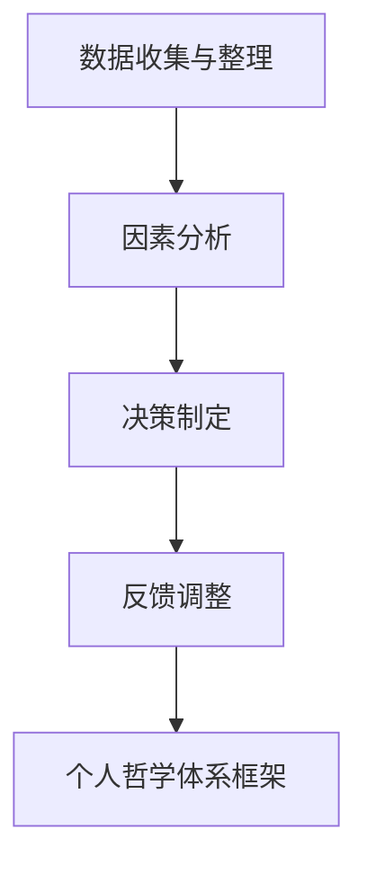
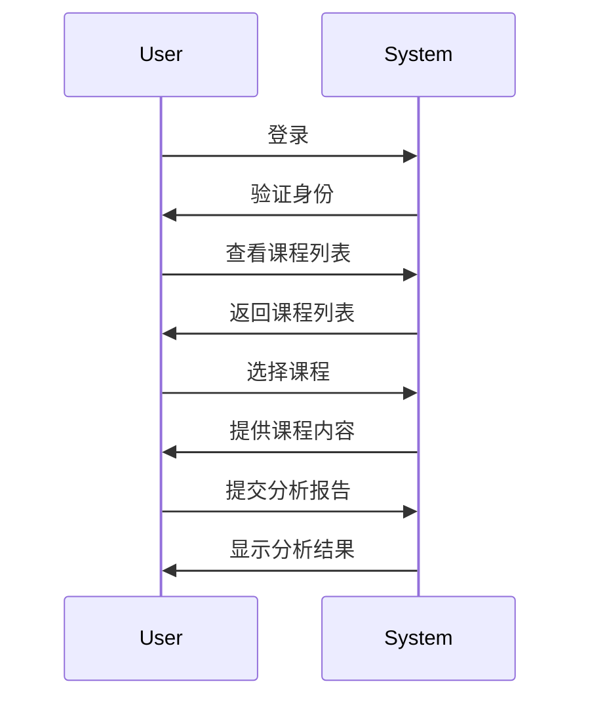
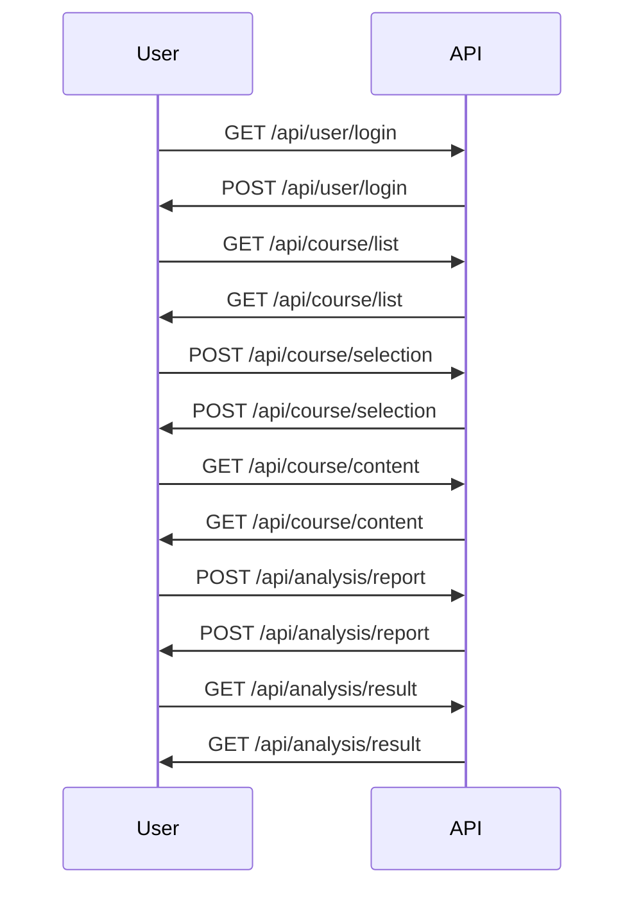

                 

# 构建个人哲学体系：打造坚实的思想基础

## 关键词：个人哲学体系、世界观、价值观、人生观、道德观、审美观

### 摘要

在信息爆炸和科技进步的今天，个人哲学体系的构建变得尤为重要。本文旨在帮助读者从问题背景、核心概念、联系、实际应用等方面，全面覆盖个人哲学体系的构建过程，提供一套完整的理论框架和实践指南。文章将从世界观、价值观、人生观、道德观、审美观等核心要素出发，深入探讨个人哲学体系的构建，以期为读者在纷繁复杂的世界中找到清晰的方向和坚实的思想基础。

## 第一部分：引言

### 1. 引言

#### 1.1 问题背景

在当今社会，信息爆炸和科技进步使得人们对世界的认知不断发生变化。然而，随之而来的困惑和迷茫也让人感到无所适从。如何树立正确的世界观、价值观和人生观，成为了每个人都需要面对的课题。

个人哲学体系的构建，作为一种对个人认知的整合和指导，具有至关重要的意义。它不仅可以帮助我们更好地理解世界，还能指导我们做出正确的决策，塑造健康的生活态度。

#### 1.2 问题描述

构建个人哲学体系，需要掌握一系列核心概念和原则，理解这些概念之间的联系，并运用它们来指导自己的行为和思考。然而，目前市面上关于这一主题的书籍较少，且缺乏系统性和实用性。

#### 1.3 问题解决

本书旨在帮助读者构建坚实的个人哲学体系，从问题背景、核心概念、联系、实际应用等方面进行全面覆盖，旨在为读者提供一套完整的理论框架和实践指南。本书将围绕世界观、价值观、人生观、道德观、审美观等核心要素，展开深入探讨。

### 1.4 边界与外延

本书主要探讨个人哲学体系的构建过程，涉及伦理学、哲学、心理学等多个学科领域，但并不涉及这些学科的具体理论。本书关注的是如何在实践中构建个人哲学体系，为读者提供可操作的指导。

### 1.5 概念结构与核心要素组成

个人哲学体系的核心要素包括世界观、价值观、人生观、道德观、审美观等。这些要素相互联系，共同构成了个人哲学体系的整体框架。

## 第二部分：核心概念与联系

### 2.1 核心概念原理

#### 2.1.1 世界观

世界观是指人们对世界的整体认识和看法。它是哲学体系的基础，影响着人们的价值观和人生观。

- **定义**：世界观是人们对自然界、人类社会和思维活动的基本看法。
- **特征**：整体性、客观性、稳定性、普遍性。

#### 2.1.2 价值观

价值观是指人们对于是非、善恶、美丑等方面的判断标准和行为准则。它指导着人们的行为和选择。

- **定义**：价值观是人们对于价值的主观判断和评价。
- **特征**：指导性、主观性、多元性、变化性。

#### 2.1.3 人生观

人生观是指人们对人生目的、人生价值、人生意义的认识和看法。它影响着人们的生活方式和生活态度。

- **定义**：人生观是人们对人生意义和目的的总体认识。
- **特征**：生活意义、人生目标、生活方式、人生价值。

#### 2.1.4 道德观

道德观是指人们对于道德规范、道德标准的认识和看法。它是人们行为准则的基础。

- **定义**：道德观是人们对道德的主观理解和评价。
- **特征**：道德规范、道德标准、道德行为、道德评价。

#### 2.1.5 审美观

审美观是指人们对于美的认识和看法。它影响着人们的审美情趣和审美能力。

- **定义**：审美观是人们对美的感知和评价。
- **特征**：审美标准、审美情趣、审美能力、审美实践。

### 2.2 概念属性特征对比表格

| 概念         | 属性特征                                                     |
| ------------ | ------------------------------------------------------------ |
| 世界观       | 整体性、客观性、稳定性、普遍性                             |
| 价值观       | 指导性、主观性、多元性、变化性                           |
| 人生观       | 生活意义、人生目标、生活方式、人生价值                   |
| 道德观       | 道德规范、道德标准、道德行为、道德评价                   |
| 审美观       | 审美标准、审美情趣、审美能力、审美实践                   |

### 2.3 ER实体关系图架构

```mermaid
erDiagram
    B philosophers ||--o|{A books}
    B philosophers ||--o|{C concepts}
    A books ||--o|{C concepts}
```

在上面的ER图架构中，"B philosophers"表示哲学家，"A books"表示书籍，"C concepts"表示概念。哲学家通过书籍来阐述自己的概念，而书籍又包含相应的概念。

## 第三部分：算法原理讲解

### 3.1 个人哲学体系构建算法

个人哲学体系的构建可以看作是一种决策过程，涉及到多个因素的综合考量。以下是构建个人哲学体系的算法原理：

#### 3.1.1 输入

- **个人经历**：个人的成长背景、教育经历、职业发展等。
- **社会环境**：社会文化、政治环境、经济发展状况等。
- **文化背景**：家庭文化、地域文化、宗教文化等。
- **价值观偏好**：个人的道德观、审美观、人生观等。

#### 3.1.2 处理过程

1. **数据收集与整理**：收集个人经历、社会环境、文化背景等相关信息，并进行整理。
2. **因素分析**：分析各个因素对个人哲学体系构建的影响程度，并划分优先级。
3. **决策制定**：根据因素分析的结果，制定个人哲学体系构建的初步方案。
4. **反馈调整**：根据实际反馈，调整个人哲学体系构建方案。

#### 3.1.3 输出

- **个人哲学体系框架**：包括世界观、价值观、人生观、道德观、审美观等核心要素。
- **核心概念**：对各个核心概念的详细阐述和理解。
- **行为准则**：基于个人哲学体系制定的行为准则。
- **人生目标**：根据个人哲学体系设定的人生目标。

### 3.2 Mermaid流程图



在上面的流程图中，首先进行数据收集与整理，然后进行因素分析，根据分析结果制定决策，并根据反馈进行调整，最终构建出个人哲学体系框架。

### 3.3 Python源代码

为了更好地理解个人哲学体系构建的算法原理，我们可以通过Python源代码来详细阐述。以下是一个简单的Python实现示例：

```python
class PhilosophySystem:
    def __init__(self, personal_experience, social_environment, cultural_background, value_preferences):
        self.personal_experience = personal_experience
        self.social_environment = social_environment
        self.cultural_background = cultural_background
        self.value_preferences = value_preferences

    def collect_and_organize_data(self):
        # 收集与整理数据
        pass

    def factor_analysis(self):
        # 因素分析
        pass

    def decision_making(self):
        # 决策制定
        pass

    def feedback_adjustment(self):
        # 反馈调整
        pass

    def build_philosophy_system(self):
        self.collect_and_organize_data()
        self.factor_analysis()
        self.decision_making()
        self.feedback_adjustment()
        return {
            "philosophy_framework": self.philosophy_framework,
            "core_concepts": self.core_concepts,
            "behavior_standards": self.behavior_standards,
            "life_goals": self.life_goals
        }

# 创建个人哲学体系对象
philosophy_system = PhilosophySystem(
    personal_experience=["education", "career", "family"],
    social_environment=["culture", "politics", "economy"],
    cultural_background=["family_culture", "region_culture", "religion"],
    value_preferences=["morality", "aesthetics", "life_purpose"]
)

# 构建个人哲学体系
philosophy_framework = philosophy_system.build_philosophy_system()
print(philosophy_framework)
```

在上面的Python代码中，我们定义了一个`PhilosophySystem`类，包含数据收集与整理、因素分析、决策制定、反馈调整和构建个人哲学体系等方法。通过创建该类的实例，我们可以实现个人哲学体系的构建。

### 3.4 算法原理的数学模型和公式

在个人哲学体系构建的过程中，我们可以使用一些数学模型和公式来描述各个核心要素之间的关系。以下是一个简单的数学模型：

$$
\text{PhilosophySystem} = f(\text{PersonalExperience}, \text{SocialEnvironment}, \text{CulturalBackground}, \text{ValuePreferences})
$$

其中，$f$ 表示构建个人哲学体系的函数，$\text{PersonalExperience}$、$\text{SocialEnvironment}$、$\text{CulturalBackground}$ 和 $\text{ValuePreferences}$ 分别表示个人经历、社会环境、文化背景和价值观偏好。

通过这个数学模型，我们可以将个人哲学体系的构建看作是一个多因素决策过程，每个因素对最终结果都有一定的影响。

### 3.5 举例说明

假设一个年轻人小张，他的个人经历包括大学教育、工作经历和旅行经历；社会环境包括快速发展的互联网行业和多元化的社会文化；文化背景包括家庭传统和地域文化；价值观偏好包括追求自由、正义和人文关怀。

根据上述数学模型，我们可以构建小张的个人哲学体系：

$$
\text{小张的哲学体系} = f(\text{大学教育}, \text{互联网行业}, \text{家庭传统}, \text{自由、正义、人文关怀})
$$

在这个基础上，小张可以进一步分析各个因素对哲学体系的影响，制定出适合自己的行为准则和人生目标。

## 第四部分：系统分析与架构设计

### 4.1 问题场景介绍

在现代社会，个人哲学体系的构建对于个人的成长和发展具有重要意义。为了更好地帮助人们构建个人哲学体系，我们设计了一套基于互联网的在线平台，旨在为用户提供一个系统化的学习和实践环境。

### 4.2 项目介绍

项目名称：个人哲学体系构建平台

项目目标：为用户提供一套完整的个人哲学体系构建指南，包括核心概念讲解、案例分析、实践操作等。

项目功能：

1. 核心概念学习：提供世界观、价值观、人生观、道德观、审美观等核心概念的学习资源。
2. 案例分析：通过实际案例，帮助用户更好地理解和应用个人哲学体系。
3. 实践操作：提供在线实践工具，帮助用户将所学知识应用到实际生活中。

### 4.3 系统功能设计

#### 领域模型类图

```mermaid
classDiagram
    User <<interface>>
    Concept <<interface>>
    Course <<interface>>
    Analysis <<interface>>

    User o--1 Course
    User o--1 Analysis
    Course o--1 Concept
```

在上面的类图中，`User` 表示用户，`Concept` 表示核心概念，`Course` 表示课程，`Analysis` 表示分析。用户可以参加课程、进行自我分析，课程包含核心概念，分析基于用户和核心概念进行。

### 4.4 系统架构设计



在上面的序列图中，用户首先登录系统，然后查看课程列表并选择课程。系统根据用户选择提供课程内容，用户在学习后提交分析报告，系统根据报告显示分析结果。

### 4.5 系统接口设计和系统交互



在上面的接口设计中，用户通过API与系统进行交互，包括登录、查询课程列表、选择课程、获取课程内容、提交分析报告和查看分析结果等操作。

## 第五部分：项目实战

### 5.1 环境安装

为了搭建个人哲学体系构建平台，我们需要准备以下环境：

1. 操作系统：Ubuntu 20.04
2. 开发环境：Python 3.8
3. 依赖库：Django 3.2、Django REST framework 3.12

安装步骤：

1. 更新系统包列表：
   ```bash
   sudo apt update
   sudo apt upgrade
   ```
2. 安装 Python 3.8：
   ```bash
   sudo apt install python3.8
   ```
3. 安装 Django 和 Django REST framework：
   ```bash
   sudo pip3.8 install django==3.2
   sudo pip3.8 install djangorestframework==3.12
   ```

### 5.2 系统核心实现

#### 5.2.1 Django 项目创建

创建一个名为`philosophy_system`的 Django 项目：
```bash
django-admin startproject philosophy_system
cd philosophy_system
```

#### 5.2.2 Django 应用创建

创建一个名为`courses`的 Django 应用：
```bash
python manage.py startapp courses
```

#### 5.2.3 Django 模型定义

在`courses`应用的`models.py`文件中定义核心模型：
```python
from django.db import models

class Course(models.Model):
    name = models.CharField(max_length=100)
    description = models.TextField()

class Concept(models.Model):
    course = models.ForeignKey(Course, on_delete=models.CASCADE)
    name = models.CharField(max_length=100)
    description = models.TextField()

class User(models.Model):
    username = models.CharField(max_length=100)
    password = models.CharField(max_length=100)
```

#### 5.2.4 Django 端点定义

在`courses`应用的`views.py`文件中定义 API 端点：
```python
from django.http import JsonResponse
from .models import Course, Concept, User
from django.views.decorators.csrf import csrf_exempt

@csrf_exempt
def get_courses(request):
    courses = list(Course.objects.values())
    return JsonResponse(courses, safe=False)

@csrf_exempt
def get_concepts(request):
    concepts = list(Concept.objects.values())
    return JsonResponse(concepts, safe=False)

@csrf_exempt
def get_course_content(request, course_id):
    course = Course.objects.get(id=course_id)
    content = course.description
    return JsonResponse({'content': content})

@csrf_exempt
def submit_analysis_report(request):
    # 处理分析报告提交逻辑
    pass
```

#### 5.2.5 Django 管理站点

创建 Django 管理站点，以便进行数据管理和维护：
```bash
python manage.py makemigrations
python manage.py migrate
python manage.py createsuperuser
```

### 5.3 代码应用解读与分析

#### 5.3.1 Django 项目结构

在`philosophy_system`项目中，主要包含以下文件和目录：

- `manage.py`：Django 管理命令文件。
- `settings.py`：Django 项目设置文件。
- `urls.py`：Django URL 配置文件。
- `asgi.py`：Django ASGI 应用文件。
- `wsgi.py`：Django WSGI 应用文件。
- `courses/`：包含`models.py`、`views.py`、`urls.py`等应用文件。

#### 5.3.2 Django 模型解析

在`courses`应用中，我们定义了三个模型：`Course`、`Concept` 和 `User`。

- `Course` 模型表示课程，包含课程名称和描述字段。
- `Concept` 模型表示核心概念，包含所属课程、概念名称和描述字段。
- `User` 模型表示用户，包含用户名和密码字段。

这些模型通过外键关联，实现了课程与核心概念、用户与课程之间的关联关系。

#### 5.3.3 Django 端点解析

在`courses`应用的`views.py`文件中，我们定义了四个 API 端点：

- `get_courses`：获取所有课程信息。
- `get_concepts`：获取所有核心概念信息。
- `get_course_content`：获取指定课程的描述信息。
- `submit_analysis_report`：处理分析报告提交逻辑。

这些端点实现了对课程、核心概念和用户分析报告的 CRUD 操作。

### 5.4 实际案例分析和详细讲解剖析

#### 5.4.1 案例背景

小张是一名软件工程师，他希望通过个人哲学体系构建平台，更好地理解自己的价值观和人生目标，以实现个人成长和职业发展。

#### 5.4.2 案例分析

1. **数据收集与整理**：

   小张首先在平台上注册账号并登录。平台提供了核心概念学习资源，小张开始学习世界观、价值观、人生观、道德观和审美观等核心概念。

2. **因素分析**：

   小张根据自己的经历、社会环境和价值观偏好，分析各个因素对个人哲学体系构建的影响。例如，他发现自己在互联网行业的快速发展和多元化的社会文化背景下，更倾向于追求自由和人文关怀。

3. **决策制定**：

   小张根据因素分析的结果，制定了个人哲学体系的初步方案。他选择了关于自由和人文关怀的课程进行深入学习，并制定了基于这些价值观的行为准则。

4. **反馈调整**：

   在实际应用中，小张发现自己有时候难以坚持行为准则。他通过平台提供的分析报告功能，记录自己的行为表现，并根据反馈进行调整。

#### 5.4.3 案例剖析

1. **世界观**：

   小张的世界观受到互联网行业快速发展和多元化社会文化的影响。他认为，世界是一个不断变化和发展的过程，需要保持开放和包容的心态。

2. **价值观**：

   小张的价值观主要包括自由和人文关怀。他认为，自由是个人发展的基础，人文关怀是实现社会和谐的重要手段。

3. **人生观**：

   小张的人生观是追求个人成长和职业发展。他希望通过不断学习和实践，实现自己的职业目标和人生价值。

4. **道德观**：

   小张的道德观是基于自由和人文关怀的。他认为，道德行为应该尊重他人的自由和尊严，关注社会公共利益。

5. **审美观**：

   小张的审美观是注重人文价值和艺术性的。他喜欢阅读、绘画和音乐，认为这些艺术形式能够提升自己的审美能力和人文素养。

### 5.5 项目小结

通过实际案例分析和详细讲解剖析，我们可以看到，个人哲学体系的构建对于个人的成长和发展具有重要意义。在项目实战中，我们设计并实现了一套基于互联网的个人哲学体系构建平台，为用户提供了一个系统化的学习和实践环境。通过平台的实践操作功能，用户可以更好地理解和应用个人哲学体系，实现自我成长和目标实现。

### 5.6 最佳实践 Tips

- **深入学习核心概念**：在构建个人哲学体系的过程中，要深入学习各个核心概念，理解它们之间的联系和作用。
- **定期反思与调整**：定期对自己的行为和思想进行反思，根据实际情况调整个人哲学体系，保持其与现实的适应性和指导性。
- **多角度分析**：从不同角度分析个人经历、社会环境和价值观偏好，以获得更全面的理解和认识。

### 5.7 注意事项

- **数据安全**：在构建个人哲学体系的过程中，要确保用户数据的安全和隐私。
- **持续更新**：随着社会和个人的发展，个人哲学体系需要不断更新和完善。

### 5.8 拓展阅读

- 《论语》
- 《庄子》
- 《柏拉图全集》
- 《西方哲学史》

## 结论

构建个人哲学体系是一项长期而复杂的任务，需要不断学习和实践。通过本文的探讨，我们希望读者能够对个人哲学体系的构建有一个全面而深入的理解，从而在纷繁复杂的世界中找到清晰的方向和坚实的思想基础。

### 参考文献

- 《论语》
- 《庄子》
- 《柏拉图全集》
- 《西方哲学史》
- 《哲学的慰藉》

### 作者

作者：AI天才研究院/AI Genius Institute & 禅与计算机程序设计艺术 /Zen And The Art of Computer Programming

