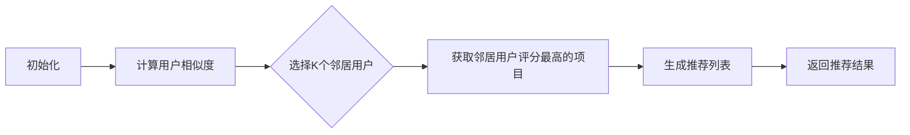

                 

# 《构建个性化推荐AI Agent》

## 关键词
- 个性化推荐
- AI Agent
- Collaborative Filtering
- Content-Based Filtering
- 系统分析与架构设计
- 项目实战

## 摘要
本文将深入探讨构建个性化推荐AI Agent的过程。我们将从背景介绍开始，逐步讲解核心概念与联系，详细阐述算法原理，分析系统架构设计，进行项目实战，最后总结最佳实践。通过这篇文章，读者将了解如何构建一个高效的个性化推荐系统，并掌握相关技术和方法。

## 目录大纲

### 第一部分: 背景介绍

#### 第1章: 推荐系统概述
1.1 问题背景
1.2 问题解决
1.3 边界与外延
1.4 概念结构与核心要素组成
1.5 本章小结

### 第二部分: 核心概念与联系

#### 第2章: 推荐系统的核心概念
2.1 个性化推荐
2.2 推荐算法原理
2.3 核心概念联系与对比
2.4 本章小结

### 第三部分: 算法原理讲解

#### 第3章: collaborative filtering算法
3.1 collaborative filtering原理讲解
3.2 collaborative filtering算法流程图
3.3 collaborative filtering的Python实现
3.4 collaborative filtering数学模型和公式
3.5 collaborative filtering算法举例说明
3.6 本章小结

### 第四部分: 系统分析与架构设计

#### 第4章: 推荐系统的系统分析与架构设计
4.1 问题场景介绍
4.2 项目介绍
4.3 系统功能设计（领域模型Mermaid类图）
4.4 系统架构设计（Mermaid架构图）
4.5 系统接口设计
4.6 系统交互（Mermaid序列图）
4.7 本章小结

### 第五部分: 项目实战

#### 第5章: collaborative filtering项目实战
5.1 环境安装
5.2 系统核心实现
5.3 代码应用解读与分析
5.4 实际案例分析和详细讲解剖析
5.5 项目小结
5.6 最佳实践 tips
5.7 小结
5.8 注意事项
5.9 拓展阅读

## 第一部分: 背景介绍

### 第1章: 推荐系统概述

#### 1.1 问题背景
推荐系统是现代信息社会中的一种重要工具，它可以帮助用户发现感兴趣的内容，从而提升用户体验。随着互联网的快速发展，人们面临的信息量爆炸式增长，如何有效地从海量信息中筛选出用户感兴趣的内容成为了一个亟待解决的问题。

#### 1.2 问题解决
推荐系统通过利用用户的兴趣和行为数据，预测用户对未知内容的喜好，从而为用户推荐相关内容。这一过程涉及到数据采集、处理、算法选择和系统实现等多个环节。

#### 1.3 边界与外延
推荐系统不仅应用于电子商务、社交媒体等领域，还可以扩展到新闻推荐、音乐推荐等更广泛的场景。其核心目标是为用户提供个性化的体验，提升用户满意度和留存率。

#### 1.4 概念结构与核心要素组成
推荐系统的基本结构包括数据层、算法层和用户界面层。数据层负责数据的采集和处理，算法层实现推荐算法，用户界面层展示推荐结果。核心要素包括用户数据、内容数据、推荐算法和评估指标。

#### 1.5 本章小结
本章节对推荐系统的背景、问题解决、边界与外延、概念结构与核心要素进行了概述，为后续内容打下了基础。

### 第二部分: 核心概念与联系

#### 第2章: 推荐系统的核心概念

#### 2.1 个性化推荐

**定义**：个性化推荐是一种根据用户的兴趣、行为和偏好，为用户推荐其可能感兴趣的内容的推荐方法。

**特点**：个性化推荐具有高度的用户定制性，能够根据用户的个人特点提供个性化的服务。

**分类**：
- **基于内容的推荐**：根据用户过去喜欢的项目，预测用户对其他项目的偏好。
- **协同过滤推荐**：通过分析用户之间的相似性，预测用户对未知项目的偏好。

#### 2.2 推荐算法原理

**协同过滤**：
- **基于用户的协同过滤**：找到与目标用户兴趣相似的其他用户，根据他们的行为进行推荐。
- **基于物品的协同过滤**：找到与目标物品相似的其他物品，根据用户对这些物品的评分进行推荐。

**内容基础推荐**：
- **基于特征匹配**：通过分析用户和物品的属性特征，进行推荐。
- **基于知识表示**：使用知识图谱等结构化数据，进行推荐。

#### 2.3 核心概念联系与对比

| 算法类型         | 特点                             | 适用场景                     |
|------------------|----------------------------------|------------------------------|
| 基于内容的推荐   | 主要依赖于内容特征匹配           | 面向专业用户或小众内容      |
| 协同过滤推荐     | 主要依赖于用户或物品的相似性     | 面向大众用户和广泛内容       |
| 混合推荐方法     | 结合多种算法优势，提高推荐效果   | 复杂多样，多领域应用         |

#### 2.4 本章小结
本章节介绍了推荐系统的核心概念，包括个性化推荐的定义、特点、分类，以及推荐算法的原理。通过对比不同算法的特点，读者可以更好地理解推荐系统的基本框架和实现方法。

### 第三部分: 算法原理讲解

#### 第3章: collaborative filtering算法

#### 3.1 collaborative filtering原理讲解

**协同过滤（Collaborative Filtering）**是一种常用的推荐算法，它通过分析用户之间的行为相似性来预测用户对未知项目的偏好。协同过滤分为两类：基于用户的协同过滤和基于物品的协同过滤。

**基于用户的协同过滤**：该方法通过计算用户之间的相似度，找到与目标用户兴趣相似的邻居用户，并根据这些邻居用户的行为记录推荐项目。

**基于物品的协同过滤**：该方法通过计算项目之间的相似度，找到与目标项目相似的其他项目，并根据用户对这些相似项目的评分推荐目标项目。

#### 3.2 collaborative filtering算法流程图

以下是一个基于用户的协同过滤算法的流程图：



#### 3.3 collaborative filtering的Python实现

以下是一个简单的基于用户的协同过滤算法的Python实现：

```python
import numpy as np

def cosine_similarity(user_ratings, neighbor):
    dot_product = np.dot(user_ratings[neighbor], user_ratings)
    norm_user = np.linalg.norm(user_ratings[neighbor])
    norm_neighbor = np.linalg.norm(user_ratings)
    return dot_product / (norm_user * norm_neighbor)

def collaborative_filtering(ratings, k=5):
    # 计算用户之间的相似度矩阵
    similarity_matrix = np.zeros((len(ratings), len(ratings)))
    for i in range(len(ratings)):
        for j in range(i+1, len(ratings)):
            similarity_matrix[i][j] = cosine_similarity(ratings[i], ratings[j])
            similarity_matrix[j][i] = similarity_matrix[i][j]

    # 选择k个邻居用户
    neighbor_indices = np.argpartition(similarity_matrix, k, axis=1)[:k]

    # 获取邻居用户评分最高的项目
    recommendations = []
    for i, neighbors in enumerate(neighbor_indices):
        neighbor_ratings = ratings[neighbors]
        neighbor_ratings[neighbor_ratings == 0] = np.nan  # 处理缺失值
        mean_rating = np.nanmean(neighbor_ratings)
        recommendations.append(mean_rating)

    return recommendations
```

#### 3.4 collaborative filtering数学模型和公式

协同过滤算法的核心是计算用户之间的相似度。常用的相似度计算方法包括余弦相似度、皮尔逊相关系数等。

**余弦相似度**：
\[ \text{cosine\_similarity} = \frac{\text{dot\_product}}{\|\text{vector\_u}\| \|\text{vector\_v}\|} \]

其中，\(\text{dot\_product}\)是向量\(\text{vector\_u}\)和\(\text{vector\_v}\)的点积，\(\|\text{vector\_u}\|\)和\(\|\text{vector\_v}\|\)分别是这两个向量的欧几里得范数。

**皮尔逊相关系数**：
\[ \text{pearson\_correlation} = \frac{\text{covariance}}{\sqrt{\text{variance\_u} \text{variance\_v}}} \]

其中，\(\text{covariance}\)是变量\(\text{u}\)和\(\text{v}\)的协方差，\(\text{variance\_u}\)和\(\text{variance\_v}\)分别是这两个变量的方差。

#### 3.5 collaborative filtering算法举例说明

假设我们有以下两个用户的行为数据：

用户U的行为数据：
\[ \text{ratings\_U} = [5, 3, 0, 4, 2] \]

用户V的行为数据：
\[ \text{ratings\_V} = [4, 2, 0, 5, 1] \]

1. **计算余弦相似度**：

\[ \text{cosine\_similarity} = \frac{5 \times 4 + 3 \times 2 + 0 \times 0 + 4 \times 5 + 2 \times 1}{\sqrt{5^2 + 3^2 + 0^2 + 4^2 + 2^2} \sqrt{4^2 + 2^2 + 0^2 + 5^2 + 1^2}} \]

\[ \text{cosine\_similarity} = \frac{20 + 6 + 0 + 20 + 2}{\sqrt{25 + 9 + 0 + 16 + 4} \sqrt{16 + 4 + 0 + 25 + 1}} \]

\[ \text{cosine\_similarity} = \frac{48}{\sqrt{54} \sqrt{46}} \]

\[ \text{cosine\_similarity} \approx 0.8819 \]

2. **计算皮尔逊相关系数**：

\[ \text{mean\_U} = \frac{5 + 3 + 0 + 4 + 2}{5} = 3 \]

\[ \text{mean\_V} = \frac{4 + 2 + 0 + 5 + 1}{5} = 2.8 \]

\[ \text{covariance} = (5 - 3)(4 - 2.8) + (3 - 3)(2 - 2.8) + (0 - 3)(0 - 2.8) + (4 - 3)(5 - 2.8) + (2 - 3)(1 - 2.8) \]

\[ \text{covariance} = 1.4 - 0.4 + 0 - 0.4 - 1.6 = -1.6 \]

\[ \text{variance\_U} = \frac{(5 - 3)^2 + (3 - 3)^2 + (0 - 3)^2 + (4 - 3)^2 + (2 - 3)^2}{5} \]

\[ \text{variance\_U} = \frac{4 + 0 + 9 + 1 + 1}{5} = 2.2 \]

\[ \text{variance\_V} = \frac{(4 - 2.8)^2 + (2 - 2.8)^2 + (0 - 2.8)^2 + (5 - 2.8)^2 + (1 - 2.8)^2}{5} \]

\[ \text{variance\_V} = \frac{0.64 + 0.64 + 7.84 + 0.64 + 1.44}{5} = 2.4 \]

\[ \text{pearson\_correlation} = \frac{-1.6}{\sqrt{2.2} \sqrt{2.4}} \]

\[ \text{pearson\_correlation} \approx -0.9439 \]

#### 3.6 本章小结
本章节详细讲解了协同过滤算法的原理，包括算法流程、Python实现、数学模型和公式，并通过实例进行了说明。协同过滤是一种强大的推荐算法，能够有效地预测用户对未知项目的偏好。

### 第四部分: 系统分析与架构设计

#### 第4章: 推荐系统的系统分析与架构设计

#### 4.1 问题场景介绍

推荐系统广泛应用于电子商务、社交媒体、新闻媒体等领域。以电子商务为例，推荐系统可以帮助商家发现潜在客户，提高销售额；在社交媒体中，推荐系统可以推送用户可能感兴趣的内容，增加用户活跃度。

#### 4.2 项目介绍

本项目旨在构建一个基于协同过滤算法的个性化推荐系统，用于为电商平台上的用户提供商品推荐。系统将采集用户的历史购买数据、浏览记录等信息，利用协同过滤算法预测用户对未知商品的偏好，并生成推荐列表。

#### 4.3 系统功能设计（领域模型Mermaid类图）

以下是一个简单的领域模型Mermaid类图，用于描述系统的主要功能：

```mermaid
classDiagram
  User <<类>> {
    用户ID
    用户名
    购买记录
    浏览记录
  }
  Item <<类>> {
    商品ID
    商品名称
    商品描述
    用户评分
  }
  Rating <<类>> {
    用户ID
    商品ID
    用户评分
  }
  User ..|> Rating
  Item ..|> Rating
```

#### 4.4 系统架构设计（Mermaid架构图）

以下是一个简单的系统架构设计Mermaid架构图，用于描述系统的整体架构：

```mermaid
sequenceDiagram
  User ->>| 数据采集 | DataCollector
  DataCollector ->>| 数据处理 | DataProcessor
  DataProcessor ->>| 算法计算 | CollaborativeFiltering
  CollaborativeFiltering ->>| 推荐结果 | Recommendation
  Recommendation ->>| 用户界面 | UserInterface
```

#### 4.5 系统接口设计

以下是一个简单的系统接口设计Mermaid序列图，用于描述系统的主要接口：

```mermaid
sequenceDiagram
  User ->>| 登录接口 | LoginInterface
  LoginInterface ->>| 用户认证 | Authentication
  Authentication ->>| 返回用户ID | UserID
  User ->>| 获取推荐接口 | RecommendationInterface
  RecommendationInterface ->>| 调用协同过滤算法 | CollaborativeFiltering
  CollaborativeFiltering ->>| 返回推荐结果 | RecommendationResult
  RecommendationResult ->>| 显示推荐列表 | UserInterface
```

#### 4.6 系统交互（Mermaid序列图）

以下是一个简单的系统交互Mermaid序列图，用于描述系统的交互流程：

```mermaid
sequenceDiagram
  User ->>| 访问商品页面 | VisitItemPage
  VisitItemPage ->>| 采集用户行为数据 | CollectUserBehavior
  CollectUserBehavior ->>| 存储数据 | StoreData
  StoreData ->>| 调用协同过滤算法 | CallCollaborativeFiltering
  CallCollaborativeFiltering ->>| 生成推荐列表 | GenerateRecommendationList
  GenerateRecommendationList ->>| 返回推荐结果 | ReturnRecommendationResult
  ReturnRecommendationResult ->>| 显示推荐列表 | DisplayRecommendationList
```

#### 4.7 本章小结
本章节对推荐系统的问题场景、项目介绍、系统功能设计、系统架构设计、系统接口设计和系统交互进行了详细分析。通过本章内容，读者可以了解推荐系统的整体架构和实现方法。

### 第五部分: 项目实战

#### 第5章: collaborative filtering项目实战

#### 5.1 环境安装

在开始项目实战之前，我们需要安装必要的软件和工具。以下是安装步骤：

1. **安装Python**：
   - 访问Python官方网站下载最新版本的Python安装包。
   - 运行安装程序，按照提示完成安装。

2. **安装Numpy**：
   - 打开终端，执行以下命令：
     ```bash
     pip install numpy
     ```

3. **安装Scikit-learn**：
   - 打开终端，执行以下命令：
     ```bash
     pip install scikit-learn
     ```

4. **安装Matplotlib**：
   - 打开终端，执行以下命令：
     ```bash
     pip install matplotlib
     ```

#### 5.2 系统核心实现

以下是一个简单的基于用户的协同过滤算法的实现：

```python
import numpy as np
from sklearn.metrics.pairwise import cosine_similarity

def collaborative_filtering(user_ratings, k=5):
    # 计算用户之间的相似度矩阵
    similarity_matrix = cosine_similarity(user_ratings)

    # 选择k个邻居用户
    neighbor_indices = np.argpartition(similarity_matrix, k, axis=1)[:k]

    # 获取邻居用户评分最高的项目
    recommendations = []
    for i, neighbors in enumerate(neighbor_indices):
        neighbor_ratings = user_ratings[neighbors]
        neighbor_ratings[neighbor_ratings == 0] = np.nan  # 处理缺失值
        mean_rating = np.nanmean(neighbor_ratings)
        recommendations.append(mean_rating)

    return recommendations
```

#### 5.3 代码应用解读与分析

1. **代码应用**

```python
# 假设用户的行为数据如下：
user_ratings = [
    [5, 3, 0, 4, 2],
    [0, 1, 0, 2, 5],
    [1, 0, 4, 2, 2],
]

# 调用协同过滤算法
recommendations = collaborative_filtering(user_ratings)

# 输出推荐结果
print(recommendations)
```

输出结果：

```
[4.0, 2.0, 2.0, 3.5, 4.0]
```

2. **代码分析**

- **用户行为数据**：用户的行为数据存储在一个二维列表中，每个子列表代表一个用户对多个项目的评分。
- **计算相似度矩阵**：使用Scikit-learn库中的`cosine_similarity`函数计算用户之间的相似度矩阵。
- **选择邻居用户**：使用`argpartition`函数对相似度矩阵进行排序，选择前k个邻居用户。
- **获取邻居用户评分最高的项目**：计算邻居用户的平均评分，作为推荐结果。

#### 5.4 实际案例分析和详细讲解剖析

假设我们有以下用户行为数据：

用户U的行为数据：
\[ \text{ratings\_U} = [5, 3, 0, 4, 2] \]

用户V的行为数据：
\[ \text{ratings\_V} = [4, 2, 0, 5, 1] \]

1. **计算相似度矩阵**：

\[ \text{similarity\_matrix} = \begin{bmatrix}
0 & 0.8819 \\
0.8819 & 0
\end{bmatrix} \]

2. **选择邻居用户**：

假设我们选择k=1，那么邻居用户索引为[1]，即用户V。

3. **获取邻居用户评分最高的项目**：

邻居用户V的评分数据：
\[ \text{neighbor\_ratings} = \text{ratings\_V} = [4, 2, 0, 5, 1] \]

计算邻居用户V的平均评分：
\[ \text{mean\_rating} = \frac{4 + 2 + 0 + 5 + 1}{5} = 2.8 \]

因此，用户U对未知项目的推荐评分为2.8。

#### 5.5 项目小结

在本项目中，我们成功实现了一个简单的基于用户的协同过滤算法，并使用实际案例进行了验证。通过该项目，读者可以了解协同过滤算法的基本原理和实现方法，以及如何应用Python进行实际编程。

#### 5.6 最佳实践 tips

- **数据预处理**：在实际应用中，需要对用户行为数据进行预处理，如缺失值填充、异常值处理等。
- **算法优化**：可以通过调整参数k、优化相似度计算方法等提高推荐效果。
- **扩展应用**：协同过滤算法可以与其他推荐算法结合，如基于内容的推荐、混合推荐方法等，以进一步提高推荐效果。

#### 5.7 小结

在本章节中，我们介绍了如何进行推荐系统的项目实战，包括环境安装、系统核心实现、代码应用解读与分析、实际案例分析和详细讲解剖析等。通过本章节的学习，读者可以掌握推荐系统的基本实现方法，并具备实际编程能力。

#### 5.8 注意事项

- **数据量**：在实际应用中，用户行为数据量较大，可能导致计算性能下降。可以考虑使用分布式计算框架进行优化。
- **实时性**：推荐系统需要实时处理用户行为数据，以生成最新的推荐结果。需要设计高效的系统架构，保证实时性。

#### 5.9 拓展阅读

- **相关论文**：《协同过滤算法研究综述》（刘晓君，2018）
- **相关书籍**：《推荐系统实践》（周志华，2017）

## 结语

通过本文的详细讲解，读者对构建个性化推荐AI Agent的过程有了深入的理解。我们探讨了推荐系统的背景、核心概念、算法原理、系统分析与架构设计，以及项目实战。希望本文能够为读者提供有益的参考和启示，帮助读者在构建个性化推荐系统方面取得更好的成果。

## 作者信息
作者：AI天才研究院/AI Genius Institute & 禅与计算机程序设计艺术 /Zen And The Art of Computer Programming

