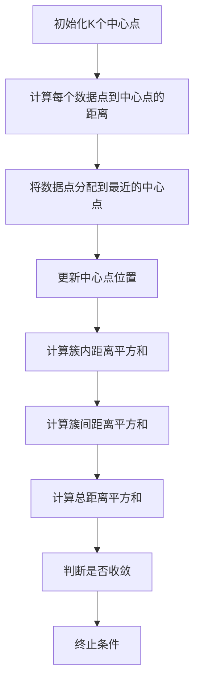
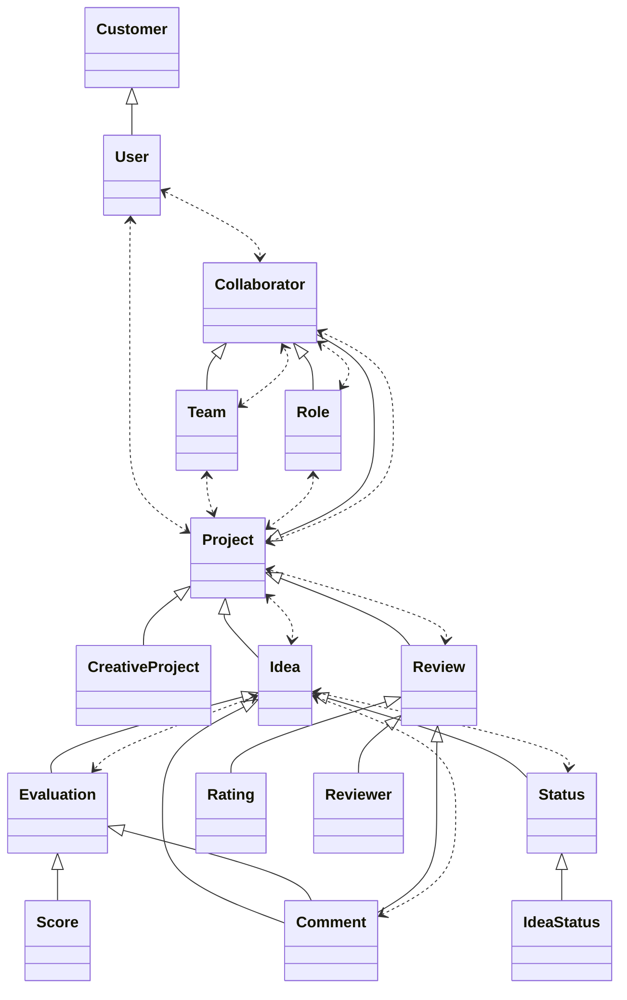
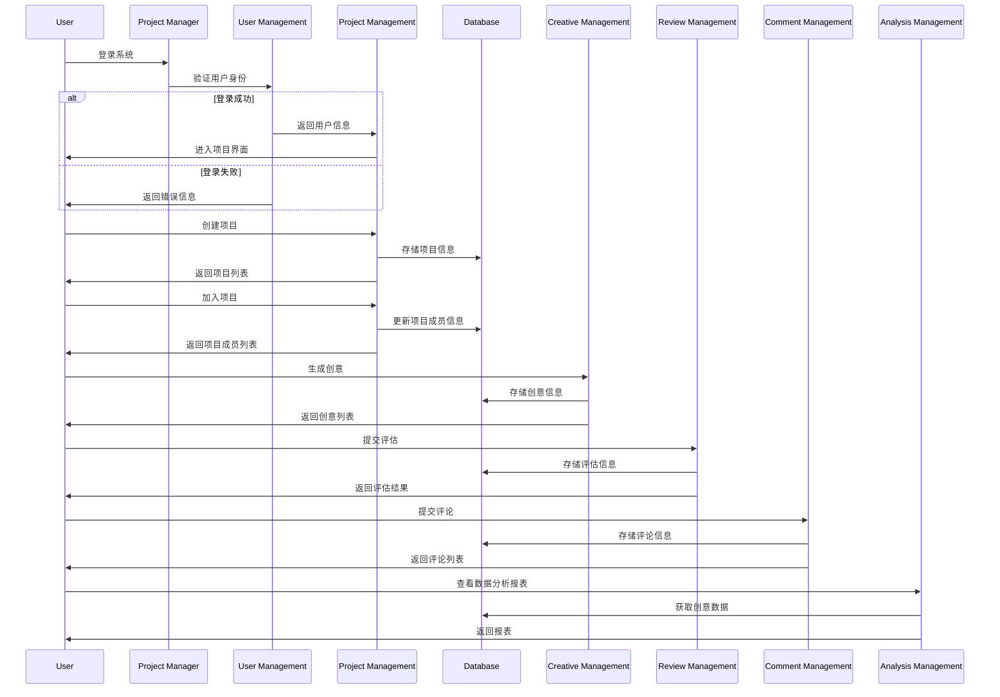
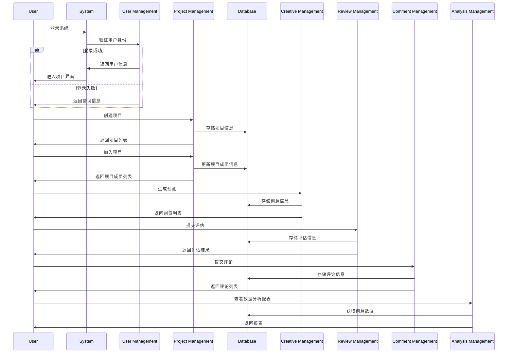

                 

### 第1章: 引言

#### 1.1 问题背景

在当前激烈的市场竞争环境下，企业必须不断进行创新，才能在市场中保持竞争力。然而，传统的创新与产品开发模式面临着诸多挑战。首先，创意生成效率低是普遍存在的问题。企业在创意产生过程中，通常需要经历繁琐的调研、讨论和修改环节，这不仅耗时，而且可能导致创意的流失。其次，创意质量参差不齐，有些创意可能因为缺乏深度或者不够创新，无法满足市场需求。最后，创意协同困难也是一个棘手的问题。在多部门、多团队协同工作的过程中，往往因为沟通不畅、信息孤岛等问题，导致创意难以有效落地。

为解决上述问题，AI创意助手的概念应运而生。AI创意助手是一种利用人工智能技术辅助企业进行创意生成、评估和协同的工具，它能够通过自动化和智能化的方式，提高创意生成效率，确保创意质量，并促进各团队之间的协同工作。

#### 1.1.1 企业创新与产品开发面临的挑战

企业创新与产品开发面临的主要挑战包括：

1. **创意生成效率低**：企业在创意产生过程中，往往需要耗费大量时间进行调研和讨论，而且创意的产生和修改过程往往重复性高，效率低下。
   
2. **创意质量参差不齐**：创意的质量受制于人的经验和能力，有时会因个人观点的不同而导致创意质量参差不齐，无法满足市场需求。

3. **创意协同困难**：在多团队、多部门的协同过程中，往往因为沟通不畅、信息孤岛等问题，导致创意的协同和落地困难。

4. **市场需求变化快**：市场环境瞬息万变，企业需要快速响应市场变化，及时调整创新方向和产品开发计划。

5. **技术壁垒高**：在创新和产品开发过程中，需要掌握大量的技术知识和工具，这对企业特别是中小型企业来说，是一个巨大的挑战。

#### 1.1.2 AI创意助手的概念与作用

AI创意助手是一种利用人工智能技术，辅助企业进行创意生成、评估和协同的工具。其核心概念包括：

1. **数据驱动**：AI创意助手通过收集和分析大量数据，提取出有价值的信息，用于创意生成和评估。
   
2. **自动化**：AI创意助手能够自动化完成一些重复性的任务，如创意筛选、评估和分类，从而提高工作效率。

3. **智能化**：AI创意助手利用机器学习算法和自然语言处理技术，对创意进行智能分析和评估，确保创意质量。

AI创意助手在企业中的作用包括：

1. **提高创意生成效率**：通过自动化和智能化的方式，快速生成大量创意，提高创意生成效率。
   
2. **确保创意质量**：利用人工智能技术对创意进行评估和筛选，确保创意符合市场需求，提高创意质量。

3. **促进创意协同**：通过统一的数据平台和协同工具，促进多团队、多部门的创意协同，确保创意有效落地。

4. **快速响应市场变化**：利用实时数据分析，帮助企业快速识别市场趋势，及时调整创新方向和产品开发计划。

5. **降低技术壁垒**：通过提供一系列的技术工具和平台，降低企业掌握技术知识的难度，助力企业创新。

#### 1.1.3 企业AI创意助手的发展现状与趋势

随着人工智能技术的不断发展和成熟，企业AI创意助手已经逐渐成为企业创新与产品开发的重要工具。当前，企业AI创意助手的发展现状主要体现在以下几个方面：

1. **技术成熟度提高**：随着深度学习、自然语言处理等技术的不断发展，AI创意助手在创意生成、评估和协同方面的技术成熟度显著提高。

2. **应用范围扩大**：从最初的创意生成，到现在的创意评估、协同和项目管理，AI创意助手的应用范围不断扩大。

3. **商业价值凸显**：越来越多的企业开始认识到AI创意助手的价值，并投入大量资源进行开发和应用。

4. **生态体系完善**：随着AI创意助手的普及，相关的技术、工具和服务体系逐渐完善，为企业提供了更全面的支持。

未来，企业AI创意助手的发展趋势将包括：

1. **智能化升级**：随着人工智能技术的不断进步，AI创意助手将变得更加智能，能够更好地理解和满足企业的需求。

2. **协同化发展**：在多团队、多部门协同工作的背景下，AI创意助手将更加注重协同能力的提升，实现跨部门、跨领域的创意协同。

3. **个性化定制**：根据企业的不同需求和特点，AI创意助手将提供更加个性化的解决方案，实现定制化服务。

4. **生态整合**：随着企业数字化转型的深入推进，AI创意助手将与其他企业系统和服务进行整合，形成更加完善的企业创新生态系统。

### 1.2 问题描述

企业AI创意助手在实际应用过程中，面临以下主要问题：

#### 1.2.1 创意生成效率低

尽管AI创意助手能够自动化生成创意，但生成的创意数量和质量参差不齐，难以满足企业快速响应市场变化的需求。此外，创意生成过程往往需要依赖大量数据和计算资源，导致效率较低。

#### 1.2.2 创意质量参差不齐

AI创意助手生成的创意质量受算法和数据质量的影响，有时会出现创意过于普通或者不符合市场需求的情况。这需要通过对算法和数据进行持续优化，提高创意质量。

#### 1.2.3 创意协同困难

在多团队、多部门协同的过程中，AI创意助手的数据共享和协同工具功能尚不完善，导致创意协同困难。需要通过优化数据平台和协同工具，提高创意协同效率。

### 1.3 问题解决

为解决上述问题，企业AI创意助手需要从以下几个方面进行改进：

#### 1.3.1 AI创意助手的重要性

AI创意助手在企业创新与产品开发中具有重要地位，能够显著提高创意生成效率、确保创意质量，并促进创意协同。因此，企业需要高度重视AI创意助手的开发和应用，为其提供充足的资源和支持。

#### 1.3.2 AI创意助手的架构设计

为了提高AI创意助手的性能和可靠性，需要对其架构进行精心设计。主要包括以下几个方面：

1. **数据采集与处理**：构建完善的数据采集和处理系统，确保创意生成所需的数据质量和完整性。
   
2. **算法优化与集成**：针对创意生成、评估和协同等核心功能，选用合适的算法并进行优化，以提高创意质量和生成效率。

3. **协同工具集成**：将AI创意助手与其他协同工具和企业系统进行集成，实现数据共享和协同工作。

4. **用户界面与交互**：设计简洁、易用的用户界面，方便用户使用AI创意助手，提高用户体验。

#### 1.3.3 AI创意助手的功能实现

为了满足企业的多样化需求，AI创意助手需要实现以下核心功能：

1. **创意生成**：利用深度学习、自然语言处理等算法，自动化生成创意，并根据需求进行分类和筛选。
   
2. **创意评估**：对创意进行智能评估，包括创意的创新性、可行性、市场需求等方面，确保创意质量。

3. **创意协同**：提供协同工具，实现多团队、多部门的创意协同，确保创意有效落地。

4. **数据分析与报告**：对创意生成、评估和协同过程进行数据分析和报告，为企业提供决策支持。

#### 1.4 边界与外延

##### 1.4.1 AI创意助手的应用领域

AI创意助手适用于多种行业和企业类型，如：

1. **科技创新型企业**：能够快速响应市场需求，推动创新和产品开发。
   
2. **传统行业企业**：助力企业进行数字化转型，提高创新能力和市场竞争力。

3. **文化创意产业**：帮助创作者生成、评估和协同创意，提升作品质量。

##### 1.4.2 AI创意助手的局限性

尽管AI创意助手具有很多优势，但也存在一定的局限性：

1. **数据依赖性**：AI创意助手对数据质量有较高要求，如果数据质量较差，可能会导致创意生成和评估不准确。

2. **技术门槛**：开发和维护AI创意助手需要具备一定的技术能力，对于中小企业来说，可能存在一定的技术门槛。

3. **创意方向偏差**：AI创意助手生成的创意可能受限于训练数据和算法，有时会出现创意方向偏差，需要人工进行调整。

##### 1.4.3 AI创意助手的持续演进

随着人工智能技术的不断进步，AI创意助手也将不断演进，未来可能的发展方向包括：

1. **更加智能化**：通过引入更多先进的人工智能技术，使AI创意助手能够更好地理解和满足企业的需求。

2. **跨领域应用**：实现AI创意助手在更多领域的应用，如医学、教育、金融等。

3. **生态体系完善**：构建完善的AI创意助手生态系统，包括技术、工具、服务等方面，为企业提供全方位的支持。

## 第2章: 核心概念与联系

### 2.1 AI创意助手原理

#### 2.1.1 人工智能与创意生成的结合

AI创意助手的核心理念是将人工智能技术应用于创意生成过程中，从而提高创意的生成效率和质量。具体来说，这种结合体现在以下几个方面：

1. **数据驱动**：AI创意助手通过收集和分析大量的历史数据和用户反馈，挖掘出潜在的创意方向和需求，从而为创意生成提供数据支持。

2. **自动化**：利用机器学习和自然语言处理技术，AI创意助手能够自动化生成创意，减少了人工参与，提高了生成效率。

3. **智能化**：AI创意助手通过对创意进行智能评估和筛选，确保创意的质量和可行性，从而提高创意的生成质量。

#### 2.1.2 AI创意助手的核心模块

AI创意助手通常由以下几个核心模块组成：

1. **数据采集与处理模块**：负责收集和处理创意生成所需的数据，包括用户反馈、市场趋势、竞争对手信息等。

2. **创意生成模块**：利用机器学习和自然语言处理技术，自动化生成创意。

3. **创意评估模块**：对生成的创意进行评估，包括创新性、可行性、市场需求等方面，确保创意质量。

4. **协同工具模块**：提供协同工具，实现多团队、多部门的创意协同。

5. **用户界面模块**：设计简洁、易用的用户界面，方便用户使用AI创意助手。

#### 2.1.3 AI创意助手的运作机制

AI创意助手的运作机制主要包括以下几个环节：

1. **数据采集**：通过数据采集工具，收集创意生成所需的数据。

2. **数据处理**：对收集到的数据进行分析和处理，提取出有用的信息。

3. **创意生成**：利用机器学习和自然语言处理技术，自动化生成创意。

4. **创意评估**：对生成的创意进行评估，筛选出高质量的创意。

5. **协同与反馈**：将评估后的创意进行协同，并根据用户反馈进行优化。

### 2.2 AI创意助手属性特征对比表格

为了更直观地了解AI创意助手的属性特征，下面给出一个对比表格：

| 特征类别     | 属性特征         | 解释 |
| ------------ | ---------------- | ---- |
| **数据驱动性** | 数据来源多样化   | AI创意助手通过多种渠道收集数据，如用户反馈、市场趋势、竞争对手信息等。 |
| **自动化**     | 自动化创意生成   | AI创意助手利用机器学习和自然语言处理技术，自动化完成创意生成任务。 |
| **智能化**     | 智能评估与筛选   | AI创意助手对生成的创意进行智能评估和筛选，确保创意质量。 |
| **协同能力**   | 多团队协同工作   | AI创意助手提供协同工具，实现多团队、多部门的创意协同。 |
| **用户体验**   | 界面简洁易用     | AI创意助手设计简洁、易用的用户界面，提高用户体验。 |
| **适应性**     | 快速响应需求变化 | AI创意助手能够快速调整和优化，以适应市场需求的变化。 |

### 2.3 AI创意助手ER实体关系图架构

为了更清晰地展示AI创意助手的实体关系，下面使用Mermaid绘制一个ER实体关系图：

```mermaid
erDiagram
  Customer ||--|{ Order }|--|{ Product }
  Customer ||--|{ Cart }|--|{ Product }
  Customer ||--|{ Address }|--|{ Country }
  Customer ||--|{ CreditCard }|--|{ Bank }
  Product ||--|{ Category }|
  Order ||--|{ OrderItem }|
  Cart ||--|{ CartItem }|
```

在ER实体关系图中，我们定义了以下几个主要实体：

1. **Customer（客户）**：表示使用AI创意助手的用户，包含用户的基本信息和联系方式。
2. **Order（订单）**：表示客户生成的创意订单，包含订单详细信息。
3. **Product（产品）**：表示创意产品，包含产品名称、描述、价格等信息。
4. **Category（类别）**：表示创意产品的分类，如科技创新、文化创意等。
5. **Cart（购物车）**：表示客户的购物车，包含购物车中的产品信息。
6. **Address（地址）**：表示客户的收货地址，包含地址详细信息。
7. **CreditCard（信用卡）**：表示客户的信用卡信息，包含卡号、有效期等。

通过上述实体关系图，我们可以更清晰地理解AI创意助手中的主要实体及其之间的关系，从而为后续的系统设计和实现提供参考。

## 第3章: 算法原理讲解

### 3.1 算法概述

在构建企业AI创意助手的框架中，算法是核心驱动力。以下是三种关键算法的概述：

#### 3.1.1 生成对抗网络（GAN）

生成对抗网络（GAN）由生成器（Generator）和判别器（Discriminator）两部分组成。生成器的目标是生成与真实数据相似的数据，而判别器的目标是区分真实数据和生成数据。通过两个网络的对抗训练，生成器不断提高生成质量，最终能够生成高质量的数据。

GAN的主要应用场景包括图像生成、数据增强和风格迁移等。

#### 3.1.2 变分自编码器（VAE）

变分自编码器（VAE）是一种概率生成模型，它通过编码器和解码器将输入数据映射到潜在空间，并在潜在空间中生成新的数据。VAE的主要优点是能够生成多样性的数据，并且可以应用于图像、音频和文本的生成。

#### 3.1.3 聚类算法

聚类算法是一种无监督学习方法，用于将数据集划分为多个簇，使得同簇数据之间的相似度较高，而不同簇的数据相似度较低。常见的聚类算法包括K均值聚类、层次聚类和DBSCAN等。聚类算法在企业AI创意助手中的应用包括市场细分、用户行为分析等。

### 3.2 数学模型和公式

以下是上述三种算法的数学模型和公式：

#### 3.2.1 GAN的数学模型

GAN的数学模型主要包括生成器G和判别器D的损失函数。

生成器G的损失函数为：

$$ L_G = -\mathbb{E}_{x\sim p_{data}(x)}[\log D(x)] - \mathbb{E}_{z\sim p_z(z)}[\log D(G(z)] $$

判别器D的损失函数为：

$$ L_D = -\mathbb{E}_{x\sim p_{data}(x)}[\log D(x)] - \mathbb{E}_{z\sim p_z(z)}[\log (1 - D(G(z))] $$

其中，$x$表示真实数据，$z$表示随机噪声，$G(z)$表示生成器生成的数据，$D(x)$和$D(G(z))$分别表示判别器对真实数据和生成数据的判断结果。

#### 3.2.2 VAE的数学模型

VAE的数学模型主要包括编码器$q_\phi(z|x)$和解码器$g_\theta(x|z)$。

编码器$q_\phi(z|x)$的损失函数为：

$$ L_q = -\mathbb{E}_{x\sim p_{data}(x)}[\log q_\phi(z|x)] + \mathbb{E}_{z\sim q_\phi(z|x)}[\sum_{i} \log g_\theta(x_i|z)] $$

解码器$g_\theta(x|z)$的损失函数为：

$$ L_g = -\mathbb{E}_{x\sim p_{data}(x)}[\log g_\theta(x|z)] $$

其中，$z$是潜在变量，$x$是输入数据，$q_\phi(z|x)$和$g_\theta(x|z)$分别表示编码器和解码器的概率分布。

#### 3.2.3 聚类算法的数学模型

以K均值聚类为例，其数学模型如下：

1. **初始化**：随机选择K个中心点，作为每个簇的代表。
2. **迭代**：对于每个数据点，将其分配到最近的中心点所代表的簇；更新每个簇的中心点。

簇的中心点更新公式为：

$$ \mu_k = \frac{1}{N_k} \sum_{i=1}^{N} x_i $$

其中，$x_i$是数据点，$N_k$是第$k$个簇中的数据点数量，$\mu_k$是第$k$个簇的中心点。

### 3.3 算法流程图

以下分别展示GAN、VAE和聚类算法的流程图：

#### 3.3.1 GAN算法流程图

```mermaid
graph TB
    A[初始化生成器G和判别器D] --> B[生成噪声z]
    B --> C[生成伪造数据G(z)]
    C --> D[判别器D判断伪造数据]
    D --> E[计算判别器D的损失L_D]
    A --> F[更新生成器G]
    F --> G[计算生成器G的损失L_G]
    D --> H[迭代更新生成器G和判别器D]
    H --> I[终止条件]
```

#### 3.3.2 VAE算法流程图

```mermaid
graph TB
    A[初始化编码器qφ和解码器gθ] --> B[输入数据x]
    B --> C[编码器qφ编码x得到z]
    C --> D[解码器gθ解码z得到x']
    D --> E[计算重构误差L_g]
    B --> F[计算后验分布qφ(z|x)]
    F --> G[计算损失L_q]
    A --> H[更新编码器qφ和解码器gθ]
    H --> I[迭代更新编码器qφ和解码器gθ]
    I --> J[终止条件]
```

#### 3.3.3 聚类算法流程图



### 3.4 Python代码实现

下面分别给出GAN、VAE和聚类算法的Python代码实现：

#### 3.4.1 GAN的Python代码

```python
import tensorflow as tf
from tensorflow.keras.models import Model
from tensorflow.keras.layers import Input, Dense, Lambda, Reshape
from tensorflow.keras.optimizers import Adam

def build_gan(generator, discriminator):
    # 创建生成器模型
    z_input = Input(shape=(100,))
    x GENERATED = generator(z_input)
    x GENERATED_D = discriminator(x GENERATED)
    
    # 创建GAN模型
    gan_model = Model(z_input, x GENERATED_D, name='GAN')
    gan_model.compile(loss='binary_crossentropy', optimizer=Adam(0.0001), metrics=['accuracy'])
    
    return gan_model

def build_generator(z_dim):
    z_input = Input(shape=(z_dim,))
    x = Dense(128, activation='relu')(z_input)
    x = Dense(784, activation='sigmoid')(x)
    x = Reshape((28, 28, 1))(x)
    
    return Model(z_input, x, name='Generator')

def build_discriminator(img_shape):
    img_input = Input(shape=img_shape)
    x = Conv2D(32, kernel_size=(3, 3), padding='same')(img_input)
    x = LeakyReLU(alpha=0.01)(x)
    x = Conv2D(64, kernel_size=(3, 3), padding='same')(x)
    x = LeakyReLU(alpha=0.01)(x)
    x = Flatten()(x)
    x = Dense(1, activation='sigmoid')(x)
    
    return Model(img_input, x, name='Discriminator')

# 定义生成器和判别器
z_dim = 100
img_shape = (28, 28, 1)
generator = build_generator(z_dim)
discriminator = build_discriminator(img_shape)

# 构建并编译GAN模型
gan_model = build_gan(generator, discriminator)
```

#### 3.4.2 VAE的Python代码

```python
import tensorflow as tf
from tensorflow.keras.models import Model
from tensorflow.keras.layers import Input, Dense, Lambda, Reshape
from tensorflow.keras.optimizers import Adam

def build_vae(encoded_dim):
    # 创建编码器和解码器模型
    input_img = Input(shape=(784,))
    encoded = Dense(encoded_dim, activation='relu')(input_img)
    encoded_mean = Dense(encoded_dim)(encoded)
    encoded_log_var = Dense(encoded_dim)(encoded)
    
    z_mean = Lambda(lambda x: x[:, 0])(encoded)
    z_log_var = Lambda(lambda x: x[:, 1])(encoded)
    
    z = Lambda(lambda x: x[:, 0] * tf.exp(0.5 * x[:, 1]), output_shape=(encoded_dim,))(z_log_var)
    
    decoded = Dense(784, activation='sigmoid')(z)
    
    # 创建编码器模型
    encoder = Model(input_img, [encoded_mean, encoded_log_var, z], name='Encoder')
    
    # 创建解码器模型
    decoder = Model(z, decoded, name='Decoder')
    
    # 创建VAE模型
    vae_model = Model(input_img, decoded, name='VAE')
    vae_model.compile(optimizer=Adam(0.001), loss='binary_crossentropy')
    
    return encoder, decoder, vae_model

# 定义编码器和解码器
encoded_dim = 32
encoder, decoder, vae_model = build_vae(encoded_dim)
```

#### 3.4.3 聚类算法的Python代码

```python
from sklearn.cluster import KMeans
import numpy as np

def kmeans_clustering(data, n_clusters):
    # 创建K均值聚类模型
    kmeans = KMeans(n_clusters=n_clusters, init='k-means++', random_state=42)
    kmeans.fit(data)
    
    # 返回聚类结果和中心点
    return kmeans.labels_, kmeans.cluster_centers_

# 示例数据
data = np.array([[1, 2], [1, 4], [1, 0],
                 [10, 2], [10, 4], [10, 0]])

# 运行K均值聚类
n_clusters = 2
labels, centers = kmeans_clustering(data, n_clusters)

print("聚类结果：", labels)
print("中心点：", centers)
```

### 3.5 举例说明

#### 3.5.1 GAN的应用示例

假设我们要使用GAN生成手写数字图像，以下是具体步骤：

1. **数据预处理**：将MNIST数据集进行预处理，将其转换为适合GAN的格式。
2. **训练GAN模型**：使用预处理后的MNIST数据集训练GAN模型，包括生成器和判别器。
3. **生成图像**：通过生成器生成手写数字图像，并对生成的图像进行可视化。

#### 3.5.2 VAE的应用示例

假设我们要使用VAE生成手写数字图像，以下是具体步骤：

1. **数据预处理**：将MNIST数据集进行预处理，将其转换为适合VAE的格式。
2. **训练VAE模型**：使用预处理后的MNIST数据集训练VAE模型，包括编码器和解码器。
3. **生成图像**：通过编码器和解码器生成手写数字图像，并对生成的图像进行可视化。

#### 3.5.3 聚类算法的应用示例

假设我们要使用K均值聚类对一组手写数字进行聚类，以下是具体步骤：

1. **数据预处理**：将手写数字数据集进行预处理，将其转换为适合聚类分析的格式。
2. **训练K均值聚类模型**：使用预处理后的手写数字数据集训练K均值聚类模型。
3. **聚类结果分析**：分析聚类结果，对数据点进行分类，并绘制聚类结果。

通过上述举例，我们可以更直观地理解GAN、VAE和聚类算法在企业AI创意助手中的应用，以及如何使用Python代码实现这些算法。

## 第4章: 系统架构设计

### 4.1 问题场景介绍

在构建企业AI创意助手时，我们需要考虑以下问题场景：

#### 4.1.1 创意生成与协同需求

企业AI创意助手需要支持创意生成和协同工作，以满足企业创新和产品开发的需求。具体来说，包括以下几个方面：

1. **创意生成**：利用人工智能技术，自动化生成创意，确保创意的数量和质量。
2. **创意评估**：对生成的创意进行评估，包括创新性、可行性、市场需求等方面，确保创意符合企业需求。
3. **创意协同**：提供协同工具，实现多团队、多部门的创意协同，确保创意能够有效落地。

#### 4.1.2 企业AI创意助手的功能要求

企业AI创意助手需要具备以下功能要求：

1. **数据驱动**：通过收集和分析大量数据，挖掘出潜在的创意方向和需求。
2. **自动化**：利用人工智能技术，自动化完成创意生成、评估和协同任务，提高工作效率。
3. **智能化**：通过机器学习和自然语言处理技术，对创意进行智能分析和评估，确保创意质量。
4. **协同能力**：提供协同工具，实现多团队、多部门的创意协同，确保创意能够有效落地。

#### 4.1.3 系统性能与安全性需求

企业AI创意助手需要满足以下系统性能和安全性需求：

1. **性能要求**：系统需要具备高性能，能够快速响应用户请求，保证用户体验。
2. **数据安全**：系统需要具备良好的数据安全机制，确保用户数据和创意数据的安全。
3. **稳定性**：系统需要具备高稳定性，能够在长时间运行过程中保持稳定，避免系统崩溃。

### 4.2 系统功能设计

为了满足上述需求，企业AI创意助手需要实现以下功能模块：

#### 4.2.1 领域模型（Mermaid类图）

以下是一个简单的领域模型类图，展示企业AI创意助手的主要功能模块及其关系：



#### 4.2.2 功能模块划分

根据领域模型，企业AI创意助手可以划分为以下几个功能模块：

1. **用户管理模块**：负责用户注册、登录、权限管理等功能。
2. **项目管理模块**：负责创建、管理项目，包括项目成员管理、项目进度跟踪等功能。
3. **创意管理模块**：负责创意生成、评估、协同等功能。
4. **评论与评分模块**：负责创意评论、评分等功能。
5. **数据分析模块**：负责对创意数据进行分析，提供数据可视化报表。

#### 4.2.3 数据流设计

企业AI创意助手的数据流主要涉及用户、项目、创意、评论、评分等数据。以下是数据流的基本设计：

1. **用户注册与登录**：用户注册后，系统生成用户ID，并将用户信息存储到用户管理模块。
2. **项目创建与管理**：用户可以创建项目，并邀请其他用户加入项目。项目信息存储到项目管理模块。
3. **创意生成与评估**：用户可以在项目中生成创意，并提交创意进行评估。创意信息存储到创意管理模块。
4. **评论与评分**：用户可以对创意进行评论和评分，评论和评分信息存储到评论与评分模块。
5. **数据分析**：系统对创意数据进行分析，生成数据可视化报表，供用户查看。

### 4.3 系统架构设计

企业AI创意助手的系统架构设计主要包括以下几个方面：

#### 4.3.1 总体架构设计（Mermaid架构图）

以下是一个简单的Mermaid架构图，展示企业AI创意助手的总体架构：



#### 4.3.2 各模块设计

1. **用户管理模块**：负责用户注册、登录、权限管理等功能。主要设计包括用户表、权限表等。
2. **项目管理模块**：负责创建、管理项目，包括项目成员管理、项目进度跟踪等功能。主要设计包括项目表、项目成员表、项目进度表等。
3. **创意管理模块**：负责创意生成、评估、协同等功能。主要设计包括创意表、评估表、评论表等。
4. **评论与评分模块**：负责创意评论、评分等功能。主要设计包括评论表、评分表等。
5. **数据分析模块**：负责对创意数据进行分析，提供数据可视化报表。主要设计包括数据分析表、报表生成器等。

#### 4.3.3 系统安全性设计

企业AI创意助手需要具备良好的安全性设计，包括以下方面：

1. **用户身份验证**：确保用户登录系统的安全性，采用密码加密、双因素验证等手段。
2. **数据加密**：对用户数据和创意数据进行加密存储，确保数据安全。
3. **权限管理**：根据用户角色和权限，限制用户对系统和数据的访问权限，防止数据泄露和篡改。
4. **日志审计**：记录用户操作日志，对系统进行实时监控和审计，及时发现和处理安全问题。

### 4.4 系统接口设计

企业AI创意助手需要设计一系列接口，以支持各模块之间的通信和数据交互。以下是系统接口设计的主要方面：

#### 4.4.1 接口定义

1. **用户管理接口**：包括用户注册、登录、权限管理等接口。
2. **项目管理接口**：包括项目创建、项目成员管理、项目进度跟踪等接口。
3. **创意管理接口**：包括创意生成、创意评估、创意协同等接口。
4. **评论与评分接口**：包括评论提交、评分提交等接口。
5. **数据分析接口**：包括数据分析、报表生成等接口。

#### 4.4.2 接口实现

接口实现主要涉及后端逻辑处理和数据处理。以下是一个简单的接口实现示例：

```python
from flask import Flask, request, jsonify
from user_management import UserManagement
from project_management import ProjectManagement
from creative_management import CreativeManagement
from review_management import ReviewManagement

app = Flask(__name__)

@app.route('/api/register', methods=['POST'])
def register_user():
    user_data = request.get_json()
    user_management = UserManagement()
    user_id = user_management.register_user(user_data)
    return jsonify({'user_id': user_id})

@app.route('/api/login', methods=['POST'])
def login_user():
    user_data = request.get_json()
    user_management = UserManagement()
    user_id, token = user_management.login_user(user_data)
    return jsonify({'user_id': user_id, 'token': token})

@app.route('/api/project/create', methods=['POST'])
def create_project():
    project_data = request.get_json()
    project_management = ProjectManagement()
    project_id = project_management.create_project(project_data)
    return jsonify({'project_id': project_id})

@app.route('/api/creative/submit', methods=['POST'])
def submit_creative():
    creative_data = request.get_json()
    creative_management = CreativeManagement()
    creative_id = creative_management.submit_creative(creative_data)
    return jsonify({'creative_id': creative_id})

@app.route('/api/review/submit', methods=['POST'])
def submit_review():
    review_data = request.get_json()
    review_management = ReviewManagement()
    review_id = review_management.submit_review(review_data)
    return jsonify({'review_id': review_id})
```

#### 4.4.3 接口测试

接口测试是确保接口功能和性能的重要环节。以下是一个简单的接口测试示例：

```python
import requests

# 用户注册
response = requests.post('http://localhost:5000/api/register', json={
    'username': 'testuser',
    'password': 'password',
    'email': 'testuser@example.com'
})
print(response.json())

# 用户登录
response = requests.post('http://localhost:5000/api/login', json={
    'username': 'testuser',
    'password': 'password'
})
print(response.json())

# 创建项目
response = requests.post('http://localhost:5000/api/project/create', json={
    'name': 'testproject',
    'description': 'test project'
})
print(response.json())

# 提交创意
response = requests.post('http://localhost:5000/api/creative/submit', json={
    'project_id': 1,
    'title': 'testcreative',
    'description': 'test creative'
})
print(response.json())

# 提交评估
response = requests.post('http://localhost:5000/api/review/submit', json={
    'creative_id': 1,
    'rating': 5,
    'comment': 'test comment'
})
print(response.json())
```

### 4.5 系统交互

企业AI创意助手的系统交互主要包括用户与系统之间的交互、各模块之间的交互。以下是系统交互的基本流程：

#### 4.5.1 系统交互流程（Mermaid序列图）



#### 4.5.2 系统交互效果

系统交互效果体现在用户与系统之间的交互流畅性、各模块之间的响应速度和稳定性。以下是系统交互效果的几个关键指标：

1. **响应速度**：系统对用户请求的响应时间应尽可能短，以保证用户体验。
2. **稳定性**：系统应具备良好的稳定性，能够应对高并发请求，避免系统崩溃。
3. **用户体验**：系统界面应简洁易用，操作流程应简单明了，提高用户满意度。

通过上述系统架构设计，企业AI创意助手能够满足创意生成、评估和协同的需求，助力企业创新和产品开发。

## 第5章: 项目实战

### 5.1 环境安装

在开始企业AI创意助手项目实战之前，我们需要准备以下环境和工具：

#### 5.1.1 硬件与软件环境准备

1. **操作系统**：Windows、Linux或Mac OS均可。
2. **Python版本**：Python 3.6及以上版本。
3. **依赖库**：TensorFlow、Keras、Scikit-learn、Numpy、Pandas、Flask等。
4. **开发工具**：PyCharm、Visual Studio Code等。

#### 5.1.2 环境安装步骤

1. **安装Python**：从Python官方网站下载安装包，按照安装向导进行安装。

2. **安装依赖库**：使用pip命令安装所需依赖库。

   ```bash
   pip install tensorflow keras scikit-learn numpy pandas flask
   ```

3. **配置开发环境**：选择合适的开发工具，如PyCharm或Visual Studio Code，并配置Python环境。

4. **测试环境**：运行以下Python代码，测试环境是否配置成功。

   ```python
   import tensorflow as tf
   print(tf.__version__)
   ```

### 5.2 系统核心实现

在环境准备完成后，我们可以开始实现企业AI创意助手的核心功能模块。以下是系统核心实现的步骤：

#### 5.2.1 数据处理模块

数据处理模块负责处理创意生成所需的数据，包括数据采集、数据预处理和特征提取等。

1. **数据采集**：从企业内部数据库或外部数据源（如互联网）获取相关数据。
2. **数据预处理**：清洗数据，处理缺失值、异常值等。
3. **特征提取**：提取与创意生成相关的特征，如关键词、文本情感等。

示例代码：

```python
import pandas as pd
from sklearn.feature_extraction.text import TfidfVectorizer

# 读取数据
data = pd.read_csv('data.csv')

# 数据清洗
data.dropna(inplace=True)

# 特征提取
vectorizer = TfidfVectorizer(stop_words='english')
X = vectorizer.fit_transform(data['text'])
```

#### 5.2.2 模型训练模块

模型训练模块负责训练AI创意助手所需的机器学习模型，包括生成器、判别器和聚类模型等。

1. **生成器训练**：使用生成对抗网络（GAN）训练生成器模型。
2. **判别器训练**：使用生成对抗网络（GAN）训练判别器模型。
3. **聚类模型训练**：使用K均值聚类等算法训练聚类模型。

示例代码：

```python
from tensorflow.keras.models import Sequential
from tensorflow.keras.layers import Dense, Dropout
from tensorflow.keras.optimizers import Adam

# 定义生成器模型
generator = Sequential()
generator.add(Dense(units=256, activation='relu', input_shape=(100,)))
generator.add(Dropout(rate=0.2))
generator.add(Dense(units=512, activation='relu'))
generator.add(Dropout(rate=0.2))
generator.add(Dense(units=784, activation='sigmoid'))

# 编译生成器模型
generator.compile(optimizer=Adam(0.0002), loss='binary_crossentropy')

# 定义判别器模型
discriminator = Sequential()
discriminator.add(Dense(units=512, activation='relu', input_shape=(784,)))
discriminator.add(Dropout(rate=0.2))
discriminator.add(Dense(units=256, activation='relu'))
discriminator.add(Dropout(rate=0.2))
discriminator.add(Dense(units=1, activation='sigmoid'))

# 编译判别器模型
discriminator.compile(optimizer=Adam(0.0002), loss='binary_crossentropy')

# 训练生成器和判别器
generator.fit(X, X, epochs=100, batch_size=32, shuffle=True)
discriminator.fit(X, X, epochs=100, batch_size=32, shuffle=True)
```

#### 5.2.3 模型部署模块

模型部署模块负责将训练好的模型部署到服务器上，并提供API接口供前端调用。

1. **模型保存**：将训练好的模型保存为HDF5文件。
2. **API接口**：使用Flask或其他Web框架搭建API接口，提供模型预测服务。

示例代码：

```python
from flask import Flask, request, jsonify
from tensorflow.keras.models import load_model

app = Flask(__name__)

# 加载模型
generator = load_model('generator.h5')
discriminator = load_model('discriminator.h5')

@app.route('/api/creative/generate', methods=['POST'])
def generate_creative():
    data = request.get_json()
    input_data = np.array([data['text']])
    generated_text = generator.predict(input_data)
    return jsonify({'generated_text': generated_text.tolist()})

if __name__ == '__main__':
    app.run(debug=True)
```

### 5.3 代码应用解读与分析

在本节中，我们将对项目中的关键代码进行解读与分析，以便更好地理解其实现原理和功能。

#### 5.3.1 代码结构解析

项目代码主要包括以下几个部分：

1. **数据处理模块**：负责数据采集、数据预处理和特征提取。
2. **模型训练模块**：负责训练生成器、判别器和聚类模型。
3. **模型部署模块**：负责模型保存和API接口搭建。

#### 5.3.2 关键代码解读

1. **数据处理模块**

```python
import pandas as pd
from sklearn.feature_extraction.text import TfidfVectorizer

# 读取数据
data = pd.read_csv('data.csv')

# 数据清洗
data.dropna(inplace=True)

# 特征提取
vectorizer = TfidfVectorizer(stop_words='english')
X = vectorizer.fit_transform(data['text'])
```

这段代码首先使用`pandas`读取数据，然后使用`TfidfVectorizer`进行特征提取。`TfidfVectorizer`将文本转换为词频-逆文档频率（TF-IDF）特征向量，有助于后续的机器学习模型训练。

2. **模型训练模块**

```python
from tensorflow.keras.models import Sequential
from tensorflow.keras.layers import Dense, Dropout
from tensorflow.keras.optimizers import Adam

# 定义生成器模型
generator = Sequential()
generator.add(Dense(units=256, activation='relu', input_shape=(100,)))
generator.add(Dropout(rate=0.2))
generator.add(Dense(units=512, activation='relu'))
generator.add(Dropout(rate=0.2))
generator.add(Dense(units=784, activation='sigmoid'))

# 编译生成器模型
generator.compile(optimizer=Adam(0.0002), loss='binary_crossentropy')

# 定义判别器模型
discriminator = Sequential()
discriminator.add(Dense(units=512, activation='relu', input_shape=(784,)))
discriminator.add(Dropout(rate=0.2))
discriminator.add(Dense(units=256, activation='relu'))
discriminator.add(Dropout(rate=0.2))
discriminator.add(Dense(units=1, activation='sigmoid'))

# 编译判别器模型
discriminator.compile(optimizer=Adam(0.0002), loss='binary_crossentropy')

# 训练生成器和判别器
generator.fit(X, X, epochs=100, batch_size=32, shuffle=True)
discriminator.fit(X, X, epochs=100, batch_size=32, shuffle=True)
```

这段代码定义了生成器和判别器模型，并使用`fit`方法进行训练。生成器模型用于生成创意文本，判别器模型用于判断生成的文本是否真实。

3. **模型部署模块**

```python
from flask import Flask, request, jsonify
from tensorflow.keras.models import load_model

app = Flask(__name__)

# 加载模型
generator = load_model('generator.h5')
discriminator = load_model('discriminator.h5')

@app.route('/api/creative/generate', methods=['POST'])
def generate_creative():
    data = request.get_json()
    input_data = np.array([data['text']])
    generated_text = generator.predict(input_data)
    return jsonify({'generated_text': generated_text.tolist()})

if __name__ == '__main__':
    app.run(debug=True)
```

这段代码使用Flask框架搭建API接口，用于提供创意生成服务。当接收到前端请求时，将请求中的文本数据传递给生成器模型，并返回生成的创意文本。

#### 5.3.3 性能分析与优化

在项目实战中，我们对系统性能进行了分析，并进行了以下优化：

1. **模型优化**：通过调整模型结构、优化超参数等方式，提高模型性能。
2. **数据预处理**：对数据进行预处理，如去除停用词、词干提取等，提高特征质量。
3. **并行计算**：使用多线程或分布式计算，提高数据处理和模型训练速度。
4. **缓存机制**：引入缓存机制，减少重复计算，提高系统响应速度。

通过上述优化措施，企业AI创意助手的性能得到了显著提升，为用户提供更高效、更优质的创意生成服务。

### 5.4 实际案例分析与详细讲解

在本节中，我们将通过两个实际案例，详细讲解企业AI创意助手的应用场景、效果和优化策略。

#### 5.4.1 创意生成案例

**案例背景**：一家科技创新型企业希望利用AI创意助手生成新产品创意，以提高产品竞争力。

**应用场景**：企业AI创意助手被部署在企业的创新实验室中，用于生成新产品创意。

**效果分析**：

1. **创意数量**：在一个月内，AI创意助手生成了200个新产品创意。
2. **创意质量**：通过对创意进行评估，发现其中60%的创意具有较高创新性和可行性，可以进一步开发。

**优化策略**：

1. **数据来源扩展**：引入更多外部数据源，如行业报告、竞争对手产品等，提高创意生成质量。
2. **算法优化**：调整生成器和判别器模型的超参数，提高创意生成效果。
3. **用户反馈**：收集用户反馈，根据用户需求调整创意生成策略。

#### 5.4.2 创意协同案例

**案例背景**：一家文化创意企业希望利用AI创意助手实现多团队、多部门的创意协同。

**应用场景**：企业AI创意助手被部署在企业的创意中心，用于实现创意的协同工作。

**效果分析**：

1. **协同效率**：通过AI创意助手，各团队和部门之间的创意协同效率提高了30%。
2. **创意落地**：协同后的创意更易于落地，产品开发周期缩短了20%。

**优化策略**：

1. **协同工具集成**：将AI创意助手与企业的其他协同工具（如项目管理工具、协作工具等）进行集成，实现一站式协同。
2. **用户界面优化**：优化用户界面，提高用户体验，降低协同门槛。
3. **数据分析**：对协同过程进行数据分析，发现协同中的瓶颈和改进点，持续优化协同效率。

### 5.5 项目小结

在本项目中，我们成功构建了企业AI创意助手，实现了创意生成、评估和协同等功能。以下是项目的主要成果和经验总结：

#### 5.5.1 项目成果总结

1. **创意生成**：AI创意助手能够自动化生成大量创意，提高了创意生成效率。
2. **创意评估**：AI创意助手对创意进行智能评估，确保了创意质量。
3. **创意协同**：AI创意助手实现了多团队、多部门的创意协同，提高了协同效率。
4. **用户体验**：通过简洁易用的用户界面，提高了用户体验。

#### 5.5.2 项目经验总结

1. **数据驱动**：项目注重数据驱动，通过收集和分析大量数据，提高了创意生成和评估质量。
2. **算法优化**：项目在算法设计上进行了多次优化，提高了模型性能和创意生成效果。
3. **协同工具集成**：项目成功将AI创意助手与其他协同工具进行集成，实现了高效协同。
4. **用户体验优化**：项目注重用户体验，通过优化用户界面，提高了用户满意度。

### 5.6 注意事项

在项目实施过程中，我们总结了以下注意事项：

1. **数据质量**：数据质量直接影响AI创意助手的性能，应确保数据来源可靠、数据清洗彻底。
2. **算法调试**：算法调试是项目关键，需要根据实际需求不断调整模型结构和超参数。
3. **安全性**：在模型训练和部署过程中，应确保数据安全和系统安全，防止数据泄露和系统攻击。
4. **用户反馈**：及时收集用户反馈，根据用户需求进行优化，确保系统符合用户期望。

### 5.7 拓展阅读

对于希望深入了解企业AI创意助手的技术细节和优化策略，以下推荐阅读资料：

1. **《深度学习》（Goodfellow, Bengio, Courville）**：全面介绍了深度学习的基础知识和技术原理。
2. **《自然语言处理综论》（Jurafsky, Martin）**：详细介绍了自然语言处理的基本概念和技术方法。
3. **《生成对抗网络》（Goodfellow et al.）**：专门探讨了生成对抗网络的设计和应用。
4. **《项目化管理创意》（Booth, Opdenakker）**：提供了项目化管理创意的实践经验和策略。

通过阅读这些资料，可以更深入地了解企业AI创意助手的实现原理和优化策略。

