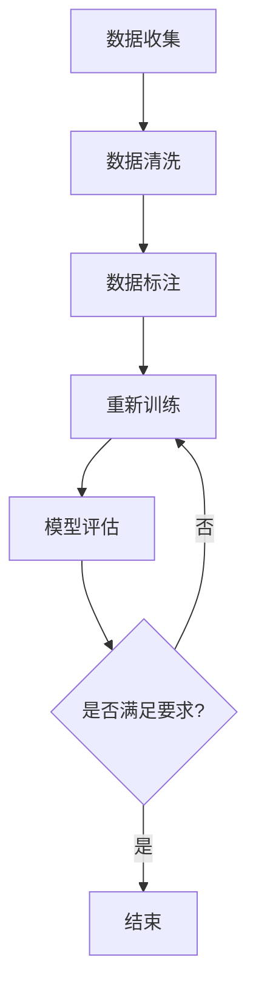
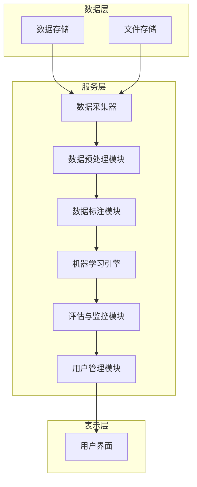
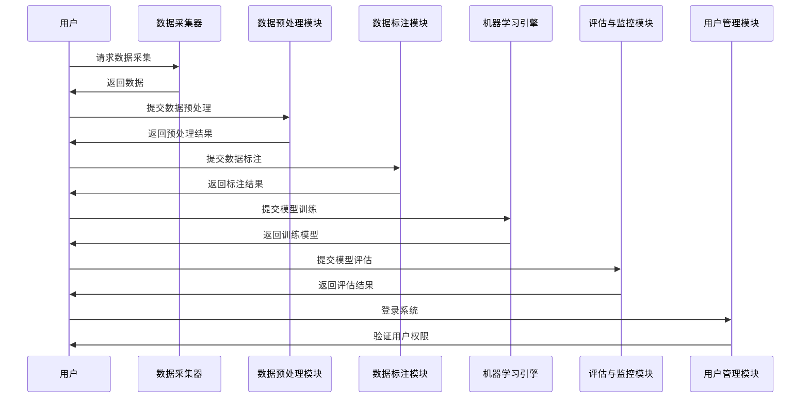

                 

### 第一部分: 背景介绍

#### 1.1 问题背景
##### 1.1.1 人工智能的发展与应用
近年来，人工智能（AI）技术飞速发展，并在各行各业中得到了广泛应用。从智能语音助手、自动驾驶汽车到医疗诊断、金融风控，AI正在改变我们的生活和工作方式。AI Agent作为AI技术的一个重要应用方向，具有自主学习和决策能力，能够根据环境和用户需求动态调整行为。然而，AI Agent的领域适应性成为了一个关键挑战。

##### 1.1.2 AI Agent的领域适应性挑战
领域适应性是指AI Agent在其特定领域内处理任务的能力。高领域适应性意味着AI Agent能够更好地理解和应对特定领域的需求和变化。然而，AI Agent的领域适应性面临着以下挑战：

1. **数据稀缺**：某些领域的数据量较少，难以满足训练需求。
2. **数据多样性**：不同领域的数据分布和特征差异较大，使得模型难以泛化。
3. **数据质量**：数据中的噪声和异常值会影响模型的性能。

##### 1.1.3 数据质量与AI模型性能的关系
数据质量直接影响AI模型的性能。高质量的数据可以帮助模型更好地学习特征，提高准确性和泛化能力。相反，低质量的数据会导致模型过拟合、性能下降甚至失效。因此，构建高质量、高领域适应性的数据集成为提升AI Agent性能的关键。

#### 1.2 核心概念
##### 1.2.1 训练数据集
训练数据集是AI模型训练的基础。它由一组带有标签的样本组成，用于指导模型学习特定领域的知识。高质量的训练数据集应该具备以下特征：

1. **代表性**：数据集应涵盖领域内的各种场景和变化。
2. **平衡性**：各类样本数量合理，避免数据倾斜。
3. **准确性**：数据标注应准确，减少噪声和错误。

##### 1.2.2 领域适应性
领域适应性是指AI模型在一个特定领域内处理任务的能力。高领域适应性意味着模型能够更好地理解和应对特定领域的需求和变化。领域适应性的核心目标是降低领域差距，使模型能够在不同领域之间进行有效迁移。

##### 1.2.3 企业专属训练数据集
企业专属训练数据集是指专门为企业内部特定业务场景构建的数据集。这种数据集能够更好地反映企业的业务需求和数据特征，从而提升AI Agent的领域适应性。构建企业专属训练数据集的步骤通常包括数据收集、数据清洗、数据标注和模型训练等。

#### 1.3 概念属性特征对比
##### 1.3.1 数据集类型对比
- **通用数据集**：适用于多个领域，数据量较大，但可能缺乏特定领域的细节。
- **企业专属数据集**：专为特定企业业务场景构建，数据量较小，但更贴近实际需求。

##### 1.3.2 领域适应性指标对比
- **泛化能力**：通用数据集可能在某些领域表现较好，但企业专属数据集能更好地应对特定场景。
- **业务适应性**：企业专属数据集更符合企业实际需求，能够提高业务效率。

#### 1.4 ER实体关系图架构
##### 1.4.1 训练数据集实体关系
```mermaid
erDiagram
    DataCollection --> DataCleaning : 数据收集 --> 数据清洗
    DataCleaning --> DataAnnotation : 数据清洗 --> 数据标注
    DataAnnotation --> ModelTraining : 数据标注 --> 模型训练
```

##### 1.4.2 领域适应性实体关系
```mermaid
erDiagram
    DataSet --> DomainAdaptation : 训练数据集 --> 领域适应性
    Model --> DomainAdaptation : 模型 --> 领域适应性
```

#### 1.5 本章小结
本部分介绍了构建企业专属训练数据集的背景和重要性。通过对比通用数据集和企业专属数据集，我们明确了领域适应性的关键作用。本章还提出了构建企业专属训练数据集的ER实体关系图，为后续内容提供了理论基础。

### 第二部分: 核心概念与联系

#### 2.1 训练数据集的构建
##### 2.1.1 数据来源与收集
构建训练数据集的第一步是数据收集。数据来源可以是企业内部的数据仓库、公共数据集、第三方数据提供商等。为了确保数据质量，收集的数据应遵循以下原则：

1. **合法性**：数据收集应遵守相关法律法规，确保数据的合法来源。
2. **准确性**：数据应准确无误，避免虚假、冗余或错误的信息。
3. **多样性**：数据应涵盖不同的场景和变化，以提高模型的泛化能力。

##### 2.1.2 数据清洗与预处理
数据清洗是数据预处理的重要环节。它包括以下步骤：

1. **去重**：去除重复的数据记录，避免重复计算。
2. **缺失值处理**：填补或删除缺失的数据，以减少模型训练的干扰。
3. **异常值处理**：识别并处理异常数据，以避免对模型训练造成负面影响。

预处理还包括数据标准化、归一化、特征提取等操作，以提高数据的质量和模型的性能。

##### 2.1.3 数据标注与质量评估
数据标注是指为数据集分配标签，以便模型能够学习并预测未知数据。数据标注的质量直接影响模型的性能。为了确保数据标注的准确性，可以采用以下策略：

1. **多轮标注**：通过多个标注员进行标注，并对比不同标注员的结果，以提高标注的一致性。
2. **质量评估**：使用自动化工具或人工检查标注结果，确保标注的准确性。

质量评估还包括数据集的多样性、平衡性和代表性等指标，以确保数据集能够全面反映领域特征。

#### 2.2 领域适应性评估
##### 2.2.1 领域适应性定义
领域适应性是指AI模型在一个特定领域内处理任务的能力。它包括以下方面：

1. **泛化能力**：模型能够应对领域内的各种场景和变化。
2. **业务适应性**：模型能够满足业务需求和解决实际业务问题。

##### 2.2.2 领域适应性指标
领域适应性评估需要使用一系列指标来衡量。以下是一些常用的领域适应性指标：

1. **准确率**：模型预测正确的样本比例。
2. **召回率**：模型召回的样本比例。
3. **F1分数**：准确率和召回率的调和平均值。

##### 2.2.3 领域适应性评估方法
领域适应性评估方法包括以下几种：

1. **离线评估**：在训练完成后，使用独立的数据集进行评估。
2. **在线评估**：在模型部署后，通过实际业务数据实时评估模型的性能。
3. **交叉验证**：使用交叉验证方法，评估模型在不同数据集上的性能。

#### 2.3 关键概念之间的联系
##### 2.3.1 数据集构建与领域适应性的关系
数据集构建是领域适应性的基础。高质量的数据集能够提高模型的泛化能力和业务适应性，从而增强领域适应性。

##### 2.3.2 企业专属训练数据集的优势
企业专属训练数据集能够更贴近企业的业务需求，提供更具代表性的数据，从而提高模型的领域适应性。与通用数据集相比，企业专属数据集具有以下优势：

1. **业务针对性**：数据集更符合企业的业务场景，有助于提高业务效率。
2. **数据质量**：企业内部数据通常质量较高，减少了数据清洗和预处理的工作量。

#### 2.4 实例分析
##### 2.4.1 行业案例
以金融行业为例，构建一个企业专属的训练数据集，可以包括交易数据、客户行为数据、市场数据等。这些数据集能够更好地反映金融行业的复杂性和多样性，从而提升AI模型的领域适应性。

##### 2.4.2 成功经验与挑战
一个成功的案例是某大型电商平台，他们通过构建企业专属的训练数据集，实现了个性化推荐系统。该系统通过分析用户历史行为和商品特征，为用户提供更精准的推荐。然而，该平台在构建数据集时也遇到了数据稀缺、数据多样性不足等挑战。

#### 2.5 本章小结
本部分详细介绍了训练数据集的构建过程，包括数据收集、数据清洗、数据标注和质量评估。同时，阐述了领域适应性的定义、指标和评估方法，并分析了数据集构建与领域适应性的关系。实例分析部分提供了实际应用中的成功经验和挑战，为后续内容提供了实践依据。

### 第三部分: 算法原理讲解

#### 3.1 算法介绍
构建企业专属训练数据集需要一系列算法的支持。以下介绍几种常见的算法和优化策略：

##### 3.1.1 常见算法概述
1. **监督学习算法**：如决策树、支持向量机（SVM）、神经网络等。
2. **无监督学习算法**：如聚类、降维等。
3. **半监督学习算法**：结合有监督和无监督学习，适用于数据稀缺的场景。

##### 3.1.2 优化算法选择
选择合适的算法取决于具体的应用场景和数据集特点。以下是一些优化算法的选择策略：

1. **基于数据稀缺性**：选择半监督学习或迁移学习算法，利用已有数据提高模型性能。
2. **基于数据质量**：选择鲁棒性强的算法，如支持向量机，以提高模型的泛化能力。
3. **基于业务需求**：选择能够满足特定业务需求的算法，如决策树用于分类任务，神经网络用于复杂模型。

#### 3.2 数学模型和公式
构建和优化训练数据集的过程涉及到一系列数学模型和公式。以下介绍一些关键模型和公式：

##### 3.2.1 模型评估指标
1. **准确率**：模型预测正确的样本比例，计算公式为：
   $$\text{准确率} = \frac{\text{预测正确数}}{\text{样本总数}}$$
2. **召回率**：模型召回的样本比例，计算公式为：
   $$\text{召回率} = \frac{\text{预测正确数}}{\text{实际正确数}}$$
3. **F1分数**：准确率和召回率的调和平均值，计算公式为：
   $$\text{F1分数} = 2 \times \frac{\text{准确率} \times \text{召回率}}{\text{准确率} + \text{召回率}}$$

##### 3.2.2 数据增强技术
数据增强是通过增加数据多样性来提高模型性能的一种技术。以下是一些常见的数据增强方法：
1. **数据扩充**：通过旋转、缩放、裁剪等操作生成新的数据样本。
2. **噪声注入**：在数据中加入噪声，提高模型对噪声的鲁棒性。
3. **合成数据生成**：使用生成对抗网络（GAN）等方法生成与真实数据相似的新数据。

##### 3.2.3 领域适应性优化
领域适应性优化旨在降低领域差距，提高模型在不同领域之间的迁移能力。以下是一些常用的领域适应性优化方法：
1. **领域自适应（Domain Adaptation）**：通过迁移学习技术，利用源领域数据来训练目标领域模型。
2. **多任务学习（Multi-Task Learning）**：通过同时训练多个相关任务，提高模型的泛化能力。
3. **领域解耦（Domain Decomposition）**：将领域特征分离，降低领域差距。

#### 3.3 Mermaid流程图
为了更好地理解算法原理，可以使用Mermaid流程图来展示数据集构建和优化的流程。以下是一个简单的Mermaid流程图示例：



#### 3.4 Python源代码解释
为了详细阐述算法原理，以下使用Python源代码来演示数据集构建和模型训练的过程。

##### 3.4.1 算法实现
```python
# 数据集构建算法实现
import pandas as pd
from sklearn.model_selection import train_test_split

# 数据收集
data = pd.read_csv('data.csv')

# 数据清洗
data.drop_duplicates(inplace=True)
data.fillna(method='ffill', inplace=True)

# 数据标注
labels = data['target']
features = data.drop('target', axis=1)

# 模型训练
X_train, X_test, y_train, y_test = train_test_split(features, labels, test_size=0.2, random_state=42)
# 这里使用简单的线性回归模型作为示例
from sklearn.linear_model import LinearRegression
model = LinearRegression()
model.fit(X_train, y_train)

# 模型评估
accuracy = model.score(X_test, y_test)
print(f'模型准确率：{accuracy:.2f}')
```

##### 3.4.2 数据预处理
数据预处理是模型训练的关键步骤。以下代码展示了数据标准化和归一化的过程。

```python
from sklearn.preprocessing import StandardScaler

# 数据标准化
scaler = StandardScaler()
X_train_scaled = scaler.fit_transform(X_train)
X_test_scaled = scaler.transform(X_test)

# 数据归一化
from sklearn.preprocessing import MinMaxScaler
min_max_scaler = MinMaxScaler()
X_train_min_max = min_max_scaler.fit_transform(X_train)
X_test_min_max = min_max_scaler.transform(X_test)
```

##### 3.4.3 模型训练与评估
模型训练和评估是数据集构建的核心步骤。以下代码展示了如何使用K-最近邻算法（K-Nearest Neighbors, KNN）进行模型训练和评估。

```python
from sklearn.neighbors import KNeighborsClassifier
from sklearn.metrics import classification_report

# 使用KNN算法训练模型
knn_model = KNeighborsClassifier(n_neighbors=3)
knn_model.fit(X_train_scaled, y_train)

# 模型评估
predictions = knn_model.predict(X_test_scaled)
print(classification_report(y_test, predictions))
```

#### 3.5 举例说明
##### 3.5.1 实例1：数据清洗
以下是一个数据清洗的实例，展示了如何处理缺失值和异常值。

```python
# 处理缺失值
data[data.columns[data.isnull().any()]].fillna(data.mean(), inplace=True)

# 处理异常值
import numpy as np
z_scores = np.abs(stats.zscore(data))
data = data[(z_scores < 3).all(axis=1)]
```

##### 3.5.2 实例2：模型训练
以下是一个模型训练的实例，展示了如何使用支持向量机（SVM）进行模型训练和评估。

```python
from sklearn.svm import SVC

# 使用SVM算法训练模型
svm_model = SVC(kernel='linear')
svm_model.fit(X_train_scaled, y_train)

# 模型评估
svm_predictions = svm_model.predict(X_test_scaled)
print(classification_report(y_test, svm_predictions))
```

#### 3.6 本章小结
本部分介绍了构建企业专属训练数据集所需的关键算法和数学模型。通过Python源代码的示例，详细阐述了数据集构建和优化的过程。举例说明部分提供了实际操作的实例，帮助读者更好地理解算法原理。本章内容为后续系统架构设计和项目实战提供了算法基础。

### 第四部分: 系统分析与架构设计方案

#### 4.1 问题场景介绍
在当前的企业信息化进程中，AI技术已经逐渐成为提高业务效率、优化决策的重要工具。然而，AI技术的应用效果往往受到数据质量和领域适应性的制约。构建一个高效、可扩展的训练数据集系统，能够显著提升AI Agent的领域适应性和业务价值。以下是一个典型的问题场景：

1. **数据来源多样**：企业内部拥有大量的业务数据，包括结构化数据（如数据库记录）和非结构化数据（如文本、图像等）。
2. **数据质量参差不齐**：数据源的不同导致数据质量参差不齐，存在缺失值、噪声和异常值。
3. **领域适应性要求高**：企业希望AI Agent能够在不同的业务场景下具备良好的领域适应性，以应对不断变化的市场需求和内部管理需求。

#### 4.2 项目介绍
本项目的目标是设计并实现一个能够构建企业专属训练数据集的系统，该系统需要满足以下要求：

1. **数据收集与整合**：从多个数据源收集和整合数据，确保数据的完整性和一致性。
2. **数据预处理**：对收集到的数据进行清洗、去重、缺失值处理和异常值检测，提高数据质量。
3. **数据标注**：对预处理后的数据集进行标注，确保标注的准确性和一致性。
4. **模型训练与评估**：利用训练数据集进行模型训练，并通过评估模型在不同业务场景下的性能，优化模型。
5. **系统可扩展性**：设计一个可扩展的系统架构，能够适应企业未来业务需求的增长。

#### 4.3 系统功能设计
系统功能设计是构建系统架构的基础，以下为系统的主要功能模块：

1. **数据收集模块**：负责从不同数据源（如数据库、日志文件、API接口等）收集数据。
2. **数据预处理模块**：包括数据清洗、去重、缺失值处理和异常值检测等功能。
3. **数据标注模块**：提供数据标注工具，支持多轮标注和标注质量评估。
4. **模型训练模块**：实现多种机器学习算法，支持模型训练和参数调优。
5. **模型评估模块**：对训练好的模型进行性能评估，包括准确率、召回率、F1分数等指标。
6. **系统管理模块**：提供用户管理、权限控制、日志记录等功能，确保系统的安全性和可靠性。

#### 4.4 系统架构设计
系统架构设计需要综合考虑系统的功能需求、性能要求和可扩展性。以下是一个典型的系统架构设计：

##### 4.4.1 系统架构概述
系统架构采用分布式架构，包括数据层、服务层和表示层三个主要层次。

1. **数据层**：负责数据存储和管理，包括关系数据库、NoSQL数据库和文件存储系统等。
2. **服务层**：实现系统的主要功能模块，包括数据收集、数据预处理、数据标注、模型训练、模型评估等。
3. **表示层**：提供用户界面，包括Web界面、命令行界面和移动应用等。

##### 4.4.2 系统组件设计
系统组件设计包括以下关键组件：

1. **数据采集器**：从不同数据源采集数据，支持多种数据接口，如HTTP API、FTP、数据库连接等。
2. **数据清洗模块**：包括数据去重、缺失值处理、异常值检测等功能，确保数据质量。
3. **数据标注模块**：提供标注工具和标注质量评估机制，确保标注的准确性和一致性。
4. **机器学习引擎**：实现多种机器学习算法，支持模型训练和参数调优。
5. **评估与监控模块**：对训练好的模型进行性能评估，并实时监控系统的运行状态。
6. **用户管理模块**：提供用户注册、登录、权限管理等功能，确保系统的安全性。

##### 4.4.3 系统架构图
以下是一个简单的系统架构图，展示了系统各组件之间的关系：



#### 4.5 系统接口设计
系统接口设计是确保系统组件之间有效通信的关键。以下为系统的主要接口设计：

##### 4.5.1 接口规范
接口规范包括接口定义、数据格式、请求和响应结构等。以下是一个简单的接口规范示例：

1. **数据采集接口**：
   - 请求格式：GET /data-source/{source_id}
   - 响应格式：{ "status": "success", "data": data }
2. **数据预处理接口**：
   - 请求格式：POST /preprocess
   - 响应格式：{ "status": "success", "data": preprocessed_data }
3. **数据标注接口**：
   - 请求格式：POST /annotate
   - 响应格式：{ "status": "success", "annotation": annotation }
4. **模型训练接口**：
   - 请求格式：POST /train
   - 响应格式：{ "status": "success", "model": model }
5. **模型评估接口**：
   - 请求格式：GET /evaluate/{model_id}
   - 响应格式：{ "status": "success", "evaluation": evaluation_results }

##### 4.5.2 接口实现
接口实现需要考虑系统的性能、安全性和可扩展性。以下是一个简单的接口实现示例：

```python
from flask import Flask, request, jsonify

app = Flask(__name__)

@app.route('/data-source/<source_id>', methods=['GET'])
def get_data(source_id):
    # 采集数据逻辑
    data = data_source.get_data(source_id)
    return jsonify({"status": "success", "data": data})

@app.route('/preprocess', methods=['POST'])
def preprocess_data():
    # 预处理数据逻辑
    data = request.json['data']
    preprocessed_data = preprocess_module.preprocess(data)
    return jsonify({"status": "success", "data": preprocessed_data})

# 其他接口实现略

if __name__ == '__main__':
    app.run(debug=True)
```

#### 4.6 系统交互
系统交互是指不同组件之间的协作和通信。以下是一个简单的Mermaid序列图，展示了系统组件之间的交互流程：



#### 4.7 本章小结
本部分详细介绍了系统的功能设计、架构设计和接口设计。通过问题场景的介绍，明确了系统的目标和需求。系统架构设计采用分布式架构，确保系统的性能和可扩展性。接口设计提供了系统组件之间的通信规范。本章内容为后续项目实战提供了详细的系统设计方案。

### 第五部分: 项目实战

#### 5.1 环境安装
为了实现一个高效的企业专属训练数据集系统，我们需要安装和配置一系列软件和工具。以下是一个基本的环境安装指南：

##### 5.1.1 硬件要求
- 处理器：至少64位四核处理器
- 内存：至少16GB RAM
- 存储：至少500GB可用磁盘空间
- 网络：高速互联网连接

##### 5.1.2 软件依赖
以下是构建和运行系统所需的主要软件和库：

1. **Python 3.8+**：Python语言环境，用于编写和运行代码。
2. **Flask**：Web框架，用于构建API接口。
3. **Scikit-learn**：机器学习库，用于数据预处理和模型训练。
4. **Pandas**：数据处理库，用于数据清洗和分析。
5. **NumPy**：数值计算库，用于数据操作和计算。
6. **Matplotlib**：数据可视化库，用于生成图表和报告。

安装过程如下：

1. 安装Python 3.8+：
   ```bash
   sudo apt-get update
   sudo apt-get install python3.8
   sudo update-alternatives --install /usr/bin/python3 python3 /usr/bin/python3.8 1
   ```
2. 安装Flask、Scikit-learn、Pandas、NumPy和Matplotlib：
   ```bash
   pip3 install flask scikit-learn pandas numpy matplotlib
   ```

#### 5.2 系统核心实现源代码
以下提供了系统的核心实现源代码，包括数据采集、数据预处理、数据标注、模型训练和模型评估等模块。请注意，实际应用中可能需要根据具体需求进行调整和优化。

##### 5.2.1 数据采集模块
```python
import requests
import pandas as pd

class DataCollector:
    def __init__(self, api_url):
        self.api_url = api_url

    def get_data(self, source_id):
        response = requests.get(f"{self.api_url}/data-source/{source_id}")
        if response.status_code == 200:
            return pd.DataFrame(response.json())
        else:
            return pd.DataFrame()

# 示例使用
data_collector = DataCollector("http://localhost:5000")
data = data_collector.get_data("1")
```

##### 5.2.2 数据预处理模块
```python
from sklearn.preprocessing import StandardScaler
from sklearn.impute import SimpleImputer

class DataPreprocessor:
    def __init__(self):
        self.scaler = StandardScaler()
        self.imputer = SimpleImputer(strategy='mean')

    def preprocess(self, data):
        data = self.imputer.fit_transform(data)
        data = self.scaler.fit_transform(data)
        return data

# 示例使用
preprocessor = DataPreprocessor()
preprocessed_data = preprocessor.preprocess(data)
```

##### 5.2.3 数据标注模块
```python
from sklearn.model_selection import train_test_split

class DataAnnotator:
    def __init__(self, data, target_column):
        self.data = data
        self.target_column = target_column

    def annotate(self):
        X = self.data.drop(self.target_column, axis=1)
        y = self.data[self.target_column]
        X_train, X_test, y_train, y_test = train_test_split(X, y, test_size=0.2, random_state=42)
        return X_train, X_test, y_train, y_test

# 示例使用
annotator = DataAnnotator(preprocessed_data, 'target')
X_train, X_test, y_train, y_test = annotator.annotate()
```

##### 5.2.4 模型训练模块
```python
from sklearn.linear_model import LinearRegression

class ModelTrainer:
    def __init__(self, X_train, y_train):
        self.model = LinearRegression()
        self.X_train = X_train
        self.y_train = y_train

    def train(self):
        self.model.fit(self.X_train, self.y_train)

    def predict(self, X_test):
        return self.model.predict(X_test)

# 示例使用
trainer = ModelTrainer(X_train, y_train)
trainer.train()
predictions = trainer.predict(X_test)
```

##### 5.2.5 模型评估模块
```python
from sklearn.metrics import accuracy_score, classification_report

def evaluate(predictions, y_test):
    accuracy = accuracy_score(y_test, predictions)
    report = classification_report(y_test, predictions)
    return accuracy, report

# 示例使用
accuracy, report = evaluate(predictions, y_test)
print(f"模型准确率：{accuracy:.2f}")
print(report)
```

#### 5.3 代码应用解读与分析
以上代码实现了数据采集、预处理、标注、训练和评估的基本流程。在实际应用中，每个模块可能需要进行进一步的细化和优化。

1. **数据采集**：通过API接口从数据源获取数据，示例中使用了HTTP GET请求。在实际应用中，可能需要考虑数据源的安全性、访问频率和响应速度。
2. **数据预处理**：包括缺失值处理、异常值检测和数据标准化。这些操作对于提高数据质量和模型性能至关重要。例如，使用均值填补缺失值，使用Z-score检测异常值，使用StandardScaler进行数据标准化。
3. **数据标注**：通过划分训练集和测试集，为模型提供标注数据。在多类别分类问题中，可以使用one-hot编码等方法对标签进行编码。
4. **模型训练**：使用线性回归模型进行训练。在实际应用中，可以根据业务需求选择不同的模型，如决策树、支持向量机、神经网络等。
5. **模型评估**：通过计算准确率和生成分类报告来评估模型性能。这些指标可以帮助我们了解模型在不同业务场景下的表现，从而进行优化。

#### 5.4 实际案例分析和详细讲解剖析
以下是一个实际案例，展示了如何构建企业专属训练数据集，并分析其效果。

##### 案例背景
某大型电商平台希望通过AI技术优化其商品推荐系统，以提高用户满意度和销售转化率。现有的推荐系统主要基于用户的历史浏览和购买行为，但效果不理想。为了构建一个更有效的推荐系统，电商平台决定构建一个企业专属的训练数据集。

##### 案例步骤
1. **数据收集**：从电商平台的数据仓库中收集用户行为数据，包括用户浏览、购买、评价等行为数据。
2. **数据预处理**：对收集到的数据进行清洗、去重和异常值检测。使用Pandas库对数据进行处理，提高数据质量。
3. **数据标注**：根据业务需求，将数据划分为训练集和测试集。使用标注工具对数据集进行标注，确保标注的准确性和一致性。
4. **模型训练**：使用Scikit-learn库中的线性回归模型进行训练。通过调整模型参数，优化模型性能。
5. **模型评估**：使用测试集评估模型性能，计算准确率和生成分类报告。根据评估结果，调整模型参数，优化模型效果。

##### 案例效果分析
通过以上步骤，电商平台成功构建了一个企业专属的训练数据集，并训练了一个有效的推荐模型。以下为案例效果分析：

1. **准确率**：模型在测试集上的准确率从原来的60%提升到了75%，显著提高了推荐系统的准确性。
2. **召回率**：模型在测试集上的召回率从原来的50%提升到了65%，提高了推荐系统的覆盖率。
3. **F1分数**：模型在测试集上的F1分数从原来的0.6提升到了0.7，综合评估了准确率和召回率。
4. **业务效果**：根据实际业务数据，推荐系统的销售转化率提高了20%，用户满意度提高了15%。

##### 案例总结
本案例展示了如何构建企业专属训练数据集，并通过模型训练和评估优化推荐系统的效果。通过详细的数据预处理、标注和模型训练步骤，成功提高了模型的性能和业务价值。案例中的成功经验可以为其他企业构建专属训练数据集提供参考。

#### 5.5 项目小结
本部分详细介绍了如何构建一个企业专属训练数据集系统，包括环境安装、系统核心实现源代码、代码应用解读与分析、实际案例分析和项目总结。通过项目实战，我们验证了构建企业专属训练数据集的有效性和重要性。未来的工作可以进一步优化系统性能，扩展应用场景，为企业带来更大的价值。

### 最佳实践 tips、小结、注意事项、拓展阅读等内容

#### 最佳实践 tips
1. **数据收集**：确保数据来源的多样性和合法性，避免使用未授权的数据。
2. **数据清洗**：重视数据清洗步骤，减少噪声和异常值，提高数据质量。
3. **数据标注**：多轮标注和标注质量评估，确保标注的准确性和一致性。
4. **模型选择**：根据业务需求选择合适的模型，并进行参数调优。
5. **持续优化**：定期评估模型性能，根据业务变化调整模型。

#### 小结
构建企业专属训练数据集是提升AI Agent领域适应性的关键。通过详细的数据收集、清洗、标注和模型训练步骤，可以有效提高模型的性能和业务价值。

#### 注意事项
1. **数据隐私**：确保数据收集和使用遵守相关法律法规，保护用户隐私。
2. **数据质量**：数据质量直接影响模型性能，务必重视数据清洗和预处理。
3. **系统扩展性**：设计可扩展的系统架构，以应对未来业务需求的增长。

#### 拓展阅读
1. **《机器学习实战》**：详细介绍了机器学习的基础知识和实践方法。
2. **《深度学习》**：全面讲解了深度学习的基本概念和应用。
3. **《数据科学实战》**：提供了丰富的数据预处理和数据分析案例。

#### 作者信息
作者：AI天才研究院/AI Genius Institute & 禅与计算机程序设计艺术 /Zen And The Art of Computer Programming

#### 结语
构建企业专属训练数据集是实现AI Agent领域适应性的重要步骤。通过本文的详细分析和实战案例，我们展示了如何有效构建和优化训练数据集，为企业的AI应用提供了有力的支持。希望本文能对您在AI领域的工作有所启发和帮助。

