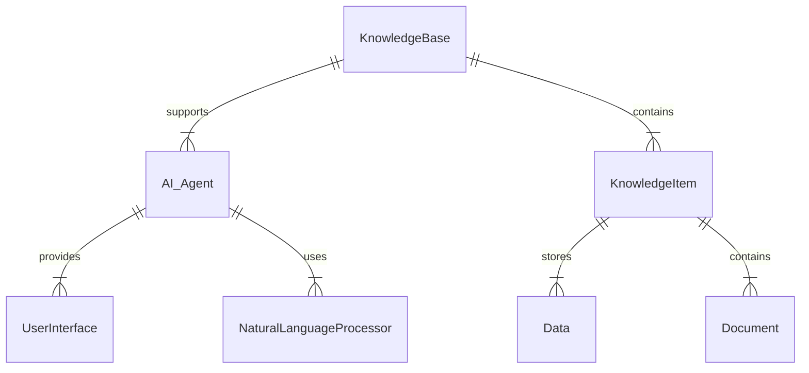

                 

# 构建企业知识库：为AI Agent提供专业领域支持

## 关键词：企业知识库、AI Agent、知识管理、人工智能、系统架构设计

## 摘要

在数字化转型的浪潮下，企业知识库的构建成为了提高业务效率和创新能力的关键。AI Agent作为一种智能化的知识处理工具，其专业领域支持需求日益凸显。本文将围绕企业知识库的构建，探讨其如何为AI Agent提供专业领域支持，并通过深入分析知识库的设计方法、AI Agent的知识嵌入与交互设计、系统架构设计以及项目实战等多个方面，详细阐述这一过程。通过本文，读者将全面了解企业知识库与AI Agent结合的理论基础和实践方法，为企业在数字化转型中引入AI技术提供有力的指导。

### 目录大纲

#### 第1章 引言

- **1.1 问题背景**：企业数字化转型的知识管理挑战
- **1.2 问题描述**：企业知识库与AI Agent的需求
- **1.3 问题解决**：构建企业知识库与AI Agent结合的路径
- **1.4 边界与外延**：知识库与AI Agent的适用领域与限制
- **1.5 概念结构与核心要素组成**：企业知识库与AI Agent的基本组成部分
- **1.6 本章小结**：企业知识库与AI Agent结合的意义与主要内容预告

#### 第2章 核心概念与联系

- **2.1 企业知识库概念解析**：知识库的定义、类型与结构
- **2.2 AI Agent概念解析**：AI Agent的定义、类型与应用
- **2.3 企业知识库与AI Agent的联系**：知识库在AI Agent中的作用与需求
- **2.4 概念属性特征对比表格**：企业知识库与AI Agent特征对比
- **2.5 ER实体关系图架构**：知识库与AI Agent的实体关系图
- **2.6 本章小结**：核心概念与联系概述与后续章节预告

#### 第3章 知识库构建方法

- **3.1 知识库设计原则**：知识库的体系结构设计、数据管理策略
- **3.2 知识库内容来源**：内部知识来源、外部知识来源
- **3.3 知识库构建流程**：知识采集与整理、知识建模与存储、知识检索与推送
- **3.4 实例分析**：某企业知识库构建实践与挑战解决
- **3.5 本章小结**：知识库构建关键环节与主要内容预告

#### 第4章 AI Agent的知识嵌入

- **4.1 AI Agent的体系结构**：AI Agent的基本组成部分、工作流程
- **4.2 知识嵌入方法**：知识表示方法、知识获取与更新
- **4.3 知识推理与应用**：知识推理算法、知识在实际应用中的展示
- **4.4 知识嵌入案例分析**：某AI Agent的知识嵌入实践与效果分析
- **4.5 本章小结**：AI Agent的知识嵌入机制与主要内容预告

#### 第5章 AI Agent的交互设计

- **5.1 用户界面设计**：交互界面布局与风格、用户需求分析与设计
- **5.2 交互流程设计**：交互模型与流程、交互效果评估与优化
- **5.3 自然语言处理**：NLP在交互中的应用、NLP算法与模型
- **5.4 交互案例研究**：某AI Agent交互设计实践与经验教训
- **5.5 本章小结**：AI Agent交互设计要点与主要内容预告

#### 第6章 系统架构设计

- **6.1 系统功能设计**：知识库管理系统功能、AI Agent功能模块
- **6.2 系统架构设计**：整体架构设计、模块间交互设计
- **6.3 索统接口设计**：系统接口规范、接口调用流程
- **6.4 系统交互**：用户与系统交互流程、系统内部交互机制
- **6.5 本章小结**：系统架构设计核心要素与主要内容预告

#### 第7章 项目实战

- **7.1 环境安装**：硬件与软件环境配置、系统安装与部署
- **7.2 系统核心实现**：知识库构建与维护、AI Agent开发与集成
- **7.3 代码应用解读与分析**：代码结构与功能模块、代码实现细节解析
- **7.4 实际案例分析**：项目背景与目标、项目实施过程与效果
- **7.5 项目小结**：项目成果与总结、未来发展方向与改进建议

### 第1章 引言

#### 1.1 问题背景

随着全球数字化转型的加速，企业面临的信息爆炸和知识管理挑战愈发严峻。在传统管理模式下，知识往往分散在不同部门和个人手中，难以高效利用和共享。特别是在面对复杂业务场景和多变的竞争环境时，企业需要快速获取、处理和应用相关领域的专业知识，以提高决策效率和业务创新能力。

知识管理作为企业数字化转型的核心要素之一，逐渐受到广泛关注。然而，如何有效地构建和利用企业知识库，以支持人工智能（AI）技术的发展和应用，成为当前企业面临的重要问题。AI Agent作为一种智能化的知识处理工具，其专业领域支持需求日益凸显。

#### 1.2 问题描述

企业知识库在数字化转型中的重要性不言而喻。首先，企业知识库是企业内部知识资源的集中体现，通过系统化、结构化的方式存储和管理知识，有助于提高知识利用效率和降低知识流失风险。其次，企业知识库能够为AI Agent提供丰富的专业领域知识支持，使其在处理复杂业务场景时具备更强的智能推理能力和决策能力。

然而，AI Agent在获取和利用专业领域知识时也面临诸多挑战。一方面，专业领域知识的多样性和复杂性使得AI Agent需要具备较高的知识获取和处理能力。另一方面，AI Agent需要与人类用户进行自然语言交互，以理解和满足用户的需求，这进一步增加了AI Agent的知识管理和交互设计的复杂性。

因此，如何在构建企业知识库的过程中，为AI Agent提供专业领域支持，成为企业数字化转型中亟待解决的问题。本文将从以下几个方面展开讨论：

1. **企业知识库的构建原则**：介绍构建企业知识库的基本原则和方法，包括知识库的体系结构设计、数据管理策略等。
2. **AI Agent的知识嵌入与交互设计**：探讨AI Agent的知识嵌入方法、知识推理与应用，以及用户界面和交互流程的设计。
3. **系统架构设计**：介绍企业知识库与AI Agent结合的系统架构设计，包括系统功能设计、模块间交互设计、系统接口设计和系统交互等。
4. **项目实战**：通过实际案例分析，展示企业知识库与AI Agent结合的实践方法和效果。

#### 1.3 问题解决

构建企业知识库与AI Agent结合的路径如下：

1. **明确知识库构建目标和范围**：根据企业的业务需求和战略目标，明确知识库的构建目标和范围，确保知识库内容的专业性和实用性。
2. **设计知识库体系结构**：采用合适的知识库体系结构，如基于数据库的知识库、基于语义网络的知识库等，确保知识库的可扩展性和灵活性。
3. **构建知识库内容**：通过内部知识和外部知识的整合，构建丰富、准确和结构化的知识库内容，为AI Agent提供专业领域支持。
4. **实现AI Agent的知识嵌入与交互**：设计AI Agent的知识嵌入方法，如知识表示方法、知识获取与更新等，实现AI Agent在专业领域知识的获取、推理和应用。
5. **优化系统架构与交互设计**：基于系统架构设计，优化AI Agent的交互流程和用户界面，提高用户体验和业务价值。

#### 1.4 边界与外延

在企业知识库的构建过程中，需要明确知识库的范围和深度，以确保知识库内容的适用性和准确性。以下是一些边界与外延的考虑因素：

1. **知识库的范围**：知识库应覆盖企业核心业务领域和关键应用场景，如产品研发、市场营销、客户服务等。同时，根据业务需求的变化，知识库的范围应具备一定的扩展性。
2. **知识库的深度**：知识库的深度取决于专业领域知识的复杂性和应用需求。对于复杂业务场景，知识库应包含丰富的背景知识、数据模型和算法等，以提高AI Agent的智能推理能力和决策能力。
3. **AI Agent的适用领域与限制**：AI Agent的适用领域取决于其知识嵌入和交互设计的有效性。在构建企业知识库时，需要考虑AI Agent在特定领域的适用性和限制，以确保其能够提供有效的专业领域支持。
4. **知识库与AI Agent的交互设计**：知识库与AI Agent的交互设计需要充分考虑用户需求和应用场景，确保交互过程自然、流畅和高效。

#### 1.5 概念结构与核心要素组成

企业知识库与AI Agent的构建涉及到多个概念和核心要素。以下是对这些概念和核心要素的组成和关联的介绍：

1. **企业知识库**：
   - **定义**：企业知识库是企业内部知识资源的集中存储和管理系统，用于收集、整理、存储和共享各种知识。
   - **类型与结构**：
     - **基于数据库的知识库**：采用数据库技术存储和管理知识，支持快速查询和更新。
     - **基于语义网络的知识库**：利用语义网络模型表示知识，支持知识的自动推理和扩展。

2. **AI Agent**：
   - **定义**：AI Agent是指具备自主决策、任务执行和交互能力的智能体，能够模拟人类的智能行为，为企业提供智能化服务。
   - **类型与应用**：
     - **知识型AI Agent**：专注于提供知识查询、推理和决策支持，如专家系统、智能搜索等。
     - **交互型AI Agent**：具备自然语言处理和交互能力，能够与用户进行有效沟通，如聊天机器人、虚拟客服等。

3. **知识库与AI Agent的联系**：
   - **知识库在AI Agent中的作用**：知识库为AI Agent提供专业领域知识支持，使其具备智能推理和决策能力。
   - **AI Agent对知识库的需求**：AI Agent需要从知识库中获取相关领域的知识，以便进行任务执行和交互。

4. **核心要素组成**：
   - **知识库管理系统**：负责知识库的构建、管理和维护，包括知识采集、整理、存储、检索和推送等。
   - **AI Agent开发平台**：提供AI Agent的开发工具和框架，支持AI Agent的创建、训练、部署和交互。

#### 1.6 本章小结

本章首先介绍了企业数字化转型的知识管理挑战和AI Agent的需求，然后详细阐述了构建企业知识库与AI Agent结合的路径和边界与外延。通过明确知识库构建目标和范围、设计知识库体系结构、构建知识库内容、实现AI Agent的知识嵌入与交互以及优化系统架构与交互设计，企业可以构建一个具备专业领域支持能力的知识库，为AI Agent提供高效的知识服务。

接下来，本文将进一步探讨企业知识库与AI Agent的核心概念与联系，包括知识库与AI Agent的定义、类型与应用，以及它们之间的交互关系。在此基础上，将详细分析知识库构建方法，包括设计原则、内容来源、构建流程和实例分析。随后，将深入探讨AI Agent的知识嵌入和交互设计，包括知识嵌入方法、知识推理与应用、用户界面设计和交互流程设计。最后，本文将介绍系统架构设计和项目实战，通过实际案例展示企业知识库与AI Agent结合的实践方法和效果。

### 第2章 核心概念与联系

#### 2.1 企业知识库概念解析

**知识库**是一个存储和管理知识的信息系统，它包括各种形式的知识，如数据、文档、图表、图像、音频和视频等。知识库的设计目的是为了帮助用户快速、准确地获取所需信息，支持决策制定和业务流程的优化。

**知识库的类型与结构**可以分为以下几种：

1. **基于数据库的知识库**：
   - **特点**：采用数据库管理系统（如关系型数据库）存储和管理知识，支持数据的快速查询、更新和删除。
   - **结构**：通常包含数据表、索引、视图等，数据表用于存储具体的知识内容，索引用于优化查询性能。

2. **基于语义网络的知识库**：
   - **特点**：利用语义网络模型来表示知识，强调知识的语义关系和上下文。
   - **结构**：包括概念、关系、属性和实例等，通过语义网络可以实现对知识的自动推理和扩展。

#### 2.2 AI Agent概念解析

**AI Agent**（人工智能代理）是指能够模拟人类智能行为，自主执行任务并与其他系统或人进行交互的智能体。AI Agent的核心能力包括自主决策、任务执行、自然语言理解和自然语言生成等。

**AI Agent的类型与应用**主要包括以下几类：

1. **知识型AI Agent**：
   - **特点**：专注于提供知识查询、推理和决策支持。
   - **应用**：如专家系统、智能搜索、智能问答等。

2. **交互型AI Agent**：
   - **特点**：具备自然语言处理和交互能力，能够与用户进行有效沟通。
   - **应用**：如聊天机器人、虚拟客服、智能助手等。

3. **服务型AI Agent**：
   - **特点**：专注于为用户提供个性化服务，如推荐系统、智能导航等。
   - **应用**：如电商平台推荐系统、智能交通系统等。

#### 2.3 企业知识库与AI Agent的联系

**知识库在AI Agent中的作用**：

- **知识支持**：知识库为AI Agent提供专业领域知识，使其能够更好地理解和处理复杂业务场景。
- **推理能力**：通过知识库，AI Agent可以运用推理算法，进行智能推理和决策支持。
- **交互能力**：知识库中的知识可以帮助AI Agent更好地理解和生成自然语言，提高与用户的交互质量。

**AI Agent对知识库的需求**：

- **知识获取**：AI Agent需要从知识库中获取所需的专业领域知识，以便进行任务执行和决策支持。
- **知识更新**：随着业务环境的变化，AI Agent需要及时获取最新的知识库内容，保持其知识库的时效性和准确性。
- **知识扩展**：AI Agent需要能够根据新需求扩展知识库内容，提高其应用范围和适应性。

#### 2.4 概念属性特征对比表格

下面是一个关于企业知识库与AI Agent的概念属性特征对比表格：

| 特征 | 企业知识库 | AI Agent |
| --- | --- | --- |
| 定义 | 知识存储与管理系统 | 自主执行任务的智能体 |
| 类型 | 基于数据库、基于语义网络 | 知识型、交互型、服务型 |
| 功能 | 知识存储、检索、推送 | 知识查询、推理、交互、决策 |
| 结构 | 数据库、语义网络 | 模型、算法、用户界面 |
| 应用领域 | 企业内部知识管理 | 知识服务、智能交互、个性化服务 |

#### 2.5 ER实体关系图架构

为了更好地理解企业知识库与AI Agent的概念和关系，下面是一个ER（实体-关系）实体关系图架构的示例：



在这个ER实体关系图中，`KnowledgeBase`是知识库的实体，包含了`KnowledgeItem`实体，表示知识库中的各种知识项。`AI_Agent`是AI代理的实体，它与`KnowledgeBase`通过`supports`关系相连，表示AI代理支持知识库。`UserInterface`和`NaturalLanguageProcessor`是AI代理的组成部分，分别表示用户界面和自然语言处理模块。`KnowledgeItem`与`Data`和`Document`实体通过`stores`和`contains`关系相连，表示知识项存储数据或文档。

#### 2.6 本章小结

本章详细介绍了企业知识库与AI Agent的核心概念与联系，包括知识库与AI Agent的定义、类型与应用，以及它们之间的相互作用。通过对比表格和ER实体关系图，读者可以更清晰地理解这两个概念的特点和关系。接下来，本文将探讨知识库构建方法，包括设计原则、内容来源、构建流程和实例分析。这些内容将为企业构建高效、实用的知识库提供指导。在下一章中，我们将深入探讨AI Agent的知识嵌入与交互设计，包括知识嵌入方法、知识推理与应用、用户界面设计和交互流程设计，以进一步探讨AI Agent在实际应用中的实现细节。

### 第3章 知识库构建方法

#### 3.1 知识库设计原则

构建一个高效、实用的企业知识库，需要遵循一系列设计原则，以确保知识库的结构合理、内容丰富、易于管理和扩展。以下是知识库设计过程中需要考虑的主要原则：

1. **实用性原则**：
   - **目标明确**：知识库的设计应紧密结合企业的业务需求，明确知识库的应用场景和目标用户群体。
   - **内容相关**：知识库的内容应与企业的核心业务领域紧密相关，确保知识库中的知识能够为企业的决策和业务流程提供有力支持。

2. **系统性原则**：
   - **结构清晰**：知识库的结构应层次分明，便于用户快速查找和访问所需知识。
   - **数据一致**：知识库中的数据应保持一致，避免出现重复、矛盾或过时的信息。

3. **可扩展性原则**：
   - **模块化设计**：知识库应采用模块化设计，便于后续扩展和升级。
   - **灵活配置**：知识库系统应具备灵活的配置能力，可以根据企业的需求调整和优化知识库的功能和结构。

4. **安全性原则**：
   - **数据安全**：知识库中的数据应进行加密存储，确保数据不被未授权用户访问或篡改。
   - **权限管理**：知识库应实现严格的权限管理，不同用户根据角色和权限访问和操作知识库。

5. **易用性原则**：
   - **用户友好**：知识库的界面设计和操作流程应简单直观，降低用户的学习成本。
   - **检索便捷**：知识库应提供强大的检索功能，支持关键词搜索、分类浏览等多种检索方式。

6. **可持续性原则**：
   - **知识更新**：知识库应建立有效的知识更新机制，确保知识库内容保持最新和准确。
   - **持续优化**：知识库应根据用户反馈和业务需求，持续进行功能优化和性能提升。

#### 3.2 知识库内容来源

构建企业知识库的过程中，内容来源是关键因素之一。知识库的内容可以来源于内部和外部两个方面：

1. **内部知识来源**：
   - **员工经验与知识**：通过收集员工的经验和专业知识，如工作笔记、项目报告、技术文档等，构建内部知识库。
   - **业务数据**：从企业的业务系统中提取相关的数据，如客户信息、销售数据、市场分析报告等，作为知识库的重要组成部分。
   - **内部培训材料**：收集和整理企业的培训资料，如培训课件、课程笔记等，为员工提供学习资源。

2. **外部知识来源**：
   - **行业研究报告**：获取行业内的研究报告、分析报告和趋势分析，了解行业动态和市场变化。
   - **公开数据源**：利用互联网上的公开数据源，如政府公开数据、学术研究论文、行业网站等，获取专业领域的知识。
   - **合作伙伴与客户**：通过与合作伙伴和客户的交流和合作，获取外部的业务经验和市场见解。

#### 3.3 知识库构建流程

构建企业知识库通常包括以下步骤：

1. **需求分析**：
   - **明确目标**：根据企业的业务需求，明确知识库的应用目标、内容范围和用户群体。
   - **用户调研**：通过访谈、问卷调查等方式，了解用户的知识需求和期望。

2. **设计知识库结构**：
   - **确定知识分类**：根据业务需求，设计知识库的知识分类体系，确保知识的层次性和组织性。
   - **设计数据模型**：根据知识库的结构，设计合适的数据模型，确保数据的一致性和可扩展性。

3. **知识采集与整理**：
   - **内部知识采集**：通过文档扫描、电子文件导入等方式，收集内部知识资源。
   - **外部知识采集**：利用网络爬虫、API接口等方式，从外部获取相关领域的知识。

4. **知识建模与存储**：
   - **知识表示**：将采集到的知识进行表示，如文本、图表、图像等。
   - **知识存储**：将知识存储在数据库或文件系统中，确保知识的安全和可访问性。

5. **知识检索与推送**：
   - **检索策略**：设计有效的检索策略，支持用户通过关键词、分类等多种方式查找知识。
   - **知识推送**：根据用户行为和需求，主动推送相关知识和信息。

#### 3.4 实例分析

以下是一个企业知识库构建的实例分析：

**案例背景**：某企业是一家从事智能制造领域的企业，希望通过构建知识库来提高研发效率和业务创新能力。

**需求分析**：
- **目标**：建立涵盖智能制造领域的技术知识库，支持研发人员的知识查询和协作。
- **用户群体**：研发人员、技术支持人员、项目管理团队。

**设计知识库结构**：
- **知识分类**：技术文档、项目案例、行业动态、技术标准等。
- **数据模型**：采用关系数据库，设计知识项、分类、标签等表结构。

**知识采集与整理**：
- **内部知识采集**：收集研发团队的工作笔记、项目报告、技术文档等。
- **外部知识采集**：通过互联网获取行业研究报告、技术论文等。

**知识建模与存储**：
- **知识表示**：将知识文档转化为电子文档格式，并添加分类和标签。
- **知识存储**：将知识存储在关系数据库中，确保数据的组织和管理。

**知识检索与推送**：
- **检索策略**：支持关键词搜索、分类浏览、标签筛选等多种检索方式。
- **知识推送**：根据用户权限和偏好，定期推送相关知识和行业动态。

**挑战与解决策略**：
- **数据一致性**：采用数据校验和一致性检查机制，确保知识库中的数据准确无误。
- **知识更新**：建立定期知识更新机制，确保知识库内容的时效性。
- **用户培训**：组织用户培训，提高用户对知识库的使用技能和效率。

**效果分析**：
- **知识利用率**：知识库的建立提高了研发人员获取知识的效率，减少了重复工作。
- **业务创新能力**：通过知识库，研发团队能够更好地了解行业动态和技术趋势，提高了业务创新能力。
- **团队协作**：知识库为团队成员提供了共享知识和协同工作的平台，增强了团队协作效果。

#### 3.5 本章小结

本章详细介绍了企业知识库构建方法，包括设计原则、内容来源和构建流程。通过实用性、系统性、可扩展性、安全性、易用性和可持续性等设计原则，确保知识库的结构合理、内容丰富、易于管理和扩展。在知识库内容来源方面，考虑内部和外部两个方面，以满足企业知识管理的需求。构建流程包括需求分析、设计知识库结构、知识采集与整理、知识建模与存储以及知识检索与推送等步骤。通过实例分析，展示了知识库构建的实际操作过程和效果。下一章将深入探讨AI Agent的知识嵌入方法，包括知识表示、知识获取与更新、知识推理与应用等，为企业构建具备专业领域支持能力的AI Agent提供理论指导。

### 第4章 AI Agent的知识嵌入

#### 4.1 AI Agent的体系结构

AI Agent的体系结构是构建其功能与能力的基础，通常包括以下核心组成部分：

1. **知识表示模块**：负责将各种形式的知识（如文本、图像、音频、视频等）转化为计算机可以处理和理解的格式。知识表示是AI Agent理解和应用知识的关键步骤。

2. **知识获取模块**：从内部知识库或外部数据源获取所需的专业领域知识。知识获取模块需要处理数据的采集、清洗、转换等过程，确保知识库的及时更新和准确性。

3. **知识推理模块**：利用获取到的知识进行逻辑推理和决策支持。知识推理模块通常包括推理算法、规则库和推理机等，用于处理复杂业务场景和问题求解。

4. **自然语言处理模块**：负责AI Agent与用户之间的自然语言交互。这一模块包括文本理解、语音识别、语音合成、语义分析等功能，使AI Agent能够理解和生成自然语言，提高交互体验。

5. **用户界面模块**：提供与用户交互的界面，包括图形界面和文本界面。用户界面模块需要设计直观、易用的交互方式，以方便用户与AI Agent进行有效沟通。

6. **任务执行模块**：负责AI Agent在实际业务场景中的任务执行。这一模块通常与外部系统（如数据库、API接口等）进行交互，执行具体的业务操作。

#### 4.2 知识嵌入方法

**知识嵌入**是指将知识库中的知识集成到AI Agent中，使其具备相应的智能推理和决策能力。以下是几种常见的知识嵌入方法：

1. **知识表示方法**：

   - **基于规则的表示方法**：使用一组规则来表示知识和逻辑关系，适用于简单和明确的业务场景。例如，专家系统就是一种典型的基于规则的知识表示方法。
   - **基于语义网络的方法**：利用语义网络模型来表示知识，强调知识之间的语义关系和上下文。这种方法适用于复杂和动态的业务场景。
   - **基于机器学习的方法**：通过机器学习算法，将知识库中的数据转化为可训练的模型，如神经网络、决策树等。这种方法适用于需要大规模数据支持和复杂模式识别的业务场景。

2. **知识获取与更新**：

   - **自动获取**：利用爬虫、API接口等技术，从外部数据源自动获取相关领域的知识。
   - **手动更新**：通过人工方式定期更新知识库，确保知识的准确性和时效性。
   - **半自动获取**：结合自动获取和手动更新，通过机器学习和自然语言处理技术自动提取和校验知识。

3. **知识推理与应用**：

   - **基于规则的推理**：利用规则库和推理机，根据输入条件和规则进行推理，生成决策建议。这种方法适用于明确逻辑关系的业务场景。
   - **基于模型的推理**：利用机器学习模型进行推理，通过输入特征生成输出结果。这种方法适用于数据量较大和模式复杂的业务场景。
   - **混合推理**：结合基于规则和基于模型的方法，发挥各自的优势，提高推理的准确性和适应性。

#### 4.3 知识推理与应用

知识推理是AI Agent的核心功能之一，通过知识推理，AI Agent能够在复杂业务场景中做出合理的决策和推理。以下是一些常见的知识推理与应用场景：

1. **决策支持**：

   - **业务规则推理**：根据业务规则和输入条件，自动生成决策建议。例如，在金融风控系统中，通过规则推理判断客户的信用评级。
   - **数据驱动的决策**：利用机器学习模型，根据历史数据和业务特征，自动生成预测和建议。例如，在供应链管理中，通过预测模型优化库存和供应链计划。

2. **智能问答**：

   - **基于规则的知识问答**：根据用户输入的问题和规则库，自动生成答案。例如，在智能客服系统中，通过规则推理回答用户关于产品规格和价格的问题。
   - **基于模型的知识问答**：利用自然语言处理和机器学习模型，理解用户的问题，从知识库中检索相关答案。例如，在智能搜索引擎中，通过模型推理为用户提供准确的搜索结果。

3. **知识发现**：

   - **关联规则挖掘**：通过数据挖掘技术，发现知识库中的关联规则，为业务决策提供洞察。例如，在市场营销中，通过关联规则挖掘发现不同产品之间的销售关联，优化产品组合。
   - **主题模型**：利用主题模型技术，发现知识库中的主题分布，为知识分类和推荐提供支持。例如，在知识库管理系统中，通过主题模型为用户提供相关领域的知识推荐。

#### 4.4 知识嵌入案例分析

以下是一个AI Agent知识嵌入的案例分析：

**案例背景**：某企业希望构建一个智能客服系统，通过AI Agent为客户提供在线咨询和问题解答服务。

**知识嵌入方法**：

1. **知识表示**：采用基于规则的表示方法，将客服常见问题及其答案转化为规则库。例如，“如果用户询问产品价格，那么返回当前产品的促销价格。”

2. **知识获取**：通过人工方式定期更新规则库，确保问题的答案准确和及时。

3. **知识推理**：利用规则库和推理机，根据用户输入的问题进行匹配和推理，生成相应的回答。

4. **自然语言处理**：通过自然语言处理技术，理解用户的问题，并将其转化为可处理的文本格式。例如，利用分词技术将用户问题分解为关键词和短语。

**知识推理与应用**：

1. **决策支持**：AI Agent能够根据规则库和用户问题，自动生成问题的答案，提供即时的客户支持。

2. **智能问答**：AI Agent能够理解用户的问题，并通过规则库进行匹配和推理，提供准确的答案。

3. **知识发现**：通过用户问题的统计分析，发现常见问题和用户关注点，为业务决策和知识库更新提供依据。

**效果分析**：

1. **客户满意度**：AI Agent能够快速响应客户问题，提供准确的答案，提高了客户满意度。

2. **客服效率**：通过自动化问答，减少了人工客服的工作量，提高了客服效率。

3. **知识积累**：通过用户问题的记录和分析，积累了宝贵的客户知识和业务经验，为企业的知识管理和业务优化提供了支持。

#### 4.5 本章小结

本章详细介绍了AI Agent的知识嵌入方法，包括知识表示、知识获取与更新、知识推理与应用。知识嵌入是AI Agent实现智能推理和决策支持的关键步骤。通过基于规则的表示方法、基于语义网络的方法和基于机器学习的方法，AI Agent可以获取和处理各种形式的知识。在知识推理与应用方面，AI Agent能够提供决策支持、智能问答和知识发现等功能，提高业务效率和用户体验。通过案例分析，展示了知识嵌入在智能客服系统中的应用效果。下一章将探讨AI Agent的交互设计，包括用户界面设计和交互流程设计，进一步优化AI Agent的交互体验和业务价值。

### 第5章 AI Agent的交互设计

#### 5.1 用户界面设计

用户界面（User Interface, UI）设计是AI Agent与用户进行交互的桥梁，其目标是提供直观、易用且美观的交互体验。以下是一些用户界面设计的要点：

1. **界面布局与风格**：

   - **一致性**：保持界面元素的一致性，如颜色、字体、图标等，使用户能够快速熟悉和使用AI Agent。
   - **简洁性**：界面应简洁明了，避免过多的信息和复杂的功能，减少用户的学习成本。
   - **响应式设计**：支持不同设备（如桌面、移动端）的访问，提供适应各种屏幕尺寸的布局和交互方式。

2. **用户需求分析**：

   - **用户调研**：通过用户访谈、问卷调查等方式，了解用户的需求和偏好，为界面设计提供依据。
   - **用户体验测试**：在界面设计过程中，进行用户体验测试，收集用户反馈，不断优化界面设计。

3. **交互元素设计**：

   - **按钮和控件**：设计易于识别和操作的按钮和控件，确保用户能够快速执行任务。
   - **文本和标签**：使用简洁明了的文本和标签，描述功能按钮和控件的用途，避免用户产生困惑。

#### 5.2 交互流程设计

交互流程（User Interaction, UI）设计是指用户与AI Agent之间的交互过程，其目标是提供流畅、高效的交互体验。以下是一些交互流程设计的要点：

1. **交互模型与流程**：

   - **任务导向**：设计任务导向的交互模型，使用户能够按照既定的步骤完成任务。
   - **自然语言交互**：利用自然语言处理技术，使AI Agent能够理解用户的自然语言输入，并提供相应的响应。

2. **交互效果评估与优化**：

   - **性能评估**：通过性能测试，评估交互流程的响应速度和稳定性，确保用户能够快速完成任务。
   - **用户体验评估**：通过用户反馈和体验测试，评估交互流程的易用性和满意度，不断优化交互流程。

3. **常见交互模式**：

   - **问答模式**：用户通过提问，AI Agent提供答案或建议。
   - **指令模式**：用户通过输入指令，AI Agent执行相应的操作。
   - **对话模式**：用户与AI Agent进行自然语言对话，完成复杂任务。

#### 5.3 自然语言处理

自然语言处理（Natural Language Processing, NLP）是AI Agent实现智能交互的核心技术之一，其目标是使计算机能够理解和生成自然语言。以下是一些NLP在AI Agent交互中的应用：

1. **文本理解**：

   - **分词**：将文本分解为词或短语，以便进行进一步处理。
   - **词性标注**：为文本中的每个词标注词性，如名词、动词、形容词等。
   - **实体识别**：识别文本中的实体，如人名、地名、组织名等。

2. **语义分析**：

   - **情感分析**：分析文本的情感倾向，如积极、消极、中性等。
   - **指代消解**：解决文本中的指代关系，如“他”指代的是谁。
   - **语义角色标注**：为文本中的词标注其在句子中的角色，如主语、谓语、宾语等。

3. **语言生成**：

   - **模板生成**：根据预定义的模板生成文本，如自动生成邮件、报告等。
   - **摘要生成**：从长文本中提取关键信息，生成简洁的摘要。
   - **对话生成**：根据用户输入生成相应的回答，如聊天机器人、虚拟助手等。

#### 5.4 交互案例研究

以下是一个AI Agent交互设计的案例研究：

**案例背景**：某企业希望构建一个智能客服系统，通过AI Agent为客户提供在线咨询和问题解答服务。

**用户界面设计**：

- **界面布局**：采用简洁的布局，包括顶部导航栏、左侧菜单栏和右侧内容区域。
- **界面风格**：使用企业统一的视觉设计元素，如颜色、字体等。
- **交互元素**：设计易于识别和操作的按钮和文本输入框。

**交互流程设计**：

- **问答模式**：用户通过输入问题，AI Agent提供答案或建议。
  - **流程**：用户提问 -> AI Agent分析问题 -> AI Agent提供答案。
  - **优化**：通过用户反馈，不断优化问题分析和答案生成的准确性。

- **指令模式**：用户通过输入指令，AI Agent执行相应的操作。
  - **流程**：用户输入指令 -> AI Agent识别指令 -> AI Agent执行操作。
  - **优化**：增加指令识别的多样性和灵活性，提高用户满意度。

- **对话模式**：用户与AI Agent进行自然语言对话，完成复杂任务。
  - **流程**：用户提出问题 -> AI Agent回答问题 -> 用户继续提问或提出新需求。
  - **优化**：通过自然语言处理技术，提高AI Agent理解用户问题的准确性，提供更自然的对话体验。

**自然语言处理**：

- **文本理解**：利用分词、词性标注和实体识别等技术，理解用户的问题和需求。
- **语义分析**：通过情感分析、指代消解和语义角色标注等技术，深入理解用户的意图。
- **语言生成**：根据用户的输入，生成合适的回答和回复。

**效果分析**：

- **用户满意度**：AI Agent能够快速响应客户问题，提供准确的答案，提高了客户满意度。
- **客服效率**：通过自动化问答，减少了人工客服的工作量，提高了客服效率。
- **知识积累**：通过用户问题的记录和分析，积累了宝贵的客户知识和业务经验，为企业的知识管理和业务优化提供了支持。

#### 5.5 本章小结

本章详细介绍了AI Agent的交互设计，包括用户界面设计、交互流程设计和自然语言处理。用户界面设计需要考虑界面布局与风格、用户需求分析和交互元素设计等要点。交互流程设计包括问答模式、指令模式和对话模式等，旨在提供流畅、高效的交互体验。自然语言处理是AI Agent实现智能交互的核心技术，包括文本理解、语义分析和语言生成等。通过案例研究，展示了交互设计在实际应用中的效果。下一章将探讨系统架构设计，包括系统功能设计、系统架构设计、系统接口设计和系统交互等，为AI Agent与知识库的结合提供系统化的解决方案。

### 第6章 系统架构设计

#### 6.1 系统功能设计

系统功能设计是构建企业知识库与AI Agent结合系统的核心步骤，它决定了系统能否满足业务需求、提高业务效率和用户体验。以下是系统功能设计的关键内容：

1. **知识库管理系统功能**：

   - **知识采集**：支持从内部和外部来源自动或手动采集知识，如文档、数据、视频等。
   - **知识整理**：对采集到的知识进行分类、标签化和管理，确保知识的组织性和可搜索性。
   - **知识存储**：采用分布式存储方案，确保知识库的高可用性和数据安全性。
   - **知识检索**：提供基于关键词、分类、标签等多种方式的检索功能，支持快速查找和获取所需知识。
   - **知识推送**：根据用户权限和偏好，定期推送相关知识和推荐内容。

2. **AI Agent功能模块**：

   - **知识嵌入**：将知识库中的知识嵌入到AI Agent中，支持基于规则、模型和混合推理的智能推理。
   - **自然语言理解**：通过自然语言处理技术，理解和解析用户的输入，提取关键信息和意图。
   - **自然语言生成**：生成自然、流畅的回复和指导信息，提高用户交互体验。
   - **任务执行**：根据用户指令和业务规则，执行具体的业务操作，如查询数据库、调用API接口等。
   - **交互界面**：提供用户友好的界面设计，支持多种交互方式，如文本、语音、图形等。

3. **用户界面与交互功能**：

   - **导航与搜索**：提供直观的导航和搜索功能，使用户能够快速找到所需知识和功能。
   - **个性化推荐**：根据用户行为和偏好，推荐相关知识和功能，提高用户体验。
   - **用户反馈与支持**：支持用户提交反馈和问题，提供实时支持和帮助。

#### 6.2 系统架构设计

系统架构设计是确保企业知识库与AI Agent结合系统高效、可靠和可扩展的关键。以下是系统架构设计的关键内容：

1. **整体架构设计**：

   - **前端架构**：采用前后端分离的架构，前端负责展示和交互，后端提供数据和服务。
   - **中间件**：采用中间件技术，如消息队列、缓存和负载均衡等，提高系统的性能和可扩展性。
   - **数据存储**：采用分布式数据库和文件系统，确保数据的高可用性和安全性。
   - **服务化架构**：将系统功能模块化，通过服务化的方式提供接口，方便系统的扩展和维护。

2. **模块间交互设计**：

   - **知识库管理模块**：与AI Agent模块进行数据交互，提供知识和数据支持。
   - **用户界面模块**：与知识库管理模块和AI Agent模块进行数据交互，提供用户交互和反馈。
   - **自然语言处理模块**：与AI Agent模块进行数据交互，提供文本理解和生成支持。

3. **系统架构图**：

   下图展示了企业知识库与AI Agent结合的系统架构设计：

   ```mermaid
   sequenceDiagram
     participant User
     participant Frontend
     participant Backend
     participant KnowledgeDB
     participant NLP
     participant AI
     User->>Frontend: Request
     Frontend->>Backend: Process Request
     Backend->>KnowledgeDB: Retrieve Data
     Backend->>NLP: Text Processing
     NLP->>AI: Intents and Entities
     AI->>Backend: Response
     Backend->>Frontend: Send Response
     Frontend->>User: Display Result
   ```

   在这个架构设计中，用户通过前端界面提交请求，前端将请求传递给后端。后端与知识库进行数据交互，获取相关数据。同时，后端通过自然语言处理模块处理用户的输入，提取意图和实体信息。AI Agent根据处理结果生成响应，并通过后端将响应传递给前端，最终在前端界面展示给用户。

#### 6.3 系统接口设计

系统接口设计是确保系统模块之间数据交互和功能调用的关键。以下是系统接口设计的关键内容：

1. **接口规范**：

   - **RESTful API**：采用RESTful API设计风格，提供统一的接口规范，支持各种数据格式（如JSON、XML等）。
   - **接口定义**：详细定义接口的URL、请求参数、返回值和错误码，确保接口的一致性和易用性。

2. **接口调用流程**：

   - **用户请求**：用户通过前端界面提交请求，如查询知识、执行任务等。
   - **前端处理**：前端将请求封装成API调用，发送到后端。
   - **后端处理**：后端根据接口规范处理请求，与知识库和AI Agent模块进行数据交互，生成响应。
   - **返回结果**：后端将响应返回给前端，前端将结果展示给用户。

3. **接口安全性**：

   - **认证与授权**：采用身份认证和权限控制机制，确保接口调用的安全性。
   - **数据加密**：对接口传输的数据进行加密处理，防止数据泄露。

#### 6.4 系统交互

系统交互是指用户与系统、系统内部模块之间的交互过程，确保系统能够高效、可靠地运行。以下是系统交互的关键内容：

1. **用户与系统交互**：

   - **请求与响应**：用户通过前端界面提交请求，系统根据请求进行处理，并返回响应结果。
   - **状态管理**：系统通过状态管理机制，跟踪用户操作和系统状态，确保用户交互的一致性和连续性。
   - **错误处理**：系统提供错误处理机制，对异常情况进行捕获和处理，确保用户体验的稳定性。

2. **系统内部交互**：

   - **模块间调用**：系统内部模块通过接口进行数据交互，实现功能协同和任务调度。
   - **异步处理**：采用异步处理机制，提高系统的并发能力和响应速度。
   - **事件驱动**：采用事件驱动架构，通过事件触发模块间的交互，实现系统的动态性和灵活性。

3. **系统交互图**：

   下图展示了企业知识库与AI Agent结合系统的交互设计：

   ```mermaid
   sequenceDiagram
     participant User
     participant Frontend
     participant Backend
     participant KnowledgeDB
     participant AI
     participant NLP
     User->>Frontend: Request
     Frontend->>Backend: Process Request
     Backend->>KnowledgeDB: Retrieve Data
     Backend->>NLP: Text Processing
     NLP->>AI: Intents and Entities
     AI->>Backend: Response
     Backend->>Frontend: Send Response
     Frontend->>User: Display Result
   ```

   在这个交互设计中，用户通过前端界面提交请求，前端将请求传递给后端。后端与知识库和AI Agent模块进行交互，获取和处理数据。AI Agent通过自然语言处理模块提取用户的意图和实体信息，生成响应结果，并通过后端返回给前端，最终在前端界面展示给用户。

#### 6.5 本章小结

本章详细介绍了企业知识库与AI Agent结合系统的架构设计，包括系统功能设计、系统架构设计、系统接口设计和系统交互。系统功能设计涵盖了知识库管理、AI Agent功能模块和用户界面与交互功能。系统架构设计包括整体架构设计、模块间交互设计和系统架构图。系统接口设计明确了接口规范和调用流程，确保模块之间的数据交互和功能调用。系统交互涵盖了用户与系统的交互和系统内部的交互，确保系统的可靠性和高效性。通过本章的介绍，读者可以全面了解企业知识库与AI Agent结合系统的设计方法和实现细节，为后续的项目实施提供参考。

### 第7章 项目实战

#### 7.1 环境安装

在开始构建企业知识库与AI Agent结合系统之前，首先需要安装和配置所需的环境。以下是环境安装的具体步骤：

1. **硬件与软件环境配置**：

   - **硬件**：建议使用高性能的服务器，具备充足的内存和存储空间，以确保系统的高可用性和性能。
   - **软件**：安装操作系统（如Linux或Windows Server），并配置Web服务器（如Apache或Nginx）。

2. **知识库管理系统安装**：

   - **数据库**：安装关系型数据库（如MySQL或PostgreSQL），并创建知识库的数据库和表结构。
   - **知识库管理工具**：安装并配置知识库管理工具（如Confluence或SharePoint），用于知识采集、整理和管理。

3. **AI Agent开发平台安装**：

   - **编程环境**：安装Python开发环境（如Anaconda），并配置必要的库和依赖（如TensorFlow、Scikit-learn等）。
   - **AI Agent开发框架**：安装并配置AI Agent开发框架（如Rasa或ChatterBot），支持AI Agent的构建和部署。

4. **自然语言处理工具安装**：

   - **语言模型**：安装和使用预训练的语言模型（如BERT或GPT），支持自然语言理解和生成。
   - **NLP库**：安装和使用NLP库（如NLTK或spaCy），提供文本处理和分析功能。

5. **测试环境配置**：

   - **测试服务器**：配置测试服务器，用于测试系统的功能、性能和安全。
   - **测试工具**：安装和使用测试工具（如Postman或JMeter），进行接口测试和性能测试。

#### 7.2 系统核心实现

在环境安装完成后，接下来是系统的核心实现，包括知识库构建与维护、AI Agent开发与集成等步骤。

1. **知识库构建与维护**：

   - **数据采集**：从内部和外部数据源（如文档、数据库、API接口等）采集知识，并进行数据清洗和转换。
   - **知识整理**：对采集到的知识进行分类、标签化和管理，确保知识的组织性和可搜索性。
   - **知识存储**：将整理后的知识存储在知识库系统中，采用分布式存储方案，确保数据的高可用性和安全性。
   - **知识更新**：建立知识更新机制，定期更新知识库内容，确保知识的时效性和准确性。

2. **AI Agent开发与集成**：

   - **知识嵌入**：将知识库中的知识嵌入到AI Agent中，采用基于规则、模型和混合推理的方法，支持AI Agent的智能推理和决策。
   - **自然语言处理**：利用自然语言处理技术，理解和解析用户的输入，提取关键信息和意图，生成自然、流畅的回复。
   - **任务执行**：根据用户指令和业务规则，执行具体的业务操作，如查询数据库、调用API接口等。
   - **用户界面**：设计并实现用户界面，支持用户与AI Agent的交互，提供直观、易用的操作体验。
   - **集成与部署**：将AI Agent集成到知识库管理系统和Web服务器中，实现系统的整体部署和运行。

3. **功能模块开发**：

   - **知识库管理模块**：开发知识库管理模块，支持知识的采集、整理、存储、检索和推送等功能。
   - **AI Agent模块**：开发AI Agent模块，实现知识嵌入、自然语言处理、任务执行和用户界面等功能。
   - **用户界面模块**：设计并实现用户界面，支持用户与系统的交互，提供丰富的功能界面。

#### 7.3 代码应用解读与分析

在系统的核心实现过程中，涉及大量的代码编写和功能实现。以下是代码应用解读与分析的步骤：

1. **代码结构**：

   - **模块化设计**：将系统功能模块化，每个模块实现特定的功能，提高代码的可维护性和扩展性。
   - **代码文档**：编写详细的代码文档，包括模块功能、接口定义、算法原理等，方便后续开发和维护。

2. **核心代码解读**：

   - **知识库管理模块**：解读数据采集、整理、存储、检索和推送等核心代码，理解其工作原理和实现细节。
   - **AI Agent模块**：解读知识嵌入、自然语言处理、任务执行和用户界面等核心代码，理解其算法原理和实现方法。

3. **算法原理讲解**：

   - **知识嵌入**：讲解基于规则和模型的知识嵌入算法原理，如推理机、神经网络等，并给出示例代码和解释。
   - **自然语言处理**：讲解文本理解、语义分析和语言生成等NLP算法原理，如分词、词性标注、情感分析等。

4. **代码示例与解释**：

   - **示例代码**：提供具体的代码示例，展示核心功能的实现过程。
   - **代码解释**：对示例代码进行详细解释，包括算法原理、代码逻辑和执行步骤。

5. **算法性能分析**：

   - **性能指标**：定义算法的性能指标，如响应时间、准确率、覆盖率等。
   - **性能分析**：对算法的性能进行分析，找出瓶颈和优化点，提出改进方案。

#### 7.4 实际案例分析

为了更好地理解企业知识库与AI Agent结合系统的实际应用，以下是一个实际案例的分析：

**案例背景**：某大型企业希望构建一个智能客服系统，通过AI Agent为客户提供在线咨询和问题解答服务。

**案例目标**：构建一个具备知识检索、智能问答、任务执行和用户交互功能的智能客服系统，提高客服效率和用户体验。

**案例实施过程**：

1. **需求分析与设计**：通过对企业需求和用户需求的调研和分析，明确系统的功能需求和用户界面设计。
2. **知识库构建**：从内部和外部数据源采集知识，并进行整理、分类和管理，构建企业知识库。
3. **AI Agent开发**：基于知识库和自然语言处理技术，开发AI Agent的核心功能，包括知识嵌入、自然语言理解和任务执行。
4. **系统集成与部署**：将AI Agent集成到知识库管理系统和Web服务器中，实现系统的整体部署和运行。
5. **测试与优化**：进行系统功能测试、性能测试和用户测试，优化系统的性能和用户体验。

**效果分析**：

1. **客服效率**：通过智能客服系统，大幅提高了客服效率和响应速度，减少了人工客服的工作量。
2. **用户体验**：用户可以通过自然语言与AI Agent进行交互，获得准确、快速的答案，提高了用户体验。
3. **知识积累**：通过用户问题的记录和分析，积累了宝贵的客户知识和业务经验，为企业的知识管理和业务优化提供了支持。

#### 7.5 项目小结

通过本项目的实施，企业成功构建了一个具备知识检索、智能问答、任务执行和用户交互功能的智能客服系统。系统在提高客服效率和用户体验方面取得了显著效果，同时为企业的知识管理和业务优化提供了有力支持。以下是项目的总结和改进建议：

1. **项目成果**：

   - 构建了完善的企业知识库，覆盖了核心业务领域和关键应用场景。
   - 开发了智能客服系统，实现了知识嵌入、自然语言理解和任务执行等功能。
   - 系统成功部署并运行，提高了客服效率和用户体验。

2. **改进建议**：

   - **知识库扩展**：根据业务需求，持续扩展和更新知识库内容，提高知识的时效性和准确性。
   - **性能优化**：针对系统性能瓶颈进行优化，提高系统的响应速度和处理能力。
   - **用户反馈**：积极收集用户反馈，不断优化系统功能和用户体验。
   - **安全防护**：加强系统安全防护，确保知识库和数据的安全。
   - **培训与支持**：加强对用户和运维人员的培训和支持，提高系统的使用效果和可靠性。

通过本项目的实施，企业为数字化转型和智能化发展奠定了坚实基础，为未来的发展提供了有力支持。

### 最佳实践 Tips

在构建企业知识库与AI Agent结合系统的过程中，以下是一些最佳实践Tips：

1. **需求明确**：在项目启动前，确保需求分析充分，明确系统的目标、功能和应用场景。
2. **数据质量**：重视数据质量和数据治理，确保知识库中的数据准确、完整和及时更新。
3. **模块化设计**：采用模块化设计，提高系统的可维护性和扩展性，便于后续功能的升级和优化。
4. **用户体验**：关注用户体验，设计简洁、直观的用户界面和交互流程，提高系统的易用性。
5. **持续迭代**：采用敏捷开发方法，持续迭代和优化系统功能，快速响应业务需求和技术变革。
6. **安全保障**：加强系统安全防护，确保知识库和数据的安全，防止数据泄露和恶意攻击。
7. **用户培训**：提供全面的用户培训和支持，提高用户对系统的使用技能和效率。

### 小结

本章通过项目实战，详细介绍了企业知识库与AI Agent结合系统的环境安装、核心实现、代码应用解读与分析、实际案例分析和项目小结。通过这些内容，读者可以全面了解系统构建的方法和实现细节，为企业在数字化转型中引入AI技术提供有力指导。在构建知识库与AI Agent结合系统的过程中，需要关注需求明确、数据质量、模块化设计、用户体验、持续迭代、安全保障和用户培训等方面，以实现系统的高效、可靠和可扩展。

### 注意事项

在构建企业知识库与AI Agent结合系统的过程中，需要注意以下事项：

1. **数据隐私**：确保知识库中的数据安全，遵守数据隐私法规和公司政策，防止数据泄露。
2. **系统稳定性**：在开发和部署过程中，重视系统稳定性，进行充分测试和优化，避免系统故障。
3. **模块依赖**：明确系统模块之间的依赖关系，确保模块间接口的一致性和稳定性。
4. **代码维护**：编写规范、易维护的代码，确保系统的可维护性和扩展性。
5. **用户培训**：提供全面、详细的用户培训，提高用户对系统的使用技能和效率。

### 拓展阅读

1. **《人工智能：一种现代的方法》**：迈克尔·哈特和汤姆·米切尔著，详细介绍了人工智能的基本概念、算法和技术。
2. **《深度学习》**：伊恩·古德费洛、约书亚·本吉奥和亚伦·库维尔尼克著，系统介绍了深度学习的基本原理和应用。
3. **《知识工程与知识管理》**：肯·威尔逊著，深入探讨知识工程和知识管理的理论、方法和实践。
4. **《自然语言处理综论》**：丹·布隆菲尔德著，全面介绍了自然语言处理的基本概念、算法和应用。
5. **《企业知识管理》**：斯蒂芬·D.戴维斯和丹尼尔·L.巴克著，探讨企业知识管理的理论、实践和战略。

### 作者信息

作者：AI天才研究院/AI Genius Institute & 禅与计算机程序设计艺术 /Zen And The Art of Computer Programming

感谢您的阅读，希望本文能为您在构建企业知识库与AI Agent结合系统方面提供有价值的参考和指导。如果您有任何疑问或建议，欢迎留言交流。

---

通过本文，我们从背景介绍、核心概念与联系、知识库构建方法、知识嵌入与交互设计、系统架构设计以及项目实战等多个方面，详细探讨了企业知识库与AI Agent结合的构建过程和实现方法。读者可以全面了解这一领域的重要概念、设计原则和实战经验，为企业在数字化转型中引入AI技术提供有力指导。

在未来的研究中，我们可以进一步探讨以下方向：

1. **知识库与AI Agent的智能化扩展**：结合大数据和机器学习技术，提高知识库的智能化水平，实现更精准的知识推荐和智能推理。
2. **跨领域知识库构建**：研究如何构建跨领域的企业知识库，实现不同领域知识的融合与共享，提高企业的创新能力。
3. **知识库的安全与隐私保护**：探讨知识库中的数据隐私保护策略，确保知识库的安全和合规性。
4. **AI Agent的个性化交互**：研究如何通过个性化推荐和交互设计，提高AI Agent与用户的交互质量和满意度。
5. **AI Agent的社会化应用**：探索AI Agent在社交网络、电子商务等社会化场景中的应用，提高系统的社会价值。

感谢您的关注和支持，希望本文能为您的学习和研究提供有益的启示。在数字化转型和人工智能技术不断发展的背景下，企业知识库与AI Agent的结合将发挥越来越重要的作用，为企业的创新和可持续发展提供强大的动力。期待与您共同探索这一领域的更多可能性和应用场景。再次感谢您的阅读，祝您在数字化转型的道路上取得丰硕的成果！

