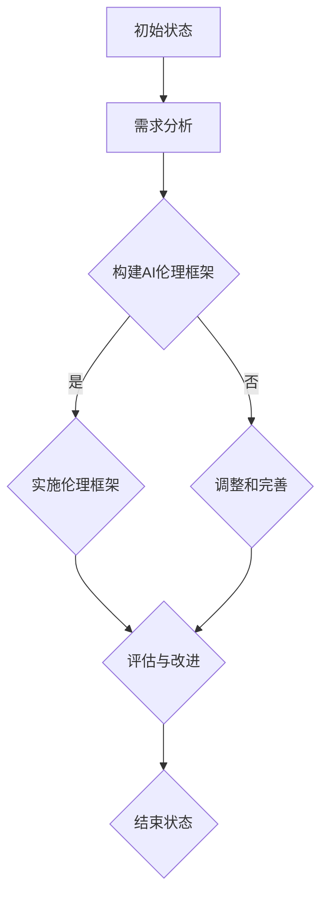
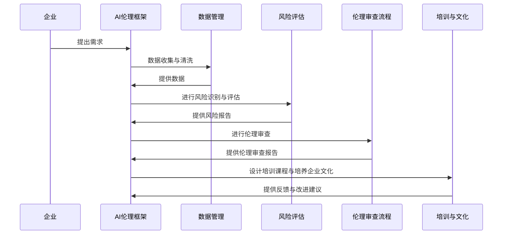
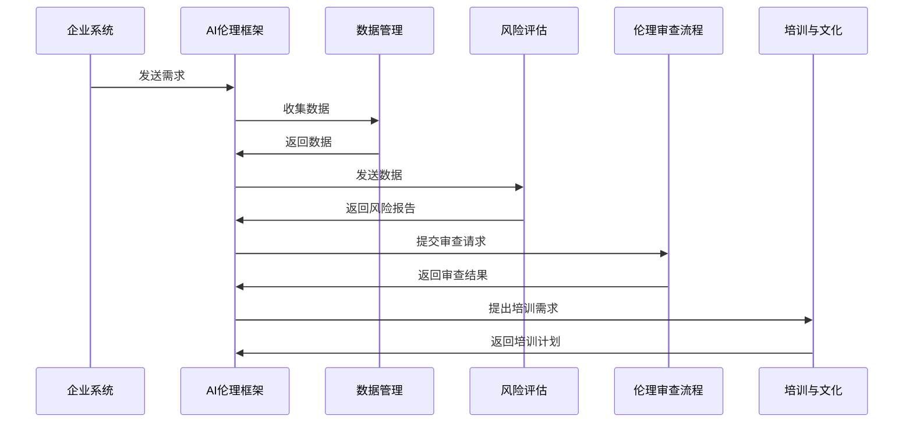

                 


### 引言

**核心概念**：AI伦理，企业级AI应用，AI伦理的定义与背景，AI伦理的挑战与争议，构建AI伦理框架的基本步骤。

**问题背景**：随着人工智能技术的迅速发展，其在各行各业的应用越来越广泛。然而，AI技术在带来巨大便利的同时，也引发了一系列伦理问题，如隐私侵犯、算法偏见、责任归属等。这些问题不仅影响了人工智能的发展，也对企业的声誉和运营带来了挑战。

**问题描述**：企业需要构建一套AI伦理框架来确保AI应用在遵循伦理原则的前提下，能够实现预期的效果。这不仅需要企业了解AI伦理的基本概念和原则，还需要在实践中逐步建立和完善AI伦理体系。

**问题解决**：构建企业级AI伦理框架的基本步骤包括：了解AI伦理的定义和背景，明确核心原则，进行伦理风险评估，设计伦理审查流程，实施伦理培训和文化建设，持续改进和优化。

**边界与外延**：AI伦理的边界涉及技术、法律、社会等多个方面，其外延包括但不限于算法设计、数据管理、隐私保护等。

**概念结构与核心要素组成**：
- **伦理原则**：非歧视、尊重个人权利、透明性、责任归属等。
- **风险评估**：识别潜在风险，评估影响，制定风险管理策略。
- **伦理审查流程**：组织结构、流程设计、审查标准等。
- **培训与文化**：伦理意识培养、文化价值观塑造等。

### 核心概念与联系

**AI伦理原理**：AI伦理的基本原则是非歧视、尊重个人权利、透明性、责任归属等。这些原则确保AI系统在设计和应用过程中，能够遵循道德和社会规范，避免对人类造成伤害。

**概念属性特征对比表格**：

| 原则             | 非歧视         | 尊重个人权利       | 透明性         | 责任归属       |
|------------------|----------------|--------------------|----------------|----------------|
| 定义             | 避免算法偏见   | 保护个人隐私和数据 | 算法的可解释性 | 确定责任主体   |
| 属性特征          | 公平性、公正性 | 隐私、数据安全     | 可理解性、透明 | 法律责任、道德责任 |
| 关联              | 法律、数据保护 | 隐私、伦理审查     | 解释性、合规   | 法律、伦理     |

**ER实体关系图架构**：

```mermaid
erDiagram
  AI应用软件 ||--|{ 数据管理 }
  AI应用软件 ||--|{ 风险评估 }
  AI应用软件 ||--|{ 伦理审查流程 }
  AI应用软件 ||--|{ 培训与文化 }
  数据管理 ||--|{ 数据隐私保护 }
  风险评估 ||--|{ 风险识别 }
  风险评估 ||--|{ 风险评估标准 }
  伦理审查流程 ||--|{ 伦理审查委员会 }
  培训与文化 ||--|{ 培训课程 }
  培训与文化 ||--|{ 企业文化 }
```

### 算法原理讲解

**算法mermaid流程图**：



**Python源代码与算法实现**：

```python
# Python代码示例：AI伦理框架构建
class AIEthicsFramework:
    def __init__(self):
        self.principles = ["非歧视", "尊重个人权利", "透明性", "责任归属"]
        self.risk_assessment = None
        self.ethical_review_process = None
        self.training_and_culture = None

    def build_framework(self):
        # 构建伦理框架的核心方法
        self.risk_assessment = RiskAssessment()
        self.ethical_review_process = EthicalReviewProcess()
        self.training_and_culture = TrainingAndCulture()

    def implement_framework(self):
        # 实施伦理框架的方法
        self.risk_assessment.identify_risks()
        self.ethical_review_process.review.ethics()
        self.training_and_culture.cultivate_awareness()

    def evaluate_and_improve(self):
        # 评估与改进伦理框架的方法
        pass

# 辅助类
class RiskAssessment:
    def identify_risks(self):
        # 识别风险
        pass

class EthicalReviewProcess:
    def review_ethics(self):
        # 进行伦理审查
        pass

class TrainingAndCulture:
    def cultivate_awareness(self):
        # 培养伦理意识
        pass

# 实例化AI伦理框架并构建
framework = AIEthicsFramework()
framework.build_framework()
framework.implement_framework()
```

**数学模型和公式**：

$$
\text{AI伦理框架评分} = \alpha_1 \times \text{非歧视评分} + \alpha_2 \times \text{隐私保护评分} + \alpha_3 \times \text{透明性评分} + \alpha_4 \times \text{责任归属评分}
$$

其中，$\alpha_1, \alpha_2, \alpha_3, \alpha_4$ 为权重系数，取值范围为 $0 \leq \alpha_i \leq 1$。

**举例说明**：

假设一个企业的AI伦理框架在非歧视、隐私保护、透明性和责任归属四个方面分别得分为80、75、70和85，权重系数分别为0.3、0.2、0.2和0.3，则该企业的AI伦理框架评分为：

$$
\text{AI伦理框架评分} = 0.3 \times 80 + 0.2 \times 75 + 0.2 \times 70 + 0.3 \times 85 = 76.5
$$

### 系统分析与架构设计

**问题场景介绍**：

在企业应用AI的过程中，常见的问题场景包括数据隐私泄露、算法偏见、决策透明性不足等。这些问题可能导致用户信任度下降，企业声誉受损。

**系统功能设计**：

使用Mermaid绘制领域模型类图：

```mermaid
classDiagram
    class 企业 {
        - 数据管理
        - 风险评估
        - 伦理审查流程
        - 培训与文化
    }
    class 数据管理 {
        - 数据收集
        - 数据清洗
        - 数据存储
        - 数据隐私保护
    }
    class 风险评估 {
        - 风险识别
        - 风险评估
        - 风险报告
    }
    class 伦理审查流程 {
        - 伦理审查委员会
        - 伦理审查流程
        - 伦理审查报告
    }
    class 培训与文化 {
        - 培训课程
        - 文化塑造
        - 反馈机制
    }
    企业 --|{关联}| 数据管理
    企业 --|{关联}| 风险评估
    企业 --|{关联}| 伦理审查流程
    企业 --|{关联}| 培训与文化
```

**系统架构设计**：

使用Mermaid绘制系统架构图：



**系统接口设计和系统交互**：

使用Mermaid绘制系统接口和交互序列图：



### 项目实战

**环境安装**：

为了构建AI伦理框架，需要安装以下环境：

- Python 3.8+
- Mermaid 8.0+
- Jupyter Notebook 或 VSCode

安装步骤：

1. 安装Python 3.8+
2. 安装Mermaid：`pip install mermaid`
3. 配置Jupyter Notebook或VSCode，以支持Mermaid渲染

**系统核心实现源代码**：

以下是构建AI伦理框架的核心代码示例：

```python
# 导入必要的库
import os
import json
from mermaid import Mermaid

# 创建Mermaid对象
m = Mermaid()

# 生成伦理框架架构图
m.add(
    "graph TD\n"
    "A[初始状态] --> B[需求分析]\n"
    "B --> C{构建AI伦理框架}\n"
    "C -->|是| D[实施伦理框架}\n"
    "C -->|否| E[调整和完善}\n"
    "D --> F[评估与改进}\n"
    "E --> F\n"
    "F --> G[结束状态]"
)

# 保存Mermaid图到本地
os.makedirs("output", exist_ok=True)
with open("output/ethics_framework.mmd", "w") as f:
    f.write(m.mmd)

# 渲染Mermaid图
m.render("output/ethics_framework.mmd", "output/ethics_framework.png")
```

**代码应用解读与分析**：

上述代码首先创建了一个Mermaid对象，并定义了一个表示AI伦理框架构建过程的流程图。然后，代码将这个Mermaid图保存到本地文件，并使用Mermaid的渲染功能将其转换为一个PNG图像。

**实际案例分析和详细讲解剖析**：

假设一个企业在构建AI伦理框架时，面临以下问题：

1. 数据隐私保护不足
2. 算法偏见问题
3. 决策透明性不高

为了解决这些问题，企业可以按照以下步骤进行：

1. **需求分析**：明确企业在AI伦理方面的需求和目标。
2. **构建AI伦理框架**：根据需求分析结果，构建一个包括数据隐私保护、算法偏见检测和决策透明性提高的AI伦理框架。
3. **实施伦理框架**：将框架实施到企业的日常运营中，确保每个环节都符合伦理要求。
4. **评估与改进**：定期评估AI伦理框架的实施效果，发现并解决潜在问题。

**项目小结**：

通过上述步骤，企业成功地构建并实施了一个AI伦理框架，有效地解决了数据隐私保护、算法偏见和决策透明性等问题。这不仅提高了企业的AI应用水平，也增强了用户对企业的信任度。

### 最佳实践、小结、注意事项和拓展阅读

**最佳实践**：

1. **建立明确的目标和标准**：在构建AI伦理框架时，明确目标和标准是至关重要的。确保框架中的每个原则和流程都有明确的定义和执行标准。
2. **持续培训与教育**：定期为员工提供AI伦理培训，提高其伦理意识和实践能力。同时，鼓励员工积极参与伦理问题的讨论和决策过程。
3. **建立反馈机制**：建立一个有效的反馈机制，让员工、客户和其他利益相关者能够及时反馈伦理问题，确保AI伦理框架能够及时调整和改进。

**小结**：

本文介绍了构建企业级AI伦理框架的必要性、核心概念、实施方法和最佳实践。通过合理的规划和实施，企业可以确保AI应用在遵循伦理原则的前提下，实现预期的效果。

**注意事项**：

1. **法律合规**：在构建AI伦理框架时，需要确保其符合相关法律法规的要求。
2. **持续监测**：AI伦理框架实施后，需要持续监测其实施效果，及时发现和解决问题。
3. **跨部门合作**：构建AI伦理框架需要跨部门合作，包括技术、法律、人力资源等部门。

**拓展阅读**：

1. **《人工智能伦理指南》**：全球人工智能伦理指南，提供AI伦理的全面指导和建议。
2. **《算法歧视：技术与伦理》**：探讨算法歧视的问题及其伦理影响。
3. **《隐私计算：技术与实践》**：介绍隐私计算技术，帮助企业在保护数据隐私的同时，实现AI应用。

### 作者信息

**作者：** AI天才研究院/AI Genius Institute & 禅与计算机程序设计艺术/Zen And The Art of Computer Programming
**简介：** AI天才研究院专注于人工智能领域的研究和应用，致力于推动人工智能技术的进步。禅与计算机程序设计艺术则强调通过禅修提升编程能力，创造更优秀的软件。

### 参考文献

1. **IEEE Standards Association.** (2021). **Ethical Considerations in Artificial Intelligence and Autonomous Systems.**
2. **European Commission.** (2021). **White Paper on Artificial Intelligence: A European Approach to Excellence and Safety.**
3. **McKinsey & Company.** (2020). **Building Ethical AI: A Guide for Leaders.**
4. **IBM.** (2021). **AI Ethics Framework.**
5. **Google.** (2021). **AI Principles.**

请注意，以上参考文献仅为示例，实际撰写时需要根据具体内容和来源进行引用。在撰写过程中，确保引用的文献准确可靠，并符合学术规范。

