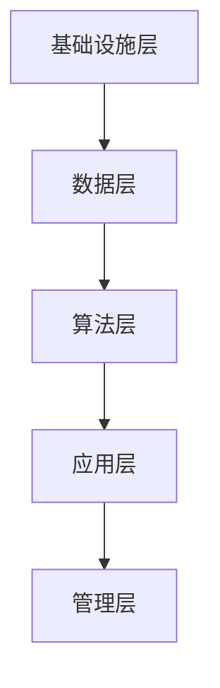

                 

# 构建企业级AI创新孵化器：从创意到商业化

> 关键词：企业级AI创新孵化器，架构设计，技术选型，商业化路径，运营优化，法律法规

> 摘要：本文将探讨如何构建企业级AI创新孵化器，从创意生成到商业化的全过程。通过分析背景、定义、架构设计、技术选型、创新孵化流程、管理运营、商业化路径以及法律法规和伦理问题，为企业提供一套全面而具体的AI创新孵化指南。

## 第一部分：引言

### 1.1 问题背景

#### 1.1.1 人工智能技术的发展趋势

人工智能（AI）作为当今科技领域的前沿技术，正以惊人的速度发展。从早期的机器学习、深度学习，到如今的生成对抗网络（GAN）、强化学习，AI技术不断突破传统技术的限制，拓展了人类的能力边界。在全球范围内，各国政府和企业纷纷加大对AI技术的投入，以期在未来的竞争中占据有利地位。

#### 1.1.2 企业在AI技术上的需求与挑战

随着AI技术的不断成熟，越来越多的企业开始意识到其在业务中的巨大潜力。从提高生产效率、优化供应链管理，到提供个性化用户体验、创造新的商业模式，AI技术在各个领域都有广泛的应用场景。然而，企业在应用AI技术时也面临着诸多挑战，如技术壁垒、数据安全、人才短缺等。

#### 1.1.3 AI创新孵化器的重要性

为了应对AI技术带来的机遇和挑战，企业需要构建一个能够持续创新、快速响应市场变化的创新孵化体系。AI创新孵化器作为企业创新的重要载体，不仅能够加速AI技术的研发和落地，还可以为企业培养一批具备创新精神和实战能力的人才，从而提升企业的核心竞争力。

### 1.2 问题描述

#### 1.2.1 企业级AI创新孵化的定义

企业级AI创新孵化是指在企业内部或外部构建一个专门用于AI技术研究和商业化的平台，通过集成研发、运营、市场等资源，加速AI技术的研发、验证和商业化过程。

#### 1.2.2 孵化过程中的关键环节

孵化过程主要包括以下几个关键环节：

1. 创意收集与筛选：从内部和外部收集创新创意，进行筛选和评估。
2. 早期原型开发：基于筛选出的创意，快速构建原型并进行初步验证。
3. 验证与迭代：通过用户反馈和市场调研，不断迭代优化产品。
4. 商业化路径规划：制定产品商业化策略，进行市场推广和销售。
5. 项目管理与实施：确保孵化项目按计划顺利进行，实现商业目标。

#### 1.2.3 孵化器构建中的难题

在构建AI创新孵化器时，企业可能会面临以下难题：

1. 技术挑战：如何选择合适的AI技术，并确保技术的先进性和实用性。
2. 人才短缺：如何吸引和培养一批具备AI技术背景的专业人才。
3. 资金投入：如何合理分配资源，确保孵化项目的资金充足。
4. 商业化路径：如何将创新创意转化为商业价值，实现盈利。
5. 法律法规和伦理问题：如何遵守相关法律法规，确保AI技术的合规使用。

### 1.3 问题解决

#### 1.3.1 构建AI创新孵化器的基本原则

为了有效解决上述问题，构建AI创新孵化器应遵循以下基本原则：

1. 开放合作：积极与外部合作伙伴建立合作关系，共享资源和信息。
2. 精准定位：明确孵化器的目标和应用领域，聚焦核心竞争力。
3. 持续创新：不断优化孵化流程，提高创新效率和成果转化率。
4. 人才培养：注重人才培养和团队建设，打造创新型人才队伍。
5. 风险管理：建立完善的风险评估和管理体系，降低孵化风险。

#### 1.3.2 创新孵化器的基本架构

AI创新孵化器的基本架构主要包括以下几个部分：

1. 研发团队：负责AI技术的研发和创新。
2. 运营团队：负责孵化项目的日常运营和管理。
3. 市场团队：负责产品推广和市场拓展。
4. 数据团队：负责数据收集、处理和分析。
5. 人才发展团队：负责人才培养和团队建设。

#### 1.3.3 创新孵化器的运行机制

创新孵化器的运行机制主要包括以下几个方面：

1. 创意收集与筛选：通过内部和外部渠道收集创新创意，进行筛选和评估。
2. 项目立项与立项评估：对筛选出的创意进行立项评估，确定孵化项目。
3. 原型开发与验证：快速构建原型并进行初步验证，收集用户反馈。
4. 商业化路径规划：制定产品商业化策略，进行市场推广和销售。
5. 项目管理与实施：确保孵化项目按计划顺利进行，实现商业目标。

### 1.4 边界与外延

#### 1.4.1 企业级AI创新孵化器的适用范围

企业级AI创新孵化器适用于各类企业，包括大型企业、中小型企业以及初创企业。不同规模的企业可以根据自身需求和发展阶段，选择合适的孵化模式和路径。

#### 1.4.2 与其他相关概念的区分

1. 创业孵化器：创业孵化器主要针对初创企业，提供从创业理念到产品商业化的一站式服务。而企业级AI创新孵化器则更侧重于企业内部AI技术的研发和商业化。
2. 研发中心：研发中心主要承担企业的技术研发任务，而AI创新孵化器则更注重创新创意的收集、筛选和孵化，以及商业化路径的规划。
3. 产业创新中心：产业创新中心涉及多个产业的创新合作，而企业级AI创新孵化器则更聚焦于AI技术在企业内部的应用和创新。

#### 1.4.3 面向不同规模企业的孵化策略

1. 大型企业：大型企业可以建立内部AI创新孵化器，整合企业内外部资源，加速AI技术的研发和商业化。同时，可以与外部创业孵化器合作，共同推动AI技术的创新和应用。
2. 中小型企业：中小型企业可以借助外部AI创新孵化器，借助外部资源和技术优势，快速实现AI技术的研发和商业化。
3. 初创企业：初创企业可以依托AI创新孵化器，获得技术研发、市场推广等方面的支持，降低创业风险，提高创业成功率。

### 1.5 概念结构与核心要素组成

#### 1.5.1 创新孵化器的核心概念结构

企业级AI创新孵化器的核心概念结构包括以下几个方面：

1. 创新创意：创新创意是孵化器的基础，包括AI技术的创新点、应用场景、商业模式等。
2. 孵化项目：孵化项目是孵化器的主要载体，包括创意筛选、立项、开发、验证、商业化等环节。
3. 研发团队：研发团队是孵化器的技术支撑，负责AI技术的研发和创新。
4. 运营团队：运营团队负责孵化项目的日常运营和管理，确保项目顺利进行。
5. 市场团队：市场团队负责产品推广和市场拓展，提高产品的市场竞争力。
6. 数据团队：数据团队负责数据收集、处理和分析，为研发和市场提供数据支持。
7. 人才发展团队：人才发展团队负责人才培养和团队建设，提升团队整体素质。

#### 1.5.2 构建孵化器的核心要素

构建企业级AI创新孵化器需要以下核心要素：

1. 资金：充足的资金是孵化器运行的基础，包括研发投入、运营成本、市场推广费用等。
2. 人才：具备AI技术背景和专业能力的人才，是孵化器成功的关键。
3. 技术：先进的AI技术和研发能力，是孵化器持续创新的核心。
4. 数据：丰富的数据资源，为AI技术的研发和应用提供基础。
5. 合作伙伴：与外部合作伙伴建立合作关系，共享资源和信息，提高孵化器的竞争力。

#### 1.5.3 企业在构建孵化器中的角色定位

企业在构建AI创新孵化器时，需要明确自身在孵化器中的角色定位：

1. 资源提供者：为企业提供资金、技术、人才等资源，支持孵化器的运行。
2. 创新推动者：积极推动AI技术的创新和应用，为企业发展注入新动力。
3. 项目管理者：对孵化项目进行全程管理，确保项目按计划顺利进行。
4. 商业化推动者：制定产品商业化策略，推动产品走向市场，实现商业价值。

### 1.6 本章小结

本部分介绍了构建企业级AI创新孵化器的背景、重要性、定义、关键环节、构建原则、架构设计、运行机制以及适用范围和核心要素。通过对这些内容的分析，为企业提供了构建AI创新孵化器的理论基础和实践指导。

----------------------------------------------------------------

# 第二部分：企业级AI创新孵化器构建

## 2.1 创新孵化器的架构设计

#### 2.1.1 架构设计原则

在企业级AI创新孵化器的架构设计过程中，需要遵循以下原则：

1. **可扩展性**：孵化器架构应具备良好的扩展性，能够根据业务需求的变化灵活调整。
2. **模块化**：将系统功能划分为多个模块，每个模块独立开发、测试和维护，降低系统复杂度。
3. **高可用性**：确保系统稳定运行，提高系统可靠性和容错能力。
4. **安全性**：加强数据安全和系统安全，保护企业和用户的数据隐私。
5. **灵活性**：支持多样化的应用场景，适应不同的业务需求。

#### 2.1.2 系统架构图解析

企业级AI创新孵化器的系统架构可以划分为以下几个层次：

1. **基础设施层**：包括服务器、存储、网络等基础设施资源，为孵化器提供计算、存储和传输能力。
2. **数据层**：包括数据采集、存储、处理和分析等模块，为AI算法提供数据支持。
3. **算法层**：包括各种AI算法模型，如机器学习、深度学习、生成对抗网络等，实现AI技术的核心功能。
4. **应用层**：包括各种应用系统和工具，如数据可视化、自动化测试、项目管理等，为孵化项目提供支持。
5. **管理层**：包括项目管理、资源配置、风险控制等模块，确保孵化项目的顺利实施。

下面是一个简单的系统架构图（使用Mermaid语法）：

#### 2.1.3 架构的扩展性与可维护性

在架构设计过程中，还需要考虑系统的扩展性和可维护性：

1. **扩展性**：通过模块化设计和分布式架构，实现系统功能的扩展和升级，满足业务需求的变化。
2. **可维护性**：采用可读性高、结构清晰的代码，编写详细的文档，提高系统的可维护性和可扩展性。

## 2.2 技术选型与实现

#### 2.2.1 开发环境搭建

在构建AI创新孵化器时，需要搭建一个高效、稳定的开发环境。以下是一些关键步骤：

1. **操作系统**：选择Linux操作系统，如Ubuntu或CentOS，具备良好的性能和稳定性。
2. **编程语言**：选择Python作为主要编程语言，因为其丰富的库和框架支持，能够快速开发和实现AI算法。
3. **开发工具**：使用Jupyter Notebook进行数据分析和模型训练，使用Docker容器化技术部署应用程序。

#### 2.2.2 数据处理与存储

数据处理与存储是AI创新孵化器的重要环节。以下是一些关键步骤：

1. **数据采集**：通过传感器、网络爬虫、API接口等方式采集数据。
2. **数据存储**：使用HDFS（Hadoop分布式文件系统）或HBase（分布式NoSQL数据库）进行数据存储，确保数据的高可用性和可靠性。
3. **数据处理**：使用Spark或Flink等大数据处理框架进行数据清洗、转换和存储，提高数据处理效率。

#### 2.2.3 算法模型选择与训练

在AI创新孵化器中，算法模型的选择与训练至关重要。以下是一些关键步骤：

1. **模型选择**：根据应用场景选择合适的算法模型，如线性回归、决策树、神经网络等。
2. **数据预处理**：对数据进行归一化、缺失值填充等预处理操作，提高模型训练效果。
3. **模型训练**：使用TensorFlow或PyTorch等深度学习框架进行模型训练，调整超参数，优化模型性能。
4. **模型评估**：使用交叉验证、ROC曲线、AUC等指标评估模型性能，选择最优模型。

## 2.3 创新孵化流程

#### 2.3.1 创意收集与筛选

创意收集与筛选是创新孵化流程的第一步，以下是一些关键步骤：

1. **创意来源**：通过内部员工、外部合作伙伴、用户反馈等多种渠道收集创意。
2. **创意评估**：对收集到的创意进行评估，包括技术可行性、市场前景、商业价值等方面。
3. **筛选策略**：根据评估结果，筛选出具有较高潜力的创意，进入孵化阶段。

#### 2.3.2 早期原型开发

早期原型开发是验证创意可行性的重要环节，以下是一些关键步骤：

1. **需求分析**：明确产品功能和性能需求，制定详细的需求文档。
2. **原型设计**：使用Sketch、Figma等工具设计产品原型，验证用户需求。
3. **技术实现**：基于原型设计，快速构建原型系统，进行初步测试和验证。

#### 2.3.3 验证与迭代

验证与迭代是确保产品成功的关键环节，以下是一些关键步骤：

1. **用户测试**：邀请目标用户进行测试，收集用户反馈。
2. **功能优化**：根据用户反馈，优化产品功能和性能。
3. **持续迭代**：不断进行产品迭代，逐步完善产品功能，提高用户体验。

## 2.4 管理与运营

#### 2.4.1 人员配备与培训

人员配备与培训是确保创新孵化器高效运营的关键，以下是一些关键步骤：

1. **人员配置**：根据孵化项目需求，配备合适的研发、运营、市场等专业人员。
2. **技能培训**：为员工提供AI技术、项目管理、市场推广等方面的培训，提高团队整体素质。
3. **激励机制**：建立激励机制，鼓励员工积极参与创新项目和业务拓展。

#### 2.4.2 资源管理与协调

资源管理与协调是确保孵化项目顺利实施的重要环节，以下是一些关键步骤：

1. **资源规划**：根据项目需求，合理规划人力资源、技术资源、资金资源等。
2. **资源协调**：建立高效的沟通机制，确保各部门之间的资源协调和共享。
3. **资源监控**：定期对资源使用情况进行监控和评估，优化资源配置。

#### 2.4.3 风险管理与应对策略

风险管理与应对策略是确保孵化项目顺利进行的关键，以下是一些关键步骤：

1. **风险识别**：识别孵化项目中的潜在风险，包括技术风险、市场风险、资金风险等。
2. **风险评估**：对识别出的风险进行评估，确定风险优先级。
3. **应对策略**：制定相应的应对策略，降低风险对项目的影响。

## 2.5 案例研究

#### 2.5.1 某知名企业的AI创新孵化实践

某知名企业在构建AI创新孵化器方面取得了显著成果。以下是其主要实践：

1. **创新文化**：企业倡导创新文化，鼓励员工积极参与创新项目和业务拓展。
2. **技术积累**：企业拥有丰富的AI技术积累，为孵化项目提供技术支持。
3. **资源整合**：企业整合内部资源，建立高效的管理和运营体系，确保孵化项目顺利实施。
4. **人才培养**：企业注重人才培养和团队建设，为员工提供培训和发展机会。

#### 2.5.2 成功案例分析

成功案例的主要特点如下：

1. **明确的定位**：企业明确AI创新孵化器的定位和应用领域，聚焦核心竞争力。
2. **高效的运营**：企业建立高效的运营体系，确保孵化项目按计划顺利进行。
3. **创新的商业模式**：企业创新商业模式，将AI技术与业务需求相结合，实现商业价值。
4. **持续的创新**：企业不断优化孵化流程，提高创新效率和成果转化率。

#### 2.5.3 案例中的经验与教训

案例中的主要经验与教训如下：

1. **经验**：明确的定位、高效的运营、创新的商业模式和持续的创新是企业成功的关键。
2. **教训**：风险管理和应对策略不足、资源协调不畅、人才培养不足等因素可能导致孵化项目失败。

## 2.6 本章小结

本部分介绍了企业级AI创新孵化器的架构设计、技术选型与实现、创新孵化流程、管理与运营等方面。通过分析案例，为企业提供了构建AI创新孵化器的实践经验和指导。

----------------------------------------------------------------

# 第三部分：从创意到商业化

## 3.1 创意开发

#### 3.1.1 创意收集的方法

创意开发的第一个步骤是收集创意。以下是一些有效的创意收集方法：

1. **头脑风暴**：组织团队进行头脑风暴，激发团队成员的创新思维，产生大量的创意。
2. **用户调研**：通过用户访谈、问卷调查等方式，了解用户的需求和痛点，收集创意。
3. **技术趋势分析**：关注最新的技术趋势，结合企业的技术积累，挖掘潜在的创意。
4. **竞争对手分析**：分析竞争对手的产品和市场策略，发现潜在的创新机会。

#### 3.1.2 创意的筛选与评估

收集到的创意需要进行筛选和评估，以确定哪些创意具有商业潜力。以下是一些筛选和评估的方法：

1. **技术可行性评估**：评估创意的技术实现难度和成本，确保创意具有可行性。
2. **市场潜力评估**：分析创意的市场前景，预测其潜在的市场需求。
3. **商业价值评估**：评估创意的商业价值，包括盈利能力、用户满意度等。
4. **团队共识**：通过团队讨论，达成共识，确定具有潜力的创意。

#### 3.1.3 创意的开发流程

经过筛选和评估后，确定要开发的创意进入开发流程。以下是创意开发的流程：

1. **需求分析**：明确创意的功能和性能需求，制定详细的需求文档。
2. **原型设计**：使用Sketch、Figma等工具设计产品原型，验证创意可行性。
3. **技术实现**：基于原型设计，快速构建原型系统，进行初步测试和验证。
4. **用户测试**：邀请目标用户进行测试，收集用户反馈。
5. **持续迭代**：根据用户反馈，优化产品功能和性能，不断进行产品迭代。

## 3.2 商业化路径

#### 3.2.1 市场调研与分析

在创意开发完成后，需要制定商业化的路径。以下是一些市场调研与分析的方法：

1. **目标市场定位**：确定目标市场，明确目标用户群体。
2. **竞争对手分析**：分析竞争对手的产品和市场策略，发现自身的竞争优势。
3. **市场需求分析**：了解市场需求，确定产品的核心价值。
4. **市场趋势分析**：关注市场趋势，预测未来的市场变化。

#### 3.2.2 商业模式设计

商业模式设计是商业化的关键步骤，以下是一些常用的商业模式设计方法：

1. **价值主张**：明确产品的核心价值，满足用户的需求。
2. **客户获取策略**：制定客户获取策略，包括营销策略、销售渠道等。
3. **收入模式**：确定产品的收入来源，包括产品销售、服务收费等。
4. **成本结构**：分析产品的成本结构，确保商业模式的可持续性。

#### 3.2.3 营销策略与推广

制定有效的营销策略是推动产品商业化的重要手段。以下是一些常用的营销策略：

1. **内容营销**：通过博客、社交媒体、电子邮件等方式，提供有价值的内容，吸引潜在用户。
2. **社交媒体营销**：利用社交媒体平台，增加产品的曝光度和影响力。
3. **网络广告**：通过搜索引擎优化（SEO）和搜索引擎营销（SEM），提高产品的搜索引擎排名。
4. **口碑营销**：通过用户口碑，提高产品的信誉度和认可度。

## 3.3 项目管理与实施

#### 3.3.1 项目管理方法论

项目管理是确保商业化路径顺利实施的关键。以下是一些常用的项目管理方法论：

1. **敏捷开发**：采用敏捷开发方法，快速迭代，及时响应市场变化。
2. **Scrum**：使用Scrum框架，分阶段进行项目开发，确保项目的透明度和可控性。
3. **六西格玛**：通过六西格玛方法，降低项目风险，提高项目质量。
4. **项目管理软件**：使用项目管理软件，如Jira、Trello等，进行项目进度管理和协作。

#### 3.3.2 项目实施关键节点

在项目实施过程中，关键节点包括：

1. **需求分析**：明确项目需求，制定详细的需求文档。
2. **原型设计**：设计产品原型，验证需求的可行性。
3. **技术实现**：基于原型设计，进行技术实现。
4. **测试与验证**：进行功能测试和性能测试，确保产品的质量。
5. **用户反馈**：收集用户反馈，进行产品优化。
6. **上线发布**：产品上线，进行市场推广。

#### 3.3.3 团队协作与沟通

团队协作与沟通是项目成功的关键。以下是一些团队协作与沟通的方法：

1. **定期会议**：定期召开会议，汇报项目进度，解决问题。
2. **即时通讯工具**：使用即时通讯工具，如Slack、Telegram等，实时沟通。
3. **知识共享平台**：建立知识共享平台，记录项目经验和教训。
4. **团队成员培训**：定期组织培训，提高团队成员的专业能力和沟通能力。

## 3.4 商业化案例分析

#### 3.4.1 成功案例介绍

以下是一个成功的商业化案例介绍：

某企业开发了一款基于人工智能的智能客服系统，通过自然语言处理和机器学习技术，提供高效的客户服务。产品上线后，迅速获得了市场认可，成为行业内的标杆产品。

#### 3.4.2 案例中的关键成功因素

成功案例的关键成功因素包括：

1. **技术先进**：采用先进的人工智能技术，提供高效、智能的客户服务。
2. **市场需求**：准确把握市场需求，满足客户对高效、智能客户服务的需求。
3. **营销策略**：通过有效的营销策略，提高产品的市场知名度。
4. **团队协作**：高效的团队协作，确保产品的质量和上线进度。

#### 3.4.3 案例中的不足与改进

尽管案例取得了成功，但仍存在一些不足：

1. **市场调研不足**：在产品上线前，对市场进行了有限的市场调研，可能导致市场需求的预测不准确。
2. **产品功能不足**：产品功能相对单一，无法满足所有客户的需求。
3. **团队协作不够紧密**：在项目实施过程中，团队协作不够紧密，可能导致沟通不畅。

改进措施：

1. **加强市场调研**：在产品上线前，进行全面的市场调研，准确把握市场需求。
2. **增加产品功能**：根据用户反馈，不断优化产品功能，满足客户需求。
3. **加强团队协作**：建立高效的沟通机制，确保团队成员之间的协作顺畅。

## 3.5 商业化路径优化

#### 3.5.1 优化策略与方法

为了优化商业化路径，可以采取以下策略：

1. **市场定位优化**：根据市场需求，调整产品的市场定位，提高市场竞争力。
2. **产品功能优化**：根据用户反馈，不断优化产品功能，提高用户体验。
3. **营销策略优化**：根据市场变化，调整营销策略，提高产品的市场渗透率。
4. **团队协作优化**：优化团队协作机制，提高团队效率和执行力。

#### 3.5.2 持续改进与迭代

持续改进与迭代是商业化成功的关键。以下是一些持续改进的方法：

1. **用户反馈收集**：定期收集用户反馈，了解用户需求和市场变化。
2. **产品迭代**：根据用户反馈，进行产品迭代，优化产品功能和用户体验。
3. **数据分析**：通过数据分析，了解产品的市场表现和用户行为，为决策提供依据。
4. **团队协作**：建立高效的团队协作机制，确保持续改进的实施。

#### 3.5.3 持续商业化成功的保障

持续商业化成功需要以下保障措施：

1. **资源保障**：确保孵化项目的资源充足，包括资金、技术、人才等。
2. **风险管理**：建立完善的风险管理机制，降低项目风险。
3. **团队建设**：加强团队建设，提高团队协作能力和执行力。
4. **创新能力**：持续推动创新，保持产品的竞争优势。

## 3.6 本章小结

本部分介绍了从创意到商业化的全过程，包括创意开发、市场调研与分析、商业模式设计、营销策略与推广、项目管理与实施、商业化案例分析以及商业化路径优化等方面。通过分析成功案例，为企业提供了从创意到商业化的实践经验和指导。

----------------------------------------------------------------

# 第四部分：AI创新孵化器运营与优化

## 4.1 运营策略

#### 4.1.1 运营体系搭建

AI创新孵化器的运营体系是确保孵化项目顺利推进和高效运作的基础。以下是构建运营体系的步骤：

1. **明确目标**：确定孵化器的运营目标和使命，如技术创新、商业转化、人才培育等。
2. **组织架构**：建立适合孵化项目的组织架构，包括研发团队、运营团队、市场团队等。
3. **流程规范**：制定孵化项目的运作流程，确保项目从创意到商业化的每个环节都有明确的规范。
4. **资源配置**：合理配置资源，包括资金、技术、人才等，确保孵化项目的顺利推进。

#### 4.1.2 运营数据监控与分析

运营数据监控与分析是评估孵化项目进展和效果的重要手段。以下是监控与分析的方法：

1. **数据采集**：收集孵化项目相关的数据，包括项目进度、用户反馈、市场表现等。
2. **数据存储**：使用数据库或大数据平台，存储和整合采集到的数据。
3. **数据分析**：使用数据分析工具，对采集到的数据进行处理和分析，提取有价值的信息。
4. **数据可视化**：通过图表、报表等方式，将分析结果进行可视化展示，便于管理层决策。

#### 4.1.3 运营优化策略

基于数据监控与分析，制定运营优化策略，提高孵化器的运营效率。以下是几种优化策略：

1. **流程优化**：根据数据分析结果，优化项目运作流程，减少不必要的环节，提高效率。
2. **资源配置**：根据项目需求和资源状况，动态调整资源配置，确保关键资源的优先分配。
3. **团队协作**：加强团队之间的协作，建立高效的沟通机制，提高团队执行力。
4. **风险管理**：建立完善的风险管理机制，提前识别和应对潜在风险，降低项目风险。

## 4.2 人才培养与团队建设

#### 4.2.1 人才培养计划

人才培养是AI创新孵化器的重要任务之一。以下是人才培养计划的步骤：

1. **人才需求分析**：根据孵化项目的需求，分析所需的人才类型和技能。
2. **培训内容设计**：制定培训计划，包括技术培训、管理培训、业务培训等。
3. **培训资源整合**：整合内部和外部培训资源，确保培训计划的实施。
4. **培训效果评估**：对培训效果进行评估，确保培训目标的实现。

#### 4.2.2 团队建设的重要性

团队建设是确保孵化项目成功的关键因素。以下是团队建设的重要性：

1. **协同合作**：良好的团队建设能够促进团队成员之间的协同合作，提高工作效率。
2. **创新能力**：团队建设有助于激发团队成员的创新能力，推动技术创新。
3. **员工满意度**：良好的团队氛围能够提高员工的工作满意度，降低员工流失率。
4. **企业文化建设**：团队建设有助于企业文化的传承和发展，提高企业的凝聚力。

#### 4.2.3 团队管理与激励

团队管理与激励是确保团队高效运作的重要手段。以下是团队管理与激励的方法：

1. **目标管理**：为团队成员设定明确的工作目标，确保团队目标的实现。
2. **绩效评估**：建立科学的绩效评估体系，对团队成员的工作进行评估。
3. **激励机制**：建立激励机制，奖励优秀员工，激励团队成员的积极性和创造力。
4. **沟通与反馈**：建立良好的沟通渠道，及时反馈团队工作情况，解决团队问题。

## 4.3 风险管理与应对

#### 4.3.1 风险识别与评估

风险管理与应对是确保孵化项目顺利推进的重要环节。以下是风险识别与评估的方法：

1. **风险识别**：通过历史数据分析、专家访谈、情景分析等方式，识别孵化项目中的潜在风险。
2. **风险评估**：对识别出的风险进行评估，确定风险的概率和影响程度。
3. **风险分类**：根据风险的影响程度和发生概率，对风险进行分类，制定相应的应对策略。

#### 4.3.2 风险应对策略

针对不同类型的风险，制定相应的应对策略，降低风险对项目的影响。以下是几种常见的风险应对策略：

1. **风险规避**：通过调整项目计划，避免风险的发生。
2. **风险转移**：通过购买保险、签订合同等方式，将风险转移给第三方。
3. **风险减轻**：通过技术手段、管理措施等，降低风险的概率或影响程度。
4. **风险接受**：对于不可避免或成本较高的风险，接受风险并制定相应的应急预案。

#### 4.3.3 风险监控与预警

建立风险监控与预警机制，及时发现和处理风险。以下是风险监控与预警的方法：

1. **定期评估**：定期对项目风险进行评估，更新风险清单。
2. **实时监控**：通过监控工具，实时监控项目风险指标，及时发现潜在风险。
3. **预警机制**：建立预警机制，对高风险项目进行预警，确保风险得到及时处理。

## 4.4 优化策略与迭代

#### 4.4.1 优化目标的确定

为了持续提升AI创新孵化器的运营效率，需要明确优化目标。以下是确定优化目标的步骤：

1. **目标设定**：根据孵化器的使命和战略，设定明确的优化目标，如提高项目成功率、缩短研发周期、降低成本等。
2. **目标分解**：将优化目标分解为具体的子目标，明确每个子目标的负责部门和责任人。
3. **目标评估**：定期对优化目标的完成情况进行评估，确保目标的实现。

#### 4.4.2 优化方法与实践

根据优化目标，采取相应的优化方法与实践。以下是几种常见的优化方法：

1. **流程优化**：通过流程再造、流程简化等方法，优化项目的运作流程，提高效率。
2. **技术创新**：通过引入新技术、新方法，提高项目的技术水平和创新能力。
3. **资源整合**：通过整合内外部资源，提高资源利用效率，降低项目成本。
4. **团队协作**：通过改进团队协作机制，提高团队的执行力和创新能力。

#### 4.4.3 迭代与持续改进

迭代与持续改进是优化的重要手段。以下是迭代与持续改进的方法：

1. **定期评估**：定期对孵化器的运营状况进行评估，识别存在的问题和改进点。
2. **持续改进**：针对评估中发现的问题，采取相应的改进措施，持续优化运营流程。
3. **用户反馈**：收集用户反馈，了解用户需求和体验，不断优化产品和服务。
4. **数据驱动**：基于数据分析和用户反馈，制定和调整优化策略，确保优化效果的持续性。

## 4.5 案例分析

#### 4.5.1 某知名企业AI孵化器运营实践

以下是一个知名企业AI孵化器的运营实践案例：

某知名企业在其内部建立了AI孵化器，通过明确的运营目标和完善的运营体系，成功孵化了一系列AI项目。以下是该孵化器的主要实践：

1. **目标明确**：孵化器设定了明确的运营目标，如技术创新、市场拓展、人才培育等。
2. **流程规范**：制定了详细的孵化流程，包括项目立项、研发、测试、商业化等环节。
3. **资源整合**：整合企业内外部资源，提供资金、技术、人才等支持。
4. **团队协作**：建立高效的团队协作机制，确保项目顺利推进。
5. **风险管理**：建立完善的风险管理机制，降低项目风险。

#### 4.5.2 案例中的运营经验

案例中的运营经验包括：

1. **明确目标**：设定清晰的运营目标，有助于指导运营工作，确保资源投入的方向。
2. **流程规范**：建立完善的运营流程，有助于提高项目的执行效率和效果。
3. **资源整合**：整合内外部资源，提高资源利用效率，降低项目成本。
4. **团队协作**：建立高效的团队协作机制，确保项目的顺利推进。
5. **风险管理**：建立风险管理机制，降低项目风险，保障项目的成功。

#### 4.5.3 案例中的问题与挑战

案例中存在的问题与挑战包括：

1. **人才短缺**：在孵化项目初期，企业面临着人才短缺的问题，影响项目的推进速度。
2. **资金压力**：孵化项目需要大量的资金支持，对企业资金链造成一定的压力。
3. **市场需求变化**：市场需求变化较快，对项目的快速响应和调整提出了较高的要求。

#### 4.5.4 案例中的解决方案

针对上述问题与挑战，案例中的解决方案包括：

1. **人才引进**：通过招聘、培训和合作等方式，引进和培养一批具备AI技术背景的专业人才。
2. **资金筹集**：通过多元化融资渠道，如风险投资、政府补贴等，筹集项目所需的资金。
3. **敏捷开发**：采用敏捷开发方法，快速响应市场需求变化，确保项目的顺利进行。

## 4.6 本章小结

本部分介绍了AI创新孵化器的运营与优化策略，包括运营体系搭建、运营数据监控与分析、人才培养与团队建设、风险管理与应对、优化策略与迭代以及案例分析等方面。通过分析成功案例，为企业提供了AI创新孵化器运营与优化的实践经验和指导。

----------------------------------------------------------------

# 第五部分：法律法规与伦理

## 5.1 法律法规

在构建和运营企业级AI创新孵化器时，必须严格遵守相关的法律法规，以确保AI技术的合规使用。以下是几个关键领域的法律法规：

### 5.1.1 欧盟通用数据保护条例（GDPR）

欧盟的GDPR是数据保护领域的重要法规，要求企业在处理个人数据时必须遵循一系列严格的规定，包括数据收集、存储、处理和删除。在AI创新孵化器中，对用户数据的收集和处理必须严格遵守GDPR的要求，确保用户隐私得到保护。

### 5.1.2 美国加州消费者隐私法案（CCPA）

CCPA是针对美国加州的消费者隐私保护法案，要求企业公开其收集和处理消费者个人数据的方式，并提供消费者对其数据的访问、删除和拒绝销售选项。对于在国际市场上运营的AI创新孵化器，了解并遵守CCPA的规定同样重要。

### 5.1.3 中国网络安全法

中国的网络安全法对网络安全、个人信息保护、数据存储和处理等方面有明确规定。企业在构建AI创新孵化器时，必须确保其数据处理行为符合中国的法律法规，特别是涉及个人信息保护的规定。

### 5.1.4 知识产权法

知识产权法是保护发明创造、商标、版权等领域的重要法律。在AI创新孵化器中，技术开发和产品商业化必须遵守知识产权法，防止侵犯他人的知识产权，同时也需要保护自身的知识产权。

## 5.2 伦理问题

AI技术的发展带来了许多伦理问题，这些问题在AI创新孵化器的构建和运营中必须加以关注和解决。

### 5.2.1 数据伦理

数据伦理涉及数据的收集、处理和使用过程。在AI创新孵化器中，必须确保数据的合法来源和合理使用，避免数据滥用和隐私侵犯。此外，对敏感数据的处理需要遵循严格的伦理标准。

### 5.2.2 透明度和可解释性

AI系统的决策过程往往缺乏透明度，这可能导致用户对系统的不信任。在AI创新孵化器中，开发具有高透明度和可解释性的AI系统是重要的伦理要求，有助于增强用户对系统的信任。

### 5.2.3 非歧视和公平

AI系统在决策时可能会无意中产生歧视，特别是在涉及到性别、种族、年龄等方面。在AI创新孵化器中，必须确保AI系统在决策过程中不会产生不公平的偏见，遵循非歧视原则。

### 5.2.4 责任归属

在AI创新孵化器中，当AI系统出现问题时，需要明确责任归属。这涉及到AI系统的设计、开发、测试和维护等方面，需要建立明确的责任机制，确保在出现问题时能够迅速响应和解决问题。

## 5.3 法规与伦理的整合

法规和伦理在AI创新孵化器的构建和运营中是相辅相成的。以下是整合法规与伦理的一些建议：

### 5.3.1 制定合规计划

企业应制定详细的合规计划，包括数据保护、透明度、公平性等方面的合规要求，并将其纳入孵化项目的开发流程。

### 5.3.2 培训与宣传

对团队成员进行持续的法律法规和伦理培训，提高他们的合规意识和伦理素养。同时，通过宣传和教育活动，增强公众对AI技术的理解和信任。

### 5.3.3 定期审计

定期对AI创新孵化器的合规性进行审计，确保法规和伦理要求得到有效执行。

### 5.3.4 建立反馈机制

建立用户反馈和投诉机制，及时发现和处理合规问题和伦理问题。

## 5.4 本章小结

本部分探讨了在构建和运营企业级AI创新孵化器时必须遵守的法律法规和伦理要求。通过了解和遵守相关法规，以及关注AI技术的伦理问题，企业可以确保其AI创新孵化器的合法性和道德性，为用户提供更安全、更可信的服务。

----------------------------------------------------------------

# 附录

## A. 参考文献

1. **欧盟通用数据保护条例（GDPR）** - 欧洲议会和理事会2016年4月27日通过的条例。
2. **美国加州消费者隐私法案（CCPA）** - 加利福尼亚州2018年通过的法律。
3. **中国网络安全法** - 中华人民共和国2016年11月通过的网络安全法律。
4. **知识产权法** - 不同国家的知识产权法律体系，如美国的《专利法》、《商标法》和《版权法》等。

## B. 拓展阅读

1. **[《人工智能伦理与法律》](https://www.aaai.org/Organization/Workshops/AAAI-18/Papers/AAAI18-066.pdf)** - 一篇关于AI伦理与法律的综合论文。
2. **[《数据伦理：数据驱动时代的道德思考》](https://www.amazon.com/dp/0262039166)** - 一本关于数据伦理的书籍。
3. **[《人工智能：一种现代方法》](https://www.amazon.com/Artificial-Intelligence-Modern-Approach-Third/dp/0262033847)** - 一本介绍人工智能技术和方法的教材。

## C. 最佳实践 Tips

1. **合规性审查**：在项目启动阶段，进行全面的合规性审查，确保所有活动都符合相关法律法规。
2. **数据保护措施**：建立严格的数据保护措施，包括加密、访问控制和数据匿名化等。
3. **透明度设计**：在AI系统的设计和开发过程中，注重透明度和可解释性，以便用户理解和信任。
4. **公平性检测**：定期对AI系统的公平性进行检测，确保不产生歧视和不公平的偏见。
5. **责任界定**：明确AI系统的责任归属，建立清晰的责任界定机制。

## D. 注意事项

1. **持续关注法规变化**：法律法规是动态变化的，企业需要持续关注相关法规的变化，及时调整合规策略。
2. **伦理问题持续关注**：AI技术的伦理问题可能随着技术的进步而发生变化，企业需要持续关注和评估。
3. **用户反馈重要**：用户的反馈是改进AI创新孵化器的重要依据，应积极收集和分析用户反馈，以优化产品和服务。

## E. 拓展阅读

1. **[《人工智能伦理：指南与案例分析》](https://www.aaai.org/Organization/Workshops/AAAI-19/Papers/AAAI19-091.pdf)** - 一篇关于AI伦理的指南和案例分析。
2. **[《人工智能：法律与伦理挑战》](https://www.ijcai.org/Proceedings/19-1/papers/04-19-1.pdf)** - 一篇关于AI法律和伦理挑战的论文。
3. **[《人工智能伦理：技术、法律与道德》](https://wwwSpringer.com/us/book/9783319665044)** - 一本关于AI伦理的书籍。

通过本文的深入探讨，我们希望能够为企业和研究人员在构建和运营企业级AI创新孵化器时提供有益的指导。希望本文的内容能够激发更多的思考和讨论，推动AI技术的健康发展。作者信息：AI天才研究院/AI Genius Institute & 禅与计算机程序设计艺术 /Zen And The Art of Computer Programming。如果您对本文有任何建议或疑问，欢迎随时与我们联系。

