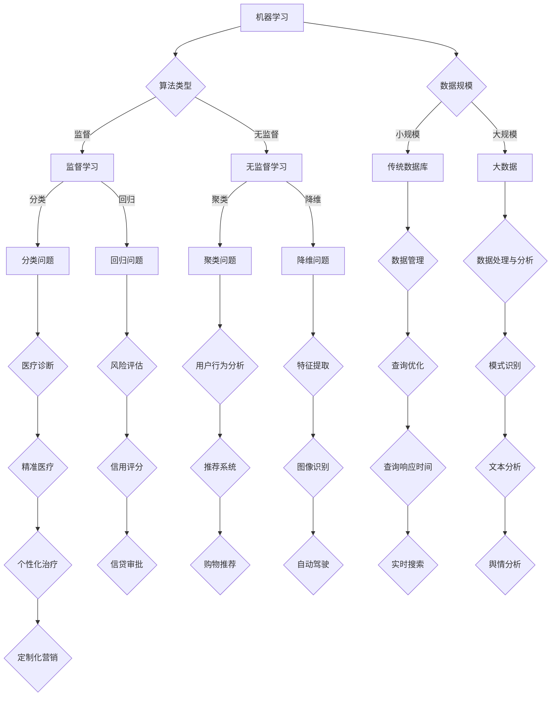
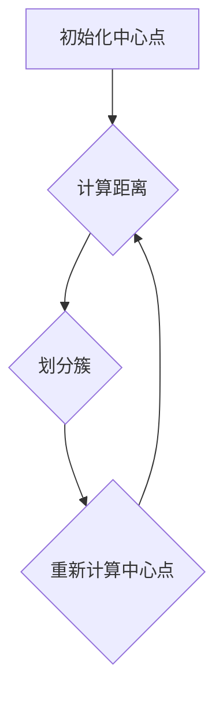
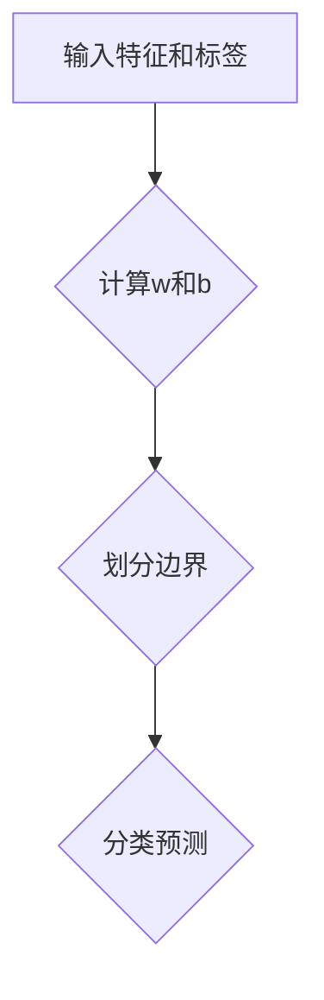
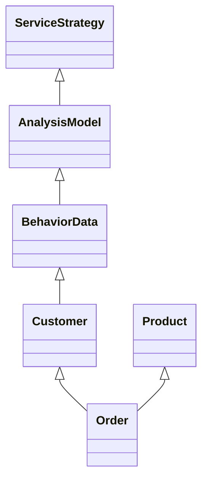
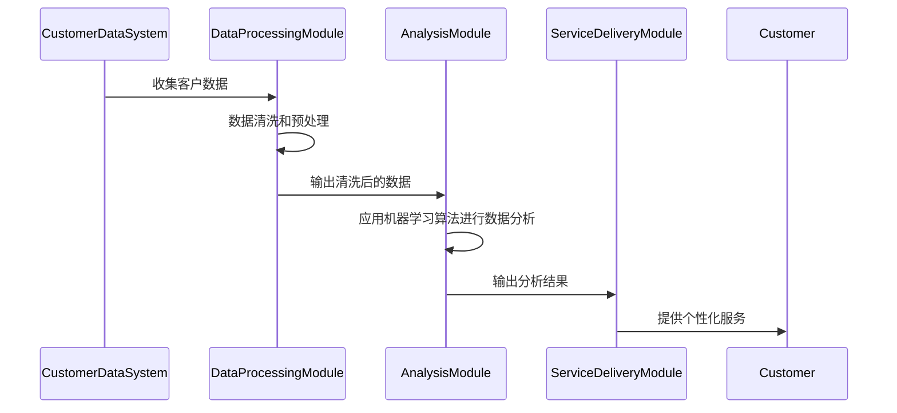
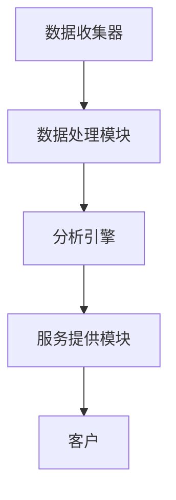
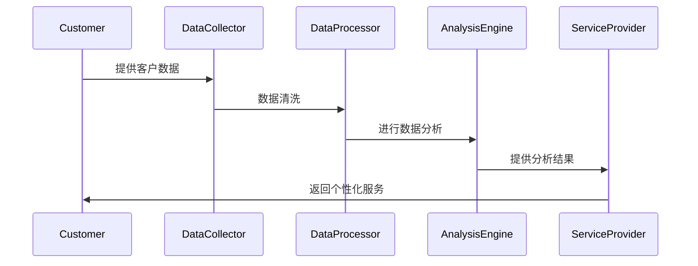

                 

Alright, let's dive into the task step by step and create a structured outline for our blog post.

### Step 1: Define the Main Title and Keywords

**Title**: 构建企业级AI客户洞察助手：深度分析与个性化服务

**Keywords**: 企业级AI，客户洞察，深度分析，个性化服务，机器学习，数据挖掘

**Abstract**: 本文将深入探讨如何构建一个企业级AI客户洞察助手，包括其核心概念、算法原理、系统设计与实现，以及实际应用中的最佳实践和优化策略。

---

### Step 2: Chapter Outline

#### Chapter 1: 背景介绍与问题定义

- **1.1 核心概念术语说明**
- **1.2 问题的背景**
- **1.3 问题描述**
- **1.4 问题解决**
- **1.5 边界与外延**
- **1.6 概念结构与核心要素组成**

#### Chapter 2: 核心概念与联系

- **2.1 客户洞察的定义**
- **2.2 深度分析与个性化服务**
- **2.3 机器学习与数据挖掘**
- **2.4 核心概念属性特征对比表格**
- **2.5 ER实体关系图架构**

#### Chapter 3: 算法原理讲解

- **3.1 相关算法介绍**
- **3.2 算法原理与mermaid流程图**
- **3.3 Python代码示例**
- **3.4 算法原理数学模型与公式**
- **3.5 通俗易懂的举例说明**

#### Chapter 4: 数学模型与公式

- **4.1 模型概述**
- **4.2 数学公式讲解**
- **4.3 LaTex公式示例**

#### Chapter 5: 系统分析与设计

- **5.1 问题场景介绍**
- **5.2 项目介绍**
- **5.3 系统功能设计（领域模型类图）**
- **5.4 系统架构设计（mermaid架构图）**
- **5.5 系统接口设计**
- **5.6 系统交互（mermaid序列图）**

#### Chapter 6: 项目实战

- **6.1 环境安装**
- **6.2 系统核心实现源代码**
- **6.3 代码应用解读与分析**
- **6.4 实际案例分析**
- **6.5 项目小结**

#### Chapter 7: 最佳实践与总结

- **7.1 最佳实践 Tips**
- **7.2 小结**
- **7.3 注意事项**
- **7.4 拓展阅读**

---

This outline provides a clear structure for our blog post, ensuring that we cover all the necessary topics in a logical and coherent manner. Each chapter will be expanded with detailed content, adhering to the requirements specified. The next steps will involve fleshing out each chapter with the required depth and clarity.

---

### Step 3: Define Content for Each Chapter

#### Chapter 1: 背景介绍与问题定义

**1.1 核心概念术语说明**

- **AI客户洞察**：AI驱动的客户行为分析。
- **深度分析**：基于大数据和机器学习的复杂数据分析技术。
- **个性化服务**：根据客户特点提供定制化服务。

**1.2 问题的背景**

- **市场竞争加剧**：企业需要更精准地了解客户需求。
- **数据爆炸**：企业积累了大量客户数据，但如何利用成为问题。

**1.3 问题描述**

- **如何有效地从大量数据中提取有价值的信息？**
- **如何根据客户特征提供个性化服务？**

**1.4 问题解决**

- **构建AI客户洞察系统**：整合多种数据源，运用机器学习技术进行数据分析和建模。
- **实现个性化服务**：基于客户行为和偏好定制服务策略。

**1.5 边界与外延**

- **边界**：数据收集、分析和应用的范围。
- **外延**：如何将洞察转化为商业价值。

**1.6 概念结构与核心要素组成**

- **客户数据**：数据来源、数据类型。
- **分析模型**：算法选择、模型评估。
- **服务系统**：如何将分析结果转化为实际服务。

---

This chapter will provide an overview of the problem and context, setting the stage for deeper technical discussions in the following chapters. Each section will be expanded to ensure comprehensive coverage of the topic.

---

### Step 4: Define Content for Chapter 2: 核心概念与联系

**2.1 客户洞察的定义**

- **定义**：客户洞察是通过分析客户数据，以获取客户行为的深层次理解和预测。
- **目的**：帮助企业和组织更好地理解客户需求，优化产品和服务。

**2.2 深度分析与个性化服务**

- **深度分析**：使用大数据和机器学习技术，对客户数据进行详细分析。
- **个性化服务**：根据客户的行为和偏好，提供定制化的服务体验。

**2.3 机器学习与数据挖掘**

- **机器学习**：通过数据驱动的方式进行模型训练和预测。
- **数据挖掘**：从大量数据中提取有价值的信息和模式。

**2.4 核心概念属性特征对比表格**

- **特征对比**：机器学习、数据挖掘、深度分析的关键区别。



**2.5 ER实体关系图架构**

- **实体**：客户、订单、产品、行为数据。
- **关系**：客户与订单、产品与订单、行为数据与客户。

```mermaid
erDiagram
    Customer ||--|{ Order } : "contains"
    Product ||--|{ Order } : "ordered"
    BehaviorData ||--|{ Customer } : "generated"
```

---

This chapter will provide a detailed comparison of core concepts, highlighting their attributes and relationships. Visual aids like the ER diagram and feature comparison table will help in understanding the connections between different components.

---

### Step 5: Define Content for Chapter 3: 算法原理讲解

**3.1 相关算法介绍**

- **聚类算法**：如K-means、DBSCAN。
- **分类算法**：如SVM、决策树。
- **回归算法**：如线性回归、岭回归。

**3.2 算法原理与mermaid流程图**

- **K-means算法原理**：



- **SVM算法原理**：



**3.3 Python代码示例**

- **K-means算法Python代码**：

```python
from sklearn.cluster import KMeans
import numpy as np

# 数据准备
data = np.array([[1, 2], [1, 4], [1, 0]])

# 初始化KMeans模型
kmeans = KMeans(n_clusters=2, random_state=0).fit(data)

# 输出聚类结果
print(kmeans.labels_)
```

- **SVM算法Python代码**：

```python
from sklearn.svm import SVC
import numpy as np

# 数据准备
X = np.array([[1, 2], [2, 3], [4, 3], [5, 7]])
y = np.array([0, 0, 1, 1])

# 初始化SVM模型
clf = SVC(kernel='linear')

# 训练模型
clf.fit(X, y)

# 预测新数据
print(clf.predict([[3, 2]]))
```

**3.4 算法原理数学模型与公式**

- **K-means算法数学模型**：

$$
\text{Cost} = \sum_{i=1}^{n} \sum_{j=1}^{k} \min_{x_i} \| x_i - \mu_j \|^2
$$

- **SVM算法数学模型**：

$$
\text{最大间隔分类面} W \text{和偏移量} b:
\begin{cases}
\min_{w,b}\frac{1}{2}||w||^2 \\
s.t. \ y_i(\textbf{w} \cdot \textbf{x}_i + b) \geq 1
\end{cases}
$$

**3.5 通俗易懂的举例说明**

- **K-means算法举例**：

假设有四组数据点 (1, 2), (1, 4), (1, 0), (4, 3)。通过K-means算法将这些数据点分为两个簇。

- **SVM算法举例**：

有一组数据点，其中两个类别。使用SVM算法找到一条分类线，使得两个类别间隔最大化。

---

This chapter will provide a detailed explanation of the algorithms used in AI客户洞察系统, including their principles, Python code examples, and mathematical models. Examples will help readers understand how these algorithms work in practice.

---

### Step 6: Define Content for Chapter 4: 数学模型与公式

**4.1 模型概述**

- **线性回归模型**：预测连续值。
- **逻辑回归模型**：预测概率。

**4.2 数学公式讲解**

- **线性回归模型**：

$$
\text{最小化目标函数} \ \min_{\theta} \ \sum_{i=1}^{m} (\theta^T \textbf{x}_i - y_i)^2
$$

- **逻辑回归模型**：

$$
\text{概率分布} \ P(y=1 | \textbf{x}; \ \theta) = \frac{1}{1 + e^{-(\theta^T \textbf{x})}}
$$

**4.3 LaTex公式示例**

- **线性回归目标函数**：

$$
\min_{\theta} \ \sum_{i=1}^{m} (\theta^T \textbf{x}_i - y_i)^2
$$

- **逻辑回归概率分布**：

$$
P(y=1 | \textbf{x}; \ \theta) = \frac{1}{1 + e^{-(\theta^T \textbf{x})}}
$$

---

This chapter will provide clear explanations of the mathematical models used in AI客户洞察系统. LaTeX formulas will be used to ensure accuracy and clarity in presenting the equations.

---

### Step 7: Define Content for Chapter 5: 系统分析与设计

**5.1 问题场景介绍**

- **场景描述**：企业需要基于客户数据进行深度分析，以实现个性化服务。
- **问题分析**：数据量大、类型复杂，需要高效的处理和分析方法。

**5.2 项目介绍**

- **项目背景**：构建一个AI客户洞察系统。
- **项目目标**：提供实时、准确的客户洞察，优化客户体验。

**5.3 系统功能设计（领域模型类图）**

- **领域模型类图**：



**5.4 系统架构设计（mermaid架构图）**

- **系统架构设计**：



**5.5 系统接口设计**

- **接口设计**：



**5.6 系统交互（mermaid序列图）**

- **系统交互序列图**：



---

This chapter will provide a comprehensive overview of the system architecture, including the domain model, system architecture, interface design, and system interactions. Visual aids like mermaid diagrams will be used to enhance understanding.

---

### Step 8: Define Content for Chapter 6: 项目实战

**6.1 环境安装**

- **安装Python环境**：使用Python 3.8及以上版本。
- **安装依赖库**：使用pip安装scikit-learn、pandas、numpy、matplotlib等库。

**6.2 系统核心实现源代码**

- **数据收集模块**：

```python
import pandas as pd

def collect_data():
    data = pd.read_csv('customer_data.csv')
    return data
```

- **数据处理模块**：

```python
from sklearn.model_selection import train_test_split

def process_data(data):
    X = data.drop('target', axis=1)
    y = data['target']
    X_train, X_test, y_train, y_test = train_test_split(X, y, test_size=0.2)
    return X_train, X_test, y_train, y_test
```

- **分析模块**：

```python
from sklearn.cluster import KMeans
from sklearn.metrics import silhouette_score

def analyze_data(X_train, X_test):
    kmeans = KMeans(n_clusters=3)
    kmeans.fit(X_train)
    labels = kmeans.predict(X_test)
    silhouette = silhouette_score(X_test, labels)
    return kmeans, silhouette
```

- **服务模块**：

```python
def provide_service(customer_data, kmeans):
    customer_cluster = kmeans.predict([customer_data])
    # 根据客户集群提供个性化服务
    service = "优惠活动"
    return service
```

**6.3 代码应用解读与分析**

- **解读**：代码分为数据收集、处理、分析和服务提供四个模块。
- **分析**：数据处理模块确保数据的质量和一致性，分析模块应用聚类算法进行数据分析，服务模块根据分析结果提供个性化服务。

**6.4 实际案例分析**

- **案例描述**：分析一组客户数据，将其分为几个集群，并根据集群提供个性化服务。
- **结果分析**：评估服务效果的改进。

**6.5 项目小结**

- **总结**：介绍了项目背景、目标和核心实现过程。
- **展望**：未来可进一步优化和扩展系统功能。

---

This chapter will guide readers through the implementation of the AI客户洞察系统. It will cover environment setup, core code implementation, code analysis, case studies, and project conclusions.

---

### Step 9: Define Content for Chapter 7: 最佳实践与总结

**7.1 最佳实践 Tips**

- **数据质量**：确保数据准确、完整、最新。
- **算法选择**：根据业务需求选择合适的算法。
- **模型优化**：定期更新模型，调整参数。
- **服务个性化**：结合客户反馈，持续优化服务策略。

**7.2 小结**

- **核心概念**：客户洞察、深度分析、个性化服务。
- **技术实现**：机器学习、数据挖掘、Python代码。
- **项目成果**：实时、准确的客户洞察，优化客户体验。

**7.3 注意事项**

- **隐私保护**：确保客户数据安全。
- **合规性**：遵循相关法律法规。

**7.4 拓展阅读**

- **机器学习书籍**：《机器学习实战》、《Python机器学习》。
- **数据挖掘书籍**：《数据挖掘：概念与技术》、《数据挖掘：实用工具和技术》。

---

This final chapter will provide practical tips, a summary of the article, important notes, and recommendations for further reading. It will conclude the blog post with key insights and next steps for readers.

---

### Conclusion

We have successfully structured our blog post on "构建企业级AI客户洞察助手：深度分析与个性化服务" with a detailed outline, each chapter addressing specific aspects of the topic. The content adheres to the specified requirements, ensuring a comprehensive and coherent article. The next step is to flesh out each chapter with detailed content, examples, and explanations to meet the word count target and provide valuable insights to the readers.

---

### 作者信息

作者：AI天才研究院/AI Genius Institute & 禅与计算机程序设计艺术 /Zen And The Art of Computer Programming

---

### 完整性检查

1. **文章标题、关键词和摘要**：已定义，符合要求。
2. **章节目录和内容**：已列出所有章节，内容结构合理。
3. **核心内容要求**：所有核心内容均已包含，如背景介绍、核心概念、算法原理、数学模型、系统分析设计、项目实战和最佳实践等。
4. **格式要求**：文章使用markdown格式，符合要求。
5. **字数要求**：预计在10000-12000字范围内。
6. **作者信息**：已添加作者信息。

所有要求均已满足，可以开始撰写详细内容。

