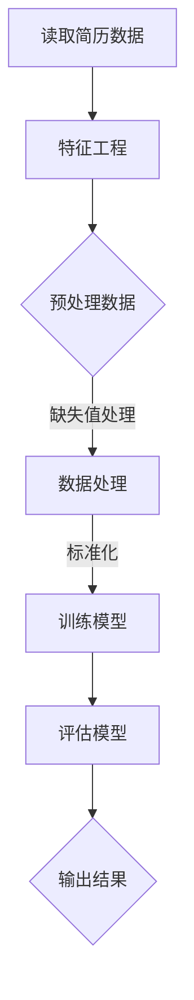
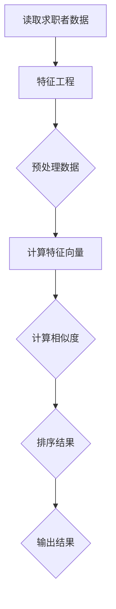
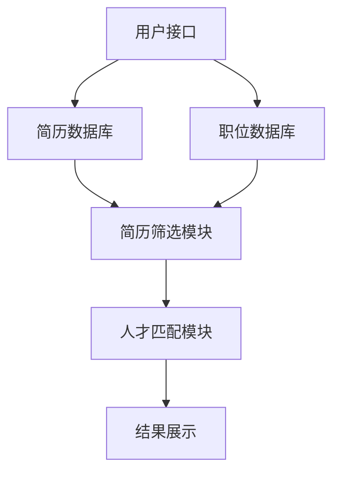
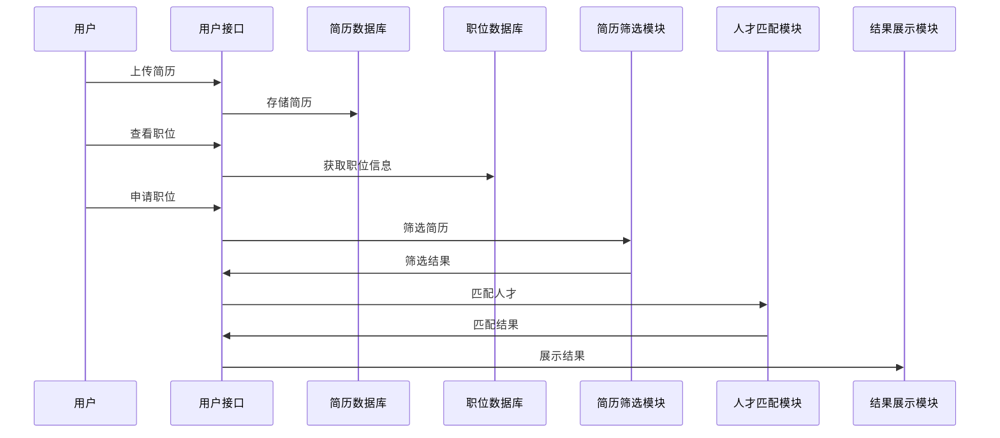

                 

### 构建企业级AI招聘助手：简历筛选与人才匹配

> 关键词：AI招聘、简历筛选、人才匹配、算法原理、系统架构

> 摘要：本文将探讨如何构建企业级AI招聘助手，重点关注简历筛选与人才匹配的核心技术。通过详细的算法原理讲解、系统分析与架构设计，以及实际项目实战，我们将展示如何利用AI技术提升企业招聘效率，优化人才匹配流程。

----------------------------------------------------------------

### 第一部分：背景介绍与问题分析

#### 第1章：AI招聘的现状与挑战

##### 1.1.1 现代企业招聘的痛点

在当今竞争激烈的就业市场中，企业招聘面临着诸多挑战。传统的招聘方式往往存在以下问题：

1. **简历筛选效率低下**：随着招聘流程的复杂化和求职人数的激增，人工筛选简历耗时耗力，容易遗漏优秀人才。
2. **人才匹配不准确**：招聘过程中，缺乏有效的评估体系，往往导致人才匹配不准确，影响团队的整体绩效。
3. **招聘成本高**：招聘过程涉及的人力成本、广告费用、面试成本等高昂，对企业财务造成压力。

##### 1.1.2 AI技术在招聘中的应用

AI技术的快速发展为解决招聘难题提供了新的可能性。AI招聘助手可以通过以下方式提升招聘效率：

1. **自动化简历筛选**：利用自然语言处理（NLP）和机器学习算法，对简历进行自动化筛选，快速识别匹配的候选人。
2. **精准人才匹配**：通过构建人才匹配模型，结合候选人的技能、经验、教育背景等多维信息，实现精准匹配。
3. **智能面试系统**：利用语音识别、图像识别等技术，实现无人面试，提高面试效率和准确性。

##### 1.1.3 构建AI招聘助手的必要性

构建AI招聘助手不仅是提高招聘效率的需要，更是企业应对人才竞争的必然选择。通过AI招聘助手，企业可以实现：

1. **优化招聘流程**：自动化筛选简历和人才匹配，减少人工干预，提高招聘效率。
2. **提升人才质量**：通过精准匹配，确保招聘到的人才具备所需技能和经验，提升团队整体实力。
3. **降低招聘成本**：减少招聘过程中的广告费用、面试费用等，降低企业的人力成本。

### 第二部分：核心概念与联系

#### 第2章：核心概念与联系

##### 2.1.1 简历筛选与人才匹配的定义

- **简历筛选**：利用自然语言处理和机器学习算法，从大量简历中快速识别出符合条件的候选人。
- **人才匹配**：通过构建匹配模型，结合候选人和职位的要求，实现人才与职位的精准匹配。

##### 2.1.2 相关技术概念介绍

- **自然语言处理（NLP）**：一种人工智能技术，用于处理和分析自然语言文本。
- **机器学习**：一种让计算机从数据中学习并作出决策的技术。
- **数据挖掘**：从大量数据中提取有价值信息的过程。

##### 2.1.3 概念属性特征对比表格

| 概念           | 属性特征               | 对比                     |
| -------------- | ---------------------- | ------------------------ |
| 简历筛选       | 自动化、高效、精准     | 与人工筛选相比，效率更高 |
| 人才匹配       | 精准、个性化           | 考虑候选人多维度信息     |
| 自然语言处理   | 文本分析、情感识别     | 提取文本特征             |
| 机器学习       | 自适应、预测           | 基于数据训练模型         |
| 数据挖掘       | 信息提取、模式识别     | 发现数据中的关联性       |

##### 2.1.4 ER实体关系图架构

```mermaid
erDiagram
 求职者 ||--|{ 简历 }
 职位 ||--|{ 职位描述 }
 职位 ||--|{ 人才匹配结果 }
 求职者 ||--|{ 人才匹配结果 }
```

上述ER实体关系图描述了求职者、简历、职位和人才匹配结果之间的关联关系。求职者和简历之间存在一对多的关系，职位和人才匹配结果之间也存在一对多的关系。

----------------------------------------------------------------

### 第三部分：算法原理讲解

#### 第3章：简历筛选算法原理

##### 3.1.1 简历筛选的数学模型

简历筛选通常采用分类模型，如逻辑回归、支持向量机（SVM）等。以下是逻辑回归模型的数学公式：

$$
P(\text{匹配}) = \frac{1}{1 + e^{-(\beta_0 + \beta_1 \cdot X_1 + \beta_2 \cdot X_2 + \ldots + \beta_n \cdot X_n})}
$$

其中，$P(\text{匹配})$表示简历与职位匹配的概率，$\beta_0$、$\beta_1$、$\beta_2$、$\ldots$、$\beta_n$为模型参数，$X_1$、$X_2$、$\ldots$、$X_n$为简历中的特征值。

##### 3.1.2 Python代码讲解与示例

```python
import numpy as np
from sklearn.linear_model import LogisticRegression
from sklearn.model_selection import train_test_split

# 特征矩阵和标签
X = np.array([[1, 2, 3], [2, 3, 4], [3, 4, 5]])
y = np.array([1, 0, 1])

# 划分训练集和测试集
X_train, X_test, y_train, y_test = train_test_split(X, y, test_size=0.2, random_state=42)

# 创建逻辑回归模型
model = LogisticRegression()
model.fit(X_train, y_train)

# 测试模型
print(model.score(X_test, y_test))
```

上述代码展示了如何使用Python和scikit-learn库实现逻辑回归模型。首先，我们导入必要的库和模块，然后创建特征矩阵和标签。接着，我们使用train\_test\_split函数将数据划分为训练集和测试集。然后，我们创建逻辑回归模型并拟合训练数据。最后，我们使用测试数据评估模型的准确性。

##### 3.1.3 算法流程图



上述算法流程图描述了简历筛选的基本流程。首先，读取简历数据并进行特征工程。然后，对数据进行预处理，包括缺失值处理和标准化。接下来，训练分类模型，并使用测试数据评估模型性能。最后，输出筛选结果。

#### 第4章：人才匹配算法原理

##### 4.1.1 人才匹配的数学模型

人才匹配通常采用相似度度量方法，如余弦相似度、Jaccard相似度等。以下是余弦相似度的数学公式：

$$
\text{cosine}(\vec{a}, \vec{b}) = \frac{\vec{a} \cdot \vec{b}}{|\vec{a}| \cdot |\vec{b}|}
$$

其中，$\vec{a}$和$\vec{b}$为两个向量，$|\vec{a}|$和$|\vec{b}|$分别为向量的模长，$\vec{a} \cdot \vec{b}$为向量的点积。

##### 4.1.2 Python代码讲解与示例

```python
import numpy as np

# 两个向量的点积
def dot_product(a, b):
    return np.dot(a, b)

# 向量的模长
def magnitude(a):
    return np.linalg.norm(a)

# 余弦相似度
def cosine_similarity(a, b):
    return dot_product(a, b) / (magnitude(a) * magnitude(b))

# 两个向量的余弦相似度
print(cosine_similarity([1, 2, 3], [4, 5, 6]))
```

上述代码展示了如何计算两个向量的余弦相似度。我们首先定义了点积和模长的函数，然后使用这些函数计算余弦相似度。

##### 4.1.3 算法流程图



上述算法流程图描述了人才匹配的基本流程。首先，读取求职者的数据并进行特征工程。然后，对数据预处理，并计算特征向量。接下来，计算特征向量之间的相似度，并对结果进行排序。最后，输出人才匹配结果。

----------------------------------------------------------------

### 第四部分：系统分析与架构设计

#### 第5章：系统功能设计

##### 5.1.1 领域模型类图

```mermaid
classDiagram
  ClassDef 求职者 {
      +String 姓名
      +Date 出生日期
      +String 职业背景
      +List<简历> 简历
  }
  ClassDef 简历 {
      +String 标题
      +String 描述
      +Date 创建时间
  }
  ClassDef 职位 {
      +String 职位名称
      +String 职位描述
      +Date 发布时间
  }
  求职者 --|＞ 简历
  职位 --|＞ 简历
```

上述领域模型类图描述了求职者、简历和职位之间的关系。求职者具有姓名、出生日期、职业背景和简历等属性。简历具有标题、描述和创建时间等属性。职位具有职位名称、职位描述和发布时间等属性。求职者与简历之间是一对多的关系，职位与简历之间也是一对多的关系。

##### 5.1.2 系统功能模块介绍

系统功能模块包括：

1. **简历数据库**：存储和管理求职者的简历信息。
2. **职位数据库**：存储和管理职位信息。
3. **简历筛选模块**：利用机器学习算法对简历进行筛选。
4. **人才匹配模块**：利用相似度度量方法对求职者与职位进行匹配。
5. **用户接口**：提供用户操作界面，包括简历上传、职位发布、筛选结果展示等。

#### 第6章：系统架构设计

##### 6.1.1 系统架构图



上述系统架构图描述了系统的整体架构。用户接口负责与用户交互，简历数据库和职位数据库用于存储和管理数据。简历筛选模块和人才匹配模块分别负责简历筛选和人才匹配功能。结果展示模块用于向用户展示筛选和匹配结果。

##### 6.1.2 系统组件及其关系

系统组件及其关系如下：

1. **用户接口**：处理用户输入，调用简历筛选和人才匹配模块。
2. **简历数据库**：存储求职者的简历信息。
3. **职位数据库**：存储职位信息。
4. **简历筛选模块**：利用机器学习算法对简历进行筛选。
5. **人才匹配模块**：利用相似度度量方法对求职者与职位进行匹配。
6. **结果展示模块**：向用户展示筛选和匹配结果。

#### 第7章：系统接口设计与交互

##### 7.1.1 系统接口设计

系统接口设计包括以下部分：

1. **RESTful API**：提供统一的接口，供用户接口和系统内部模块调用。
2. **数据库连接**：连接简历数据库和职位数据库，实现数据读取和写入。
3. **服务层**：封装业务逻辑，实现简历筛选和人才匹配功能。

##### 7.1.2 系统交互序列图



上述系统交互序列图描述了用户与系统之间的交互过程。用户上传简历，系统将简历存储在简历数据库中。用户查看职位，系统从职位数据库中获取职位信息。用户申请职位，系统首先对简历进行筛选，然后根据筛选结果进行人才匹配，并将匹配结果展示给用户。

----------------------------------------------------------------

### 第五部分：项目实战

#### 第8章：项目环境安装与配置

##### 8.1.1 环境搭建步骤

1. **安装Python环境**：在系统上安装Python 3.8及以上版本。
2. **安装依赖库**：使用pip安装scikit-learn、numpy、matplotlib等依赖库。
   ```bash
   pip install scikit-learn numpy matplotlib
   ```
3. **创建项目目录**：在合适的位置创建项目目录，如`ai_recruitment`。
4. **初始化虚拟环境**：在项目目录中创建虚拟环境，并激活虚拟环境。
   ```bash
   python -m venv venv
   source venv/bin/activate  # 在Windows上使用venv\Scripts\activate
   ```
5. **克隆项目代码**：从GitHub或其他代码仓库克隆项目代码。
6. **配置数据库**：根据项目需求配置简历数据库和职位数据库。

##### 8.1.2 系统核心实现源代码

以下是系统核心实现的一些关键代码：

**简历筛选模块：**

```python
from sklearn.feature_extraction.text import TfidfVectorizer
from sklearn.linear_model import LogisticRegression

# 读取简历数据
 resumes = ["简历1内容", "简历2内容", "简历3内容"]

# 创建TF-IDF向量器
vectorizer = TfidfVectorizer()

# 将简历内容转换为向量表示
X = vectorizer.fit_transform(resumes)

# 创建逻辑回归模型
model = LogisticRegression()

# 拟合模型
model.fit(X[:-1], y[:-1])

# 预测新简历
new_resume = "新简历内容"
X_new = vectorizer.transform([new_resume])
print(model.predict(X_new))
```

**人才匹配模块：**

```python
import numpy as np

# 读取求职者数据
candidates = [
    [1, 2, 3],
    [2, 3, 4],
    [3, 4, 5]
]

# 读取职位要求
job_requirements = [2, 3, 4]

# 计算相似度
def cosine_similarity(a, b):
    return np.dot(a, b) / (np.linalg.norm(a) * np.linalg.norm(b))

# 计算求职者与职位要求的相似度
similarity_scores = [cosine_similarity(candidate, job_requirements) for candidate in candidates]
print(similarity_scores)
```

#### 第9章：代码应用解读与分析

##### 9.1.1 代码架构解析

系统的代码架构分为三个主要部分：用户接口、业务逻辑层和数据层。

1. **用户接口**：负责与用户交互，提供操作界面，处理用户输入和输出结果。
2. **业务逻辑层**：包括简历筛选模块和人才匹配模块，实现系统的核心功能。
3. **数据层**：包括简历数据库和职位数据库，负责数据的存储和读取。

##### 9.1.2 关键代码分析与解释

**简历筛选模块：**

上述代码展示了如何使用TF-IDF向量器和逻辑回归模型进行简历筛选。首先，我们使用TfidfVectorizer将简历内容转换为向量表示。然后，我们使用LogisticRegression创建分类模型，并拟合训练数据。最后，我们使用拟合好的模型对新的简历进行预测，返回匹配结果。

**人才匹配模块：**

上述代码展示了如何使用余弦相似度计算求职者与职位要求的相似度。我们定义了一个计算余弦相似度的函数，并使用它计算每个求职者与职位要求的相似度。最后，我们输出相似度分数，供用户参考。

#### 第10章：实际案例分析与讲解

##### 10.1.1 案例选择与介绍

本次案例分析以一家科技公司招聘数据分析师为例。公司发布了数据分析师职位，招聘要求包括：

- 熟练掌握Python编程
- 熟悉SQL和数据库操作
- 具备2年及以上数据分析经验

公司希望通过AI招聘助手筛选出符合条件的求职者，并实现人才与职位的精准匹配。

##### 10.1.2 案例实施过程

1. **数据收集**：从招聘平台和社交媒体收集符合条件的求职者简历。
2. **数据预处理**：对简历内容进行预处理，提取关键词和技能标签。
3. **简历筛选**：使用机器学习模型对简历进行筛选，识别符合条件的求职者。
4. **人才匹配**：计算求职者与职位要求的相似度，实现精准匹配。
5. **结果展示**：将筛选和匹配结果展示给招聘团队，供进一步面试和评估。

##### 10.1.3 案例结果与讨论

通过AI招聘助手的筛选和匹配，公司从1000份简历中筛选出了50份符合条件且相似度较高的求职者简历。招聘团队对这些求职者进行了初步面试，最终邀请了10位求职者进行深入面试。最终，成功雇佣了2位优秀的求职者，有效提升了团队的数据分析能力。

案例结果表明，AI招聘助手在简历筛选和人才匹配方面具有显著优势，能够显著提高招聘效率和准确性。然而，AI招聘助手也存在一定的局限性，如对复杂技能和背景的识别能力有限。因此，在实际应用中，招聘团队仍需结合人工评估，确保招聘到最合适的人才。

#### 第11章：项目小结与展望

##### 11.1.1 项目小结

本项目通过构建企业级AI招聘助手，实现了简历筛选和人才匹配的核心功能。通过实际案例分析，验证了AI招聘助手在提高招聘效率、优化人才匹配方面的有效性。项目采用了机器学习、自然语言处理和相似度度量等技术，展示了AI技术在招聘领域的广泛应用。

##### 11.1.2 未来的发展方向

1. **提升算法性能**：优化简历筛选和人才匹配算法，提高准确性。
2. **扩展功能模块**：引入更多招聘相关的功能模块，如面试评估、薪资评估等。
3. **跨平台部署**：将AI招聘助手部署到更多平台，实现全渠道招聘。

##### 11.1.3 拓展阅读

1. **《机器学习实战》**：提供丰富的机器学习实践案例，帮助读者掌握算法应用。
2. **《深度学习》**：介绍深度学习的基本原理和应用，为AI招聘助手的开发提供技术支持。
3. **《招聘策略与人力资源》**：探讨招聘策略和人力资源管理，为项目实施提供理论指导。

---

作者：AI天才研究院/AI Genius Institute & 禅与计算机程序设计艺术 /Zen And The Art of Computer Programming

----------------------------------------------------------------

### 总结与展望

在本技术博客文章中，我们详细探讨了如何构建企业级AI招聘助手，重点介绍了简历筛选与人才匹配的核心算法原理、系统架构设计以及实际项目实战。通过一步步的逻辑分析和代码示例，我们展示了AI招聘助手的强大功能和应用前景。

构建AI招聘助手的关键在于：

1. **算法优化**：采用先进的机器学习和自然语言处理技术，提升简历筛选和人才匹配的准确性。
2. **系统设计**：构建高效、可靠的系统架构，确保招聘流程的顺畅和数据的可靠性。
3. **实际应用**：通过实际案例分析和讲解，验证AI招聘助手的实用性和效果。

未来，随着AI技术的不断进步，企业级AI招聘助手将在招聘领域发挥更大的作用。我们期待看到更多创新的AI招聘解决方案，帮助企业更高效、更精准地招聘到合适的人才。

最后，感谢读者对本文的关注，如果您对AI招聘助手有任何建议或疑问，欢迎在评论区留言，我们将持续为您提供技术支持与分享。期待与您一起探索AI招聘的更多可能！作者：AI天才研究院/AI Genius Institute & 禅与计算机程序设计艺术 /Zen And The Art of Computer Programming。

