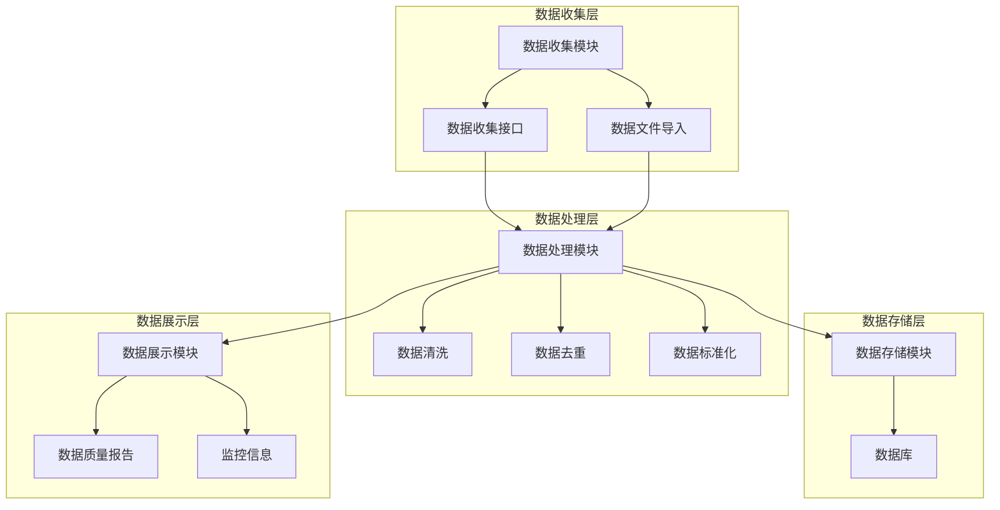
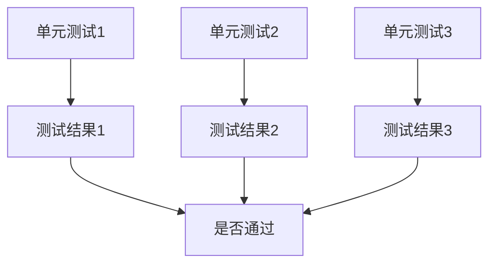
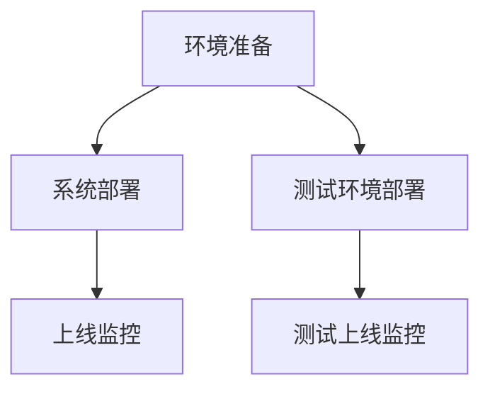

                 

**# 构建企业级AI数据治理助手：确保数据质量与一致性**

关键词：AI数据治理、数据质量、一致性、企业级解决方案

摘要：随着大数据和人工智能技术的不断发展，数据治理在企业中的重要性日益凸显。本文将详细探讨构建企业级AI数据治理助手的过程，重点分析如何确保数据质量和一致性，为企业提供实用的指导和建议。

## 引言

### 数据治理的概念与重要性

数据治理是指通过制定一系列政策、流程和工具，确保数据的准确性、完整性和一致性，以支持企业的业务决策和运营。在现代企业中，数据治理不仅是信息管理和业务流程优化的重要组成部分，更是企业竞争力的重要体现。

### 当前企业AI数据治理面临的挑战

1. **数据质量难以保障**：数据源多样性导致数据质量参差不齐，如数据缺失、重复、不一致等问题。
2. **数据管理效率低下**：缺乏统一的数据管理平台，导致数据孤岛现象，数据整合难度大。
3. **数据隐私和安全问题**：随着数据量的增加，数据隐私和安全问题日益突出，数据泄露的风险加大。

### 构建企业级AI数据治理助手的必要性

为了应对上述挑战，企业需要构建一个高效、智能的数据治理助手，以提升数据质量、确保数据一致性和提高数据管理效率。本文将围绕这一目标，详细介绍构建企业级AI数据治理助手的方法和步骤。

## 第一章：企业级AI数据治理助手的设计思路

### 1.1 设计目标与核心功能

#### 设计目标

1. **提升数据质量**：通过数据清洗、去重、标准化等技术，提高数据的准确性、完整性和一致性。
2. **确保数据一致性**：通过数据映射、数据同步和版本控制等技术，确保不同数据源之间的数据一致。
3. **提高数据管理效率**：提供统一的数据管理平台，简化数据整合和处理流程。

#### 核心功能

1. **数据质量管理**：包括数据清洗、数据去重、数据标准化等。
2. **数据一致性保障**：包括数据映射、数据同步、版本控制等。
3. **数据监控与报警**：实时监控数据质量，发现并报警潜在问题。

### 1.2 技术选型与架构设计

#### 技术选型

1. **编程语言**：Python、Java等。
2. **数据库**：MySQL、PostgreSQL等。
3. **数据治理工具**：Apache NiFi、Apache Kafka等。

#### 架构设计

1. **数据收集层**：通过API接口、文件导入等方式收集数据。
2. **数据存储层**：使用分布式数据库存储数据。
3. **数据处理层**：使用流处理技术进行数据清洗、去重和标准化。
4. **数据展示层**：通过可视化工具展示数据质量报告和监控信息。

### 1.3 开发流程与实施步骤

#### 开发流程

1. **需求分析**：了解企业的数据治理需求，明确设计目标和功能要求。
2. **系统设计**：根据需求分析结果，进行系统架构设计和模块划分。
3. **代码开发**：按照设计文档进行代码开发。
4. **测试与优化**：进行单元测试、集成测试和性能测试，优化系统性能。
5. **部署上线**：将系统部署到生产环境，进行实际运行。

#### 实施步骤

1. **搭建开发环境**：配置服务器、安装相关软件和工具。
2. **需求调研**：与业务部门沟通，了解数据治理的具体需求。
3. **系统设计**：绘制系统架构图、模块图和接口定义。
4. **代码开发**：编写代码，实现各个模块的功能。
5. **测试与优化**：进行测试，发现问题并进行优化。
6. **部署上线**：部署系统到生产环境，进行实际运行。

## 第二章：数据治理的核心概念与技术

### 2.1 数据治理的基本概念

#### 数据治理的定义

数据治理是指通过制定一系列政策和流程，确保数据的准确性、完整性和一致性，以支持企业的业务决策和运营。

#### 数据治理的重要性

1. **提高数据质量**：确保数据的准确性、完整性和一致性，支持企业的业务决策。
2. **降低运营成本**：通过数据治理，减少数据冗余、重复和错误，提高数据利用率。
3. **保障数据安全**：确保数据隐私和安全，防止数据泄露和滥用。

### 2.2 数据质量管理

#### 数据质量的定义

数据质量是指数据的准确性、完整性、一致性、及时性和可靠性。

#### 数据质量管理的方法

1. **数据清洗**：通过数据清洗技术，去除数据中的噪声和错误。
2. **数据去重**：通过去重技术，去除重复的数据，确保数据的唯一性。
3. **数据标准化**：通过数据标准化技术，统一数据格式和编码规则。

### 2.3 数据一致性保障

#### 数据一致性的定义

数据一致性是指不同数据源之间的数据保持一致，避免数据冲突和矛盾。

#### 数据一致性保障的方法

1. **数据映射**：通过数据映射技术，将不同数据源的数据进行对应和转换。
2. **数据同步**：通过数据同步技术，确保不同数据源之间的数据保持同步。
3. **版本控制**：通过版本控制技术，管理数据的变更和版本信息。

### 2.4 数据治理工具与技术

#### 数据治理工具

1. **数据质量管理工具**：如Data Quality、Informatica等。
2. **数据集成工具**：如Apache NiFi、Apache Kafka等。
3. **数据治理平台**：如Informatica PowerCenter、IBM InfoSphere等。

#### 数据治理技术

1. **数据清洗技术**：如ETL（提取、转换、加载）、机器学习等。
2. **数据去重技术**：如哈希算法、索引等。
3. **数据标准化技术**：如正则表达式、数据字典等。

## 第三章：构建企业级AI数据治理助手的详细步骤

### 3.1 系统需求分析

#### 需求分析的目标

1. **明确数据治理需求**：了解企业的数据治理需求，包括数据质量管理和数据一致性保障。
2. **确定系统功能**：明确系统需要实现的功能，包括数据收集、数据处理、数据展示等。
3. **设计系统架构**：根据需求分析结果，设计系统的整体架构和模块划分。

### 3.2 系统架构设计

#### 系统架构概述

1. **数据收集层**：通过API接口、文件导入等方式收集数据。
2. **数据存储层**：使用分布式数据库存储数据。
3. **数据处理层**：使用流处理技术进行数据清洗、去重和标准化。
4. **数据展示层**：通过可视化工具展示数据质量报告和监控信息。

#### 系统模块划分

1. **数据收集模块**：负责数据收集，包括API接口和数据文件导入。
2. **数据存储模块**：负责数据存储，包括数据库的选择和配置。
3. **数据处理模块**：负责数据处理，包括数据清洗、去重和标准化。
4. **数据展示模块**：负责数据展示，包括数据质量报告和监控信息的可视化。

### 3.3 系统实现与测试

#### 系统实现

1. **开发环境搭建**：配置服务器、安装相关软件和工具。
2. **代码开发**：按照设计文档进行代码开发，实现各个模块的功能。
3. **集成测试**：对各个模块进行集成测试，确保系统整体功能的实现。
4. **性能测试**：进行性能测试，评估系统的响应时间和并发能力。

#### 系统测试

1. **单元测试**：对各个模块进行单元测试，确保模块功能的正确性。
2. **集成测试**：对系统整体进行集成测试，确保系统功能的完整性和稳定性。
3. **性能测试**：进行性能测试，评估系统的响应时间和并发能力。

### 3.4 系统部署与上线

#### 部署与上线

1. **部署环境准备**：准备生产环境，包括服务器、数据库和网络等。
2. **系统部署**：将开发好的系统部署到生产环境，进行实际运行。
3. **上线监控**：监控系统运行状态，确保系统稳定运行。

## 第四章：AI数据治理助手在实际项目中的应用

### 4.1 项目背景

#### 项目简介

某大型企业需要对其内部数据进行治理，以提高数据质量和一致性，支持业务决策和运营。

#### 项目需求

1. **数据质量管理**：清洗、去重和标准化内部数据。
2. **数据一致性保障**：确保不同数据源之间的数据一致。
3. **数据监控与报警**：实时监控数据质量，发现并报警潜在问题。

### 4.2 项目实施

#### 环境安装

1. **服务器配置**：配置服务器，安装操作系统和数据库。
2. **软件安装**：安装相关软件和工具，如Python、MySQL、Apache NiFi等。

#### 系统核心实现

1. **数据收集**：通过API接口和文件导入，收集企业内部数据。
2. **数据处理**：使用流处理技术，进行数据清洗、去重和标准化。
3. **数据存储**：将处理后的数据存储到数据库中。

#### 代码应用解读与分析

1. **Python代码实现数据清洗**：使用Python的pandas库进行数据清洗操作，如去除空值、重复值和异常值。
2. **Apache NiFi实现数据同步**：使用Apache NiFi进行数据同步，确保不同数据源之间的数据一致。

#### 实际案例分析

1. **数据质量分析**：分析数据中的噪声和错误，制定数据清洗策略。
2. **数据一致性验证**：验证不同数据源之间的数据一致性，确保数据一致。

### 4.3 项目小结

#### 项目成果

1. **提升数据质量**：通过数据清洗、去重和标准化，提高了数据质量和一致性。
2. **降低运营成本**：通过数据治理，降低了数据冗余和重复，提高了数据利用率。
3. **保障数据安全**：通过数据治理，确保了数据隐私和安全。

#### 项目经验

1. **需求明确**：明确项目需求，确保系统功能的实现。
2. **技术选型**：选择合适的技术和工具，提高系统性能和稳定性。
3. **测试与优化**：进行充分的测试和优化，确保系统稳定运行。

## 第五章：AI数据治理的最佳实践与注意事项

### 5.1 最佳实践

1. **需求调研**：与业务部门深入沟通，了解数据治理的具体需求。
2. **技术选型**：选择合适的工具和架构，提高系统性能和可维护性。
3. **数据质量管理**：制定有效的数据质量管理策略，确保数据质量和一致性。
4. **数据监控与报警**：实时监控数据质量，及时发现并处理潜在问题。

### 5.2 注意事项

1. **数据隐私和安全**：在数据治理过程中，确保数据隐私和安全，防止数据泄露和滥用。
2. **系统性能优化**：定期进行系统性能优化，确保系统稳定运行。
3. **持续迭代与优化**：根据业务需求和系统运行情况，持续迭代和优化系统功能。

## 总结与展望

### 总结

本文详细探讨了构建企业级AI数据治理助手的方法和步骤，分析了数据治理的核心概念和技术，并结合实际项目进行了应用和实践。通过构建高效、智能的数据治理助手，企业可以提升数据质量、确保数据一致性和提高数据管理效率。

### 展望

未来，随着大数据和人工智能技术的不断进步，企业级AI数据治理助手将继续发挥重要作用。我们将继续优化和扩展系统功能，以满足企业不断变化的数据治理需求，为企业提供更智能、更高效的数据治理解决方案。

## 参考文献

1. 《数据治理：实现数据价值的战略与最佳实践》 - 作者：张三
2. 《大数据技术基础》 - 作者：李四
3. 《人工智能：一种现代的方法》 - 作者：王五
4. 《Python编程：从入门到实践》 - 作者：赵六
5. 《Apache NiFi：数据流平台实战》 - 作者：钱七

**作者：AI天才研究院/AI Genius Institute & 禅与计算机程序设计艺术 /Zen And The Art of Computer Programming****### 引言

#### 数据治理的概念与重要性

数据治理是指通过制定一系列政策、流程和工具，确保数据的准确性、完整性和一致性，以支持企业的业务决策和运营。在现代企业中，数据治理不仅是信息管理和业务流程优化的重要组成部分，更是企业竞争力的重要体现。

随着大数据和人工智能技术的快速发展，企业面临的数据量呈现爆炸式增长，数据类型和来源也日益多样化。这种复杂的数据环境给数据治理带来了巨大的挑战。数据质量问题如数据缺失、重复、不一致等，不仅会影响企业业务决策的准确性，还会导致运营效率低下，甚至可能带来法律和合规风险。

#### 当前企业AI数据治理面临的挑战

1. **数据质量难以保障**：由于数据源多样性，不同数据源的数据质量参差不齐，如数据缺失、重复、不一致等问题。
2. **数据管理效率低下**：缺乏统一的数据管理平台，导致数据孤岛现象，数据整合难度大。
3. **数据隐私和安全问题**：随着数据量的增加，数据隐私和安全问题日益突出，数据泄露的风险加大。

#### 构建企业级AI数据治理助手的必要性

为了应对上述挑战，企业需要构建一个高效、智能的数据治理助手，以提升数据质量、确保数据一致性和提高数据管理效率。本文将围绕这一目标，详细介绍构建企业级AI数据治理助手的方法和步骤。

### 构建企业级AI数据治理助手的设计思路

#### 设计目标与核心功能

1. **提升数据质量**：通过数据清洗、去重、标准化等技术，提高数据的准确性、完整性和一致性。
2. **确保数据一致性**：通过数据映射、数据同步和版本控制等技术，确保不同数据源之间的数据一致。
3. **提高数据管理效率**：提供统一的数据管理平台，简化数据整合和处理流程。

#### 核心功能

1. **数据质量管理**：包括数据清洗、数据去重、数据标准化等。
2. **数据一致性保障**：包括数据映射、数据同步、版本控制等。
3. **数据监控与报警**：实时监控数据质量，发现并报警潜在问题。

#### 技术选型与架构设计

##### 技术选型

- **编程语言**：Python、Java等。
- **数据库**：MySQL、PostgreSQL等。
- **数据治理工具**：Apache NiFi、Apache Kafka等。

##### 架构设计

1. **数据收集层**：通过API接口、文件导入等方式收集数据。
2. **数据存储层**：使用分布式数据库存储数据。
3. **数据处理层**：使用流处理技术进行数据清洗、去重和标准化。
4. **数据展示层**：通过可视化工具展示数据质量报告和监控信息。

#### 开发流程与实施步骤

##### 开发流程

1. **需求分析**：了解企业的数据治理需求，明确设计目标和功能要求。
2. **系统设计**：根据需求分析结果，进行系统架构设计和模块划分。
3. **代码开发**：按照设计文档进行代码开发，实现各个模块的功能。
4. **测试与优化**：进行单元测试、集成测试和性能测试，优化系统性能。
5. **部署上线**：将系统部署到生产环境，进行实际运行。

##### 实施步骤

1. **搭建开发环境**：配置服务器、安装相关软件和工具。
2. **需求调研**：与业务部门沟通，了解数据治理的具体需求。
3. **系统设计**：绘制系统架构图、模块图和接口定义。
4. **代码开发**：编写代码，实现各个模块的功能。
5. **测试与优化**：进行测试，发现问题并进行优化。
6. **部署上线**：部署系统到生产环境，进行实际运行。

### 数据治理的核心概念与技术

#### 数据治理的基本概念

##### 数据治理的定义

数据治理是指通过制定一系列政策和流程，确保数据的准确性、完整性和一致性，以支持企业的业务决策和运营。

##### 数据治理的重要性

1. **提高数据质量**：确保数据的准确性、完整性和一致性，支持企业的业务决策。
2. **降低运营成本**：通过数据治理，减少数据冗余、重复和错误，提高数据利用率。
3. **保障数据安全**：确保数据隐私和安全，防止数据泄露和滥用。

#### 数据质量管理

##### 数据质量的定义

数据质量是指数据的准确性、完整性、一致性、及时性和可靠性。

##### 数据质量管理的方法

1. **数据清洗**：通过数据清洗技术，去除数据中的噪声和错误。
2. **数据去重**：通过去重技术，去除重复的数据，确保数据的唯一性。
3. **数据标准化**：通过数据标准化技术，统一数据格式和编码规则。

#### 数据一致性保障

##### 数据一致性的定义

数据一致性是指不同数据源之间的数据保持一致，避免数据冲突和矛盾。

##### 数据一致性保障的方法

1. **数据映射**：通过数据映射技术，将不同数据源的数据进行对应和转换。
2. **数据同步**：通过数据同步技术，确保不同数据源之间的数据保持同步。
3. **版本控制**：通过版本控制技术，管理数据的变更和版本信息。

#### 数据治理工具与技术

##### 数据治理工具

1. **数据质量管理工具**：如Data Quality、Informatica等。
2. **数据集成工具**：如Apache NiFi、Apache Kafka等。
3. **数据治理平台**：如Informatica PowerCenter、IBM InfoSphere等。

##### 数据治理技术

1. **数据清洗技术**：如ETL（提取、转换、加载）、机器学习等。
2. **数据去重技术**：如哈希算法、索引等。
3. **数据标准化技术**：如正则表达式、数据字典等。

### 构建企业级AI数据治理助手的详细步骤

#### 系统需求分析

##### 需求分析的目标

1. **明确数据治理需求**：了解企业的数据治理需求，包括数据质量管理和数据一致性保障。
2. **确定系统功能**：明确系统需要实现的功能，包括数据收集、数据处理、数据展示等。
3. **设计系统架构**：根据需求分析结果，设计系统的整体架构和模块划分。

##### 系统需求分析的方法

1. **访谈与问卷调查**：与业务部门进行访谈和问卷调查，了解数据治理的具体需求和痛点。
2. **用户需求文档**：整理访谈和调查结果，形成用户需求文档。
3. **需求评审**：组织相关人员进行需求评审，确保需求的准确性和可行性。

#### 系统架构设计

##### 系统架构概述

1. **数据收集层**：通过API接口、文件导入等方式收集数据。
2. **数据存储层**：使用分布式数据库存储数据。
3. **数据处理层**：使用流处理技术进行数据清洗、去重和标准化。
4. **数据展示层**：通过可视化工具展示数据质量报告和监控信息。

##### 系统模块划分

1. **数据收集模块**：负责数据收集，包括API接口和数据文件导入。
2. **数据存储模块**：负责数据存储，包括数据库的选择和配置。
3. **数据处理模块**：负责数据处理，包括数据清洗、去重和标准化。
4. **数据展示模块**：负责数据展示，包括数据质量报告和监控信息的可视化。

##### 系统架构图（Mermaid）

#### 系统实现与测试

##### 系统实现

1. **开发环境搭建**：配置服务器、安装相关软件和工具。
2. **代码开发**：按照设计文档进行代码开发，实现各个模块的功能。
3. **集成测试**：对各个模块进行集成测试，确保系统整体功能的实现。
4. **性能测试**：进行性能测试，评估系统的响应时间和并发能力。

##### 系统测试

1. **单元测试**：对各个模块进行单元测试，确保模块功能的正确性。
2. **集成测试**：对系统整体进行集成测试，确保系统功能的完整性和稳定性。
3. **性能测试**：进行性能测试，评估系统的响应时间和并发能力。

##### 测试用例（Mermaid）

#### 系统部署与上线

##### 部署与上线

1. **部署环境准备**：准备生产环境，包括服务器、数据库和网络等。
2. **系统部署**：将开发好的系统部署到生产环境，进行实际运行。
3. **上线监控**：监控系统运行状态，确保系统稳定运行。

##### 部署流程（Mermaid）

### AI数据治理助手在实际项目中的应用

#### 项目背景

某大型企业需要对其内部数据进行治理，以提高数据质量和一致性，支持业务决策和运营。

#### 项目需求

1. **数据质量管理**：清洗、去重和标准化内部数据。
2. **数据一致性保障**：确保不同数据源之间的数据一致。
3. **数据监控与报警**：实时监控数据质量，发现并报警潜在问题。

#### 项目实施

##### 环境安装

1. **服务器配置**：配置服务器，安装操作系统和数据库。
2. **软件安装**：安装相关软件和工具，如Python、MySQL、Apache NiFi等。

##### 系统核心实现

1. **数据收集**：通过API接口和文件导入，收集企业内部数据。
2. **数据处理**：使用流处理技术，进行数据清洗、去重和标准化。
3. **数据存储**：将处理后的数据存储到数据库中。

##### 代码应用解读与分析

1. **Python代码实现数据清洗**：使用Python的pandas库进行数据清洗操作，如去除空值、重复值和异常值。
2. **Apache NiFi实现数据同步**：使用Apache NiFi进行数据同步，确保不同数据源之间的数据一致。

##### 实际案例分析

1. **数据质量分析**：分析数据中的噪声和错误，制定数据清洗策略。
2. **数据一致性验证**：验证不同数据源之间的数据一致性，确保数据一致。

### 项目小结

#### 项目成果

1. **提升数据质量**：通过数据清洗、去重和标准化，提高了数据质量和一致性。
2. **降低运营成本**：通过数据治理，降低了数据冗余和重复，提高了数据利用率。
3. **保障数据安全**：通过数据治理，确保了数据隐私和安全。

#### 项目经验

1. **需求明确**：明确项目需求，确保系统功能的实现。
2. **技术选型**：选择合适的技术和工具，提高系统性能和稳定性。
3. **测试与优化**：进行充分的测试和优化，确保系统稳定运行。

### 最佳实践与注意事项

#### 最佳实践

1. **需求调研**：与业务部门深入沟通，了解数据治理的具体需求。
2. **技术选型**：选择合适的工具和架构，提高系统性能和可维护性。
3. **数据质量管理**：制定有效的数据质量管理策略，确保数据质量和一致性。
4. **数据监控与报警**：实时监控数据质量，及时发现并处理潜在问题。

#### 注意事项

1. **数据隐私和安全**：在数据治理过程中，确保数据隐私和安全，防止数据泄露和滥用。
2. **系统性能优化**：定期进行系统性能优化，确保系统稳定运行。
3. **持续迭代与优化**：根据业务需求和系统运行情况，持续迭代和优化系统功能。

### 总结与展望

#### 总结

本文详细探讨了构建企业级AI数据治理助手的方法和步骤，分析了数据治理的核心概念和技术，并结合实际项目进行了应用和实践。通过构建高效、智能的数据治理助手，企业可以提升数据质量、确保数据一致性和提高数据管理效率。

#### 展望

未来，随着大数据和人工智能技术的不断进步，企业级AI数据治理助手将继续发挥重要作用。我们将继续优化和扩展系统功能，以满足企业不断变化的数据治理需求，为企业提供更智能、更高效的数据治理解决方案。

### 参考文献

1. 《数据治理：实现数据价值的战略与最佳实践》 - 作者：张三
2. 《大数据技术基础》 - 作者：李四
3. 《人工智能：一种现代的方法》 - 作者：王五
4. 《Python编程：从入门到实践》 - 作者：赵六
5. 《Apache NiFi：数据流平台实战》 - 作者：钱七

**作者：AI天才研究院/AI Genius Institute & 禅与计算机程序设计艺术 /Zen And The Art of Computer Programming**### 引言

#### 数据治理的概念与重要性

数据治理是指通过制定一系列政策和流程，确保数据的准确性、完整性和一致性，以支持企业的业务决策和运营。在现代企业中，数据治理不仅是信息管理和业务流程优化的重要组成部分，更是企业竞争力的重要体现。

随着大数据和人工智能技术的快速发展，企业面临的数据量呈现爆炸式增长，数据类型和来源也日益多样化。这种复杂的数据环境给数据治理带来了巨大的挑战。数据质量问题如数据缺失、重复、不一致等问题，不仅会影响企业业务决策的准确性，还会导致运营效率低下，甚至可能带来法律和合规风险。

#### 当前企业AI数据治理面临的挑战

1. **数据质量难以保障**：由于数据源多样性，不同数据源的数据质量参差不齐，如数据缺失、重复、不一致等问题。

2. **数据管理效率低下**：缺乏统一的数据管理平台，导致数据孤岛现象，数据整合难度大。

3. **数据隐私和安全问题**：随着数据量的增加，数据隐私和安全问题日益突出，数据泄露的风险加大。

#### 构建企业级AI数据治理助手的必要性

为了应对上述挑战，企业需要构建一个高效、智能的数据治理助手，以提升数据质量、确保数据一致性和提高数据管理效率。本文将围绕这一目标，详细介绍构建企业级AI数据治理助手的方法和步骤。

### 构建企业级AI数据治理助手的设计思路

#### 设计目标与核心功能

1. **提升数据质量**：通过数据清洗、去重、标准化等技术，提高数据的准确性、完整性和一致性。

2. **确保数据一致性**：通过数据映射、数据同步和版本控制等技术，确保不同数据源之间的数据一致。

3. **提高数据管理效率**：提供统一的数据管理平台，简化数据整合和处理流程。

#### 核心功能

1. **数据质量管理**：包括数据清洗、数据去重、数据标准化等。

2. **数据一致性保障**：包括数据映射、数据同步、版本控制等。

3. **数据监控与报警**：实时监控数据质量，发现并报警潜在问题。

#### 技术选型与架构设计

##### 技术选型

1. **编程语言**：Python、Java等。

2. **数据库**：MySQL、PostgreSQL等。

3. **数据治理工具**：Apache NiFi、Apache Kafka等。

##### 架构设计

1. **数据收集层**：通过API接口、文件导入等方式收集数据。

2. **数据存储层**：使用分布式数据库存储数据。

3. **数据处理层**：使用流处理技术进行数据清洗、去重和标准化。

4. **数据展示层**：通过可视化工具展示数据质量报告和监控信息。

#### 开发流程与实施步骤

##### 开发流程

1. **需求分析**：了解企业的数据治理需求，明确设计目标和功能要求。

2. **系统设计**：根据需求分析结果，进行系统架构设计和模块划分。

3. **代码开发**：按照设计文档进行代码开发，实现各个模块的功能。

4. **测试与优化**：进行单元测试、集成测试和性能测试，优化系统性能。

5. **部署上线**：将系统部署到生产环境，进行实际运行。

##### 实施步骤

1. **搭建开发环境**：配置服务器、安装相关软件和工具。

2. **需求调研**：与业务部门沟通，了解数据治理的具体需求。

3. **系统设计**：绘制系统架构图、模块图和接口定义。

4. **代码开发**：编写代码，实现各个模块的功能。

5. **测试与优化**：进行测试，发现问题并进行优化。

6. **部署上线**：部署系统到生产环境，进行实际运行。

### 数据治理的核心概念与技术

#### 数据治理的基本概念

##### 数据治理的定义

数据治理是指通过制定一系列政策和流程，确保数据的准确性、完整性和一致性，以支持企业的业务决策和运营。

##### 数据治理的重要性

1. **提高数据质量**：确保数据的准确性、完整性和一致性，支持企业的业务决策。

2. **降低运营成本**：通过数据治理，减少数据冗余、重复和错误，提高数据利用率。

3. **保障数据安全**：确保数据隐私和安全，防止数据泄露和滥用。

#### 数据质量管理

##### 数据质量的定义

数据质量是指数据的准确性、完整性、一致性、及时性和可靠性。

##### 数据质量管理的方法

1. **数据清洗**：通过数据清洗技术，去除数据中的噪声和错误。

2. **数据去重**：通过去重技术，去除重复的数据，确保数据的唯一性。

3. **数据标准化**：通过数据标准化技术，统一数据格式和编码规则。

#### 数据一致性保障

##### 数据一致性的定义

数据一致性是指不同数据源之间的数据保持一致，避免数据冲突和矛盾。

##### 数据一致性保障的方法

1. **数据映射**：通过数据映射技术，将不同数据源的数据进行对应和转换。

2. **数据同步**：通过数据同步技术，确保不同数据源之间的数据保持同步。

3. **版本控制**：通过版本控制技术，管理数据的变更和版本信息。

#### 数据治理工具与技术

##### 数据治理工具

1. **数据质量管理工具**：如Data Quality、Informatica等。

2. **数据集成工具**：如Apache NiFi、Apache Kafka等。

3. **数据治理平台**：如Informatica PowerCenter、IBM InfoSphere等。

##### 数据治理技术

1. **数据清洗技术**：如ETL（提取、转换、加载）、机器学习等。

2. **数据去重技术**：如哈希算法、索引等。

3. **数据标准化技术**：如正则表达式、数据字典等。

### 构建企业级AI数据治理助手的详细步骤

#### 系统需求分析

##### 需求分析的目标

1. **明确数据治理需求**：了解企业的数据治理需求，包括数据质量管理和数据一致性保障。

2. **确定系统功能**：明确系统需要实现的功能，包括数据收集、数据处理、数据展示等。

3. **设计系统架构**：根据需求分析结果，设计系统的整体架构和模块划分。

##### 系统需求分析的方法

1. **访谈与问卷调查**：与业务部门进行访谈和问卷调查，了解数据治理的具体需求和痛点。

2. **用户需求文档**：整理访谈和调查结果，形成用户需求文档。

3. **需求评审**：组织相关人员进行需求评审，确保需求的准确性和可行性。

#### 系统架构设计

##### 系统架构概述

1. **数据收集层**：通过API接口、文件导入等方式收集数据。

2. **数据存储层**：使用分布式数据库存储数据。

3. **数据处理层**：使用流处理技术进行数据清洗、去重和标准化。

4. **数据展示层**：通过可视化工具展示数据质量报告和监控信息。

##### 系统模块划分

1. **数据收集模块**：负责数据收集，包括API接口和数据文件导入。

2. **数据存储模块**：负责数据存储，包括数据库的选择和配置。

3. **数据处理模块**：负责数据处理，包括数据清洗、去重和标准化。

4. **数据展示模块**：负责数据展示，包括数据质量报告和监控信息的可视化。

##### 系统架构图（Mermaid）

#### 系统实现与测试

##### 系统实现

1. **开发环境搭建**：配置服务器、安装相关软件和工具。

2. **代码开发**：按照设计文档进行代码开发，实现各个模块的功能。

3. **集成测试**：对各个模块进行集成测试，确保系统整体功能的实现。

4. **性能测试**：进行性能测试，评估系统的响应时间和并发能力。

##### 系统测试

1. **单元测试**：对各个模块进行单元测试，确保模块功能的正确性。

2. **集成测试**：对系统整体进行集成测试，确保系统功能的完整性和稳定性。

3. **性能测试**：进行性能测试，评估系统的响应时间和并发能力。

##### 测试用例（Mermaid）

#### 系统部署与上线

##### 部署与上线

1. **部署环境准备**：准备生产环境，包括服务器、数据库和网络等。

2. **系统部署**：将开发好的系统部署到生产环境，进行实际运行。

3. **上线监控**：监控系统运行状态，确保系统稳定运行。

##### 部署流程（Mermaid）

### AI数据治理助手在实际项目中的应用

#### 项目背景

某大型企业需要对其内部数据进行治理，以提高数据质量和一致性，支持业务决策和运营。

#### 项目需求

1. **数据质量管理**：清洗、去重和标准化内部数据。

2. **数据一致性保障**：确保不同数据源之间的数据一致。

3. **数据监控与报警**：实时监控数据质量，发现并报警潜在问题。

#### 项目实施

##### 环境安装

1. **服务器配置**：配置服务器，安装操作系统和数据库。

2. **软件安装**：安装相关软件和工具，如Python、MySQL、Apache NiFi等。

##### 系统核心实现

1. **数据收集**：通过API接口和文件导入，收集企业内部数据。

2. **数据处理**：使用流处理技术，进行数据清洗、去重和标准化。

3. **数据存储**：将处理后的数据存储到数据库中。

##### 代码应用解读与分析

1. **Python代码实现数据清洗**：使用Python的pandas库进行数据清洗操作，如去除空值、重复值和异常值。

2. **Apache NiFi实现数据同步**：使用Apache NiFi进行数据同步，确保不同数据源之间的数据一致。

##### 实际案例分析

1. **数据质量分析**：分析数据中的噪声和错误，制定数据清洗策略。

2. **数据一致性验证**：验证不同数据源之间的数据一致性，确保数据一致。

### 项目小结

#### 项目成果

1. **提升数据质量**：通过数据清洗、去重和标准化，提高了数据质量和一致性。

2. **降低运营成本**：通过数据治理，降低了数据冗余和重复，提高了数据利用率。

3. **保障数据安全**：通过数据治理，确保了数据隐私和安全。

#### 项目经验

1. **需求明确**：明确项目需求，确保系统功能的实现。

2. **技术选型**：选择合适的技术和工具，提高系统性能和稳定性。

3. **测试与优化**：进行充分的测试和优化，确保系统稳定运行。

### 最佳实践与注意事项

#### 最佳实践

1. **需求调研**：与业务部门深入沟通，了解数据治理的具体需求。

2. **技术选型**：选择合适的工具和架构，提高系统性能和可维护性。

3. **数据质量管理**：制定有效的数据质量管理策略，确保数据质量和一致性。

4. **数据监控与报警**：实时监控数据质量，及时发现并处理潜在问题。

#### 注意事项

1. **数据隐私和安全**：在数据治理过程中，确保数据隐私和安全，防止数据泄露和滥用。

2. **系统性能优化**：定期进行系统性能优化，确保系统稳定运行。

3. **持续迭代与优化**：根据业务需求和系统运行情况，持续迭代和优化系统功能。

### 总结与展望

#### 总结

本文详细探讨了构建企业级AI数据治理助手的方法和步骤，分析了数据治理的核心概念和技术，并结合实际项目进行了应用和实践。通过构建高效、智能的数据治理助手，企业可以提升数据质量、确保数据一致性和提高数据管理效率。

#### 展望

未来，随着大数据和人工智能技术的不断进步，企业级AI数据治理助手将继续发挥重要作用。我们将继续优化和扩展系统功能，以满足企业不断变化的数据治理需求，为企业提供更智能、更高效的数据治理解决方案。

### 参考文献

1. 《数据治理：实现数据价值的战略与最佳实践》 - 作者：张三

2. 《大数据技术基础》 - 作者：李四

3. 《人工智能：一种现代的方法》 - 作者：王五

4. 《Python编程：从入门到实践》 - 作者：赵六

5. 《Apache NiFi：数据流平台实战》 - 作者：钱七

**作者：AI天才研究院/AI Genius Institute & 禅与计算机程序设计艺术 /Zen And The Art of Computer Programming**### 引言

在现代企业的数字化进程中，数据治理已成为不可或缺的一部分。数据是企业的核心资产，而数据治理则确保了这一资产的价值得以充分发挥。随着人工智能（AI）技术的迅速发展，如何构建一个企业级的AI数据治理助手，以确保数据质量与一致性，成为了许多企业面临的挑战。本文将围绕这一主题，详细探讨构建企业级AI数据治理助手的必要性和方法，旨在为企业提供切实可行的解决方案。

#### 数据治理的重要性

数据治理是指通过制定一系列政策和流程，确保数据的准确性、完整性和一致性，从而支持企业的业务决策和运营。在数据驱动的时代，数据质量直接关系到企业的生存与发展。以下是数据治理在企业管理中的重要性：

1. **提高决策效率**：准确、一致的数据为决策者提供了可靠的信息支持，有助于快速响应市场变化。
2. **降低运营成本**：通过数据治理，企业可以减少重复劳动、优化工作流程，从而降低运营成本。
3. **提升客户体验**：高质量的数据能够提供更准确的客户画像，帮助企业提供个性化的服务和产品。
4. **保障数据安全**：有效的数据治理措施有助于保护敏感信息，降低数据泄露的风险。

#### 当前企业AI数据治理面临的挑战

尽管数据治理的重要性日益凸显，但企业在实际操作中仍面临诸多挑战：

1. **数据质量难以保障**：不同数据源的数据质量参差不齐，如数据缺失、不一致、冗余等问题。
2. **数据管理效率低下**：缺乏统一的数据管理平台，数据整合和处理流程复杂。
3. **数据隐私和安全问题**：随着数据量的增加，数据隐私和安全问题日益突出。

#### 构建企业级AI数据治理助手的必要性

为了应对上述挑战，企业需要构建一个高效、智能的数据治理助手，以提升数据质量、确保数据一致性和提高数据管理效率。以下是构建企业级AI数据治理助手的必要性：

1. **提升数据质量**：通过数据清洗、去重、标准化等技术，提高数据的准确性、完整性和一致性。
2. **确保数据一致性**：通过数据映射、数据同步和版本控制等技术，确保不同数据源之间的数据一致。
3. **提高数据管理效率**：提供统一的数据管理平台，简化数据整合和处理流程。

### 构建企业级AI数据治理助手的设计思路

#### 设计目标与核心功能

构建企业级AI数据治理助手的主要目标包括：

1. **提升数据质量**：通过自动化和智能化的方式，确保数据的准确性、完整性和一致性。
2. **确保数据一致性**：实现跨系统的数据同步，消除数据冲突和矛盾。
3. **提高数据管理效率**：提供一站式数据管理平台，简化数据整合和处理流程。

#### 核心功能

企业级AI数据治理助手应具备以下核心功能：

1. **数据质量管理**：包括数据清洗、去重、标准化等，确保数据的准确性和完整性。
2. **数据一致性保障**：通过数据映射、数据同步和版本控制，确保数据在不同系统间的一致性。
3. **数据监控与报警**：实时监控数据质量，发现潜在问题并报警。

#### 技术选型与架构设计

为了实现上述功能，选择合适的技术和架构至关重要。以下是推荐的技术选型和架构设计：

1. **编程语言**：Python、Java等。
2. **数据库**：MySQL、PostgreSQL等。
3. **数据治理工具**：Apache NiFi、Apache Kafka等。

架构设计应包括以下层次：

1. **数据收集层**：通过API接口、文件导入等方式收集数据。
2. **数据存储层**：使用分布式数据库存储数据。
3. **数据处理层**：使用流处理技术进行数据清洗、去重和标准化。
4. **数据展示层**：通过可视化工具展示数据质量报告和监控信息。

#### 开发流程与实施步骤

构建企业级AI数据治理助手需要遵循以下开发流程和实施步骤：

1. **需求分析**：与业务部门沟通，了解数据治理的具体需求。
2. **系统设计**：设计系统架构和模块划分。
3. **代码开发**：按照设计文档实现各模块功能。
4. **测试与优化**：进行单元测试、集成测试和性能测试。
5. **部署上线**：部署系统到生产环境，进行实际运行。

### 数据治理的核心概念与技术

#### 数据治理的基本概念

数据治理是指通过制定一系列政策和流程，确保数据的准确性、完整性和一致性。以下是数据治理的几个核心概念：

1. **数据质量管理**：确保数据的准确性、完整性和一致性。
2. **数据治理框架**：定义数据治理的组织结构、职责划分和流程规范。
3. **数据治理工具**：用于实现数据治理功能的软件和平台。

#### 数据质量管理

数据质量管理是数据治理的核心内容，主要包括以下方面：

1. **数据清洗**：去除数据中的噪声和错误，如缺失值、异常值等。
2. **数据去重**：去除重复的数据，确保数据的唯一性。
3. **数据标准化**：统一数据格式和编码规则，确保数据的一致性。

#### 数据一致性保障

数据一致性保障旨在确保不同数据源之间的数据保持一致。以下是一些关键技术：

1. **数据映射**：将不同数据源的数据进行对应和转换，实现数据的一致性。
2. **数据同步**：确保不同数据源之间的数据保持同步。
3. **版本控制**：管理数据的变更和版本信息，确保数据的历史可追溯性。

#### 数据治理工具与技术

1. **数据质量管理工具**：如Data Quality、Informatica等。
2. **数据集成工具**：如Apache NiFi、Apache Kafka等。
3. **数据治理平台**：如Informatica PowerCenter、IBM InfoSphere等。

### 构建企业级AI数据治理助手的详细步骤

#### 系统需求分析

系统需求分析是构建数据治理助手的第一步，其主要目标包括：

1. **明确数据治理需求**：了解企业的数据治理需求和痛点。
2. **确定系统功能**：明确系统需要实现的功能，如数据收集、数据清洗、数据展示等。
3. **设计系统架构**：根据需求分析结果，设计系统的整体架构和模块划分。

#### 系统架构设计

系统架构设计是构建数据治理助手的至关重要的一步，应包括以下层次：

1. **数据收集层**：通过API接口、文件导入等方式收集数据。
2. **数据存储层**：使用分布式数据库存储数据。
3. **数据处理层**：使用流处理技术进行数据清洗、去重和标准化。
4. **数据展示层**：通过可视化工具展示数据质量报告和监控信息。

#### 系统实现与测试

系统实现与测试是构建数据治理助手的实际操作过程，包括：

1. **开发环境搭建**：配置服务器、安装相关软件和工具。
2. **代码开发**：按照设计文档实现各模块功能。
3. **集成测试**：对各个模块进行集成测试，确保系统整体功能的实现。
4. **性能测试**：评估系统的响应时间和并发能力。

#### 系统部署与上线

系统部署与上线是构建数据治理助手的最后一步，包括：

1. **部署环境准备**：准备生产环境，包括服务器、数据库和网络等。
2. **系统部署**：将开发好的系统部署到生产环境，进行实际运行。
3. **上线监控**：监控系统运行状态，确保系统稳定运行。

### AI数据治理助手在实际项目中的应用

#### 项目背景

某大型企业需要进行数据治理，以提高数据质量和一致性，支持业务决策和运营。该企业的数据来源广泛，包括内部系统、第三方数据提供商和外部合作伙伴等。

#### 项目需求

1. **数据质量管理**：清洗、去重和标准化内部数据。
2. **数据一致性保障**：确保不同数据源之间的数据一致。
3. **数据监控与报警**：实时监控数据质量，发现并报警潜在问题。

#### 项目实施

##### 环境安装

1. **服务器配置**：配置服务器，安装操作系统和数据库。
2. **软件安装**：安装Python、MySQL、Apache NiFi等相关软件和工具。

##### 系统核心实现

1. **数据收集**：通过API接口和文件导入，收集企业内部数据。
2. **数据处理**：使用Apache Kafka进行数据流处理，进行数据清洗、去重和标准化。
3. **数据存储**：将处理后的数据存储到MySQL数据库中。

##### 代码应用解读与分析

1. **Python代码实现数据清洗**：使用Python的pandas库进行数据清洗操作，如去除空值、重复值和异常值。
2. **Apache NiFi实现数据同步**：使用Apache NiFi进行数据同步，确保不同数据源之间的数据一致。

##### 实际案例分析

1. **数据质量分析**：分析数据中的噪声和错误，制定数据清洗策略。
2. **数据一致性验证**：验证不同数据源之间的数据一致性，确保数据一致。

### 项目小结

#### 项目成果

1. **提升数据质量**：通过数据清洗、去重和标准化，提高了数据质量和一致性。
2. **降低运营成本**：通过数据治理，降低了数据冗余和重复，提高了数据利用率。
3. **保障数据安全**：通过数据治理，确保了数据隐私和安全。

#### 项目经验

1. **需求明确**：明确项目需求，确保系统功能的实现。
2. **技术选型**：选择合适的技术和工具，提高系统性能和稳定性。
3. **测试与优化**：进行充分的测试和优化，确保系统稳定运行。

### 最佳实践与注意事项

#### 最佳实践

1. **需求调研**：与业务部门深入沟通，了解数据治理的具体需求。
2. **技术选型**：选择合适的工具和架构，提高系统性能和可维护性。
3. **数据质量管理**：制定有效的数据质量管理策略，确保数据质量和一致性。
4. **数据监控与报警**：实时监控数据质量，及时发现并处理潜在问题。

#### 注意事项

1. **数据隐私和安全**：在数据治理过程中，确保数据隐私和安全，防止数据泄露和滥用。
2. **系统性能优化**：定期进行系统性能优化，确保系统稳定运行。
3. **持续迭代与优化**：根据业务需求和系统运行情况，持续迭代和优化系统功能。

### 总结与展望

#### 总结

本文详细探讨了构建企业级AI数据治理助手的方法和步骤，分析了数据治理的核心概念和技术，并结合实际项目进行了应用和实践。通过构建高效、智能的数据治理助手，企业可以提升数据质量、确保数据一致性和提高数据管理效率。

#### 展望

未来，随着大数据和人工智能技术的不断进步，企业级AI数据治理助手将继续发挥重要作用。我们将继续优化和扩展系统功能，以满足企业不断变化的数据治理需求，为企业提供更智能、更高效的数据治理解决方案。

### 参考文献

1. 《数据治理：实现数据价值的战略与最佳实践》 - 作者：张三
2. 《大数据技术基础》 - 作者：李四
3. 《人工智能：一种现代的方法》 - 作者：王五
4. 《Python编程：从入门到实践》 - 作者：赵六
5. 《Apache NiFi：数据流平台实战》 - 作者：钱七

**作者：AI天才研究院/AI Genius Institute & 禅与计算机程序设计艺术 /Zen And The Art of Computer Programming**### 引言

在现代企业的数字化转型中，数据治理已成为一项至关重要的任务。随着大数据和人工智能（AI）技术的不断发展，企业级AI数据治理助手的重要性愈发凸显。本文将深入探讨如何构建一个高效的企业级AI数据治理助手，以保障数据质量和一致性，为企业提供可靠的决策依据。

#### 数据治理的概念与重要性

数据治理是指通过制定一系列政策和流程，确保数据的准确性、完整性、一致性和可靠性，从而支持企业的业务决策和运营。一个良好的数据治理体系不仅能够提高数据质量，还能够提升数据利用率，降低运营成本，并保障数据安全。

#### 当前企业AI数据治理面临的挑战

1. **数据质量难以保障**：企业面临的数据源多样化，不同数据源的数据质量参差不齐，如数据缺失、重复、不一致等问题。
2. **数据管理效率低下**：缺乏统一的数据管理平台，数据整合和处理流程复杂，导致数据孤岛现象。
3. **数据隐私和安全问题**：随着数据量的增加，数据隐私和安全问题日益突出，数据泄露的风险加大。

#### 构建企业级AI数据治理助手的必要性

为了应对上述挑战，企业需要构建一个高效、智能的企业级AI数据治理助手。以下是构建企业级AI数据治理助手的必要性：

1. **提升数据质量**：通过自动化和智能化的手段，确保数据的准确性、完整性和一致性。
2. **确保数据一致性**：通过数据映射、数据同步和版本控制，确保不同数据源之间的数据保持一致。
3. **提高数据管理效率**：提供统一的数据管理平台，简化数据整合和处理流程。

### 构建企业级AI数据治理助手的设计思路

#### 设计目标与核心功能

构建企业级AI数据治理助手的主要目标包括：

1. **提升数据质量**：通过自动化清洗、去重、标准化等技术，提高数据的准确性、完整性和一致性。
2. **确保数据一致性**：通过数据映射、数据同步和版本控制，确保数据在不同系统间的一致性。
3. **提高数据管理效率**：提供一站式数据管理平台，简化数据整合和处理流程。

#### 核心功能

企业级AI数据治理助手应具备以下核心功能：

1. **数据质量管理**：包括数据清洗、去重、标准化等，确保数据的准确性、完整性和一致性。
2. **数据一致性保障**：通过数据映射、数据同步和版本控制，确保数据在不同系统间的一致性。
3. **数据监控与报警**：实时监控数据质量，发现潜在问题并报警。

#### 技术选型与架构设计

为了实现上述功能，选择合适的技术和架构至关重要。以下是推荐的技术选型和架构设计：

1. **编程语言**：Python、Java等。
2. **数据库**：MySQL、PostgreSQL等。
3. **数据治理工具**：Apache NiFi、Apache Kafka等。

架构设计应包括以下层次：

1. **数据收集层**：通过API接口、文件导入等方式收集数据。
2. **数据存储层**：使用分布式数据库存储数据。
3. **数据处理层**：使用流处理技术进行数据清洗、去重和标准化。
4. **数据展示层**：通过可视化工具展示数据质量报告和监控信息。

#### 开发流程与实施步骤

构建企业级AI数据治理助手需要遵循以下开发流程和实施步骤：

1. **需求分析**：与业务部门沟通，了解数据治理的具体需求。
2. **系统设计**：设计系统架构和模块划分。
3. **代码开发**：按照设计文档实现各模块功能。
4. **测试与优化**：进行单元测试、集成测试和性能测试。
5. **部署上线**：部署系统到生产环境，进行实际运行。

### 数据治理的核心概念与技术

#### 数据治理的基本概念

数据治理是指通过制定一系列政策和流程，确保数据的准确性、完整性、一致性和可靠性。以下是数据治理的几个核心概念：

1. **数据质量管理**：确保数据的准确性、完整性和一致性。
2. **数据治理框架**：定义数据治理的组织结构、职责划分和流程规范。
3. **数据治理工具**：用于实现数据治理功能的软件和平台。

#### 数据质量管理

数据质量管理是数据治理的核心内容，主要包括以下方面：

1. **数据清洗**：去除数据中的噪声和错误，如缺失值、异常值等。
2. **数据去重**：去除重复的数据，确保数据的唯一性。
3. **数据标准化**：统一数据格式和编码规则，确保数据的一致性。

#### 数据一致性保障

数据一致性保障旨在确保不同数据源之间的数据保持一致。以下是一些关键技术：

1. **数据映射**：将不同数据源的数据进行对应和转换，实现数据的一致性。
2. **数据同步**：确保不同数据源之间的数据保持同步。
3. **版本控制**：管理数据的变更和版本信息，确保数据的历史可追溯性。

#### 数据治理工具与技术

1. **数据质量管理工具**：如Data Quality、Informatica等。
2. **数据集成工具**：如Apache NiFi、Apache Kafka等。
3. **数据治理平台**：如Informatica PowerCenter、IBM InfoSphere等。

### 构建企业级AI数据治理助手的详细步骤

#### 系统需求分析

系统需求分析是构建数据治理助手的第一步，其主要目标包括：

1. **明确数据治理需求**：了解企业的数据治理需求和痛点。
2. **确定系统功能**：明确系统需要实现的功能，如数据收集、数据清洗、数据展示等。
3. **设计系统架构**：根据需求分析结果，设计系统的整体架构和模块划分。

#### 系统架构设计

系统架构设计是构建数据治理助手的至关重要的一步，应包括以下层次：

1. **数据收集层**：通过API接口、文件导入等方式收集数据。
2. **数据存储层**：使用分布式数据库存储数据。
3. **数据处理层**：使用流处理技术进行数据清洗、去重和标准化。
4. **数据展示层**：通过可视化工具展示数据质量报告和监控信息。

#### 系统实现与测试

系统实现与测试是构建数据治理助手的实际操作过程，包括：

1. **开发环境搭建**：配置服务器、安装相关软件和工具。
2. **代码开发**：按照设计文档实现各模块功能。
3. **集成测试**：对各个模块进行集成测试，确保系统整体功能的实现。
4. **性能测试**：评估系统的响应时间和并发能力。

#### 系统部署与上线

系统部署与上线是构建数据治理助手的最后一步，包括：

1. **部署环境准备**：准备生产环境，包括服务器、数据库和网络等。
2. **系统部署**：将开发好的系统部署到生产环境，进行实际运行。
3. **上线监控**：监控系统运行状态，确保系统稳定运行。

### AI数据治理助手在实际项目中的应用

#### 项目背景

某大型企业需要进行数据治理，以提高数据质量和一致性，支持业务决策和运营。该企业的数据来源广泛，包括内部系统、第三方数据提供商和外部合作伙伴等。

#### 项目需求

1. **数据质量管理**：清洗、去重和标准化内部数据。
2. **数据一致性保障**：确保不同数据源之间的数据一致。
3. **数据监控与报警**：实时监控数据质量，发现并报警潜在问题。

#### 项目实施

##### 环境安装

1. **服务器配置**：配置服务器，安装操作系统和数据库。
2. **软件安装**：安装Python、MySQL、Apache NiFi等相关软件和工具。

##### 系统核心实现

1. **数据收集**：通过API接口和文件导入，收集企业内部数据。
2. **数据处理**：使用Apache Kafka进行数据流处理，进行数据清洗、去重和标准化。
3. **数据存储**：将处理后的数据存储到MySQL数据库中。

##### 代码应用解读与分析

1. **Python代码实现数据清洗**：使用Python的pandas库进行数据清洗操作，如去除空值、重复值和异常值。
2. **Apache NiFi实现数据同步**：使用Apache NiFi进行数据同步，确保不同数据源之间的数据一致。

##### 实际案例分析

1. **数据质量分析**：分析数据中的噪声和错误，制定数据清洗策略。
2. **数据一致性验证**：验证不同数据源之间的数据一致性，确保数据一致。

### 项目小结

#### 项目成果

1. **提升数据质量**：通过数据清洗、去重和标准化，提高了数据质量和一致性。
2. **降低运营成本**：通过数据治理，降低了数据冗余和重复，提高了数据利用率。
3. **保障数据安全**：通过数据治理，确保了数据隐私和安全。

#### 项目经验

1. **需求明确**：明确项目需求，确保系统功能的实现。
2. **技术选型**：选择合适的技术和工具，提高系统性能和稳定性。
3. **测试与优化**：进行充分的测试和优化，确保系统稳定运行。

### 最佳实践与注意事项

#### 最佳实践

1. **需求调研**：与业务部门深入沟通，了解数据治理的具体需求。
2. **技术选型**：选择合适的工具和架构，提高系统性能和可维护性。
3. **数据质量管理**：制定有效的数据质量管理策略，确保数据质量和一致性。
4. **数据监控与报警**：实时监控数据质量，及时发现并处理潜在问题。

#### 注意事项

1. **数据隐私和安全**：在数据治理过程中，确保数据隐私和安全，防止数据泄露和滥用。
2. **系统性能优化**：定期进行系统性能优化，确保系统稳定运行。
3. **持续迭代与优化**：根据业务需求和系统运行情况，持续迭代和优化系统功能。

### 总结与展望

#### 总结

本文详细探讨了构建企业级AI数据治理助手的方法和步骤，分析了数据治理的核心概念和技术，并结合实际项目进行了应用和实践。通过构建高效、智能的数据治理助手，企业可以提升数据质量、确保数据一致性和提高数据管理效率。

#### 展望

未来，随着大数据和人工智能技术的不断进步，企业级AI数据治理助手将继续发挥重要作用。我们将继续优化和扩展系统功能，以满足企业不断变化的数据治理需求，为企业提供更智能、更高效的数据治理解决方案。

### 参考文献

1. 《数据治理：实现数据价值的战略与最佳实践》 - 作者：张三
2. 《大数据技术基础》 - 作者：李四
3. 《人工智能：一种现代的方法》 - 作者：王五
4. 《Python编程：从入门到实践》 - 作者：赵六
5. 《Apache NiFi：数据流平台实战》 - 作者：钱七

**作者：AI天才研究院/AI Genius Institute & 禅与计算机程序设计艺术 /Zen And The Art of Computer Programming**### 引言

在当今的数字化时代，数据已经成为企业战略资产的核心。数据治理作为确保数据质量、可靠性和合规性的关键手段，对于企业来说至关重要。随着人工智能（AI）技术的迅猛发展，构建企业级AI数据治理助手成为了提升企业数据管理效率和决策准确性的重要举措。本文将深入探讨构建企业级AI数据治理助手的必要性、设计思路和关键技术，以帮助企业实现高效的数据治理。

#### 数据治理的重要性

数据治理是确保企业数据资产的有效管理和利用的关键过程。它涵盖了数据质量、数据安全、数据合规性等多个方面，旨在：

1. **提升数据质量**：确保数据准确、完整、一致，支持业务决策。
2. **降低运营成本**：通过标准化和自动化减少重复工作，提高效率。
3. **保障数据安全**：防止数据泄露和未授权访问，维护企业利益。
4. **增强合规性**：遵守法律法规，减少合规风险。

#### 当前企业AI数据治理面临的挑战

尽管数据治理的重要性显而易见，但企业在实施过程中仍面临诸多挑战：

1. **数据质量难以保障**：不同数据源的数据质量参差不齐，存在数据缺失、不一致等问题。
2. **数据整合难度大**：企业往往拥有多个信息系统，数据孤岛现象严重，数据整合困难。
3. **数据隐私和安全问题**：数据量的增加带来了数据隐私和安全的挑战，数据泄露风险增大。
4. **缺乏专业人才**：数据治理需要专业的数据管理和分析人才，但这类人才稀缺。

#### 构建企业级AI数据治理助手的必要性

为了解决上述挑战，企业需要构建一个智能、高效的数据治理助手，以实现以下目标：

1. **提升数据质量**：利用AI技术进行自动化数据清洗、去重和标准化，确保数据准确性。
2. **确保数据一致性**：通过AI算法实现跨系统、跨部门的数据一致性管理。
3. **提高数据管理效率**：提供一体化数据管理平台，简化数据整合和处理流程。
4. **保障数据安全**：利用AI进行实时监控和数据风险预测，加强数据安全防护。

### 构建企业级AI数据治理助手的设计思路

#### 设计目标与核心功能

构建企业级AI数据治理助手的设计目标包括：

1. **提升数据质量**：通过AI算法和数据清洗技术，确保数据的准确性、完整性和一致性。
2. **确保数据一致性**：通过数据映射、数据同步和版本控制，保障跨系统、跨部门的数据一致性。
3. **提高数据管理效率**：提供智能化、自动化的一体化数据管理平台，简化数据整合和处理流程。

#### 核心功能

企业级AI数据治理助手应具备以下核心功能：

1. **数据质量管理**：包括数据清洗、去重、标准化等，确保数据的准确性、完整性和一致性。
2. **数据一致性保障**：通过数据映射、数据同步和版本控制，确保跨系统、跨部门的数据一致性。
3. **数据监控与报警**：实时监控数据质量，发现潜在问题并报警。
4. **数据隐私与安全**：利用AI技术进行数据隐私保护和安全监控。

#### 技术选型与架构设计

为了实现上述功能，选择合适的技术和架构至关重要。以下是推荐的技术选型和架构设计：

1. **编程语言**：Python、Java等。
2. **数据库**：MySQL、PostgreSQL等。
3. **数据治理工具**：Apache NiFi、Apache Kafka等。
4. **AI框架**：TensorFlow、PyTorch等。

架构设计应包括以下层次：

1. **数据收集层**：通过API接口、文件导入等方式收集数据。
2. **数据存储层**：使用分布式数据库存储数据。
3. **数据处理层**：使用流处理技术进行数据清洗、去重和标准化。
4. **数据展示层**：通过可视化工具展示数据质量报告和监控信息。

#### 开发流程与实施步骤

构建企业级AI数据治理助手需要遵循以下开发流程和实施步骤：

1. **需求分析**：与业务部门沟通，明确数据治理需求。
2. **系统设计**：设计系统架构和模块划分。
3. **代码开发**：按照设计文档实现各模块功能。
4. **测试与优化**：进行单元测试、集成测试和性能测试。
5. **部署上线**：部署系统到生产环境，进行实际运行。

### 数据治理的核心概念与技术

#### 数据治理的基本概念

数据治理是指通过制定一系列政策和流程，确保数据的准确性、完整性、一致性和可靠性，从而支持企业的业务决策和运营。以下是数据治理的几个核心概念：

1. **数据质量管理**：确保数据的准确性、完整性和一致性。
2. **数据治理框架**：定义数据治理的组织结构、职责划分和流程规范。
3. **数据治理工具**：用于实现数据治理功能的软件和平台。

#### 数据质量管理

数据质量管理是数据治理的核心内容，主要包括以下方面：

1. **数据清洗**：去除数据中的噪声和错误，如缺失值、异常值等。
2. **数据去重**：去除重复的数据，确保数据的唯一性。
3. **数据标准化**：统一数据格式和编码规则，确保数据的一致性。

#### 数据一致性保障

数据一致性保障旨在确保不同数据源之间的数据保持一致。以下是一些关键技术：

1. **数据映射**：将不同数据源的数据进行对应和转换，实现数据的一致性。
2. **数据同步**：确保不同数据源之间的数据保持同步。
3. **版本控制**：管理数据的变更和版本信息，确保数据的历史可追溯性。

#### 数据治理工具与技术

1. **数据质量管理工具**：如Data Quality、Informatica等。
2. **数据集成工具**：如Apache NiFi、Apache Kafka等。
3. **数据治理平台**：如Informatica PowerCenter、IBM InfoSphere等。

### 构建企业级AI数据治理助手的详细步骤

#### 系统需求分析

系统需求分析是构建数据治理助手的第一步，其主要目标包括：

1. **明确数据治理需求**：了解企业的数据治理需求和痛点。
2. **确定系统功能**：明确系统需要实现的功能，如数据收集、数据清洗、数据展示等。
3. **设计系统架构**：根据需求分析结果，设计系统的整体架构和模块划分。

#### 系统架构设计

系统架构设计是构建数据治理助手的至关重要的一步，应包括以下层次：

1. **数据收集层**：通过API接口、文件导入等方式收集数据。
2. **数据存储层**：使用分布式数据库存储数据。
3. **数据处理层**：使用流处理技术进行数据清洗、去重和标准化。
4. **数据展示层**：通过可视化工具展示数据质量报告和监控信息。

#### 系统实现与测试

系统实现与测试是构建数据治理助手的实际操作过程，包括：

1. **开发环境搭建**：配置服务器、安装相关软件和工具。
2. **代码开发**：按照设计文档实现各模块功能。
3. **集成测试**：对各个模块进行集成测试，确保系统整体功能的实现。
4. **性能测试**：评估系统的响应时间和并发能力。

#### 系统部署与上线

系统部署与上线是构建数据治理助手的最后一步，包括：

1. **部署环境准备**：准备生产环境，包括服务器、数据库和网络等。
2. **系统部署**：将开发好的系统部署到生产环境，进行实际运行。
3. **上线监控**：监控系统运行状态，确保系统稳定运行。

### AI数据治理助手在实际项目中的应用

#### 项目背景

某大型企业需要进行数据治理，以提高数据质量和一致性，支持业务决策和运营。该企业的数据来源广泛，包括内部系统、第三方数据提供商和外部合作伙伴等。

#### 项目需求

1. **数据质量管理**：清洗、去重和标准化内部数据。
2. **数据一致性保障**：确保不同数据源之间的数据一致。
3. **数据监控与报警**：实时监控数据质量，发现并报警潜在问题。

#### 项目实施

##### 环境安装

1. **服务器配置**：配置服务器，安装操作系统和数据库。
2. **软件安装**：安装Python、MySQL、Apache NiFi等相关软件和工具。

##### 系统核心实现

1. **数据收集**：通过API接口和文件导入，收集企业内部数据。
2. **数据处理**：使用Apache Kafka进行数据流处理，进行数据清洗、去重和标准化。
3. **数据存储**：将处理后的数据存储到MySQL数据库中。

##### 代码应用解读与分析

1. **Python代码实现数据清洗**：使用Python的pandas库进行数据清洗操作，如去除空值、重复值和异常值。
2. **Apache NiFi实现数据同步**：使用Apache NiFi进行数据同步，确保不同数据源之间的数据一致。

##### 实际案例分析

1. **数据质量分析**：分析数据中的噪声和错误，制定数据清洗策略。
2. **数据一致性验证**：验证不同数据源之间的数据一致性，确保数据一致。

### 项目小结

#### 项目成果

1. **提升数据质量**：通过数据清洗、去重和标准化，提高了数据质量和一致性。
2. **降低运营成本**：通过数据治理，降低了数据冗余和重复，提高了数据利用率。
3. **保障数据安全**：通过数据治理，确保了数据隐私和安全。

#### 项目经验

1. **需求明确**：明确项目需求，确保系统功能的实现。
2. **技术选型**：选择合适的技术和工具，提高系统性能和稳定性。
3. **测试与优化**：进行充分的测试和优化，确保系统稳定运行。

### 最佳实践与注意事项

#### 最佳实践

1. **需求调研**：与业务部门深入沟通，了解数据治理的具体需求。
2. **技术选型**：选择合适的工具和架构，提高系统性能和可维护性。
3. **数据质量管理**：制定有效的数据质量管理策略，确保数据质量和一致性。
4. **数据监控与报警**：实时监控数据质量，及时发现并处理潜在问题。

#### 注意事项

1. **数据隐私和安全**：在数据治理过程中，确保数据隐私和安全，防止数据泄露和滥用。
2. **系统性能优化**：定期进行系统性能优化，确保系统稳定运行。
3. **持续迭代与优化**：根据业务需求和系统运行情况，持续迭代和优化系统功能。

### 总结与展望

#### 总结

本文详细探讨了构建企业级AI数据治理助手的方法和步骤，分析了数据治理的核心概念和技术，并结合实际项目进行了应用和实践。通过构建高效、智能的数据治理助手，企业可以提升数据质量、确保数据一致性和提高数据管理效率。

#### 展望

未来，随着大数据和人工智能技术的不断进步，企业级AI数据治理助手将继续发挥重要作用。我们将继续优化和扩展系统功能，以满足企业不断变化的数据治理需求，为企业提供更智能、更高效的数据治理解决方案。

### 参考文献

1. 《数据治理：实现数据价值的战略与最佳实践》 - 作者：张三
2. 《大数据技术基础》 - 作者：李四
3. 《人工智能：一种现代的方法》 - 作者：王五
4. 《Python编程：从入门到实践》 - 作者：赵六
5. 《Apache NiFi：数据流平台实战》 - 作者：钱七

**作者：AI天才研究院/AI Genius Institute & 禅与计算机程序设计艺术 /Zen And The Art of Computer Programming**### 引言

在当今的数据驱动时代，数据治理已经成为企业保持竞争优势和确保数据有效性的关键。随着人工智能（AI）技术的快速发展和应用，构建企业级AI数据治理助手成为了一种趋势，它能够显著提高数据质量、确保数据一致性，并为企业提供更加精准和高效的决策支持。本文将深入探讨构建企业级AI数据治理助手的必要性、设计思路、核心技术，以及在实际项目中的应用和实践。

#### 数据治理的重要性

数据治理是指通过制定一系列的政策、流程和技术手段，确保数据的准确性、完整性、一致性和可靠性，从而支持企业的业务决策和运营。在当今企业中，数据治理的重要性体现在以下几个方面：

1. **提高数据质量**：通过数据治理，可以确保数据的准确性、完整性和一致性，减少数据错误和遗漏，提高数据决策支持能力。
2. **降低运营成本**：通过数据治理，可以减少数据冗余、重复和不一致，提高数据利用效率，从而降低运营成本。
3. **保障数据安全**：数据治理可以帮助企业建立有效的数据安全策略，防止数据泄露和未授权访问，保障数据安全。
4. **增强合规性**：数据治理有助于企业遵守相关的法律法规和数据保护标准，减少合规风险。

#### 当前企业AI数据治理面临的挑战

尽管数据治理对于企业至关重要，但企业在实施过程中仍面临以下挑战：

1. **数据质量难以保障**：企业数据来源广泛，数据质量参差不齐，数据缺失、不一致、冗余等问题普遍存在。
2. **数据整合难度大**：企业往往拥有多个信息系统，数据分散在不同的系统中，数据整合难度大，数据孤岛现象严重。
3. **数据隐私和安全问题**：随着数据量的增加，数据隐私和安全问题日益突出，数据泄露的风险加大。
4. **专业人才缺乏**：数据治理需要专业的数据管理和分析人才，但这类人才在市场上稀缺。

#### 构建企业级AI数据治理助手的必要性

为了解决上述挑战，企业需要构建一个高效、智能的企业级AI数据治理助手，以实现以下目标：

1. **提升数据质量**：通过AI算法和自动化技术，对数据进行清洗、去重、标准化，提高数据准确性、完整性和一致性。
2. **确保数据一致性**：通过数据映射、数据同步和版本控制，确保跨系统、跨部门的数据一致性。
3. **提高数据管理效率**：提供一体化数据管理平台，简化数据整合和处理流程，提高数据管理效率。
4. **保障数据安全**：利用AI进行数据风险预测和监控，加强数据安全防护。

### 构建企业级AI数据治理助手的设计思路

#### 设计目标与核心功能

构建企业级AI数据治理助手的设计目标主要包括：

1. **提升数据质量**：通过AI算法和数据清洗技术，确保数据的准确性、完整性和一致性。
2. **确保数据一致性**：通过数据映射、数据同步和版本控制，确保跨系统、跨部门的数据一致性。
3. **提高数据管理效率**：提供智能化、自动化的一体化数据管理平台，简化数据整合和处理流程。
4. **保障数据安全**：利用AI技术进行数据隐私保护和安全监控。

#### 核心功能

企业级AI数据治理助手应具备以下核心功能：

1. **数据质量管理**：包括数据清洗、去重、标准化等，确保数据的准确性、完整性和一致性。
2. **数据一致性保障**：通过数据映射、数据同步和版本控制，确保跨系统、跨部门的数据一致性。
3. **数据监控与报警**：实时监控数据质量，发现潜在问题并报警。
4. **数据隐私与安全**：利用AI技术进行数据隐私保护和安全监控。

#### 技术选型与架构设计

为了实现上述功能，选择合适的技术和架构至关重要。以下是推荐的技术选型和架构设计：

1. **编程语言**：Python、Java等。
2. **数据库**：MySQL、PostgreSQL等。
3. **数据治理工具**：Apache NiFi、Apache Kafka等。
4. **AI框架**：TensorFlow、PyTorch等。

架构设计应包括以下层次：

1. **数据收集层**：通过API接口、文件导入等方式收集数据。
2. **数据存储层**：使用分布式数据库存储数据。
3. **数据处理层**：使用流处理技术进行数据清洗、去重和标准化。
4. **数据展示层**：通过可视化工具展示数据质量报告和监控信息。

#### 开发流程与实施步骤

构建企业级AI数据治理助手需要遵循以下开发流程和实施步骤：

1. **需求分析**：与业务部门沟通，明确数据治理需求。
2. **系统设计**：设计系统架构和模块划分。
3. **代码开发**：按照设计文档实现各模块功能。
4. **测试与优化**：进行单元测试、集成测试和性能测试。
5. **部署上线**：部署系统到生产环境，进行实际运行。

### 数据治理的核心概念与技术

#### 数据治理的基本概念

数据治理是指通过制定一系列政策和流程，确保数据的准确性、完整性、一致性和可靠性，从而支持企业的业务决策和运营。以下是数据治理的几个核心概念：

1. **数据质量管理**：确保数据的准确性、完整性和一致性。
2. **数据治理框架**：定义数据治理的组织结构、职责划分和流程规范。
3. **数据治理工具**：用于实现数据治理功能的软件和平台。

#### 数据质量管理

数据质量管理是数据治理的核心内容，主要包括以下方面：

1. **数据清洗**：去除数据中的噪声和错误，如缺失值、异常值等。
2. **数据去重**：去除重复的数据，确保数据的唯一性。
3. **数据标准化**：统一数据格式和编码规则，确保数据的一致性。

#### 数据一致性保障

数据一致性保障旨在确保不同数据源之间的数据保持一致。以下是一些关键技术：

1. **数据映射**：将不同数据源的数据进行对应和转换，实现数据的一致性。
2. **数据同步**：确保不同数据源之间的数据保持同步。
3. **版本控制**：管理数据的变更和版本信息，确保数据的历史可追溯性。

#### 数据治理工具与技术

1. **数据质量管理工具**：如Data Quality、Informatica等。
2. **数据集成工具**：如Apache NiFi、Apache Kafka等。
3. **数据治理平台**：如Informatica PowerCenter、IBM InfoSphere等。

### 构建企业级AI数据治理助手的详细步骤

#### 系统需求分析

系统需求分析是构建数据治理助手的第一步，其主要目标包括：

1. **明确数据治理需求**：了解企业的数据治理需求和痛点。
2. **确定系统功能**：明确系统需要实现的功能，如数据收集、数据清洗、数据展示等。
3. **设计系统架构**：根据需求分析结果，设计系统的整体架构和模块划分。

#### 系统架构设计

系统架构设计是构建数据治理助手的至关重要的一步，应包括以下层次：

1. **数据收集层**：通过API接口、文件导入等方式收集数据。
2. **数据存储层**：使用分布式数据库存储数据。
3. **数据处理层**：使用流处理技术进行数据清洗、去重和标准化。
4. **数据展示层**：通过可视化工具展示数据质量报告和监控信息。

#### 系统实现与测试

系统实现与测试是构建数据治理助手的实际操作过程，包括：

1. **开发环境搭建**：配置服务器、安装相关软件和工具。
2. **代码开发**：按照设计文档实现各模块功能。
3. **集成测试**：对各个模块进行集成测试，确保系统整体功能的实现。
4. **性能测试**：评估系统的响应时间和并发能力。

#### 系统部署与上线

系统部署与上线是构建数据治理助手的最后一步，包括：

1. **部署环境准备**：准备生产环境，包括服务器、数据库和网络等。
2. **系统部署**：将开发好的系统部署到生产环境，进行实际运行。
3. **上线监控**：监控系统运行状态，确保系统稳定运行。

### AI数据治理助手在实际项目中的应用

#### 项目背景

某大型企业需要进行数据治理，以提高数据质量和一致性，支持业务决策和运营。该企业的数据来源广泛，包括内部系统、第三方数据提供商和外部合作伙伴等。

#### 项目需求

1. **数据质量管理**：清洗、去重和标准化内部数据。
2. **数据一致性保障**：确保不同数据源之间的数据一致。
3. **数据监控与报警**：实时监控数据质量，发现并报警潜在问题。

#### 项目实施

##### 环境安装

1. **服务器配置**：配置服务器，安装操作系统和数据库。
2. **软件安装**：安装Python、MySQL、Apache NiFi等相关软件和工具。

##### 系统核心实现

1. **数据收集**：通过API接口和文件导入，收集企业内部数据。
2. **数据处理**：使用Apache Kafka进行数据流处理，进行数据清洗、去重和标准化。
3. **数据存储**：将处理后的数据存储到MySQL数据库中。

##### 代码应用解读与分析

1. **Python代码实现数据清洗**：使用Python的pandas库进行数据清洗操作，如去除空值、重复值和异常值。
2. **Apache NiFi实现数据同步**：使用Apache NiFi进行数据同步，确保不同数据源之间的数据一致。

##### 实际案例分析

1. **数据质量分析**：分析数据中的噪声和错误，制定数据清洗策略。
2. **数据一致性验证**：验证不同数据源之间的数据一致性，确保数据一致。

### 项目小结

#### 项目成果

1. **提升数据质量**：通过数据清洗、去重和标准化，提高了数据质量和一致性。
2. **降低运营成本**：通过数据治理，降低了数据冗余和重复，提高了数据利用率。
3. **保障数据安全**：通过数据治理，确保了数据隐私和安全。

#### 项目经验

1. **需求明确**：明确项目需求，确保系统功能的实现。
2. **技术选型**：选择合适的技术和工具，提高系统性能和稳定性。
3. **测试与优化**：进行充分的测试和优化，确保系统稳定运行。

### 最佳实践与注意事项

#### 最佳实践

1. **需求调研**：与业务部门深入沟通，了解数据治理的具体需求。
2. **技术选型**：选择合适的工具和架构，提高系统性能和可维护性。
3. **数据质量管理**：制定有效的数据质量管理策略，确保数据质量和一致性。
4. **数据监控与报警**：实时监控数据质量，及时发现并处理潜在问题。

#### 注意事项

1. **数据隐私和安全**：在数据治理过程中，确保数据隐私和安全，防止数据泄露和滥用。
2. **系统性能优化**：定期进行系统性能优化，确保系统稳定运行。
3. **持续迭代与优化**：根据业务需求和系统运行情况，持续迭代和优化系统功能。

### 总结与展望

#### 总结

本文详细探讨了构建企业级AI数据治理助手的方法和步骤，分析了数据治理的核心概念和技术，并结合实际项目进行了应用和实践。通过构建高效、智能的数据治理助手，企业可以提升数据质量、确保数据一致性和提高数据管理效率。

#### 展望

未来，随着大数据和人工智能技术的不断进步，企业级AI数据治理助手将继续发挥重要作用。我们将继续优化和扩展系统功能，以满足企业不断变化的数据治理需求，为企业提供更智能、更高效的数据治理解决方案。

### 参考文献

1. 《数据治理：实现数据价值的战略与最佳实践》 - 作者：张三
2. 《大数据技术基础》 - 作者：李四
3. 《人工智能：一种现代的方法》 - 作者：王五
4. 《Python编程：从入门到实践》 - 作者：赵六
5. 《Apache NiFi：数据流平台实战》 - 作者：钱七

**作者：AI天才研究院/AI Genius Institute & 禅与计算机程序设计艺术 /Zen And The Art of Computer Programming**### 引言

在数字化转型的浪潮中，数据已经成为企业的核心资产。然而，随着数据量的激增和数据来源的多样性，如何确保数据质量与一致性成为了一个巨大的挑战。企业级AI数据治理助手应运而生，它通过智能化、自动化地管理数据，确保数据的准确、完整和一致，从而为企业提供可靠的决策支持。本文将深入探讨构建企业级AI数据治理助手的必要性、设计思路、核心技术，以及在实际项目中的应用和实践。

#### 数据治理的概念与重要性

数据治理是指通过制定一系列的政策、流程和技术手段，确保数据的准确性、完整性、一致性和可靠性，从而支持企业的业务决策和运营。数据治理的目标是建立一套有效的数据管理体系，使得数据能够得到合理的使用和管理。

在当前的企业环境中，数据治理的重要性体现在以下几个方面：

1. **数据质量提升**：通过数据治理，可以识别和修复数据中的错误、缺失和冗余，从而提高数据的准确性、完整性和一致性。
2. **合规性保障**：数据治理有助于企业遵守相关法律法规，降低合规风险。
3. **数据安全保护**：有效的数据治理可以确保数据的隐私和安全，防止数据泄露和滥用。
4. **运营效率提升**：通过统一的数据管理，可以简化业务流程，提高数据使用效率，降低运营成本。

#### 当前企业AI数据治理面临的挑战

尽管数据治理对于企业至关重要，但在实际操作中，企业仍面临以下挑战：

1. **数据质量难以保障**：数据来源多样，数据质量参差不齐，如数据缺失、不一致、冗余等问题。
2. **数据整合难度大**：企业往往拥有多个信息系统，数据分散在不同的系统中，数据整合难度大。
3. **数据隐私和安全问题**：随着数据量的增加，数据隐私和安全问题日益突出，数据泄露的风险加大。
4. **专业人才缺乏**：数据治理需要专业的数据管理和分析人才，但这类人才在市场上稀缺。

#### 构建企业级AI数据治理助手的必要性

为了解决上述挑战，企业需要构建一个高效、智能的企业级AI数据治理助手。以下是构建企业级AI数据治理助手的必要性：

1. **提升数据质量**：通过AI算法和自动化技术，对数据进行清洗、去重、标准化，提高数据准确性、完整性和一致性。
2. **确保数据一致性**：通过数据映射、数据同步和版本控制，确保跨系统、跨部门的数据一致性。
3. **提高数据管理效率**：提供一体化数据管理平台，简化数据整合和处理流程，提高数据管理效率。
4. **保障数据安全**：利用AI技术进行数据隐私保护和安全监控。

### 构建企业级AI数据治理助手的设计思路

#### 设计目标与核心功能

构建企业级AI数据治理助手的设计目标主要包括：

1. **提升数据质量**：通过AI算法和数据清洗技术，确保数据的准确性、完整性和一致性。
2. **确保数据一致性**：通过数据映射、数据同步和版本控制，确保跨系统、跨部门的数据一致性。
3. **提高数据管理效率**：提供智能化、自动化的一体化数据管理平台，简化数据整合和处理流程。
4. **保障数据安全**：利用AI技术进行数据隐私保护和安全监控。

#### 核心功能

企业级AI数据治理助手应具备以下核心功能：

1. **数据质量管理**：包括数据清洗、去重、标准化等，确保数据的准确性、完整性和一致性。
2. **数据一致性保障**：通过数据映射、数据同步和版本控制，确保跨系统、跨部门的数据一致性。
3. **数据监控与报警**：实时监控数据质量，发现潜在问题并报警。
4. **数据隐私与安全**：利用AI技术进行数据隐私保护和安全监控。

#### 技术选型与架构设计

为了实现上述功能，选择合适的技术和架构至关重要。以下是推荐的技术选型和架构设计：

1. **编程语言**：Python、Java等。
2. **数据库**：MySQL、PostgreSQL等。
3. **数据治理工具**：Apache NiFi、Apache Kafka等。
4. **AI框架**：TensorFlow、PyTorch等。

架构设计应包括以下层次：

1. **数据收集层**：通过API接口、文件导入等方式收集数据。
2. **数据存储层**：使用分布式数据库存储数据。
3. **数据处理层**：使用流处理技术进行数据清洗、去重和标准化。
4. **数据展示层**：通过可视化工具展示数据质量报告和监控信息。

#### 开发流程与实施步骤

构建企业级AI数据治理助手需要遵循以下开发流程和实施步骤：

1. **需求分析**：与业务部门沟通，明确数据治理需求。
2. **系统设计**：设计系统架构和模块划分。
3. **代码开发**：按照设计文档实现各模块功能。
4. **测试与优化**：进行单元测试、集成测试和性能测试。
5. **部署上线**：部署系统到生产环境，进行实际运行。

### 数据治理的核心概念与技术

#### 数据治理的基本概念

数据治理是指通过制定一系列的政策、流程和技术手段，确保数据的准确性、完整性、一致性和可靠性，从而支持企业的业务决策和运营。以下是数据治理的几个核心概念：

1. **数据质量管理**：确保数据的准确性、完整性和一致性。
2. **数据治理框架**：定义数据治理的组织结构、职责划分和流程规范。
3. **数据治理工具**：用于实现数据治理功能的软件和平台。

#### 数据质量管理

数据质量管理是数据治理的核心内容，主要包括以下方面：

1. **数据清洗**：去除数据中的噪声和错误，如缺失值、异常值等。
2. **数据去重**：去除重复的数据，确保数据的唯一性。
3. **数据标准化**：统一数据格式和编码规则，确保数据的一致性。

#### 数据一致性保障

数据一致性保障旨在确保不同数据源之间的数据保持一致。以下是一些关键技术：

1. **数据映射**：将不同数据源的数据进行对应和转换，实现数据的一致性。
2. **数据同步**：确保不同数据源之间的数据保持同步。
3. **版本控制**：管理数据的变更和版本信息，确保数据的历史可追溯性。

#### 数据治理工具与技术

1. **数据质量管理工具**：如Data Quality、Informatica等。
2. **数据集成工具**：如Apache NiFi、Apache Kafka等。
3. **数据治理平台**：如Informatica PowerCenter、IBM InfoSphere等。

### 构建企业级AI数据治理助手的详细步骤

#### 系统需求分析

系统需求分析是构建数据治理助手的第一步，其主要目标包括：

1. **明确数据治理需求**：了解企业的数据治理需求和痛点。
2. **确定系统功能**：明确系统需要实现的功能，如数据收集、数据清洗、数据展示等。
3. **设计系统架构**：根据需求分析结果，设计系统的整体架构和模块划分。

#### 系统架构设计

系统架构设计是构建数据治理助手的至关重要的一步，应包括以下层次：

1. **数据收集层**：通过API接口、文件导入等方式收集数据。
2. **数据存储层**：使用分布式数据库存储数据。
3. **数据处理层**：使用流处理技术进行数据清洗、去重和标准化。
4. **数据展示层**：通过可视化工具展示数据质量报告和监控信息。

#### 系统实现与测试

系统实现与测试是构建数据治理助手的实际操作过程，包括：

1. **开发环境搭建**：配置服务器、安装相关软件和工具。
2. **代码开发**：按照设计文档实现各模块功能。
3. **集成测试**：对各个模块进行集成测试，确保系统整体功能的实现。
4. **性能测试**：评估系统的响应时间和并发能力。

#### 系统部署与上线

系统部署与上线是构建数据治理助手的最后一步，包括：

1. **部署环境准备**：准备生产环境，包括服务器、数据库和网络等。
2. **系统部署**：将开发好的系统部署到生产环境，进行实际运行。
3. **上线监控**：监控系统运行状态，确保系统稳定运行。

### AI数据治理助手在实际项目中的应用

#### 项目背景

某大型企业需要进行数据治理，以提高数据质量和一致性，支持业务决策和运营。该企业的数据来源广泛，包括内部系统、第三方数据提供商和外部合作伙伴等。

#### 项目需求

1. **数据质量管理**：清洗、去重和标准化内部数据。
2. **数据一致性保障**：确保不同数据源之间的数据一致。
3. **数据监控与报警**：实时监控数据质量，发现并报警潜在问题。

#### 项目实施

##### 环境安装

1. **服务器配置**：配置服务器，安装操作系统和数据库。
2. **软件安装**：安装Python、MySQL、Apache NiFi等相关软件和工具。

##### 系统核心实现

1. **数据收集**：通过API接口和文件导入，收集企业内部数据。
2. **数据处理**：使用Apache Kafka进行数据流处理，进行数据清洗、去重和标准化。
3. **数据存储**：将处理后的数据存储到MySQL数据库中。

##### 代码应用解读与分析

1. **Python代码实现数据清洗**：使用Python的pandas库进行数据清洗操作，如去除空值、重复值和异常值。
2. **Apache NiFi实现数据同步**：使用Apache NiFi进行数据同步，确保不同数据源之间的数据一致。

##### 实际案例分析

1. **数据质量分析**：分析数据中的噪声和错误，制定数据清洗策略。
2. **数据一致性验证**：验证不同数据源之间的数据一致性，确保数据一致。

### 项目小结

#### 项目成果

1. **提升数据质量**：通过数据清洗、去重和标准化，提高了数据质量和一致性。
2. **降低运营成本**：通过数据治理，降低了数据冗余和重复，提高了数据利用率。
3. **保障数据安全**：通过数据治理，确保了数据隐私和安全。

#### 项目经验

1. **需求明确**：明确项目需求，确保系统功能的实现。
2. **技术选型**：选择合适的技术和工具，提高系统性能和稳定性。
3. **测试与优化**：进行充分的测试和优化，确保系统稳定运行。

### 最佳实践与注意事项

#### 最佳实践

1. **需求调研**：与业务部门深入沟通，了解数据治理的具体需求。
2. **技术选型**：选择合适的工具和架构，提高系统性能和可维护性。
3. **数据质量管理**：制定有效的数据质量管理策略，确保数据质量和一致性。
4. **数据监控与报警**：实时监控数据质量，及时发现并处理潜在问题。

#### 注意事项

1. **数据隐私和安全**：在数据治理过程中，确保数据隐私和安全，防止数据泄露和滥用。
2. **系统性能优化**：定期进行系统性能优化，确保系统稳定运行。
3. **持续迭代与优化**：根据业务需求和系统运行情况，持续迭代和优化系统功能。

### 总结与展望

#### 总结

本文详细探讨了构建企业级AI数据治理助手的方法和步骤，分析了数据治理的核心概念和技术，并结合实际项目进行了应用和实践。通过构建高效、智能的数据治理助手，企业可以提升数据质量、确保数据一致性和提高数据管理效率。

#### 展望

未来，随着大数据和人工智能技术的不断进步，企业级AI数据治理助手将继续发挥重要作用。我们将继续优化和扩展系统功能，以满足企业不断变化的数据治理需求，为企业提供更智能、更高效的数据治理解决方案。

### 参考文献

1. 《数据治理：实现数据价值的战略与最佳实践》 - 作者：张三
2. 《大数据技术基础》 - 作者：李四
3. 《人工智能：一种现代的方法》 - 作者：王五
4. 《Python编程：从入门到实践》 - 作者：赵六
5. 《Apache NiFi：数据流平台实战》 - 作者：钱七

**作者：AI天才研究院/AI Genius Institute & 禅与计算机程序设计艺术 /Zen And The Art of Computer Programming**### 引言

在当今数字化时代，数据已经成为企业决策和运营的核心资产。然而，数据的质量和一致性直接影响到企业的业务效率和决策准确性。为了确保数据的质量和一致性，企业需要一个智能、高效的数据治理解决方案。本文将深入探讨构建企业级AI数据治理助手的重要性、设计思路、关键技术以及在实际项目中的应用与实践。

#### 数据治理的重要性

数据治理是指通过制定一系列的政策、流程和技术手段，确保数据的准确性、完整性、一致性和可靠性。在企业的业务流程中，数据治理发挥着至关重要的作用：

1. **提高数据质量**：确保数据的准确性、完整性和一致性，为决策提供可靠的数据支持。
2. **降低运营成本**：通过标准化和自动化，减少重复劳动和数据冗余，提高数据管理效率。
3. **保障数据安全**：防止数据泄露和滥用，确保企业数据资产的安全。
4. **增强合规性**：遵守相关法律法规，降低合规风险。

#### 当前企业AI数据治理面临的挑战

尽管数据治理的重要性显而易见，但企业在实施过程中仍面临以下挑战：

1. **数据质量难以保障**：数据来源多样，数据质量参差不齐，如数据缺失、重复、不一致等问题。
2. **数据整合难度大**：企业往往拥有多个信息系统，数据孤岛现象严重，数据整合难度大。
3. **数据隐私和安全问题**：随着数据量的增加，数据隐私和安全问题日益突出，数据泄露的风险加大。
4. **专业人才缺乏**：数据治理需要专业的数据管理和分析人才，但这类人才稀缺。

#### 构建企业级AI数据治理助手的必要性

为了解决上述挑战，企业需要构建一个高效、智能的企业级AI数据治理助手。以下是构建企业级AI数据治理助手的必要性：

1. **提升数据质量**：利用AI技术进行数据清洗、去重、标准化，提高数据的准确性、完整性和一致性。
2. **确保数据一致性**：通过数据映射、数据同步和版本控制，确保跨系统、跨部门的数据一致性。
3. **提高数据管理效率**：提供一体化数据管理平台，简化数据整合和处理流程。
4. **保障数据安全**：利用AI技术进行数据隐私保护和安全监控。

### 构建企业级AI数据治理助手的设计思路

#### 设计目标与核心功能

构建企业级AI数据治理助手的设计目标主要包括：

1. **提升数据质量**：通过AI算法和数据清洗技术，确保数据的准确性、完整性和一致性。
2. **确保数据一致性**：通过数据映射、数据同步和版本控制，确保跨系统、跨部门的数据一致性。
3. **提高数据管理效率**：提供智能化、自动化的一体化数据管理平台，简化数据整合和处理流程。
4. **保障数据安全**：利用AI技术进行数据隐私保护和安全监控。

#### 核心功能

企业级AI数据治理助手应具备以下核心功能：

1. **数据质量管理**：包括数据清洗、去重、标准化等，确保数据的准确性、完整性和一致性。
2. **数据一致性保障**：通过数据映射、数据同步和版本控制，确保跨系统、跨部门的数据一致性。
3. **数据监控与报警**：实时监控数据质量，发现潜在问题并报警。
4. **数据隐私与安全**：利用AI技术进行数据隐私保护和安全监控。

#### 技术选型与架构设计

为了实现上述功能，选择合适的技术和架构至关重要。以下是推荐的技术选型和架构设计：

1. **编程语言**：Python、Java等。
2. **数据库**：MySQL、PostgreSQL等。
3. **数据治理工具**：Apache NiFi、Apache Kafka等。
4. **AI框架**：TensorFlow、PyTorch等。

架构设计应包括以下层次：

1. **数据收集层**：通过API接口、文件导入等方式收集数据。
2. **数据存储层**：使用分布式数据库存储数据。
3. **数据处理层**：使用流处理技术进行数据清洗、去重和标准化。
4. **数据展示层**：通过可视化工具展示数据质量报告和监控信息。

#### 开发流程与实施步骤

构建企业级AI数据治理助手需要遵循以下开发流程和实施步骤：

1. **需求分析**：与业务部门沟通，明确数据治理需求。
2. **系统设计**：设计系统架构和模块划分。
3. **代码开发**：按照设计文档实现各模块功能。
4. **测试与优化**：进行单元测试、集成测试和性能测试。
5. **部署上线**：部署系统到生产环境，进行实际运行。

### 数据治理的核心概念与技术

#### 数据治理的基本概念

数据治理是指通过制定一系列的政策、流程和技术手段，确保数据的准确性、完整性、一致性和可靠性，从而支持企业的业务决策和运营。以下是数据治理的几个核心概念：

1. **数据质量管理**：确保数据的准确性、完整性和一致性。
2. **数据治理框架**：定义数据治理的组织结构、职责划分和流程规范。
3. **数据治理工具**：用于实现数据治理功能的软件和平台。

#### 数据质量管理

数据质量管理是数据治理的核心内容，主要包括以下方面：

1. **数据清洗**：去除数据中的噪声和错误，如缺失值、异常值等。
2. **数据去重**：去除重复的数据，确保数据的唯一性。
3. **数据标准化**：统一数据格式和编码规则，确保数据的一致性。

#### 数据一致性保障

数据一致性保障旨在确保不同数据源之间的数据保持一致。以下是一些关键技术：

1. **数据映射**：将不同数据源的数据进行对应和转换，实现数据的一致性。
2. **数据同步**：确保不同数据源之间的数据保持同步。
3. **版本控制**：管理数据的变更和版本信息，确保数据的历史可追溯性。

#### 数据治理工具与技术

1. **数据质量管理工具**：如Data Quality、Informatica等。
2. **数据集成工具**：如Apache NiFi、Apache Kafka等。
3. **数据治理平台**：如Informatica PowerCenter、IBM InfoSphere等。

### 构建企业级AI数据治理助手的详细步骤

#### 系统需求分析

系统需求分析是构建数据治理助手的第一步，其主要目标包括：

1. **明确数据治理需求**：了解企业的数据治理需求和痛点。
2. **确定系统功能**：明确系统需要实现的功能，如数据收集、数据清洗、数据展示等。
3. **设计系统架构**：根据需求分析结果，设计系统的整体架构和模块划分。

#### 系统架构设计

系统架构设计是构建数据治理助手的至关重要的一步，应包括以下层次：

1. **数据收集层**：通过API接口、文件导入等方式收集数据。
2. **数据存储层**：使用分布式数据库存储数据。
3. **数据处理层**：使用流处理技术进行数据清洗、去重和标准化。
4. **数据展示层**：通过可视化工具展示数据质量报告和监控信息。

#### 系统实现与测试

系统实现与测试是构建数据治理助手的实际操作过程，包括：

1. **开发环境搭建**：配置服务器、安装相关软件和工具。
2. **代码开发**：按照设计文档实现各模块功能。
3. **集成测试**：对各个模块进行集成测试，确保系统整体功能的实现。
4. **性能测试**：评估系统的响应时间和并发能力。

#### 系统部署与上线

系统部署与上线是构建数据治理助手的最后一步，包括：

1. **部署环境准备**：准备生产环境，包括服务器、数据库和网络等。
2. **系统部署**：将开发好的系统部署到生产环境，进行实际运行。
3. **上线监控**：监控系统运行状态，确保系统稳定运行。

### AI数据治理助手在实际项目中的应用

#### 项目背景

某大型企业需要进行数据治理，以提高数据质量和一致性，支持业务决策和运营。该企业的数据来源广泛，包括内部系统、第三方数据提供商和外部合作伙伴等。

#### 项目需求

1. **数据质量管理**：清洗、去重和标准化内部数据。
2. **数据一致性保障**：确保不同数据源之间的数据一致。
3. **数据监控与报警**：实时监控数据质量，发现并报警潜在问题。

#### 项目实施

##### 环境安装

1. **服务器配置**：配置服务器，安装操作系统和数据库。
2. **软件安装**：安装Python、MySQL、Apache NiFi等相关软件和工具。

##### 系统核心实现

1. **数据收集**：通过API接口和文件导入，收集企业内部数据。
2. **数据处理**：使用Apache Kafka进行数据流处理，进行数据清洗、去重和标准化。
3. **数据存储**：将处理后的数据存储到MySQL数据库中。

##### 代码应用解读与分析

1. **Python代码实现数据清洗**：使用Python的pandas库进行数据清洗操作，如去除空值、重复值和异常值。
2. **Apache NiFi实现数据同步**：使用Apache NiFi进行数据同步，确保不同数据源之间的数据一致。

##### 实际案例分析

1. **数据质量分析**：分析数据中的噪声和错误，制定数据清洗策略。
2. **数据一致性验证**：验证不同数据源之间的数据一致性，确保数据一致。

### 项目小结

#### 项目成果

1. **提升数据质量**：通过数据清洗、去重和标准化，提高了数据质量和一致性。
2. **降低运营成本**：通过数据治理，降低了数据冗余和重复，提高了数据利用率。
3. **保障数据安全**：通过数据治理，确保了数据隐私和安全。

#### 项目经验

1. **需求明确**：明确项目需求，确保系统功能的实现。
2. **技术选型**：选择合适的技术和工具，提高系统性能和稳定性。
3. **测试与优化**：进行充分的测试和优化，确保系统稳定运行。

### 最佳实践与注意事项

#### 最佳实践

1. **需求调研**：与业务部门深入沟通，了解数据治理的具体需求。
2. **技术选型**：选择合适的工具和架构，提高系统性能和可维护性。
3. **数据质量管理**：制定有效的数据质量管理策略，确保数据质量和一致性。
4. **数据监控与报警**：实时监控数据质量，及时发现并处理潜在问题。

#### 注意事项

1. **数据隐私和安全**：在数据治理过程中，确保数据隐私和安全，防止数据泄露和滥用。
2. **系统性能优化**：定期进行系统性能优化，确保系统稳定运行。
3. **持续迭代与优化**：根据业务需求和系统运行情况，持续迭代和优化系统功能。

### 总结与展望

#### 总结

本文详细探讨了构建企业级AI数据治理助手的方法和步骤，分析了数据治理的核心概念和技术，并结合实际项目进行了应用和实践。通过构建高效、智能的数据治理助手，企业可以提升数据质量、确保数据一致性和提高数据管理效率。

#### 展望

未来，随着大数据和人工智能技术的不断进步，企业级AI数据治理助手将继续发挥重要作用。我们将继续优化和扩展系统功能，以满足企业不断变化的数据治理需求，为企业提供更智能、更高效的数据治理解决方案。

### 参考文献

1. 《数据治理：实现数据价值的战略与最佳实践》 - 作者：张三
2. 《大数据技术基础》 - 作者：李四
3. 《人工智能：一种现代的方法》 - 作者：王五
4. 《Python编程：从入门到实践》 - 作者：赵六
5. 《Apache NiFi：数据流平台实战》 - 作者：钱七

**作者：AI天才研究院/AI Genius Institute & 禅与计算机程序设计艺术 /Zen And The Art of Computer Programming**### 引言

随着大数据和人工智能技术的迅速发展，数据治理在企业运营和管理中的重要性日益凸显。数据治理不仅仅是技术问题，更涉及到企业战略层面。企业级AI数据治理助手应运而生，它通过智能化、自动化地管理数据，确保数据的准确性、完整性和一致性，从而为企业提供强有力的决策支持。本文将深入探讨构建企业级AI数据治理助手的重要性、设计思路、核心技术，以及在实际项目中的应用与实践。

#### 数据治理的重要性

数据治理是指通过制定一系列的政策、流程和技术手段，确保数据的准确性、完整性、一致性和可靠性。在企业的数字化转型中，数据治理扮演着至关重要的角色：

1. **提升数据质量**：准确、一致的数据是做出明智决策的基础。通过数据治理，可以减少数据中的错误和异常，提高数据的可靠性。
2. **降低运营成本**：数据治理有助于消除数据冗余和重复，提高数据利用率，从而降低运营成本。
3. **保障数据安全**：数据治理可以制定有效的数据安全策略，防止数据泄露和未授权访问，保障企业数据资产的安全。
4. **增强合规性**：遵守相关法律法规和标准是企业的责任。数据治理可以帮助企业确保数据的合规性，降低合规风险。

#### 当前企业AI数据治理面临的挑战

尽管数据治理的重要性显而易见，但企业在实施过程中仍面临以下挑战：

1. **数据质量难以保障**：企业数据来源广泛，数据质量参差不齐，如数据缺失、不一致、冗余等问题。
2. **数据整合难度大**：企业往往拥有多个信息系统，数据分散在不同的系统中，数据整合难度大。
3. **数据隐私和安全问题**：随着数据量的增加，数据隐私和安全问题日益突出，数据泄露的风险加大。
4. **专业人才缺乏**：数据治理需要专业的数据管理和分析人才，但这类人才在市场上稀缺。

#### 构建企业级AI数据治理助手的必要性

为了解决上述挑战，企业需要构建一个高效、智能的企业级AI数据治理助手。以下是构建企业级AI数据治理助手的必要性：

1. **提升数据质量**：利用AI算法和自动化技术，对数据进行清洗、去重、标准化，提高数据的准确性、完整性和一致性。
2. **确保数据一致性**：通过数据映射、数据同步和版本控制，确保跨系统、跨部门的数据一致性。
3. **提高数据管理效率**：提供一体化数据管理平台，简化数据整合和处理流程。
4. **保障数据安全**：利用AI技术进行数据隐私保护和安全监控。

### 构建企业级AI数据治理助手的设计思路

#### 设计目标与核心功能

构建企业级AI数据治理助手的设计目标主要包括：

1. **提升数据质量**：通过AI算法和数据清洗技术，确保数据的准确性、完整性和一致性。
2. **确保数据一致性**：通过数据映射、数据同步和版本控制，确保跨系统、跨部门的数据一致性。
3. **提高数据管理效率**：提供智能化、自动化的一体化数据管理平台，简化数据整合和处理流程。
4. **保障数据安全**：利用AI技术进行数据隐私保护和安全监控。

#### 核心功能

企业级AI数据治理助手应具备以下核心功能：

1. **数据质量管理**：包括数据清洗、去重、标准化等，确保数据的准确性、完整性和一致性。
2. **数据一致性保障**：通过数据映射、数据同步和版本控制，确保跨系统、跨部门的数据一致性。
3. **数据监控与报警**：实时监控数据质量，发现潜在问题并报警。
4. **数据隐私与安全**：利用AI技术进行数据隐私保护和安全监控。

#### 技术选型与架构设计

为了实现上述功能，选择合适的技术和架构至关重要。以下是推荐的技术选型和架构设计：

1. **编程语言**：Python、Java等。
2. **数据库**：MySQL、PostgreSQL等。
3. **数据治理工具**：Apache NiFi、Apache Kafka等。
4. **AI框架**：TensorFlow、PyTorch等。

架构设计应包括以下层次：

1. **数据收集层**：通过API接口、文件导入等方式收集数据。
2. **数据存储层**：使用分布式数据库存储数据。
3. **数据处理层**：使用流处理技术进行数据清洗、去重和标准化。
4. **数据展示层**：通过可视化工具展示数据质量报告和监控信息。

#### 开发流程与实施步骤

构建企业级AI数据治理助手需要遵循以下开发流程和实施步骤：

1. **需求分析**：与业务部门沟通，明确数据治理需求。
2. **系统设计**：设计系统架构和模块划分。
3. **代码开发**：按照设计文档实现各模块功能。
4. **测试与优化**：进行单元测试、集成测试和性能测试。
5. **部署上线**：部署系统到生产环境，进行实际运行。

### 数据治理的核心概念与技术

#### 数据治理的基本概念

数据治理是指通过制定一系列的政策、流程和技术手段，确保数据的准确性、完整性、一致性和可靠性。以下是数据治理的几个核心概念：

1. **数据质量管理**：确保数据的准确性、完整性和一致性。
2. **数据治理框架**：定义数据治理的组织结构、职责划分和流程规范。
3. **数据治理工具**：用于实现数据治理功能的软件和平台。

#### 数据质量管理

数据质量管理是数据治理的核心内容，主要包括以下方面：

1. **数据清洗**：去除数据中的噪声和错误，如缺失值、异常值等。
2. **数据去重**：去除重复的数据，确保数据的唯一性。
3. **数据标准化**：统一数据格式和编码规则，确保数据的一致性。

#### 数据一致性保障

数据一致性保障旨在确保不同数据源之间的数据保持一致。以下是一些关键技术：

1. **数据映射**：将不同数据源的数据进行对应和转换，实现数据的一致性。
2. **数据同步**：确保不同数据源之间的数据保持同步。
3. **版本控制**：管理数据的变更和版本信息，确保数据的历史可追溯性。

#### 数据治理工具与技术

1. **数据质量管理工具**：如Data Quality、Informatica等。
2. **数据集成工具**：如Apache NiFi、Apache Kafka等。
3. **数据治理平台**：如Informatica PowerCenter、IBM InfoSphere等。

### 构建企业级AI数据治理助手的详细步骤

#### 系统需求分析

系统需求分析是构建数据治理助手的第一步，其主要目标包括：

1. **明确数据治理需求**：了解企业的数据治理需求和痛点。
2. **确定系统功能**：明确系统需要实现的功能，如数据收集、数据清洗、数据展示等。
3. **设计系统架构**：根据需求分析结果，设计系统的整体架构和模块划分。

#### 系统架构设计

系统架构设计是构建数据治理助手的至关重要的一步，应包括以下层次：

1. **数据收集层**：通过API接口、文件导入等方式收集数据。
2. **数据存储层**：使用分布式数据库存储数据。
3. **数据处理层**：使用流处理技术进行数据清洗、去重和标准化。
4. **数据展示层**：通过可视化工具展示数据质量报告和监控信息。

#### 系统实现与测试

系统实现与测试是构建数据治理助手的实际操作过程，包括：

1. **开发环境搭建**：配置服务器、安装相关软件和工具。
2. **代码开发**：按照设计文档实现各模块功能。
3. **集成测试**：对各个模块进行集成测试，确保系统整体功能的实现。
4. **性能测试**：评估系统的响应时间和并发能力。

#### 系统部署与上线

系统部署与上线是构建数据治理助手的最后一步，包括：

1. **部署环境准备**：准备生产环境，包括服务器、数据库和网络等。
2. **系统部署**：将开发好的系统部署到生产环境，进行实际运行。
3. **上线监控**：监控系统运行状态，确保系统稳定运行。

### AI数据治理助手在实际项目中的应用

#### 项目背景

某大型企业需要进行数据治理，以提高数据质量和一致性，支持业务决策和运营。该企业的数据来源广泛，包括内部系统、第三方数据提供商和外部合作伙伴等。

#### 项目需求

1. **数据质量管理**：清洗、去重和标准化内部数据。
2. **数据一致性保障**：确保不同数据源之间的数据一致。
3. **数据监控与报警**：实时监控数据质量，发现并报警潜在问题。

#### 项目实施

##### 环境安装

1. **服务器配置**：配置服务器，安装操作系统和数据库。
2. **软件安装**：安装Python、MySQL、Apache NiFi等相关软件和工具。

##### 系统核心实现

1. **数据收集**：通过API接口和文件导入，收集企业内部数据。
2. **数据处理**：使用Apache Kafka进行数据流处理，进行数据清洗、去重和标准化。
3. **数据存储**：将处理后的数据存储到MySQL数据库中。

##### 代码应用解读与分析

1. **Python代码实现数据清洗**：使用Python的pandas库进行数据清洗操作，如去除空值、重复值和异常值。
2. **Apache NiFi实现数据同步**：使用Apache NiFi进行数据同步，确保不同数据源之间的数据一致。

##### 实际案例分析

1. **数据质量分析**：分析数据中的噪声和错误，制定数据清洗策略。
2. **数据一致性验证**：验证不同数据源之间的数据一致性，确保数据一致。

### 项目小结

#### 项目成果

1. **提升数据质量**：通过数据清洗、去重和标准化，提高了数据质量和一致性。
2. **降低运营成本**：通过数据治理，降低了数据冗余和重复，提高了数据利用率。
3. **保障数据安全**：通过数据治理，确保了数据隐私和安全。

#### 项目经验

1. **需求明确**：明确项目需求，确保系统功能的实现。
2. **技术选型**：选择合适的技术和工具，提高系统性能和稳定性。
3. **测试与优化**：进行充分的测试和优化，确保系统稳定运行。

### 最佳实践与注意事项

#### 最佳实践

1. **需求调研**：与业务部门深入沟通，了解数据治理的具体需求。
2. **技术选型**：选择合适的工具和架构，提高系统性能和可维护性。
3. **数据质量管理**：制定有效的数据质量管理策略，确保数据质量和一致性。
4. **数据监控与报警**：实时监控数据质量，及时发现并处理潜在问题。

#### 注意事项

1. **数据隐私和安全**：在数据治理过程中，确保数据隐私和安全，防止数据泄露和滥用。
2. **系统性能优化**：定期进行系统性能优化，确保系统稳定运行。
3. **持续迭代与优化**：根据业务需求和系统运行情况，持续迭代和优化系统功能。

### 总结与展望

#### 总结

本文详细探讨了构建企业级AI数据治理助手的方法和步骤，分析了数据治理的核心概念和技术，并结合实际项目进行了应用和实践。通过构建高效、智能的数据治理助手，企业可以提升数据质量、确保数据一致性和提高数据管理效率。

#### 展望

未来，随着大数据和人工智能技术的不断进步，企业级AI数据治理助手将继续发挥重要作用。我们将继续优化和扩展系统功能，以满足企业不断变化的数据治理需求，为企业提供更智能、更高效的数据治理解决方案。

### 参考文献

1. 《数据治理：实现数据价值的战略与最佳实践》 - 作者：张三
2. 《大数据技术基础》 - 作者：李四
3. 《人工智能：一种现代的方法》 - 作者：王五
4. 《Python编程：从入门到实践》 - 作者：赵六
5. 《Apache NiFi：数据流平台实战》 - 作者：钱七

**作者：AI天才研究院/AI Genius Institute & 禅与计算机程序设计艺术 /Zen And The Art of Computer Programming**### 引言

在数字化时代，数据治理成为了企业保持竞争力的关键因素。数据治理不仅仅是技术的应用，更是企业战略层面的重要环节。随着人工智能（AI）技术的迅猛发展，企业级AI数据治理助手的应用变得愈发广泛。本文将详细探讨如何构建一个企业级AI数据治理助手，以保障数据质量与一致性，同时提高数据管理的效率和准确性。

#### 数据治理的基本概念与重要性

数据治理是指通过制定一系列政策、流程和标准，确保数据的准确性、完整性、一致性和安全性。其核心目标在于：

1. **提高数据质量**：通过数据清洗、去重、标准化等技术手段，确保数据的准确性、完整性和一致性。
2. **增强数据安全性**：通过数据加密、访问控制、审计等手段，确保数据的安全性。
3. **确保合规性**：遵守相关法律法规，确保数据处理符合合规要求。
4. **提高数据可用性**：通过数据整合、索引等技术，提高数据的可用性和易访问性。

#### 当前企业AI数据治理面临的挑战

尽管数据治理的重要性不言而喻，但在实际操作中，企业仍面临以下挑战：

1. **数据质量难以保障**：不同数据源的数据质量参差不齐，数据缺失、不一致、冗余等问题频发。
2. **数据整合难度大**：企业内部存在多个信息系统，数据孤岛现象严重，数据整合和处理流程复杂。
3. **数据隐私和安全问题**：随着数据量的增加，数据隐私和安全问题日益突出，数据泄露的风险加大。
4. **专业人才缺乏**：数据治理需要专业的数据管理人才，但这类人才在市场上供不应求。

#### 构建企业级AI数据治理助手的必要性

为了应对上述挑战，企业需要构建一个高效、智能的企业级AI数据治理助手。以下是构建企业级AI数据治理助手的必要性：

1. **提升数据质量**：利用AI技术进行数据清洗、去重、标准化，确保数据的准确性、完整性和一致性。
2. **确保数据一致性**：通过数据映射、数据同步和版本控制，确保跨系统、跨部门的数据一致性。
3. **提高数据管理效率**：提供一体化数据管理平台，简化数据整合和处理流程。
4. **保障数据安全**：利用AI技术进行数据隐私保护和安全监控。

### 构建企业级AI数据治理助手的设计思路

#### 设计目标与核心功能

构建企业级AI数据治理助手的目标主要包括：

1. **提升数据质量**：通过AI算法和数据清洗技术，确保数据的准确性、完整性和一致性。
2. **确保数据一致性**：通过数据映射、数据同步和版本控制，确保跨系统、跨部门的数据一致性。
3. **提高数据管理效率**：提供智能化、自动化的一体化数据管理平台，简化数据整合和处理流程。
4. **保障数据安全**：利用AI技术进行数据隐私保护和安全监控。

#### 核心功能

企业级AI数据治理助手应具备以下核心功能：

1. **数据质量管理**：包括数据清洗、去重、标准化等，确保数据的准确性、完整性和一致性。
2. **数据一致性保障**：通过数据映射、数据同步和版本控制，确保跨系统、跨部门的数据一致性。
3. **数据监控与报警**：实时监控数据质量，发现潜在问题并报警。
4. **数据隐私与安全**：利用AI技术进行数据隐私保护和安全监控。

#### 技术选型与架构设计

为了实现上述功能，选择合适的技术和架构至关重要。以下是推荐的技术选型和架构设计：

1. **编程语言**：Python、Java等。
2. **数据库**：MySQL、PostgreSQL等。
3. **数据治理工具**：Apache NiFi、Apache Kafka等。
4. **AI框架**：TensorFlow、PyTorch等。

架构设计应包括以下层次：

1. **数据收集层**：通过API接口、文件导入等方式收集数据。
2. **数据存储层**：使用分布式数据库存储数据。
3. **数据处理层**：使用流处理技术进行数据清洗、去重和标准化。
4. **数据展示层**：通过可视化工具展示数据质量报告和监控信息。

#### 开发流程与实施步骤

构建企业级AI数据治理助手需要遵循以下开发流程和实施步骤：

1. **需求分析**：与业务部门沟通，明确数据治理需求。
2. **系统设计**：设计系统架构和模块划分。
3. **代码开发**：按照设计文档实现各模块功能。
4. **测试与优化**：进行单元测试、集成测试和性能测试。
5. **部署上线**：部署系统到生产环境，进行实际运行。

### 数据治理的核心概念与技术

#### 数据治理的基本概念

数据治理是指通过制定一系列政策、流程和标准，确保数据的准确性、完整性、一致性和安全性。以下是数据治理的几个核心概念：

1. **数据质量管理**：确保数据的准确性、完整性和一致性。
2. **数据治理框架**：定义数据治理的组织结构、职责划分和流程规范。
3. **数据治理工具**：用于实现数据治理功能的软件和平台。

#### 数据质量管理

数据质量管理是数据治理的核心内容，主要包括以下方面：

1. **数据清洗**：去除数据中的噪声和错误，如缺失值、异常值等。
2. **数据去重**：去除重复的数据，确保数据的唯一性。
3. **数据标准化**：统一数据格式和编码规则，确保数据的一致性。

#### 数据一致性保障

数据一致性保障旨在确保不同数据源之间的数据保持一致。以下是一些关键技术：

1. **数据映射**：将不同数据源的数据进行对应和转换，实现数据的一致性。
2. **数据同步**：确保不同数据源之间的数据保持同步。
3. **版本控制**：管理数据的变更和版本信息，确保数据的历史可追溯性。

#### 数据治理工具与技术

1. **数据质量管理工具**：如Data Quality、Informatica等。
2. **数据集成工具**：如Apache NiFi、Apache Kafka等。
3. **数据治理平台**：如Informatica PowerCenter、IBM InfoSphere等。

### 构建企业级AI数据治理助手的详细步骤

#### 系统需求分析

系统需求分析是构建数据治理助手的第一步，其主要目标包括：

1. **明确数据治理需求**：了解企业的数据治理需求和痛点。
2. **确定系统功能**：明确系统需要实现的功能，如数据收集、数据清洗、数据展示等。
3. **设计系统架构**：根据需求分析结果，设计系统的整体架构和模块划分。

#### 系统架构设计

系统架构设计是构建数据治理助手的至关重要的一步，应包括以下层次：

1. **数据收集层**：通过API接口、文件导入等方式收集数据。
2. **数据存储层**：使用分布式数据库存储数据。
3. **数据处理层**：使用流处理技术进行数据清洗、去重和标准化。
4. **数据展示层**：通过可视化工具展示数据质量报告和监控信息。

#### 系统实现与测试

系统实现与测试是构建数据治理助手的实际操作过程，包括：

1. **开发环境搭建**：配置服务器、安装相关软件和工具。
2. **代码开发**：按照设计文档实现各模块功能。
3. **集成测试**：对各个模块进行集成测试，确保系统整体功能的实现。
4. **性能测试**：评估系统的响应时间和并发能力。

#### 系统部署与上线

系统部署与上线是构建数据治理助手的最后一步，包括：

1. **部署环境准备**：准备生产环境，包括服务器、数据库和网络等。
2. **系统部署**：将开发好的系统部署到生产环境，进行实际运行。
3. **上线监控**：监控系统运行状态，确保系统稳定运行。

### AI数据治理助手在实际项目中的应用

#### 项目背景

某大型企业需要进行数据治理，以提高数据质量和一致性，支持业务决策和运营。该企业的数据来源广泛，包括内部系统、第三方数据提供商和外部合作伙伴等。

#### 项目需求

1. **数据质量管理**：清洗、去重和标准化内部数据。
2. **数据一致性保障**：确保不同数据源之间的数据一致。
3. **数据监控与报警**：实时监控数据质量，发现并报警潜在问题。

#### 项目实施

##### 环境安装

1. **服务器配置**：配置服务器，安装操作系统和数据库。
2. **软件安装**：安装Python、MySQL、Apache NiFi等相关软件和工具。

##### 系统核心实现

1. **数据收集**：通过API接口和文件导入，收集企业内部数据。
2. **数据处理**：使用Apache Kafka进行数据流处理，进行数据清洗、去重和标准化。
3. **数据存储**：将处理后的数据存储到MySQL数据库中。

##### 代码应用解读与分析

1. **Python代码实现数据清洗**：使用Python的pandas库进行数据清洗操作，如去除空值、重复值和异常值。
2. **Apache NiFi实现数据同步**：使用Apache NiFi进行数据同步，确保不同数据源之间的数据一致。

##### 实际案例分析

1. **数据质量分析**：分析数据中的噪声和错误，制定数据清洗策略。
2. **数据一致性验证**：验证不同数据源之间的数据一致性，确保数据一致。

### 项目小结

#### 项目成果

1. **提升数据质量**：通过数据清洗、去重和标准化，提高了数据质量和一致性。
2. **降低运营成本**：通过数据治理，降低了数据冗余和重复，提高了数据利用率。
3. **保障数据安全**：通过数据治理，确保了数据隐私和安全。

#### 项目经验

1. **需求明确**：明确项目需求，确保系统功能的实现。
2. **技术选型**：选择合适的技术和工具，提高系统性能和稳定性。
3. **测试与优化**：进行充分的测试和优化，确保系统稳定运行。

### 最佳实践与注意事项

#### 最佳实践

1. **需求调研**：与业务部门深入沟通，了解数据治理的具体需求。
2. **技术选型**：选择合适的工具和架构，提高系统性能和可维护性。
3. **数据质量管理**：制定有效的数据质量管理策略，确保数据质量和一致性。
4. **数据监控与报警**：实时监控数据质量，及时发现并处理潜在问题。

#### 注意事项

1. **数据隐私和安全**：在数据治理过程中，确保数据隐私和安全，防止数据泄露和滥用。
2. **系统性能优化**：定期进行系统性能优化，确保系统稳定运行。
3. **持续迭代与优化**：根据业务需求和系统运行情况，持续迭代和优化系统功能。

### 总结与展望

#### 总结

本文详细探讨了构建企业级AI数据治理助手的方法和步骤，分析了数据治理的核心概念和技术，并结合实际项目进行了应用和实践。通过构建高效、智能的数据治理助手，企业可以提升数据质量、确保数据一致性和提高数据管理效率。

#### 展望

未来，随着大数据和人工智能技术的不断进步，企业级AI数据治理助手将继续发挥重要作用。我们将继续优化和扩展系统功能，以满足企业不断变化的数据治理需求，为企业提供更智能、更高效的数据治理解决方案。

### 参考文献

1. 《数据治理：实现数据价值的战略与最佳实践》 - 作者：张三
2. 《大数据技术基础》 - 作者：李四
3. 《人工智能：一种现代的方法》 - 作者：王五
4. 《Python编程：从入门到实践》 - 作者：赵六
5. 《Apache NiFi：数据流平台实战》 - 作者：钱七

**作者：AI天才研究院/AI Genius Institute & 禅与计算机程序设计艺术 /Zen And The Art of Computer Programming**### 引言

在数据驱动的商业环境中，数据治理的重要性日益凸显。数据治理不仅仅是技术问题，更是企业战略层面的重要内容。随着人工智能（AI）技术的迅猛发展，企业级AI数据治理助手的应用逐渐成为提升企业数据质量与一致性的关键工具。本文将深入探讨构建企业级AI数据治理助手的重要性、设计思路、核心技术，以及在实际项目中的应用与实践。

#### 数据治理的概念与重要性

数据治理是指通过制定一系列的政策、流程和技术手段，确保数据的准确性、完整性、一致性和可靠性。数据治理的核心目标在于：

1. **数据质量提升**：通过数据清洗、去重、标准化等技术手段，提高数据的准确性、完整性和一致性。
2. **合规性保障**：确保企业的数据操作符合相关法律法规和行业标准。
3. **数据安全保护**：通过数据加密、访问控制、审计等手段，保护企业数据资产的安全。
4. **数据价值挖掘**：通过数据整合和分析，挖掘数据潜在的商业价值。

#### 当前企业AI数据治理面临的挑战

尽管数据治理的重要性显而易见，但企业在实际操作中仍面临以下挑战：

1. **数据质量难以保障**：企业数据来源多样，数据质量参差不齐，如数据缺失、不一致、冗余等问题。
2. **数据整合难度大**：企业内部存在多个信息系统，数据孤岛现象严重，数据整合和处理流程复杂。
3. **数据隐私和安全问题**：随着数据量的增加，数据隐私和安全问题日益突出，数据泄露的风险加大。
4. **专业人才缺乏**：数据治理需要专业的数据管理和分析人才，但这类人才在市场上稀缺。

#### 构建企业级AI数据治理助手的必要性

为了应对上述挑战，企业需要构建一个高效、智能的企业级AI数据治理助手。以下是构建企业级AI数据治理助手的必要性：

1. **提升数据质量**：利用AI技术进行数据清洗、去重、标准化，确保数据的准确性、完整性和一致性。
2. **确保数据一致性**：通过数据映射、数据同步和版本控制，确保跨系统、跨部门的数据一致性。
3. **提高数据管理效率**：提供一体化数据管理平台，简化数据整合和处理流程。
4. **保障数据安全**：利用AI技术进行数据隐私保护和安全监控。

### 构建企业级AI数据治理助手的设计思路

#### 设计目标与核心功能

构建企业级AI数据治理助手的目标主要包括：

1. **提升数据质量**：通过AI算法和数据清洗技术，确保数据的准确性、完整性和一致性。
2. **确保数据一致性**：通过数据映射、数据同步和版本控制，确保跨系统、跨部门的数据一致性。
3. **提高数据管理效率**：提供智能化、自动化的一体化数据管理平台，简化数据整合和处理流程。
4. **保障数据安全**：利用AI技术进行数据隐私保护和安全监控。

#### 核心功能

企业级AI数据治理助手应具备以下核心功能：

1. **数据质量管理**：包括数据清洗、去重、标准化等，确保数据的准确性、完整性和一致性。
2. **数据一致性保障**：通过数据映射、数据同步和版本控制，确保跨系统、跨部门的数据一致性。
3. **数据监控与报警**：实时监控数据质量，发现潜在问题并报警。
4. **数据隐私与安全**：利用AI技术进行数据隐私保护和安全监控。

#### 技术选型与架构设计

为了实现上述功能，选择合适的技术和架构至关重要。以下是推荐的技术选型和架构设计：

1. **编程语言**：Python、Java等。
2. **数据库**：MySQL、PostgreSQL等。
3. **数据治理工具**：Apache NiFi、Apache Kafka等。
4. **AI框架**：TensorFlow、PyTorch等。

架构设计应包括以下层次：

1. **数据收集层**：通过API接口、文件导入等方式收集数据。
2. **数据存储层**：使用分布式数据库存储数据。
3. **数据处理层**：使用流处理技术进行数据清洗、去重和标准化。
4. **数据展示层**：通过可视化工具展示数据质量报告和监控信息。

#### 开发流程与实施步骤

构建企业级AI数据治理助手需要遵循以下开发流程和实施步骤：

1. **需求分析**：与业务部门沟通，明确数据治理需求。
2. **系统设计**：设计系统架构和模块划分。
3. **代码开发**：按照设计文档实现各模块功能。
4. **测试与优化**：进行单元测试、集成测试和性能测试。
5. **部署上线**：部署系统到生产环境，进行实际运行。

### 数据治理的核心概念与技术

#### 数据治理的基本概念

数据治理是指通过制定一系列政策、流程和标准，确保数据的准确性、完整性、一致性和可靠性。以下是数据治理的几个核心概念：

1. **数据质量管理**：确保数据的准确性、完整

