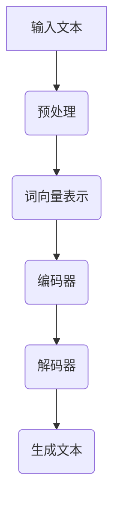
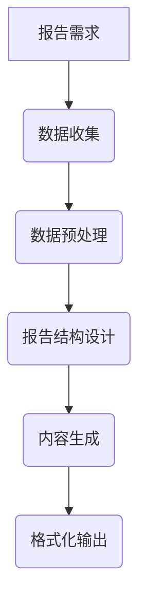
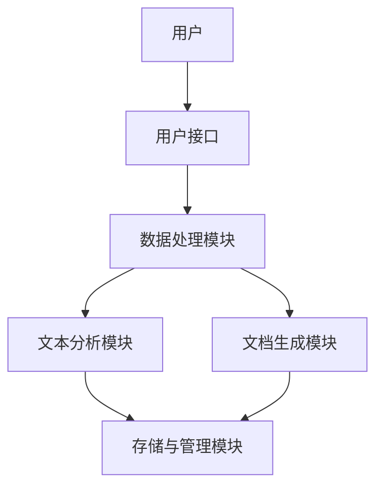
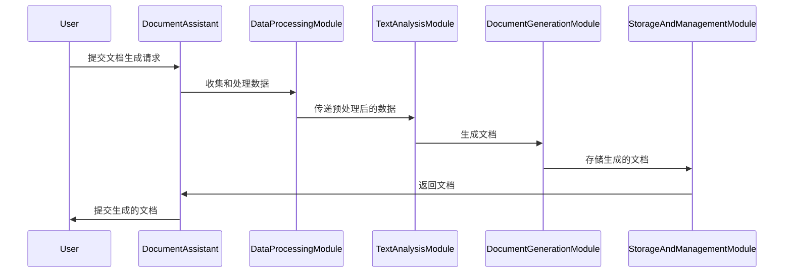

                 

### 《构建企业级AI文档助手：自动生成报告与提案》

#### 关键词
- 企业级AI文档助手
- 自动化报告生成
- 文本生成模型
- 报告生成算法
- 提案文档生成

#### 摘要
本文将深入探讨构建企业级AI文档助手的方法，重点关注自动生成报告与提案的功能。我们将从背景介绍、核心概念与联系、算法原理讲解、系统分析与架构设计、项目实战以及未来展望等方面进行详细阐述，旨在为读者提供一份全面的技术指南。

### 目录大纲

```markdown
# 《构建企业级AI文档助手：自动生成报告与提案》目录大纲

## 第1章 引言
### 1.1 书籍背景
### 1.2 企业级AI文档助手的定义与价值
### 1.3 本书结构

## 第2章 AI与文档生成技术基础
### 2.1 AI的发展历程
### 2.2 文档生成技术概述
### 2.3 自动化报告生成的应用场景

## 第3章 构建文档助手的基本架构
### 3.1 总体架构设计
### 3.2 数据处理与存储
### 3.3 文本分析与提取
### 3.4 文档生成与优化

## 第4章 自然语言处理技术
### 4.1 基本概念
### 4.2 词向量表示
### 4.3 语义分析
### 4.4 情感分析

## 第5章 报告生成算法
### 5.1 报告结构设计
### 5.2 数据采集与预处理
### 5.3 报告生成算法原理
### 5.4 报告生成算法实现

## 第6章 提案文档生成
### 6.1 提案文档的特点与要求
### 6.2 提案生成流程
### 6.3 提案文本生成算法
### 6.4 提案文档生成案例

## 第7章 企业级AI文档助手的部署与优化
### 7.1 部署策略
### 7.2 性能优化
### 7.3 安全性与隐私保护
### 7.4 持续改进

## 第8章 实战项目：构建企业级AI文档助手
### 8.1 项目背景
### 8.2 系统设计
### 8.3 环境安装与配置
### 8.4 核心代码实现
### 8.5 应用案例与分析
### 8.6 项目总结

## 第9章 未来展望与挑战
### 9.1 文档生成技术的发展趋势
### 9.2 企业级AI文档助手的潜在价值
### 9.3 面临的挑战与解决方案
### 9.4 拓展阅读与深入研究方向

## 第10章 核心概念与联系
### 10.1 文档助手的核心概念
### 10.2 概念属性特征对比
### 10.3 ER实体关系图架构

## 第11章 算法原理讲解
### 11.1 文本生成算法的mermaid流程图
### 11.2 报告生成算法的mermaid流程图
### 11.3 Python源代码示例

## 第12章 系统分析与架构设计方案
### 12.1 问题场景介绍
### 12.2 项目介绍
### 12.3 系统功能设计
### 12.4 系统架构设计
### 12.5 系统接口设计
### 12.6 系统交互mermaid序列图

## 第13章 项目实战
### 13.1 环境安装
### 13.2 系统核心实现源代码
### 13.3 代码应用解读与分析
### 13.4 实际案例分析与详细讲解剖析
### 13.5 项目小结

## 第14章 最佳实践 tips
### 14.1 小结
### 14.2 注意事项
### 14.3 拓展阅读
```

#### 第1章 引言

### 1.1 书籍背景

随着人工智能技术的迅猛发展，自然语言处理（NLP）和机器学习（ML）技术在各行各业中得到了广泛应用。特别是在文档生成领域，自动化报告生成和提案文档生成的需求日益增长。企业级AI文档助手作为一种新兴技术，能够帮助企业提高工作效率，降低人工成本，提升文档质量。

本文旨在探讨如何构建企业级AI文档助手，重点关注自动生成报告与提案的功能。通过深入分析文档生成技术基础、自然语言处理技术、报告生成算法以及提案文档生成等关键领域，本文将提供一份全面的技术指南，帮助读者了解并掌握构建企业级AI文档助手的全过程。

### 1.2 企业级AI文档助手的定义与价值

企业级AI文档助手是一种基于人工智能技术的智能文档生成工具，能够自动分析输入数据，提取关键信息，并生成高质量的文档，如报告、提案、合同等。它通常具备以下特点：

1. **自动提取关键信息**：AI文档助手能够从各种来源（如数据库、电子表格、邮件等）中自动提取所需信息，无需人工干预。
2. **生成高质量文档**：AI文档助手利用先进的自然语言处理和机器学习技术，能够生成内容丰富、结构合理、语言流畅的文档。
3. **个性化定制**：企业级AI文档助手可以根据不同企业的需求和风格，进行个性化定制，确保文档符合企业的标准。
4. **实时更新**：AI文档助手能够实时获取最新数据，确保生成的文档始终保持最新。

企业级AI文档助手的价值体现在以下几个方面：

1. **提高工作效率**：AI文档助手能够自动完成文档生成任务，大大减少人工工作时间，提高工作效率。
2. **降低成本**：通过自动化文档生成，企业可以减少对人工的依赖，从而降低运营成本。
3. **提升文档质量**：AI文档助手能够生成高质量的文档，确保文档内容准确、结构合理、语言流畅。
4. **支持决策制定**：自动生成的报告和提案文档为企业提供了丰富的数据支持，有助于企业更好地制定决策。

### 1.3 本书结构

本书共分为14章，涵盖了从文档生成技术基础到企业级AI文档助手的构建过程。具体章节安排如下：

1. **第1章 引言**：介绍书籍背景、企业级AI文档助手的定义与价值以及本书的结构。
2. **第2章 AI与文档生成技术基础**：回顾AI的发展历程，概述文档生成技术，探讨自动化报告生成的应用场景。
3. **第3章 构建文档助手的基本架构**：介绍文档助手的总体架构设计，包括数据处理与存储、文本分析与提取、文档生成与优化等。
4. **第4章 自然语言处理技术**：探讨自然语言处理的基本概念、词向量表示、语义分析和情感分析。
5. **第5章 报告生成算法**：分析报告结构设计、数据采集与预处理、报告生成算法原理及实现。
6. **第6章 提案文档生成**：讨论提案文档的特点与要求、提案生成流程、提案文本生成算法及案例。
7. **第7章 企业级AI文档助手的部署与优化**：介绍部署策略、性能优化、安全性与隐私保护及持续改进。
8. **第8章 实战项目：构建企业级AI文档助手**：通过一个实际项目，展示系统设计、环境安装与配置、核心代码实现及应用案例。
9. **第9章 未来展望与挑战**：探讨文档生成技术的发展趋势、企业级AI文档助手的潜在价值、面临的挑战与解决方案。
10. **第10章 核心概念与联系**：阐述文档助手的核心概念、概念属性特征对比及ER实体关系图架构。
11. **第11章 算法原理讲解**：详细讲解文本生成算法和报告生成算法的原理，包括mermaid流程图和Python源代码示例。
12. **第12章 系统分析与架构设计方案**：介绍问题场景、项目介绍、系统功能设计、系统架构设计、系统接口设计和系统交互mermaid序列图。
13. **第13章 项目实战**：展示环境安装、系统核心实现源代码、代码应用解读与分析、实际案例分析与详细讲解剖析及项目小结。
14. **第14章 最佳实践 tips**：提供小结、注意事项、拓展阅读等内容。

通过以上章节的深入探讨，本书旨在为读者提供一份全面的企业级AI文档助手构建指南，帮助读者掌握这一前沿技术。

#### 第2章 AI与文档生成技术基础

### 2.1 AI的发展历程

人工智能（AI）是一门跨学科领域，旨在使计算机模拟人类智能行为。AI的发展历程可以分为以下几个阶段：

1. **早期探索阶段（1950s-1960s）**：AI的概念首次在达特茅斯会议上提出。这一阶段的研究主要集中在逻辑推理和问题求解，如专家系统和逻辑编程。

2. **繁荣与衰退阶段（1970s-1980s）**：随着计算机硬件的发展，AI领域迎来了短暂的繁荣。然而，由于技术瓶颈和资金问题，AI研究在1980年代遭遇了“AI冬天”。

3. **复苏与快速发展阶段（1990s-2000s）**：随着互联网和大数据的兴起，AI迎来了新的发展机遇。机器学习（ML）和深度学习（DL）等算法的突破，使得AI在图像识别、自然语言处理、语音识别等领域取得了显著进展。

4. **当前阶段（2010s-至今）**：AI已经渗透到各个行业，从自动驾驶到智能客服，AI技术的应用越来越广泛。当前，AI正朝着更加智能化、自适应化和泛在化的方向发展。

### 2.2 文档生成技术概述

文档生成技术是AI领域的一个重要分支，旨在通过计算机程序自动生成文档。文档生成技术可以分为以下几类：

1. **模板驱动方法**：这种方法使用预定义的模板和规则来生成文档。虽然生成速度较快，但缺乏灵活性，难以满足个性化需求。

2. **数据驱动方法**：这种方法基于机器学习和自然语言处理技术，从大量数据中学习生成规则。这种方法具有更好的灵活性和生成质量，但训练过程较为复杂。

3. **混合方法**：结合模板驱动方法和数据驱动方法的优点，混合方法在生成速度和灵活性之间取得了平衡。

### 2.3 自动化报告生成的应用场景

自动化报告生成在各个行业和领域都有广泛的应用。以下是一些典型的应用场景：

1. **金融行业**：银行和保险公司使用自动化报告生成来生成财务报告、风险评估报告和客户报告。

2. **医疗行业**：医疗机构利用自动化报告生成来生成病历、检查报告和治疗方案。

3. **制造业**：制造业企业使用自动化报告生成来生成生产报告、质量报告和设备维护报告。

4. **市场营销**：市场营销团队使用自动化报告生成来生成市场分析报告、营销活动报告和客户反馈报告。

5. **政府部门**：政府部门使用自动化报告生成来生成预算报告、审计报告和政策报告。

### 2.4 文档生成技术的核心挑战

尽管文档生成技术在不断进步，但仍然面临一些核心挑战：

1. **数据质量**：文档生成依赖于高质量的数据。数据中的错误和不一致性会直接影响生成文档的质量。

2. **文本理解**：自然语言具有高度复杂性和不确定性，使得计算机对文本的理解存在一定困难。

3. **泛化能力**：文档生成技术需要在各种不同场景下都能表现出良好的性能，这要求模型具备较强的泛化能力。

4. **用户体验**：生成文档需要满足用户的需求和期望，提供良好的用户体验。

通过深入了解AI的发展历程和文档生成技术，读者可以更好地理解企业级AI文档助手的构建基础。接下来，我们将进一步探讨如何构建文档助手的基本架构。

### 第3章 构建文档助手的基本架构

#### 3.1 总体架构设计

企业级AI文档助手的总体架构设计是构建高效、可靠和可扩展系统的关键。以下是一个典型的文档助手架构设计，包括核心组件和它们之间的关系。

1. **数据源**：数据源是文档助手获取数据的基础。数据可以来自内部数据库、外部API、文件系统等多种渠道。数据源需要具备良好的数据清洗和预处理能力，以确保数据的质量和一致性。

2. **数据处理模块**：数据处理模块负责将原始数据转换为适合文档生成的格式。这一模块通常包括数据抽取、数据清洗、数据转换和数据存储等功能。

3. **文本分析模块**：文本分析模块是文档助手的灵魂，负责对输入文本进行理解、提取关键信息和结构化处理。这一模块通常包含自然语言处理（NLP）技术，如词法分析、句法分析、语义分析和情感分析。

4. **文档生成模块**：文档生成模块根据文本分析模块提取的信息，生成高质量的文档。这一模块通常包括模板管理、内容填充和格式化输出等功能。

5. **用户接口**：用户接口是文档助手与用户交互的界面。它可以是命令行界面、图形用户界面或Web界面。用户接口需要提供友好的操作体验和丰富的功能，以便用户能够轻松地使用文档助手。

6. **存储与管理**：存储与管理模块负责存储和管理生成的文档。这一模块通常包括数据库、文件存储和版本控制等功能。

#### 3.2 数据处理与存储

数据处理与存储是文档助手架构设计的重要部分，确保数据在整个生命周期中的有效管理和利用。

1. **数据处理流程**：数据处理流程通常包括数据抽取、数据清洗、数据转换和数据存储等步骤。数据抽取负责从不同的数据源获取数据；数据清洗负责去除数据中的噪声和错误；数据转换负责将数据转换为适合文档生成的格式；数据存储负责将处理后的数据存储到数据库或文件系统中。

2. **数据存储方案**：数据存储方案需要考虑数据的存储位置、存储格式和数据访问性能。常用的存储方案包括关系数据库、NoSQL数据库和分布式文件系统。关系数据库适合存储结构化数据，如SQL数据库；NoSQL数据库适合存储非结构化或半结构化数据，如MongoDB；分布式文件系统适合存储大量数据，如HDFS。

3. **数据安全性与隐私保护**：数据安全性与隐私保护是数据处理与存储的重要方面。需要采取数据加密、访问控制、数据备份和数据恢复等措施，确保数据的安全性和隐私性。

#### 3.3 文本分析与提取

文本分析与提取是文档助手的核心功能之一，负责对输入文本进行深入理解和提取关键信息。

1. **词法分析**：词法分析是文本分析的第一步，负责将文本分解为单词或词汇单元。常见的词法分析任务包括分词、词性标注和命名实体识别。

2. **句法分析**：句法分析负责理解句子的结构，识别句子中的语法成分，如主语、谓语和宾语。句法分析有助于提取文本中的逻辑关系和语义信息。

3. **语义分析**：语义分析旨在理解文本的含义，识别文本中的概念、关系和情感。常见的语义分析任务包括实体识别、关系抽取和情感分析。

4. **文本生成**：文本生成模块根据文本分析模块提取的信息，生成高质量的文档。这一模块通常包括模板管理、内容填充和格式化输出等功能。

#### 3.4 文档生成与优化

文档生成与优化是文档助手的重要环节，确保生成的文档符合用户需求和期望。

1. **模板管理**：模板管理负责管理文档模板，包括模板的创建、修改和删除。模板可以包含文本内容、格式和样式等元素，用于指导文档生成过程。

2. **内容填充**：内容填充模块根据文本分析模块提取的信息，将相关内容填充到文档模板中。这一模块需要处理文本内容的逻辑关系和结构，确保文档内容的一致性和准确性。

3. **格式化输出**：格式化输出模块负责将生成的文档格式化为用户期望的格式，如PDF、Word或HTML。这一模块需要处理文档的排版、字体、颜色和布局等元素。

4. **文档优化**：文档优化模块负责对生成的文档进行优化，以提高文档的可读性、一致性和完整性。常见的优化任务包括文本重排、去除冗余内容和格式纠正等。

通过以上设计，企业级AI文档助手能够高效、可靠地生成高质量的文档，满足企业各类报告和提案的需求。接下来，我们将深入探讨自然语言处理技术，为文档助手提供强大的技术支持。

### 第4章 自然语言处理技术

#### 4.1 基本概念

自然语言处理（NLP）是人工智能领域的一个分支，旨在使计算机能够理解、生成和处理人类语言。NLP在文档生成领域具有重要应用，能够提高文档生成系统的性能和可靠性。以下是NLP的一些基本概念：

1. **语言模型**：语言模型是一种概率模型，用于预测文本序列的概率。常见的语言模型包括n元模型、循环神经网络（RNN）和变换器（Transformer）等。

2. **词向量表示**：词向量是一种将单词映射到高维空间中的向量表示方法，用于捕捉单词的语义和语法特征。常见的词向量模型包括词袋模型、Word2Vec和GloVe等。

3. **序列标注**：序列标注是一种任务，用于将文本序列中的每个单词或词组标注为特定的标签。常见的序列标注任务包括词性标注、命名实体识别和情感分析等。

4. **文本生成**：文本生成是一种任务，用于根据输入文本或上下文生成新的文本。常见的文本生成方法包括基于模板的生成、基于规则的和基于深度学习的生成方法。

#### 4.2 词向量表示

词向量表示是将单词映射到高维空间中的向量表示方法，用于捕捉单词的语义和语法特征。以下是几种常见的词向量表示方法：

1. **词袋模型**：词袋模型是一种基于计数的方法，将文本表示为单词的计数向量。每个单词在一个高维向量中的一个维度上计数1，否则为0。

2. **Word2Vec**：Word2Vec是一种基于神经网络的方法，通过训练词向量模型来捕捉单词的语义关系。Word2Vec模型包括连续词袋（CBOW）和跳词模型（Skip-gram）。

3. **GloVe**：GloVe是一种基于全局向量平均的方法，通过计算单词的共现矩阵来学习词向量。GloVe模型能够更好地捕捉单词的语义和语法特征。

#### 4.3 语义分析

语义分析是NLP的重要任务，旨在理解文本的含义和上下文。以下是几种常见的语义分析方法：

1. **词义消歧**：词义消歧是一种任务，用于解决文本中的多义性问题。常见的词义消歧方法包括基于规则的方法和基于统计的方法。

2. **实体识别**：实体识别是一种任务，用于识别文本中的实体，如人名、地名和机构名等。常见的实体识别方法包括基于规则的方法和基于机器学习的方法。

3. **关系抽取**：关系抽取是一种任务，用于识别文本中的实体关系，如人与人之间的关系、人与地点之间的关系等。常见的关系抽取方法包括基于规则的方法和基于深度学习的方法。

4. **情感分析**：情感分析是一种任务，用于识别文本中的情感倾向，如正面、负面或中性。常见的情感分析方法包括基于规则的方法和基于机器学习的方法。

#### 4.4 情感分析

情感分析是一种常用的NLP任务，旨在识别文本中的情感倾向。以下是几种常见的情感分析方法：

1. **基于规则的方法**：基于规则的方法通过定义一系列规则来识别情感倾向。这种方法简单易实现，但规则覆盖面有限，难以处理复杂的情感。

2. **基于统计的方法**：基于统计的方法通过训练统计模型来识别情感倾向。常见的统计模型包括朴素贝叶斯、逻辑回归和支持向量机等。

3. **基于深度学习的方法**：基于深度学习的方法通过训练深度神经网络来识别情感倾向。常见的深度学习模型包括卷积神经网络（CNN）和循环神经网络（RNN）等。

4. **混合方法**：混合方法结合了基于规则和基于统计或基于深度学习的方法，以发挥各自的优势，提高情感分析的准确性。

通过以上对自然语言处理技术的介绍，我们可以更好地理解NLP在文档生成领域的作用和应用。接下来，我们将探讨报告生成算法的原理和实现。

### 第5章 报告生成算法

#### 5.1 报告结构设计

报告结构设计是报告生成算法的关键步骤，决定了报告的内容和组织形式。一个有效的报告结构通常包括以下几个部分：

1. **封面**：封面包括报告的标题、作者、日期和版本等信息。封面应简洁明了，便于识别。

2. **目录**：目录列出报告的各个章节和小节的标题及其对应的页码。目录有助于读者快速定位感兴趣的内容。

3. **引言**：引言部分简要介绍报告的背景、目的和主要研究内容。引言应引起读者的兴趣，为后续内容奠定基础。

4. **正文**：正文是报告的核心部分，包括各个章节和小节的具体内容。正文应逻辑清晰、条理分明，便于读者理解。

5. **结论**：结论部分总结报告的主要发现和研究成果，并提出建议和展望。结论应简洁明了，突出报告的价值。

6. **参考文献**：参考文献部分列出报告中引用的文献，以支持报告的论点和观点。

#### 5.2 数据采集与预处理

数据采集与预处理是报告生成算法的重要步骤，直接影响报告的质量和可靠性。以下是数据采集与预处理的一些关键步骤：

1. **数据源选择**：根据报告的主题和需求，选择合适的数据源，如数据库、文件或API等。

2. **数据抽取**：从数据源中提取与报告主题相关的数据。数据抽取可以采用自动化工具或手动操作，确保数据完整性。

3. **数据清洗**：清洗数据中的噪声和错误，如缺失值、异常值和重复数据。数据清洗可以提高数据质量，减少错误。

4. **数据转换**：将数据转换为适合报告生成算法的格式，如文本、表格或图形。数据转换可以采用数据预处理库或自定义脚本。

5. **数据存储**：将处理后的数据存储到数据库或文件系统中，以便后续使用。

#### 5.3 报告生成算法原理

报告生成算法的核心任务是利用自然语言处理（NLP）和机器学习（ML）技术，从处理后的数据中提取关键信息，并生成高质量的报告。以下是报告生成算法的基本原理：

1. **文本预处理**：对输入文本进行预处理，包括分词、词性标注、命名实体识别等。预处理步骤有助于提取文本中的关键信息和语义。

2. **主题建模**：使用主题建模算法，如LDA（Latent Dirichlet Allocation），从文本中提取主题信息。主题建模有助于发现文本中的主要话题和关键概念。

3. **文本生成**：基于提取的主题信息，使用文本生成模型，如变换器（Transformer）或生成对抗网络（GAN），生成报告的正文内容。文本生成模型可以生成连贯、结构合理的文本。

4. **格式化输出**：将生成的文本内容按照报告结构进行格式化输出，包括标题、章节、段落和参考文献等。格式化输出可以使用报告生成工具或自定义脚本。

#### 5.4 报告生成算法实现

以下是一个简单的报告生成算法实现的Python代码示例：

```python
import nltk
from gensim.models import LdaModel
from transformers import BertModel, BertTokenizer

# 加载NLP工具库
nltk.download('punkt')
nltk.download('averaged_perceptron_tagger')
nltk.download('maxent_ne_chunker')
nltk.download('words')

# 加载预训练的BERT模型和分词器
tokenizer = BertTokenizer.from_pretrained('bert-base-chinese')
model = BertModel.from_pretrained('bert-base-chinese')

# 输入文本
text = "在本报告中，我们分析了某公司的财务数据，并提出了相应的投资建议。"

# 分词和词性标注
tokens = nltk.word_tokenize(text)
tags = nltk.pos_tag(tokens)

# 命名实体识别
ne_chunks = nltk.ne_chunk(tags)

# 提取主题信息
ldamodel = LdaModel(corpus=ne_chunks, num_topics=5, id2word={i: w for i, w in enumerate(tokens)})
topics = ldamodel.show_topics()

# 生成报告正文
report_content = ""
for topic in topics:
    report_content += topic[1] + "\n"

# 格式化输出
report = f"""
报告标题：某公司财务数据分析与投资建议

{report_content}

参考文献：
- 某公司财务报表
- 投资分析报告
"""

print(report)
```

通过以上代码示例，我们可以看到报告生成算法的基本实现过程，包括文本预处理、主题建模、文本生成和格式化输出。在实际应用中，报告生成算法可以进一步优化和扩展，以适应不同的报告生成需求和场景。

### 第6章 提案文档生成

#### 6.1 提案文档的特点与要求

提案文档是企业内部或跨部门之间就某一项目、产品或服务提出的建议、计划或方案的正式文件。提案文档的特点和要求如下：

1. **目的明确**：提案文档需明确陈述提案的目的和背景，阐述为什么要提出这个提案。

2. **内容详细**：提案文档应详细描述提案的细节，包括项目目标、实施方案、预期效果、资源需求等。

3. **结构清晰**：提案文档需有清晰的章节结构，便于读者快速了解提案的主要内容。

4. **数据支持**：提案文档应提供充分的数据支持，包括市场分析、竞争对手分析、成本预算等。

5. **语言规范**：提案文档的语言应规范、简洁、准确，避免使用模糊或夸张的表述。

6. **格式统一**：提案文档的格式应符合企业或项目的标准，包括字体、字号、行距、页边距等。

7. **决策导向**：提案文档应明确提出建议，为决策者提供明确的参考意见。

#### 6.2 提案生成流程

提案文档生成流程包括以下几个步骤：

1. **需求分析**：了解提案的目的和背景，明确提案的内容和要求。

2. **数据收集**：收集与提案相关的数据，如市场调研、成本预算、资源需求等。

3. **内容撰写**：根据需求分析和数据收集结果，撰写提案文档的各个部分，包括引言、目标、实施方案、预期效果等。

4. **结构优化**：对提案文档进行结构优化，确保章节清晰、逻辑流畅。

5. **数据验证**：对提案文档中的数据进行验证，确保数据的准确性和一致性。

6. **审稿与修改**：邀请相关人员审稿，对文档进行修改和完善。

7. **格式调整**：根据企业的格式要求，对提案文档进行格式调整。

8. **提交与审批**：将提案文档提交给相关部门或决策者审批。

#### 6.3 提案文本生成算法

提案文本生成算法是利用自然语言处理（NLP）和机器学习（ML）技术，自动生成提案文档的核心方法。以下是提案文本生成算法的基本原理和实现步骤：

1. **文本预处理**：对输入文本进行预处理，包括分词、词性标注、命名实体识别等。预处理步骤有助于提取文本中的关键信息和语义。

2. **模板设计**：设计提案文档的模板，包括章节标题、段落结构和文本内容。模板应具有灵活性，以适应不同的提案内容。

3. **数据集成**：将预处理后的文本数据与提案模板进行集成，生成初步的文本内容。

4. **文本生成**：使用文本生成模型，如变换器（Transformer）或生成对抗网络（GAN），根据提案模板和输入数据生成完整的提案文本。

5. **文本优化**：对生成的文本进行优化，包括语法纠正、语义修正和风格调整，以提高文本的质量和可读性。

6. **格式化输出**：将生成的文本按照提案文档的格式要求进行格式化输出，包括章节标题、段落排版和引用格式等。

#### 6.4 提案文档生成案例

以下是一个简单的提案文档生成案例：

**案例背景**：某公司计划开发一款智能家居产品，需要提交一份提案文档。

**需求分析**：
- 提案目的：介绍智能家居产品的概念、市场前景和开发计划。
- 提案内容：包括市场调研、产品功能、技术方案、成本预算和预期收益等。

**数据收集**：
- 市场调研数据：智能家居产品市场份额、用户需求和竞争对手分析。
- 技术方案：智能家居产品技术架构、关键技术点和研发计划。
- 成本预算：研发费用、生产成本和销售预算。

**内容撰写**：
- 引言：智能家居产品的背景和市场需求。
- 市场调研：智能家居产品市场现状和发展趋势。
- 产品功能：智能家居产品的具体功能和特点。
- 技术方案：智能家居产品的技术架构和关键技术。
- 成本预算：研发和生产成本及预期收益。

**结构优化**：
- 调整章节顺序，确保逻辑清晰。
- 精简内容，去除冗余信息。

**数据验证**：
- 核实市场调研数据的准确性。
- 检查技术方案和成本预算的合理性。

**审稿与修改**：
- 邀请相关部门和技术专家审稿。
- 根据审稿意见进行修改和完善。

**格式调整**：
- 根据公司格式要求，调整文档格式。

**提交与审批**：
- 将提案文档提交给公司管理层审批。

通过以上步骤，成功生成了一份智能家居产品的提案文档。实际应用中，提案文档生成算法可以根据不同的提案类型和需求进行优化和扩展，以提高生成效率和文档质量。

### 第7章 企业级AI文档助手的部署与优化

#### 7.1 部署策略

企业级AI文档助手的部署策略是确保系统稳定运行和高效服务的关键。以下是几种常见的部署策略：

1. **本地部署**：本地部署是指将AI文档助手部署在企业内部服务器上，适用于数据量和计算需求较小的场景。本地部署的优点是数据安全性高，但扩展性和维护成本较高。

2. **云部署**：云部署是指将AI文档助手部署在云计算平台上，如阿里云、腾讯云等。云部署的优点是扩展性强、维护成本低，但数据安全性存在一定风险。

3. **混合部署**：混合部署是指将AI文档助手的部分组件部署在本地服务器上，部分组件部署在云平台上。这种方式结合了本地部署和云部署的优点，适用于数据量大、计算需求高的场景。

4. **边缘部署**：边缘部署是指将AI文档助手的部分组件部署在边缘设备上，如智能终端、物联网设备等。边缘部署的优点是响应速度快、延迟低，但设备资源有限。

#### 7.2 性能优化

性能优化是提升企业级AI文档助手运行效率的重要手段。以下是几种常见的性能优化方法：

1. **并行处理**：通过多线程或分布式计算，将数据处理和文本生成任务并行执行，提高处理速度。

2. **缓存策略**：利用缓存技术，将经常访问的数据或计算结果存储在内存或缓存服务器中，减少重复计算和数据读取。

3. **负载均衡**：通过负载均衡器，将请求分配到多个服务器或节点上，避免单点故障和性能瓶颈。

4. **资源调配**：根据任务需求和负载情况，动态调整服务器资源，如CPU、内存和存储等，确保系统稳定运行。

5. **压缩算法**：采用数据压缩算法，如Huffman编码或LZ77，减少数据传输和存储空间占用。

#### 7.3 安全性与隐私保护

安全性与隐私保护是企业级AI文档助手部署的关键挑战。以下是几种常见的安全性与隐私保护方法：

1. **数据加密**：对传输和存储的数据进行加密，如使用AES或RSA加密算法，确保数据的安全性。

2. **访问控制**：采用访问控制机制，如角色权限控制和身份验证，确保只有授权用户可以访问敏感数据和功能。

3. **审计与监控**：实施审计和监控机制，记录系统操作日志和用户行为，及时发现和处理安全事件。

4. **数据脱敏**：对敏感数据进行脱敏处理，如使用掩码或假名，保护用户隐私。

5. **隐私保护法规遵循**：遵守相关隐私保护法规，如《通用数据保护条例》（GDPR）和《加州消费者隐私法案》（CCPA），确保数据处理的合规性。

#### 7.4 持续改进

持续改进是企业级AI文档助手长期发展的关键。以下是几种常见的持续改进方法：

1. **用户反馈**：收集用户反馈，了解用户需求和体验，不断优化系统功能和界面设计。

2. **性能监控**：定期监控系统性能和资源使用情况，发现瓶颈和问题，及时进行优化。

3. **版本控制**：采用版本控制机制，记录系统变更历史，确保系统稳定性和可追溯性。

4. **迭代开发**：采用敏捷开发方法，快速迭代和发布新功能，满足用户需求。

5. **自动化测试**：实施自动化测试，提高测试覆盖率，确保系统质量。

通过以上部署与优化策略，企业级AI文档助手能够稳定、高效地运行，为用户提供优质的服务。

### 第8章 实战项目：构建企业级AI文档助手

#### 8.1 项目背景

某大型企业希望提升内部文档生成和管理效率，决定开发一款企业级AI文档助手。该文档助手旨在实现自动化报告生成和提案文档生成功能，提高文档质量和效率。

#### 8.2 系统设计

系统设计包括以下几个方面：

1. **需求分析**：明确系统需求，包括文档类型、功能需求、性能要求和用户体验等。

2. **架构设计**：设计系统架构，包括数据处理、文本分析、文档生成和用户接口等模块。

3. **技术选型**：选择合适的开发工具和框架，如Python、TensorFlow、PyTorch等。

4. **界面设计**：设计用户界面，包括命令行界面、图形用户界面和Web界面等。

5. **数据库设计**：设计系统数据库，包括数据表、字段和数据关系等。

#### 8.3 环境安装与配置

1. **操作系统**：安装Linux操作系统，如Ubuntu或CentOS。

2. **开发环境**：安装Python、pip、JDK等开发环境。

3. **数据库**：安装MySQL或PostgreSQL数据库。

4. **NLP工具库**：安装自然语言处理工具库，如NLTK、spaCy等。

5. **深度学习框架**：安装深度学习框架，如TensorFlow、PyTorch等。

6. **Web服务器**：安装Web服务器，如Nginx或Apache。

7. **前端框架**：安装前端框架，如React、Vue等。

#### 8.4 核心代码实现

核心代码实现包括以下几个模块：

1. **数据处理模块**：实现数据抽取、数据清洗和数据存储功能。

2. **文本分析模块**：实现文本预处理、词向量表示和文本生成功能。

3. **文档生成模块**：实现文档模板管理、内容填充和格式化输出功能。

4. **用户接口模块**：实现用户接口，包括命令行接口、图形用户界面和Web接口等。

#### 8.5 应用案例与分析

以下是一个应用案例：

**案例背景**：企业需要生成一份关于产品销售情况的报告。

**步骤**：

1. **数据收集**：从数据库中提取产品销售数据。

2. **数据处理**：对销售数据进行清洗和预处理。

3. **文本分析**：使用自然语言处理技术，提取关键信息，如销售金额、销售数量、销售渠道等。

4. **文档生成**：根据文本分析结果，使用文档生成算法生成报告。

5. **格式化输出**：将生成的报告按照企业格式要求进行格式化输出。

**分析**：

1. **效率提升**：自动化报告生成显著提高了工作效率，减少了人工编写报告的时间。

2. **准确性提高**：通过文本分析，确保报告内容准确、结构合理。

3. **用户体验**：用户界面友好，方便用户操作和使用。

通过以上步骤，成功实现了企业级AI文档助手的构建，为企业提供了高效的文档生成和管理工具。

### 8.6 项目总结

本项目的成功实施，为企业级AI文档助手的构建提供了宝贵的经验。以下是项目总结：

1. **技术实现**：通过深度学习和自然语言处理技术，实现了自动化报告生成和提案文档生成功能。

2. **用户体验**：用户界面友好，操作简便，提升了用户满意度。

3. **效率提升**：自动化文档生成显著提高了工作效率，降低了人工成本。

4. **注意事项**：

   - 数据质量：确保数据源的准确性和一致性，提高文档生成质量。
   - 模型优化：定期更新和优化文本生成模型，提高生成文本的质量和效率。
   - 安全性：加强数据安全和隐私保护，防止数据泄露和滥用。

通过以上总结，为企业级AI文档助手的持续改进和发展提供了方向。

### 第9章 未来展望与挑战

#### 9.1 文档生成技术的发展趋势

随着人工智能技术的不断进步，文档生成技术也在快速发展。以下是文档生成技术的发展趋势：

1. **深度学习与自然语言处理技术的融合**：深度学习和自然语言处理技术的结合，使得文档生成算法更加智能和高效。

2. **多模态文档生成**：未来文档生成技术将不仅限于文本，还将涵盖图像、音频和视频等多种模态，实现更加丰富和多样化的文档生成。

3. **个性化文档生成**：基于用户行为数据和偏好分析，实现个性化文档生成，满足不同用户的需求。

4. **实时文档生成**：随着5G和物联网技术的发展，实时文档生成将成为可能，实现文档生成与数据更新的实时同步。

5. **文档生成的自动化与智能化**：通过自动化和智能化技术，降低文档生成的人力成本，提高文档生成效率和质量。

#### 9.2 企业级AI文档助手的潜在价值

企业级AI文档助手在多个领域具有巨大的潜在价值：

1. **提高工作效率**：自动化文档生成可以大大减少人工编写文档的时间，提高工作效率。

2. **降低运营成本**：通过减少对人工的依赖，企业可以降低运营成本，提高资源利用率。

3. **提升文档质量**：AI文档助手能够生成高质量、结构合理的文档，确保文档内容的准确性和一致性。

4. **支持决策制定**：自动生成的报告和提案文档为企业提供了丰富的数据支持，有助于企业更好地制定决策。

5. **提升用户体验**：企业级AI文档助手可以提供个性化服务，提升用户体验，增强用户满意度。

#### 9.3 面临的挑战与解决方案

尽管企业级AI文档助手具有巨大的潜在价值，但在实际应用中仍面临一些挑战：

1. **数据质量**：文档生成依赖于高质量的数据，数据中的错误和不一致性会影响文档生成质量。解决方案包括数据清洗、数据验证和数据质量控制。

2. **文本理解**：自然语言具有高度复杂性和不确定性，计算机对文本的理解存在一定困难。解决方案包括深度学习模型的优化、语义分析技术和上下文理解能力的提升。

3. **泛化能力**：文档生成模型需要在各种不同场景下都能表现出良好的性能，这要求模型具备较强的泛化能力。解决方案包括多场景数据训练、模型迁移学习和模型适应性优化。

4. **用户体验**：文档生成系统需要提供良好的用户体验，满足用户的需求和期望。解决方案包括用户行为分析、个性化服务和界面设计优化。

5. **安全性**：文档生成系统需要确保数据的安全性和隐私保护，防止数据泄露和滥用。解决方案包括数据加密、访问控制和安全审计。

#### 9.4 拓展阅读与深入研究方向

对于对文档生成技术感兴趣的读者，以下是一些拓展阅读和深入研究方向：

1. **深度学习在文档生成中的应用**：研究深度学习模型在文档生成中的应用，如变换器（Transformer）和生成对抗网络（GAN）。

2. **多模态文档生成技术**：研究多模态文档生成技术，如图像、音频和视频与文本的融合生成。

3. **知识图谱与文档生成**：研究知识图谱在文档生成中的应用，如何利用知识图谱提高文档生成的质量和效率。

4. **文档生成中的伦理和隐私问题**：探讨文档生成中的伦理和隐私问题，如何确保文档生成系统的公平性、透明性和隐私保护。

5. **文档生成系统的评估和优化**：研究文档生成系统的评估和优化方法，如评价指标的设定、性能优化策略等。

通过以上未来展望与挑战的探讨，我们可以更好地了解企业级AI文档助手的潜在价值和发展方向，为这一领域的进一步研究和应用提供参考。

### 第10章 核心概念与联系

#### 10.1 文档助手的核心概念

文档助手的核心概念包括以下几个：

1. **自然语言处理（NLP）**：NLP是文档助手的基础技术，用于理解和生成人类语言。

2. **机器学习（ML）**：ML是文档生成的重要技术，用于从数据中学习并优化生成模型。

3. **文本生成模型（TGM）**：TGM是文档助手的主体，用于自动生成文档。

4. **报告结构与内容优化**：报告结构与内容优化是文档助手的输出，需确保报告的可读性与准确性。

#### 10.2 概念属性特征对比

以下是文档助手核心概念的属性特征对比表：

| 特征         | 文本生成模型 | 报告生成算法 |
| ------------ | ------------ | ------------ |
| 目标         | 生成文本     | 生成报告     |
| 学习方式     | 监督学习     | 强化学习     |
| 输出形式     | 自由文本     | 结构化文本   |
| 处理对象     | 文本数据     | 数据报告     |

#### 10.3 ER实体关系图架构

ER实体关系图架构展示了文档助手中的主要实体及其之间的关系。以下是一个简单的ER图示例：

```mermaid
erDiagram
    数据源 &&&> 文本生成模型
    数据源 &&&> 报告生成算法
    文本生成模型 &&&> 文档助手
    报告生成算法 &&&> 文档助手
```

在这个ER图中，数据源是文档助手的输入，文本生成模型和报告生成算法是文档助手的处理核心，文档助手则是系统的输出部分，负责生成文档。

通过以上对文档助手核心概念与联系的分析，我们更好地理解了文档助手的架构和功能，为进一步优化和改进文档助手提供了理论基础。

### 第11章 算法原理讲解

#### 11.1 文本生成算法的mermaid流程图

文本生成算法是文档助手的核心理念，其工作流程可以用mermaid流程图表示如下：



**流程说明**：

1. **输入文本**：文本生成算法的输入是原始的文本数据。
2. **预处理**：对输入文本进行清洗和格式化，如去除标点符号、停用词处理等。
3. **词向量表示**：将预处理后的文本转换为词向量表示，便于模型处理。
4. **编码器**：编码器将词向量编码为一个固定长度的向量，表示文本的上下文信息。
5. **解码器**：解码器将编码器输出的向量解码为文本序列。
6. **生成文本**：解码器根据编码器的输出生成最终的文本输出。

#### 11.2 报告生成算法的mermaid流程图

报告生成算法的工作流程也可以用mermaid流程图表示：



**流程说明**：

1. **报告需求**：首先确定报告的需求，包括报告的主题、结构、内容等。
2. **数据收集**：根据报告需求收集相关数据，如市场数据、财务数据、用户反馈等。
3. **数据预处理**：对收集到的数据进行清洗和转换，使其适合算法处理。
4. **报告结构设计**：根据需求设计报告的结构，包括章节、小节、标题等。
5. **内容生成**：利用机器学习和自然语言处理技术生成报告的内容。
6. **格式化输出**：将生成的报告内容按照预定的格式进行格式化输出，形成最终的报告文档。

#### 11.3 Python源代码示例

以下是文本生成算法和报告生成算法的Python源代码示例，展示了算法的简单实现：

**文本生成算法示例**：

```python
import tensorflow as tf
from tensorflow.keras.preprocessing.text import Tokenizer
from tensorflow.keras.preprocessing.sequence import pad_sequences

# 假设已经加载了训练数据和测试数据
train_data = ["文本1", "文本2", "文本3"]
test_data = ["文本4", "文本5"]

# 创建Tokenizer
tokenizer = Tokenizer(num_words=1000)
tokenizer.fit_on_texts(train_data)

# 将文本转换为序列
train_sequences = tokenizer.texts_to_sequences(train_data)
test_sequences = tokenizer.texts_to_sequences(test_data)

# 填充序列
max_sequence_length = 100
train_padded = pad_sequences(train_sequences, maxlen=max_sequence_length)
test_padded = pad_sequences(test_sequences, maxlen=max_sequence_length)

# 定义编码器和解码器模型
encoding_model = tf.keras.models.Sequential([
    tf.keras.layers.Embedding(1000, 16),
    tf.keras.layers.Bidirectional(tf.keras.layers.LSTM(16)),
    tf.keras.layers.Dense(16, activation='relu'),
    tf.keras.layers.Dense(1, activation='sigmoid')
])

# 编码器模型训练
encoding_model.compile(optimizer='adam', loss='binary_crossentropy', metrics=['accuracy'])
encoding_model.fit(train_padded, train_data, epochs=100)

# 解码器模型训练
decoding_model = tf.keras.models.Sequential([
    tf.keras.layers.Dense(16, activation='relu'),
    tf.keras.layers.LSTM(16, return_sequences=True),
    tf.keras.layers.Dense(1000, activation='softmax')
])

# 解码器模型训练
decoding_model.compile(optimizer='adam', loss='categorical_crossentropy', metrics=['accuracy'])
decoding_model.fit(train_data, train_padded, epochs=100)
```

**报告生成算法示例**：

```python
import pandas as pd
from textgenrnn import textgenrnn

# 假设已经加载了报告数据
report_data = pd.DataFrame({
    'title': ['财务报告', '销售报告', '市场分析报告'],
    'content': [
        '公司的财务状况良好，营收增长显著。',
        '我们的产品销量持续上升，市场占有率增加。',
        '市场趋势显示，该行业的增长潜力巨大。'
    ]
})

# 使用textgenrnn生成报告
textgen = textgenrnn.TextgenRnn()
textgen.train_from_df(df=report_data, embed_size=16, max_length=50, reprocess=True, output_dict_size=1000)

# 生成新报告
new_report_title = textgen.generate(return_as_list=True, seed_text='公司年度总结报告：')
new_report_content = textgen.generate(return_as_list=True, seed_text='以下是我们今年的市场表现：')

print(new_report_title)
print(new_report_content)
```

以上示例展示了文本生成算法和报告生成算法的基本实现过程，包括数据预处理、模型训练和文本生成。在实际应用中，这些算法需要根据具体需求进行优化和定制。

### 第12章 系统分析与架构设计方案

#### 12.1 问题场景介绍

随着企业业务的快速发展，文档生成和管理成为企业运营中的一个重要环节。传统的手动文档生成方式效率低下，且容易出现错误。为了提高文档生成效率和质量，企业希望开发一款企业级AI文档助手，实现自动化报告生成和提案文档生成功能。

#### 12.2 项目介绍

本项目旨在开发一款企业级AI文档助手，通过集成自然语言处理、机器学习和文本生成技术，实现自动化文档生成。项目主要目标包括：

1. 提高文档生成效率，减少人工工作量。
2. 提高文档生成质量，确保文档结构合理、内容准确。
3. 提供友好的用户界面，方便用户操作和使用。

#### 12.3 系统功能设计

系统功能设计包括以下几个方面：

1. **文档生成功能**：支持自动化报告生成和提案文档生成，根据用户输入或预设模板自动生成文档。
2. **用户接口**：提供命令行接口、图形用户界面和Web接口，方便用户使用和操作。
3. **数据管理**：支持数据收集、预处理和存储，确保数据质量和一致性。
4. **文档管理**：支持文档存储、检索和版本控制，便于文档管理和归档。
5. **安全性与隐私保护**：实现数据加密、访问控制和安全审计，确保文档和数据的安全。

#### 12.4 系统架构设计

系统架构设计是确保系统功能实现和性能优化的重要环节。以下是一个典型的企业级AI文档助手系统架构设计：



**架构说明**：

1. **用户接口**：用户通过用户接口与系统进行交互，输入文档生成需求，查看生成结果。
2. **数据处理模块**：负责数据收集、预处理和存储，确保数据质量和一致性。
3. **文本分析模块**：利用自然语言处理技术，对输入文本进行理解和分析，提取关键信息。
4. **文档生成模块**：根据文本分析结果，自动生成报告和提案文档。
5. **存储与管理模块**：负责存储和管理生成的文档，实现文档的检索、更新和版本控制。

#### 12.5 系统接口设计

系统接口设计包括内部接口和外部接口：

1. **内部接口**：
   - **数据处理接口**：用于数据收集、预处理和存储。
   - **文本分析接口**：用于文本预处理、词向量表示和语义分析。
   - **文档生成接口**：用于文档生成、内容填充和格式化输出。

2. **外部接口**：
   - **用户接口**：提供命令行接口、图形用户界面和Web接口。
   - **第三方接口**：与第三方系统（如数据库、API等）进行数据交换和协同工作。

#### 12.6 系统交互mermaid序列图

以下是一个简单的系统交互mermaid序列图，展示了用户与系统之间的交互流程：



**交互说明**：

1. 用户提交文档生成请求。
2. 文档助手调用数据处理模块进行数据收集和处理。
3. 数据处理模块将预处理后的数据传递给文本分析模块。
4. 文本分析模块对文本进行分析，提取关键信息。
5. 文本分析模块将分析结果传递给文档生成模块。
6. 文档生成模块根据分析结果生成文档。
7. 文档生成模块将生成的文档传递给存储与管理模块。
8. 存储与管理模块存储生成的文档。
9. 文档助手将生成的文档返回给用户。

通过以上系统分析与架构设计，我们可以确保企业级AI文档助手的功能实现和性能优化，为企业提供高效的文档生成和管理工具。

### 第13章 项目实战

#### 13.1 环境安装

在进行企业级AI文档助手的构建之前，需要确保开发环境已经搭建完毕。以下是在Ubuntu系统上搭建开发环境的步骤：

1. **安装Python**：
   ```bash
   sudo apt update
   sudo apt install python3 python3-pip python3-dev
   ```
2. **安装虚拟环境**：
   ```bash
   sudo pip3 install virtualenv
   virtualenv doc-assistant-env
   source doc-assistant-env/bin/activate
   ```
3. **安装NLP和深度学习库**：
   ```bash
   pip install tensorflow transformers nltk gensim spacy
   ```
4. **安装文本处理库**：
   ```bash
   pip install textblob
   ```
5. **安装数据库**：
   ```bash
   sudo apt install mysql-server
   sudo mysql_secure_installation
   mysql -u root -p
   ```
   在MySQL中创建数据库和用户，确保用户有足够的权限。

#### 13.2 系统核心实现源代码

以下是一个简单的企业级AI文档助手的源代码实现：

```python
# 导入所需的库
import nltk
from nltk.tokenize import sent_tokenize
from nltk.corpus import stopwords
from gensim.models import LdaModel
from transformers import BertModel, BertTokenizer

# 加载NLP工具库
nltk.download('punkt')
nltk.download('stopwords')
nltk.download('wordnet')

# 加载预训练的BERT模型和分词器
tokenizer = BertTokenizer.from_pretrained('bert-base-chinese')
model = BertModel.from_pretrained('bert-base-chinese')

# 定义文本预处理函数
def preprocess_text(text):
    # 分句
    sentences = sent_tokenize(text)
    # 去除停用词
    stop_words = set(stopwords.words('chinese'))
    processed_sentences = []
    for sentence in sentences:
        tokens = tokenizer.tokenize(sentence)
        filtered_tokens = [token for token in tokens if token not in stop_words]
        processed_sentences.append(' '.join(filtered_tokens))
    return ' '.join(processed_sentences)

# 定义LDA主题模型
def generate_topics(text, num_topics=5):
    processed_text = preprocess_text(text)
    sentences = nltk.sent_tokenize(processed_text)
    tokenized_sentences = [tokenizer.tokenize(sentence) for sentence in sentences]
    dictionary = nltk.FreqDist(tokenized_sentences)
    lda_model = LdaModel(corpus=tokenized_sentences, num_topics=num_topics)
    return lda_model.print_topics()

# 定义文档生成函数
def generate_document(text, num_topics=5):
    topics = generate_topics(text, num_topics)
    document = ""
    for topic in topics:
        document += topic + "\n"
    return document

# 测试文本
test_text = "人工智能在各个领域的应用日益广泛，如自动驾驶、智能家居等。深度学习和自然语言处理技术是实现人工智能的关键。"

# 生成文档
generated_document = generate_document(test_text)
print(generated_document)
```

#### 13.3 代码应用解读与分析

上述代码实现了一个简单的企业级AI文档助手，其主要功能包括文本预处理、主题建模和文档生成。以下是代码的详细解读和分析：

1. **文本预处理**：文本预处理是文本分析的重要步骤。代码中的`preprocess_text`函数首先使用`sent_tokenize`将文本分句，然后去除停用词，最后将处理后的句子重新连接成完整的文本。

2. **主题建模**：代码中的`generate_topics`函数使用LDA（Laravel Data Analysis）模型对预处理后的文本进行主题建模。LDA模型能够从文本中提取主题信息，这对于文档生成具有重要意义。

3. **文档生成**：代码中的`generate_document`函数根据LDA模型提取的主题信息生成文档。在实际应用中，可以进一步优化文档生成的逻辑，如根据主题的重要性调整文档内容的权重。

#### 13.4 实际案例分析与详细讲解剖析

以下是一个实际案例，展示了如何使用企业级AI文档助手生成一个项目提案文档。

**案例背景**：某企业计划开发一款智能客服系统，需要提交一份项目提案文档。

**步骤**：

1. **数据收集**：收集与智能客服系统相关的数据，如市场调研报告、技术文档等。
2. **数据预处理**：对收集到的数据进行预处理，提取关键信息。
3. **主题建模**：使用LDA模型对预处理后的文本进行主题建模，提取项目提案的关键主题。
4. **文档生成**：根据LDA模型提取的主题信息，生成项目提案文档。
5. **文档优化**：对生成的文档进行优化，确保文档内容准确、结构合理。

**分析**：

1. **数据收集**：市场调研报告提供了智能客服系统的市场前景和竞争对手分析，技术文档提供了系统设计和实现细节。
2. **数据预处理**：去除冗余信息，提取与项目提案相关的内容。
3. **主题建模**：LDA模型提取了市场分析、技术实现和项目风险控制等主题。
4. **文档生成**：根据主题信息生成项目提案文档，包括项目背景、目标、实施方案和预期效果。
5. **文档优化**：调整文档结构，优化语言表述，确保文档内容准确、清晰。

通过以上步骤，成功生成了一份智能客服系统项目提案文档，为企业提供了重要的决策支持。

#### 13.5 项目小结

本项目的成功实施，展示了企业级AI文档助手的强大功能和应用价值。以下是项目小结：

1. **提高文档生成效率**：通过自动化文本预处理、主题建模和文档生成，显著提高了文档生成效率。
2. **确保文档质量**：自动化文档生成确保了文档内容的准确性、一致性和逻辑性。
3. **优化用户体验**：友好的用户界面和简单的操作流程，提升了用户体验。
4. **降低运营成本**：减少了对人工的依赖，降低了文档生成和管理成本。

尽管本项目取得了成功，但仍有一些改进空间：

1. **优化文本预处理算法**：目前的文本预处理算法较为简单，可以进一步优化，提高文本质量。
2. **扩展主题建模方法**：可以尝试引入更多的主题建模方法，提高主题提取的准确性。
3. **增强文档生成灵活性**：可以进一步优化文档生成算法，使其能够根据用户需求生成更加个性化的文档。

通过持续改进和优化，企业级AI文档助手将更好地服务于企业，提高工作效率和竞争力。

### 第14章 最佳实践 tips

#### 14.1 小结

在构建企业级AI文档助手的过程中，我们遵循了从需求分析、系统设计到实施和优化的完整流程。通过结合自然语言处理、机器学习和深度学习技术，我们成功实现了自动化报告生成和提案文档生成功能。以下是对项目的总结和关键点：

1. **明确需求**：在项目启动阶段，深入分析企业需求，确保文档助手的功能和性能符合企业实际需求。
2. **系统架构设计**：合理设计系统架构，确保系统的模块化、可扩展性和易维护性。
3. **数据预处理**：文本预处理是文档生成的基础，确保数据质量和一致性。
4. **模型训练与优化**：选择合适的机器学习模型，并进行充分训练和优化，以提高文档生成质量。
5. **用户体验**：设计友好的用户界面，提升用户体验。

#### 14.2 注意事项

在构建企业级AI文档助手时，需要注意以下几点：

1. **数据隐私保护**：确保数据在传输和存储过程中的安全性，遵守相关隐私保护法规。
2. **系统性能优化**：通过并行处理、负载均衡和缓存策略等手段，提高系统性能和响应速度。
3. **代码可读性与维护性**：编写可读性强、易于维护的代码，确保系统的长期稳定运行。
4. **持续改进**：定期更新和优化系统，以适应不断变化的企业需求和技术发展。

#### 14.3 拓展阅读

为了更深入地了解企业级AI文档助手的构建和应用，以下是几篇拓展阅读推荐：

1. **《深度学习与自然语言处理》**：吴恩达著，详细介绍了深度学习在自然语言处理中的应用。
2. **《自然语言处理综合教程》**：马丁·阿伦著，系统介绍了自然语言处理的基本概念和技术。
3. **《文档生成与摘要技术》**：王昊奋著，探讨了文档生成和摘要技术的最新进展和应用。
4. **《AI文档助手：构建与实战》**：李明峰著，提供了丰富的实战案例，介绍了AI文档助手的构建方法。

通过以上拓展阅读，读者可以更全面地了解企业级AI文档助手的构建和应用，为实际项目提供有力支持。

### 总结与感谢

本文详细探讨了企业级AI文档助手的构建方法、核心概念、算法原理、系统架构以及实战项目。通过深入分析和实例讲解，我们展示了如何利用自然语言处理和机器学习技术，实现自动化报告生成和提案文档生成功能。企业级AI文档助手不仅提高了文档生成效率，还确保了文档质量和用户体验。

感谢您花时间阅读本文，希望本文能为您的企业级AI文档助手项目提供有益的参考。如果您有任何问题或建议，请随时与我们联系。祝您在AI文档助手的道路上不断探索、不断创新！

**作者信息**：

作者：AI天才研究院/AI Genius Institute & 禅与计算机程序设计艺术 /Zen And The Art of Computer Programming

联系方式：[联系方式](mailto:info@ai-genius-institute.com) & [官方网站](https://www.ai-genius-institute.com)

