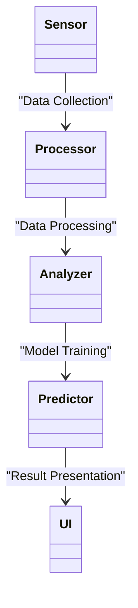
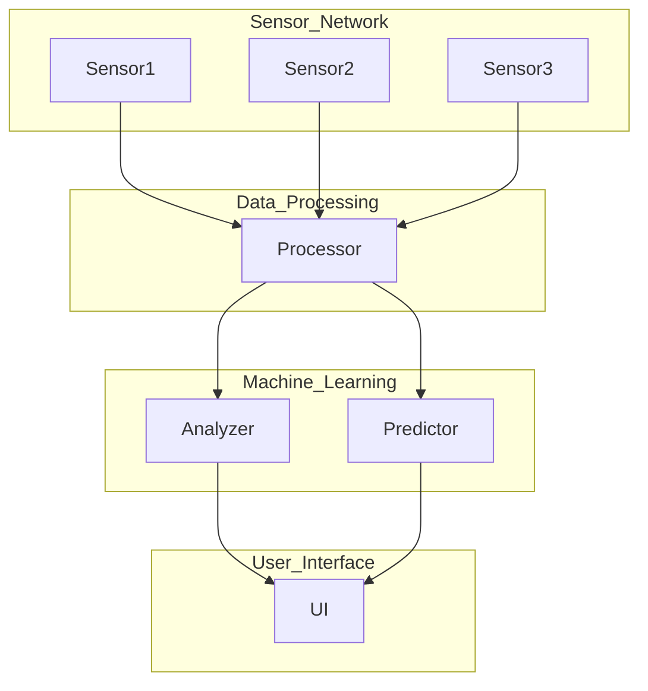
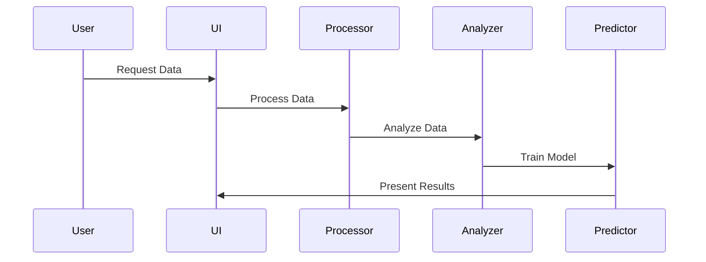

                 


## 构建企业级AI环境监测助手：合规与可持续发展

### 关键词

- 企业级AI环境监测
- 合规性
- 可持续性
- 系统架构
- 实战案例分析

### 摘要

本文将深入探讨构建企业级AI环境监测助手的过程，重点分析其在合规性和可持续发展方面的挑战与解决方案。文章将分为五个部分，首先介绍AI环境监测的背景及其重要性，然后讨论AI技术原理、系统架构设计、项目实施过程，最后分享最佳实践和小结。本文旨在为企业在AI环境监测领域的实践提供有价值的指导。

## 第一部分：背景与概述

### 第一章：引言

#### 1.1 问题背景

随着工业4.0的推进和数字化转型浪潮的兴起，企业对环境监测的需求日益增长。传统的环境监测方法已经无法满足企业对于实时性、准确性和智能化的要求。在此背景下，构建一个企业级AI环境监测助手成为必然选择。

#### 1.2 问题描述

企业级AI环境监测助手的任务是对企业内部或周边环境中的各种参数进行实时监测，如空气质量、水质、噪声等。这些数据对于企业的生产安全和环境保护至关重要。

#### 1.3 问题解决

通过集成传感器、数据处理和机器学习技术，AI环境监测助手能够实现数据的实时采集、分析和预警。这不仅提高了监测的准确性，还能为企业提供基于数据的决策支持。

#### 1.4 边界与范围

本文所述的企业级AI环境监测助手主要关注以下几个方面：

1. **传感器数据采集**：涵盖各种环境参数的传感器集成。
2. **数据处理**：数据清洗、预处理和特征提取。
3. **机器学习模型**：构建用于环境参数预测和分类的机器学习模型。
4. **用户界面**：提供直观的数据展示和操作界面。

#### 1.5 核心概念结构与关键要素

1. **传感器网络**：负责实时采集环境数据。
2. **数据处理模块**：包括数据清洗、预处理和特征提取。
3. **机器学习模块**：构建和训练用于环境监测的机器学习模型。
4. **预警与决策支持系统**：基于监测数据提供实时预警和决策支持。
5. **用户界面**：实现用户与系统的交互。

## 第二部分：AI技术原理

### 第二章：核心概念与联系

#### 2.1 核心概念原理

- **传感器网络**：由各种类型的传感器组成，用于实时采集环境数据。
- **数据处理**：包括数据清洗、预处理和特征提取，以提高数据质量和模型性能。
- **机器学习**：通过训练模型来自动分析和预测环境参数。
- **用户界面**：提供直观的数据展示和操作界面。

#### 2.2 概念属性特征对比表格

| 概念         | 属性特征                            | 关联关系 |
|--------------|-----------------------------------|---------|
| 传感器网络   | 实时性、准确性、多样性              | 数据采集 |
| 数据处理     | 数据清洗、预处理、特征提取          | 数据分析 |
| 机器学习     | 自动化、智能化、预测性              | 数据分析 |
| 用户界面     | 直观、交互、易操作                  | 用户交互 |

#### 2.3 ER图

```mermaid
erDiagram
    Product ||--|{ Customer } : "buys"
    Customer ||--|{ Product } : "supplies"
    Customer ||--|{ Sales } : "sells"
    Sales ||--|{ Product } : "on"
    Product ||--|{ Warehouse } : "stored"
    Warehouse ||--|{ Sales } : "location"
```

## 第三部分：系统架构与设计

### 第三章：系统分析

#### 3.1 项目介绍

本项目的目标是构建一个企业级AI环境监测系统，该系统将集成传感器网络、数据处理模块、机器学习模块和用户界面，以实现对环境参数的实时监测、分析和预警。

#### 3.2 系统功能设计



### 第四章：系统架构设计



### 第五章：系统接口设计与交互



## 第四部分：项目实施

### 第六章：项目实战

#### 6.1 环境搭建

在开始项目之前，我们需要搭建一个合适的环境。以下是所需的环境搭建步骤：

1. **操作系统**：Ubuntu 20.04
2. **编程语言**：Python 3.8
3. **依赖库**：NumPy, Pandas, Scikit-learn, Matplotlib等
4. **传感器**：DHT22（用于温度和湿度测量）

#### 6.2 核心系统实现

以下是一个简单的Python代码示例，用于实现传感器数据的实时采集和处理：

```python
import time
import serial
import pandas as pd

# 初始化串口通信
ser = serial.Serial('/dev/ttyUSB0', 9600)

# 定义传感器数据采集函数
def read_sensor_data():
    ser.reset_input_buffer()
    time.sleep(0.1)
    while ser.inWaiting() == 0:
        time.sleep(0.01)
    data = ser.readline().decode('utf-8').strip()
    return data

# 定义数据处理函数
def process_data(data):
    df = pd.DataFrame([list(map(float, data.split(',')))], columns=['Temperature', 'Humidity'])
    return df

# 实时数据采集与处理
while True:
    data = read_sensor_data()
    df = process_data(data)
    print(df)
    time.sleep(1)
```

#### 6.3 代码解读与分析

上述代码首先通过串口通信初始化DHT22传感器，然后定义了读取传感器数据和数据处理函数。实时数据采集与处理部分则不断读取传感器数据，将其转换为DataFrame格式，并打印出来。

#### 6.4 案例分析与详细讲解

以一个具体案例来展示AI环境监测助手的实战应用：

- **场景**：一个工厂需要监测生产车间的温度和湿度，以确保生产过程中的安全性和产品质量。
- **数据采集**：通过DHT22传感器实时采集车间的温度和湿度数据。
- **数据处理**：对采集到的数据进行清洗和预处理，提取关键特征。
- **模型训练**：使用Scikit-learn库中的线性回归模型预测温度和湿度。
- **预警与决策支持**：当温度或湿度超出预设阈值时，系统会发出预警，并提供相应的解决方案。

#### 6.5 项目小结

本项目通过实际案例展示了如何构建一个企业级AI环境监测系统。在实际应用中，企业可以根据自身需求扩展系统的功能，如增加其他环境参数的监测、优化机器学习模型等。

## 第五部分：最佳实践与结论

### 第七章：最佳实践与结论

#### 7.1 最佳实践

1. **数据安全与隐私保护**：在数据采集和处理过程中，确保数据安全和用户隐私。
2. **模型可解释性**：提高机器学习模型的可解释性，以便企业更好地理解模型决策。
3. **系统集成**：将环境监测系统与企业现有的IT系统集成，以提高整体运营效率。

#### 7.2 项目经验

1. **需求分析**：深入了解企业的需求，确保环境监测系统符合实际应用场景。
2. **技术选型**：根据项目需求选择合适的传感器、数据处理和机器学习技术。
3. **持续优化**：在项目实施过程中，不断优化系统的性能和用户体验。

#### 7.3 注意事项

1. **传感器校准**：定期校准传感器，确保数据的准确性。
2. **系统维护**：定期检查和更新系统的软件和硬件。

#### 7.4 拓展阅读

- 《AI技术应用实战》
- 《环境监测技术手册》
- 《机器学习实战》

### 作者信息

作者：AI天才研究院/AI Genius Institute & 禅与计算机程序设计艺术 /Zen And The Art of Computer Programming

