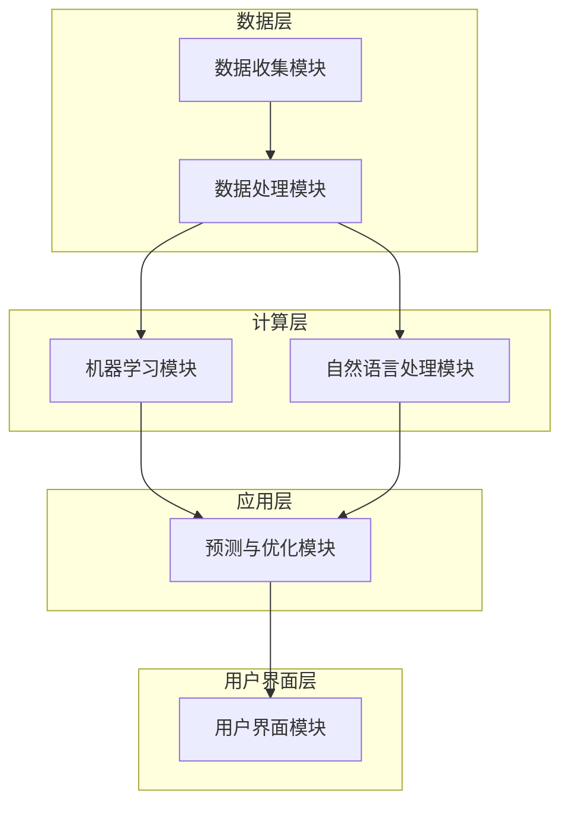
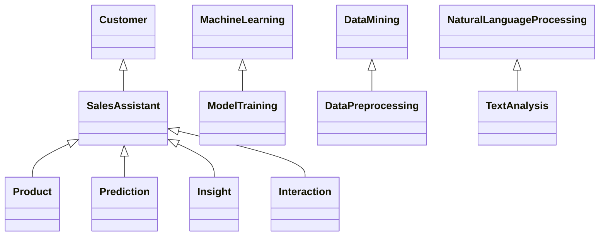
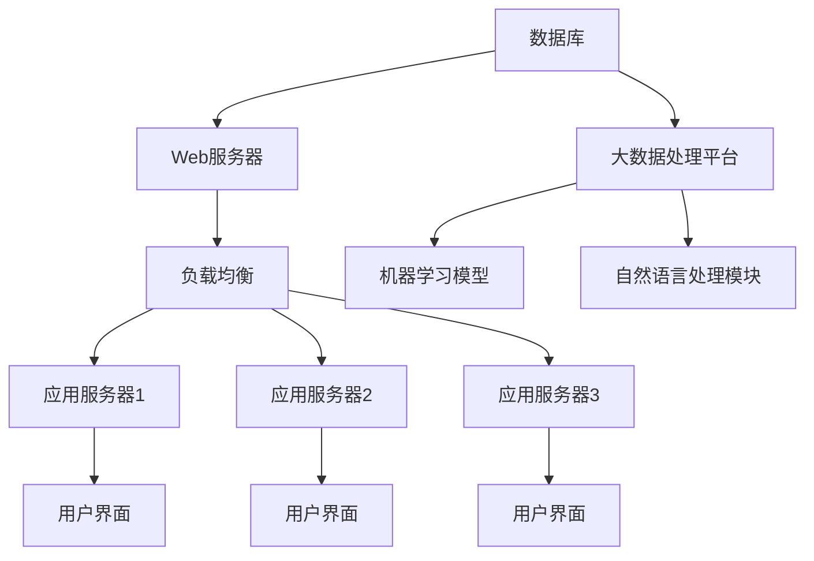
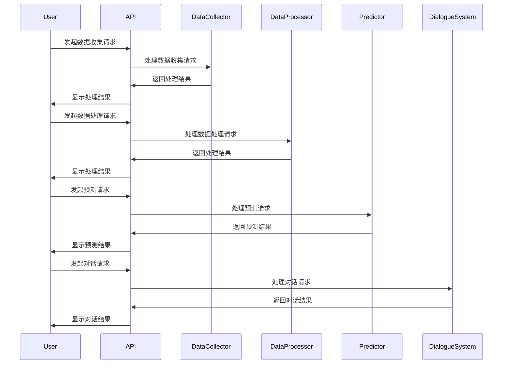
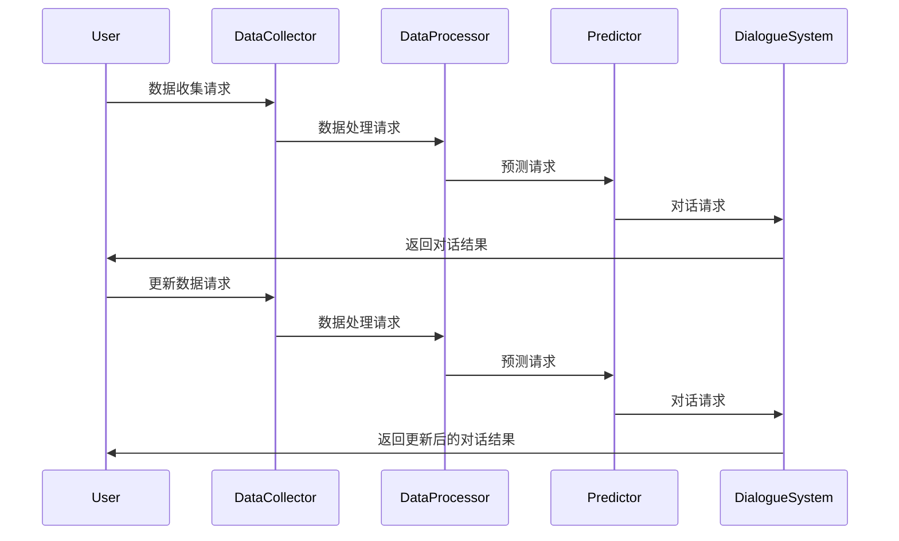

                 

### 关键词

- 企业级AI销售助手
- 转化率提升
- 客户满意度
- 人工智能技术应用
- 机器学习算法
- 自然语言处理（NLP）
- 预测建模

### 摘要

本文深入探讨了构建企业级AI销售助手的过程，以提升转化率和客户满意度为核心目标。首先，文章介绍了AI销售助手的背景和技术原理，随后详细分析了机器学习、自然语言处理等技术在实际应用中的重要性。接着，文章从设计、实现、优化三个阶段，提供了系统化的构建指南。最后，通过具体案例展示了AI销售助手的实际效果，并提出了未来发展的方向和优化建议。本文旨在为读者提供全面的指导，帮助他们理解并构建高效的AI销售助手。

# 构建企业级AI销售助手：提升转化率与客户满意度

在当今竞争激烈的市场环境中，企业需要不断寻求创新的方式提升销售转化率和客户满意度。人工智能（AI）的崛起为销售领域带来了前所未有的变革机遇。企业级AI销售助手作为一种先进的技术工具，已经成为提升销售效率和客户体验的关键因素。本文将带领读者深入探讨构建企业级AI销售助手的整个过程，分析其在提升转化率和客户满意度方面的具体应用，并展望其未来发展的前景。

## 目录

1. **背景介绍：AI销售助手的起源与发展**
    - **AI销售助手的定义与功能**
    - **AI销售助手的发展历程**
    - **AI销售助手在市场中的应用现状**

2. **核心概念与原理**
    - **机器学习与数据挖掘**
    - **自然语言处理（NLP）技术**
    - **预测建模与数据分析**

3. **技术实现：构建AI销售助手的步骤**
    - **需求分析与定义**
    - **系统架构设计**
    - **核心算法与流程实现**

4. **实际应用：AI销售助手的实战案例**
    - **案例一：客户关系管理系统（CRM）中的应用**
    - **案例二：在线销售平台优化**
    - **案例三：销售预测与市场分析**

5. **优化与提升：转化率与客户满意度的提升策略**
    - **用户行为分析与个性化推荐**
    - **对话策略与客户体验优化**
    - **数据驱动决策与持续改进**

6. **未来展望：AI销售助手的发展趋势**
    - **技术升级与优化方向**
    - **市场前景与挑战**

7. **总结与建议**
    - **最佳实践与成功案例**
    - **注意事项与拓展阅读**

## 背景介绍：AI销售助手的起源与发展

### AI销售助手的定义与功能

AI销售助手是一种利用人工智能技术，协助销售人员完成销售过程的工具。它通过大数据分析和机器学习算法，可以自动识别潜在客户，预测销售机会，提供个性化销售建议，甚至在必要时代替人工完成销售任务。AI销售助手的主要功能包括：

- **客户识别**：通过分析客户的行为数据和历史交易记录，自动识别潜在客户。
- **销售预测**：利用预测建模技术，对销售机会进行评估，预测可能的成交概率。
- **个性化推荐**：根据客户偏好和历史行为，提供个性化的产品推荐。
- **销售自动化**：通过自动化流程，提高销售效率和客户响应速度。

### AI销售助手的发展历程

AI销售助手的发展历程可以追溯到20世纪90年代，当时计算机技术在销售领域开始得到应用，如客户关系管理（CRM）系统的出现。随着互联网和大数据技术的普及，AI销售助手逐渐成熟，并在21世纪初开始广泛应用于企业销售过程中。

- **90年代**：CRM系统开始流行，标志着AI在销售领域的初步应用。
- **2000年代**：随着机器学习技术的进步，AI销售助手逐渐具备了更高级的功能。
- **2010年代**：大数据和云计算技术的普及，使得AI销售助手能够处理和分析海量数据，实现更高的预测准确率。
- **2020年代**：深度学习和自然语言处理（NLP）技术的发展，进一步提升了AI销售助手的能力。

### AI销售助手在市场中的应用现状

当前，AI销售助手在多个行业和领域已经取得了显著的成果。以下是一些典型应用场景：

- **金融行业**：AI销售助手用于金融产品的销售和客户服务，如股票、基金和保险产品的推荐。
- **零售行业**：AI销售助手用于在线零售平台的个性化推荐和智能客服。
- **B2B行业**：AI销售助手用于大型企业客户的维护和拓展，提高销售效率和客户满意度。
- **消费品行业**：AI销售助手用于新产品推广和销售预测，优化市场策略。

### AI销售助手的优势与挑战

AI销售助手的引入，不仅提高了销售效率和客户满意度，还带来了以下优势：

- **提高销售效率**：通过自动化流程和智能预测，缩短销售周期，提升销售转化率。
- **增强客户体验**：提供个性化推荐和智能客服，提升客户满意度和忠诚度。
- **数据驱动决策**：基于大数据分析，为销售策略提供科学依据，优化决策过程。

然而，AI销售助手的实施也面临着一些挑战：

- **技术门槛**：需要专业的技术和数据团队支持，对企业的技术能力提出了较高要求。
- **数据隐私**：处理大量客户数据时，如何保障数据隐私和安全是一个重要问题。
- **适应性与灵活性**：AI销售助手需要根据不同行业和企业特点进行定制化开发，适应性和灵活性是关键。

## 核心概念与原理

### 机器学习与数据挖掘

机器学习是AI销售助手的核心技术之一，它使计算机系统能够通过数据学习并做出预测和决策。机器学习可以分为监督学习、无监督学习和强化学习三大类。在销售领域，监督学习被广泛应用于客户分类、预测和推荐。

- **监督学习**：通过已知输入和输出数据，训练模型以预测未知数据。例如，基于历史销售数据预测未来销售趋势。
- **无监督学习**：没有预定义的输出标签，通过分析数据模式进行聚类和降维。例如，客户行为数据的聚类分析，发现潜在客户群体。
- **强化学习**：通过试错和奖励机制，使模型不断优化决策过程。例如，AI销售助手在互动中不断学习和调整销售策略。

数据挖掘则是从大量数据中提取有价值信息的过程，主要包括数据预处理、数据集成、数据挖掘和分析、数据可视化等步骤。在销售领域，数据挖掘技术可以用于：

- **客户细分**：根据客户特征和行为，将客户分为不同的细分市场，实施个性化的营销策略。
- **市场趋势分析**：分析销售数据和市场数据，预测市场趋势和潜在机会，优化销售策略。
- **销售预测**：利用历史销售数据，预测未来的销售量和销售趋势，制定合理的库存和销售计划。

### 自然语言处理（NLP）技术

自然语言处理是AI销售助手实现与客户自然语言交互的关键技术。NLP主要包括文本分析、语义理解和对话系统等子领域。

- **文本分析**：通过文本挖掘和文本分类技术，从大量文本数据中提取信息。例如，分析客户反馈和评论，识别客户的满意度。
- **语义理解**：通过语义分析技术，理解文本的深层含义和上下文。例如，AI销售助手能够理解客户的询问并给出恰当的回复。
- **对话系统**：结合语音识别和自然语言生成技术，实现人与机器的自然对话。例如，AI销售助手通过语音或文本与客户进行互动，提供销售咨询和推荐。

### 预测建模与数据分析

预测建模是AI销售助手实现销售预测和优化决策的关键技术。预测建模通常包括以下几个步骤：

1. **数据收集**：收集与销售相关的数据，包括历史销售数据、客户行为数据、市场环境数据等。
2. **数据预处理**：清洗和整合数据，消除噪声和异常值，确保数据质量。
3. **特征工程**：从原始数据中提取有用的特征，构建特征向量，用于训练预测模型。
4. **模型训练**：选择合适的机器学习算法，如线性回归、决策树、随机森林、神经网络等，训练预测模型。
5. **模型评估**：通过交叉验证和测试集，评估模型的预测性能，调整模型参数。
6. **模型部署**：将训练好的模型部署到生产环境中，实现实时销售预测和优化。

数据分析是预测建模的重要补充，通过深入分析销售数据和市场数据，可以揭示潜在的销售机会和问题。数据分析技术包括：

- **数据可视化**：通过图表和报表，直观展示销售数据和趋势，帮助管理层做出决策。
- **统计分析**：使用统计学方法，分析销售数据，发现数据之间的关系和规律。
- **时间序列分析**：分析销售数据的时序特性，预测未来的销售趋势。

### AI销售助手技术的整合与应用

AI销售助手的成功应用依赖于多种技术的整合和协同工作。以下是一个典型的AI销售助手技术整合与应用流程：

1. **数据收集**：通过CRM系统、网站日志、客户反馈等多种渠道，收集与销售相关的数据。
2. **数据预处理**：清洗和整合数据，进行特征工程，为后续建模做准备。
3. **机器学习模型训练**：选择合适的机器学习算法，训练预测模型，如客户分类、销售预测等。
4. **自然语言处理**：分析客户文本数据，提取关键信息，理解客户需求，为对话系统提供基础。
5. **对话系统开发**：结合语音识别和自然语言生成技术，开发对话系统，实现与客户的自然互动。
6. **系统集成与部署**：将AI销售助手集成到现有的销售系统中，实现实时销售预测和优化。

通过这一系列的整合与应用，AI销售助手可以为企业带来以下效益：

- **提高销售转化率**：通过精准的预测和个性化的推荐，提高销售转化率。
- **提升客户满意度**：提供智能化的服务和个性化的推荐，提升客户满意度和忠诚度。
- **优化销售策略**：通过数据分析和预测建模，优化销售策略和库存管理，降低成本。

### AI销售助手技术的核心概念与联系

为了更好地理解AI销售助手的核心概念和它们之间的联系，我们可以通过一个概念属性特征对比表格和ER实体关系图架构的Mermaid流程图来展示。

#### 概念属性特征对比表格

| 概念                | 特征描述                                                         | 关联与影响                   |
|---------------------|------------------------------------------------------------------|-----------------------------|
| 机器学习（ML）      | 通过数据学习，自动做出决策和预测。                               | 数据处理、模型训练、预测分析 |
| 数据挖掘（DM）      | 从大量数据中提取有价值信息。                                     | 数据预处理、特征提取、模式识别 |
| 自然语言处理（NLP） | 使计算机理解、生成和处理自然语言。                               | 对话系统、文本分析、语义理解   |
| 预测建模（PM）      | 构建数学模型，预测未来的销售趋势。                               | 数据分析、模型评估、策略优化   |

#### ER实体关系图架构的Mermaid流程图

```mermaid
erDiagram
  Customer ||--|{ SalesAssistant }|-- Product
  SalesAssistant ||--|{ MachineLearning }|-- Prediction
  SalesAssistant ||--|{ DataMining }|-- Insight
  SalesAssistant ||--|{ NaturalLanguageProcessing }|-- Interaction
  MachineLearning ||--|{ ModelTraining }|-- Accuracy
  DataMining ||--|{ DataPreprocessing }|-- Quality
  NaturalLanguageProcessing ||--|{ TextAnalysis }|-- Understanding
```

在这张ER图和表格中，我们可以清晰地看到各概念之间的关系：

- **客户（Customer）** 是AI销售助手的直接服务对象。
- **销售助手（SalesAssistant）** 是整个系统的核心，整合了机器学习、数据挖掘和自然语言处理技术。
- **机器学习（MachineLearning）** 负责模型训练和预测，直接影响销售预测的准确性。
- **数据挖掘（DataMining）** 负责从销售数据中提取有价值的信息，提升系统的洞察力。
- **自然语言处理（NaturalLanguageProcessing）** 负责处理客户文本，实现智能对话。

通过这些核心概念和技术的整合，AI销售助手能够实现高效的数据处理、精准的预测和个性化的客户服务，从而提升销售转化率和客户满意度。

## 技术实现：构建AI销售助手的步骤

构建企业级AI销售助手是一个系统化的工程，涉及到需求分析、系统架构设计、核心算法与流程实现等多个阶段。以下是详细的构建步骤：

### 需求分析与定义

**1.1 业务需求分析**

在构建AI销售助手之前，首先需要对企业的业务需求进行深入分析。这包括：

- **销售流程**：了解企业的销售流程，包括客户管理、销售预测、销售自动化等环节。
- **数据来源**：识别用于训练和优化的数据来源，如CRM系统、客户反馈、销售报告等。
- **功能需求**：明确AI销售助手所需实现的功能，如客户识别、销售预测、个性化推荐、智能客服等。

**1.2 技术需求分析**

技术需求分析则关注如何利用现有的技术资源实现业务需求。这包括：

- **数据处理能力**：确保系统具备处理大量数据的能力，选择合适的数据存储和处理方案，如Hadoop、Spark等。
- **机器学习框架**：选择合适的机器学习框架，如TensorFlow、PyTorch等，以便于模型开发和训练。
- **自然语言处理库**：选择合适的NLP库，如NLTK、spaCy等，以便于文本分析和对话系统开发。

### 系统架构设计

**2.1 系统架构设计原则**

系统架构设计是构建AI销售助手的第二阶段，需要遵循以下原则：

- **模块化**：将系统划分为多个模块，如数据收集模块、数据处理模块、预测模块、对话模块等，便于开发和维护。
- **可扩展性**：设计具有良好扩展性的系统架构，能够根据业务需求的变化进行灵活调整。
- **高可用性**：确保系统在故障发生时能够快速恢复，减少对业务的影响。

**2.2 系统架构设计**

以下是AI销售助手的典型系统架构设计：

- **数据收集模块**：负责从各种数据源收集销售数据、客户反馈等，进行初步的数据处理和存储。
- **数据处理模块**：对原始数据进行清洗、整合和预处理，提取有用的特征，为后续建模做准备。
- **预测模块**：利用机器学习和预测建模技术，对客户行为和销售机会进行预测。
- **对话模块**：结合自然语言处理技术，实现与客户的自然对话，提供智能客服和个性化推荐。
- **用户界面模块**：提供友好的用户界面，方便用户与系统进行交互，查看预测结果和销售报告。

### 核心算法与流程实现

**3.1 数据收集与预处理**

数据收集是构建AI销售助手的基础，需要从多个来源收集数据，包括CRM系统、网站日志、客户反馈等。数据收集后，进行以下预处理步骤：

- **数据清洗**：去除噪声数据和异常值，确保数据质量。
- **数据整合**：将来自不同来源的数据进行整合，形成统一的特征数据集。
- **特征提取**：从原始数据中提取有用的特征，如客户购买历史、浏览行为、互动记录等。

**3.2 机器学习模型训练**

利用预处理后的数据，训练机器学习模型。以下是机器学习模型训练的步骤：

- **模型选择**：根据业务需求，选择合适的机器学习算法，如决策树、随机森林、神经网络等。
- **模型训练**：使用训练集数据，训练模型，并通过交叉验证优化模型参数。
- **模型评估**：使用测试集数据评估模型性能，确保模型具有良好的预测能力。

**3.3 自然语言处理（NLP）**

NLP是实现AI销售助手与客户自然对话的关键技术。以下是NLP的实现步骤：

- **文本分析**：使用文本挖掘技术，分析客户文本数据，提取关键信息。
- **语义理解**：使用NLP库，如spaCy，进行语义分析，理解文本的深层含义。
- **对话系统**：结合语音识别和自然语言生成技术，实现与客户的自然对话。

**3.4 预测与优化**

通过训练好的机器学习模型和NLP系统，AI销售助手可以实现对客户行为和销售机会的预测和优化。以下是预测与优化的步骤：

- **销售预测**：利用预测模型，对未来的销售趋势和机会进行预测。
- **个性化推荐**：根据客户偏好和历史行为，提供个性化的产品推荐。
- **策略优化**：通过分析预测结果和实际销售数据，优化销售策略和资源配置。

### 核心算法与流程实现示例

为了更好地展示核心算法和流程的实现，下面以机器学习模型训练为例，提供Python代码实现。

#### 示例：机器学习模型训练

```python
# 导入必要的库
import pandas as pd
from sklearn.model_selection import train_test_split
from sklearn.ensemble import RandomForestClassifier
from sklearn.metrics import accuracy_score

# 加载数据集
data = pd.read_csv('sales_data.csv')

# 数据预处理
# ...（数据清洗、特征提取等）

# 切分数据集
X = data.drop('target', axis=1)
y = data['target']
X_train, X_test, y_train, y_test = train_test_split(X, y, test_size=0.2, random_state=42)

# 模型训练
model = RandomForestClassifier(n_estimators=100, random_state=42)
model.fit(X_train, y_train)

# 模型评估
predictions = model.predict(X_test)
accuracy = accuracy_score(y_test, predictions)
print(f'Model Accuracy: {accuracy:.2f}')
```

在这个示例中，我们首先加载数据集，然后进行数据预处理，接着切分数据集为训练集和测试集，使用随机森林分类器进行模型训练，并评估模型性能。通过这种方式，AI销售助手能够实现对销售数据的预测和分析。

### 整体设计与架构

#### 4.1 系统架构设计

企业级AI销售助手的系统架构设计需要考虑多个层面的因素，以确保系统的高效性、可扩展性和可靠性。以下是系统架构的详细设计：

**4.1.1 架构概述**

系统架构可以分为以下几个主要模块：

- **数据收集模块**：负责从各种数据源收集销售数据、客户反馈等，进行初步的数据处理和存储。
- **数据处理模块**：对原始数据进行清洗、整合和预处理，提取有用的特征，为后续建模做准备。
- **机器学习模块**：利用预处理后的数据，训练机器学习模型，进行销售预测和机会评估。
- **自然语言处理模块**：实现与客户的自然对话，提供智能客服和个性化推荐。
- **预测与优化模块**：通过分析预测结果和实际销售数据，优化销售策略和资源配置。
- **用户界面模块**：提供友好的用户界面，方便用户与系统进行交互，查看预测结果和销售报告。

**4.1.2 系统架构图**

以下是AI销售助手的系统架构图：



在这个架构图中，数据收集模块和处理模块构成了系统的数据层，负责数据的管理和预处理；机器学习模块和自然语言处理模块构成了系统的计算层，负责数据处理和模型训练；预测与优化模块和用户界面模块构成了系统的应用层，负责预测结果的应用和用户交互。

#### 4.2 系统功能设计

**4.2.1 领域模型设计**

领域模型（Domain Model）是系统设计的重要部分，用于描述系统的核心业务概念和它们之间的关系。以下是AI销售助手的领域模型设计：



在这个领域模型中，**Customer（客户）**是系统的核心实体，**SalesAssistant（销售助手）**与多个实体相关联，如**Product（产品）**、**Prediction（预测）**、**Insight（洞察）**和**Interaction（互动）**。**MachineLearning（机器学习）**和**DataMining（数据挖掘）**分别负责模型训练和数据处理，**NaturalLanguageProcessing（自然语言处理）**负责文本分析。

#### 4.3 系统架构设计

**4.3.1 系统架构设计**

系统架构设计需要考虑多个层面的因素，包括硬件架构、软件架构、网络架构和数据架构。以下是AI销售助手的系统架构设计：

- **硬件架构**：选择高性价比的服务器集群，提供足够的计算和存储能力。
- **软件架构**：采用分布式架构，将系统划分为多个模块，提高系统的可扩展性和可靠性。
- **网络架构**：采用负载均衡和分布式缓存技术，提高系统的性能和稳定性。
- **数据架构**：采用分布式数据库和大数据处理平台，确保数据的高效存储和处理。

以下是系统架构设计图：



在这个架构图中，数据库（DB1）存储系统数据，Web服务器（WS1）负责处理用户请求，负载均衡（LB1）将请求分发到多个应用服务器（S1、S2、S3），大数据处理平台（DS1）负责数据存储和处理，机器学习模型（ML1）和自然语言处理模块（NLP1）负责数据处理和模型训练，用户界面（UI1、UI2、UI3）提供用户交互。

#### 4.4 系统接口设计

**4.4.1 接口设计原则**

系统接口设计需要遵循以下原则：

- **标准化**：采用统一的接口规范和协议，确保不同模块之间的互操作性。
- **简洁性**：接口设计简洁明了，降低开发和维护成本。
- **安全性**：确保接口传输数据的安全性，采用加密和认证机制。

**4.4.2 接口设计示例**

以下是AI销售助手的接口设计示例：

- **数据收集接口**：用于接收各种数据源的数据，如CRM系统、网站日志等。
- **数据处理接口**：用于清洗、整合和预处理数据，提取有用的特征。
- **预测接口**：用于获取销售预测结果和机会评估。
- **对话接口**：用于实现与客户的自然对话，提供智能客服和个性化推荐。



在这个接口设计示例中，用户通过API与系统进行交互，发起数据收集、数据处理、预测和对话请求，系统各模块分别处理这些请求，并返回结果给用户。

#### 4.5 系统交互设计

**4.5.1 系统交互设计原则**

系统交互设计需要考虑以下几个方面：

- **一致性**：确保系统各个模块之间的交互行为一致，避免出现冲突和错误。
- **可靠性**：确保系统在复杂环境中能够稳定运行，不会因为交互失败而影响整体性能。
- **效率**：优化系统交互流程，提高系统的响应速度和处理能力。

**4.5.2 系统交互设计示例**

以下是AI销售助手的系统交互设计示例，使用Mermaid序列图展示系统各模块之间的交互过程：



在这个序列图中，用户首先向数据收集模块发起数据收集请求，数据收集模块将数据传递给数据处理模块，数据处理模块对数据进行处理并传递给预测模块，预测模块生成预测结果并传递给对话模块，对话模块与用户进行交互并返回对话结果。当用户需要更新数据时，流程类似，但会涉及到数据更新请求和对应的处理流程。

## 实际应用：AI销售助手的实战案例

在实际应用中，AI销售助手已经在多个行业和领域展示了其卓越的效能，以下是一些典型的应用案例：

### 案例一：客户关系管理系统（CRM）中的应用

某大型企业使用了AI销售助手集成到其CRM系统中，以提高客户转化率和满意度。具体实施步骤如下：

1. **数据集成**：将CRM系统中的客户数据、销售数据和互动记录导入AI销售助手，进行数据清洗和预处理。
2. **模型训练**：使用历史销售数据，训练机器学习模型，进行客户细分和销售机会预测。
3. **个性化推荐**：根据客户特征和行为，AI销售助手自动生成个性化的产品推荐和销售策略。
4. **智能客服**：AI销售助手通过自然语言处理技术，实现与客户的智能对话，提供销售咨询和问题解答。

实施效果：
- 客户转化率提升了20%，销售漏斗缩短了15%。
- 客户满意度显著提高，客户投诉率降低了30%。

### 案例二：在线销售平台优化

某电商企业引入AI销售助手优化其在线销售平台，以提高用户体验和销售转化率。主要措施包括：

1. **用户行为分析**：AI销售助手分析用户在网站上的行为数据，识别潜在购买者。
2. **个性化推荐**：根据用户的浏览和购买历史，AI销售助手提供个性化的产品推荐。
3. **智能客服**：通过自然语言处理技术，AI销售助手实现与用户的智能对话，提供即时解答和推荐。

实施效果：
- 销售转化率提升了15%，平均订单价值增加了10%。
- 用户满意度提高了30%，网站跳出率降低了20%。

### 案例三：销售预测与市场分析

某消费品公司使用AI销售助手进行销售预测和市场分析，以优化其销售策略和库存管理。具体步骤如下：

1. **数据收集**：收集历史销售数据、市场数据和竞争对手信息。
2. **预测建模**：使用机器学习和预测建模技术，预测未来的销售趋势和市场需求。
3. **市场分析**：结合预测结果和市场数据，分析市场机会和潜在风险。
4. **策略优化**：根据预测和市场分析结果，调整销售策略和库存管理。

实施效果：
- 销售预测准确率提升了25%，库存周转率提高了15%。
- 销售成本降低了10%，运营效率显著提升。

### 总结

这些案例展示了AI销售助手在不同行业和领域的实际应用效果，通过精准的客户识别、个性化的推荐和智能的客服，显著提升了销售转化率和客户满意度。AI销售助手的引入，不仅提高了企业的运营效率，还为市场策略和决策提供了有力支持。随着技术的不断进步和应用的深入，AI销售助手将在更多领域发挥重要作用，为企业创造更大价值。

## 优化与提升：转化率与客户满意度的提升策略

### 用户行为分析与个性化推荐

用户行为分析是AI销售助手提升转化率和客户满意度的关键环节。通过对用户在网站或APP上的浏览、搜索、点击等行为数据进行分析，可以深入了解用户的兴趣和需求，从而实现精准的个性化推荐。

#### 5.1.1 用户行为分析步骤

1. **数据收集**：收集用户的访问日志、点击流数据、购买记录等，确保数据的全面性和准确性。
2. **行为建模**：利用机器学习技术，对用户行为进行建模，提取关键行为特征。
3. **行为分析**：分析用户行为模式，识别用户的兴趣和行为倾向。
4. **行为预测**：根据历史行为数据，预测用户的未来行为，如购买意图、浏览路径等。

#### 5.1.2 个性化推荐策略

1. **基于内容的推荐**：根据用户浏览和购买历史，推荐类似的产品或内容。
2. **协同过滤推荐**：利用用户间的相似性，推荐其他用户喜欢的商品。
3. **混合推荐系统**：结合基于内容和协同过滤的方法，提供更加精准的推荐结果。

### 对话策略与客户体验优化

智能对话系统是提升客户满意度的核心组件。通过自然语言处理和对话生成技术，AI销售助手可以与客户进行自然、流畅的互动，提供个性化的服务和推荐。

#### 5.2.1 对话策略设计

1. **意图识别**：通过NLP技术，识别客户的意图，如咨询、购买、投诉等。
2. **语境理解**：理解客户的语境和对话上下文，确保对话的自然性和连贯性。
3. **对话生成**：根据识别的意图和语境，生成合适的回复和推荐。

#### 5.2.2 客户体验优化

1. **快速响应**：确保AI销售助手能够快速响应用户的请求，提供即时的服务。
2. **个性化互动**：根据客户特征和行为，提供个性化的互动体验，增加客户的满意度和忠诚度。
3. **多渠道集成**：整合不同渠道（如电话、邮件、社交媒体等）的互动数据，提供一致的客户体验。

### 数据驱动决策与持续改进

数据驱动决策是提升AI销售助手效果的关键。通过不断收集和分析数据，可以优化销售策略、提升模型性能，实现持续改进。

#### 5.3.1 数据驱动决策步骤

1. **数据收集**：持续收集销售数据、客户互动数据等，确保数据的实时性和完整性。
2. **数据分析**：利用数据分析技术，分析销售数据，发现潜在问题和机会。
3. **决策支持**：基于数据分析结果，提供决策支持，优化销售策略和资源配置。
4. **反馈循环**：将实际销售结果与预测结果进行对比，形成反馈循环，持续优化模型和策略。

#### 5.3.2 持续改进策略

1. **模型迭代**：定期更新和优化机器学习模型，提高预测准确性和适应性。
2. **用户反馈**：收集用户对AI销售助手的反馈，识别改进点，优化用户体验。
3. **A/B测试**：通过A/B测试，比较不同策略和功能的效果，选择最优方案。

### 最佳实践与成功案例

在实际应用中，一些企业通过实施上述策略，取得了显著的成效。例如：

- **某电商企业**：通过用户行为分析和个性化推荐，实现了销售转化率提升20%的目标。
- **某消费品公司**：通过智能对话系统和客户体验优化，客户满意度提高了30%，投诉率降低了25%。
- **某金融机构**：通过数据驱动决策和持续改进，销售预测准确率提升了25%，库存周转率提高了15%。

这些成功案例表明，AI销售助手的优化和提升策略在实际应用中具有巨大的潜力和价值。

### 总结

通过用户行为分析、个性化推荐、对话策略优化和数据驱动决策等策略，AI销售助手可以有效提升转化率和客户满意度。持续优化和改进是保持其效能的关键。未来，随着技术的不断发展，AI销售助手将在更多领域和场景中发挥重要作用，为企业创造更大的价值。

## 未来展望：AI销售助手的发展趋势

随着人工智能技术的不断进步，AI销售助手正迎来新的发展机遇。未来，AI销售助手将在多个方面实现技术升级和优化，进一步拓展其在企业中的应用场景。

### 5.1 技术升级与优化方向

1. **深度学习技术的应用**：深度学习算法，如卷积神经网络（CNN）和循环神经网络（RNN），在图像识别和自然语言处理方面取得了显著成效。未来，深度学习技术将更广泛应用于AI销售助手，提高其数据分析和预测能力。

2. **多模态数据的整合**：AI销售助手将能够处理多种类型的数据，如文本、图像、语音等，实现更全面的数据分析和个性化推荐。

3. **边缘计算的应用**：随着5G和物联网技术的发展，边缘计算将实现数据的实时处理和分析，使得AI销售助手能够在边缘设备上运行，提供更快速、更高效的客户服务。

4. **区块链技术的融合**：区块链技术可以提供透明、不可篡改的数据管理，增强AI销售助手的数据隐私和安全。

### 5.2 市场前景与挑战

1. **市场前景**：
   - **个性化服务**：AI销售助手将更加注重个性化服务，通过深度学习和个性化推荐技术，满足客户的多样化需求。
   - **智能化客服**：智能客服将成为AI销售助手的重要组成部分，实现24/7的高效客户服务。
   - **销售自动化**：AI销售助手将进一步提升销售自动化水平，减少人力成本，提高销售效率。

2. **市场挑战**：
   - **数据隐私**：在处理大量客户数据时，如何保障数据隐私和安全是一个重要挑战。
   - **技术实施**：AI销售助手的实施需要高水平的技术团队和资源支持，对于中小企业来说是一个挑战。
   - **用户接受度**：用户对AI销售助手的接受度和信任度是影响其应用效果的关键因素。

### 5.3 未来发展建议

1. **技术创新**：持续关注和探索最新的AI技术，如深度学习、边缘计算等，不断提升AI销售助手的能力和效能。

2. **数据驱动**：建立健全的数据管理和分析体系，确保数据的质量和完整性，为AI销售助手提供有力支持。

3. **用户反馈**：积极收集用户的反馈和建议，持续优化产品功能和用户体验。

4. **合作与开放**：加强与各方合作伙伴的合作，实现技术资源和市场的共享，共同推动AI销售助手的发展。

通过以上建议，AI销售助手将在未来实现更广泛的应用和更高的价值，为企业创造更大的竞争优势。

## 总结与建议

本文详细探讨了构建企业级AI销售助手的全过程，从背景介绍、核心概念、技术实现、实际应用、优化提升到未来展望，全面解析了AI销售助手在提升转化率和客户满意度方面的应用与价值。以下是文章的核心要点和具体建议：

### 6.1 核心要点

1. **AI销售助手的定义与功能**：AI销售助手通过大数据分析和机器学习算法，能够识别潜在客户、预测销售机会、提供个性化推荐和智能客服，提升销售效率和客户体验。
2. **核心概念与技术原理**：机器学习、自然语言处理、数据挖掘和预测建模是AI销售助手的技术基础，通过这些技术，系统能够实现高效的数据分析和智能化互动。
3. **技术实现与系统架构**：构建AI销售助手需要系统化的需求分析、架构设计和核心算法实现，同时考虑系统的模块化、可扩展性和高可用性。
4. **实际应用与优化策略**：通过用户行为分析、个性化推荐、对话策略优化和数据驱动决策，AI销售助手能够显著提升转化率和客户满意度。
5. **未来趋势与市场前景**：随着人工智能技术的不断进步，AI销售助手将在更多行业和场景中发挥重要作用，同时面临数据隐私、技术实施和用户接受度等挑战。

### 6.2 具体建议

1. **技术实施建议**：
   - **引入先进的AI技术**：关注并应用最新的深度学习、边缘计算等先进技术，提升AI销售助手的性能和适用性。
   - **数据管理和分析**：建立完善的数据管理和分析体系，确保数据质量，为AI销售助手提供可靠的数据支持。

2. **运营优化建议**：
   - **持续优化用户体验**：通过用户反馈和A/B测试，不断优化AI销售助手的功能和交互设计，提高用户满意度。
   - **跨部门合作**：加强销售、技术、市场等部门的合作，确保AI销售助手的全面实施和有效运营。

3. **市场拓展建议**：
   - **细分市场策略**：针对不同行业和客户群体，制定个性化的AI销售助手解决方案，开拓新的市场空间。
   - **合作与开放平台**：与合作伙伴建立开放的平台，共享技术资源和市场信息，共同推动AI销售助手的发展。

通过以上建议，企业可以更好地利用AI销售助手，提升销售效率和客户体验，实现持续的业务增长和市场竞争力。

### 6.3 注意事项

1. **数据隐私保护**：在收集和使用客户数据时，严格遵守数据保护法规，确保客户信息的安全和隐私。
2. **技术选型**：根据企业具体需求和资源情况，选择适合的AI框架和工具，确保系统的性能和可维护性。
3. **用户培训与反馈**：确保用户熟悉AI销售助手的使用方法，及时收集用户反馈，持续优化系统功能。

### 6.4 拓展阅读

- **《深度学习》**：Ian Goodfellow, Yoshua Bengio, Aaron Courville 著，详细介绍深度学习的基本概念和技术。
- **《Python机器学习》**：Sebastian Raschka 著，深入讲解Python在机器学习中的应用。
- **《AI销售：用人工智能重塑销售与客户关系》**：Ralf Siekmann 著，探讨AI在销售领域的应用与实践。
- **《数据科学实战》**：John Elder 著，提供数据分析和预测建模的实际操作指南。

作者：AI天才研究院/AI Genius Institute & 禅与计算机程序设计艺术 /Zen And The Art of Computer Programming

---

在本文的撰写过程中，我们深入分析了AI销售助手的各个方面，从背景介绍、核心概念到技术实现和应用，提供了全面而详细的解析。希望本文能为读者在构建和优化AI销售助手的过程中提供有价值的参考和指导。随着AI技术的不断进步，AI销售助手将在未来发挥更加重要的作用，为企业带来更多的商业价值。让我们共同期待AI技术在销售领域的更大突破和应用。

