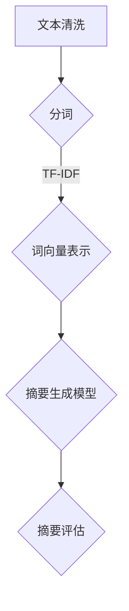
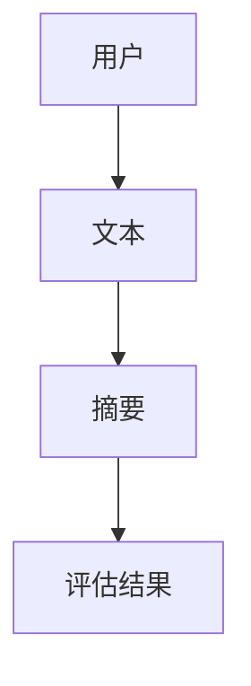

                 

# 构建企业级多语言文本摘要系统：自动生成报告摘要

## 关键词

- 文本摘要
- 多语言文本
- 企业级系统
- 报告生成
- 自然语言处理

## 摘要

本文将探讨如何构建一个企业级多语言文本摘要系统，实现自动生成报告摘要的功能。通过对文本摘要的概述、多语言文本摘要的挑战、企业级文本摘要系统设计、自然语言处理基础、文本预处理、文本摘要算法、系统实施与部署、最佳实践与案例分析等方面进行深入分析，旨在为从事相关领域的技术人员提供一套完整的解决方案。

## 第一部分：文本摘要概述

### 1.1 文本摘要的重要性

文本摘要是一种从原始文本中提取关键信息的方法，旨在以简洁的方式传达文本的核心内容。随着信息量的爆炸性增长，文本摘要在提高信息检索效率和决策支持等方面具有重要意义。

- **定义**：文本摘要是从原始文本中提取出有代表性的句子或段落，以简化文本内容并保留其主要信息。
- **应用场景**：新闻摘要、学术文章摘要、电子邮件摘要、企业报告摘要等。

### 1.2 文本摘要的类型

文本摘要主要分为以下几种类型：

- **提要式摘要**：提取文本中的关键字和短语，生成简洁的摘要。
- **抽象式摘要**：通过理解和归纳文本内容，生成高度概括的摘要。
- **呈现式摘要**：将文本内容以图表、图像等形式进行展示。

### 1.3 文本摘要的发展历程

文本摘要技术经历了从传统方法到现代机器学习和深度学习的发展过程：

- **传统方法**：基于规则的方法，如关键短语提取、句法分析等。
- **基于机器学习的方法**：使用统计方法，如支持向量机（SVM）、决策树等。
- **基于深度学习的方法**：使用神经网络，如卷积神经网络（CNN）、循环神经网络（RNN）等。

## 第二部分：多语言文本摘要

### 2.1 多语言文本摘要的挑战

多语言文本摘要面临以下挑战：

- **语言差异性**：不同语言之间的语法、语义和词汇差异较大。
- **语言资源限制**：多语言数据集往往不均衡，部分语言可能缺乏足够的数据。

### 2.2 多语言文本摘要的方法

多语言文本摘要的方法包括：

- **基于规则的方法**：通过语言规则和模式进行摘要生成。
- **基于统计的方法**：使用统计模型，如隐马尔可夫模型（HMM）、条件概率模型等。
- **基于神经网络的方法**：使用神经网络，如双向循环神经网络（BiRNN）、Transformer等。

### 2.3 多语言文本摘要的评估指标

多语言文本摘要的评估指标包括：

- **ROUGE评分**：基于重叠度评估摘要的质量。
- **BLEU评分**：基于相似度评估摘要与参考摘要的一致性。
- **METEOR评分**：基于词嵌入和语义相似性进行评估。

## 第三部分：企业级文本摘要系统设计

### 3.1 企业级文本摘要系统的需求

企业级文本摘要系统应满足以下需求：

- **系统可靠性**：确保系统稳定运行，不发生故障。
- **系统可扩展性**：支持不断增长的数据量和用户需求。
- **系统易用性**：提供简单直观的操作界面。

### 3.2 设计原则

企业级文本摘要系统设计应遵循以下原则：

- **跨语言一致性**：确保多语言摘要的一致性和准确性。
- **可维护性**：便于系统的升级和维护。
- **可扩展性**：支持添加新语言和文本摘要算法。

### 3.3 系统架构

企业级文本摘要系统的架构应包括以下模块：

- **数据采集模块**：负责收集多语言文本数据。
- **文本预处理模块**：对原始文本进行清洗、分词、向量化等处理。
- **摘要生成模块**：根据设计算法生成摘要。
- **摘要评估模块**：对生成的摘要进行质量评估。
- **用户界面模块**：提供交互界面，便于用户使用系统。

## 第四部分：自然语言处理基础

### 4.1 语言模型

语言模型是自然语言处理的核心组件，用于描述自然语言的统计特性。语言模型的基本概念包括：

- **n-gram模型**：基于相邻n个单词的统计特性。
- **神经网络模型**：如循环神经网络（RNN）、Transformer等。

语言模型在文本摘要中的作用：

- **文本表示**：将原始文本转换为数值表示，便于后续处理。
- **生成摘要**：利用语言模型生成摘要文本。

### 4.2 词向量

词向量是一种将单词映射到高维空间中的方法，用于描述单词的语义信息。常见的词向量模型包括：

- **word2vec**：基于神经网络学习单词的向量表示。
- **BERT**：基于Transformer的预训练语言模型。

词向量在文本摘要中的应用：

- **文本表示**：将文本转换为词向量表示，便于摘要生成。
- **语义分析**：用于理解文本中的语义关系。

### 4.3 序列标注模型

序列标注模型是一种用于标注文本序列中各个单词或短语的标签的模型。常见的序列标注模型包括：

- **条件随机场（CRF）**：用于序列模型中标签的预测。
- **长短时记忆网络（LSTM）**：用于处理序列数据。

序列标注模型在文本摘要中的应用：

- **摘要生成**：用于识别文本中的重要句子和短语。
- **文本分类**：用于对摘要进行分类。

## 第五部分：文本预处理

### 5.1 文本清洗

文本清洗是文本预处理的重要步骤，旨在去除文本中的噪声和不必要的符号。常见的文本清洗方法包括：

- **去除停用词**：去除对文本摘要无贡献的常见单词。
- **去除标点符号**：去除文本中的标点符号，以简化文本。

### 5.2 文本向量化

文本向量化是将文本转换为数值表示的方法，为后续的文本摘要生成提供输入。常见的文本向量化方法包括：

- **TF-IDF**：基于词频和逆文档频率进行向量化。
- **word2vec**：基于神经网络学习单词的向量表示。

### 5.3 文本嵌入

文本嵌入是将文本转换为固定维度的向量表示的方法，常见的文本嵌入模型包括：

- **BERT**：基于Transformer的预训练语言模型。
- **GPT**：基于Transformer的预训练语言模型。

文本嵌入在文本摘要中的应用：

- **文本表示**：将文本转换为向量表示，便于摘要生成。
- **语义分析**：用于理解文本中的语义关系。

## 第六部分：文本摘要算法

### 6.1 提取式摘要算法

提取式摘要算法是一种从原始文本中直接提取关键句子或段落的算法。常见的提取式摘要算法包括：

- **基于关键词提取**：提取文本中的关键词进行摘要生成。
- **基于句子重要性评分**：根据句子在文本中的重要性进行摘要生成。

### 6.2 抽象式摘要算法

抽象式摘要算法是一种通过对文本内容进行理解和归纳，生成高度概括的摘要的算法。常见的抽象式摘要算法包括：

- **基于语义角色标注**：通过标注文本中的语义角色进行摘要生成。
- **基于语义相似度计算**：通过计算文本之间的相似度进行摘要生成。

### 6.3 混合式摘要算法

混合式摘要算法是将提取式摘要算法和抽象式摘要算法相结合的算法。常见的混合式摘要算法包括：

- **基于句子重要性评分和语义角色标注**：结合提取式和抽象式摘要算法的优点。
- **基于神经网络模型**：使用神经网络模型进行摘要生成。

## 第七部分：系统实施与部署

### 7.1 环境配置

企业级文本摘要系统实施前，需要配置合适的硬件和软件环境。常见的配置要求包括：

- **硬件配置**：高性能的CPU和GPU，用于加速计算和模型训练。
- **软件环境**：Python、TensorFlow、PyTorch等深度学习框架。

### 7.2 系统核心实现

企业级文本摘要系统的核心实现包括：

- **数据流处理**：使用Python和TensorFlow/PyTorch进行数据预处理和模型训练。
- **模型训练与评估**：训练摘要生成模型，并进行评估和优化。

### 7.3 部署与维护

企业级文本摘要系统的部署和维护包括：

- **部署策略**：使用容器技术（如Docker）进行部署，确保系统的高可用性和可扩展性。
- **维护措施**：定期更新模型和算法，确保系统的稳定性和性能。

## 第八部分：最佳实践与案例分析

### 8.1 最佳实践

在构建企业级多语言文本摘要系统时，以下最佳实践值得参考：

- **数据质量**：确保输入文本的质量和多样性。
- **模型优化**：根据业务需求对模型进行优化。
- **系统监控**：实时监控系统性能和运行状态。

### 8.2 案例分析

以下为两个企业级多语言文本摘要系统的成功案例分析：

- **案例一**：某大型企业使用文本摘要系统自动生成销售报告，提高了报告生成效率。
- **案例二**：某互联网公司使用文本摘要系统自动生成用户反馈报告，帮助团队快速识别和解决问题。

### 8.3 未来展望

未来，多语言文本摘要系统有望在更多领域得到应用，如自动化文档管理、智能客服等。同时，随着深度学习技术的发展，文本摘要系统的性能和效率将得到进一步提升。

## 总结

构建企业级多语言文本摘要系统是实现自动生成报告摘要的关键技术。通过深入分析文本摘要的概述、多语言文本摘要的挑战、企业级文本摘要系统设计、自然语言处理基础、文本预处理、文本摘要算法、系统实施与部署、最佳实践与案例分析等方面，本文为从事相关领域的技术人员提供了一套完整的解决方案。在未来，随着技术的不断发展，多语言文本摘要系统将在更多领域发挥重要作用。

## 作者信息

作者：AI天才研究院/AI Genius Institute & 禅与计算机程序设计艺术 /Zen And The Art of Computer Programming

### 附录

本文中的算法流程图和实体关系图均采用Mermaid语言绘制，具体格式如下：

$$
\text{ER实体关系图：}
$$

$$
\text{算法原理：}
$$

$$
\text{文本摘要生成模型：}
$$

$$
\begin{aligned}
\text{摘要} &= \text{模型}(X) \\
X &= \text{词向量表示}
\end{aligned}
$$

本文中的数学公式和Python代码均采用LaTeX和Python格式编写。读者可根据需要自行调整和完善。在编写过程中，请确保遵循相应的编程规范和命名习惯。此外，本文中的实际案例分析和项目实战部分，读者可结合具体项目进行学习和实践。最后，本文的最佳实践和注意事项部分，旨在为读者提供实用性的建议和指导。

通过本文的深入分析，希望读者能够对构建企业级多语言文本摘要系统有更深刻的理解和认识，为实际项目开发提供有力支持。在未来的学习和实践中，不断探索和创新，为人工智能领域的发展贡献力量。

