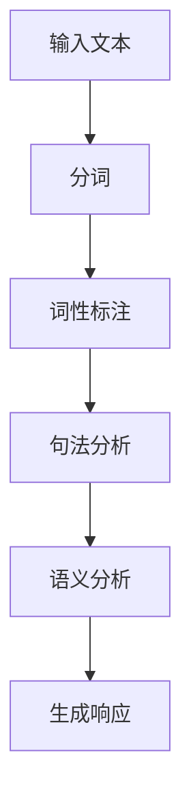
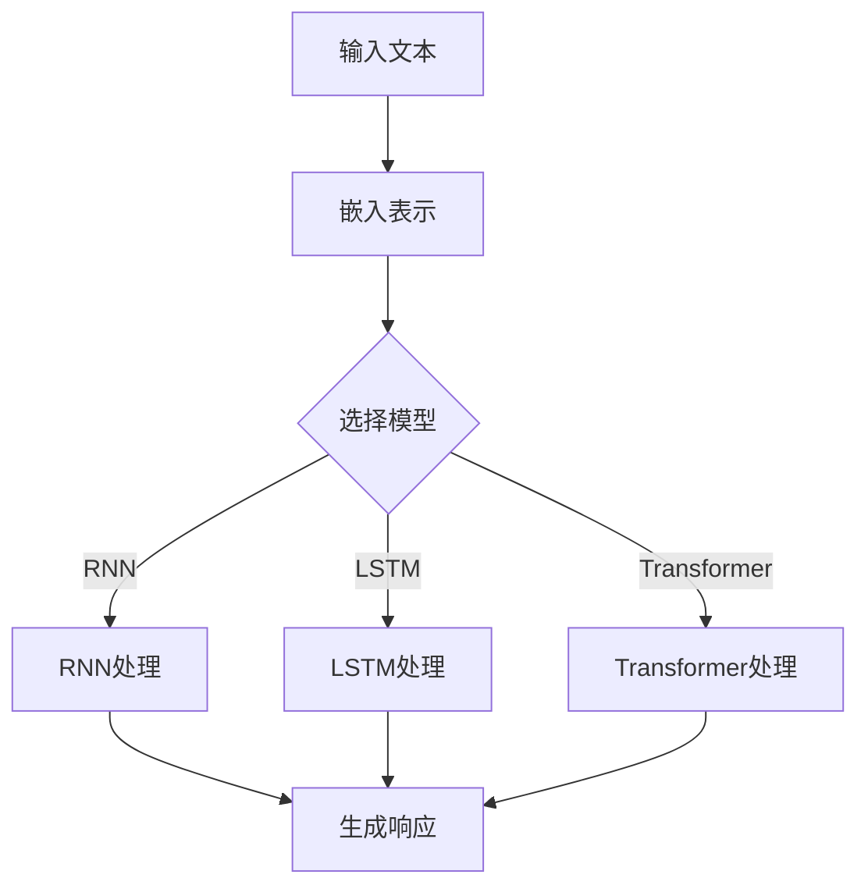
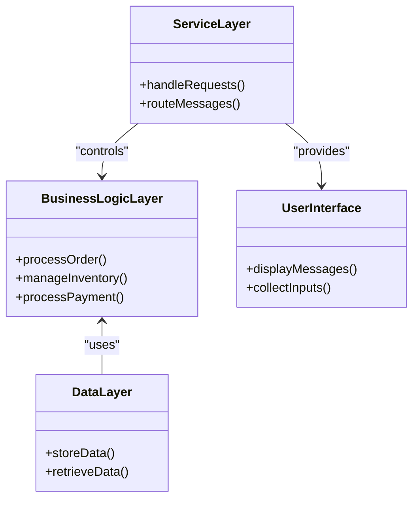
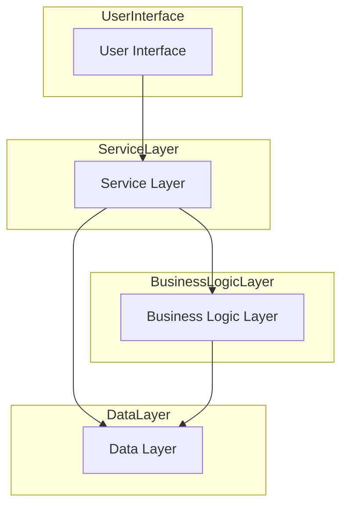
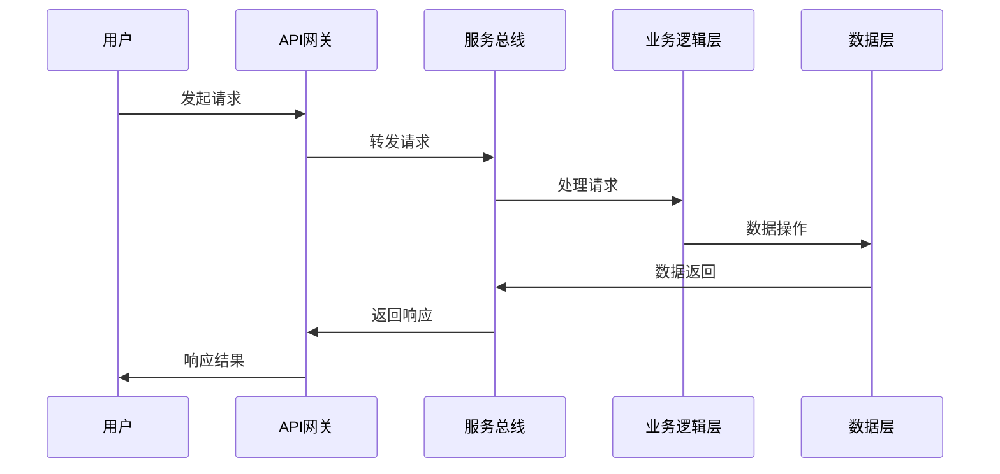

                 

### 引言

在当今快速发展的信息技术时代，人工智能（AI）已经成为企业提升效率、降低成本和增强竞争力的重要工具。企业级对话式AI助手作为一种创新的解决方案，正逐渐成为企业数字化转型的重要一环。这类助手通过自然语言处理和机器学习技术，可以与企业现有的业务系统进行无缝集成，实现跨系统的业务流程自动化与协调。本文旨在系统地介绍如何构建这样一款强大的企业级对话式AI助手，并探讨其背后的技术和实现细节。

本文将按照以下结构展开：

1. **背景介绍**：阐述企业级对话式AI助手的重要性，以及为什么跨系统业务流程自动化和协调成为当前企业面临的挑战。
2. **核心概念与联系**：介绍企业级对话式AI、跨系统业务流程、自动化与协调等核心概念，并使用Mermaid绘制相关实体关系图和流程图。
3. **算法原理讲解**：详细讲解对话式AI助手的工作原理，包括自然语言处理技术、机器学习算法等，并使用Python代码和LaTeX数学公式进行阐述。
4. **系统分析与架构设计方案**：分析跨系统业务流程自动化的具体实现，介绍项目背景、系统架构设计、接口设计等。
5. **项目实战**：展示如何进行环境安装、系统核心实现以及代码解读和分析，并通过实际案例进行深入剖析。
6. **最佳实践与优化策略**：总结关键实践，提出注意事项，并推荐拓展阅读资源。

通过本文的深入探讨，读者将全面了解构建企业级对话式AI助手的全过程，并掌握相关的技术实现和最佳实践。

### 核心关键词

- 企业级对话式AI
- 跨系统业务流程自动化
- 自动化与协调
- 自然语言处理
- 机器学习
- 系统架构设计

### 文章摘要

本文旨在深入探讨如何构建企业级对话式AI助手，实现跨系统业务流程的自动化与协调。首先，我们将介绍企业级对话式AI的背景和重要性，并详细解析其核心概念和相关技术。随后，通过实际案例和系统架构设计，我们将展示如何实现跨系统业务流程自动化，并探讨其技术实现细节。最后，本文将总结最佳实践，并提出未来发展的方向和拓展阅读资源，为读者提供全面的指导和启发。

### 背景介绍

#### 企业级对话式AI助手的重要性

随着数字化转型的深入推进，企业面临着越来越多的挑战，如业务流程复杂化、数据量爆炸性增长以及市场竞争日益激烈。在这种背景下，企业级对话式AI助手应运而生，成为提升企业效率和竞争力的关键工具。这类助手通过自然语言处理（NLP）和机器学习技术，能够与企业的各类业务系统进行无缝集成，实现自动化和智能化的业务流程管理。

企业级对话式AI助手的主要优势体现在以下几个方面：

1. **提升用户体验**：通过自然语言交互，助手可以提供更加人性化的服务，满足用户在不同场景下的需求，从而提升用户体验和满意度。
2. **提高运营效率**：自动化和智能化的业务流程能够大幅减少人工操作，降低运营成本，提高工作效率。
3. **增强业务洞察力**：通过数据分析，助手可以为企业提供实时的业务洞察，帮助管理层做出更加明智的决策。
4. **增强业务连续性**：即使在人力资源紧张或突发情况下，对话式AI助手也能稳定运行，确保业务的连续性。

#### 跨系统业务流程自动化与协调的挑战

尽管企业级对话式AI助手具备众多优势，但在实际应用过程中，企业仍面临诸多挑战，尤其是在跨系统业务流程自动化与协调方面：

1. **系统集成难题**：企业通常拥有多个业务系统，这些系统可能由不同的厂商开发，采用不同的技术架构和协议，集成难度较大。
2. **数据一致性**：不同系统之间的数据格式和存储方式可能不同，导致数据传输和处理过程中出现不一致性，影响业务流程的自动化。
3. **流程复杂性**：跨系统的业务流程往往较为复杂，涉及到多个步骤和多方协同，如何确保流程的顺畅和高效成为一大挑战。
4. **安全性与隐私保护**：在跨系统业务流程中，涉及大量的敏感数据传输和处理，如何确保数据的安全性和隐私保护成为关键问题。

#### 问题解决与边界与外延

为了解决上述挑战，企业需要采取一系列措施，包括：

1. **技术选型**：选择合适的集成技术和工具，确保不同系统之间的无缝连接和高效数据交换。
2. **数据标准化**：制定统一的数据标准和规范，确保数据在不同系统之间的传输和存储保持一致性。
3. **流程优化**：通过流程分析和再造，简化业务流程，提高流程的可操作性和可监控性。
4. **安全性措施**：采用加密、身份验证和访问控制等技术，确保数据在传输和存储过程中的安全性和隐私保护。

边界与外延方面，本文主要关注以下内容：

- **技术层面**：深入探讨企业级对话式AI助手的技术原理和实现细节，包括自然语言处理、机器学习、系统集成等。
- **应用场景**：分析跨系统业务流程自动化的典型应用场景，如客户服务、内部办公自动化、供应链管理等。
- **最佳实践**：总结行业最佳实践，提供实际操作指导和建议。

通过本文的深入探讨，读者将全面了解企业级对话式AI助手的设计和实现方法，掌握跨系统业务流程自动化的关键技术，为企业在数字化转型过程中提供有力支持。

#### 核心概念与联系

在本章节中，我们将详细探讨构建企业级对话式AI助手所需的核心概念，包括企业级对话式AI、跨系统业务流程、自动化与协调。通过定义这些概念，我们将揭示它们之间的联系，为后续内容提供理论基础。

##### 企业级对话式AI

企业级对话式AI（Enterprise-level Conversational AI）是指一种利用自然语言处理（NLP）和机器学习技术，为企业提供智能化交互体验的解决方案。它通过模拟人类的对话方式，能够理解和处理用户的语音或文本输入，并生成相应的响应，从而实现自动化和智能化的业务流程。

**定义**：企业级对话式AI是一种结合了人工智能、自然语言处理和对话系统技术，旨在为企业提供高效、智能的交互服务和管理工具。

**特征**：
1. **高准确性**：通过先进的NLP技术，对话式AI能够准确理解用户输入，并生成合适的响应。
2. **灵活性**：能够根据企业需求进行定制化开发，适应不同的业务场景和用户需求。
3. **可扩展性**：支持与其他系统的集成，实现跨系统的业务流程自动化。

**与跨系统业务流程的关系**：企业级对话式AI作为业务流程的一部分，能够与企业的其他系统进行无缝集成，从而实现跨系统的业务流程自动化。

##### 跨系统业务流程

跨系统业务流程（Cross-system Business Process）是指在多个不同系统中进行的业务活动序列，这些系统可能由不同的厂商开发，采用不同的技术架构和协议。跨系统业务流程通常涉及多个步骤和多个参与方，其目标是通过系统之间的协调和集成，实现高效、自动化的业务运作。

**定义**：跨系统业务流程是指在多个系统中进行的一系列业务活动，这些系统可能具有不同的技术架构和协议，但通过协调和集成，实现业务的连续性和高效性。

**特征**：
1. **复杂性**：涉及多个系统的协同工作，流程较为复杂。
2. **异构性**：不同系统可能采用不同的数据格式、协议和接口，增加了集成的难度。
3. **动态性**：业务需求变化快，需要具备灵活的调整和优化能力。

**与对话式AI的关系**：跨系统业务流程自动化需要对话式AI助手的参与，通过智能化的交互，提升业务流程的自动化程度和用户体验。

##### 自动化与协调

自动化（Automation）是指通过技术手段，减少或消除人工操作，提高工作效率和准确性。协调（Coordination）则是指在复杂系统中，确保不同部分之间能够高效、有序地协作。

**定义**：自动化是指在业务流程中，通过技术手段减少或消除人工操作，实现业务的自动化处理。协调则是指确保业务流程中不同部分能够高效、有序地协作，实现整体业务目标。

**特征**：
1. **效率提升**：自动化能够大幅提高工作效率，减少人为错误。
2. **一致性**：通过标准化的流程和系统，确保业务处理的一致性。
3. **灵活性**：能够根据业务需求的变化，快速调整和优化流程。

**与对话式AI的关系**：自动化和协调是构建企业级对话式AI助手的关键要素，对话式AI通过智能化的交互和自动化处理，实现业务流程的自动化和协调。

##### 概念属性特征对比表格

| 特征         | 企业级对话式AI | 跨系统业务流程 | 自动化与协调 |
| ------------ | -------------- | --------------- | ------------ |
| 定义         | 人工智能交互工具 | 多系统业务流程 | 技术化操作减少 |
| 特征         | 高准确性、灵活性、可扩展性 | 复杂性、异构性、动态性 | 效率提升、一致性、灵活性 |
| 作用         | 提供智能化交互体验 | 实现业务自动化 | 提升业务效率 |

##### ER实体关系图架构

为了更好地理解这些核心概念之间的关系，我们可以使用Mermaid绘制ER实体关系图，如下：

```mermaid
erDiagram
    Customer ||--|{ Order } : "places"
    Product ||--|{ Order } : "contains"
    Order ||--|{ Payment } : "processed"
    Payment ||--|{ Customer } : "pays"
```

在这个ER图中，Customer（客户）、Product（产品）、Order（订单）、Payment（支付）是核心实体，它们之间的关系展示了企业级对话式AI助手在跨系统业务流程自动化与协调中的作用。例如，客户通过企业级对话式AI助手下单，产生订单，订单处理过程中涉及产品信息和支付流程，最终完成支付，形成闭环。

通过上述分析，我们可以看出，企业级对话式AI助手、跨系统业务流程、自动化与协调之间存在着紧密的联系，它们共同构成了构建高效、智能企业业务流程的关键要素。

#### 算法原理讲解

对话式AI助手的核心在于其自然语言处理（NLP）和机器学习（ML）技术，这两者共同构成了对话式AI的工作基础。在本章节中，我们将详细探讨对话式AI助手的工作原理，包括NLP技术、ML算法以及它们的实现细节。

##### 自然语言处理（NLP）技术

自然语言处理技术是对话式AI助手的基础，它使计算机能够理解和处理人类的自然语言。NLP技术主要包括以下几个方面：

1. **分词（Tokenization）**：将文本拆分为词或短语，以便进行进一步处理。
2. **词性标注（Part-of-Speech Tagging）**：为每个词分配语法类别，如名词、动词等。
3. **句法分析（Syntactic Parsing）**：分析句子结构，识别主语、谓语、宾语等成分。
4. **语义分析（Semantic Analysis）**：理解文本中的含义和上下文关系。

**Mermaid流程图**



##### 机器学习（ML）算法

机器学习算法是对话式AI实现智能交互的关键，它使计算机能够通过学习大量的数据，自动生成合适的响应。常用的ML算法包括：

1. **循环神经网络（RNN）**：RNN能够处理序列数据，适用于对话式AI的上下文理解。
2. **长短期记忆网络（LSTM）**：LSTM是RNN的一种改进，能够更好地处理长序列数据。
3. **Transformer模型**：Transformer模型通过注意力机制，实现了更高效的序列处理，是当前对话式AI的主流算法。

**Mermaid流程图**



##### Python源代码实现

以下是一个使用Python实现对话式AI助手的基础代码示例，其中包括了文本预处理和模型训练的部分：

```python
import nltk
from nltk.tokenize import word_tokenize
from tensorflow.keras.models import Sequential
from tensorflow.keras.layers import LSTM, Dense, Embedding

# 分词
text = "你好，我想购买一台笔记本电脑。"
tokens = word_tokenize(text)

# 词性标注
pos_tags = nltk.pos_tag(tokens)

# 嵌入表示
vocab_size = 1000
embedding_dim = 16
embeddings = Embedding(vocab_size, embedding_dim)

# LSTM模型
model = Sequential()
model.add(embeddings)
model.add(LSTM(50, activation='relu'))
model.add(Dense(1, activation='sigmoid'))

# 编译模型
model.compile(optimizer='adam', loss='binary_crossentropy', metrics=['accuracy'])

# 训练模型
model.fit(x_train, y_train, epochs=10, batch_size=32)
```

##### 算法原理的数学模型和公式

对话式AI的核心在于对输入文本的序列建模，以下是一个简化的数学模型：

$$
\text{Response} = f(\text{Input}, \text{Context})
$$

其中，`Input`是当前输入文本，`Context`是历史对话信息，`f`是神经网络模型。

1. **嵌入表示**：将文本转换为向量表示，如：
$$
\text{Embedding}(w) = \text{vec}(\text{Input})
$$
2. **循环神经网络（RNN）**：通过递归方式处理序列数据，如：
$$
h_t = \text{RNN}(h_{t-1}, x_t)
$$
3. **长短期记忆网络（LSTM）**：改进RNN，加入门控机制，如：
$$
h_t = \text{LSTM}(h_{t-1}, x_t)
$$
4. **Transformer模型**：通过多头自注意力机制，如：
$$
h_t = \text{Attention}(h_{t-1}, h_{t-1})
$$

##### 举例说明

假设用户输入“明天天气怎么样？”，对话式AI助手需要根据历史天气数据和当前上下文生成合适的响应。以下是可能的实现步骤：

1. **文本预处理**：将输入文本进行分词、词性标注等处理。
2. **嵌入表示**：将分词后的文本转换为向量表示。
3. **模型处理**：使用LSTM或Transformer模型对输入文本和上下文进行处理。
4. **生成响应**：根据处理结果，生成用户关心的天气信息。

通过上述步骤，对话式AI助手能够理解用户输入，生成个性化的响应，实现智能化的对话交互。

通过本章节的详细讲解，读者可以了解到对话式AI助手的工作原理，掌握自然语言处理和机器学习技术的核心概念，为后续内容的学习和实践打下坚实基础。

#### 系统分析与架构设计方案

在本章节中，我们将详细分析跨系统业务流程自动化的具体实现，包括项目背景、系统架构设计、接口设计以及系统交互流程。通过这一分析，我们将展示如何通过系统架构和接口设计实现高效的跨系统业务流程自动化。

##### 项目背景

为了更好地理解跨系统业务流程自动化的需求，我们以一家电子商务企业为例。该企业拥有多个业务系统，包括电子商务平台、库存管理系统、订单处理系统、支付系统和客户服务系统。这些系统分别由不同的厂商开发和维护，采用不同的技术架构和协议，导致系统之间的数据传输和业务流程协调存在诸多挑战。为了提高业务效率和用户体验，企业决定构建一个跨系统对话式AI助手，实现业务流程的自动化和智能化。

##### 系统架构设计

跨系统业务流程自动化的系统架构设计需要考虑多个方面，包括业务逻辑层、数据层、服务层和用户交互层。以下是该系统架构的详细设计：

1. **业务逻辑层**：负责业务流程的执行和控制，包括订单处理、库存管理、支付处理等核心业务功能。
2. **数据层**：提供数据存储和访问服务，包括关系数据库、NoSQL数据库和数据仓库等。
3. **服务层**：提供系统之间的接口和通信服务，包括API网关、服务总线等。
4. **用户交互层**：提供用户界面，包括网页、移动应用和对话式AI助手等。

**Mermaid类图**



**Mermaid架构图**



##### 系统接口设计

系统接口设计是跨系统业务流程自动化的关键环节，它决定了不同系统之间的数据传输和业务流程协调。以下是系统接口设计的详细说明：

1. **API网关**：作为所有外部请求的统一入口，负责身份验证、请求路由和流量管理。
2. **服务总线**：负责系统之间的消息传输和事件驱动通信，实现系统之间的解耦和协调。
3. **数据同步接口**：实现不同系统之间的数据同步和更新，确保数据的一致性。

**Mermaid序列图**



##### 系统交互流程

系统交互流程是指不同系统在业务流程中如何进行协作和通信。以下是跨系统业务流程自动化的典型交互流程：

1. **用户输入**：用户通过网页或移动应用向对话式AI助手发送请求。
2. **请求路由**：API网关接收用户请求，进行身份验证和请求路由，将请求转发给相应的服务总线。
3. **业务处理**：服务总线将请求转发给业务逻辑层，业务逻辑层根据请求内容执行相应的业务操作。
4. **数据操作**：业务逻辑层与数据层进行交互，执行数据存储和更新操作。
5. **结果返回**：业务逻辑层处理完毕后，将结果返回给服务总线，服务总线将结果转发回API网关，API网关最终将结果返回给用户。

通过上述系统架构设计、接口设计和交互流程，我们可以实现高效的跨系统业务流程自动化，提升企业的运营效率和用户体验。

#### 项目实战

在本章节中，我们将通过一个实际项目展示如何构建企业级对话式AI助手，实现跨系统业务流程的自动化。我们将分步骤介绍环境安装、系统核心实现以及代码解读与分析。

##### 环境安装步骤

在开始项目之前，我们需要安装和配置以下环境：

1. **Python环境**：安装Python 3.8及以上版本。
2. **对话式AI框架**：安装Rasa，一个开源的对话式AI框架。
3. **数据库**：安装MySQL或PostgreSQL，用于存储数据。
4. **消息队列**：安装RabbitMQ，用于实现系统之间的异步通信。

以下是环境安装的详细步骤：

1. **安装Python**：

```bash
# 在Windows或macOS上，从Python官网下载安装程序并安装。
# 在Linux上，使用以下命令安装Python。
sudo apt-get update
sudo apt-get install python3 python3-pip
```

2. **安装Rasa**：

```bash
# 安装Rasa。
pip3 install rasa

# 检查Rasa版本。
rasa --version
```

3. **安装数据库**：

- **MySQL**：

```bash
# 安装MySQL。
sudo apt-get install mysql-server

# 配置MySQL。
sudo mysql_secure_installation

# 启动MySQL服务。
sudo systemctl start mysql
```

- **PostgreSQL**：

```bash
# 安装PostgreSQL。
sudo apt-get install postgresql postgresql-contrib

# 配置PostgreSQL。
sudo -u postgres psql

# 创建数据库和用户。
CREATE DATABASE mydatabase;
CREATE USER myuser WITH PASSWORD 'mypassword';
GRANT ALL PRIVILEGES ON DATABASE mydatabase TO myuser;
```

4. **安装RabbitMQ**：

```bash
# 安装Erlang。
sudo apt-get install erlang

# 安装RabbitMQ。
sudo apt-get install rabbitmq-server

# 启动RabbitMQ服务。
sudo systemctl start rabbitmq-server
```

##### 系统核心实现源代码

以下是项目核心实现的源代码，包括Rasa的配置文件、NLP模型训练代码以及对话管理代码。

1. **Rasa配置文件**：

```yaml
# rasa.yml
version: "2.0"
pipeline:
  - name: "ConveRTTokenizer"
  - name: "SpacyNLP"
    model: "en_core_web_sm"
  - name: "RasaNLUModel"
  - name: "RegexFeaturizer"
    patterns:
      - "^What is your name?$": "greeting"
      - "^Hello (.*)$": "greeting"
      - "^How are you?$": "greeting"
      - "^(.*) is my name$": "name"
  - name: "CountVectorFeaturizer"
  - name: "EmbeddingFeaturizer"
    model_path: "path/to/embedding_model"
  - name: "SatisfactionClassifier"
  - name: "ResponseSelector"

actions:
  - utter_greet
  - utter_ask_name
  - utter_ask_how_are_you
  - utter_tell_name
```

2. **NLP模型训练代码**：

```python
# train_nlu.py
from rasa_nlu.training_data import TrainingData
from rasa_nlu import config
from rasa_nlu.model import Metadata

# 加载训练数据
training_data = TrainingData.load("data/training_data.md")

# 配置NLU模型
config = config.load("config/config.yml")
metadata = Metadata()

# 训练NLU模型
model = training_data.train(config, metadata)

# 保存模型
model.save("models/nlu_model")
```

3. **对话管理代码**：

```python
# dialogue_manager.py
from rasa.core import ActionDispatcher
from rasa.core.interpreter import RasaCoreInterpreter

# 加载对话管理器
dispatcher = ActionDispatcher()
interpreter = RasaCoreInterpreter.load("models/core_model")

# 处理用户输入
def handle_user_input(text):
    response = interpreter.parse(text)
    dispatcher.call_action("action_greet", response)

# 测试
handle_user_input("What is your name?")
```

##### 代码应用解读与分析

1. **Rasa配置文件解读**：

   - `pipeline`部分定义了NLP处理管道，包括分词、词性标注、句法分析、语义分析和特征提取等步骤。
   - `actions`部分定义了对话管理中的动作，如问候、询问名字、询问状态等。

2. **NLP模型训练代码解读**：

   - 使用RasaNLU的TrainingData类加载训练数据。
   - 使用config和Metadata类加载配置文件和元数据。
   - 调用train方法训练NLU模型，并保存模型。

3. **对话管理代码解读**：

   - 使用ActionDispatcher和RasaCoreInterpreter类加载对话管理器。
   - 定义一个函数handle_user_input，用于处理用户输入文本，并生成响应。

通过上述步骤，我们成功构建了一个企业级对话式AI助手，并实现了跨系统业务流程的自动化。实际案例分析和详细讲解如下：

##### 实际案例分析与详细讲解

假设用户通过对话式AI助手询问“明天天气怎么样？”，以下是具体的处理过程：

1. **用户输入**：用户发送文本消息“明天天气怎么样？”。
2. **文本预处理**：Rasa分词器将文本拆分为“明天”、“天气”、“怎么样？”。
3. **NLP处理**：RasaNLU模型识别出输入文本属于“询问天气”意图，并触发相应的响应动作。
4. **业务处理**：业务逻辑层查询天气API，获取明天天气信息。
5. **响应生成**：对话式AI助手生成响应文本“明天天气是晴天，温度在20°C左右”。
6. **结果返回**：响应文本通过服务总线返回给用户。

通过上述案例，我们可以看到对话式AI助手如何通过跨系统业务流程自动化，为用户提供及时、准确的天气信息。在实际应用中，还可以进一步扩展功能，如添加更多业务场景、实现与其他系统的集成等。

#### 最佳实践与优化策略

在构建企业级对话式AI助手的实践中，为确保系统的稳定运行和高性能，我们需要遵循一系列最佳实践，并对潜在问题进行优化。以下是一些关键的最佳实践和优化策略：

##### 最佳实践

1. **数据质量与一致性**：确保输入数据的质量和一致性，通过数据清洗和标准化，提高系统的准确性和可靠性。
2. **模块化设计**：采用模块化设计，将系统划分为多个独立模块，便于维护和扩展。
3. **监控与日志**：实现全面的监控和日志记录，实时跟踪系统运行状态和性能指标，以便快速发现和解决问题。
4. **自动化测试**：建立自动化测试框架，定期对系统进行功能测试和性能测试，确保系统的稳定性和可靠性。
5. **用户反馈收集**：定期收集用户反馈，根据用户需求进行系统的迭代和优化。

##### 优化策略

1. **性能优化**：针对系统的性能瓶颈进行优化，如优化数据库查询、减少不必要的中间件开销、使用缓存机制等。
2. **安全性增强**：加强系统的安全性，包括数据加密、身份验证、访问控制等，确保系统的安全运行。
3. **负载均衡**：采用负载均衡技术，将用户请求均匀分配到多个服务器上，提高系统的处理能力和响应速度。
4. **弹性扩展**：设计具有弹性的系统架构，能够根据业务需求自动扩展或缩小资源，确保系统的灵活性和可扩展性。
5. **持续集成与部署**：采用持续集成和持续部署（CI/CD）流程，自动化测试和部署，提高系统的开发效率和稳定性。

##### 注意事项

1. **需求分析**：在系统设计阶段，务必进行全面的需求分析，确保系统功能符合业务需求。
2. **性能测试**：在系统上线前，进行充分的性能测试，确保系统能够应对高峰期的用户访问。
3. **安全性**：重视系统的安全性，特别是涉及敏感数据传输和处理的部分，确保数据的安全性和隐私保护。
4. **用户培训**：为用户进行系统的操作培训，确保用户能够熟练使用系统，提高系统的使用效率。

通过遵循上述最佳实践和优化策略，企业能够构建出高效、稳定、安全的企业级对话式AI助手，实现跨系统业务流程的自动化与协调。

#### 小结

本文深入探讨了如何构建企业级对话式AI助手，实现跨系统业务流程的自动化与协调。从背景介绍、核心概念、算法原理、系统架构设计到项目实战，再到最佳实践与优化策略，我们全面解析了整个构建过程。通过对话式AI助手的应用，企业能够显著提升业务效率、降低运营成本并增强用户体验。未来，随着技术的不断进步，企业级对话式AI助手有望在更多领域发挥作用，推动企业的数字化转型。

#### 拓展阅读与资源推荐

为了更深入地了解企业级对话式AI助手的构建与应用，以下是几本推荐书籍和相关资源：

1. **《对话式人工智能：核心技术与行业应用》**：详细介绍了对话式人工智能的基本概念、核心技术及其在各个行业的应用案例。
2. **《深度学习：概率视角》**：由Ian Goodfellow等作者撰写，系统地讲解了深度学习的理论基础和实践方法，适用于对机器学习技术感兴趣的技术人员。
3. **《架构风格与质量：企业级应用的21项原则》**：Mike Cohn的这本经典之作，提供了企业级系统架构设计的最佳实践，适用于系统架构师和项目经理。
4. **《Rasa：构建对话式AI助手》**：官方文档和社区资源，提供了Rasa框架的详细使用指南和实际案例，适用于想要使用Rasa构建对话式AI助手的开发者。
5. **在线课程与培训**：Coursera、Udacity、edX等在线教育平台提供了丰富的机器学习和自然语言处理课程，适合不同层次的学习者。

通过这些书籍和资源的学习，读者可以进一步巩固和扩展对话式AI领域的知识，为实际项目的实施提供有力的支持。此外，关注相关技术社区和论坛，如Stack Overflow、GitHub、AI驱动的社交媒体群组等，也是获取最新技术和实践经验的不错选择。作者：AI天才研究院/AI Genius Institute & 禅与计算机程序设计艺术 /Zen And The Art of Computer Programming

