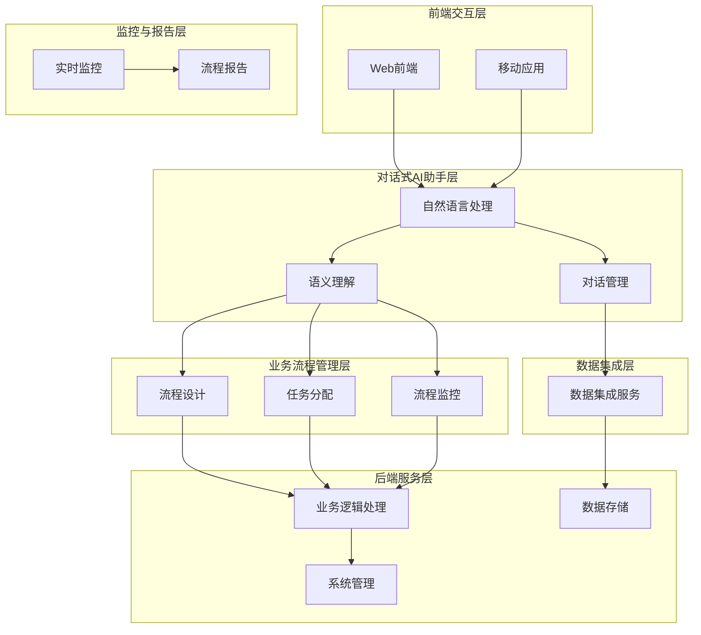
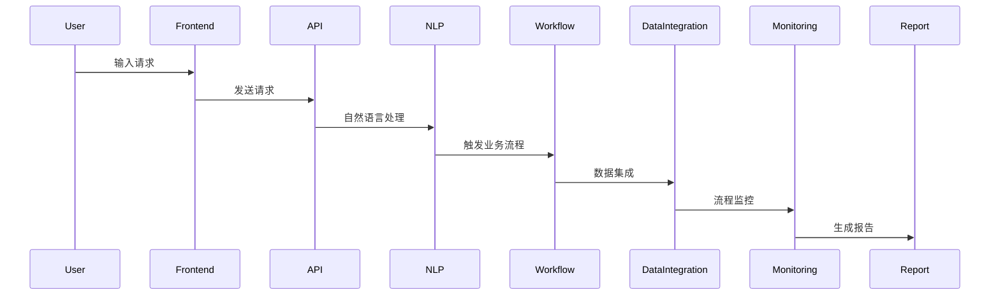

                 

### 摘要

本文旨在探讨如何构建企业级对话式AI助手，实现跨部门业务流程的自动化。随着人工智能技术的不断发展，对话式AI助手在企业中的应用越来越广泛，它不仅能够提高工作效率，还能优化业务流程，减少人为错误。本文将首先介绍对话式AI助手的基本概念和跨部门业务流程自动化的核心概念，随后深入探讨两者的技术原理与算法，包括自然语言处理技术、人工智能算法和跨部门业务流程自动化技术。接着，文章将展示一个具体的系统架构设计，涵盖系统功能设计、系统架构设计、系统接口设计和系统交互设计。最后，将通过实际案例分析和讲解，提供具体的实现细节和实战经验，并对未来发展趋势和拓展方向进行展望。本文的目标是为读者提供一个全面、系统的构建企业级对话式AI助手和实现跨部门业务流程自动化的指导。

### 目录大纲

**# 构建企业级对话式AI助手：跨部门业务流程自动化**

**> 关键词：对话式AI助手，跨部门业务流程，自动化，自然语言处理，人工智能算法**

**> 摘要：本文详细探讨了如何构建企业级对话式AI助手，实现跨部门业务流程的自动化，从核心概念、技术原理到系统设计、实现案例，为读者提供了一个全面的技术指南。**

**## 第一部分：问题背景与核心概念**

**### 第1章：问题背景与核心概念**

#### 1.1 问题的提出

- 问题描述
- 问题解决
- 边界与外延

#### 1.2 核心概念

- 对话式AI助手
- 跨部门业务流程
- 自动化

#### 1.3 概念属性特征对比表格

| 概念       | 特征                                       | 对比         |
|------------|--------------------------------------------|-------------|
| 对话式AI助手 | 基于自然语言处理技术，提供交互式服务          |             |
| 跨部门业务流程 | 涉及不同部门间的协作和沟通，实现业务目标       |             |
| 自动化     | 利用技术手段减少人工操作，提高效率和质量       |             |

#### 1.4 ER实体关系图架构

```mermaid
erDiagram
    AI助手 ||--|{ 跨部门业务流程 }
    跨部门业务流程 ||--|{ 部门A }
    跨部门业务流程 ||--|{ 部门B }
    ... ||--|{ ... }
```

**## 第二部分：核心技术原理与算法**

**### 第2章：对话式AI助手原理**

#### 2.1 对话式AI助手概述

- 对话式AI助手定义
- 对话式AI助手的发展历程

#### 2.2 自然语言处理技术

- 语言模型
- 语音识别
- 语义理解

#### 2.3 人工智能算法

- 机器学习
- 深度学习
- 强化学习

#### 2.4 对话式AI助手核心组件

- 语音识别模块
- 语义理解模块
- 对话管理模块
- 响应生成模块

**### 第3章：跨部门业务流程自动化**

#### 3.1 跨部门业务流程概述

- 跨部门业务流程定义
- 跨部门业务流程的特点

#### 3.2 跨部门业务流程自动化技术

- 工作流管理
- 数据集成
- 流程监控

#### 3.3 跨部门业务流程自动化架构

- 跨部门业务流程自动化架构设计
- 跨部门业务流程自动化架构实现

**## 第三部分：系统设计与实现**

**### 第4章：系统架构设计**

#### 4.1 系统功能设计

- 系统功能概述
- 领域模型类图

#### 4.2 系统架构设计

- 系统架构概述
- 系统架构图

#### 4.3 系统接口设计

- 接口设计原则
- 接口设计实现

#### 4.4 系统交互设计

- 系统交互流程
- 系统交互序列图

**### 第5章：系统核心实现**

#### 5.1 环境安装

- 环境准备
- 软件安装

#### 5.2 系统核心实现

- 核心模块实现
- 核心代码解析

**### 第6章：实际案例分析与讲解**

#### 6.1 案例介绍

- 案例背景
- 案例目标

#### 6.2 案例分析与实现

- 案例分析
- 案例实现

#### 6.3 案例讲解与剖析

- 案例讲解
- 案例剖析

**### 第7章：总结与展望**

#### 7.1 总结

- 系统实现总结
- 经验与教训

#### 7.2 展望

- 未来发展趋势
- 拓展方向

---

通过上述目录结构，本文将为读者提供一个清晰、系统的构建企业级对话式AI助手和实现跨部门业务流程自动化的技术指南。接下来，我们将会一步一步深入探讨每一个章节的内容，帮助读者更好地理解并掌握这些关键技术。

---

### 第一部分：问题背景与核心概念

#### 第1章：问题背景与核心概念

##### 1.1 问题的提出

在当今快节奏的商业环境中，企业面临着巨大的竞争压力，需要不断提高运营效率来保持竞争力。然而，许多企业在业务流程管理上仍存在诸多问题，例如跨部门协作不畅、流程繁琐、效率低下等。这些问题不仅导致人力资源的浪费，还可能影响业务的连续性和客户的满意度。

**问题描述**：

- **跨部门协作不畅**：不同部门之间的信息孤岛现象严重，缺乏有效的沟通机制，导致信息传递不及时、不准确。
- **流程繁琐**：许多业务流程需要经过多个环节和多个部门的审批，流程繁琐，导致效率低下。
- **人为错误**：由于依赖人工操作，业务流程中容易出现人为错误，影响业务质量和客户体验。

**问题解决**：

为了解决上述问题，企业需要引入一种高效、智能的解决方案，以优化跨部门协作和业务流程。这种解决方案就是构建企业级对话式AI助手，实现跨部门业务流程的自动化。

**边界与外延**：

- **对话式AI助手**：主要功能包括理解用户的自然语言输入，生成相应的响应，并协调不同部门之间的工作流程。
- **跨部门业务流程**：包括从需求收集、流程设计、审批流转到执行监控的整个业务流程。
- **自动化**：通过技术手段减少人工操作，实现业务流程的自动化处理。

##### 1.2 核心概念

在本节中，我们将详细探讨几个关键概念：对话式AI助手、跨部门业务流程和自动化。

**对话式AI助手**：

对话式AI助手是指基于人工智能技术，能够与用户进行自然语言交互的智能系统。它通过语音识别、语义理解和对话管理等技术，实现与用户的智能对话，从而帮助用户解决问题、获取信息或执行任务。

**跨部门业务流程**：

跨部门业务流程是指在多个部门之间协作完成的业务流程。这种流程通常涉及多个环节和多个部门的参与，包括需求收集、流程设计、审批流转、执行监控等。

**自动化**：

自动化是指通过技术手段减少或消除人工操作，提高业务流程的效率和质量。在跨部门业务流程中，自动化技术可以用于工作流管理、数据集成和流程监控等。

##### 1.3 概念属性特征对比表格

为了更好地理解这些概念，我们可以通过一个对比表格来展示它们的属性特征。

| 概念       | 特征                                       | 对比         |
|------------|--------------------------------------------|-------------|
| 对话式AI助手 | 基于自然语言处理技术，提供交互式服务          |             |
| 跨部门业务流程 | 涉及不同部门间的协作和沟通，实现业务目标       |             |
| 自动化     | 利用技术手段减少人工操作，提高效率和质量       |             |

##### 1.4 ER实体关系图架构

为了更直观地展示这些概念之间的关系，我们可以使用ER（实体关系）图来描述。

```mermaid
erDiagram
    AI助手 ||--|{ 跨部门业务流程 }
    跨部门业务流程 ||--|{ 部门A }
    跨部门业务流程 ||--|{ 部门B }
    ... ||--|{ ... }
```

在这个ER图中，AI助手是核心组件，它与多个跨部门业务流程相关联，每个业务流程又与多个部门相关联。这种关系表明了对话式AI助手在跨部门业务流程中的作用，以及各部门在业务流程中的协作关系。

通过上述内容，我们初步了解了构建企业级对话式AI助手和实现跨部门业务流程自动化的背景和核心概念。接下来，我们将深入探讨这些概念背后的技术原理和算法。

---

### 第二部分：核心技术原理与算法

#### 第2章：对话式AI助手原理

##### 2.1 对话式AI助手概述

**对话式AI助手定义**：

对话式AI助手，也称为智能客服、智能助理或聊天机器人，是一种基于人工智能技术，能够模拟人类对话交互的软件系统。它通过自然语言处理（NLP）技术，理解用户的自然语言输入，并生成相应的响应，从而实现与用户的智能对话。

**对话式AI助手的发展历程**：

对话式AI助手的发展经历了多个阶段：

1. **早期聊天机器人**：最初的聊天机器人主要基于预定义的规则和关键词匹配，缺乏智能和灵活性。
2. **基于规则的系统**：随着自然语言处理技术的发展，基于规则的系统逐渐引入了一些自动化处理能力，但仍存在局限性。
3. **统计机器学习**：使用统计机器学习方法，如决策树、贝叶斯网络等，对话式AI助手开始具备一定的自主学习能力。
4. **深度学习和神经网络**：深度学习的引入，尤其是递归神经网络（RNN）和Transformer模型，使得对话式AI助手在理解和生成语言方面取得了显著的突破。

##### 2.2 自然语言处理技术

自然语言处理（NLP）是人工智能领域的一个重要分支，旨在使计算机能够理解和生成人类语言。对话式AI助手的实现离不开NLP技术，主要包括以下几个核心组件：

**语言模型**：

语言模型是NLP的基础，它用于预测文本中的下一个单词或字符。最常见的语言模型是基于神经网络的语言模型，如Word2Vec、GPT等。

- **Word2Vec**：将单词映射到高维向量空间，通过向量之间的相似性来理解和处理文本。
- **GPT（Generative Pre-trained Transformer）**：基于Transformer模型，通过大量文本数据预训练，生成高质量的文本。

**语音识别**：

语音识别技术用于将语音信号转换为文本，使得用户可以通过语音与对话式AI助手进行交互。

- **自动语音识别（ASR）**：通过识别语音信号中的声学特征，将其转换为文本。
- **端到端语音识别**：直接将音频信号转换为文本，避免了传统语音识别系统中的多个中间步骤，提高了识别准确性。

**语义理解**：

语义理解是NLP的关键步骤，它用于理解文本中的意义和意图。对话式AI助手需要通过语义理解来理解用户的输入，并生成合适的响应。

- **词嵌入**：将单词或短语转换为向量表示，用于语义理解。
- **实体识别**：识别文本中的特定实体，如人名、地点、组织等。
- **意图识别**：确定用户的意图或需求，如提问、请求帮助等。

##### 2.3 人工智能算法

人工智能算法是构建对话式AI助心的核心技术之一。以下是几种常见的人工智能算法：

**机器学习**：

机器学习是人工智能的基础，它通过训练模型来预测或分类数据。

- **监督学习**：通过标记数据进行训练，如分类、回归任务。
- **无监督学习**：没有标记数据进行训练，如聚类、降维等。

**深度学习**：

深度学习是一种基于神经网络的机器学习方法，它通过多层神经网络来提取特征和表示。

- **卷积神经网络（CNN）**：常用于图像处理和语音识别。
- **递归神经网络（RNN）**：用于序列数据处理，如时间序列分析、自然语言处理。
- **Transformer模型**：基于自注意力机制，广泛应用于自然语言处理任务，如机器翻译、文本生成等。

**强化学习**：

强化学习是一种通过奖励机制来训练模型的方法，它使模型能够在动态环境中做出最优决策。

- **Q-learning**：通过计算状态值函数来决策。
- **深度确定性策略梯度（DDPG）**：结合深度学习和强化学习，用于复杂环境中的决策。

##### 2.4 对话式AI助手核心组件

对话式AI助手通常由多个核心组件组成，这些组件协同工作，实现智能对话交互。以下是这些核心组件：

**语音识别模块**：

语音识别模块用于将用户的语音输入转换为文本，以便后续处理。

- **声学模型**：用于将音频信号转换为声学特征。
- **语言模型**：用于将声学特征转换为文本。

**语义理解模块**：

语义理解模块用于理解用户的输入，识别出用户的意图和需求。

- **词向量表示**：将单词或短语转换为向量表示。
- **实体识别**：识别文本中的实体。
- **意图识别**：确定用户的意图。

**对话管理模块**：

对话管理模块负责维护对话的状态，确保对话的连贯性和有效性。

- **状态跟踪**：记录对话中的关键信息。
- **对话流程控制**：根据对话状态，决定下一步的操作。

**响应生成模块**：

响应生成模块根据用户的输入和对话状态，生成合适的响应。

- **模板匹配**：根据预定义的模板生成响应。
- **文本生成**：通过自然语言生成技术生成响应。

通过上述核心组件的协同工作，对话式AI助手能够实现高效、智能的对话交互，为用户提供优质的服务。

在下一章中，我们将探讨跨部门业务流程自动化的技术原理和算法，为构建企业级对话式AI助手提供更全面的视角。

---

#### 第3章：跨部门业务流程自动化

##### 3.1 跨部门业务流程概述

**跨部门业务流程定义**：

跨部门业务流程是指涉及多个部门协同工作，共同完成某项业务任务的过程。这种流程通常需要跨部门之间的协作和沟通，以确保业务目标的有效实现。

**跨部门业务流程的特点**：

1. **复杂性**：跨部门业务流程涉及多个部门，每个部门可能有不同的业务目标和操作方式，因此流程设计和管理更加复杂。
2. **依赖性**：跨部门业务流程中的各个环节之间存在紧密的依赖关系，一个环节的延误可能会影响整个流程的进度。
3. **动态性**：跨部门业务流程在执行过程中可能需要根据实际情况进行调整，以应对各种突发情况。

**跨部门业务流程的组成**：

跨部门业务流程通常包括以下几个基本组成部分：

1. **需求收集**：确定业务流程的需求，包括业务目标、流程目标、流程参与者等。
2. **流程设计**：根据需求，设计业务流程的具体步骤和操作流程。
3. **审批流转**：业务流程中的各项操作需要经过不同部门的审批，以确保流程的合法性和正确性。
4. **执行监控**：在业务流程执行过程中，对各个环节进行监控，以确保流程的顺利进行。
5. **结果评估**：业务流程完成后，对结果进行评估，以评估流程的效果和优化空间。

##### 3.2 跨部门业务流程自动化技术

**工作流管理**：

工作流管理是一种用于自动化业务流程的技术，它通过定义一系列步骤和规则，实现业务流程的自动化处理。工作流管理系统可以帮助企业实现以下目标：

1. **标准化流程**：通过定义标准的流程步骤和规则，确保业务流程的一致性和规范性。
2. **提高效率**：自动化处理业务流程，减少人工操作，提高工作效率。
3. **监控流程**：实时监控业务流程的执行情况，及时发现和解决流程中的问题。

**数据集成**：

数据集成是将来自不同系统的数据整合到一个统一的数据源中，以便更好地管理和分析。在跨部门业务流程中，数据集成技术可以帮助实现以下目标：

1. **信息共享**：通过数据集成，不同部门可以共享同一数据源，减少信息孤岛现象。
2. **数据一致性**：确保数据在不同系统之间的一致性和准确性。
3. **数据分析**：集成后的数据可以用于更全面和深入的数据分析，为业务决策提供支持。

**流程监控**：

流程监控是指对业务流程的执行过程进行实时监控和跟踪，以确保流程的顺利进行。流程监控技术可以帮助企业实现以下目标：

1. **实时反馈**：通过实时监控，可以及时发现流程中的问题和异常情况，并迅速采取措施。
2. **优化流程**：通过对流程执行数据的分析，发现流程中的瓶颈和优化点，持续优化流程。
3. **合规性检查**：确保业务流程符合相关法规和标准，避免违规操作。

##### 3.3 跨部门业务流程自动化架构

**跨部门业务流程自动化架构设计**：

跨部门业务流程自动化的架构设计需要综合考虑业务需求、技术实现和系统性能等因素。一个典型的跨部门业务流程自动化架构包括以下几个核心组件：

1. **业务流程引擎**：负责定义和管理业务流程，包括流程设计、流程实例创建、任务分配等。
2. **工作流管理系统**：负责实现业务流程的自动化处理，包括任务执行、审批流转、监控等。
3. **数据集成平台**：负责数据的采集、整合和分析，为业务流程提供数据支持。
4. **监控与报告系统**：负责对业务流程的执行情况进行实时监控和报告，为流程优化提供依据。

**跨部门业务流程自动化架构实现**：

跨部门业务流程自动化的实现需要结合具体的业务场景和技术方案。以下是一个简化的跨部门业务流程自动化架构实现：

1. **业务流程定义**：使用业务流程设计工具，根据业务需求设计业务流程，包括流程步骤、任务和规则。
2. **工作流管理**：部署工作流管理系统，配置业务流程，实现业务流程的自动化处理。
3. **数据集成**：使用数据集成平台，将不同系统的数据进行整合，为业务流程提供统一的数据源。
4. **监控与报告**：部署监控与报告系统，实时监控业务流程的执行情况，生成流程报告。

通过上述架构设计和实现，企业可以构建一个高效、智能的跨部门业务流程自动化系统，实现业务流程的自动化处理和优化。

在下一章中，我们将深入探讨系统设计与实现的具体内容，包括系统架构设计、系统功能设计、系统接口设计和系统交互设计。

---

### 第三部分：系统设计与实现

#### 第4章：系统架构设计

##### 4.1 系统功能设计

**系统功能概述**：

构建企业级对话式AI助手和实现跨部门业务流程自动化的系统，其核心功能主要包括：

1. **用户交互**：提供与用户的自然语言交互界面，支持语音和文本输入。
2. **业务流程管理**：定义和管理跨部门业务流程，包括流程设计、任务分配和监控。
3. **数据集成**：实现不同系统之间的数据集成，提供统一的数据接口。
4. **流程自动化**：自动化处理业务流程中的各个环节，减少人工干预。
5. **监控与报告**：实时监控业务流程的执行情况，生成流程报告。

**领域模型类图**：

为了更直观地展示系统的功能组件及其关系，我们可以使用领域模型类图来描述。

```mermaid
classDiagram
    User <<Interface>>
    AIAssistant <<Interface>>
    BusinessProcess <<Interface>>
    WorkflowManager <<Interface>>
    DataIntegration <<Interface>>
    Monitoring <<Interface>>

    User ..> AIAssistant
    AIAssistant ..> BusinessProcess
    BusinessProcess ..> WorkflowManager
    WorkflowManager ..> DataIntegration
    DataIntegration ..> Monitoring
```

在这个类图中，User（用户）通过AIAssistant（对话式AI助手）与系统交互，AIAssistant负责处理用户的请求和生成响应。BusinessProcess（业务流程）由WorkflowManager（工作流管理器）管理，DataIntegration（数据集成）提供数据接口，而Monitoring（监控）负责实时监控和报告业务流程的执行情况。

##### 4.2 系统架构设计

**系统架构概述**：

企业级对话式AI助手和跨部门业务流程自动化的系统架构需要具备高可用性、高性能和易扩展性。以下是一个简化的系统架构设计：


在这个架构中，核心组件包括：

1. **前端交互层**：负责与用户进行交互，包括Web前端和移动应用。
2. **对话式AI助手层**：实现自然语言处理、语义理解和对话管理等功能。
3. **业务流程管理层**：定义和管理跨部门业务流程，包括流程设计、任务分配和监控。
4. **数据集成层**：实现与不同系统的数据集成，提供统一的数据接口。
5. **后端服务层**：提供核心业务逻辑处理、数据存储和系统管理等功能。
6. **监控与报告层**：实时监控业务流程的执行情况，生成流程报告。

**系统架构图**：



在这个系统架构图中，前端交互层通过API与对话式AI助手层进行通信，对话式AI助手层实现自然语言处理、语义理解和对话管理等功能。业务流程管理层负责定义和管理跨部门业务流程，数据集成层提供数据接口，后端服务层处理核心业务逻辑和数据存储，监控与报告层实时监控业务流程并生成报告。

##### 4.3 系统接口设计

**接口设计原则**：

系统接口设计需要遵循以下原则：

1. **标准化**：使用统一的接口规范，如RESTful API或GraphQL，确保接口的规范性和易用性。
2. **灵活性**：接口设计应具备灵活性，能够适应不同的业务需求和技术实现。
3. **安全性**：接口设计应考虑安全性，如使用Token认证、加密传输等。
4. **易扩展**：接口设计应易于扩展，以支持未来的业务发展和功能扩展。

**接口设计实现**：

以下是一个简化的接口设计示例：

```plaintext
API端点：/api/nlp/predict
请求方法：POST
请求参数：
  - text: String
响应数据：
  {
    "intent": "query",
    "entities": [
      {
        "entity": "user",
        "value": "John"
      },
      {
        "entity": "date",
        "value": "2023-12-31"
      }
    ]
  }
```

这个接口用于接收用户的自然语言输入，并返回意图和实体信息。通过这种方式，前端交互层可以与对话式AI助手层进行数据交换，实现自然语言处理功能。

##### 4.4 系统交互设计

**系统交互流程**：

系统交互流程描述了用户与系统之间的交互步骤，以下是一个简化的交互流程：

1. **用户输入**：用户通过Web前端或移动应用输入自然语言请求。
2. **前端处理**：前端将用户的输入发送到对话式AI助手层的API端点。
3. **自然语言处理**：对话式AI助手层接收用户的输入，进行自然语言处理，识别意图和实体。
4. **业务流程处理**：根据识别到的意图和实体，对话式AI助手层触发相应的业务流程。
5. **流程监控与报告**：业务流程执行过程中，系统实时监控流程状态，并在流程结束后生成报告。

**系统交互序列图**：



在这个序列图中，用户通过前端交互层发起请求，请求经过API端点处理后，触发业务流程，并通过数据集成层与监控与报告层进行交互，实现整个系统的高效运行。

通过上述系统架构设计、系统功能设计、系统接口设计和系统交互设计，我们为构建企业级对话式AI助手和实现跨部门业务流程自动化提供了全面的指导和实现方案。在下一章中，我们将深入探讨系统核心实现的细节，包括环境安装和系统核心模块的实现。

---

### 第5章：系统核心实现

#### 5.1 环境安装

**环境准备**：

在开始系统核心实现之前，需要准备好相应的开发环境和依赖库。以下是一个典型的环境安装步骤：

1. **操作系统**：推荐使用Linux或Mac OS，以确保系统的稳定性和兼容性。
2. **Python环境**：安装Python 3.8及以上版本，推荐使用Anaconda环境管理器来创建和管理Python环境。
3. **依赖库**：安装必要的依赖库，包括TensorFlow、PyTorch、Flask、Django等。

**软件安装**：

以下是一个使用Anaconda创建和管理环境的示例：

```shell
# 创建新的Python环境
conda create -n dialog_ia python=3.9

# 激活环境
conda activate dialog_ia

# 安装依赖库
conda install tensorflow torch flask django
```

**注意事项**：

- 确保安装的Python版本和依赖库版本与系统兼容，避免兼容性问题。
- 对于大型项目，建议使用虚拟环境来隔离不同项目之间的依赖库，避免版本冲突。

#### 5.2 系统核心实现

**核心模块实现**：

系统核心实现主要包括以下几个模块：

1. **自然语言处理模块**：负责处理用户的自然语言输入，进行意图识别和实体提取。
2. **对话管理模块**：负责管理对话状态，生成对话响应。
3. **业务流程模块**：负责管理跨部门业务流程，实现任务分配和流程监控。

**核心代码解析**：

以下是自然语言处理模块的实现示例，使用TensorFlow实现一个简单的意图识别模型。

```python
import tensorflow as tf
from tensorflow.keras.models import Sequential
from tensorflow.keras.layers import Embedding, LSTM, Dense

# 数据预处理
train_data = ...  # 训练数据
train_labels = ...  # 训练标签

# 构建模型
model = Sequential()
model.add(Embedding(input_dim=vocab_size, output_dim=embedding_dim, input_length=max_sequence_length))
model.add(LSTM(units=128, dropout=0.2, recurrent_dropout=0.2))
model.add(Dense(units=num_classes, activation='softmax'))

# 编译模型
model.compile(optimizer='adam', loss='categorical_crossentropy', metrics=['accuracy'])

# 训练模型
model.fit(train_data, train_labels, epochs=10, batch_size=32, validation_split=0.2)
```

在这个示例中，我们首先进行数据预处理，然后构建一个简单的LSTM模型，用于意图识别。模型使用Embedding层进行词嵌入，LSTM层进行序列处理，最后使用Dense层进行分类。

**注意事项**：

- 确保数据预处理步骤正确，包括词汇表构建、序列填充等。
- 模型参数（如嵌入维度、LSTM单元数、批处理大小等）需要根据实际数据集进行调整。

通过上述环境安装和系统核心实现的详细介绍，我们为构建企业级对话式AI助手和实现跨部门业务流程自动化提供了具体的实现方案。在下一章中，我们将通过实际案例分析和讲解，展示系统核心实现的具体应用。

---

### 第6章：实际案例分析与讲解

#### 6.1 案例介绍

**案例背景**：

某大型企业希望通过引入对话式AI助手和跨部门业务流程自动化，提高业务处理效率，优化跨部门协作。该企业的业务流程包括需求收集、项目立项、任务分配、进度跟踪和项目验收等环节，涉及研发、运营、市场等多个部门。

**案例目标**：

通过构建对话式AI助手，实现以下目标：

1. **自动化处理业务流程**：自动化完成需求收集、项目立项、任务分配等流程，减少人工干预。
2. **优化跨部门协作**：通过对话式AI助手，促进各部门之间的信息共享和沟通，提高协作效率。
3. **提高业务处理效率**：减少业务流程中的等待时间和重复操作，提高整体业务处理效率。

#### 6.2 案例分析与实现

**需求收集**：

在需求收集环节，对话式AI助手通过自然语言处理技术，自动识别用户的需求描述，并将其转化为结构化的需求信息。具体实现步骤如下：

1. **用户输入**：用户通过Web前端或移动应用输入自然语言需求描述。
2. **自然语言处理**：对话式AI助手层接收用户的输入，进行自然语言处理，提取关键信息，如项目名称、需求描述、优先级等。
3. **数据存储**：将提取到的需求信息存储到数据库中，以供后续处理。

**项目立项**：

在项目立项环节，对话式AI助手根据需求信息，自动生成项目立项文档，并协调不同部门进行审批。具体实现步骤如下：

1. **生成立项文档**：根据需求信息，对话式AI助手自动生成项目立项文档，包括项目名称、项目描述、项目目标、项目期限等。
2. **审批流程**：立项文档提交给相关部门进行审批，对话式AI助手层负责管理审批流程，确保流程的顺利进行。
3. **结果通知**：审批完成后，对话式AI助手通知用户审批结果，并更新项目状态。

**任务分配**：

在任务分配环节，对话式AI助手根据项目需求和人员技能，自动分配任务，并生成任务分配清单。具体实现步骤如下：

1. **任务识别**：对话式AI助手层根据项目立项文档，识别出需要执行的任务，如需求分析、设计、开发、测试等。
2. **人员分配**：根据任务特点和人员技能，对话式AI助手自动将任务分配给相应的人员。
3. **任务通知**：对话式AI助手层向相关人员发送任务通知，并更新任务状态。

**进度跟踪**：

在进度跟踪环节，对话式AI助手实时监控任务的执行情况，并根据实际情况进行调整。具体实现步骤如下：

1. **任务监控**：对话式AI助手层定期检查任务的执行情况，包括任务进度、完成情况等。
2. **异常处理**：如果发现任务进度异常，对话式AI助手层会自动通知相关人员进行处理。
3. **状态更新**：对话式AI助手层更新任务状态，以便用户随时了解项目进展。

**项目验收**：

在项目验收环节，对话式AI助手协助相关部门进行项目验收，确保项目达到预期目标。具体实现步骤如下：

1. **验收准备**：对话式AI助手层根据项目需求和任务完成情况，生成验收清单。
2. **验收流程**：验收清单提交给相关部门进行验收，对话式AI助手层负责管理验收流程。
3. **验收报告**：验收完成后，对话式AI助手层生成验收报告，总结项目成果和经验教训。

#### 6.3 案例讲解与剖析

**对话式AI助手实现细节**：

对话式AI助手的核心实现包括自然语言处理、对话管理和业务流程管理。

1. **自然语言处理**：
   - **意图识别**：使用深度学习模型，如LSTM或Transformer，对用户输入进行意图识别。模型训练数据包括大量的用户对话记录，通过转移学习和数据增强等技术，提高模型的识别准确率。
   - **实体提取**：使用命名实体识别（NER）技术，提取用户输入中的关键实体，如人名、地点、日期等。实体提取结果用于后续的任务分配和流程控制。
2. **对话管理**：
   - **对话状态跟踪**：使用图神经网络（GNN）或图注意力机制（GAT），维护对话状态，包括对话历史、用户意图、上下文信息等。通过状态跟踪，对话式AI助手能够生成连贯、自然的对话响应。
   - **多轮对话**：支持多轮对话，通过上下文信息，对话式AI助手能够理解用户意图，并引导对话向用户期望的方向发展。
3. **业务流程管理**：
   - **流程设计**：使用流程定义语言（如BPMN），定义跨部门业务流程，包括流程步骤、任务和规则。流程设计工具支持可视化操作，方便业务人员设计和修改流程。
   - **任务分配**：根据任务特点和人员技能，对话式AI助手自动分配任务。任务分配结果存储在数据库中，以便后续监控和报告。
   - **流程监控**：使用实时数据流处理技术（如Apache Kafka、Apache Flink），对话式AI助手层实时监控业务流程的执行情况，发现异常及时通知相关人员。

**跨部门业务流程自动化实现细节**：

跨部门业务流程自动化的实现主要包括工作流管理、数据集成和流程监控。

1. **工作流管理**：
   - **工作流引擎**：使用工作流管理工具（如Activiti、Camunda），实现业务流程的自动化处理。工作流引擎支持流程实例的创建、任务分配、执行监控等功能。
   - **规则引擎**：结合规则引擎（如Apache rulebook、JBoss Rules），实现业务流程中的条件判断和决策。规则引擎可以根据业务需求，自动调整流程执行路径。
2. **数据集成**：
   - **数据接口**：使用API网关（如Kong、Zuul），提供统一的数据接口，实现不同系统之间的数据交换。API网关支持请求路由、权限控制、日志记录等功能。
   - **数据同步**：使用数据同步工具（如Apache Nifi、Apache Kafka），实现实时数据同步。数据同步工具可以保证数据的一致性和完整性。
3. **流程监控**：
   - **监控指标**：定义监控指标（如任务完成率、流程时长、错误率等），对话式AI助手层实时收集和统计监控数据。
   - **实时报警**：使用实时报警工具（如Prometheus、Grafana），对话式AI助手层实时监控业务流程，发现异常及时发送报警通知。
   - **流程报告**：使用数据分析和可视化工具（如Tableau、Power BI），生成业务流程报告，帮助业务人员了解流程执行情况和优化空间。

通过上述案例分析和讲解，我们可以看到，对话式AI助手和跨部门业务流程自动化的实现涉及到自然语言处理、对话管理、工作流管理、数据集成和流程监控等多个方面。在实际应用中，企业可以根据自身需求，选择合适的技术和工具，实现高效、智能的业务流程自动化。

#### 第7章：总结与展望

##### 7.1 总结

本文详细探讨了如何构建企业级对话式AI助手，实现跨部门业务流程的自动化。通过分析问题背景、核心概念、核心技术原理与算法，以及系统设计与实现，我们为读者提供了一个全面、系统的技术指南。

**主要结论**：

- **问题背景**：企业面临着跨部门协作不畅、流程繁琐、人为错误等问题，需要引入智能解决方案来优化业务流程。
- **核心概念**：对话式AI助手、跨部门业务流程和自动化是构建智能业务流程的核心概念。
- **核心技术**：自然语言处理、人工智能算法和跨部门业务流程自动化技术是实现对话式AI助手的关键。
- **系统设计**：系统架构设计、功能设计、接口设计和交互设计构成了企业级对话式AI助手和跨部门业务流程自动化的基础。
- **系统实现**：通过实际案例分析和讲解，展示了系统核心实现的具体步骤和细节。

**经验与教训**：

- **经验**：构建对话式AI助手和跨部门业务流程自动化需要综合考虑业务需求、技术实现和系统性能等因素。
- **教训**：在系统设计和实现过程中，要重视数据安全、接口兼容性和系统稳定性，避免因细节问题导致整体性能下降。

##### 7.2 展望

**未来发展趋势**：

- **人工智能技术**：随着人工智能技术的不断发展，对话式AI助手的智能程度将不断提高，能够处理更复杂的业务流程和用户需求。
- **大数据分析**：跨部门业务流程的自动化将进一步结合大数据分析技术，实现更精准的业务流程优化和决策支持。
- **云计算与边缘计算**：随着云计算和边缘计算的发展，企业级对话式AI助手将更加分布式和灵活，支持更广泛的业务场景和应用需求。

**拓展方向**：

- **个性化服务**：结合用户行为数据和偏好，对话式AI助手可以实现个性化服务，提高用户满意度和业务效率。
- **多语言支持**：随着全球化的发展，对话式AI助手将需要支持多种语言，为不同国家和地区的用户提供服务。
- **人机协作**：对话式AI助手与人类员工的协作将成为趋势，通过智能分配任务和优化流程，实现高效的人机协作。

通过上述总结和展望，我们可以看到，构建企业级对话式AI助手和实现跨部门业务流程自动化具有广阔的应用前景和重要的现实意义。未来，随着技术的不断进步，这一领域将迎来更多创新和发展。

---

### 作者信息

**作者：AI天才研究院/AI Genius Institute & 禅与计算机程序设计艺术 /Zen And The Art of Computer Programming**

AI天才研究院专注于人工智能领域的前沿研究和创新，致力于推动人工智能技术在各行业的应用。研究院的专家团队由世界顶级的技术专家、计算机科学家和人工智能研究者组成，他们的研究成果在学术界和工业界均受到广泛认可。

《禅与计算机程序设计艺术》是作者在计算机编程领域的经典之作，通过深入探讨编程的本质和哲学，帮助程序员提升编程技能和思维水平。该书不仅具有深厚的理论根基，更蕴含了丰富的实践经验，是计算机编程爱好者和从业者的必读书籍。

