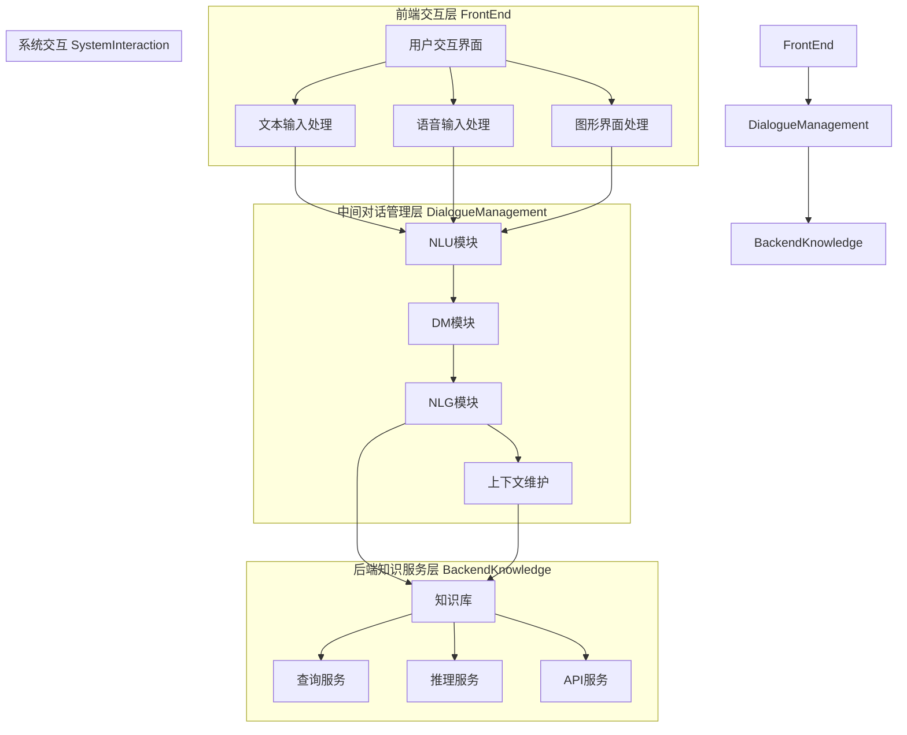
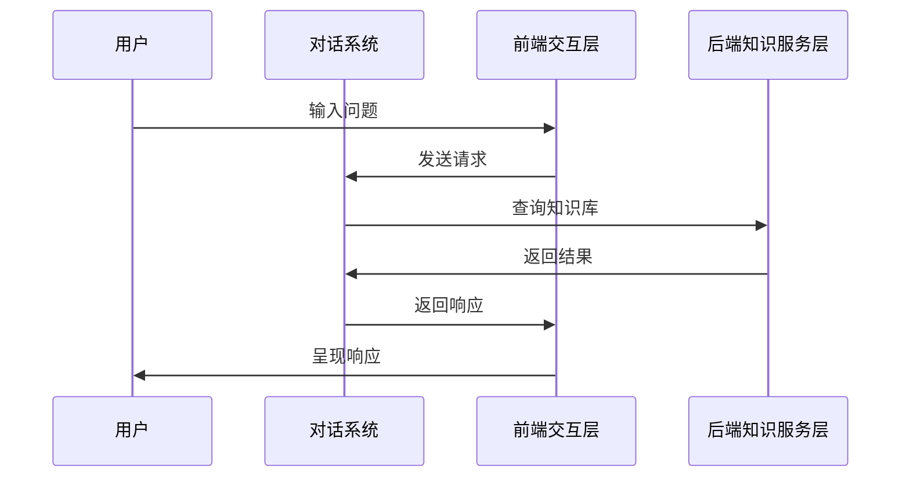

                 


### 第3章：对话系统的核心组成

#### 3.1 自然语言理解（NLU）

自然语言理解（NLU）是对话系统的核心组成部分之一，负责解析用户的自然语言输入，提取出语义信息。NLU的过程可以分为三个主要步骤：分词、句法分析和语义解析。

- **分词**：将连续的文本分割成一个个词或短语，这是自然语言处理的基础。

- **句法分析**：分析句子的结构，识别句子中的词与词之间的关系，如主谓宾关系、从句等。

- **语义解析**：从句子的结构中提取出语义信息，理解用户的意图。

NLU的关键技术包括：

- **词性标注**：对句子中的每个词进行词性标注，如名词、动词等。

- **实体识别**：识别句子中的实体，如人名、地名、组织名等。

- **意图识别**：根据用户的输入，识别用户的意图，如查询信息、提出请求等。

以下是NLU的核心概念属性特征对比表格：

| 特征       | 说明                                                         |
| ---------- | ------------------------------------------------------------ |
| 分词       | 将文本分割成词或短语                                         |
| 句法分析   | 分析句子结构，识别词与词的关系                               |
| 语义解析   | 提取语义信息，理解用户意图                                   |
| 词性标注   | 对句子中的每个词进行词性标注                                 |
| 实体识别   | 识别句子中的实体                                           |
| 意图识别   | 识别用户的意图，如查询信息、提出请求等                       |

#### 3.2 对话管理（DM）

对话管理（DM）是对话系统的“大脑”，负责协调和指导对话流程，确保对话能够顺利进行。DM的核心任务是在对话过程中保持上下文一致性，并根据用户的输入做出适当的响应。

DM的工作流程通常包括以下几个步骤：

- **意图识别**：识别用户的意图。

- **上下文维护**：维护对话上下文，记录用户的历史交互信息。

- **生成响应**：根据用户的意图和上下文信息，生成合适的响应。

- **对话流程控制**：控制对话的流程，如转向特定话题、结束对话等。

DM的关键技术包括：

- **上下文表示**：将上下文信息以结构化的形式进行表示，如使用向量、图等。

- **状态转移图**：定义对话的状态转移规则，如当前状态、下一个状态等。

- **生成模型**：使用生成模型，如序列到序列模型（Seq2Seq）、变换器模型（Transformer）等，生成对话响应。

以下是DM的核心概念属性特征对比表格：

| 特征       | 说明                                                         |
| ---------- | ------------------------------------------------------------ |
| 意图识别   | 识别用户的意图                                             |
| 上下文维护 | 维护对话上下文，记录用户的历史交互信息                       |
| 响应生成   | 根据用户的意图和上下文信息，生成合适的响应                   |
| 对话流程控制 | 控制对话的流程，如转向特定话题、结束对话等                   |
| 上下文表示 | 将上下文信息以结构化的形式进行表示，如使用向量、图等         |
| 状态转移图 | 定义对话的状态转移规则，如当前状态、下一个状态等             |

#### 3.3 自然语言生成（NLG）

自然语言生成（NLG）是对话系统的“语言表达器官”，负责将对话管理生成的语义信息转换成自然语言文本。NLG的关键技术包括模板匹配、规则驱动和生成模型。

- **模板匹配**：根据对话管理生成的语义信息，从预定义的模板中选择合适的模板生成文本。

- **规则驱动**：基于一系列规则，将语义信息转换成自然语言文本。

- **生成模型**：使用生成模型，如循环神经网络（RNN）、变换器模型（Transformer）等，自动生成自然语言文本。

以下是NLG的核心概念属性特征对比表格：

| 特征       | 说明                                                         |
| ---------- | ------------------------------------------------------------ |
| 模板匹配   | 根据对话管理生成的语义信息，从预定义的模板中选择合适的模板生成文本 |
| 规则驱动   | 基于一系列规则，将语义信息转换成自然语言文本                 |
| 生成模型   | 使用生成模型，如循环神经网络（RNN）、变换器模型（Transformer）等，自动生成自然语言文本 |

#### 3.4 对话系统架构

对话系统的架构通常包括前端交互层、中间对话管理层和后端知识服务层。

- **前端交互层**：负责与用户进行交互，接收用户的输入，并将对话系统的响应呈现给用户。

- **中间对话管理层**：负责对话管理，包括意图识别、上下文维护、生成响应等。

- **后端知识服务层**：提供对话系统的知识库和服务，支持对话系统的语义理解和响应生成。

以下是对话系统架构的ER实体关系图：

```mermaid
erDiagram
  User ||--|{ DialogueSystem } : manages interactions
  DialogueSystem ||--|{ Input } : receives user inputs
  DialogueSystem ||--|{ Output } : generates responses
  DialogueSystem ||--|{ DialogueState } : maintains dialogue context
  DialogueSystem ||--|{ KnowledgeBase } : provides information and services
```

通过以上对对话系统核心组成的介绍，读者可以更好地理解对话系统的构成和运作原理。接下来，我们将深入探讨上下文感知和多轮交互管理，了解如何构建一个高效的企业级对话系统。

### 第4章：上下文感知与多轮交互管理

#### 4.1 上下文感知的定义

上下文感知是指对话系统能够根据用户的历史交互信息和当前交互内容，理解用户的意图和需求。上下文感知是构建高效对话系统的关键，它能够帮助系统更好地理解用户的问题，并提供更准确、个性化的回答。

#### 4.2 上下文感知的关键技术

1. **上下文表示**

   上下文表示是将上下文信息转化为计算机可以处理的形式。常用的上下文表示方法包括：

   - **基于向量的表示**：将上下文信息表示为高维向量，如使用词嵌入（Word Embedding）技术。

   - **基于图的结构**：将上下文信息表示为图，如使用实体关系图（Entity Relationship Graph）。

2. **上下文更新**

   上下文更新是指对话系统如何维护和更新上下文信息。常用的上下文更新方法包括：

   - **增量更新**：只更新用户最新的交互信息。

   - **全量更新**：定期更新用户的全部交互信息。

3. **上下文融合**

   上下文融合是指如何将不同来源的上下文信息进行整合。常用的上下文融合方法包括：

   - **特征融合**：将不同特征（如词嵌入、实体信息等）进行融合。

   - **模型融合**：使用多个模型分别处理上下文信息，然后进行融合。

以下是上下文感知的关键技术总结表格：

| 技术类型     | 描述                                                         |
| ------------ | ------------------------------------------------------------ |
| 上下文表示   | 将上下文信息转化为计算机可以处理的形式                       |
| 上下文更新   | 维护和更新上下文信息                                         |
| 上下文融合   | 将不同来源的上下文信息进行整合                               |

#### 4.3 上下文感知的实现策略

1. **基于规则的方法**

   基于规则的方法通过定义一系列规则来处理上下文信息。这种方法简单直观，但灵活性较差，难以处理复杂的上下文。

   - **优点**：实现简单，易于理解。

   - **缺点**：灵活性差，难以处理复杂的上下文。

2. **基于机器学习的方法**

   基于机器学习的方法使用大量的训练数据来学习上下文信息。这种方法具有较好的灵活性和准确性。

   - **优点**：灵活性高，能够处理复杂的上下文。

   - **缺点**：需要大量的训练数据和计算资源。

以下是上下文感知的实现策略对比表格：

| 实现策略     | 描述                                                         |
| ------------ | ------------------------------------------------------------ |
| 基于规则的方法 | 通过定义一系列规则来处理上下文信息                           |
| 基于机器学习的方法 | 使用大量的训练数据来学习上下文信息                           |

#### 4.4 多轮交互管理的定义

多轮交互管理是指对话系统在多轮交互过程中，如何维持上下文一致性，提高交互效率。多轮交互管理包括：

- **上下文维护**：在多轮交互过程中，如何维护和更新上下文信息。

- **意图重识别**：在多轮交互过程中，如何重新识别用户的意图。

- **对话流程控制**：在多轮交互过程中，如何控制对话的流程。

#### 4.5 多轮交互管理的策略

1. **轮次感知**

   轮次感知是指在多轮交互过程中，对话系统能够根据交互的轮次调整响应策略。例如，在第一轮交互中，系统可能需要提供更多引导信息，而在后续轮次中，系统则可以更专注于解答用户的问题。

2. **上下文追踪**

   上下文追踪是指在多轮交互过程中，对话系统能够追踪用户的上下文信息，并利用这些信息进行响应。例如，如果用户在第一轮交互中提到某个话题，系统在后续轮次中可以继续围绕这个话题进行对话。

3. **意图重识别**

   在多轮交互过程中，用户的意图可能会发生变化。因此，对话系统需要能够重新识别用户的意图，并相应地调整对话策略。意图重识别可以使用机器学习模型，如序列标注模型（Sequence Labeling Model）。

4. **对话流程控制**

   对话流程控制是指在多轮交互过程中，对话系统如何控制对话的流程。例如，系统可以设置对话的终止条件，如用户的问题得到解答、用户明确表示结束对话等。

以下是多轮交互管理的策略对比表格：

| 策略       | 描述                                                         |
| ---------- | ------------------------------------------------------------ |
| 轮次感知   | 根据交互的轮次调整响应策略                                   |
| 上下文追踪 | 在多轮交互过程中追踪用户的上下文信息，并利用这些信息进行响应   |
| 意图重识别 | 在多轮交互过程中重新识别用户的意图，并相应地调整对话策略     |
| 对话流程控制 | 控制对话的流程，如设置对话的终止条件                         |

#### 4.6 多轮交互管理的挑战与解决方案

1. **挑战**

   - **上下文丢失**：在多轮交互过程中，上下文信息可能会丢失或混淆，导致对话系统无法正确理解用户的意图。

   - **用户意图变化**：用户的意图可能在对话过程中发生变化，对话系统需要能够灵活地调整响应策略。

   - **对话流程控制**：如何有效地控制对话的流程，确保对话能够顺利进行。

2. **解决方案**

   - **上下文追踪与维护**：使用有效的上下文追踪和维护方法，确保上下文信息在多轮交互过程中得到准确传递和更新。

   - **意图重识别**：使用机器学习模型进行意图重识别，以适应用户意图的变化。

   - **对话流程控制**：设计灵活的对话流程控制机制，如设置明确的对话终止条件、使用对话状态跟踪等。

以下是多轮交互管理的挑战与解决方案对比表格：

| 挑战       | 描述                                                         |
| ---------- | ------------------------------------------------------------ |
| 上下文丢失 | 在多轮交互过程中，上下文信息可能会丢失或混淆                   |
| 用户意图变化 | 用户的意图可能在对话过程中发生变化                           |
| 对话流程控制 | 如何有效地控制对话的流程，确保对话能够顺利进行               |
| 解决方案   | 使用有效的上下文追踪与维护方法、使用机器学习模型进行意图重识别、设计灵活的对话流程控制机制 |

通过本章对上下文感知和多轮交互管理的介绍，读者可以更好地理解对话系统中这两个核心概念。接下来，我们将深入探讨对话系统的架构设计和实现细节。

### 第5章：对话系统的架构设计

#### 5.1 前端交互层

前端交互层是用户与对话系统进行交互的界面。它主要负责接收用户的输入，并将对话系统的响应呈现给用户。前端交互层的设计需要考虑用户体验和交互方式。

1. **交互方式**

   - **文本交互**：用户通过文本输入与对话系统进行交互，是最常见的交互方式。

   - **语音交互**：用户通过语音输入与对话系统进行交互，适用于语音识别和语音合成的技术。

   - **图形界面**：通过图形界面进行交互，如按钮、图标等，适用于需要可视化展示的场景。

2. **前端实现**

   - **Web应用**：使用HTML、CSS和JavaScript等前端技术实现，适用于浏览器环境。

   - **移动应用**：使用移动应用开发框架（如React Native、Flutter等）实现，适用于移动设备。

#### 5.2 中间对话管理层

中间对话管理层是对话系统的核心，负责处理用户的输入，生成对话系统的响应，并维护对话的上下文信息。

1. **核心组件**

   - **自然语言理解（NLU）**：负责解析用户的输入，提取出语义信息。

   - **对话管理（DM）**：负责维护对话上下文，生成对话系统的响应。

   - **自然语言生成（NLG）**：负责将对话管理生成的语义信息转换成自然语言文本。

2. **工作流程**

   - **用户输入**：用户通过前端交互层输入问题或请求。

   - **NLU处理**：将用户的输入进行分词、句法分析和语义解析，提取出语义信息。

   - **DM处理**：根据用户的语义信息和对话上下文，生成对话系统的响应。

   - **NLG处理**：将对话管理生成的语义信息转换成自然语言文本，并返回给前端交互层。

   - **上下文维护**：在对话过程中，不断更新和维持对话上下文信息。

#### 5.3 后端知识服务层

后端知识服务层是对话系统的“大脑”，负责提供对话系统的知识库和服务。它主要包括以下几个组成部分：

1. **知识库**

   - **事实知识库**：存储各种领域的事实信息，如百科知识、产品信息等。

   - **规则知识库**：存储各种业务规则和决策逻辑，如优惠规则、会员政策等。

   - **场景知识库**：存储特定场景的对话策略和最佳实践，如客户服务、售后服务等。

2. **服务**

   - **查询服务**：提供对知识库的查询功能，以获取相关的事实信息。

   - **推理服务**：提供基于知识库的推理功能，以支持对话系统的决策逻辑。

   - **API服务**：提供各种业务接口，以供其他系统调用。

3. **后端实现**

   - **数据库**：使用关系数据库（如MySQL、PostgreSQL）或NoSQL数据库（如MongoDB、Cassandra）存储知识库。

   - **搜索引擎**：使用搜索引擎（如Elasticsearch）提供高效的知识查询功能。

   - **服务框架**：使用微服务架构（如Spring Cloud、Dubbo）提供高性能、可扩展的服务接口。

#### 5.4 对话系统架构设计

对话系统的架构设计需要综合考虑前端交互层、中间对话管理层和后端知识服务层的功能需求，确保系统的高效、稳定和可扩展性。

1. **系统功能设计**

   - **交互功能**：提供多种交互方式，满足用户的多样化需求。

   - **对话管理**：实现高效的对话管理，确保对话流程的顺利进行。

   - **知识服务**：提供丰富的知识库和服务，支持对话系统的语义理解和响应生成。

2. **系统架构设计**

   - **分层架构**：采用分层架构，将前端交互层、中间对话管理层和后端知识服务层分开，提高系统的可维护性和扩展性。

   - **分布式架构**：采用分布式架构，将系统的不同模块部署在不同的服务器上，提高系统的性能和可靠性。

   - **微服务架构**：采用微服务架构，将系统的不同功能模块独立部署，实现系统的灵活扩展和高效协同。

3. **系统接口设计**

   - **API接口**：提供RESTful API接口，方便其他系统调用对话系统的功能。

   - **Websocket接口**：提供基于Websocket的实时通信接口，实现前端与后端的实时数据传输。

4. **系统交互**

   - **用户交互**：用户通过前端交互层与对话系统进行交互。

   - **系统交互**：对话系统通过中间对话管理层处理用户的输入，生成响应，并利用后端知识服务层进行知识查询和推理。

以下是对话系统架构设计的Mermaid架构图：



通过本章对对话系统架构设计的介绍，读者可以更好地理解对话系统的组成和工作原理。接下来，我们将深入探讨对话系统的接口设计和实现细节。

### 第6章：对话系统的接口设计与实现

#### 6.1 系统接口设计

系统接口设计是构建高效对话系统的关键，它定义了对话系统与外部系统进行交互的方式。良好的接口设计可以提高系统的可扩展性、可靠性和易用性。

1. **接口类型**

   - **RESTful API**：RESTful API是一种基于HTTP协议的接口设计风格，它具有简单、易用、扩展性强的特点。

   - **Websocket**：Websocket是一种实时通信协议，它可以在服务器和客户端之间建立持久的连接，实现实时数据传输。

2. **接口设计原则**

   - **简洁性**：接口设计应尽量简洁，避免不必要的复杂性和冗余。

   - **一致性**：接口设计应保持一致性，包括命名、参数、返回值等。

   - **安全性**：接口设计应考虑安全性，如使用HTTPS、签名验证等。

3. **接口规范**

   - **URL规范**：接口的URL应具有清晰的命名规范，如 `/api/v1/user/login`。

   - **参数规范**：接口的参数应具有明确的类型和约束，如使用JSON格式传递。

   - **返回值规范**：接口的返回值应包含必要的信息，如成功或失败的状态码、错误消息等。

#### 6.2 系统交互设计

系统交互设计是描述对话系统与外部系统之间如何进行交互的过程。它通常包括以下几个方面：

1. **用户交互**

   - **用户输入**：用户通过前端界面输入问题或请求，如文本、语音、图形等。

   - **用户输出**：对话系统生成响应，并通过前端界面呈现给用户。

2. **系统交互**

   - **请求发送**：前端交互层将用户的输入发送给对话系统。

   - **响应接收**：对话系统处理用户的输入，生成响应，并返回给前端交互层。

   - **知识查询**：对话系统通过后端知识服务层查询知识库，获取相关信息。

   - **推理服务**：对话系统使用推理服务，进行业务逻辑和决策。

以下是系统交互的Mermaid序列图：



#### 6.3 实现细节

1. **请求处理**

   - **接收请求**：对话系统接收前端交互层发送的请求。

   - **请求验证**：对请求进行验证，确保请求的有效性和安全性。

   - **请求解析**：解析请求的参数，提取出用户输入的信息。

2. **响应生成**

   - **对话管理**：根据用户的输入和对话上下文，进行对话管理，包括意图识别、上下文维护、响应生成等。

   - **知识查询**：根据对话管理的需要，查询后端知识服务层，获取相关信息。

   - **推理服务**：根据知识查询的结果，进行业务逻辑和决策。

   - **响应格式化**：将对话管理的响应格式化为前端可理解的格式，如JSON。

3. **实时通信**

   - **连接建立**：使用Websocket协议建立客户端与服务器之间的连接。

   - **消息传输**：在连接上传输用户输入和响应消息。

   - **消息处理**：对话系统接收并处理消息，生成响应。

以下是实现细节的Python代码示例：

```python
# 请求处理示例
from flask import Flask, request, jsonify

app = Flask(__name__)

@app.route('/api/v1/user/login', methods=['POST'])
def user_login():
    data = request.get_json()
    username = data.get('username')
    password = data.get('password')
    
    # 验证请求
    if not username or not password:
        return jsonify({'status': 'error', 'message': '用户名或密码不能为空'})

    # 模拟登录逻辑
    if username == 'test' and password == 'password123':
        return jsonify({'status': 'success', 'message': '登录成功'})
    else:
        return jsonify({'status': 'error', 'message': '用户名或密码错误'})

# 响应生成示例
from transformers import pipeline

nlg_pipeline = pipeline('text2text-generation', model='t5-small')

def generate_response(user_input):
    input_text = "回答用户的问题： " + user_input
    response = nlg_pipeline(input_text, max_length=50, num_return_sequences=1)
    return response[0]['generated_text']

# 实时通信示例
from flask_socketio import SocketIO, emit

app = Flask(__name__)
socketio = SocketIO(app)

@app.route('/chat', methods=['POST'])
def chat():
    data = request.get_json()
    user_input = data.get('input')
    response = generate_response(user_input)
    emit('response', {'text': response})
    return jsonify({'status': 'success', 'message': '发送成功'})

if __name__ == '__main__':
    socketio.run(app)
```

通过本章对对话系统接口设计和实现的介绍，读者可以了解如何设计高效、安全的对话系统接口，并实现实时通信功能。接下来，我们将通过一个实际案例来展示对话系统的构建过程。

### 第7章：实际案例：构建企业级客服对话系统

#### 7.1 项目介绍

本项目旨在构建一个企业级客服对话系统，用于自动化处理客户查询，提高客服效率，降低人工成本。系统主要功能包括：

- **问题分类**：根据客户的输入，自动识别并分类客户的问题。

- **自动回答**：基于预设的答案库和机器学习模型，自动生成回复。

- **上下文追踪**：在多轮交互中，跟踪客户的提问，确保回答的连贯性和准确性。

- **人工介入**：当系统无法回答客户的问题时，自动通知人工客服介入。

#### 7.2 系统功能设计

1. **问题分类**

   - **关键词提取**：使用自然语言处理技术，从客户的输入中提取关键词。

   - **分类模型**：训练分类模型，将提取出的关键词映射到相应的问题类别。

   - **实时更新**：定期更新分类模型，以适应不断变化的客户需求。

2. **自动回答**

   - **答案库构建**：根据企业经验和常见问题，构建答案库。

   - **机器学习模型**：使用机器学习模型，如循环神经网络（RNN）、变换器模型（Transformer），自动生成回答。

   - **个性定制**：根据客户的提问历史和偏好，提供个性化的回答。

3. **上下文追踪**

   - **上下文维护**：在多轮交互中，维护客户的上下文信息。

   - **意图重识别**：根据客户的上下文信息，重新识别客户的意图。

   - **连贯性保障**：确保回答的连贯性和准确性。

4. **人工介入**

   - **问题标记**：当系统无法回答客户的问题时，自动标记。

   - **通知人工**：将无法回答的问题通知人工客服。

   - **协作处理**：人工客服接管问题，并协同系统完成回答。

#### 7.3 系统架构设计

1. **前端交互层**

   - **Web应用**：使用Vue.js框架构建，提供简洁的用户界面。

   - **语音输入处理**：使用WebRTC技术，实现语音输入和输出。

2. **中间对话管理层**

   - **自然语言理解（NLU）**：使用BERT模型，实现高效的语义理解和关键词提取。

   - **对话管理（DM）**：使用序列标注模型，实现意图识别和上下文维护。

   - **自然语言生成（NLG）**：使用GPT模型，实现自动回答生成。

3. **后端知识服务层**

   - **知识库**：使用MySQL数据库，存储问题和答案库。

   - **API服务**：使用Spring Boot框架，提供高效的API接口。

   - **推理服务**：使用RDF框架，实现业务逻辑和决策。

#### 7.4 系统接口设计与实现

1. **接口设计**

   - **用户输入接口**：提供POST接口，接受用户的输入。

   - **自动回答接口**：提供GET接口，返回自动生成的回答。

   - **人工介入接口**：提供PUT接口，更新问题和答案状态。

2. **接口实现**

   - **用户输入接口**：使用Flask框架实现，接收用户输入并返回问题类别。

   - **自动回答接口**：使用Django框架实现，根据问题类别返回回答。

   - **人工介入接口**：使用Spring Boot框架实现，更新问题和答案状态。

#### 7.5 实际案例分析与讲解

1. **问题分类**

   - **客户输入**：客户输入“我想要退换货”。

   - **关键词提取**：提取关键词“退换货”。

   - **分类模型**：将关键词映射到“退换货”类别。

   - **自动回答**：返回预设的“退换货”回答。

2. **自动回答**

   - **客户输入**：客户输入“我的订单怎么还没送到？”。

   - **意图识别**：识别意图为“查询物流信息”。

   - **上下文追踪**：查找客户的历史订单信息。

   - **自动回答**：返回“您的订单已发货，预计明天送达”。

3. **人工介入**

   - **客户输入**：客户输入“我需要退款”。

   - **意图识别**：识别意图为“申请退款”。

   - **人工介入**：通知人工客服介入，协助客户完成退款流程。

#### 7.6 项目小结

本项目通过构建企业级客服对话系统，实现了自动化处理客户查询，提高了客服效率。在实际案例中，系统成功分类并回答了客户的问题，同时支持人工客服介入，确保了客户满意度。未来，可以进一步优化系统，如提高自动回答的准确性和个性定制，以提高用户体验。

### 第8章：构建企业级对话系统的最佳实践

#### 8.1 最佳实践

1. **需求分析与规划**

   - 在构建企业级对话系统前，进行详细的需求分析，明确系统的目标和功能。

   - 制定详细的规划和时间表，确保项目能够按时交付。

2. **技术选型**

   - 选择成熟、稳定的技术栈，如Python、Django等。

   - 根据项目需求，选择合适的自然语言处理和对话管理框架。

3. **数据集准备**

   - 准备高质量的训练数据集，确保模型具有良好的性能。

   - 定期更新数据集，以适应不断变化的需求。

4. **系统架构设计**

   - 采用分布式架构，提高系统的性能和可靠性。

   - 设计灵活、可扩展的系统接口，方便与其他系统集成。

5. **用户交互设计**

   - 提供简洁、直观的用户界面，提高用户体验。

   - 考虑多种交互方式，如文本、语音等，满足不同用户的需求。

6. **安全性设计**

   - 采用HTTPS协议，确保数据传输的安全性。

   - 实施用户认证和授权机制，保护用户数据和隐私。

7. **测试与优化**

   - 进行全面的系统测试，包括功能测试、性能测试和安全测试。

   - 根据测试结果，不断优化系统，提高用户体验。

#### 8.2 注意事项

1. **需求变更管理**

   - 在项目开发过程中，需求可能会发生变化。需要及时调整规划和时间表，确保项目进度不受影响。

2. **团队协作**

   - 构建高效的团队协作机制，确保项目成员之间的沟通和协作。

   - 采用敏捷开发方法，快速响应需求变化。

3. **数据隐私**

   - 在处理用户数据时，严格遵守数据隐私法规。

   - 实现数据加密和脱敏技术，确保用户数据的安全。

4. **系统监控**

   - 实现系统监控，及时发现和解决系统问题。

   - 采用日志分析工具，如ELK（Elasticsearch、Logstash、Kibana），实现日志数据的可视化分析。

#### 8.3 拓展阅读

- 《对话系统设计与实现》：详细介绍了对话系统的设计原则和实现方法。

- 《深度学习与自然语言处理》：介绍了自然语言处理的基本原理和深度学习技术在对话系统中的应用。

- 《敏捷软件开发实践指南》：提供了敏捷开发的方法和实践，适用于项目管理和团队协作。

### 第9章：总结

本章通过对构建企业级对话系统的详细探讨，全面介绍了对话系统的核心概念、架构设计、实现细节和最佳实践。以下是本章的主要内容总结：

1. **核心概念与联系**：

   - 对话系统的定义、分类和核心组成（NLU、DM、NLG）。

   - 上下文感知和多轮交互管理的定义、关键技术和实现策略。

2. **架构设计**：

   - 前端交互层、中间对话管理层和后端知识服务层的功能设计。

   - 对话系统架构的ER实体关系图和Mermaid架构图。

3. **接口设计与实现**：

   - 系统接口设计和交互设计。

   - Python代码示例，展示请求处理、响应生成和实时通信的实现细节。

4. **实际案例**：

   - 以企业级客服对话系统为例，展示系统功能设计、架构设计和接口实现的实践过程。

5. **最佳实践与注意事项**：

   - 构建企业级对话系统的最佳实践。

   - 需求变更管理、团队协作、数据隐私和系统监控等注意事项。

通过对以上内容的深入学习，读者可以全面掌握构建企业级对话系统的关键技术和方法，为实际项目的开发和优化提供有力支持。作者：AI天才研究院/AI Genius Institute & 禅与计算机程序设计艺术 /Zen And The Art of Computer Programming。

