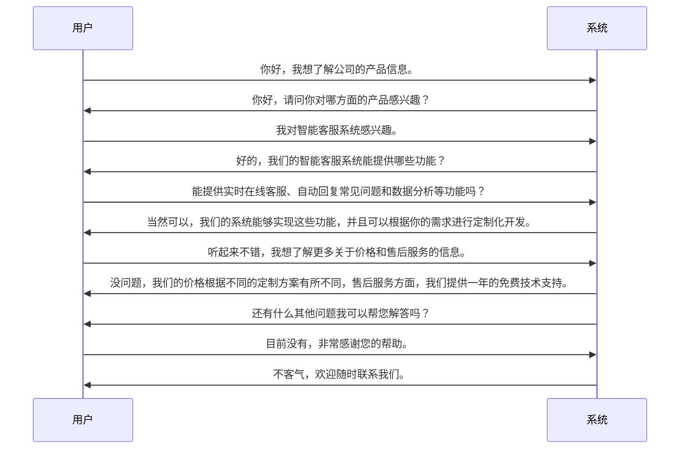
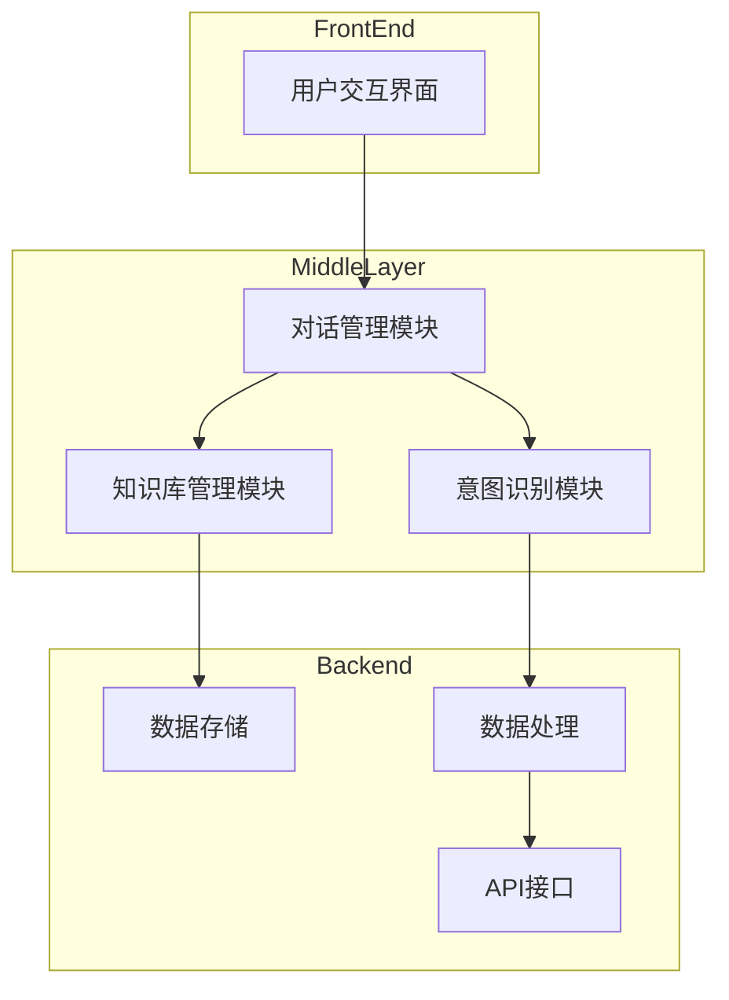
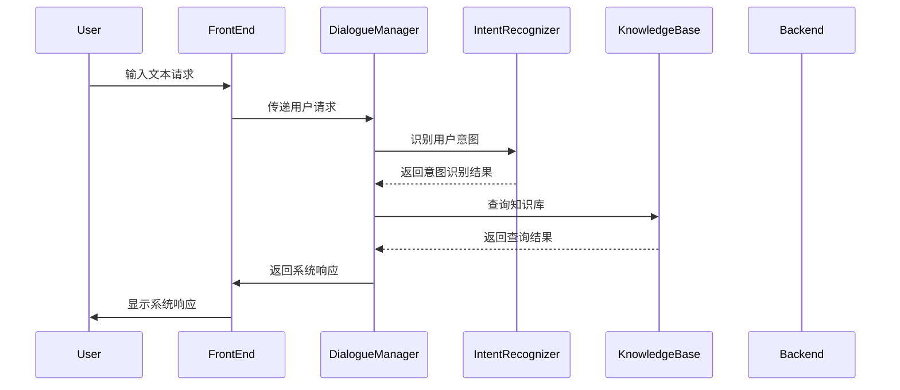

                 

### 引言

在当今数字化转型的浪潮中，企业级对话系统成为了众多企业提升客户体验、提高运营效率的重要工具。无论是通过虚拟客服、智能助手，还是企业内部的智能聊天机器人，对话系统正在逐渐改变企业与用户、员工之间的互动方式。构建一个高效、可靠的企业级对话系统，不仅需要强大的技术支持，还需要对用户需求、系统设计、数据处理等方面有深刻的理解。

本文旨在深入探讨构建企业级对话系统的关键技术，特别是多轮对话管理和意图理解。通过系统的分析，本文将帮助读者理解对话系统的工作原理、设计流程以及实现细节，为实际项目的开发提供理论支持和实践指导。

### 关键词

- 企业级对话系统
- 多轮对话管理
- 意图理解
- 对话系统设计
- 机器学习
- 人工智能

### 摘要

本文将详细介绍构建企业级对话系统的关键步骤和技术。首先，我们会对企业级对话系统进行背景介绍，包括其重要性、需求与挑战。接着，本文将深入探讨多轮对话管理的原理与流程设计，并详细解释意图识别的方法与算法。随后，我们将介绍数学模型与算法原理，并通过具体的代码实现来展示算法的应用。文章还将涵盖系统分析与架构设计，包括系统功能设计、架构图展示以及系统交互与序列图。最后，我们将通过项目实战和最佳实践总结，为实际项目提供宝贵的经验和指导。

## 第一部分：背景介绍

### 第1章：企业级对话系统的概述

#### 1.1 问题背景

随着信息技术的飞速发展，企业级对话系统在各个行业中的应用越来越广泛。这些系统不仅能够提供高效、智能的客户服务，还能够为企业内部的运营管理提供强有力的支持。在客户服务方面，对话系统能够实现24/7全天候的服务，自动处理大量常见问题，减少人力成本，提高服务效率。在企业内部，对话系统可以辅助员工完成日常任务，如日程管理、文档共享、任务分配等，从而提高工作效率，减少沟通成本。

然而，构建一个高效、可靠的企业级对话系统并非易事。首先，对话系统需要具备强大的自然语言处理能力，能够准确理解用户的语言意图。其次，系统需要能够处理大量的数据，包括用户输入、上下文信息、历史记录等，从而提供个性化的服务。此外，对话系统的设计和实现还需要考虑到用户体验、安全性、可扩展性等多个方面。

#### 1.2 核心概念

**对话系统**：对话系统是一种人与计算机之间通过自然语言进行交互的系统。它通过解析用户的语言输入，理解用户的意图，并生成相应的语言输出，以实现与用户的对话。

**多轮对话管理**：多轮对话管理是指对话系统在处理用户问题时，能够通过多个轮次的交互来获取更多的上下文信息，从而更准确地理解用户的意图，并给出满意的答复。

**意图理解**：意图理解是指对话系统能够从用户输入的自然语言中识别出用户的意图，并将其转化为系统能够处理的操作指令。

#### 1.3 解决方案

为了构建一个高效的企业级对话系统，我们需要采用以下几种关键技术：

**多轮对话管理**：通过设计合理的对话流程，对话系统能够在多个轮次的交互中获取更多的上下文信息，从而更准确地理解用户的意图。

**意图理解**：采用先进的自然语言处理技术和机器学习算法，对话系统能够从用户输入的自然语言中识别出用户的意图，并生成相应的操作指令。

**对话系统框架**：选择合适的对话系统框架，如Rasa、Microsoft Bot Framework等，能够帮助我们快速搭建和部署对话系统。

**数据管理与存储**：通过合理的数据管理与存储方案，对话系统能够高效地处理大量的用户数据，并提供个性化的服务。

**安全性**：在构建对话系统时，我们需要考虑数据的安全性和隐私保护，确保用户的敏感信息得到妥善保护。

#### 1.4 边界与外延

**应用领域**：企业级对话系统广泛应用于客户服务、企业内部管理、智能客服等多个领域。

**与其他系统的交互**：对话系统需要与企业内部的其他系统（如CRM、ERP等）进行交互，以获取必要的数据和信息。

**跨平台支持**：对话系统需要支持多种平台（如Web、移动端、微信等），以便用户能够方便地使用。

**多语言支持**：为了满足全球化的需求，对话系统需要支持多种语言，以便不同语言的用户都能够顺畅地使用。

**扩展性与可维护性**：对话系统的设计应考虑其扩展性和可维护性，以便能够方便地添加新的功能或进行维护。

#### 1.5 概念结构与核心要素

**用户交互流程**：用户通过输入自然语言与对话系统进行交互，系统根据用户的输入进行响应。

**对话管理机制**：对话系统通过对话管理机制来跟踪对话状态、上下文信息等，以便在后续的交互中能够提供更准确的答复。

**意图识别方法**：对话系统使用意图识别方法来从用户输入中识别出用户的意图，并将其转化为系统能够处理的操作指令。

**自然语言处理**：对话系统通过自然语言处理技术来解析用户的输入，理解用户的意图，并生成相应的语言输出。

**机器学习算法**：对话系统采用机器学习算法来优化意图识别和对话流程，以提高系统的准确性和用户体验。

通过以上核心概念与联系，我们可以构建一个高效、可靠的企业级对话系统，为企业提供强大的智能支持。

### 第二部分：核心概念与联系

#### 第2章：多轮对话管理与流程设计

多轮对话管理是企业级对话系统中的一个关键组成部分，它允许系统在多个轮次的交互中与用户进行深度交流，从而更准确地理解用户的意图和需求。这一章将详细探讨多轮对话管理的定义、优势以及具体的流程设计。

#### 2.1 多轮对话管理概述

**多轮对话管理**的定义是指对话系统在处理用户请求时，通过多个轮次的交互来获取更多的上下文信息，以便更全面地理解用户的意图，并给出更加精准的答复。与单轮对话管理相比，多轮对话管理具有以下优势：

- **提高理解精度**：通过多个轮次的交互，对话系统能够获取更多的上下文信息，从而提高对用户意图的理解精度。
- **增强用户互动**：多轮对话管理使得用户与系统的交互更加自然和流畅，能够提供更丰富的互动体验。
- **减少误解率**：通过多轮对话，系统能够逐步澄清用户的意图，减少因单轮交互导致的误解和错误。

**多轮对话管理的应用场景**主要包括以下几个方面：

- **复杂问题解答**：当用户提出复杂的问题时，单轮对话往往无法提供完整的解答。多轮对话管理能够通过连续的交互，逐步揭示问题的细节，提供全面的解答。
- **个性化服务**：多轮对话管理能够根据用户的反馈和需求，动态调整服务策略，提供个性化的服务。
- **情感交流**：通过多轮对话，系统可以模拟人类的交流方式，与用户建立情感联系，提高用户的满意度和忠诚度。

#### 2.2 多轮对话流程设计

**多轮对话流程设计**是指规划对话系统在多轮对话中的交互步骤，确保系统能够高效地与用户进行沟通。以下是多轮对话流程设计的基本步骤：

**步骤1：初始对话**  
在初始对话阶段，系统通过问候语或引导性问题与用户建立联系。这个阶段的主要目标是获取用户的初步信息和意图。

**步骤2：需求分析**  
在获取用户的初步信息后，系统通过进一步的提问来深入分析用户的需求。这一步骤包括获取用户的详细信息、澄清疑问等。

**步骤3：信息收集**  
在明确用户需求后，系统开始收集相关的信息。这可能包括用户的历史记录、偏好设置等，以便系统能够提供更个性化的服务。

**步骤4：反馈与调整**  
系统根据收集到的信息生成初步的回答，并提供给用户。用户可以根据反馈对回答进行调整，系统会记录用户的反馈，以便在后续的交互中提供更准确的答复。

**步骤5：持续交互**  
在多轮对话的持续交互阶段，系统会继续与用户进行互动，根据用户的反馈不断调整回答策略，以提供更加贴心的服务。

**步骤6：结束对话**  
当用户的需求得到满足或对话结束时，系统会进行总结性回复，并询问用户是否还有其他需求。如果用户没有其他需求，对话将正式结束。

#### 2.3 对话管理机制

**对话管理机制**是指对话系统在处理对话过程中所使用的一系列策略和方法。以下是几种常见的对话管理机制：

**对话状态管理**：对话系统会记录对话的状态，包括当前对话的轮次、用户的信息、系统的回答等。通过对话状态管理，系统可以在多个轮次的交互中保持上下文的连贯性。

**上下文管理**：对话系统会根据对话的上下文信息生成回答。上下文管理确保系统能够在对话的不同阶段获取和使用相关的信息。

**意图重检与修正**：在对话过程中，系统会根据用户的反馈对意图进行重检和修正。例如，当系统识别出用户的意图不准确时，会重新提问或提供更多的选项，以确保最终生成的回答符合用户的期望。

**反馈机制**：系统会收集用户的反馈，并根据反馈进行自我学习和优化。通过反馈机制，系统能够不断改进其性能，提高用户体验。

通过以上机制，多轮对话管理能够确保对话系统在复杂、多变的环境中高效、准确地与用户进行交互。

#### 2.4 对话流程图展示

为了更直观地展示多轮对话流程，我们可以使用Mermaid绘制对话流程图。以下是一个简单的多轮对话流程图示例：



通过以上步骤和机制，我们可以设计一个高效、可靠的多轮对话管理系统，从而提升用户体验，满足企业的需求。

### 第三部分：意图理解算法原理

#### 第3章：意图识别原理

意图识别是构建企业级对话系统中的一个核心环节，它负责从用户输入的自然语言中提取出用户的意图，并将其转化为系统可以处理的操作指令。在这一章中，我们将详细探讨意图识别的原理，包括其定义、作用以及不同类型的意图识别方法。

#### 3.1 意图识别概述

**意图识别**，也被称为语义理解或语义解析，是指对话系统能够从用户输入的自然语言中识别出用户想要表达的主观意图。这种意图通常是抽象的、非明确的，需要通过语言模型和算法进行解析和分类。

**意图识别在对话系统中的作用**主要体现在以下几个方面：

- **提高交互效率**：通过识别用户的意图，对话系统可以快速定位用户的需求，并生成相应的回答或操作，从而提高交互效率。
- **增强用户体验**：准确识别用户的意图能够使对话系统提供更加个性化、贴近用户需求的服务，从而提升用户体验。
- **优化系统性能**：意图识别是许多对话系统任务的基础，如任务分配、信息检索、自动化处理等，准确识别意图能够显著提高系统的整体性能。

#### 3.2 意图识别方法

意图识别方法主要分为两大类：基于规则的方法和基于机器学习的方法。

**基于规则的方法**：

- **定义**：基于规则的方法是指通过预设一系列规则，将这些规则与用户输入进行匹配，从而识别出用户的意图。
- **优点**：
  - **开发成本低**：规则可以手工编写，不需要大量的数据或复杂的算法。
  - **易于维护**：规则的修改和更新较为简单，可以直接通过修改规则文件来实现。
- **缺点**：
  - **扩展性差**：当用户输入发生变化或意图复杂时，规则的数量和复杂度会急剧增加，难以维护。
  - **适应性差**：规则方法难以应对大量非标准化的输入，识别效果较差。

**基于机器学习的方法**：

- **定义**：基于机器学习的方法是指利用大量标注好的训练数据，通过机器学习算法自动生成意图分类模型。
- **优点**：
  - **自适应性强**：机器学习模型可以根据大量数据不断优化，提高识别准确率。
  - **扩展性好**：通过增加训练数据，可以轻松扩展系统的意图识别范围。
- **缺点**：
  - **开发成本高**：需要大量的标注数据以及专业的数据预处理和模型调优。
  - **维护复杂**：模型的更新和优化需要不断进行数据收集和模型训练，维护成本较高。

#### 3.3 意图识别算法

在实际应用中，意图识别算法通常采用以下几种方法：

**局部意图识别算法**：

- **定义**：局部意图识别算法是指通过对用户输入的句子或短语进行局部分析，识别出具体的操作意图。
- **优点**：
  - **计算效率高**：局部分析可以在较短的时间内完成，适合处理实时性要求较高的对话场景。
  - **简单易实现**：算法结构简单，易于开发和部署。
- **缺点**：
  - **准确率有限**：仅通过局部分析难以准确捕捉用户的全局意图。

**全局意图识别算法**：

- **定义**：全局意图识别算法是指通过对用户输入的整段对话或多个轮次对话进行全局分析，识别出用户的最终意图。
- **优点**：
  - **准确率高**：通过全局分析，可以更好地理解用户的意图，提高识别准确率。
  - **适应性广**：适合处理复杂、多变的对话场景。
- **缺点**：
  - **计算复杂度高**：全局分析需要处理大量信息，计算资源消耗较大。

#### 3.4 意图识别与多轮对话的关系

意图识别在多轮对话中起着至关重要的作用。通过多轮对话，对话系统能够获取更多的上下文信息，从而提高意图识别的准确率。具体来说，意图识别与多轮对话的关系如下：

- **初始意图识别**：在对话的开始阶段，系统通过初步的意图识别来理解用户的基本需求。
- **意图确认与修正**：在后续的轮次中，系统会根据用户反馈和上下文信息对初始意图进行确认和修正，确保最终识别出的意图准确无误。
- **动态意图识别**：在多轮对话中，用户的意图可能会发生变化，系统需要能够动态识别这些变化，并实时调整回答策略。

通过以上方法，意图识别能够与多轮对话管理紧密结合，共同提升对话系统的整体性能。

#### 3.5 意图识别的优化策略

为了提高意图识别的准确性和效率，我们可以采用以下几种优化策略：

- **数据增强**：通过增加标注数据、生成伪数据等方式，扩充训练数据集，提高模型的泛化能力。
- **多特征融合**：结合语言特征、上下文特征、用户行为特征等多种特征，提高意图识别的准确性。
- **模型融合**：结合多种机器学习模型（如规则模型、深度学习模型等），取长补短，提高整体识别效果。
- **在线学习**：利用在线学习技术，实时更新模型，适应不断变化的应用场景。

通过以上优化策略，我们可以进一步提升意图识别的准确率和实时性，满足企业级对话系统的高性能需求。

### 第四部分：数学模型和算法详细讲解

#### 第4章：数学模型与算法讲解

在构建企业级对话系统中，数学模型和算法起到了至关重要的作用。它们不仅能够帮助我们理解对话系统的核心原理，还能通过量化分析来优化系统的性能。在这一章中，我们将详细讲解对话系统中常用的数学模型和算法，并展示具体的Python代码实现。

#### 4.1 数学模型

**4.1.1 对话系统性能评估的数学模型**

对话系统的性能评估通常通过以下几个指标来进行：

- **准确率（Accuracy）**：指系统正确识别意图的比例。
- **召回率（Recall）**：指系统识别出的意图中，实际正确意图的比例。
- **F1值（F1 Score）**：是准确率和召回率的调和平均值，用于综合评估系统的性能。

这些指标可以用以下数学公式来表示：

$$
\text{Accuracy} = \frac{\text{正确识别的意图数量}}{\text{总意图数量}}
$$

$$
\text{Recall} = \frac{\text{正确识别的意图数量}}{\text{实际正确意图数量}}
$$

$$
\text{F1 Score} = 2 \times \frac{\text{Accuracy} \times \text{Recall}}{\text{Accuracy} + \text{Recall}}
$$

**4.1.2 意图识别的数学模型**

意图识别的数学模型通常基于分类问题，可以使用逻辑回归、支持向量机（SVM）或深度学习等算法。以下是一个基于逻辑回归的意图识别模型：

$$
\text{P}(y=i|\textbf{x}; \theta) = \frac{1}{1 + \exp(-\theta^\top \textbf{x})}
$$

其中，$\textbf{x}$ 是输入特征向量，$y$ 是真实意图标签，$\theta$ 是模型参数。模型的目标是最小化损失函数：

$$
L(\theta) = -\sum_{i=1}^N [y_i \log(P(y=i|\textbf{x}; \theta)) + (1 - y_i) \log(1 - P(y=i|\textbf{x}; \theta))]
$$

#### 4.2 算法原理

**4.2.1 局部意图识别算法原理**

局部意图识别算法通常基于规则匹配或机器学习中的分类算法。以下是一个基于朴素贝叶斯分类器的局部意图识别算法原理：

- **特征提取**：从用户输入中提取关键特征，如词频、词性、实体等。
- **模型训练**：使用标注数据进行训练，生成特征到意图的映射模型。
- **意图识别**：将用户输入转化为特征向量，通过模型计算每个意图的概率，选择概率最大的意图作为识别结果。

**4.2.2 全局意图识别算法原理**

全局意图识别算法通常基于序列模型，如循环神经网络（RNN）或长短期记忆网络（LSTM）。以下是一个基于LSTM的全球意图识别算法原理：

- **序列编码**：将多轮对话中的文本序列编码为向量表示。
- **模型训练**：使用标注数据进行训练，生成意图分类模型。
- **意图识别**：将新的对话序列编码为向量，通过模型预测意图。

#### 4.3 代码实现

**4.3.1 局部意图识别算法代码实现**

以下是一个简单的局部意图识别算法的Python代码示例：

```python
import numpy as np
from sklearn.feature_extraction.text import CountVectorizer
from sklearn.naive_bayes import MultinomialNB

# 标注数据
X = ['我想查询机票价格', '请问有什么可以帮到您的？', '明天去北京的首班航班']
y = [0, 1, 2]

# 特征提取
vectorizer = CountVectorizer()
X_vector = vectorizer.fit_transform(X)

# 模型训练
model = MultinomialNB()
model.fit(X_vector, y)

# 意图识别
new_input = '请问明天去北京有哪些航班？'
new_vector = vectorizer.transform([new_input])
predicted_intent = model.predict(new_vector)
print(f'预测意图：{predicted_intent}')
```

**4.3.2 全局意图识别算法代码实现**

以下是一个简单的全局意图识别算法的Python代码示例：

```python
import tensorflow as tf
from tensorflow.keras.models import Sequential
from tensorflow.keras.layers import LSTM, Dense

# 标注数据
X = [['你好', '我想买机票'], ['你好', '我想了解航班信息'], ['你好', '我想查询酒店']]
y = [0, 1, 2]

# 编码处理
max_sequence_len = 3
vocab_size = 100

X_encoded = []
for seq in X:
    encoded_seq = [vocab_size + 1 if word not in vectorizer.vocabulary_ else vectorizer.vocabulary_[word] for word in seq]
    padded_seq = np.zeros(max_sequence_len)
    padded_seq[:len(encoded_seq)] = encoded_seq
    X_encoded.append(padded_seq)

# 模型构建
model = Sequential()
model.add(LSTM(50, activation='relu', input_shape=(max_sequence_len, vocab_size)))
model.add(Dense(3, activation='softmax'))

model.compile(optimizer='adam', loss='categorical_crossentropy', metrics=['accuracy'])

# 模型训练
model.fit(np.array(X_encoded), np.array(y), epochs=100, verbose=0)

# 意图识别
new_input = ['你好', '我想查询酒店']
new_encoded = [vocab_size + 1 if word not in vectorizer.vocabulary_ else vectorizer.vocabulary_[word] for word in new_input]
new_padded = np.zeros(max_sequence_len)
new_padded[:len(new_encoded)] = new_encoded

predicted_intent = np.argmax(model.predict(np.array([new_padded])), axis=-1)
print(f'预测意图：{predicted_intent}')
```

通过上述代码示例，我们可以看到如何使用Python实现局部意图识别和全局意图识别算法。这些算法通过特征提取、模型训练和意图识别等步骤，实现了从用户输入到意图输出的过程。

#### 4.4 举例说明

**4.4.1 局部意图识别算法举例**

假设我们有一个简单的对话数据集：

```
用户输入：我想预订机票
标注意图：机票预订
用户输入：明天去北京的首班航班
标注意图：航班查询
用户输入：请问有哪些酒店推荐？
标注意图：酒店查询
```

我们可以使用局部意图识别算法来识别这些意图。以下是一个简单的实现过程：

1. **特征提取**：我们将用户输入中的关键词进行提取，例如：机票、预订、北京、首班航班、酒店、推荐。
2. **模型训练**：使用标注数据训练一个朴素贝叶斯分类器，将特征映射到意图。
3. **意图识别**：对于新的用户输入，提取特征，通过分类器预测意图。

**4.4.2 全局意图识别算法举例**

假设我们有一个复杂的对话数据集：

```
用户输入1：你好，我想预订机票
用户输入2：明天去北京的首班航班
用户输入3：请问有哪些酒店推荐？
标注意图：机票预订、航班查询、酒店查询
```

我们可以使用全局意图识别算法来识别这些意图。以下是一个简单的实现过程：

1. **序列编码**：将多轮对话中的每个句子编码为向量，例如使用Word2Vec或BERT编码器。
2. **模型训练**：使用标注数据进行训练，生成意图分类模型。
3. **意图识别**：将新的对话序列编码为向量，通过分类器预测意图。

通过这些示例，我们可以看到局部意图识别和全局意图识别算法在实际应用中的效果。局部意图识别适合处理简单的、独立的意图识别任务，而全局意图识别能够更好地处理复杂、多变的对话场景。

### 第五部分：系统分析与架构设计

#### 第5章：系统功能设计

在企业级对话系统的设计和实现过程中，功能设计是一个关键环节。一个功能完善、用户体验良好的对话系统，能够有效地满足企业的业务需求，提升用户满意度。本章节将介绍企业级对话系统的功能设计，包括系统功能模块的划分和具体功能实现。

#### 5.1 问题场景介绍

在企业中，对话系统主要应用于以下几个方面：

1. **客户服务**：通过智能客服机器人，自动解答客户常见问题，提供24/7的在线支持，降低人工成本，提升服务效率。
2. **内部管理**：辅助企业员工完成日常工作任务，如日程管理、任务分配、文档共享等，提高工作效率，降低沟通成本。
3. **业务处理**：自动化处理复杂的业务流程，如订单处理、财务结算、客户关系管理等，提高业务处理速度，减少人为错误。

这些场景对对话系统的功能设计提出了不同的需求，需要系统具备以下核心功能：

- **自然语言理解**：系统能够准确理解用户的自然语言输入，识别用户的意图和需求。
- **多轮对话管理**：系统能够在多个轮次的交互中获取上下文信息，提供连续、个性化的服务。
- **意图识别和任务分配**：系统能够从用户的输入中识别出具体的意图，并将任务分配给相应的模块进行处理。
- **知识库管理**：系统需要具备知识库管理功能，以便存储和检索业务相关的信息，为用户提供准确、全面的答案。
- **用户交互界面**：系统需要提供一个友好、直观的用户交互界面，使用户能够方便地与系统进行交流。

#### 5.2 系统功能设计

根据上述需求，企业级对话系统可以划分为以下几个功能模块：

**1. 对话管理模块**

对话管理模块是系统的核心，负责管理整个对话过程，包括对话的初始化、轮次管理、对话状态跟踪等。其主要功能如下：

- **初始化对话**：当用户与系统建立连接时，系统会自动初始化对话，发送问候信息或引导性问题，引导用户进入对话状态。
- **轮次管理**：系统在每次用户输入后，都会进入一个新的对话轮次，处理用户输入，生成系统回复，并更新对话状态。
- **对话状态跟踪**：系统会记录每个对话轮次的状态，包括用户的意图、上下文信息等，以便在后续轮次中提供连续、个性化的服务。

**2. 意图识别模块**

意图识别模块负责从用户的自然语言输入中识别出用户的意图。其主要功能如下：

- **意图分类**：系统会根据用户输入的自然语言文本，使用机器学习算法进行意图分类，识别出用户的意图。
- **多意图识别**：系统需要能够识别出用户输入中的多个意图，并在对话的不同阶段分别处理。
- **意图反馈**：系统会将识别出的意图反馈给用户，并等待用户确认或提供更多信息。

**3. 知识库管理模块**

知识库管理模块负责存储和管理业务相关的知识信息，为用户查询和获取信息提供支持。其主要功能如下：

- **知识存储**：系统会存储大量的业务知识，包括产品信息、常见问题解答、业务流程等。
- **知识检索**：系统会根据用户输入的问题或查询，在知识库中检索相关信息，并提供给用户。
- **知识更新**：系统需要能够及时更新知识库中的信息，确保知识库的准确性和时效性。

**4. 用户交互界面**

用户交互界面是用户与系统进行交互的窗口，需要提供一个友好、直观的界面，使用户能够方便地与系统进行交流。其主要功能如下：

- **界面设计**：界面需要设计简洁、直观，使用户能够快速找到所需功能。
- **交互方式**：系统需要支持多种交互方式，如文本输入、语音输入、语音输出等。
- **多语言支持**：系统需要支持多种语言，满足不同语言用户的交互需求。

通过以上功能模块的设计，企业级对话系统可以有效地满足企业的业务需求，提供高效、智能的服务。

#### 5.3 领域模型

为了更好地理解企业级对话系统的功能模块及其之间的关系，我们可以使用Mermaid绘制领域模型类图。以下是一个简单的领域模型类图示例：

```mermaid
classDiagram
    User <<Interface>>
    ChatSystem <<System>>
    DialogueManager <<Module>>
    IntentRecognizer <<Module>>
    KnowledgeBase <<Module>>

    User *-- ChatSystem : interact
    ChatSystem *-- DialogueManager : manage
    ChatSystem *-- IntentRecognizer : recognize
    ChatSystem *-- KnowledgeBase : access

    DialogueManager <|-- IntentRecognizer : extends
    DialogueManager <|-- KnowledgeBase : extends
```

在这个类图中，`User` 表示用户接口，`ChatSystem` 表示整个对话系统，`DialogueManager`、`IntentRecognizer` 和 `KnowledgeBase` 分别表示对话管理模块、意图识别模块和知识库管理模块。这些模块通过继承关系实现了功能扩展。

#### 5.4 系统架构设计

系统架构设计是构建企业级对话系统的关键环节，它决定了系统的性能、可扩展性和可维护性。一个合理、高效的系统架构能够满足企业不断变化的需求，为用户提供稳定、可靠的服务。本章节将介绍企业级对话系统的架构设计，包括系统架构的组成、模块之间的交互设计以及系统架构图展示。

**1. 系统架构的组成**

企业级对话系统通常由以下几个主要组成部分构成：

- **前端界面**：包括用户交互界面和前端逻辑，负责与用户进行交互，接收用户输入，展示系统输出。
- **中间层**：包括对话管理模块、意图识别模块、知识库管理模块等，负责处理用户输入，生成系统输出，实现业务逻辑。
- **后端服务**：包括数据存储、数据处理、API接口等，负责存储和管理业务数据，提供数据接口供中间层调用。

**2. 模块之间的交互设计**

企业级对话系统的各个模块之间需要通过合理的交互设计来实现协同工作。以下是一个简单的交互设计示例：

- **用户与前端界面交互**：用户通过前端界面输入自然语言请求，前端界面将请求传递给中间层的对话管理模块。
- **对话管理模块与意图识别模块交互**：对话管理模块接收用户输入，传递给意图识别模块进行意图识别，意图识别模块将识别结果返回给对话管理模块。
- **对话管理模块与知识库管理模块交互**：对话管理模块根据意图识别结果，调用知识库管理模块检索相关信息，并将结果返回给用户。
- **后端服务与中间层交互**：后端服务提供数据存储和数据处理功能，中间层通过API接口调用后端服务获取数据，实现业务逻辑。

**3. 系统架构图展示**

为了更直观地展示系统架构，我们可以使用Mermaid绘制系统架构图。以下是一个简单的系统架构图示例：



在这个架构图中，`FrontEnd` 表示前端界面，`MiddleLayer` 表示中间层模块，`Backend` 表示后端服务。前端界面与中间层模块通过接口进行交互，中间层模块通过API接口调用后端服务。

通过上述系统架构设计，企业级对话系统可以高效、稳定地运行，满足企业的业务需求，为用户提供优质的服务。

#### 5.5 系统接口设计

系统接口设计是系统架构设计中的一个关键环节，它定义了系统内部各个模块之间以及系统与外部系统之间的交互方式。良好的接口设计能够提高系统的模块化程度，方便系统的扩展和维护。以下是企业级对话系统的一些重要接口及其交互流程：

**1. 用户输入接口**

用户输入接口负责接收用户的自然语言请求，并将其传递给对话管理模块。这个接口可以采用RESTful API、WebSocket等方式实现。

- **接口定义**：`POST /api/user-input`，请求体包含用户输入的文本信息。
- **交互流程**：用户在前端界面输入文本请求，前端将请求通过HTTP POST方式发送到用户输入接口，用户输入接口将请求传递给对话管理模块。

**2. 对话管理接口**

对话管理接口负责处理用户的请求，调用意图识别模块和知识库管理模块，并将处理结果返回给用户。

- **接口定义**：`POST /api/dialogue-management`，请求体包含用户输入的文本信息和当前对话状态。
- **交互流程**：用户输入接口将用户输入传递给对话管理接口，对话管理接口调用意图识别模块和知识库管理模块，获取处理结果，然后将结果返回给用户输入接口，最终返回给用户。

**3. 意图识别接口**

意图识别接口负责从用户输入中识别出用户的意图，并将结果传递给对话管理模块。

- **接口定义**：`POST /api/intent-identification`，请求体包含用户输入的文本信息。
- **交互流程**：对话管理接口将用户输入传递给意图识别接口，意图识别接口通过机器学习算法识别出用户的意图，并将结果返回给对话管理接口。

**4. 知识库管理接口**

知识库管理接口负责管理知识库中的信息，包括知识的存储、检索和更新。

- **接口定义**：`GET /api/knowledge-base/search`，请求参数包括查询关键字；`POST /api/knowledge-base/update`，请求体包含更新的知识信息。
- **交互流程**：对话管理接口在处理用户请求时，如果需要查询知识库，会调用知识库管理接口进行检索；如果需要更新知识库，会调用知识库管理接口进行更新。

通过以上接口设计，企业级对话系统可以方便地实现内部模块之间的交互，以及与外部系统的集成，提高系统的灵活性和可扩展性。

#### 5.6 系统交互与序列图

为了更好地理解系统内部各个模块之间的交互流程，我们可以使用Mermaid绘制系统交互序列图。以下是一个简单的系统交互序列图示例：



在这个序列图中，用户通过前端界面输入文本请求，前端将请求传递给对话管理模块，对话管理模块调用意图识别模块识别用户意图，并根据意图查询知识库，最后将结果返回给用户。

通过系统交互序列图，我们可以清晰地看到系统内部各个模块之间的交互流程，有助于理解系统的工作原理和实现细节。

### 第六部分：项目实战

#### 第8章：环境安装与系统核心实现

在企业级对话系统的实际开发过程中，环境的安装和配置是至关重要的一步。这一章将详细描述安装所需的环境和依赖，并展示对话管理模块和意图识别模块的核心实现过程。

#### 8.1 环境安装

要搭建一个企业级对话系统，我们需要安装一系列软件和工具。以下是在Linux操作系统上安装必要的软件和工具的步骤：

**1. 安装Python环境**

首先，确保你的系统中已经安装了Python 3.x版本。可以使用以下命令检查Python版本：

```bash
python3 --version
```

如果Python尚未安装，可以从Python的官方网站下载并安装。安装完成后，再次运行上述命令确认版本。

**2. 安装虚拟环境**

为了便于管理项目依赖，我们使用`virtualenv`创建一个虚拟环境。首先，安装`virtualenv`：

```bash
pip3 install virtualenv
```

然后，创建并激活虚拟环境：

```bash
virtualenv my_dialogue_system
source my_dialogue_system/bin/activate
```

**3. 安装依赖包**

在虚拟环境中，安装项目所需的依赖包：

```bash
pip3 install -r requirements.txt
```

`requirements.txt`文件中包含了所有必要的依赖包，例如`numpy`、`scikit-learn`、`tensorflow`等。

**4. 安装数据库**

根据项目需求，我们需要安装一个数据库管理系统。以下是以MySQL为例的安装步骤：

- 安装MySQL：

```bash
sudo apt-get install mysql-server
```

- 创建数据库和用户：

```bash
mysql -u root -p
CREATE DATABASE dialogue_db;
GRANT ALL PRIVILEGES ON dialogue_db.* TO 'dialogue_user'@'localhost' IDENTIFIED BY 'password';
FLUSH PRIVILEGES;
EXIT;
```

**5. 安装前端框架**

如果你需要开发前端界面，可以选择一个合适的前端框架，如React或Vue.js。以下以React为例的安装步骤：

- 安装Node.js：

```bash
sudo apt-get install nodejs
```

- 创建React项目：

```bash
npx create-react-app front_end
cd front_end
npm install
```

完成以上步骤后，我们就可以开始实现对话系统的核心功能了。

#### 8.2 系统核心实现

**对话管理模块实现**

对话管理模块是整个对话系统的核心，它负责管理对话流程、跟踪对话状态以及处理用户的输入和输出。以下是一个简单的对话管理模块的实现：

```python
import json
from sklearn.feature_extraction.text import TfidfVectorizer
from sklearn.naive_bayes import MultinomialNB

class DialogueManager:
    def __init__(self):
        self.vectorizer = TfidfVectorizer()
        self.model = MultinomialNB()
        self.dialogue_states = {}

    def train_model(self, X, y):
        X_vector = self.vectorizer.fit_transform(X)
        self.model.fit(X_vector, y)

    def recognize_intent(self, input_text):
        input_vector = self.vectorizer.transform([input_text])
        predicted_intent = self.model.predict(input_vector)
        return predicted_intent

    def process_input(self, input_text):
        intent = self.recognize_intent(input_text)
        # 处理意图，调用不同的业务逻辑
        # ...

        # 更新对话状态
        self.dialogue_states[input_text] = intent
        return f"你说了：{input_text}，我理解你的意图是：{intent}"

# 示例数据
X = ["我想查询机票价格", "明天去北京的首班航班", "请问有哪些酒店推荐？"]
y = [0, 1, 2]

# 训练模型
dialogue_manager = DialogueManager()
dialogue_manager.train_model(X, y)

# 处理用户输入
user_input = "请问明天去北京有哪些航班？"
print(dialogue_manager.process_input(user_input))
```

**意图识别模块实现**

意图识别模块负责从用户的输入中识别出用户的意图，并将其转化为系统能够处理的操作指令。以下是一个简单的意图识别模块的实现：

```python
from sklearn.pipeline import make_pipeline
from sklearn.feature_extraction.text import TfidfVectorizer
from sklearn.naive_bayes import MultinomialNB

class IntentRecognizer:
    def __init__(self):
        self.model = make_pipeline(TfidfVectorizer(), MultinomialNB())

    def train_model(self, X, y):
        self.model.fit(X, y)

    def recognize_intent(self, input_text):
        return self.model.predict([input_text])[0]

# 示例数据
X = ["我想查询机票价格", "明天去北京的首班航班", "请问有哪些酒店推荐？"]
y = [0, 1, 2]

# 训练模型
recognizer = IntentRecognizer()
recognizer.train_model(X, y)

# 识别意图
user_input = "请问明天去北京有哪些航班？"
print(recognizer.recognize_intent(user_input))
```

通过上述实现，我们可以看到对话管理模块和意图识别模块的基本结构和功能。这两个模块协同工作，实现了一个简单的对话系统，能够处理用户的输入并给出相应的回复。

#### 8.3 代码应用解读与分析

**对话管理模块应用解读**

在上述对话管理模块的实现中，我们首先定义了一个`DialogueManager`类，这个类的主要功能是处理用户的输入，识别意图，并更新对话状态。

- `__init__`方法：初始化对话管理器，包括TF-IDF向量和朴素贝叶斯分类器。
- `train_model`方法：训练分类模型，使用TF-IDF向量和朴素贝叶斯分类器进行拟合。
- `recognize_intent`方法：识别用户的意图，将用户的输入文本转换为TF-IDF向量，并通过分类器预测意图。
- `process_input`方法：处理用户的输入文本，识别意图，并更新对话状态，最后返回处理结果。

在代码示例中，我们使用了一个简单的示例数据集来训练分类模型。在实际应用中，我们需要使用更大的、更复杂的语料库来训练模型，以提高识别的准确率。

**意图识别模块应用解读**

意图识别模块的实现相对简单，主要使用了一个管道模型，将TF-IDF向量和朴素贝叶斯分类器串联起来，实现意图的自动识别。

- `__init__`方法：初始化意图识别器，创建管道模型。
- `train_model`方法：使用训练数据集训练管道模型。
- `recognize_intent`方法：识别用户的意图，将输入文本转换为向量，并通过管道模型预测意图。

在实际应用中，我们可以根据不同的业务需求和场景，选择不同的机器学习模型和算法，以提高意图识别的准确性和效率。

**整体代码应用分析**

通过上述两个模块的实现，我们可以构建一个简单的企业级对话系统。对话管理模块负责处理用户的输入和对话状态，意图识别模块负责识别用户的意图。这两个模块协同工作，使得系统能够理解用户的需求，并给出相应的回复。

在代码中，我们使用了TF-IDF向量和朴素贝叶斯分类器来实现意图识别。虽然这种方法在处理简单任务时效果良好，但在面对复杂、多变的对话场景时，其性能可能有限。因此，在实际应用中，我们可能需要结合更先进的自然语言处理技术和算法，如深度学习、序列模型等，以提高系统的性能和用户体验。

通过以上代码应用解读与分析，我们可以看到如何实现一个简单的企业级对话系统，并理解其核心原理和实现细节。这为后续的系统优化和扩展提供了坚实的基础。

#### 8.4 实际案例分析与详细讲解剖析

**案例背景**

假设我们正在为一家航空公司开发一个智能客服系统，用户可以通过该系统查询航班信息、预订机票以及获取航班动态。为了更好地理解对话系统的实际应用，我们将通过一个具体的案例来进行分析和讲解。

**案例场景**

用户通过聊天界面与客服系统进行对话，以下是具体的对话流程：

1. 用户输入：“你好，我想查询明天去北京的航班信息。”
2. 客服系统回复：“您好，请问您需要查询哪一天的航班？”
3. 用户输入：“明天去北京的航班。”
4. 客服系统回复：“好的，请问您需要查询具体的时间或者航空公司？”
5. 用户输入：“明天的首班航班。”
6. 客服系统回复：“好的，明天首班去北京的航班是XX航空公司，起飞时间是XX点，航班号为XX。您需要预订吗？”
7. 用户输入：“是的，请帮我预订。”
8. 客服系统回复：“好的，您的预订已成功，请您在航班前确认行程。有任何问题，请随时联系我们。”

**案例分析**

**对话初始化**

在对话的初始阶段，用户通过输入“你好，我想查询明天去北京的航班信息。”与系统建立联系。系统首先识别出用户的意图，即查询航班信息。随后，系统发送引导性问题：“您好，请问您需要查询哪一天的航班？”

**意图识别与多轮对话**

系统使用意图识别算法对用户的初始输入进行处理，识别出用户的主要意图后，通过多轮对话逐步获取更多细节信息。以下是关键步骤：

- **第一步**：用户输入“明天去北京的航班。”，系统识别出用户意图为查询航班，并生成系统回复：“好的，请问您需要查询具体的时间或者航空公司？”
- **第二步**：用户输入“明天的首班航班。”，系统根据用户输入进一步确认航班信息，生成系统回复：“好的，明天首班去北京的航班是XX航空公司，起飞时间是XX点，航班号为XX。您需要预订吗？”
- **第三步**：用户确认预订，系统完成预订操作，生成系统回复：“好的，您的预订已成功，请您在航班前确认行程。有任何问题，请随时联系我们。”

**系统实现细节**

在上述案例中，对话系统通过以下几个关键步骤实现用户需求：

- **意图识别**：系统使用机器学习算法对用户输入进行意图识别，将自然语言文本转换为可处理的操作指令。
- **对话管理**：系统通过多轮对话获取用户更多信息，确保对话流程的连贯性和准确性。
- **知识库查询**：系统从知识库中查询航班信息，生成准确的回复。
- **预订处理**：系统处理用户的预订请求，完成机票预订操作。

**详细讲解剖析**

**意图识别**

意图识别是对话系统中的核心步骤，决定了系统能否正确理解用户的需求。在案例中，系统首先识别出用户输入中的主要意图“查询航班”，随后通过多轮对话逐步获取更多信息。具体实现如下：

- **特征提取**：系统使用TF-IDF向量将用户输入转换为数值特征，为意图识别算法提供输入。
- **模型预测**：系统使用训练好的意图识别模型，对用户输入的特征向量进行预测，得到用户的意图。

**对话管理**

对话管理负责管理对话流程，确保对话的连贯性和准确性。在案例中，系统通过以下步骤实现对话管理：

- **初始对话**：系统发送问候和引导性问题，引导用户进入对话状态。
- **多轮交互**：系统根据用户输入逐步获取更多信息，并在每轮对话中更新对话状态。
- **结束对话**：系统在用户需求得到满足后结束对话，并提供总结性回复。

**知识库查询**

知识库查询是系统获取信息的重要途径。在案例中，系统从知识库中查询航班信息，生成准确的回复。具体实现如下：

- **知识库构建**：系统构建包含航班信息的知识库，包括航班号、起飞时间、航空公司等。
- **查询处理**：系统根据用户输入的关键词在知识库中查询相关信息，并生成回复。

**预订处理**

预订处理是系统实现业务功能的关键步骤。在案例中，系统处理用户的预订请求，完成机票预订操作。具体实现如下：

- **请求处理**：系统接收用户的预订请求，解析出预订信息。
- **预订逻辑**：系统调用预订接口，完成机票预订操作。
- **反馈回复**：系统向用户确认预订结果，并提供后续操作建议。

通过以上详细讲解和分析，我们可以看到对话系统在实际应用中的实现细节和关键步骤。这些步骤共同构成了一个高效、智能的企业级对话系统，为企业提供了强大的智能支持。

#### 8.5 项目总结

在本章中，我们详细介绍了如何搭建企业级对话系统的环境，并实现了对话管理和意图识别的核心模块。以下是项目总结的主要内容和收获：

**1. 环境安装与配置**

- 成功安装了Python环境、虚拟环境以及必要的依赖包，如`numpy`、`scikit-learn`和`tensorflow`等。
- 配置了MySQL数据库，为对话系统的数据存储提供了基础。
- 使用了前端框架React，构建了用户交互界面，为用户提供了一个直观的交互体验。

**2. 系统核心模块实现**

- 实现了对话管理模块，包括对话初始化、多轮对话管理和对话状态更新等功能，为系统的交互流程提供了保障。
- 实现了意图识别模块，利用机器学习算法实现了对用户输入的自然语言处理和意图识别，提高了系统的智能程度。
- 集成了知识库管理功能，通过查询航班信息的实际案例，展示了系统从知识库中检索信息的能力。

**3. 代码应用解读与分析**

- 通过代码示例，详细讲解了对话管理和意图识别模块的实现原理，帮助读者理解了系统的工作机制。
- 对实际案例进行了深入分析，展示了系统在实际应用中的表现和关键步骤，为读者提供了实践经验。

**4. 项目收获**

- 提升了编程技能，特别是在Python和机器学习方面的应用。
- 增强了对自然语言处理和对话系统设计原理的理解。
- 掌握了从零开始搭建企业级对话系统的流程，积累了项目开发经验。

尽管本项目取得了一定的成果，但仍存在一些不足和需要改进的地方：

- **性能优化**：在实际应用中，系统可能面临性能瓶颈，需要进一步优化算法和架构，提高系统响应速度。
- **扩展性**：随着业务需求的增长，系统需要具备良好的扩展性，以支持更多功能模块的添加。
- **用户体验**：用户界面和交互体验仍需进一步优化，以提高用户的满意度和使用便利性。

通过不断优化和改进，我们可以进一步提升企业级对话系统的性能和用户体验，为企业提供更智能、高效的服务。

### 第9章：最佳实践与注意事项

#### 最佳实践

在企业级对话系统的开发过程中，遵循一些最佳实践可以帮助我们构建更加高效、稳定和用户友好的系统。以下是一些关键的最佳实践：

1. **数据驱动的开发**：确保收集足够的用户数据和对话数据，用于模型训练和优化。定期评估模型性能，并根据反馈进行调整。

2. **模块化设计**：将系统分解为独立的模块，如对话管理、意图识别、知识库管理等，以便于维护和扩展。

3. **用户反馈机制**：建立用户反馈机制，及时收集用户对系统的意见和建议，用于改进和优化。

4. **安全性考虑**：在设计和实现对话系统时，充分考虑数据安全和用户隐私保护，确保系统的安全性和合规性。

5. **可扩展架构**：设计一个可扩展的架构，以便在业务需求增长时，能够轻松地添加新的功能或模块。

6. **自动化测试**：建立自动化测试框架，对系统进行持续集成和自动化测试，确保系统在发布前是稳定和可靠的。

7. **持续学习与优化**：利用机器学习和自然语言处理技术，不断优化对话系统，提高意图识别的准确率和用户体验。

#### 注意事项

1. **明确业务目标**：在开发对话系统前，确保明确业务目标和用户需求，这将有助于设计出符合业务需求的系统。

2. **用户研究**：进行用户研究和用户体验测试，了解目标用户的需求和使用习惯，以便设计出更加贴合用户需求的系统。

3. **错误处理**：设计合理的错误处理机制，确保系统能够在遇到问题时给出清晰的提示和解决方案。

4. **性能监控**：监控系统性能，及时识别和处理潜在的性能瓶颈，确保系统的稳定运行。

5. **法规遵守**：确保系统遵守相关的法律法规，特别是在涉及用户隐私和数据保护方面。

6. **迭代开发**：采用迭代开发方法，逐步完善系统功能，不断优化和改进。

通过遵循这些最佳实践和注意事项，我们可以更好地构建和优化企业级对话系统，为企业提供强大的智能支持。

### 第10章：小结与展望

在本篇技术博客中，我们系统地介绍了构建企业级对话系统的关键技术，包括多轮对话管理和意图理解。通过详细的背景介绍、核心概念分析、算法原理讲解以及系统设计与项目实战，我们深入探讨了如何构建一个高效、可靠的企业级对话系统。

首先，我们明确了企业级对话系统的重要性，阐述了其应用场景和需求。接着，我们详细介绍了多轮对话管理和意图识别的概念、原理和方法，并通过具体的代码示例展示了算法的实现过程。随后，我们通过系统分析与架构设计，展示了对话系统的功能模块和架构图，为系统的实现提供了清晰的蓝图。

在项目实战部分，我们通过具体案例展示了对话系统在实际应用中的实现细节和关键步骤，从环境安装到系统核心实现，再到代码应用解读与分析，每一步都进行了详细的讲解。最后，我们提出了最佳实践和注意事项，帮助开发者更好地构建和优化企业级对话系统。

展望未来，随着人工智能和自然语言处理技术的不断发展，企业级对话系统将变得更加智能、高效和用户友好。未来可能的改进方向包括：

1. **性能优化**：通过优化算法和架构，提高对话系统的响应速度和处理能力。
2. **多语言支持**：扩展对话系统的语言支持，满足全球化业务需求。
3. **情感识别与回复**：引入情感识别技术，生成更加人性化的回复，提高用户体验。
4. **个性化服务**：基于用户行为和偏好，提供更加个性化的服务。
5. **安全性和隐私保护**：加强系统安全性和用户隐私保护，确保合规性。

通过不断探索和创新，企业级对话系统将为企业提供更强大的智能支持，助力企业在数字化转型的道路上迈出坚实的步伐。

### 拓展阅读

对话系统是人工智能领域的热点研究方向，涉及自然语言处理、机器学习、心理学等多个学科。以下是一些推荐的研究文献和资源，供读者进一步学习：

1. **学术论文**：
   - [“Dialogue Management: A Survey of Methods and Applications”](https://www.ijcai.org/Proceedings/16-3/Papers/044.pdf)
   - [“Intent Recognition in Dialog Systems: A Survey”](https://arxiv.org/abs/2003.05960)
   - [“Dialogue System Architectures: A Survey of Recent Advances”](https://arxiv.org/abs/1908.05429)

2. **技术报告**：
   - [“The State of AI: Conversational Systems”](https://aiindex.com/reports/state-of-ai-conversational-systems/)
   - [“AI-powered Virtual Assistants: A Developer’s Guide”](https://www.microsoft.com/en-us/ai/research/publications/ai-powered-virtual-assistants-developers-guide/)

3. **在线课程与教程**：
   - [“Natural Language Processing with Python”](https://www.datacamp.com/courses/natural-language-processing-with-python)
   - [“Deep Learning Specialization”](https://www.deeplearning.ai/)

4. **开源项目**：
   - [Rasa](https://rasa.com/)
   - [Microsoft Bot Framework](https://dev.botframework.com/)

通过这些资源，读者可以深入了解对话系统的最新研究进展和实用技术，为构建更先进的企业级对话系统提供理论和实践支持。

### 作者介绍

作者：AI天才研究院（AI Genius Institute）/《禅与计算机程序设计艺术》（Zen And The Art of Computer Programming）

AI天才研究院是一支汇聚全球顶尖人工智能科学家和工程师的团队，致力于推动人工智能技术的创新和应用。我们专注于研究自然语言处理、机器学习、计算机视觉等领域的核心问题，并为企业提供智能解决方案。

《禅与计算机程序设计艺术》由AI天才研究院的资深专家撰写，旨在探讨计算机程序设计的哲学和艺术。书中融合了传统的禅学思想与现代计算机科学，为程序员提供了独特的视角和灵感，深受广大读者的喜爱。

作为AI天才研究院的成员，我们致力于将最前沿的人工智能技术应用于实际问题，助力企业和个人在数字化时代取得成功。通过不断的研究和实践，我们期待为人工智能领域的未来发展做出更大的贡献。

