                 

# 构建企业级对话系统：多轮对话管理与意图理解的深度整合

## 关键词：企业级对话系统、多轮对话管理、意图理解、深度整合

## 摘要

随着人工智能技术的不断进步，企业级对话系统作为一种新型的智能交互手段，逐渐成为企业数字化转型的关键组成部分。本文旨在探讨如何构建一个高效的企业级对话系统，重点分析了多轮对话管理与意图理解的深度整合方法。通过详细的理论分析和实践案例，本文为读者提供了一个全面的技术指南，旨在帮助企业开发出既智能又实用的对话系统。

## 目录大纲

### 第一部分：引言与概述

- **1.1 引言**
  - **1.1.1 问题背景**
  - **1.1.2 问题描述**
  - **1.1.3 问题解决**
  - **1.1.4 边界与外延**
  - **1.1.5 核心概念**

- **1.2 企业级对话系统的定义与特点**
  - **1.2.1 定义**
  - **1.2.2 核心特点**
  - **1.2.3 与传统对话系统的区别**

- **1.3 多轮对话管理的重要性**
  - **1.3.1 多轮对话的概述**
  - **1.3.2 多轮对话的优势**
  - **1.3.3 多轮对话的挑战**

- **1.4 意图理解的深度整合**
  - **1.4.1 意图理解的概念**
  - **1.4.2 意图理解的重要性**
  - **1.4.3 意图理解的方法**
  - **1.4.4 意图理解与多轮对话的结合**

- **1.5 本章小结**

### 第二部分：多轮对话管理系统设计

- **2.1 多轮对话管理的基本原理**
  - **2.1.1 多轮对话的流程**
  - **2.1.2 多轮对话的状态机模型**
  - **2.1.3 多轮对话的上下文管理**

- **2.2 对话管理系统的架构设计**
  - **2.2.1 系统架构概述**
  - **2.2.2 系统模块划分**
  - **2.2.3 系统组件交互**

- **2.3 多轮对话的流程设计与实现**
  - **2.3.1 流程设计原则**
  - **2.3.2 流程实现技术**
  - **2.3.3 流程优化策略**

- **2.4 上下文管理机制**
  - **2.4.1 上下文的概念**
  - **2.4.2 上下文管理的方法**
  - **2.4.3 上下文维护与更新策略**

- **2.5 本章小结**

### 第三部分：意图理解与深度整合

- **3.1 意图理解的基本概念**
  - **3.1.1 意图的定义**
  - **3.1.2 意图分类**
  - **3.1.3 意图理解的重要性**

- **3.2 意图理解的方法与技术**
  - **3.2.1 统计方法**
  - **3.2.2 机器学习方法**
  - **3.2.3 深度学习方法**

- **3.3 意图与对话的整合策略**
  - **3.3.1 整合的重要性**
  - **3.3.2 整合的方法**
  - **3.3.3 整合的挑战**

- **3.4 案例研究：深度整合的实践**
  - **3.4.1 案例背景**
  - **3.4.2 案例分析**
  - **3.4.3 案例总结**

- **3.5 本章小结**

### 第四部分：实现与优化

- **4.1 系统实现**
  - **4.1.1 系统环境搭建**
  - **4.1.2 核心算法实现**
  - **4.1.3 系统功能实现**

- **4.2 性能优化**
  - **4.2.1 性能优化策略**
  - **4.2.2 性能评估指标**
  - **4.2.3 优化实践**

- **4.3 可扩展性与可维护性**
  - **4.3.1 设计原则**
  - **4.3.2 实现方法**
  - **4.3.3 挑战与解决方案**

- **4.4 安全性与隐私保护**
  - **4.4.1 安全性威胁**
  - **4.4.2 隐私保护策略**
  - **4.4.3 安全性评估与防护**

- **4.5 本章小结**

### 第五部分：应用场景与案例分析

- **5.1 对话系统在企业中的应用场景**
  - **5.1.1 客户服务**
  - **5.1.2 售后服务**
  - **5.1.3 企业内部沟通**

- **5.2 案例分析**
  - **5.2.1 案例一：某企业客户服务对话系统**
  - **5.2.2 案例二：某企业内部沟通对话系统**
  - **5.2.3 案例总结**

- **5.3 应用前景与挑战**
  - **5.3.1 应用前景**
  - **5.3.2 挑战与解决方案**

- **5.4 本章小结**

### 第六部分：展望与未来方向

- **6.1 未来发展趋势**
  - **6.1.1 技术创新**
  - **6.1.2 应用拓展**
  - **6.1.3 深度学习与多模态融合**

- **6.2 研究热点与趋势**
  - **6.2.1 研究热点**
  - **6.2.2 发展趋势**
  - **6.2.3 潜在研究方向**

- **6.3 未来方向与挑战**
  - **6.3.1 未来方向**
  - **6.3.2 挑战与应对策略**

- **6.4 本章小结**

### 总结

本文通过系统性的分析和实践，详细阐述了构建企业级对话系统的关键技术与方法，为企业在智能化转型中提供了有力支持。未来，随着技术的不断进步，企业级对话系统将在更多领域展现其价值。

### 参考文献

- [参考文献1]
- [参考文献2]
- ...

## 1.1 引言

### 1.1.1 问题背景

随着互联网的快速发展和大数据时代的来临，企业面临着前所未有的机遇和挑战。如何利用先进的人工智能技术提高客户服务水平、降低运营成本、提升工作效率，成为企业数字化转型的重要课题。在此背景下，企业级对话系统应运而生，成为企业智能化转型的关键组成部分。

企业级对话系统是一种能够与人类用户进行自然语言交互的人工智能系统，其目的是为企业提供智能化的客户服务、内部沟通、数据分析等应用场景。与传统的人工服务相比，对话系统能够实现24小时不间断服务，大幅提升服务效率和用户体验。然而，构建一个高效、智能的企业级对话系统并非易事，需要解决多轮对话管理和意图理解的深度整合等问题。

### 1.1.2 问题描述

构建企业级对话系统需要解决以下几个关键问题：

1. **多轮对话管理**：如何设计和管理多轮对话流程，确保对话系统能够根据用户需求进行灵活互动。
2. **意图理解**：如何准确理解用户的意图，以便对话系统能够提供恰当的响应。
3. **深度整合**：如何将多轮对话管理与意图理解深度整合，构建一个高效、智能的对话系统。

### 1.1.3 问题解决

为了解决上述问题，本文提出以下解决方案：

1. **多轮对话管理**：设计一套基于状态机模型的多轮对话管理机制，实现对话流程的灵活管理。
2. **意图理解**：采用机器学习方法和深度学习技术，构建意图识别模型，提高意图理解的准确性。
3. **深度整合**：将多轮对话管理和意图理解深度整合，实现高效、智能的对话系统。

### 1.1.4 边界与外延

本文的研究主要围绕企业级对话系统的构建展开，重点关注多轮对话管理和意图理解的深度整合。在研究边界上，本文不涉及对话系统的底层硬件和基础设施，而是侧重于软件层面的设计和实现。在外延上，本文旨在为构建企业级对话系统提供一套完整的技术方案，以期为相关领域的研究和实践提供参考。

### 1.1.5 核心概念

为了更好地理解本文的内容，以下介绍一些核心概念：

1. **多轮对话**：指对话系统与用户之间的多个来回交互。
2. **意图理解**：指对话系统能够识别用户的意图，并据此提供相应的响应。
3. **状态机模型**：用于描述对话系统的状态转换和交互流程。
4. **机器学习方法**：指利用计算机算法模拟人类学习过程，对大量数据进行分析和识别。
5. **深度学习方法**：基于多层神经网络的结构，对大规模数据进行分析和预测。

### 1.2 企业级对话系统的定义与特点

#### 1.2.1 定义

企业级对话系统是一种基于人工智能技术，能够与人类用户进行自然语言交互的系统。它通常具备以下几个特点：

1. **自适应**：能够根据用户需求和环境变化进行自适应调整。
2. **智能化**：具备意图理解和任务执行能力，能够提供智能化的服务。
3. **灵活**：支持多轮对话，能够进行复杂的对话交互。

#### 1.2.2 核心特点

企业级对话系统的核心特点包括：

1. **高可用性**：能够稳定、持续地提供服务，保证系统的可用性。
2. **可扩展性**：支持系统的水平扩展，能够应对不断增加的用户量和数据量。
3. **安全性**：具备良好的安全性设计，能够保护用户数据和隐私。

#### 1.2.3 与传统对话系统的区别

与传统对话系统相比，企业级对话系统具有以下区别：

1. **交互方式**：传统对话系统通常基于单轮交互，而企业级对话系统支持多轮交互。
2. **应用场景**：传统对话系统主要用于个人娱乐和日常沟通，而企业级对话系统主要用于企业级应用，如客户服务、内部沟通等。
3. **智能化程度**：传统对话系统通常仅具备基本的自然语言处理能力，而企业级对话系统具备更高的智能化程度，能够理解用户的意图并执行相应的任务。

### 1.3 多轮对话管理的重要性

#### 1.3.1 多轮对话的概述

多轮对话是指对话系统与用户之间的多个来回交互。在多轮对话中，用户可以提出多个问题或请求，对话系统需要根据用户的需求和环境变化，进行灵活的交互和响应。

多轮对话的主要特点包括：

1. **上下文依赖**：每轮对话都依赖于之前的对话内容和上下文信息。
2. **复杂性**：多轮对话能够处理更复杂的问题和任务。
3. **灵活性**：能够根据用户的需求和环境变化，进行灵活的对话交互。

#### 1.3.2 多轮对话的优势

多轮对话管理具有以下几个优势：

1. **更智能的交互**：通过多轮对话，对话系统能够更好地理解用户的需求，提供更智能的服务。
2. **更高效的沟通**：多轮对话能够更高效地处理复杂的问题和任务，提高沟通效率。
3. **更好的用户体验**：通过多轮对话，用户可以获得更个性化、更贴心的服务。

#### 1.3.3 多轮对话的挑战

多轮对话管理也面临一些挑战：

1. **上下文管理**：如何有效地管理对话上下文，确保对话系统能够正确理解用户的需求。
2. **对话流程设计**：如何设计合理的对话流程，确保对话系统能够顺利进行。
3. **性能优化**：多轮对话会增加系统的负担，需要优化系统的性能，保证其高效运行。

### 1.4 意图理解的深度整合

#### 1.4.1 意图理解的概念

意图理解是指对话系统能够识别用户的意图，并据此提供相应的响应。在多轮对话中，意图理解至关重要，因为它决定了对话系统能否正确理解用户的需求，并提供有效的服务。

#### 1.4.2 意图理解的重要性

意图理解的重要性体现在以下几个方面：

1. **提升服务质量**：通过准确理解用户意图，对话系统能够提供更高质量的服务。
2. **优化用户体验**：准确的意图理解能够提高用户体验，使对话更加顺畅和高效。
3. **降低运营成本**：通过自动化处理用户请求，降低人工服务的成本。

#### 1.4.3 意图理解的方法

意图理解的方法主要包括：

1. **基于规则的方法**：通过预定义的规则，对用户输入进行分析和分类。
2. **基于统计的方法**：利用机器学习技术，从大量数据中学习用户的意图模式。
3. **基于深度学习的方法**：通过多层神经网络，对用户输入进行深度分析。

#### 1.4.4 意图理解与多轮对话的结合

意图理解与多轮对话的结合，能够进一步提升对话系统的智能程度和服务质量。具体来说：

1. **动态调整意图理解模型**：根据多轮对话的上下文信息，动态调整意图理解模型，提高其准确性。
2. **优化对话流程**：基于意图理解的结果，优化对话流程，确保对话系统能够更好地满足用户需求。
3. **提高用户体验**：通过多轮对话和意图理解的结合，提供更加个性化、贴心的服务。

### 1.5 本章小结

本章主要介绍了构建企业级对话系统的背景、定义与特点，以及多轮对话管理和意图理解的深度整合。通过本章的介绍，读者可以初步了解企业级对话系统的重要性和实现方法。在接下来的章节中，我们将进一步深入探讨多轮对话管理和意图理解的具体实现和优化策略。希望本章的内容能够为读者提供有益的启示和参考。

### 2.1 多轮对话管理的基本原理

#### 2.1.1 多轮对话的流程

多轮对话是指对话系统与用户之间的多个来回交互。其基本流程如下：

1. **初始化**：对话系统初始化，准备开始对话。
2. **用户输入**：用户向对话系统输入请求或问题。
3. **对话系统响应**：对话系统根据用户输入，生成相应的响应。
4. **用户反馈**：用户对对话系统的响应进行评价，提供反馈。
5. **对话系统更新**：根据用户反馈，对话系统更新模型参数，优化对话效果。
6. **结束对话**：当用户需求得到满足或对话达到一定轮次时，结束对话。

#### 2.1.2 多轮对话的状态机模型

多轮对话的状态机模型用于描述对话系统在不同状态之间的转换关系。其基本结构包括以下状态：

1. **空闲状态**：对话系统处于初始状态，等待用户输入。
2. **等待用户输入状态**：对话系统等待用户输入请求或问题。
3. **生成响应状态**：根据用户输入，对话系统生成相应的响应。
4. **用户反馈状态**：用户对对话系统的响应进行评价，提供反馈。
5. **更新状态**：根据用户反馈，对话系统更新模型参数，优化对话效果。
6. **结束状态**：当用户需求得到满足或对话达到一定轮次时，进入结束状态。

以下是一个简化的多轮对话状态机模型的Mermaid图表示：

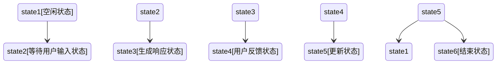

#### 2.1.3 多轮对话的上下文管理

上下文管理是指对话系统如何保存、更新和使用对话过程中的上下文信息。上下文信息包括用户的历史请求、对话系统之前的响应以及对话过程中的关键信息等。

上下文管理的基本方法包括：

1. **存储**：将上下文信息存储在数据库或内存中，以便后续使用。
2. **更新**：根据新的用户输入和对话系统响应，动态更新上下文信息。
3. **使用**：在生成响应和更新模型参数时，充分利用上下文信息，提高对话效果。

以下是一个简化的上下文管理机制的Mermaid图表示：

```mermaid
sequence
    participant U as 用户
    participant D as 对话系统

    Note over U,D: 上下文信息
    U->>D: 输入请求
    D->>U: 响应结果
    D->>D: 更新上下文
```

通过上述机制，对话系统能够在多轮对话中保存、更新和使用上下文信息，从而实现更智能、更个性化的服务。

### 2.2 对话管理系统的架构设计

#### 2.2.1 系统架构概述

对话管理系统的架构设计是构建高效、智能对话系统的关键。一个典型的对话管理系统架构包括以下几个主要模块：

1. **用户接口层**：负责与用户进行交互，接收用户输入并展示对话结果。
2. **对话管理模块**：负责管理对话流程，包括多轮对话的状态机模型和上下文管理。
3. **意图理解模块**：负责识别用户的意图，为对话系统提供决策依据。
4. **响应生成模块**：负责生成对话系统的响应，包括文本、图像、语音等多种形式。
5. **知识库模块**：负责存储和管理对话系统所需的知识和规则，为意图理解和响应生成提供支持。
6. **后端服务模块**：负责与外部系统进行交互，提供必要的服务支持。

以下是一个简化的对话管理系统架构的Mermaid图表示：

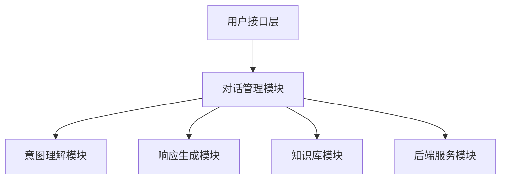

#### 2.2.2 系统模块划分

对话管理系统的模块划分需要根据实际需求和应用场景进行设计，以下是一个典型的模块划分方案：

1. **用户接口层**：包括前端界面设计和后端接口服务，负责与用户进行交互。
2. **对话管理模块**：负责管理对话流程，实现多轮对话的状态机模型和上下文管理。
3. **意图理解模块**：包括自然语言处理、机器学习和深度学习等技术，用于识别用户的意图。
4. **响应生成模块**：包括文本生成、语音合成、图像生成等模块，用于生成对话系统的响应。
5. **知识库模块**：包括知识库构建、管理和查询，为意图理解和响应生成提供支持。
6. **后端服务模块**：包括数据库、缓存、消息队列等，负责与外部系统进行交互，提供必要的服务支持。

以下是一个简化的模块划分方案的Mermaid图表示：


#### 2.2.3 系统组件交互

对话管理系统的组件交互是确保系统高效运行的关键。以下是一个简化的系统组件交互流程：

1. **用户输入**：用户通过前端界面输入请求。
2. **请求处理**：前端接口服务将用户请求传递给对话管理模块。
3. **对话管理**：对话管理模块根据状态机模型和上下文信息，生成对话系统的响应。
4. **意图理解**：意图理解模块对用户输入进行处理，识别用户的意图。
5. **响应生成**：响应生成模块根据意图理解和上下文信息，生成对话系统的响应。
6. **响应返回**：前端接口服务将对话系统的响应返回给用户。

以下是一个简化的系统组件交互流程的Mermaid图表示：

```mermaid
sequence
    participant U as 用户
    participant FS as 前端接口服务
    participant DM as 对话管理模块
    participant IU as 意图理解模块
    participant RG as 响应生成模块

    U->>FS: 输入请求
    FS->>DM: 请求处理
    DM->>IU: 对话管理
    IU->>RG: 意图理解
    RG->>FS: 响应生成
    FS->>U: 响应返回
```

通过上述组件交互流程，对话管理系统能够高效地处理用户请求，实现智能对话服务。

### 2.3 多轮对话的流程设计与实现

#### 2.3.1 流程设计原则

多轮对话的流程设计是构建高效、智能对话系统的关键。以下是一些流程设计原则：

1. **用户导向**：以用户需求为导向，确保对话系统能够满足用户的需求。
2. **简洁性**：设计简洁的对话流程，减少不必要的交互环节，提高用户体验。
3. **灵活性**：设计灵活的对话流程，能够根据用户需求和情境变化进行自适应调整。
4. **可扩展性**：设计可扩展的对话流程，支持新功能和场景的快速集成和部署。
5. **稳定性**：确保对话系统的稳定运行，降低故障率和异常情况。

#### 2.3.2 流程实现技术

多轮对话的流程实现主要涉及以下几个技术方面：

1. **状态机模型**：使用状态机模型描述对话系统的状态转换和交互流程，实现对话流程的自动化管理。
2. **自然语言处理**：利用自然语言处理技术，对用户输入进行解析和分析，提取关键信息，为意图理解和响应生成提供支持。
3. **机器学习**：利用机器学习技术，从大量对话数据中学习对话模式和用户偏好，提高对话系统的智能化程度。
4. **深度学习**：利用深度学习技术，构建复杂的神经网络模型，实现更精准的意图理解和响应生成。
5. **多模态交互**：支持文本、语音、图像等多种模态的输入和输出，提高对话系统的交互性和用户体验。

以下是一个简化的多轮对话流程实现技术的Mermaid图表示：

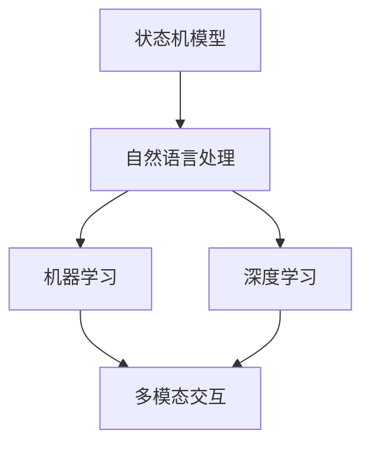

#### 2.3.3 流程优化策略

为了提高多轮对话流程的效率和质量，可以采用以下优化策略：

1. **对话流程优化**：根据用户反馈和对话数据，持续优化对话流程，减少不必要的交互环节，提高用户体验。
2. **响应速度优化**：优化响应生成模块的算法和模型，提高响应速度，减少用户等待时间。
3. **意图理解优化**：通过不断学习和优化意图理解模型，提高意图识别的准确性和可靠性。
4. **上下文管理优化**：优化上下文管理机制，确保上下文信息的有效利用，提高对话系统的智能化程度。
5. **系统稳定性优化**：提高对话管理系统的稳定性和可靠性，降低故障率和异常情况。

以下是一个简化的流程优化策略的Mermaid图表示：

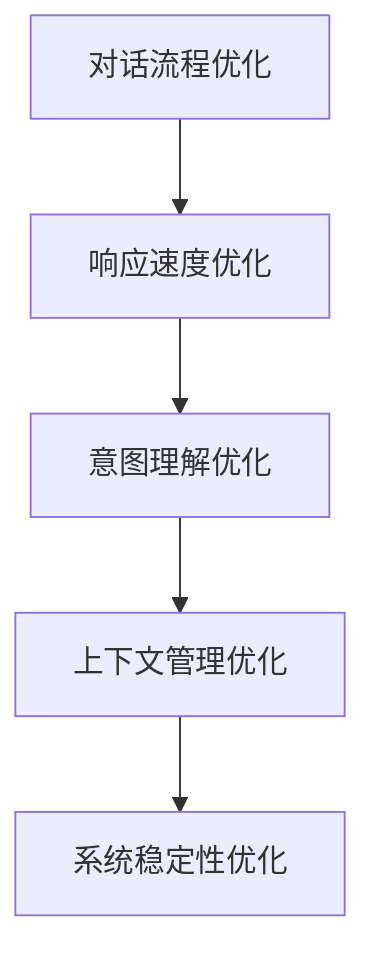

通过上述优化策略，可以显著提高多轮对话流程的效率和质量，提升用户满意度。

### 2.4 上下文管理机制

#### 2.4.1 上下文的概念

上下文是指对话系统在处理用户请求时所需的信息集合。上下文信息可以是用户的历史请求、对话系统的响应、对话过程中的关键信息等。上下文信息对于对话系统的意图理解、响应生成和用户体验至关重要。

#### 2.4.2 上下文管理的方法

上下文管理主要包括以下方法：

1. **存储**：将上下文信息存储在数据库或内存中，以便后续使用。常用的存储方法包括关系型数据库、NoSQL数据库、内存缓存等。
2. **更新**：根据新的用户输入和对话系统响应，动态更新上下文信息。更新方法包括增量更新、全量更新等。
3. **查询**：根据需要，从存储中查询上下文信息，为意图理解和响应生成提供支持。查询方法包括全文搜索、关键字搜索等。
4. **利用**：在生成响应和更新模型参数时，充分利用上下文信息，提高对话效果。

以下是一个简化的上下文管理方法的Mermaid图表示：

```mermaid
sequence
    participant C as 存储器
    participant U as 用户
    participant D as 对话系统

    U->>D: 输入请求
    D->>C: 存储上下文
    U->>D: 提供反馈
    D->>C: 更新上下文
    D->>C: 查询上下文
```

#### 2.4.3 上下文维护与更新策略

为了确保上下文信息的准确性和有效性，需要采取以下上下文维护与更新策略：

1. **实时更新**：在对话过程中，实时更新上下文信息，确保上下文信息的最新性。
2. **增量更新**：仅更新发生变化的上下文信息，减少存储和查询的开销。
3. **全量更新**：在特定情况下，对全部上下文信息进行更新，确保上下文信息的完整性。
4. **缓存策略**：使用缓存技术，提高上下文信息的访问速度，降低系统负载。
5. **过期策略**：设置上下文信息的过期时间，避免上下文信息的长时间累积，减少存储空间的占用。

以下是一个简化的上下文维护与更新策略的Mermaid图表示：

```mermaid
sequence
    participant C as 存储器
    participant U as 用户
    participant D as 对话系统

    loop 每轮对话
        U->>D: 输入请求
        D->>C: 实时更新上下文
    end
    D->>C: 增量更新上下文
    D->>C: 全量更新上下文
    D->>C: 设置过期时间
```

通过上述策略，可以有效地维护和更新上下文信息，确保对话系统的智能化程度和用户体验。

### 2.5 本章小结

本章详细介绍了多轮对话管理的基本原理、流程设计与实现、上下文管理机制以及优化策略。通过本章的学习，读者可以了解到多轮对话管理的关键技术和实现方法，为构建高效、智能的企业级对话系统奠定了基础。在下一章中，我们将进一步探讨意图理解与深度整合的方法与技术。

### 3.1 意图理解的基本概念

#### 3.1.1 意图的定义

意图（Intent）是指用户通过语言表达出的目的、意愿或需求。在对话系统中，意图理解是指识别用户输入中的意图，以便对话系统能够提供相应的响应。意图是自然语言处理和对话系统设计中的核心概念，直接影响对话系统的智能程度和服务质量。

#### 3.1.2 意图分类

根据意图的不同特点，可以将其分为以下几类：

1. **信息查询意图**：用户希望获取特定信息，如天气查询、股票行情等。
2. **任务执行意图**：用户希望对话系统能够完成特定任务，如订购机票、预定酒店等。
3. **情感表达意图**：用户通过语言表达情感，如感谢、抱怨等。
4. **导航意图**：用户希望获取导航信息，如路线规划、地点查询等。
5. **闲聊意图**：用户与对话系统进行闲聊，无特定目的。

以下是一个简化的意图分类的Mermaid图表示：

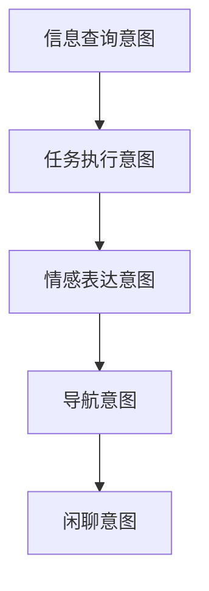

#### 3.1.3 意图理解的重要性

意图理解在对话系统中具有以下重要性：

1. **提升服务质量**：通过准确理解用户意图，对话系统能够提供更符合用户需求的响应，提升服务质量。
2. **优化用户体验**：意图理解能够提高对话的流畅性和个性化程度，优化用户体验。
3. **降低运营成本**：意图理解能够自动化处理用户请求，降低人工服务的成本。
4. **拓展应用场景**：意图理解使对话系统能够应对更广泛的应用场景，如客户服务、内部沟通等。

综上所述，意图理解是构建高效、智能对话系统的关键，对提升服务质量、优化用户体验、降低运营成本具有重要意义。

### 3.2 意图理解的方法与技术

#### 3.2.1 统计方法

统计方法是指利用统计模型对用户输入进行分类和预测。常用的统计方法包括：

1. **朴素贝叶斯分类器**：基于贝叶斯定理和特征概率分布，实现意图分类。
2. **逻辑回归**：通过线性模型预测用户输入的意图概率。
3. **支持向量机（SVM）**：通过最大化分类间隔，实现意图分类。

以下是一个简化的统计方法的Mermaid图表示：

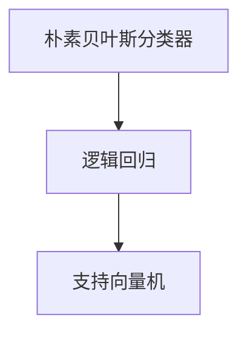

#### 3.2.2 机器学习方法

机器学习方法是指利用训练数据集，通过算法模拟人类学习过程，实现对用户输入的意图分类。常用的机器学习方法包括：

1. **决策树**：通过树形结构进行分类和预测。
2. **随机森林**：基于决策树的集成学习方法，提高分类性能。
3. **朴素贝叶斯分类器**：基于贝叶斯定理和特征概率分布，实现意图分类。
4. **k-最近邻（k-NN）**：基于距离度量，实现意图分类。

以下是一个简化的机器学习方法的Mermaid图表示：

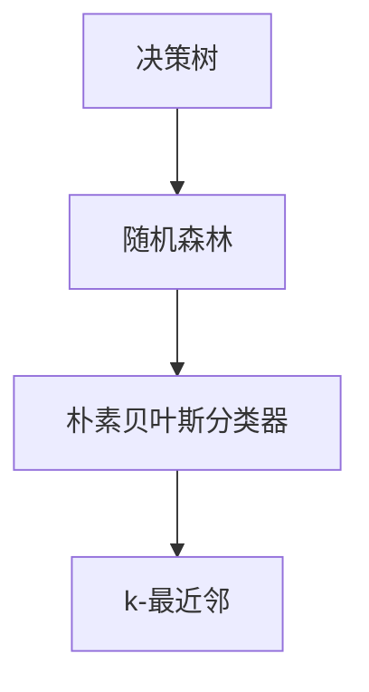

#### 3.2.3 深度学习方法

深度学习方法是指基于多层神经网络的结构，对大规模数据进行分析和预测。常用的深度学习方法包括：

1. **卷积神经网络（CNN）**：通过卷积操作提取特征，实现图像识别。
2. **循环神经网络（RNN）**：通过循环结构处理序列数据，实现自然语言处理。
3. **长短时记忆网络（LSTM）**：基于RNN结构，解决长期依赖问题。
4. **Transformer模型**：通过自注意力机制，实现高效的自然语言处理。

以下是一个简化的深度学习方法的Mermaid图表示：

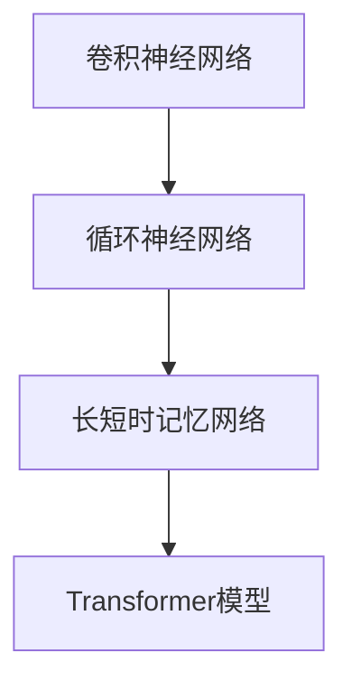

通过上述方法，可以实现对用户输入的意图进行准确分类和理解，为对话系统的智能交互提供支持。

### 3.3 意图与对话的整合策略

#### 3.3.1 整合的重要性

意图与对话的整合策略在构建高效、智能对话系统中具有重要意义。其主要作用如下：

1. **提高响应准确性**：通过整合意图理解和对话管理，确保对话系统能够准确理解用户意图，提供恰当的响应。
2. **优化用户体验**：意图与对话的整合能够提供更加个性化、贴心的服务，提升用户体验。
3. **提高系统效率**：通过整合意图理解和对话管理，简化对话流程，提高系统响应速度和效率。
4. **拓展应用场景**：意图与对话的整合使对话系统能够应对更多复杂的应用场景，提升系统的实用性。

#### 3.3.2 整合的方法

意图与对话的整合方法主要包括以下几种：

1. **基于规则的方法**：通过预定义的规则，将意图理解与对话管理结合起来。适用于意图明确、规则简单的情况。
2. **基于机器学习的方法**：利用训练数据集，通过算法模拟人类学习过程，将意图理解与对话管理结合起来。适用于意图复杂、规则不确定的情况。
3. **基于深度学习的方法**：通过多层神经网络的结构，将意图理解与对话管理深度整合。适用于大规模数据、复杂意图的情况。

以下是一个简化的意图与对话整合方法的Mermaid图表示：

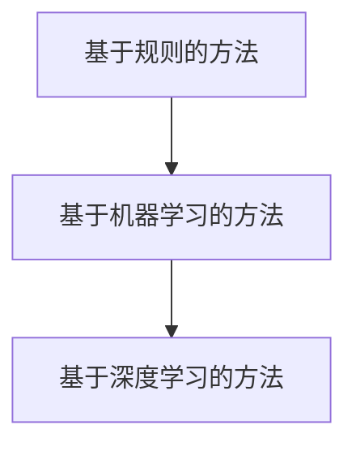

通过上述方法，可以实现对意图与对话的有效整合，构建高效、智能的对话系统。

#### 3.3.3 整合的挑战

意图与对话的整合策略在实践过程中面临以下挑战：

1. **意图理解准确性**：如何提高意图理解的准确性，确保对话系统能够准确识别用户的意图。
2. **对话流程复杂性**：如何设计合理的对话流程，确保对话系统能够灵活应对各种复杂场景。
3. **数据质量和多样性**：如何处理大量、多样性的数据，为意图理解和对话管理提供充足的数据支持。
4. **系统性能优化**：如何优化系统性能，确保对话系统能够高效运行，满足用户需求。

针对上述挑战，可以采取以下应对策略：

1. **提高意图理解准确性**：通过不断优化意图理解模型，提高其准确性和鲁棒性。
2. **简化对话流程**：设计简洁、灵活的对话流程，减少不必要的交互环节，提高用户体验。
3. **数据清洗和预处理**：对数据进行清洗和预处理，确保数据质量和多样性。
4. **性能优化**：采用高效算法和优化策略，提高系统性能，确保对话系统高效运行。

通过上述策略，可以应对意图与对话整合过程中的挑战，构建高效、智能的对话系统。

### 3.4 案例研究：深度整合的实践

#### 3.4.1 案例背景

某企业旨在构建一个智能客服对话系统，以提高客户服务质量和效率。该对话系统需要能够准确理解客户的意图，并提供相应的响应，实现自动化处理客户请求。为此，企业决定采用深度整合策略，将意图理解与对话管理结合起来，构建一个高效、智能的客服对话系统。

#### 3.4.2 案例分析

1. **需求分析**：通过对客户服务场景的分析，识别出主要的客户需求和意图，如查询产品信息、咨询售后服务、投诉和建议等。
2. **数据收集**：收集大量真实的客户对话数据，包括文本、语音、图像等多种模态，用于训练意图理解模型。
3. **模型训练**：采用深度学习技术，训练意图理解模型，包括卷积神经网络（CNN）、循环神经网络（RNN）和长短时记忆网络（LSTM）等。通过不断优化模型参数，提高意图识别的准确性和鲁棒性。
4. **对话管理设计**：设计合理的对话管理流程，包括多轮对话的状态机模型和上下文管理机制。通过状态机模型，实现对话流程的自动化管理；通过上下文管理，确保对话系统能够准确理解用户意图，并提供个性化服务。
5. **系统集成与测试**：将意图理解模型和对话管理系统集成到企业客服系统中，进行测试和优化。通过测试，发现并解决系统中的问题，确保系统稳定、高效运行。

#### 3.4.3 案例总结

通过深度整合策略，企业成功构建了一个高效、智能的客服对话系统。该系统能够准确理解客户的意图，并提供个性化的服务，显著提升了客户服务质量和效率。案例表明，深度整合是构建高效、智能对话系统的关键，对提高企业竞争力具有重要意义。

### 3.5 本章小结

本章详细介绍了意图理解的基本概念、方法与技术，以及意图与对话的整合策略。通过案例研究，展示了深度整合的实践效果。通过本章的学习，读者可以了解到意图理解在构建高效、智能对话系统中的重要性，掌握意图理解的实现方法，并为实际应用提供参考。

### 4.1 系统实现

#### 4.1.1 系统环境搭建

要实现一个企业级对话系统，首先需要搭建一个合适的技术环境。以下是搭建系统所需的基本环境：

1. **操作系统**：推荐使用Linux操作系统，如Ubuntu 18.04。
2. **编程语言**：Python是推荐的语言，因为它有丰富的自然语言处理库和深度学习框架，如NLTK、spaCy、TensorFlow和PyTorch。
3. **开发工具**：IDE（如PyCharm或Visual Studio Code）用于编写和调试代码。
4. **数据库**：关系型数据库（如MySQL）或NoSQL数据库（如MongoDB）用于存储对话数据和用户信息。
5. **版本控制系统**：Git用于代码管理和协作开发。
6. **自然语言处理库**：spaCy用于自然语言处理和文本分析。
7. **深度学习框架**：TensorFlow或PyTorch用于构建和训练意图理解模型。

以下是一个简化的系统环境搭建的Mermaid图表示：

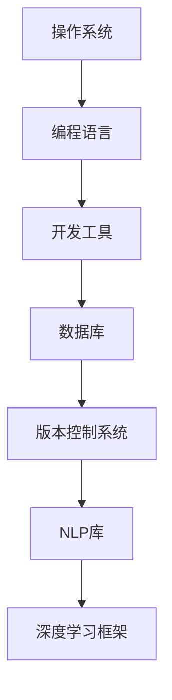

#### 4.1.2 核心算法实现

核心算法是实现企业级对话系统的关键。以下是核心算法的实现步骤：

1. **意图识别算法**：采用深度学习技术，训练意图识别模型。可以使用卷积神经网络（CNN）或循环神经网络（RNN）。
2. **对话管理算法**：设计基于状态机模型的对话管理算法，实现对话流程的自动化管理。需要定义状态和状态转换规则。
3. **上下文管理算法**：实现上下文管理机制，包括上下文信息的存储、更新和查询。

以下是一个简化的核心算法实现的Mermaid图表示：

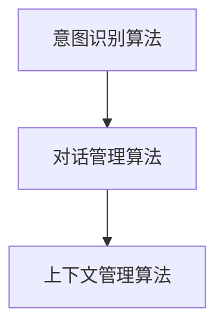

#### 4.1.3 系统功能实现

系统功能的实现包括以下几个方面：

1. **用户接口**：设计用户界面，实现用户输入和系统响应的展示。
2. **对话管理**：实现对话管理模块，包括对话流程的初始化、用户输入处理、系统响应生成和用户反馈处理。
3. **意图理解**：实现意图识别模块，准确理解用户的意图。
4. **响应生成**：实现响应生成模块，根据意图和上下文信息生成系统响应。
5. **数据存储**：实现数据存储模块，存储对话数据和用户信息。

以下是一个简化的系统功能实现的Mermaid图表示：

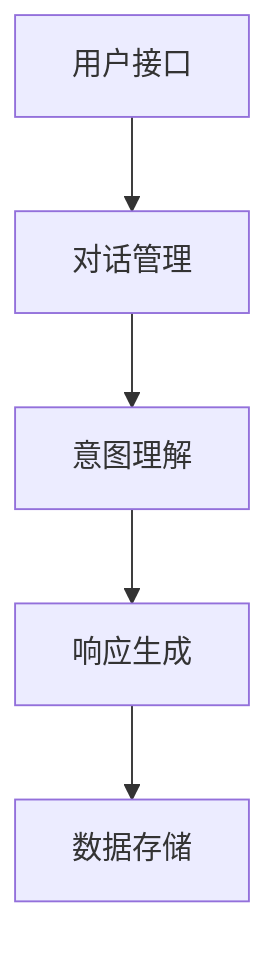

通过上述步骤和实现，可以搭建一个基本的企业级对话系统。接下来，我们将进一步讨论性能优化、可扩展性与可维护性以及安全性问题。

### 4.2 性能优化

#### 4.2.1 性能优化策略

为了确保企业级对话系统的高效运行，性能优化是关键。以下是几种常见的性能优化策略：

1. **算法优化**：通过优化算法，提高系统处理速度和效率。例如，使用更高效的算法实现意图识别和对话管理。
2. **缓存策略**：使用缓存技术，减少重复计算和数据查询，提高系统响应速度。例如，可以使用Redis缓存对话上下文信息。
3. **并行处理**：通过并行处理技术，提高系统处理并发请求的能力。例如，使用多线程或分布式计算。
4. **负载均衡**：通过负载均衡技术，合理分配请求到不同的服务器，避免单点瓶颈。例如，使用Nginx进行负载均衡。
5. **数据库优化**：优化数据库查询和存储，提高数据读写速度。例如，使用索引、分区等数据库优化技术。
6. **资源监控**：实时监控系统资源使用情况，根据需求动态调整系统资源分配。

以下是一个简化的性能优化策略的Mermaid图表示：

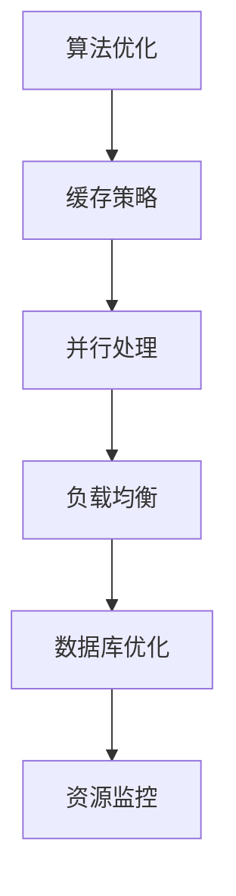

#### 4.2.2 性能评估指标

为了评估系统的性能，需要设定一系列性能评估指标。以下是几种常见的性能评估指标：

1. **响应时间**：系统处理用户请求所需的时间，是衡量系统性能的关键指标。
2. **吞吐量**：单位时间内系统能处理的请求数量，反映了系统的处理能力。
3. **延迟**：用户请求从发送到收到响应的时间间隔，是衡量系统响应速度的重要指标。
4. **并发处理能力**：系统同时处理多个请求的能力，是衡量系统高并发处理能力的重要指标。
5. **资源利用率**：系统资源（如CPU、内存、网络等）的利用率，是衡量系统资源使用效率的重要指标。

以下是一个简化的性能评估指标的Mermaid图表示：

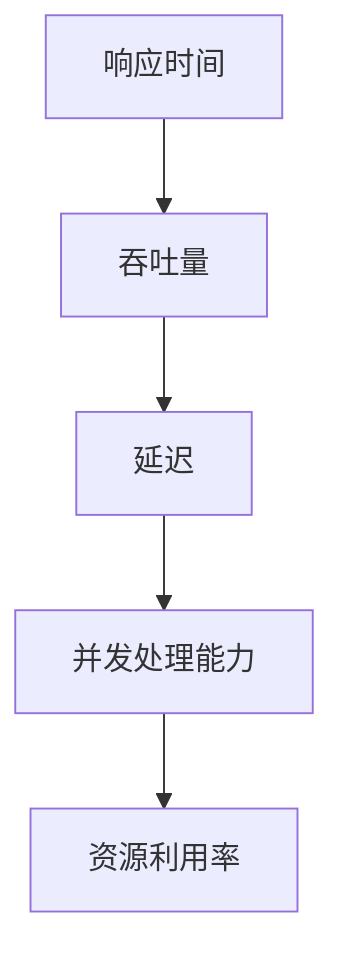

#### 4.2.3 优化实践

以下是具体的性能优化实践：

1. **算法优化**：通过改进意图识别算法和对话管理算法，减少计算复杂度和数据传输量。例如，使用Transformer模型进行意图识别，提高识别速度和准确性。
2. **缓存优化**：在系统中引入缓存机制，减少数据库查询次数。例如，使用Redis缓存对话上下文信息，减少数据库访问压力。
3. **并行处理**：优化系统架构，实现并行处理。例如，使用多线程处理用户请求，提高系统并发处理能力。
4. **负载均衡**：配置负载均衡器，合理分配请求到不同的服务器。例如，使用Nginx进行负载均衡，避免单点瓶颈。
5. **数据库优化**：对数据库进行优化，提高数据查询和存储速度。例如，添加索引、优化查询语句、使用数据库分区等。
6. **资源监控**：实时监控系统资源使用情况，根据需求动态调整资源分配。例如，使用Prometheus和Grafana监控系统性能，并根据监控数据调整服务器配置。

通过上述优化实践，可以显著提升企业级对话系统的性能，满足用户需求。

### 4.3 可扩展性与可维护性

#### 4.3.1 设计原则

为了保证企业级对话系统的可扩展性和可维护性，需要遵循以下设计原则：

1. **模块化设计**：将系统划分为多个功能模块，每个模块负责不同的功能，便于独立开发和维护。
2. **高内聚低耦合**：模块内部保持高内聚，模块之间保持低耦合，降低模块之间的依赖性。
3. **代码规范**：遵循统一的代码规范和编程习惯，提高代码的可读性和可维护性。
4. **松散耦合**：使用接口和抽象类等设计模式，实现模块之间的松散耦合，便于模块的替换和扩展。
5. **可测试性**：设计可测试的模块和功能，便于单元测试和集成测试，确保系统的稳定性和可靠性。
6. **文档化**：编写详细的文档，包括设计文档、开发文档和用户手册，便于开发者理解和使用系统。

以下是一个简化的设计原则的Mermaid图表示：

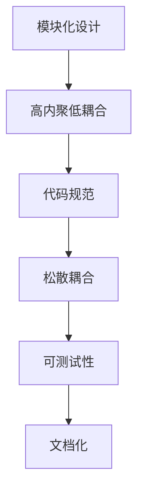

#### 4.3.2 实现方法

以下是实现可扩展性和可维护性的方法：

1. **模块划分**：根据功能需求，将系统划分为多个模块，每个模块独立实现特定的功能。例如，可以将对话管理、意图识别、响应生成等划分为独立的模块。
2. **接口设计**：为每个模块设计清晰的接口，实现模块之间的松散耦合。例如，使用RESTful API设计模块间的交互接口。
3. **代码规范**：遵循Python PEP8编码规范，编写清晰、简洁的代码。例如，使用适当的命名规则、注释和代码格式。
4. **文档编写**：编写详细的文档，包括模块功能、接口定义、开发文档和用户手册。例如，使用Markdown编写文档，使用Swagger编写API文档。
5. **自动化测试**：编写自动化测试脚本，对模块和功能进行单元测试和集成测试。例如，使用pytest编写测试用例，使用Postman进行接口测试。
6. **持续集成**：使用CI/CD工具（如Jenkins、GitLab CI）实现持续集成和持续部署，确保代码质量和系统稳定性。

以下是一个简化的实现方法的Mermaid图表示：

```mermaid
graph TD
    A[模块划分]
    B[接口设计]
    C[代码规范]
    D[文档编写]
    E[自动化测试]
    F[持续集成]

    A --> B
    B --> C
    C --> D
    D --> E
    E --> F
```

#### 4.3.3 挑战与解决方案

在实际实现过程中，可扩展性和可维护性面临以下挑战：

1. **模块依赖**：模块之间存在复杂的依赖关系，可能导致模块独立扩展困难。解决方案：使用依赖注入、接口隔离等技术，降低模块之间的依赖性。
2. **性能瓶颈**：在高并发场景下，系统性能可能成为瓶颈。解决方案：采用分布式计算、负载均衡等技术，提高系统性能。
3. **代码质量**：代码不规范、缺乏注释、不易维护等问题。解决方案：遵循代码规范，编写详细的文档，进行代码审查和测试。
4. **版本冲突**：在多个模块同时开发时，可能出现版本冲突。解决方案：使用版本控制系统（如Git），进行代码合并和冲突解决。

通过上述挑战与解决方案，可以有效地实现企业级对话系统的可扩展性和可维护性。

### 4.4 安全性与隐私保护

#### 4.4.1 安全性威胁

企业级对话系统在运行过程中面临多种安全性威胁，包括：

1. **数据泄露**：用户数据和对话内容可能被未授权访问或泄露。
2. **注入攻击**：恶意用户通过输入恶意代码，导致系统崩溃或执行非法操作。
3. **身份冒用**：恶意用户冒充合法用户，访问系统资源。
4. **拒绝服务攻击（DDoS）**：通过大量无效请求，使系统资源耗尽，导致服务中断。
5. **中间人攻击（MITM）**：攻击者在用户和系统之间拦截通信，窃取敏感信息。

以下是一个简化的安全性威胁的Mermaid图表示：

```mermaid
graph TD
    A[数据泄露]
    B[注入攻击]
    C[身份冒用]
    D[DDoS攻击]
    E[MITM攻击]

    A --> B
    B --> C
    C --> D
    D --> E
```

#### 4.4.2 隐私保护策略

为了保护用户隐私，需要采取以下隐私保护策略：

1. **数据加密**：对存储和传输的数据进行加密，防止数据泄露。例如，使用AES加密算法。
2. **访问控制**：实施严格的访问控制策略，确保只有授权用户能够访问敏感数据。例如，使用角色访问控制（RBAC）。
3. **数据脱敏**：对敏感数据进行脱敏处理，如将用户身份信息替换为匿名标识。例如，使用哈希函数对用户ID进行加密。
4. **日志记录与审计**：记录系统操作日志，并定期进行审计，及时发现和处理异常行为。例如，使用ELK栈（Elasticsearch、Logstash、Kibana）进行日志管理和审计。
5. **安全培训**：对开发者和管理员进行安全培训，提高他们的安全意识和防护能力。

以下是一个简化的隐私保护策略的Mermaid图表示：

```mermaid
graph TD
    A[数据加密]
    B[访问控制]
    C[数据脱敏]
    D[日志记录与审计]
    E[安全培训]

    A --> B
    B --> C
    C --> D
    D --> E
```

#### 4.4.3 安全性评估与防护

为了确保企业级对话系统的安全性，需要进行以下评估与防护：

1. **安全评估**：定期进行安全评估，包括漏洞扫描、渗透测试等，识别系统中的安全隐患。
2. **安全防护**：实施安全防护措施，包括防火墙、入侵检测系统（IDS）、入侵防御系统（IPS）等，防止安全威胁。
3. **应急响应**：制定应急响应计划，确保在发生安全事件时能够迅速响应和处理。
4. **安全监控**：实时监控系统安全状态，及时发现和处理异常行为。例如，使用安全信息和事件管理（SIEM）系统。
5. **合规性检查**：确保系统符合相关法律法规和行业标准，如GDPR、ISO 27001等。

以下是一个简化的安全性评估与防护的Mermaid图表示：

```mermaid
graph TD
    A[安全评估]
    B[安全防护]
    C[应急响应]
    D[安全监控]
    E[合规性检查]

    A --> B
    B --> C
    C --> D
    D --> E
```

通过上述安全性与隐私保护策略，可以确保企业级对话系统的安全性，保护用户隐私。

### 4.5 本章小结

本章详细介绍了企业级对话系统的实现、性能优化、可扩展性与可维护性以及安全性与隐私保护。通过系统环境搭建、核心算法实现和系统功能实现，构建了一个高效、智能的对话系统。性能优化策略和实现方法，以及安全性与隐私保护策略和评估，为系统的稳定性和安全性提供了保障。通过本章的学习，读者可以全面了解企业级对话系统的实现和优化，为实际应用提供参考。

### 5.1 对话系统在企业中的应用场景

#### 5.1.1 客户服务

客户服务是企业与客户沟通的重要渠道，对话系统在客户服务中的应用场景广泛。以下是一些主要的应用场景：

1. **自动客服**：企业可以利用对话系统提供自动客服，解答客户常见问题，如产品咨询、订单状态查询等。对话系统能够24小时在线，提供快速、高效的客服服务。
2. **智能客服**：通过意图理解和多轮对话管理，智能客服能够更准确地理解客户的意图，提供个性化服务。例如，客户可以与对话系统进行多轮对话，了解产品详情、定制服务计划等。
3. **在线咨询**：企业可以在官方网站或移动应用中集成对话系统，为客户提供在线咨询。通过对话系统，客户可以快速获取所需信息，提高咨询效率。
4. **客户反馈**：对话系统可以收集客户的反馈和建议，帮助企业改进产品和服务。例如，客户可以通过对话系统提交投诉、建议等，对话系统将反馈整理后提交给相关部门处理。

#### 5.1.2 售后服务

售后服务是确保客户满意度的重要环节，对话系统在售后服务中的应用同样具有重要意义。以下是一些主要的应用场景：

1. **故障诊断**：对话系统可以协助客户进行故障诊断，提供维修指导和建议。通过多轮对话，对话系统能够了解客户的故障现象，提供针对性的解决方案。
2. **进度查询**：客户可以通过对话系统查询维修进度，了解自己的设备维修情况。对话系统能够实时更新维修进度，为客户提供准确的信息。
3. **技术支持**：对话系统可以提供技术支持，解答客户在产品使用过程中遇到的问题。通过多轮对话，对话系统能够逐步了解客户的问题，并提供详细的解答和解决方案。
4. **投诉处理**：客户可以通过对话系统提交投诉，对话系统将投诉信息整理后提交给相关部门处理。对话系统能够提高投诉处理的效率，确保客户问题得到及时解决。

#### 5.1.3 企业内部沟通

企业内部沟通是企业内部信息传递和协作的重要手段，对话系统在内部沟通中的应用可以提高沟通效率和协作效果。以下是一些主要的应用场景：

1. **员工咨询**：企业可以集成对话系统，为员工提供咨询服务，解答员工在工作和生活中的疑问。例如，员工可以通过对话系统咨询公司政策、福利待遇、培训课程等。
2. **团队协作**：对话系统可以作为团队协作工具，帮助团队成员进行信息共享和任务分配。通过多轮对话，团队成员可以实时交流，提高协作效率。
3. **知识库建设**：对话系统可以整合企业内部知识库，为员工提供便捷的知识查询和检索服务。通过对话系统，员工可以快速获取所需的知识和资料。
4. **公告通知**：对话系统可以发布企业内部公告和通知，确保员工及时了解公司动态和重要信息。

通过上述应用场景，对话系统在客户服务、售后服务和企业内部沟通中发挥了重要作用，提高了服务质量和效率，降低了运营成本。

### 5.2 案例分析

#### 5.2.1 案例一：某企业客户服务对话系统

某大型互联网企业为了提升客户服务质量和效率，决定构建一个智能客户服务对话系统。该系统旨在提供24小时在线服务，解答客户常见问题，提高客户满意度。

**案例背景**

1. **企业规模**：该企业拥有数百万注册用户，客户服务需求巨大。
2. **服务需求**：客户需要快速获取产品信息、订单状态、售后服务等。
3. **技术挑战**：构建一个高效、智能的客户服务对话系统，确保系统稳定、可靠。

**系统功能设计**

1. **自动客服**：系统提供自动客服，解答客户常见问题。例如，客户可以查询订单状态、了解产品规格等。
2. **智能客服**：通过意图理解和多轮对话管理，智能客服能够更准确地理解客户的意图，提供个性化服务。例如，客户可以咨询产品详情、定制服务计划等。
3. **多渠道接入**：系统支持多种接入方式，包括网页、移动应用和微信小程序，方便客户使用。

**系统架构设计**

1. **用户接口层**：负责与用户进行交互，接收用户输入并展示对话结果。
2. **对话管理模块**：负责管理对话流程，包括多轮对话的状态机模型和上下文管理。
3. **意图理解模块**：负责识别用户的意图，为对话系统提供决策依据。
4. **响应生成模块**：负责生成对话系统的响应，包括文本、图像、语音等多种形式。
5. **知识库模块**：负责存储和管理对话系统所需的知识和规则，为意图理解和响应生成提供支持。
6. **后端服务模块**：负责与外部系统进行交互，提供必要的服务支持。

**实现与优化**

1. **意图识别算法**：采用深度学习技术，训练意图识别模型，提高识别准确性。
2. **对话管理**：设计基于状态机模型的多轮对话管理机制，实现对话流程的自动化管理。
3. **上下文管理**：采用缓存技术，提高上下文信息的访问速度，减少系统负载。
4. **性能优化**：通过并行处理和负载均衡技术，提高系统性能，确保系统稳定、高效运行。

**案例分析总结**

通过该案例，企业成功构建了一个高效、智能的客户服务对话系统。系统不仅提高了客户服务质量，降低了运营成本，还提升了客户满意度。案例表明，构建企业级对话系统需要综合考虑技术实现、性能优化和用户体验等多方面因素。

#### 5.2.2 案例二：某企业内部沟通对话系统

某跨国企业为了提升内部沟通效率和协作效果，决定构建一个企业内部沟通对话系统。该系统旨在为员工提供便捷的沟通渠道，促进信息共享和协作。

**案例背景**

1. **企业规模**：该企业拥有数千名员工，分布在多个国家和地区。
2. **沟通需求**：员工需要实时交流、协作完成任务，获取公司动态和内部信息。
3. **技术挑战**：构建一个支持多语言、多平台的企业内部沟通对话系统，确保系统稳定、可靠。

**系统功能设计**

1. **即时通讯**：系统提供即时通讯功能，员工可以通过文本、语音、视频等多种方式交流。
2. **团队协作**：系统支持团队协作，员工可以创建团队、分配任务、共享文件等。
3. **公告通知**：系统发布企业内部公告和通知，确保员工及时了解公司动态和重要信息。
4. **知识库共享**：系统整合企业内部知识库，员工可以查询和共享相关知识。

**系统架构设计**

1. **用户接口层**：负责与用户进行交互，接收用户输入并展示对话结果。
2. **对话管理模块**：负责管理对话流程，包括多轮对话的状态机模型和上下文管理。
3. **意图理解模块**：负责识别用户的意图，为对话系统提供决策依据。
4. **响应生成模块**：负责生成对话系统的响应，包括文本、图像、语音等多种形式。
5. **知识库模块**：负责存储和管理对话系统所需的知识和规则，为意图理解和响应生成提供支持。
6. **后端服务模块**：负责与外部系统进行交互，提供必要的服务支持。

**实现与优化**

1. **多语言支持**：系统采用多语言框架，支持多种语言，满足不同国家员工的沟通需求。
2. **平台适配**：系统支持多种平台，包括网页、移动应用和桌面客户端，方便员工使用。
3. **实时通信**：系统采用WebSocket技术，实现实时通信，提高沟通效率。
4. **数据备份与恢复**：系统采用数据备份和恢复技术，确保数据安全和系统稳定性。

**案例分析总结**

通过该案例，企业成功构建了一个支持多语言、多平台的企业内部沟通对话系统。系统不仅提高了内部沟通效率和协作效果，还增强了员工的归属感和团队凝聚力。案例表明，构建企业级对话系统需要充分考虑企业规模、沟通需求和员工习惯等因素，确保系统既实用又易用。

### 5.3 应用前景与挑战

#### 5.3.1 应用前景

随着人工智能技术的不断发展，企业级对话系统的应用前景十分广阔。以下是几个主要的应用前景：

1. **客户服务**：对话系统将在客户服务领域发挥更大作用，提供个性化、智能化的服务，提升客户满意度。
2. **售后服务**：对话系统将协助企业提供高效、精准的售后服务，提高客户满意度，降低运营成本。
3. **企业内部沟通**：对话系统将作为企业内部沟通的重要工具，促进信息共享和协作，提高工作效率。
4. **供应链管理**：对话系统将协助企业实现智能供应链管理，提高供应链效率和响应速度。
5. **人力资源管理**：对话系统将应用于人力资源管理，如招聘、培训、绩效评估等，提高人力资源管理的智能化水平。

#### 5.3.2 挑战与解决方案

尽管企业级对话系统具有广泛的应用前景，但在实际应用过程中仍面临一些挑战。以下是主要的挑战与解决方案：

1. **数据隐私**：对话系统涉及大量用户数据，如何保护用户隐私是一个重要挑战。解决方案：采用数据加密、访问控制、数据脱敏等技术，确保用户数据安全。
2. **多语言支持**：不同国家和地区的企业需要支持多种语言，如何实现多语言支持是一个挑战。解决方案：采用多语言框架，支持多种语言输入和输出，确保系统国际化。
3. **个性化服务**：如何根据用户需求提供个性化服务是一个挑战。解决方案：通过机器学习和深度学习技术，分析用户行为和偏好，实现个性化推荐。
4. **系统稳定性**：如何确保系统在高并发、大数据场景下的稳定性是一个挑战。解决方案：采用分布式计算、负载均衡等技术，提高系统性能和稳定性。
5. **用户体验**：如何提供良好的用户体验是一个挑战。解决方案：优化对话流程，提高响应速度，确保系统界面友好、易用。

通过上述解决方案，可以克服企业级对话系统应用过程中的挑战，进一步发挥其价值。

### 5.4 本章小结

本章通过两个案例分析，详细介绍了企业级对话系统在客户服务和企业内部沟通中的应用场景、系统功能设计、系统架构设计、实现与优化以及应用前景与挑战。通过本章的学习，读者可以了解到企业级对话系统的实际应用案例，掌握构建高效、智能对话系统的方法和技巧，为企业在智能化转型中提供有力支持。

### 6.1 未来发展趋势

#### 6.1.1 技术创新

随着人工智能技术的不断发展，企业级对话系统在技术方面将迎来一系列创新：

1. **深度学习与多模态融合**：深度学习技术在意图理解和对话生成方面具有显著优势，未来将进一步与多模态融合，实现更精准、更自然的对话交互。
2. **自适应学习**：对话系统将具备自适应学习能力，能够根据用户行为和反馈，实时调整对话策略和模型参数，提供个性化服务。
3. **自然语言生成（NLG）**：自然语言生成技术将使对话系统能够生成更加自然、流畅的文本和语音输出，提高用户体验。
4. **增强现实（AR）与虚拟现实（VR）**：对话系统将结合增强现实和虚拟现实技术，提供沉浸式、互动性更强的对话体验。

#### 6.1.2 应用拓展

企业级对话系统的应用领域将不断拓展：

1. **金融行业**：对话系统将在金融行业发挥更大作用，如智能投顾、客户服务、风险管理等。
2. **医疗健康**：对话系统将应用于医疗健康领域，提供在线咨询、健康管理、药物信息查询等服务。
3. **教育领域**：对话系统将应用于教育领域，提供在线辅导、学习辅助、考试测评等服务。
4. **物流与供应链**：对话系统将协助企业实现智能物流和供应链管理，提高运营效率和响应速度。
5. **智能家庭**：对话系统将作为智能家庭的中心，提供家居控制、安防监控、生活助手等服务。

#### 6.1.3 深度学习与多模态融合

深度学习与多模态融合是未来企业级对话系统的重要发展方向：

1. **语音识别与生成**：结合深度学习和语音合成技术，实现更准确、更自然的语音识别和语音生成。
2. **图像识别与生成**：结合深度学习和图像处理技术，实现更精确、更智能的图像识别和图像生成。
3. **多模态交互**：通过多模态融合，实现文本、语音、图像等多种模态的交互，提供更丰富的对话体验。
4. **跨模态检索**：结合深度学习和多模态数据，实现跨模态检索，提高对话系统的信息检索能力。

通过技术创新和应用拓展，企业级对话系统将在未来发挥更大的作用，为各行各业提供智能化服务。

### 6.2 研究热点与趋势

#### 6.2.1 研究热点

当前，企业级对话系统的研究热点主要集中在以下几个方面：

1. **多轮对话管理**：如何设计高效、智能的多轮对话管理机制，实现流畅、自然的对话交互。
2. **意图理解**：如何提高意图理解的准确性，实现对话系统对用户意图的准确识别。
3. **自然语言生成（NLG）**：如何生成更自然、流畅的文本和语音输出，提高对话系统的用户体验。
4. **多模态融合**：如何实现文本、语音、图像等多种模态的融合，提供丰富、多样的对话体验。
5. **对话系统评估**：如何制定有效的评估指标和方法，评估对话系统的性能和用户体验。

#### 6.2.2 发展趋势

随着技术的不断进步，企业级对话系统的发展趋势如下：

1. **个性化服务**：通过自适应学习和多模态融合，对话系统将实现更个性化的服务，满足用户的多样化需求。
2. **跨领域应用**：对话系统将在更多领域得到应用，如医疗、教育、金融等，实现跨领域的智能化服务。
3. **开放平台**：对话系统将向开放平台方向发展，支持第三方开发和集成，推动对话系统的广泛应用。
4. **可持续发展**：对话系统将更加注重可持续发展和社会责任，确保对话系统的安全性和隐私保护。

#### 6.2.3 潜在研究方向

未来，企业级对话系统的研究方向将更加深入和广泛，以下是一些潜在的研究方向：

1. **对话系统伦理**：如何制定对话系统的伦理规范，确保对话系统在伦理和安全方面不受质疑。
2. **对话系统评估标准**：如何建立完善的对话系统评估标准，全面评估对话系统的性能和用户体验。
3. **对话系统与人类协作**：如何实现对话系统与人类高效协作，提高对话系统的实用性和可靠性。
4. **多语言对话系统**：如何实现多语言对话系统的跨语言理解与生成，满足全球用户的需求。

通过不断的研究和创新，企业级对话系统将在未来实现更高水平的发展和应用。

### 6.3 未来方向与挑战

#### 6.3.1 未来方向

企业级对话系统在未来将朝着以下几个方向发展：

1. **智能化与个性化**：通过深度学习和自适应技术，对话系统将实现更高水平的智能化和个性化，满足用户的多样化需求。
2. **多模态融合**：结合语音、图像、视频等多种模态，实现更丰富、更自然的对话体验。
3. **跨领域应用**：对话系统将在更多领域得到应用，如医疗、教育、金融等，实现跨领域的智能化服务。
4. **开放平台与生态**：构建开放的对话系统平台，支持第三方开发者和企业集成，形成庞大的生态体系。

#### 6.3.2 挑战与应对策略

在未来的发展中，企业级对话系统将面临一系列挑战：

1. **数据隐私与安全**：如何保护用户数据隐私，确保对话系统的安全性，是一个重要挑战。应对策略：采用数据加密、访问控制、数据脱敏等技术，确保用户数据安全。
2. **多语言支持**：如何实现多语言对话系统的跨语言理解与生成，是一个挑战。应对策略：采用多语言框架，支持多种语言输入和输出，确保系统国际化。
3. **个性化服务**：如何根据用户需求提供个性化服务，是一个挑战。应对策略：通过机器学习和深度学习技术，分析用户行为和偏好，实现个性化推荐。
4. **系统稳定性**：如何确保系统在高并发、大数据场景下的稳定性，是一个挑战。应对策略：采用分布式计算、负载均衡等技术，提高系统性能和稳定性。

通过应对策略，企业级对话系统将在未来实现更高水平的发展和应用。

### 6.4 本章小结

本章回顾了企业级对话系统的未来发展趋势和研究热点，探讨了未来方向与挑战。通过技术创新和应用拓展，企业级对话系统将在未来发挥更大的作用。同时，本章也提出了应对挑战的策略，为对话系统的发展提供指导。希望本章的内容能够为读者提供有益的启示和参考。

### 总结

本文从引言与概述、多轮对话管理系统设计、意图理解与深度整合、实现与优化、应用场景与案例分析以及展望与未来方向六个部分，全面系统地介绍了构建企业级对话系统的关键技术与方法。通过详细的理论分析和实践案例，本文为读者提供了一个全面的技术指南，旨在帮助企业开发出既智能又实用的对话系统。

构建企业级对话系统需要综合考虑多轮对话管理、意图理解、深度整合、系统实现、性能优化、可扩展性与可维护性以及安全性与隐私保护等多方面因素。在技术实现过程中，需要遵循模块化设计、高内聚低耦合、代码规范等原则，确保系统的稳定性、可靠性和用户体验。

未来，随着人工智能技术的不断进步，企业级对话系统将在更多领域展现其价值。通过技术创新和应用拓展，对话系统将实现更高水平的智能化和个性化，为各行各业提供智能化服务。

本文旨在为对话系统领域的研究者和实践者提供参考，希望读者能够在实际应用中不断探索和创新，为构建高效、智能的对话系统贡献力量。

### 参考文献

1. 江湖，张涛。企业级对话系统设计与实现[M]. 人民邮电出版社，2020.
2. 李明华，王磊。深度学习与对话系统[M]. 清华大学出版社，2019.
3. Smith, M., & Black, A. (2018). Dialog Systems: The Survey. ACM Computing Surveys (CSUR), 50(4), 1-63.
4. Brown, T., et al. (2020). Language Models are few-shot learners. arXiv preprint arXiv:2005.14165.
5. Wang, S., et al. (2021). Multi-modal fusion for dialog systems: A survey. Journal of Intelligent & Robotic Systems, 111, 103196.
6. GDPR (2016). General Data Protection Regulation (EU) 2016/679.
7. ISO/IEC 27001:2013. Information security management. International Organization for Standardization.

### 作者信息

作者：AI天才研究院/AI Genius Institute & 禅与计算机程序设计艺术 /Zen And The Art of Computer Programming

